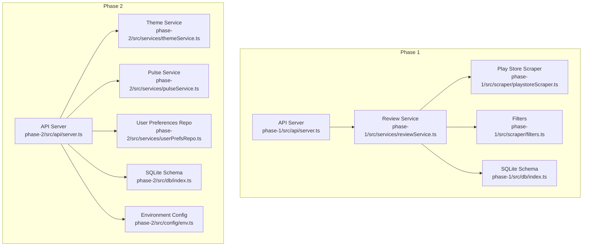
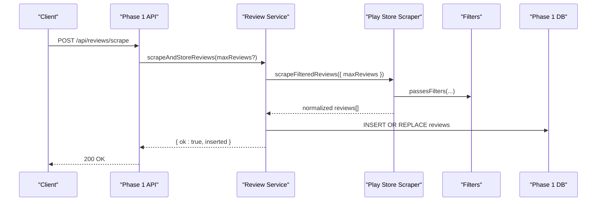
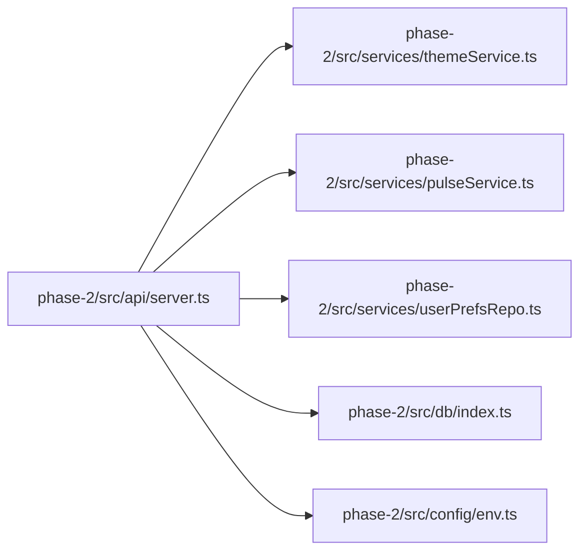

# API Reference

<cite>
**Referenced Files in This Document**
- [phase-1 server.ts](file://phase-1/src/api/server.ts)
- [phase-1 reviewService.ts](file://phase-1/src/services/reviewService.ts)
- [phase-1 playstoreScraper.ts](file://phase-1/src/scraper/playstoreScraper.ts)
- [phase-1 filters.ts](file://phase-1/src/scraper/filters.ts)
- [phase-1 db index.ts](file://phase-1/src/db/index.ts)
- [phase-2 server.ts](file://phase-2/src/api/server.ts)
- [phase-2 themeService.ts](file://phase-2/src/services/themeService.ts)
- [phase-2 pulseService.ts](file://phase-2/src/services/pulseService.ts)
- [phase-2 userPrefsRepo.ts](file://phase-2/src/services/userPrefsRepo.ts)
- [phase-2 db index.ts](file://phase-2/src/db/index.ts)
- [phase-2 env.ts](file://phase-2/src/config/env.ts)
- [phase-2 review model](file://phase-2/src/domain/review.ts)
- [ARCHITECTURE.md](file://ARCHITECTURE.md)
</cite>

## Table of Contents
1. [Introduction](#introduction)
2. [Project Structure](#project-structure)
3. [Core Components](#core-components)
4. [Architecture Overview](#architecture-overview)
5. [Detailed Component Analysis](#detailed-component-analysis)
6. [Dependency Analysis](#dependency-analysis)
7. [Performance Considerations](#performance-considerations)
8. [Troubleshooting Guide](#troubleshooting-guide)
9. [Conclusion](#conclusion)
10. [Appendices](#appendices)

## Introduction
This document provides a comprehensive API reference for the Groww App Review Insights Analyzer. It covers both Phase 1 and Phase 2 REST endpoints, including HTTP methods, URL patterns, request/response schemas, authentication requirements, parameter validation, error handling, and operational notes. It also includes client implementation guidelines, common usage patterns, and integration examples. Security, rate limiting, and versioning/deprecation policies are addressed where applicable.

## Project Structure
The project is organized into two self-contained phases:
- Phase 1: Core scraping, filtering, and storage of Google Play Store reviews.
- Phase 2: Theme generation, weekly pulse creation, and user preference management.

**Diagram sources**
- [phase-1 server.ts:1-50](file://phase-1/src/api/server.ts#L1-L50)
- [phase-1 reviewService.ts:1-101](file://phase-1/src/services/reviewService.ts#L1-L101)
- [phase-1 playstoreScraper.ts:1-153](file://phase-1/src/scraper/playstoreScraper.ts#L1-L153)
- [phase-1 filters.ts:1-59](file://phase-1/src/scraper/filters.ts#L1-L59)
- [phase-1 db index.ts:1-31](file://phase-1/src/db/index.ts#L1-L31)
- [phase-2 server.ts:1-266](file://phase-2/src/api/server.ts#L1-L266)
- [phase-2 themeService.ts:1-68](file://phase-2/src/services/themeService.ts#L1-L68)
- [phase-2 pulseService.ts:1-265](file://phase-2/src/services/pulseService.ts#L1-L265)
- [phase-2 userPrefsRepo.ts:1-95](file://phase-2/src/services/userPrefsRepo.ts#L1-L95)
- [phase-2 db index.ts:1-93](file://phase-2/src/db/index.ts#L1-L93)
- [phase-2 env.ts:1-23](file://phase-2/src/config/env.ts#L1-L23)

**Section sources**
- [phase-1 server.ts:1-50](file://phase-1/src/api/server.ts#L1-L50)
- [phase-2 server.ts:1-266](file://phase-2/src/api/server.ts#L1-L266)
- [ARCHITECTURE.md:44-84](file://ARCHITECTURE.md#L44-L84)

## Core Components
- Phase 1 API exposes endpoints to trigger scraping and list stored reviews.
- Phase 2 API exposes endpoints for theme generation, weekly pulse creation, listing pulses, retrieving a single pulse, sending pulse emails, managing user preferences, and convenience endpoints for debugging.

Key runtime characteristics:
- Both servers run on Express and listen on a configurable port.
- Phase 2 initializes database schemas and conditionally starts a scheduler when the Groq API key is present.

**Section sources**
- [phase-1 server.ts:45-48](file://phase-1/src/api/server.ts#L45-L48)
- [phase-2 server.ts:254-263](file://phase-2/src/api/server.ts#L254-L263)
- [phase-2 db index.ts:7-91](file://phase-2/src/db/index.ts#L7-L91)
- [phase-1 db index.ts:7-21](file://phase-1/src/db/index.ts#L7-L21)

## Architecture Overview
The system integrates Google Play Store scraping, filtering, and storage, followed by Groq-powered theme generation and weekly pulse creation. Email dispatch is supported via SMTP.

**Diagram sources**
- [phase-1 server.ts:9-19](file://phase-1/src/api/server.ts#L9-L19)
- [phase-1 reviewService.ts:10-75](file://phase-1/src/services/reviewService.ts#L10-L75)
- [phase-1 playstoreScraper.ts:13-151](file://phase-1/src/scraper/playstoreScraper.ts#L13-L151)
- [phase-1 filters.ts:16-48](file://phase-1/src/scraper/filters.ts#L16-L48)
- [phase-1 db index.ts:8-21](file://phase-1/src/db/index.ts#L8-L21)

## Detailed Component Analysis

### Phase 1 API Endpoints

#### POST /api/reviews/scrape
- Purpose: Trigger scraping and storage of Play Store reviews.
- Authentication: None.
- Request body:
  - maxReviews: integer (optional). Defaults to the service’s internal default when omitted.
- Response:
  - ok: boolean
  - inserted: number
- Errors:
  - 500 Internal Server Error on failure.

Notes:
- A GET variant is also exposed for environments that cannot call POST to localhost.

**Section sources**
- [phase-1 server.ts:9-19](file://phase-1/src/api/server.ts#L9-L19)
- [phase-1 server.ts:22-32](file://phase-1/src/api/server.ts#L22-L32)
- [phase-1 reviewService.ts:10-75](file://phase-1/src/services/reviewService.ts#L10-L75)

#### GET /api/reviews
- Purpose: List stored reviews.
- Authentication: None.
- Query parameters:
  - limit: integer (optional). Defaults to 100.
- Response:
  - ok: boolean
  - reviews: array of review objects (fields include id, platform, rating, title, text, clean_text, created_at, week_start, week_end, raw_payload).
- Errors:
  - 500 Internal Server Error on failure.

**Section sources**
- [phase-1 server.ts:34-43](file://phase-1/src/api/server.ts#L34-L43)
- [phase-1 reviewService.ts:77-99](file://phase-1/src/services/reviewService.ts#L77-L99)

### Phase 2 API Endpoints

#### POST /api/themes/generate
- Purpose: Generate and store up to 5 themes from recent reviews.
- Authentication: None.
- Request body:
  - weeksBack: integer (optional). Defaults to 12.
  - limit: integer (optional). Defaults to 800.
- Response:
  - ok: boolean
  - themes: array of theme objects with id, name, description.
- Errors:
  - 500 Internal Server Error on failure.

Validation and behavior:
- Validates numeric types and applies defaults when missing.
- Uses a recent sample of reviews to call Groq and upsert themes.

**Section sources**
- [phase-2 server.ts:28-43](file://phase-2/src/api/server.ts#L28-L43)
- [phase-2 themeService.ts:17-37](file://phase-2/src/services/themeService.ts#L17-L37)
- [phase-2 themeService.ts:39-56](file://phase-2/src/services/themeService.ts#L39-L56)

#### GET /api/themes
- Purpose: List the latest themes.
- Authentication: None.
- Response:
  - ok: boolean
  - themes: array of theme objects with id, name, description.
- Errors:
  - 500 Internal Server Error on failure.

**Section sources**
- [phase-2 server.ts:45-54](file://phase-2/src/api/server.ts#L45-L54)
- [phase-2 themeService.ts:58-66](file://phase-2/src/services/themeService.ts#L58-L66)

#### POST /api/themes/assign
- Purpose: Assign reviews for a week to the latest themes.
- Authentication: None.
- Request body:
  - week_start: string (required). Format: YYYY-MM-DD.
- Response:
  - ok: boolean
  - stats: assignment statistics.
- Errors:
  - 400 Bad Request if week_start is missing or invalid.
  - 500 Internal Server Error on failure.

Validation:
- Requires a valid date string matching YYYY-MM-DD.

**Section sources**
- [phase-2 server.ts:56-70](file://phase-2/src/api/server.ts#L56-L70)

#### POST /api/pulses/generate
- Purpose: Generate a weekly pulse for a given week.
- Authentication: None.
- Request body:
  - week_start: string (required). Format: YYYY-MM-DD.
- Response:
  - ok: boolean
  - pulse: the generated weekly pulse object (fields include id, week_start, week_end, top_themes, user_quotes, action_ideas, note_body, created_at, version).
- Errors:
  - 400 Bad Request if week_start is missing or invalid.
  - 500 Internal Server Error on failure.

Behavior:
- Requires themes to be generated and review-to-theme assignments to be present.
- Computes week_end as six days after week_start.
- Enforces a ≤250-word note and PII scrubbing.

**Section sources**
- [phase-2 server.ts:76-90](file://phase-2/src/api/server.ts#L76-L90)
- [phase-2 pulseService.ts:179-241](file://phase-2/src/services/pulseService.ts#L179-L241)

#### GET /api/pulses
- Purpose: List recent pulses.
- Authentication: None.
- Response:
  - ok: boolean
  - pulses: array of weekly pulse objects.
- Errors:
  - 500 Internal Server Error on failure.

**Section sources**
- [phase-2 server.ts:92-101](file://phase-2/src/api/server.ts#L92-L101)
- [phase-2 pulseService.ts:254-264](file://phase-2/src/services/pulseService.ts#L254-L264)

#### GET /api/pulses/:id
- Purpose: Retrieve a single pulse by id.
- Authentication: None.
- Path parameters:
  - id: integer (required).
- Response:
  - ok: boolean
  - pulse: the requested weekly pulse object.
- Errors:
  - 400 Bad Request if id is invalid.
  - 404 Not Found if pulse does not exist.
  - 500 Internal Server Error on failure.

**Section sources**
- [phase-2 server.ts:103-121](file://phase-2/src/api/server.ts#L103-L121)
- [phase-2 pulseService.ts:243-252](file://phase-2/src/services/pulseService.ts#L243-L252)

#### POST /api/pulses/:id/send-email
- Purpose: Send a pulse via email.
- Authentication: None.
- Path parameters:
  - id: integer (required).
- Request body:
  - to: string (optional). If absent, uses the active user preference email.
- Response:
  - ok: boolean
  - message: success confirmation.
- Errors:
  - 400 Bad Request if id is invalid or if no recipient is available.
  - 404 Not Found if pulse does not exist.
  - 500 Internal Server Error on failure.

Behavior:
- Validates pulse existence and id format.
- Falls back to user preferences if no explicit recipient is provided.

**Section sources**
- [phase-2 server.ts:123-154](file://phase-2/src/api/server.ts#L123-L154)
- [phase-2 userPrefsRepo.ts:50-56](file://phase-2/src/services/userPrefsRepo.ts#L50-L56)

#### POST /api/user-preferences
- Purpose: Save or update user preferences for weekly pulse delivery.
- Authentication: None.
- Request body:
  - email: string (required). Must contain '@'.
  - timezone: string (required). E.g., "Asia/Kolkata".
  - preferred_day_of_week: number (required). 0 = Sunday, 6 = Saturday.
  - preferred_time: string (required). "HH:MM" in 24-hour format.
- Response:
  - ok: boolean
  - preferences: the saved user preference row.
  - confirmation: a human-readable message summarizing the schedule.
- Errors:
  - 400 Bad Request for invalid or missing fields.
  - 500 Internal Server Error on failure.

Behavior:
- Only one active preference row is maintained; previous active rows are deactivated.

**Section sources**
- [phase-2 server.ts:160-197](file://phase-2/src/api/server.ts#L160-L197)
- [phase-2 userPrefsRepo.ts:21-43](file://phase-2/src/services/userPrefsRepo.ts#L21-L43)

#### GET /api/user-preferences
- Purpose: Retrieve the currently active user preferences.
- Authentication: None.
- Response:
  - ok: boolean
  - preferences: the active user preference row.
- Errors:
  - 404 Not Found if no preferences are configured.
  - 500 Internal Server Error on failure.

**Section sources**
- [phase-2 server.ts:199-212](file://phase-2/src/api/server.ts#L199-L212)
- [phase-2 userPrefsRepo.ts:50-56](file://phase-2/src/services/userPrefsRepo.ts#L50-L56)

#### POST /api/email/test
- Purpose: Send a test email to verify SMTP configuration.
- Authentication: None.
- Request body:
  - to: string (required). Must be a valid email address.
- Response:
  - ok: boolean
  - message: success confirmation.
- Errors:
  - 400 Bad Request if to is missing or invalid.
  - 500 Internal Server Error on failure.

**Section sources**
- [phase-2 server.ts:218-232](file://phase-2/src/api/server.ts#L218-L232)

#### GET /api/reviews/week/:weekStart
- Purpose: Convenience endpoint to list reviews for a specific week (debugging).
- Authentication: None.
- Path parameters:
  - weekStart: string (required). Format: YYYY-MM-DD.
- Response:
  - ok: boolean
  - reviews: array of review objects for the week.
- Errors:
  - 500 Internal Server Error on failure.

**Section sources**
- [phase-2 server.ts:238-248](file://phase-2/src/api/server.ts#L238-L248)

### Data Models and Validation

#### Review (Phase 1)
- Fields: id, platform, rating, title, text, clean_text, created_at, week_start, week_end, raw_payload.

**Section sources**
- [phase-1 reviewService.ts:77-99](file://phase-1/src/services/reviewService.ts#L77-L99)

#### Review (Phase 2)
- Fields: id, rating, title, text, clean_text, created_at, week_start, week_end.

**Section sources**
- [phase-2 review model:1-12](file://phase-2/src/domain/review.ts#L1-L12)

#### Theme
- Fields: id, name, description.
- Constraints: name length 2–60; description length 5–200.

**Section sources**
- [phase-2 themeService.ts:6-13](file://phase-2/src/services/themeService.ts#L6-L13)
- [phase-2 themeService.ts:58-66](file://phase-2/src/services/themeService.ts#L58-L66)

#### Weekly Pulse
- Fields: id, week_start, week_end, top_themes, user_quotes, action_ideas, note_body, created_at, version.
- Constraints: top_themes length 3; note_body ≤250 words; PII scrubbed.

**Section sources**
- [phase-2 pulseService.ts:28-38](file://phase-2/src/services/pulseService.ts#L28-L38)
- [phase-2 pulseService.ts:134-172](file://phase-2/src/services/pulseService.ts#L134-L172)

#### User Preferences
- Fields: id, email, timezone, preferred_day_of_week, preferred_time, created_at, updated_at, active.
- Constraints: preferred_day_of_week ∈ [0, 6]; preferred_time "HH:MM"; only one active row.

**Section sources**
- [phase-2 userPrefsRepo.ts:3-15](file://phase-2/src/services/userPrefsRepo.ts#L3-L15)
- [phase-2 userPrefsRepo.ts:50-56](file://phase-2/src/services/userPrefsRepo.ts#L50-L56)

### Parameter Validation Summary
- Date formats: YYYY-MM-DD for week_start.
- Time format: HH:MM (24-hour).
- Numeric ranges: preferred_day_of_week ∈ [0, 6].
- Email validation: presence of '@'.

**Section sources**
- [phase-2 server.ts:59-63](file://phase-2/src/api/server.ts#L59-L63)
- [phase-2 server.ts:79-82](file://phase-2/src/api/server.ts#L79-L82)
- [phase-2 server.ts:166-183](file://phase-2/src/api/server.ts#L166-L183)
- [phase-2 server.ts:221-225](file://phase-2/src/api/server.ts#L221-L225)

### Error Codes and Status Messages
- 200 OK: Successful operation.
- 400 Bad Request: Invalid parameters or malformed payload.
- 404 Not Found: Resource not found (e.g., pulse id).
- 500 Internal Server Error: Unexpected server error.

**Section sources**
- [phase-1 server.ts:15-18](file://phase-1/src/api/server.ts#L15-L18)
- [phase-1 server.ts:28-31](file://phase-1/src/api/server.ts#L28-L31)
- [phase-1 server.ts:39-42](file://phase-1/src/api/server.ts#L39-L42)
- [phase-2 server.ts:60-63](file://phase-2/src/api/server.ts#L60-L63)
- [phase-2 server.ts:79-82](file://phase-2/src/api/server.ts#L79-L82)
- [phase-2 server.ts:107-109](file://phase-2/src/api/server.ts#L107-L109)
- [phase-2 server.ts:127-129](file://phase-2/src/api/server.ts#L127-L129)
- [phase-2 server.ts:168-183](file://phase-2/src/api/server.ts#L168-L183)
- [phase-2 server.ts:222-225](file://phase-2/src/api/server.ts#L222-L225)

### Security Considerations
- Environment variables:
  - GROQ_API_KEY: Required for Groq integration and scheduler activation.
  - DATABASE_FILE: Path to SQLite database (shared between phases).
  - SMTP_HOST, SMTP_PORT, SMTP_USER, SMTP_PASS, SMTP_FROM: Required for email sending.
- Access control: No authentication is enforced by the API servers. Restrict access at the network level or via a reverse proxy.
- PII protection: Reviews are filtered and cleaned; Groq prompts explicitly prohibit PII; final note undergoes PII scrubbing.

**Section sources**
- [phase-2 env.ts:13-21](file://phase-2/src/config/env.ts#L13-L21)
- [phase-2 server.ts:257-262](file://phase-2/src/api/server.ts#L257-L262)
- [phase-1 filters.ts:16-48](file://phase-1/src/scraper/filters.ts#L16-L48)
- [phase-2 pulseService.ts:171-172](file://phase-2/src/services/pulseService.ts#L171-L172)

### Rate Limiting
- No built-in rate limiting is implemented in the API servers. Consider deploying a reverse proxy or gateway to enforce limits.

[No sources needed since this section provides general guidance]

### API Versioning and Compatibility
- Current API surface is stable within each phase. No explicit versioning headers or paths are used.
- Backward compatibility is not documented; future changes should increment the API version consistently.

[No sources needed since this section provides general guidance]

### Client Implementation Guidelines
- Base URL: http://localhost:PORT (default port is configurable).
- Use JSON for request/response bodies.
- Respect error responses and handle retries for transient failures.
- For email operations, ensure SMTP configuration is valid before calling test or send endpoints.

**Section sources**
- [phase-2 env.ts](file://phase-2/src/config/env.ts#L11)
- [phase-2 server.ts:219-232](file://phase-2/src/api/server.ts#L219-L232)

### Common Usage Patterns
- Trigger scraping: POST /api/reviews/scrape with optional maxReviews.
- Generate themes: POST /api/themes/generate with optional weeksBack and limit.
- Assign themes to weekly reviews: POST /api/themes/assign with week_start.
- Generate weekly pulse: POST /api/pulses/generate with week_start.
- Retrieve a pulse: GET /api/pulses/:id.
- Send pulse email: POST /api/pulses/:id/send-email with optional to.
- Configure preferences: POST /api/user-preferences with email, timezone, preferred_day_of_week, preferred_time.

**Section sources**
- [phase-1 server.ts:9-19](file://phase-1/src/api/server.ts#L9-L19)
- [phase-2 server.ts:28-43](file://phase-2/src/api/server.ts#L28-L43)
- [phase-2 server.ts:56-70](file://phase-2/src/api/server.ts#L56-L70)
- [phase-2 server.ts:76-90](file://phase-2/src/api/server.ts#L76-L90)
- [phase-2 server.ts:103-121](file://phase-2/src/api/server.ts#L103-L121)
- [phase-2 server.ts:123-154](file://phase-2/src/api/server.ts#L123-L154)
- [phase-2 server.ts:160-197](file://phase-2/src/api/server.ts#L160-L197)

### Integration Examples
- End-to-end flow:
  - POST /api/reviews/scrape to populate reviews.
  - POST /api/themes/generate to derive themes.
  - POST /api/themes/assign to map reviews to themes.
  - POST /api/pulses/generate to produce a weekly pulse.
  - POST /api/pulses/:id/send-email to deliver the pulse.
  - POST /api/user-preferences to configure delivery preferences.

**Section sources**
- [phase-1 server.ts:9-19](file://phase-1/src/api/server.ts#L9-L19)
- [phase-2 server.ts:28-43](file://phase-2/src/api/server.ts#L28-L43)
- [phase-2 server.ts:56-70](file://phase-2/src/api/server.ts#L56-L70)
- [phase-2 server.ts:76-90](file://phase-2/src/api/server.ts#L76-L90)
- [phase-2 server.ts:123-154](file://phase-2/src/api/server.ts#L123-L154)
- [phase-2 server.ts:160-197](file://phase-2/src/api/server.ts#L160-L197)

## Dependency Analysis

**Diagram sources**
- [phase-2 server.ts:1-14](file://phase-2/src/api/server.ts#L1-L14)
- [phase-2 themeService.ts:1-3](file://phase-2/src/services/themeService.ts#L1-L3)
- [phase-2 pulseService.ts:1-7](file://phase-2/src/services/pulseService.ts#L1-L7)
- [phase-2 userPrefsRepo.ts:1-2](file://phase-2/src/services/userPrefsRepo.ts#L1-L2)
- [phase-2 db index.ts:1-5](file://phase-2/src/db/index.ts#L1-L5)
- [phase-2 env.ts:1-5](file://phase-2/src/config/env.ts#L1-L5)

**Section sources**
- [phase-2 server.ts:1-14](file://phase-2/src/api/server.ts#L1-L14)
- [phase-2 db index.ts:1-93](file://phase-2/src/db/index.ts#L1-L93)

## Performance Considerations
- Batch operations: Use appropriate limits for listing and sampling to avoid large payloads.
- Caching: Reuse themes over a sliding 8–12 week window to reduce Groq calls.
- Indexing: Ensure database indexes are in place for efficient queries on week_start and related fields.
- Token management: Control batch sizes for Groq calls to manage cost and latency.

[No sources needed since this section provides general guidance]

## Troubleshooting Guide
- 500 Internal Server Error:
  - Verify environment variables (GROQ_API_KEY, SMTP credentials, DATABASE_FILE).
  - Check database connectivity and schema initialization.
- 400 Bad Request:
  - Confirm date formats (YYYY-MM-DD) and time format ("HH:MM").
  - Ensure numeric ranges for preferred_day_of_week are within [0, 6].
  - Validate email presence and format.
- 404 Not Found:
  - Ensure the pulse id exists and is accessible.
- Scheduler not starting:
  - Ensure GROQ_API_KEY is set; otherwise, scheduler startup is skipped.

**Section sources**
- [phase-2 env.ts:13-21](file://phase-2/src/config/env.ts#L13-L21)
- [phase-2 server.ts:257-262](file://phase-2/src/api/server.ts#L257-L262)
- [phase-2 server.ts:60-63](file://phase-2/src/api/server.ts#L60-L63)
- [phase-2 server.ts:79-82](file://phase-2/src/api/server.ts#L79-L82)
- [phase-2 server.ts:107-109](file://phase-2/src/api/server.ts#L107-L109)
- [phase-2 server.ts:127-129](file://phase-2/src/api/server.ts#L127-L129)
- [phase-2 server.ts:168-183](file://phase-2/src/api/server.ts#L168-L183)
- [phase-2 server.ts:222-225](file://phase-2/src/api/server.ts#L222-L225)

## Conclusion
The Groww App Review Insights Analyzer provides a clear, layered API surface spanning review ingestion, theme discovery, weekly pulse generation, and user preference management. By adhering to the documented endpoints, validations, and security practices, clients can reliably integrate with the system and automate insights delivery.

[No sources needed since this section summarizes without analyzing specific files]

## Appendices

### Endpoint Catalog
- Phase 1
  - POST /api/reviews/scrape
  - GET /api/reviews
- Phase 2
  - POST /api/themes/generate
  - GET /api/themes
  - POST /api/themes/assign
  - POST /api/pulses/generate
  - GET /api/pulses
  - GET /api/pulses/:id
  - POST /api/pulses/:id/send-email
  - POST /api/user-preferences
  - GET /api/user-preferences
  - POST /api/email/test
  - GET /api/reviews/week/:weekStart

**Section sources**
- [phase-1 server.ts:9-43](file://phase-1/src/api/server.ts#L9-L43)
- [phase-2 server.ts:28-248](file://phase-2/src/api/server.ts#L28-L248)

### Database Schema Overview
- Phase 1: reviews table with indexed week_start.
- Phase 2: themes, review_themes, weekly_pulses, user_preferences, scheduled_jobs tables with relevant indexes.

**Section sources**
- [phase-1 db index.ts:8-21](file://phase-1/src/db/index.ts#L8-L21)
- [phase-2 db index.ts:8-91](file://phase-2/src/db/index.ts#L8-L91)