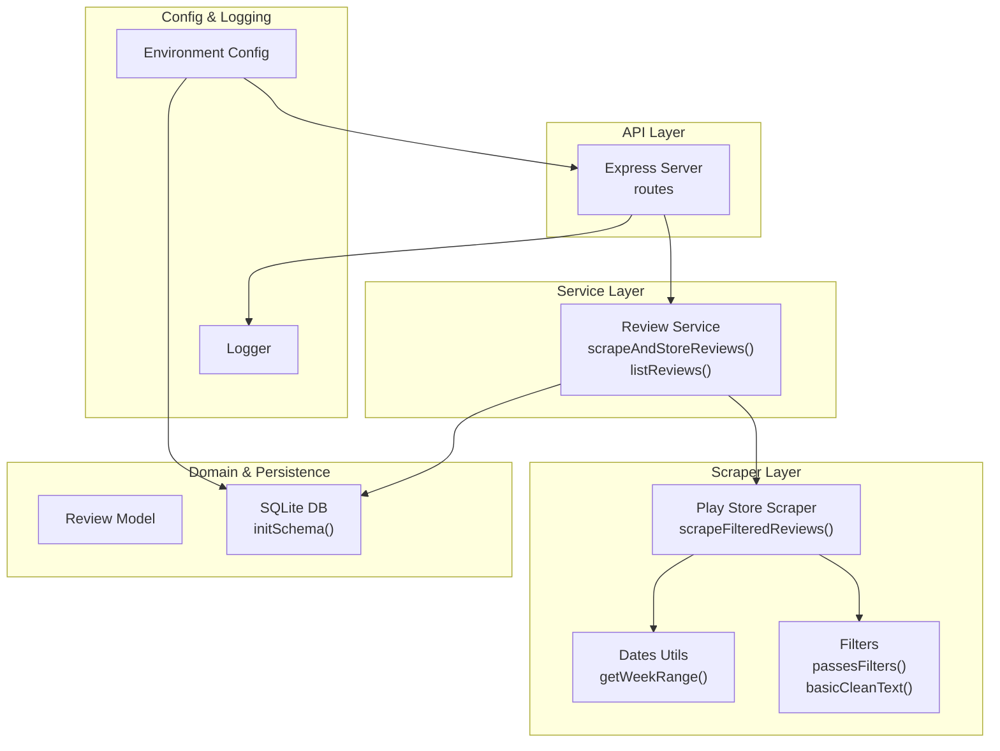
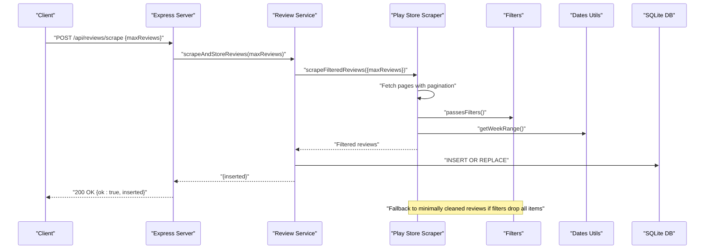
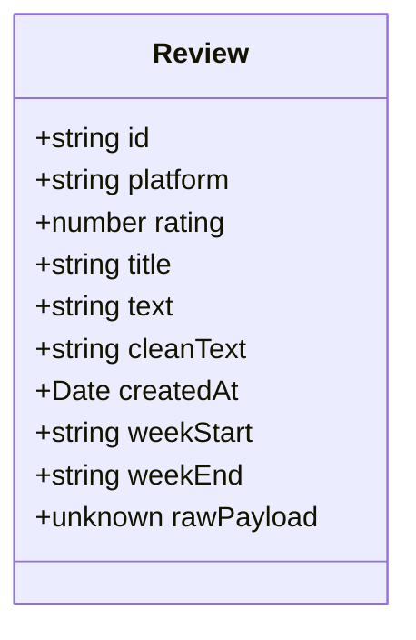
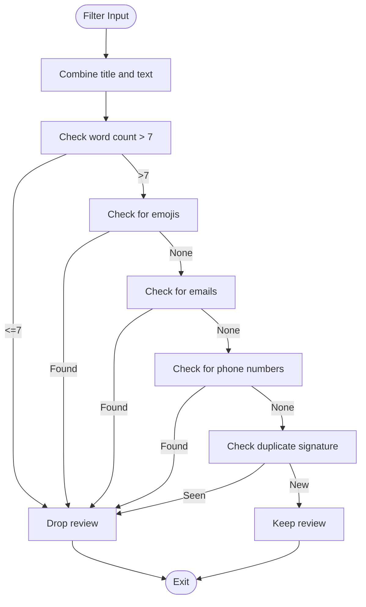
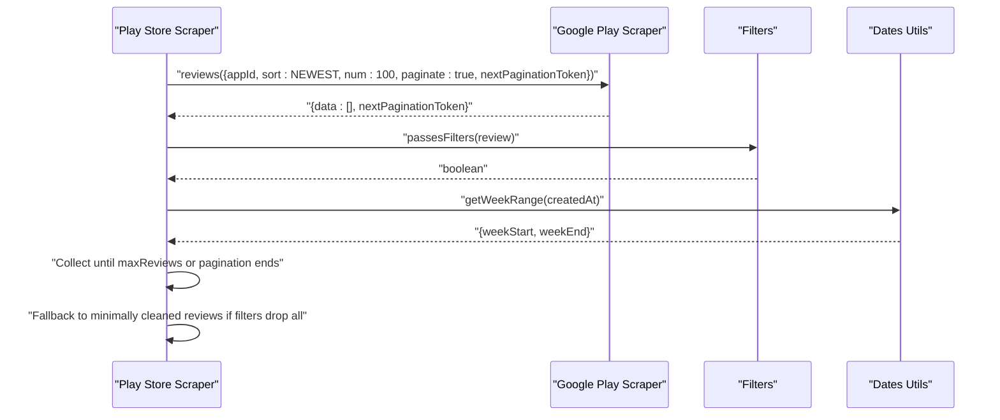
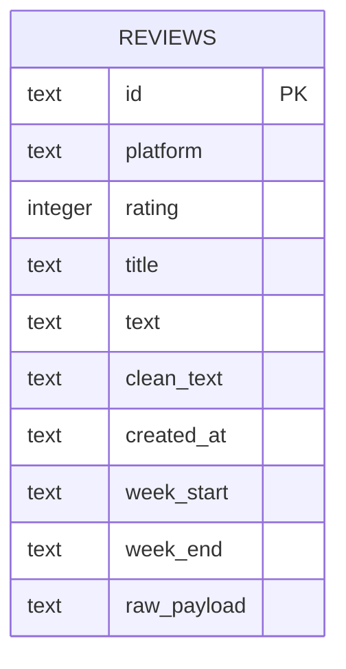
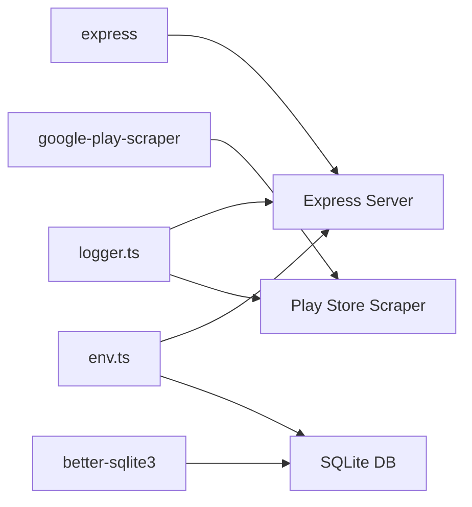

# Phase 1 API Endpoints

<cite>
**Referenced Files in This Document**
- [server.ts](file://phase-1/src/api/server.ts)
- [reviewService.ts](file://phase-1/src/services/reviewService.ts)
- [playstoreScraper.ts](file://phase-1/src/scraper/playstoreScraper.ts)
- [filters.ts](file://phase-1/src/scraper/filters.ts)
- [dates.ts](file://phase-1/src/utils/dates.ts)
- [review.model.ts](file://phase-1/src/domain/review.model.ts)
- [index.ts](file://phase-1/src/db/index.ts)
- [env.ts](file://phase-1/src/config/env.ts)
- [logger.ts](file://phase-1/src/core/logger.ts)
- [integration.scrape.test.ts](file://phase-1/src/tests/integration.scrape.test.ts)
- [filters.test.ts](file://phase-1/src/tests/filters.test.ts)
</cite>

## Table of Contents
1. [Introduction](#introduction)
2. [Project Structure](#project-structure)
3. [Core Components](#core-components)
4. [Architecture Overview](#architecture-overview)
5. [Detailed Component Analysis](#detailed-component-analysis)
6. [Dependency Analysis](#dependency-analysis)
7. [Performance Considerations](#performance-considerations)
8. [Troubleshooting Guide](#troubleshooting-guide)
9. [Conclusion](#conclusion)

## Introduction
This document provides comprehensive API documentation for Phase 1 endpoints focused on review scraping and retrieval. It covers:
- POST /api/reviews/scrape for initiating review collection with an optional maxReviews parameter
- GET /api/reviews/scrape for browser-friendly triggering with query parameter support
- GET /api/reviews for retrieving stored reviews with pagination via the limit parameter

The documentation includes request/response schemas, error handling, success responses, parameter validation rules, concrete examples, and client implementation guidelines.

## Project Structure
Phase 1 organizes functionality into clear layers:
- API layer: Express routes and HTTP handlers
- Service layer: Business logic for scraping, filtering, and persistence
- Scraper layer: Integration with Google Play Scraper and filtering
- Domain model: Review entity definition
- Database layer: SQLite schema and initialization
- Utilities: Date helpers and filtering logic
- Configuration: Environment variables for port and database file
- Logging: Console-based logging for info and error messages

**Diagram sources**
- [server.ts:1-50](file://phase-1/src/api/server.ts#L1-L50)
- [reviewService.ts:1-101](file://phase-1/src/services/reviewService.ts#L1-L101)
- [playstoreScraper.ts:1-153](file://phase-1/src/scraper/playstoreScraper.ts#L1-L153)
- [filters.ts:1-59](file://phase-1/src/scraper/filters.ts#L1-L59)
- [dates.ts:1-23](file://phase-1/src/utils/dates.ts#L1-L23)
- [review.model.ts:1-14](file://phase-1/src/domain/review.model.ts#L1-L14)
- [index.ts:1-31](file://phase-1/src/db/index.ts#L1-L31)
- [env.ts:1-6](file://phase-1/src/config/env.ts#L1-L6)
- [logger.ts:1-23](file://phase-1/src/core/logger.ts#L1-L23)

**Section sources**
- [server.ts:1-50](file://phase-1/src/api/server.ts#L1-L50)
- [reviewService.ts:1-101](file://phase-1/src/services/reviewService.ts#L1-L101)
- [playstoreScraper.ts:1-153](file://phase-1/src/scraper/playstoreScraper.ts#L1-L153)
- [filters.ts:1-59](file://phase-1/src/scraper/filters.ts#L1-L59)
- [dates.ts:1-23](file://phase-1/src/utils/dates.ts#L1-L23)
- [review.model.ts:1-14](file://phase-1/src/domain/review.model.ts#L1-L14)
- [index.ts:1-31](file://phase-1/src/db/index.ts#L1-L31)
- [env.ts:1-6](file://phase-1/src/config/env.ts#L1-L6)
- [logger.ts:1-23](file://phase-1/src/core/logger.ts#L1-L23)

## Core Components
This section documents the three primary endpoints and their behavior.

### POST /api/reviews/scrape
Purpose: Initiate review collection from the Google Play Store with an optional cap on the number of reviews to collect.

- Method: POST
- Path: /api/reviews/scrape
- Content-Type: application/json
- Request body:
  - maxReviews: integer (optional). If provided, must be a positive integer. Defaults to 2000 when omitted.
- Response body:
  - ok: boolean (true on success)
  - inserted: integer (number of reviews successfully inserted into the database)
- Status codes:
  - 200 OK: Successful scrape and store operation
  - 500 Internal Server Error: General failure during scraping or storage
- Behavior:
  - Calls service layer to scrape filtered reviews up to maxReviews (default 2000)
  - Persists reviews to SQLite database
  - Writes a debug JSON file containing selected fields for inspection
  - Returns inserted count
- Parameter validation:
  - maxReviews must be a number; non-numeric values are ignored and treated as unlimited (up to internal cap)
- Error handling:
  - Catches exceptions and responds with 500 and a standardized error payload
  - Logs error details via logger

Example request:
- POST /api/reviews/scrape
- Body: {"maxReviews": 500}

Example successful response:
- 200 OK
- Body: {"ok": true, "inserted": 500}

Example error response:
- 500 Internal Server Error
- Body: {"ok": false, "error": "Failed to scrape reviews"}

**Section sources**
- [server.ts:9-19](file://phase-1/src/api/server.ts#L9-L19)
- [reviewService.ts:10-75](file://phase-1/src/services/reviewService.ts#L10-L75)
- [playstoreScraper.ts:13-151](file://phase-1/src/scraper/playstoreScraper.ts#L13-L151)
- [logger.ts:13-20](file://phase-1/src/core/logger.ts#L13-L20)

### GET /api/reviews/scrape
Purpose: Browser-friendly trigger for initiating review collection. Supports query parameters for maxReviews.

- Method: GET
- Path: /api/reviews/scrape
- Query parameters:
  - maxReviews: integer (optional). If provided, must be a positive integer. Non-numeric values are ignored.
- Response body:
  - ok: boolean (true on success)
  - inserted: integer (number of reviews successfully inserted into the database)
- Status codes:
  - 200 OK: Successful scrape and store operation
  - 500 Internal Server Error: General failure during scraping or storage
- Behavior:
  - Converts query parameter to number; invalid values are treated as unlimited (up to internal cap)
  - Calls service layer to scrape filtered reviews
  - Persists reviews to SQLite database
  - Writes a debug JSON file containing selected fields for inspection
  - Returns inserted count
- Parameter validation:
  - maxReviews must be numeric; non-numeric values are ignored and treated as unlimited (up to internal cap)
- Error handling:
  - Catches exceptions and responds with 500 and a standardized error payload
  - Logs error details via logger

Example request:
- GET /api/reviews/scrape?maxReviews=300

Example successful response:
- 200 OK
- Body: {"ok": true, "inserted": 300}

Example error response:
- 500 Internal Server Error
- Body: {"ok": false, "error": "Failed to scrape reviews"}

**Section sources**
- [server.ts:22-32](file://phase-1/src/api/server.ts#L22-L32)
- [reviewService.ts:10-75](file://phase-1/src/services/reviewService.ts#L10-L75)
- [playstoreScraper.ts:13-151](file://phase-1/src/scraper/playstoreScraper.ts#L13-L151)
- [logger.ts:13-20](file://phase-1/src/core/logger.ts#L13-L20)

### GET /api/reviews
Purpose: Retrieve stored reviews with pagination support.

- Method: GET
- Path: /api/reviews
- Query parameters:
  - limit: integer (optional). Defaults to 100 if not provided or invalid. Maximum supported limit is 1000 (enforced by service).
- Response body:
  - ok: boolean (true on success)
  - reviews: array of review objects (see Review model below)
- Status codes:
  - 200 OK: Successful retrieval
  - 500 Internal Server Error: General failure during retrieval
- Behavior:
  - Retrieves reviews ordered by created_at descending
  - Applies limit to constrain the number of returned reviews
  - Returns the full set of fields defined in the Review model
- Parameter validation:
  - limit must be numeric; non-numeric values are ignored and default to 100
  - Enforced maximum limit is 1000
- Error handling:
  - Catches exceptions and responds with 500 and a standardized error payload
  - Logs error details via logger

Example request:
- GET /api/reviews?limit=50

Example successful response:
- 200 OK
- Body: {"ok": true, "reviews": [...]}

Example error response:
- 500 Internal Server Error
- Body: {"ok": false, "error": "Failed to list reviews"}

**Section sources**
- [server.ts:34-43](file://phase-1/src/api/server.ts#L34-L43)
- [reviewService.ts:77-99](file://phase-1/src/services/reviewService.ts#L77-L99)
- [review.model.ts:1-14](file://phase-1/src/domain/review.model.ts#L1-L14)
- [logger.ts:13-20](file://phase-1/src/core/logger.ts#L13-L20)

## Architecture Overview
The API follows a layered architecture:
- HTTP layer: Express routes handle requests and delegate to services
- Service layer: Orchestrates scraping, filtering, persistence, and data retrieval
- Scraper layer: Integrates with Google Play Scraper and applies filtering rules
- Persistence layer: Uses SQLite with a dedicated schema and indexes
- Utilities: Provides date calculations and text cleaning
- Configuration: Environment-driven port and database file selection
- Logging: Console-based logging for operational visibility

**Diagram sources**
- [server.ts:9-19](file://phase-1/src/api/server.ts#L9-L19)
- [reviewService.ts:10-75](file://phase-1/src/services/reviewService.ts#L10-L75)
- [playstoreScraper.ts:13-151](file://phase-1/src/scraper/playstoreScraper.ts#L13-L151)
- [filters.ts:16-48](file://phase-1/src/scraper/filters.ts#L16-L48)
- [dates.ts:1-23](file://phase-1/src/utils/dates.ts#L1-L23)
- [index.ts:7-29](file://phase-1/src/db/index.ts#L7-L29)

## Detailed Component Analysis

### Review Model
The Review entity defines the shape of persisted data.

**Diagram sources**
- [review.model.ts:1-14](file://phase-1/src/domain/review.model.ts#L1-L14)

**Section sources**
- [review.model.ts:1-14](file://phase-1/src/domain/review.model.ts#L1-L14)

### Filtering and Text Cleaning
Filtering removes low-quality or sensitive content and deduplicates reviews. Text cleaning redacts PII.

**Diagram sources**
- [filters.ts:16-48](file://phase-1/src/scraper/filters.ts#L16-L48)

**Section sources**
- [filters.ts:1-59](file://phase-1/src/scraper/filters.ts#L1-L59)
- [dates.ts:1-23](file://phase-1/src/utils/dates.ts#L1-L23)

### Scraping Workflow
The scraper fetches paginated reviews, applies filters, and falls back if necessary.

**Diagram sources**
- [playstoreScraper.ts:13-151](file://phase-1/src/scraper/playstoreScraper.ts#L13-L151)
- [filters.ts:16-48](file://phase-1/src/scraper/filters.ts#L16-L48)
- [dates.ts:1-23](file://phase-1/src/utils/dates.ts#L1-L23)

**Section sources**
- [playstoreScraper.ts:1-153](file://phase-1/src/scraper/playstoreScraper.ts#L1-L153)

### Database Schema
The SQLite schema stores normalized review data with indexing for efficient queries.

**Diagram sources**
- [index.ts:8-21](file://phase-1/src/db/index.ts#L8-L21)

**Section sources**
- [index.ts:1-31](file://phase-1/src/db/index.ts#L1-L31)

## Dependency Analysis
Key dependencies and their roles:
- Express: HTTP server and routing
- google-play-scraper: Fetches Play Store reviews with pagination
- better-sqlite3: Local SQLite database for persistence
- Environment configuration: Port and database file path
- Logger: Console-based logging for info and error messages

**Diagram sources**
- [server.ts:1-7](file://phase-1/src/api/server.ts#L1-L7)
- [playstoreScraper.ts](file://phase-1/src/scraper/playstoreScraper.ts#L1)
- [index.ts](file://phase-1/src/db/index.ts#L1)
- [env.ts:1-6](file://phase-1/src/config/env.ts#L1-L6)
- [logger.ts:1-23](file://phase-1/src/core/logger.ts#L1-L23)

**Section sources**
- [server.ts:1-7](file://phase-1/src/api/server.ts#L1-L7)
- [playstoreScraper.ts](file://phase-1/src/scraper/playstoreScraper.ts#L1)
- [index.ts](file://phase-1/src/db/index.ts#L1)
- [env.ts:1-6](file://phase-1/src/config/env.ts#L1-L6)
- [logger.ts:1-23](file://phase-1/src/core/logger.ts#L1-L23)

## Performance Considerations
- Pagination limits: The scraper fetches batches of 100 reviews per page and stops after 50 pages or when reaching maxReviews, whichever comes first. This prevents excessive network usage and long-running operations.
- Filtering overhead: Filtering and deduplication occur during scraping to reduce database writes and improve data quality.
- Database writes: Reviews are inserted using a prepared statement within a transaction to optimize bulk inserts.
- Indexing: An index on week_start improves weekly aggregation queries.
- Rate limiting: No explicit rate limiting is implemented in Phase 1. Clients should space out requests to avoid overwhelming the Play Store API and to respect reasonable usage patterns.

[No sources needed since this section provides general guidance]

## Troubleshooting Guide
Common issues and resolutions:
- Network/API errors:
  - Symptom: 500 Internal Server Error on scrape endpoints
  - Cause: Failure during scraping or storage
  - Resolution: Retry after a delay; check logs for detailed error messages
- Invalid parameters:
  - Symptom: Unexpected behavior with non-numeric maxReviews
  - Cause: Query/body parameter not a number
  - Resolution: Ensure maxReviews is a positive integer; non-numeric values are ignored and treated as unlimited
- Empty results:
  - Symptom: inserted: 0 or empty reviews list
  - Cause: Filters dropping all items or no reviews found
  - Resolution: Adjust filters or increase maxReviews; the scraper includes a fallback to minimally cleaned reviews if filters drop all items
- Database connectivity:
  - Symptom: Schema initialization failures
  - Cause: Incorrect database file path or permissions
  - Resolution: Verify DATABASE_FILE environment variable and file permissions

**Section sources**
- [server.ts:15-18](file://phase-1/src/api/server.ts#L15-L18)
- [server.ts:28-31](file://phase-1/src/api/server.ts#L28-L31)
- [server.ts:39-42](file://phase-1/src/api/server.ts#L39-L42)
- [playstoreScraper.ts:146-148](file://phase-1/src/scraper/playstoreScraper.ts#L146-L148)
- [reviewService.ts:44-68](file://phase-1/src/services/reviewService.ts#L44-L68)
- [index.ts:7-29](file://phase-1/src/db/index.ts#L7-L29)

## Conclusion
Phase 1 provides a robust foundation for collecting, filtering, and retrieving Play Store reviews. The API offers three essential endpoints with clear request/response schemas, parameter validation, and error handling. Clients should implement retry logic, respect rate limits, and monitor logs for operational insights. Future enhancements could include explicit rate limiting, pagination controls, and richer filtering options.