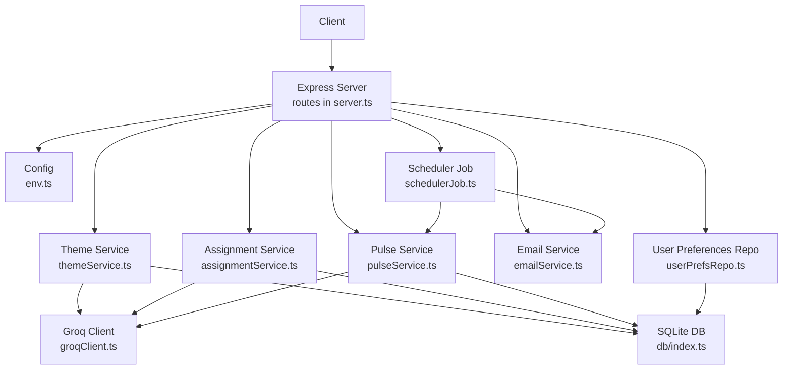
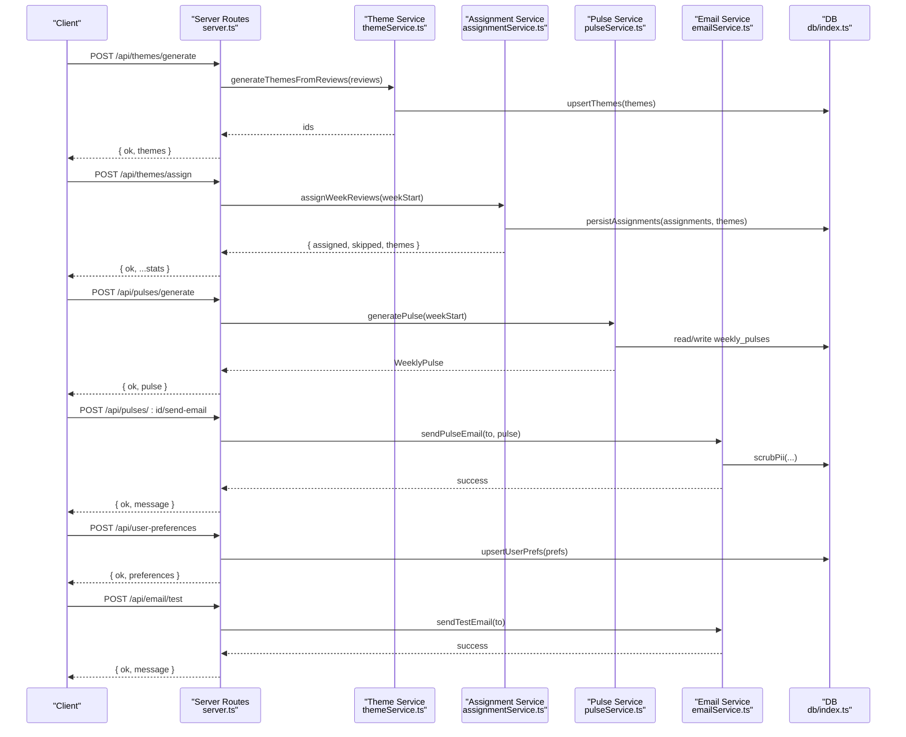
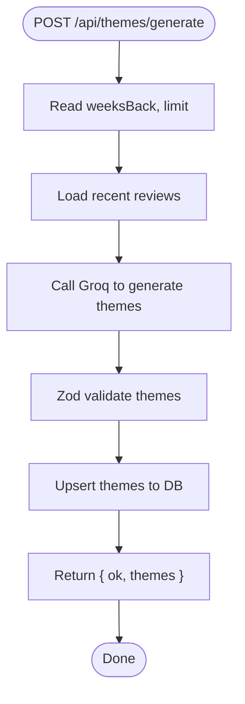
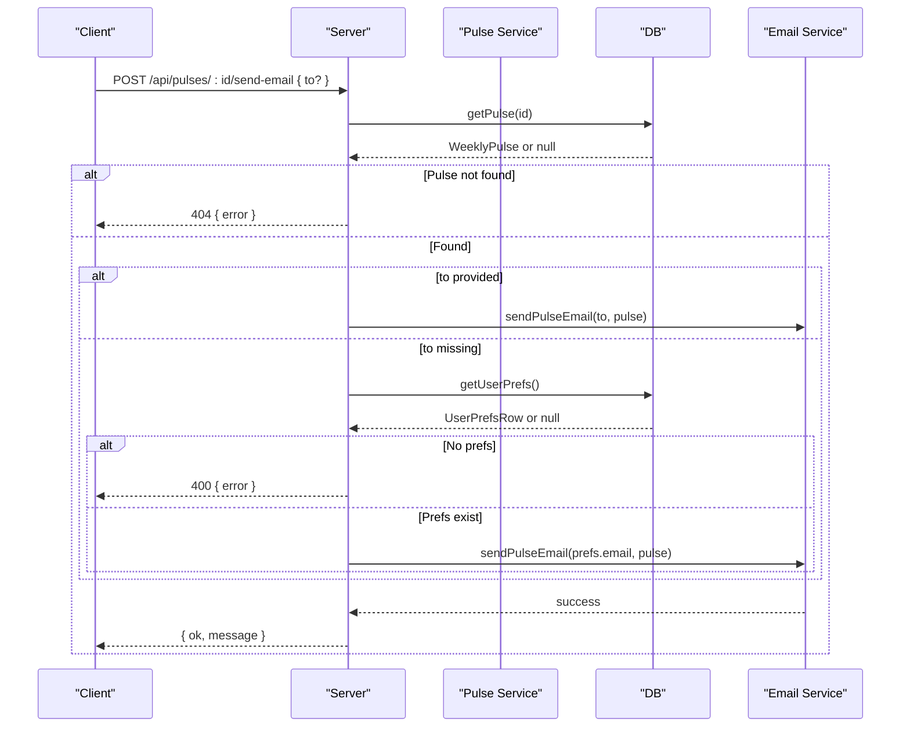
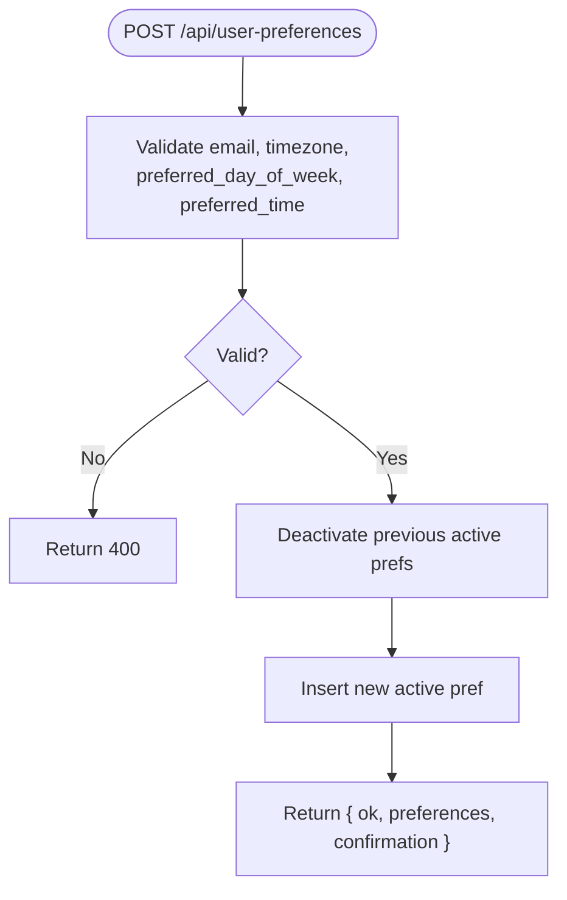
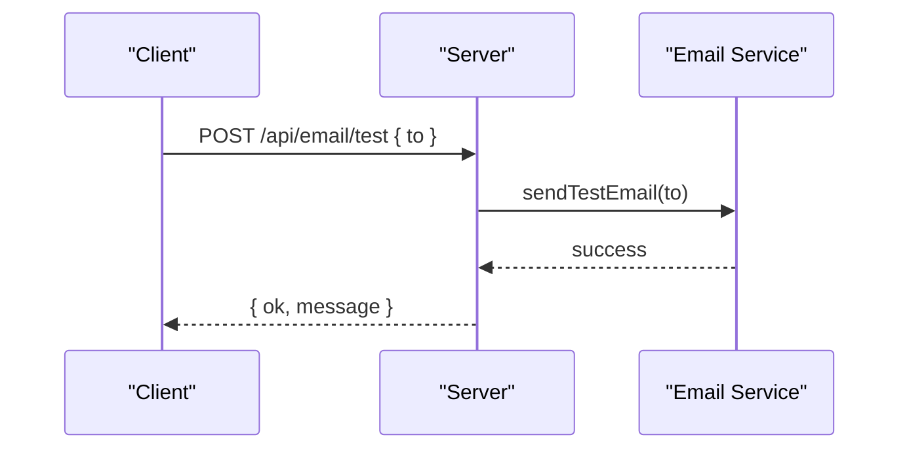
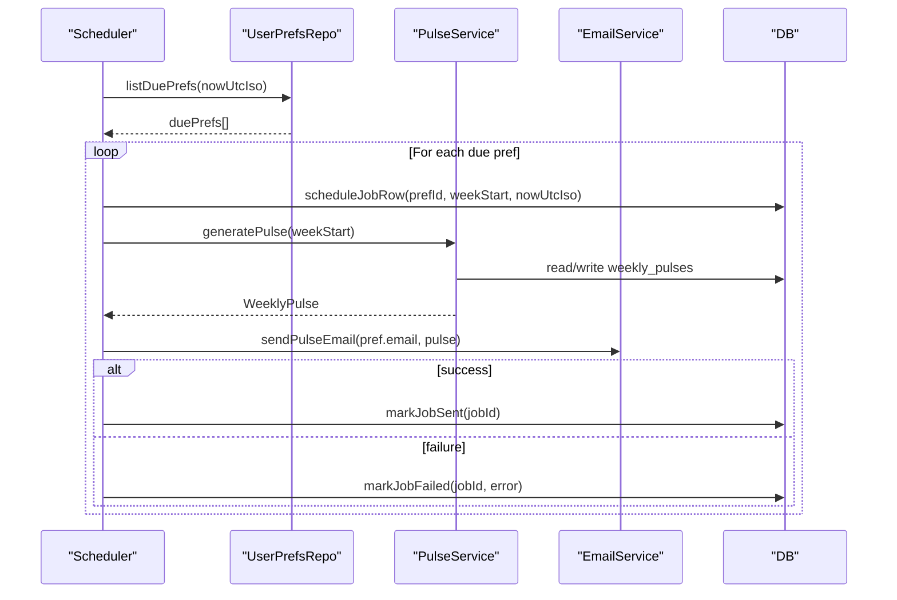
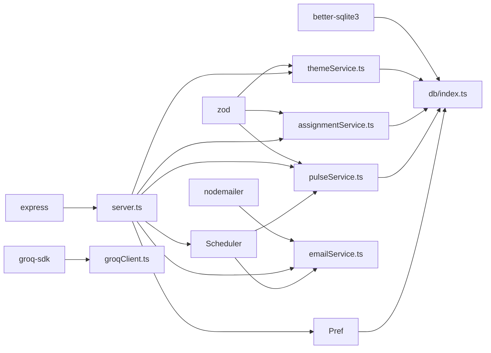
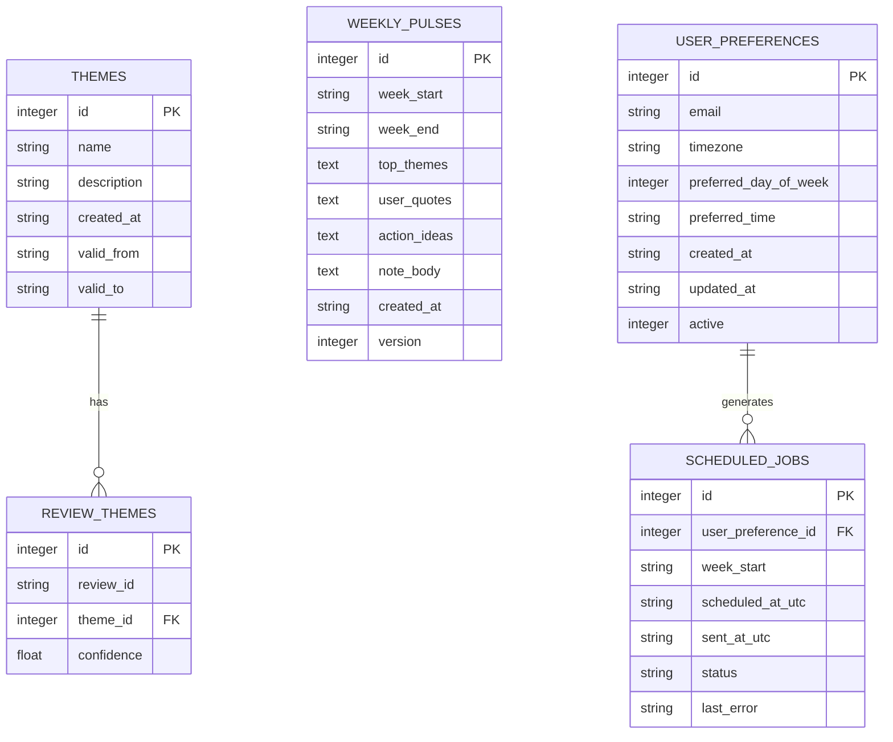

# Phase 2 API Endpoints

<cite>
**Referenced Files in This Document**
- [server.ts](file://phase-2/src/api/server.ts)
- [env.ts](file://phase-2/src/config/env.ts)
- [db/index.ts](file://phase-2/src/db/index.ts)
- [themeService.ts](file://phase-2/src/services/themeService.ts)
- [assignmentService.ts](file://phase-2/src/services/assignmentService.ts)
- [pulseService.ts](file://phase-2/src/services/pulseService.ts)
- [emailService.ts](file://phase-2/src/services/emailService.ts)
- [userPrefsRepo.ts](file://phase-2/src/services/userPrefsRepo.ts)
- [schedulerJob.ts](file://phase-2/src/jobs/schedulerJob.ts)
- [groqClient.ts](file://phase-2/src/services/groqClient.ts)
- [review.ts](file://phase-2/src/domain/review.ts)
- [pulse.test.ts](file://phase-2/src/tests/pulse.test.ts)
- [userPrefs.test.ts](file://phase-2/src/tests/userPrefs.test.ts)
- [assignment.test.ts](file://phase-2/src/tests/assignment.test.ts)
- [package.json](file://phase-2/package.json)
</cite>

## Table of Contents
1. [Introduction](#introduction)
2. [Project Structure](#project-structure)
3. [Core Components](#core-components)
4. [Architecture Overview](#architecture-overview)
5. [Detailed Component Analysis](#detailed-component-analysis)
6. [Dependency Analysis](#dependency-analysis)
7. [Performance Considerations](#performance-considerations)
8. [Troubleshooting Guide](#troubleshooting-guide)
9. [Conclusion](#conclusion)
10. [Appendices](#appendices)

## Introduction
This document provides comprehensive API documentation for Phase 2 endpoints focused on advanced analytics, automation, and user management. It covers:
- Theme management: generation, validation, and retrieval
- Pulse generation: weekly insights creation, theme assignment, and content aggregation
- User preference management: scheduling configuration, delivery preferences, and subscription management
- Email service endpoints: testing SMTP configuration and delivery verification
It also documents request/response schemas, authentication requirements, parameter validation rules, error handling patterns, and includes concrete examples of complex workflows such as theme-to-pulse assignment, automated scheduling, and preference-based filtering. Security, API versioning, rate limiting, and production deployment considerations are addressed.

## Project Structure
The Phase 2 backend is organized around a small Express server, a SQLite database, and modular services:
- API routes: centralized in the server file
- Configuration: environment variables for database, ports, and external services
- Domain models: review schema
- Services:
  - Theme service: LLM-driven theme generation and storage
  - Assignment service: LLM-driven review-to-theme assignment
  - Pulse service: weekly insight aggregation and persistence
  - Email service: HTML/text email building and SMTP transport
  - User preferences: CRUD and scheduling helpers
  - Scheduler job: periodic automation
- Database initialization and schema

**Diagram sources**
- [server.ts:1-266](file://phase-2/src/api/server.ts#L1-L266)
- [env.ts:1-23](file://phase-2/src/config/env.ts#L1-L23)
- [db/index.ts:1-93](file://phase-2/src/db/index.ts#L1-L93)
- [themeService.ts:1-68](file://phase-2/src/services/themeService.ts#L1-L68)
- [assignmentService.ts:1-114](file://phase-2/src/services/assignmentService.ts#L1-L114)
- [pulseService.ts:1-265](file://phase-2/src/services/pulseService.ts#L1-L265)
- [emailService.ts:1-142](file://phase-2/src/services/emailService.ts#L1-L142)
- [userPrefsRepo.ts:1-95](file://phase-2/src/services/userPrefsRepo.ts#L1-L95)
- [schedulerJob.ts:1-98](file://phase-2/src/jobs/schedulerJob.ts#L1-L98)
- [groqClient.ts:1-67](file://phase-2/src/services/groqClient.ts#L1-L67)

**Section sources**
- [server.ts:1-266](file://phase-2/src/api/server.ts#L1-L266)
- [env.ts:1-23](file://phase-2/src/config/env.ts#L1-L23)
- [db/index.ts:1-93](file://phase-2/src/db/index.ts#L1-L93)

## Core Components
- Theme Management
  - Generation: POST /api/themes/generate
  - Retrieval: GET /api/themes
  - Assignment: POST /api/themes/assign
- Pulse Management
  - Generation: POST /api/pulses/generate
  - Listing: GET /api/pulses
  - Retrieval: GET /api/pulses/:id
  - Delivery: POST /api/pulses/:id/send-email
- User Preferences
  - Save: POST /api/user-preferences
  - Retrieve: GET /api/user-preferences
- Email Testing
  - Test SMTP: POST /api/email/test
- Automation
  - Scheduler: runs periodically to generate and deliver pulses based on preferences

**Section sources**
- [server.ts:28-248](file://phase-2/src/api/server.ts#L28-L248)

## Architecture Overview
The API exposes endpoints that orchestrate data ingestion, LLM-powered analytics, and email delivery. The database stores themes, assignments, weekly pulses, user preferences, and scheduled jobs. The scheduler automates pulse generation and delivery.

**Diagram sources**
- [server.ts:28-248](file://phase-2/src/api/server.ts#L28-L248)
- [themeService.ts:17-66](file://phase-2/src/services/themeService.ts#L17-L66)
- [assignmentService.ts:27-113](file://phase-2/src/services/assignmentService.ts#L27-L113)
- [pulseService.ts:179-241](file://phase-2/src/services/pulseService.ts#L179-L241)
- [emailService.ts:114-141](file://phase-2/src/services/emailService.ts#L114-L141)
- [userPrefsRepo.ts:21-56](file://phase-2/src/services/userPrefsRepo.ts#L21-L56)
- [db/index.ts:7-91](file://phase-2/src/db/index.ts#L7-L91)

## Detailed Component Analysis

### Theme Management Endpoints
- POST /api/themes/generate
  - Purpose: Generate 3–5 themes from recent reviews and store them.
  - Query/body parameters:
    - weeksBack: number (default 12)
    - limit: number (default 800)
  - Validation:
    - Uses numeric defaults if missing or invalid.
  - Response:
    - ok: boolean
    - themes: array of theme objects with id, name, description
  - Error handling:
    - 500 on failure with generic error message.
  - Notes:
    - Relies on LLM via Groq client; requires API key.
    - Zod validates theme schema (name length, description length).
- GET /api/themes
  - Purpose: List latest themes.
  - Parameters:
    - limit: number (default 5)
  - Response:
    - ok: boolean
    - themes: array of { id, name, description }
  - Error handling:
    - 500 on failure with generic error message.
- POST /api/themes/assign
  - Purpose: Assign reviews for a week to the latest themes.
  - Body parameters:
    - week_start: string (YYYY-MM-DD)
  - Validation:
    - week_start must match date pattern; otherwise 400.
  - Response:
    - ok: boolean
    - Stats: assigned, skipped, themes
  - Error handling:
    - 500 on failure with message.

**Diagram sources**
- [server.ts:28-43](file://phase-2/src/api/server.ts#L28-L43)
- [themeService.ts:17-37](file://phase-2/src/services/themeService.ts#L17-L37)
- [groqClient.ts:30-65](file://phase-2/src/services/groqClient.ts#L30-L65)

**Section sources**
- [server.ts:28-70](file://phase-2/src/api/server.ts#L28-L70)
- [themeService.ts:6-13](file://phase-2/src/services/themeService.ts#L6-L13)
- [themeService.ts:17-66](file://phase-2/src/services/themeService.ts#L17-L66)
- [groqClient.ts:30-65](file://phase-2/src/services/groqClient.ts#L30-L65)

### Pulse Generation Endpoints
- POST /api/pulses/generate
  - Purpose: Generate weekly pulse for a given week.
  - Body parameters:
    - week_start: string (YYYY-MM-DD)
  - Validation:
    - week_start must match date pattern; otherwise 400.
  - Response:
    - ok: boolean
    - pulse: WeeklyPulse object
  - Error handling:
    - 500 on failure with message.
- GET /api/pulses
  - Purpose: List recent pulses.
  - Parameters:
    - limit: number (default 20)
  - Response:
    - ok: boolean
    - pulses: array of WeeklyPulse
- GET /api/pulses/:id
  - Purpose: Retrieve a single pulse by id.
  - Path parameters:
    - id: number
  - Validation:
    - id must be numeric; otherwise 400.
    - Not found if absent; 404.
  - Response:
    - ok: boolean
    - pulse: WeeklyPulse
- POST /api/pulses/:id/send-email
  - Purpose: Email a pulse to a recipient.
  - Path parameters:
    - id: number
  - Body parameters:
    - to: string (optional; falls back to active user preference email)
  - Validation:
    - id must be numeric; otherwise 400.
    - Not found if absent; 404.
    - Requires valid to or active user preferences; otherwise 400.
  - Response:
    - ok: boolean
    - message: success confirmation

**Diagram sources**
- [server.ts:123-154](file://phase-2/src/api/server.ts#L123-L154)
- [pulseService.ts:243-252](file://phase-2/src/services/pulseService.ts#L243-L252)
- [emailService.ts:114-129](file://phase-2/src/services/emailService.ts#L114-L129)
- [userPrefsRepo.ts:50-56](file://phase-2/src/services/userPrefsRepo.ts#L50-L56)

**Section sources**
- [server.ts:76-154](file://phase-2/src/api/server.ts#L76-L154)
- [pulseService.ts:28-38](file://phase-2/src/services/pulseService.ts#L28-L38)
- [pulseService.ts:179-241](file://phase-2/src/services/pulseService.ts#L179-L241)
- [pulseService.ts:243-264](file://phase-2/src/services/pulseService.ts#L243-L264)

### User Preference Management Endpoints
- POST /api/user-preferences
  - Purpose: Save or update user preferences and activate them.
  - Body parameters:
    - email: string (required; must include @)
    - timezone: string (required; e.g., "Asia/Kolkata")
    - preferred_day_of_week: number (0=Sunday – 6=Saturday)
    - preferred_time: string ("HH:MM", 24-hour)
  - Validation:
    - 400 on invalid fields.
  - Behavior:
    - Deactivates previously active preferences and activates the new one.
  - Response:
    - ok: boolean
    - preferences: saved UserPrefsRow
    - confirmation: human-readable schedule summary
- GET /api/user-preferences
  - Purpose: Retrieve currently active preferences.
  - Response:
    - ok: boolean
    - preferences: UserPrefsRow or 404 if none

**Diagram sources**
- [server.ts:160-197](file://phase-2/src/api/server.ts#L160-L197)
- [userPrefsRepo.ts:21-43](file://phase-2/src/services/userPrefsRepo.ts#L21-L43)

**Section sources**
- [server.ts:160-212](file://phase-2/src/api/server.ts#L160-L212)
- [userPrefsRepo.ts:3-15](file://phase-2/src/services/userPrefsRepo.ts#L3-L15)
- [userPrefsRepo.ts:21-56](file://phase-2/src/services/userPrefsRepo.ts#L21-L56)

### Email Service Endpoints
- POST /api/email/test
  - Purpose: Verify SMTP configuration by sending a test email.
  - Body parameters:
    - to: string (required; must include @)
  - Validation:
    - 400 if invalid email.
  - Response:
    - ok: boolean
    - message: success confirmation

**Diagram sources**
- [server.ts:218-232](file://phase-2/src/api/server.ts#L218-L232)
- [emailService.ts:132-141](file://phase-2/src/services/emailService.ts#L132-L141)

**Section sources**
- [server.ts:218-232](file://phase-2/src/api/server.ts#L218-L232)
- [emailService.ts:99-141](file://phase-2/src/services/emailService.ts#L99-L141)

### Automation and Scheduling
- Scheduler
  - Starts automatically if Groq API key is present.
  - Runs every 5 minutes by default.
  - Finds due preferences, generates the latest pulse for the last full week, sends email, and records job status.
- Due preferences calculation
  - Determines next send time based on preferred day/time and checks against current UTC time.
  - Filters preferences that have no sent scheduled job for the current ISO week and whose next send time is now or earlier.

**Diagram sources**
- [schedulerJob.ts:52-84](file://phase-2/src/jobs/schedulerJob.ts#L52-L84)
- [userPrefsRepo.ts:83-94](file://phase-2/src/services/userPrefsRepo.ts#L83-L94)
- [pulseService.ts:179-241](file://phase-2/src/services/pulseService.ts#L179-L241)
- [emailService.ts:114-129](file://phase-2/src/services/emailService.ts#L114-L129)

**Section sources**
- [server.ts:254-263](file://phase-2/src/api/server.ts#L254-L263)
- [schedulerJob.ts:1-98](file://phase-2/src/jobs/schedulerJob.ts#L1-L98)
- [userPrefsRepo.ts:62-94](file://phase-2/src/services/userPrefsRepo.ts#L62-L94)

## Dependency Analysis
- External dependencies:
  - Express for routing
  - better-sqlite3 for database
  - groq-sdk for LLM
  - nodemailer for email
  - zod for schema validation
- Internal dependencies:
  - server.ts depends on services and config
  - services depend on db and config
  - scheduler depends on pulse and email services

**Diagram sources**
- [package.json:13-20](file://phase-2/package.json#L13-L20)
- [server.ts:1-13](file://phase-2/src/api/server.ts#L1-L13)
- [db/index.ts:1-5](file://phase-2/src/db/index.ts#L1-L5)
- [groqClient.ts:1-7](file://phase-2/src/services/groqClient.ts#L1-L7)
- [emailService.ts:1-6](file://phase-2/src/services/emailService.ts#L1-L6)

**Section sources**
- [package.json:13-20](file://phase-2/package.json#L13-L20)
- [server.ts:1-13](file://phase-2/src/api/server.ts#L1-L13)

## Performance Considerations
- Batch processing:
  - Assignment service processes reviews in batches to control token usage and throughput.
- Database indexing:
  - Unique indexes on themes and weekly pulses, and indexes on review_themes and scheduled_jobs improve lookup performance.
- LLM retries:
  - Groq client retries with increasing temperature to improve JSON extraction reliability.
- Word count enforcement:
  - Weekly note generation enforces a strict word limit and regenerates if exceeded.

**Section sources**
- [assignmentService.ts:21-67](file://phase-2/src/services/assignmentService.ts#L21-L67)
- [db/index.ts:19-88](file://phase-2/src/db/index.ts#L19-L88)
- [groqClient.ts:39-65](file://phase-2/src/services/groqClient.ts#L39-L65)
- [pulseService.ts:134-172](file://phase-2/src/services/pulseService.ts#L134-L172)

## Troubleshooting Guide
- Authentication and Authorization
  - No authentication middleware is implemented in the server. Treat endpoints as internal-only or protect behind an API gateway in production.
- Environment configuration
  - Missing SMTP credentials cause email errors; missing GROQ API key prevents scheduler from starting.
- Parameter validation
  - Date formats, numeric ranges, and email patterns are validated in routes; invalid inputs return 400.
- Error handling
  - Routes wrap handlers in try/catch and log errors; responses include ok:false and error messages.
- PII scrubbing
  - All user-facing text is scrubbed before storage or delivery.

**Section sources**
- [server.ts:28-248](file://phase-2/src/api/server.ts#L28-L248)
- [emailService.ts:99-102](file://phase-2/src/services/emailService.ts#L99-L102)
- [env.ts:16-21](file://phase-2/src/config/env.ts#L16-L21)
- [groqClient.ts:35-37](file://phase-2/src/services/groqClient.ts#L35-L37)
- [piiScrubber.ts:22-28](file://phase-2/src/services/piiScrubber.ts#L22-L28)

## Conclusion
Phase 2 introduces robust APIs for theme generation, review assignment, weekly pulse creation, user preference management, and automated email delivery. The system leverages LLMs for intelligent content analysis while maintaining strong validation, PII scrubbing, and operational safeguards. Production deployments should enforce authentication, configure rate limiting, and monitor LLM usage and email deliverability.

## Appendices

### API Reference

- Theme Management
  - POST /api/themes/generate
    - Body: { weeksBack?: number; limit?: number }
    - Response: { ok: boolean; themes: [{ id: number; name: string; description: string }] }
  - GET /api/themes
    - Query: { limit?: number }
    - Response: { ok: boolean; themes: [...] }
  - POST /api/themes/assign
    - Body: { week_start: string (YYYY-MM-DD) }
    - Response: { ok: boolean; assigned: number; skipped: number; themes: number }
- Pulse Management
  - POST /api/pulses/generate
    - Body: { week_start: string (YYYY-MM-DD) }
    - Response: { ok: boolean; pulse: WeeklyPulse }
  - GET /api/pulses
    - Query: { limit?: number }
    - Response: { ok: boolean; pulses: [WeeklyPulse] }
  - GET /api/pulses/:id
    - Response: { ok: boolean; pulse: WeeklyPulse }
  - POST /api/pulses/:id/send-email
    - Body: { to?: string }
    - Response: { ok: boolean; message: string }
- User Preferences
  - POST /api/user-preferences
    - Body: { email: string; timezone: string; preferred_day_of_week: number; preferred_time: string }
    - Response: { ok: boolean; preferences: UserPrefsRow; confirmation: string }
  - GET /api/user-preferences
    - Response: { ok: boolean; preferences: UserPrefsRow | null }
- Email Testing
  - POST /api/email/test
    - Body: { to: string }
    - Response: { ok: boolean; message: string }

**Section sources**
- [server.ts:28-248](file://phase-2/src/api/server.ts#L28-L248)

### Data Models

**Diagram sources**
- [db/index.ts:7-91](file://phase-2/src/db/index.ts#L7-L91)

### Request/Response Schemas

- ThemeDef
  - name: string (min 2, max 60)
  - description: string (min 5, max 200)
- WeeklyPulse
  - id: number
  - week_start: string (YYYY-MM-DD)
  - week_end: string (YYYY-MM-DD)
  - top_themes: array of ThemeSummary
  - user_quotes: array of Quote
  - action_ideas: array of ActionIdea
  - note_body: string (<= 2000 chars)
  - created_at: string (ISO)
  - version: number
- ThemeSummary
  - theme_id: number
  - name: string
  - description: string
  - review_count: number
  - avg_rating: number
- Quote
  - text: string
  - rating: number
- ActionIdea
  - idea: string (min 5, max 300)
- UserPrefsRow
  - id: number
  - email: string
  - timezone: string
  - preferred_day_of_week: number (0–6)
  - preferred_time: string ("HH:MM")
  - created_at: string (ISO)
  - updated_at: string (ISO)
  - active: number (boolean flag)

**Section sources**
- [themeService.ts:6-13](file://phase-2/src/services/themeService.ts#L6-L13)
- [pulseService.ts:11-38](file://phase-2/src/services/pulseService.ts#L11-L38)
- [userPrefsRepo.ts:3-15](file://phase-2/src/services/userPrefsRepo.ts#L3-L15)

### Example Workflows

- Theme-to-Pulse Assignment
  - Steps:
    1. POST /api/themes/generate (weeksBack, limit)
    2. POST /api/themes/assign (week_start)
    3. POST /api/pulses/generate (week_start)
    4. GET /api/pulses/:id
    5. POST /api/pulses/:id/send-email (to?)
  - Validation:
    - Ensure week_start matches date pattern.
    - Ensure themes exist before generating pulse.
- Automated Scheduling
  - Steps:
    1. POST /api/user-preferences (email, timezone, preferred_day_of_week, preferred_time)
    2. Wait for scheduler tick (every 5 minutes) or trigger runSchedulerOnce manually
    3. Scheduler finds due preferences, generates pulse, sends email, records job
  - Validation:
    - nextSendUtc computes the next send time; listDuePrefs filters eligible preferences.
- Preference-Based Filtering
  - Steps:
    1. GET /api/user-preferences to retrieve active preferences
    2. Use preferences to compute next send time and filter due recipients

**Section sources**
- [server.ts:28-248](file://phase-2/src/api/server.ts#L28-L248)
- [userPrefsRepo.ts:50-94](file://phase-2/src/services/userPrefsRepo.ts#L50-L94)
- [schedulerJob.ts:52-84](file://phase-2/src/jobs/schedulerJob.ts#L52-L84)

### Security, Versioning, and Rate Limiting

- Security
  - No built-in authentication; deploy behind an API gateway or reverse proxy with authentication and TLS termination.
  - Validate and sanitize all inputs; PII scrubbing is applied before storage and delivery.
- API Versioning
  - No versioned route paths are used; consider adding a version prefix (e.g., /v1) in future iterations.
- Rate Limiting
  - Not implemented; consider adding middleware to throttle requests per IP or user.

**Section sources**
- [server.ts:1-266](file://phase-2/src/api/server.ts#L1-L266)
- [env.ts:16-21](file://phase-2/src/config/env.ts#L16-L21)

### Tests and Validation References
- Pulse generation shape and word count enforcement
- PII scrubber behavior
- User preferences CRUD and active-row semantics
- Assignment persistence and schema allowances

**Section sources**
- [pulse.test.ts:17-96](file://phase-2/src/tests/pulse.test.ts#L17-L96)
- [userPrefs.test.ts:50-98](file://phase-2/src/tests/userPrefs.test.ts#L50-L98)
- [assignment.test.ts:57-109](file://phase-2/src/tests/assignment.test.ts#L57-L109)