# Phase 2 API Endpoints

<cite>
**Referenced Files in This Document**
- [server.ts](file://phase-2/src/api/server.ts)
- [env.ts](file://phase-2/src/config/env.ts)
- [db/index.ts](file://phase-2/src/db/index.ts)
- [db/postgres.ts](file://phase-2/src/db/postgres.ts)
- [db/dbAdapter.ts](file://phase-2/src/db/dbAdapter.ts)
- [themeService.ts](file://phase-2/src/services/themeService.ts)
- [assignmentService.ts](file://phase-2/src/services/assignmentService.ts)
- [pulseService.ts](file://phase-2/src/services/pulseService.ts)
- [emailService.ts](file://phase-2/src/services/emailService.ts)
- [userPrefsRepo.ts](file://phase-2/src/services/userPrefsRepo.ts)
- [reviewsRepo.ts](file://phase-2/src/services/reviewsRepo.ts)
- [schedulerJob.ts](file://phase-2/src/jobs/schedulerJob.ts)
- [groqClient.ts](file://phase-2/src/services/groqClient.ts)
- [review.ts](file://phase-2/src/domain/review.ts)
- [logger.ts](file://phase-2/src/core/logger.ts)
- [pulse.test.ts](file://phase-2/src/tests/pulse.test.ts)
- [userPrefs.test.ts](file://phase-2/src/tests/userPrefs.test.ts)
- [assignment.test.ts](file://phase-2/src/tests/assignment.test.ts)
- [package.json](file://phase-2/package.json)
</cite>

## Update Summary
**Changes Made**
- Enhanced API endpoints with comprehensive PostgreSQL support and improved error handling
- Introduced unified database adapter (dbAdapter.ts) for seamless SQLite/PostgreSQL switching
- Implemented connection pooling for PostgreSQL with SSL configuration for production deployments
- Added comprehensive async/await patterns throughout all endpoints for better error propagation
- Enhanced error logging with structured logging and descriptive error messages
- Improved database initialization with runtime backend selection logic
- Added transaction support for PostgreSQL operations

## Table of Contents
1. [Introduction](#introduction)
2. [Project Structure](#project-structure)
3. [Core Components](#core-components)
4. [Architecture Overview](#architecture-overview)
5. [Detailed Component Analysis](#detailed-component-analysis)
6. [Dependency Analysis](#dependency-analysis)
7. [Performance Considerations](#performance-considerations)
8. [Troubleshooting Guide](#troubleshooting-guide)
9. [Conclusion](#conclusion)
10. [Appendices](#appendices)

## Introduction
This document provides comprehensive API documentation for Phase 2 endpoints focused on advanced analytics, automation, and user management. It covers:
- Review management: statistics, listing, and scraping endpoints
- Theme management: generation, validation, and retrieval
- Pulse generation: weekly insights creation, theme assignment, and content aggregation
- User preference management: scheduling configuration, delivery preferences, and subscription management
- Email service endpoints: testing SMTP configuration and delivery verification
- Dashboard statistics: system monitoring and analytics with dual database backend support

The system now features enhanced PostgreSQL support with connection pooling, improved error handling with structured logging, and unified database operations through a dedicated adapter layer. All endpoints utilize modern async/await patterns for better error propagation and more descriptive error messages throughout the application stack.

## Project Structure
The Phase 2 backend is organized around a small Express server, dual database support (PostgreSQL and SQLite), and modular services with enhanced error handling:
- API routes: centralized in the server file with comprehensive endpoint coverage and robust error handling
- Configuration: environment variables for database selection, ports, and external services
- Core logging: structured logging with logInfo/logError utilities for consistent error tracking
- Domain models: review schema with enhanced validation
- Services:
  - Theme service: LLM-driven theme generation and storage with improved error handling
  - Assignment service: LLM-driven review-to-theme assignment with batch processing
  - Pulse service: weekly insight aggregation and persistence with comprehensive validation
  - Email service: HTML/text email building and SMTP transport with enhanced error reporting
  - User preferences: CRUD and scheduling helpers with robust validation
  - Reviews repository: data access for review operations with unified database interface
  - Scheduler job: periodic automation with improved error handling
  - Database adapter: unified interface for SQLite and PostgreSQL operations
- Database initialization and schema management with runtime backend selection and connection pooling

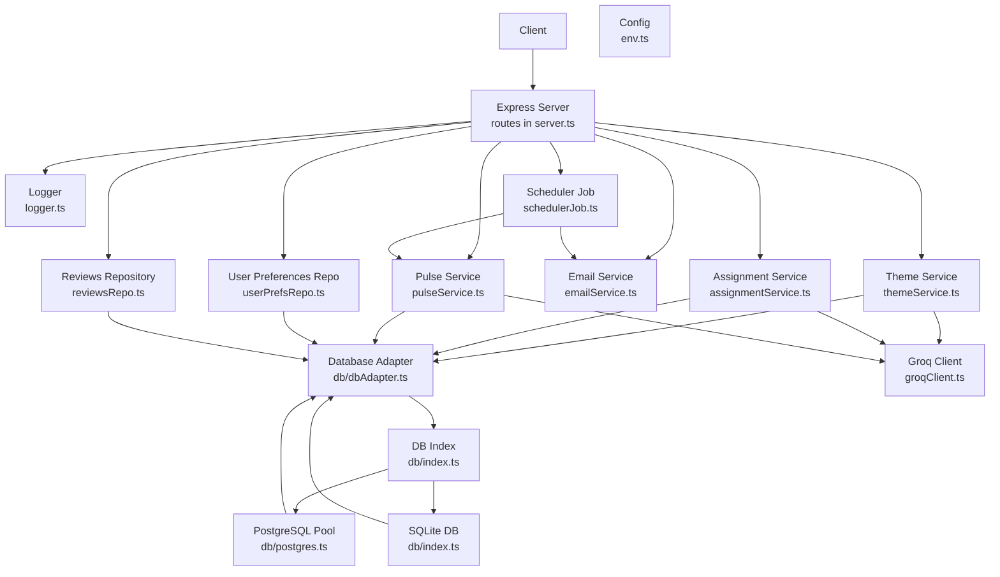

**Diagram sources**
- [server.ts:1-406](file://phase-2/src/api/server.ts#L1-L406)
- [logger.ts:1-21](file://phase-2/src/core/logger.ts#L1-L21)
- [env.ts:1-23](file://phase-2/src/config/env.ts#L1-L23)
- [db/dbAdapter.ts:1-178](file://phase-2/src/db/dbAdapter.ts#L1-L178)
- [db/index.ts:1-133](file://phase-2/src/db/index.ts#L1-L133)
- [db/postgres.ts:1-143](file://phase-2/src/db/postgres.ts#L1-L143)
- [themeService.ts:1-78](file://phase-2/src/services/themeService.ts#L1-L78)
- [assignmentService.ts:1-114](file://phase-2/src/services/assignmentService.ts#L1-L114)
- [pulseService.ts:1-200](file://phase-2/src/services/pulseService.ts#L1-L200)
- [emailService.ts:1-142](file://phase-2/src/services/emailService.ts#L1-L142)
- [userPrefsRepo.ts:1-95](file://phase-2/src/services/userPrefsRepo.ts#L1-L95)
- [reviewsRepo.ts:1-26](file://phase-2/src/services/reviewsRepo.ts#L1-L26)
- [schedulerJob.ts:1-98](file://phase-2/src/jobs/schedulerJob.ts#L1-L98)
- [groqClient.ts:1-67](file://phase-2/src/services/groqClient.ts#L1-L67)

**Section sources**
- [server.ts:1-406](file://phase-2/src/api/server.ts#L1-L406)
- [env.ts:1-23](file://phase-2/src/config/env.ts#L1-L23)
- [db/dbAdapter.ts:1-178](file://phase-2/src/db/dbAdapter.ts#L1-L178)
- [db/index.ts:1-133](file://phase-2/src/db/index.ts#L1-L133)

## Core Components
- Dashboard & Statistics
  - System stats: GET /api/reviews/stats (with dual database backend support and enhanced error handling)
- Review Management
  - List reviews: GET /api/reviews (with parameterized queries and robust error handling)
  - Scrape reviews: POST /api/reviews/scrape (with improved error reporting)
  - Weekly reviews: GET /api/reviews/week/:weekStart (with enhanced validation)
- Theme Management
  - Generate themes: POST /api/themes/generate (with improved async/await patterns)
  - List themes: GET /api/themes (with enhanced error handling)
  - Assign themes: POST /api/themes/assign (with comprehensive validation)
- Pulse Management
  - Generate pulses: POST /api/pulses/generate (with robust error handling)
  - List pulses: GET /api/pulses (with enhanced pagination)
  - Get pulse: GET /api/pulses/:id (with improved error reporting)
  - Send pulse email: POST /api/pulses/:id/send-email (with comprehensive validation)
- User Preferences
  - Save preferences: POST /api/user-preferences (with enhanced validation and error handling)
  - Get preferences: GET /api/user-preferences (with improved error reporting)
- Email Testing
  - Test SMTP: POST /api/email/test (with robust error handling)
- Automation
  - Scheduler: runs periodically to generate and deliver pulses based on preferences with enhanced error handling

**Section sources**
- [server.ts:57-388](file://phase-2/src/api/server.ts#L57-L388)

## Architecture Overview
The API exposes endpoints that orchestrate data ingestion, LLM-powered analytics, and email delivery. The database layer now supports dual backend configuration with runtime selection based on environment variables. The PostgreSQL backend uses connection pooling for production deployments with SSL configuration, while SQLite serves local development needs with enhanced error handling.

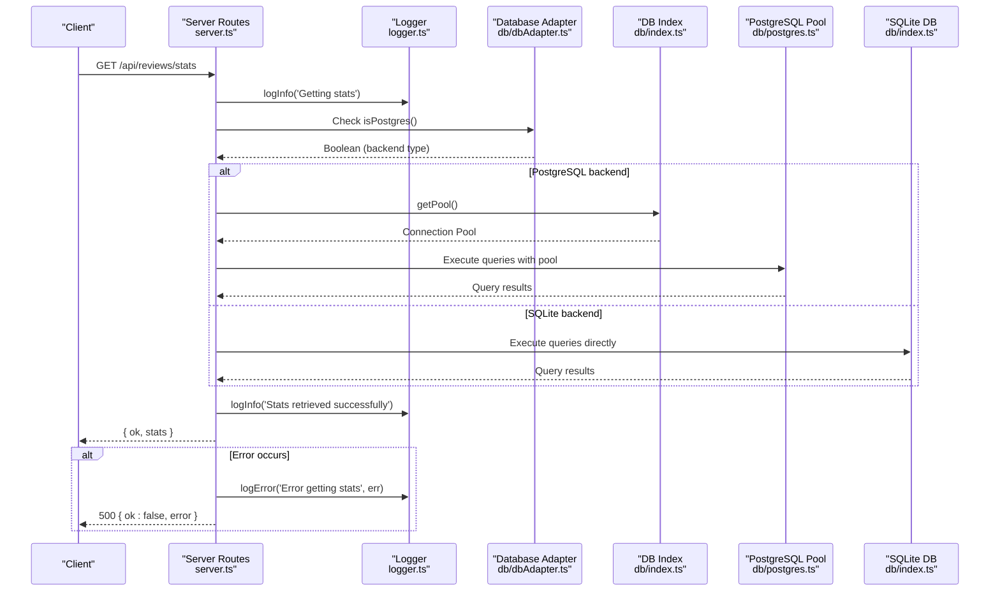

**Diagram sources**
- [server.ts:57-111](file://phase-2/src/api/server.ts#L57-L111)
- [logger.ts:1-21](file://phase-2/src/core/logger.ts#L1-L21)
- [db/dbAdapter.ts:13-22](file://phase-2/src/db/dbAdapter.ts#L13-L22)
- [db/index.ts:6-19](file://phase-2/src/db/index.ts#L6-L19)
- [db/postgres.ts:6-25](file://phase-2/src/db/postgres.ts#L6-L25)

## Detailed Component Analysis

### Dashboard & Statistics Endpoints
- GET /api/reviews/stats
  - Purpose: Retrieve system statistics including total reviews, themes, weeks covered, and last pulse date.
  - Backend Selection: Automatically selects between PostgreSQL and SQLite based on DATABASE_URL environment variable.
  - PostgreSQL Path:
    - Uses connection pooling for efficient database operations with SSL configuration
    - Executes optimized queries for counts and last pulse date
    - Handles PostgreSQL-specific data types and timestamp formats
    - Enhanced error handling with structured logging
  - SQLite Path:
    - Direct database queries for local development with graceful fallback
    - Handles SQLite-specific data types and date formats
    - Graceful fallback when tables don't exist
    - Comprehensive error handling with descriptive messages
  - Response:
    - ok: boolean
    - stats: {
        totalReviews: number
        totalThemes: number
        weeksCovered: number
        lastPulseDate: string|null
      }
  - Error handling:
    - 500 on database query failure with structured error logging
    - Descriptive error messages with error context
    - Proper error logging for both backend types

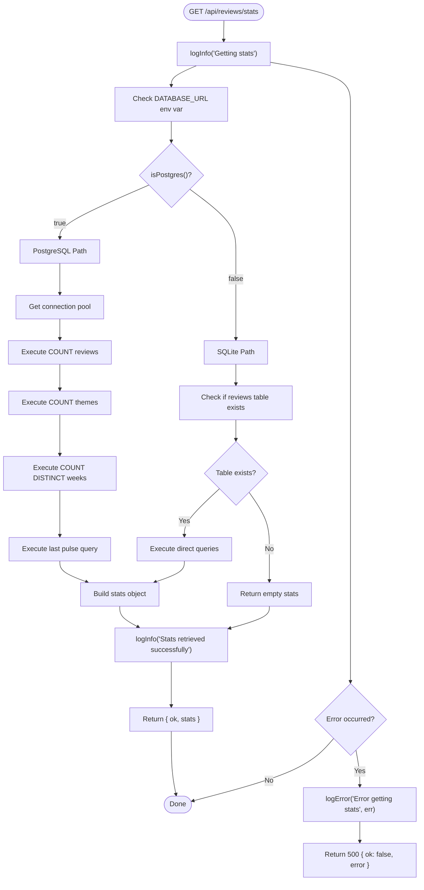

**Diagram sources**
- [server.ts:57-111](file://phase-2/src/api/server.ts#L57-L111)
- [logger.ts:1-21](file://phase-2/src/core/logger.ts#L1-L21)
- [db/index.ts:6-19](file://phase-2/src/db/index.ts#L6-L19)

**Section sources**
- [server.ts:57-111](file://phase-2/src/api/server.ts#L57-L111)
- [logger.ts:1-21](file://phase-2/src/core/logger.ts#L1-L21)
- [db/index.ts:6-19](file://phase-2/src/db/index.ts#L6-L19)
- [db/postgres.ts:6-25](file://phase-2/src/db/postgres.ts#L6-L25)

### Review Management Endpoints
- GET /api/reviews
  - Purpose: List reviews with optional filtering by week_start, minRating, and maxRating.
  - Query parameters:
    - week_start: string (YYYY-MM-DD)
    - minRating: number
    - maxRating: number
  - Response:
    - ok: boolean
    - reviews: array of ReviewRow objects
  - Error handling:
    - 500 on database query failure with structured error logging
    - Descriptive error messages with error context
    - Parameter validation with clear error messages
- POST /api/reviews/scrape
  - Purpose: Trigger review scraping (currently points to Phase 1 API).
  - Response:
    - ok: boolean
    - message: string indicating to use Phase 1 API
  - Error handling:
    - 500 on processing error with structured error logging
    - Descriptive error messages with error context
- GET /api/reviews/week/:weekStart
  - Purpose: List reviews for a specific week (debug helper).
  - Path parameters:
    - weekStart: string (YYYY-MM-DD)
  - Response:
    - ok: boolean
    - reviews: array of ReviewRow objects
  - Error handling:
    - 500 on database query failure with structured error logging
    - Descriptive error messages with error context

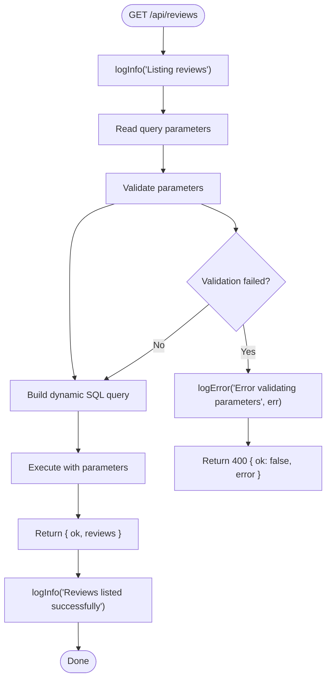

**Diagram sources**
- [server.ts:113-142](file://phase-2/src/api/server.ts#L113-L142)
- [logger.ts:1-21](file://phase-2/src/core/logger.ts#L1-L21)
- [reviewsRepo.ts:4-24](file://phase-2/src/services/reviewsRepo.ts#L4-L24)

**Section sources**
- [server.ts:113-142](file://phase-2/src/api/server.ts#L113-L142)
- [logger.ts:1-21](file://phase-2/src/core/logger.ts#L1-L21)
- [reviewsRepo.ts:4-24](file://phase-2/src/services/reviewsRepo.ts#L4-L24)

### Theme Management Endpoints
- POST /api/themes/generate
  - Purpose: Generate 3–5 themes from recent reviews and store them.
  - Query/body parameters:
    - weeksBack: number (default 12)
    - limit: number (default 800)
  - Validation:
    - Uses numeric defaults if missing or invalid.
  - Response:
    - ok: boolean
    - themes: array of theme objects with id, name, description
  - Error handling:
    - 500 on failure with structured error logging
    - Descriptive error messages with error context
    - Enhanced async/await patterns for better error propagation
  - Notes:
    - Relies on LLM via Groq client; requires API key.
    - Zod validates theme schema (name length, description length).
- GET /api/themes
  - Purpose: List latest themes.
  - Parameters:
    - limit: number (default 5)
  - Response:
    - ok: boolean
    - themes: array of { id, name, description }
  - Error handling:
    - 500 on failure with structured error logging
    - Descriptive error messages with error context
- POST /api/themes/assign
  - Purpose: Assign reviews for a week to the latest themes.
  - Body parameters:
    - week_start: string (YYYY-MM-DD)
  - Validation:
    - week_start must match date pattern; otherwise 400.
  - Response:
    - ok: boolean
    - Stats: assigned, skipped, themes
  - Error handling:
    - 500 on failure with structured error logging
    - Descriptive error messages with error context
    - Enhanced async/await patterns for better error propagation

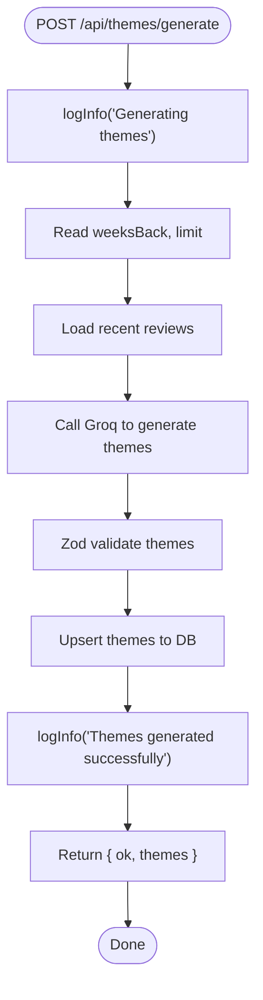

**Diagram sources**
- [server.ts:162-177](file://phase-2/src/api/server.ts#L162-L177)
- [logger.ts:1-21](file://phase-2/src/core/logger.ts#L1-L21)
- [themeService.ts:17-37](file://phase-2/src/services/themeService.ts#L17-L37)
- [groqClient.ts:30-65](file://phase-2/src/services/groqClient.ts#L30-L65)

**Section sources**
- [server.ts:162-177](file://phase-2/src/api/server.ts#L162-L177)
- [logger.ts:1-21](file://phase-2/src/core/logger.ts#L1-L21)
- [themeService.ts:6-13](file://phase-2/src/services/themeService.ts#L6-L13)
- [themeService.ts:17-66](file://phase-2/src/services/themeService.ts#L17-L66)
- [groqClient.ts:30-65](file://phase-2/src/services/groqClient.ts#L30-L65)

### Pulse Generation Endpoints
- POST /api/pulses/generate
  - Purpose: Generate weekly pulse for a given week.
  - Body parameters:
    - week_start: string (YYYY-MM-DD)
  - Validation:
    - week_start must match date pattern; otherwise 400.
  - Response:
    - ok: boolean
    - pulse: WeeklyPulse object
  - Error handling:
    - 500 on failure with structured error logging
    - Descriptive error messages with error context
    - Enhanced async/await patterns for better error propagation
- GET /api/pulses
  - Purpose: List recent pulses.
  - Parameters:
    - limit: number (default 20)
  - Response:
    - ok: boolean
    - pulses: array of WeeklyPulse
- GET /api/pulses/:id
  - Purpose: Retrieve a single pulse by id.
  - Path parameters:
    - id: number
  - Validation:
    - id must be numeric; otherwise 400.
    - Not found if absent; 404.
  - Response:
    - ok: boolean
    - pulse: WeeklyPulse
- POST /api/pulses/:id/send-email
  - Purpose: Email a pulse to a recipient.
  - Path parameters:
    - id: number
  - Body parameters:
    - to: string (optional; falls back to active user preference email)
  - Validation:
    - id must be numeric; otherwise 400.
    - Not found if absent; 404.
    - Requires valid to or active user preferences; otherwise 400.
  - Response:
    - ok: boolean
    - message: success confirmation

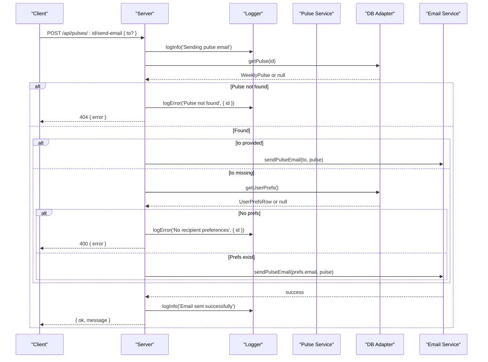

**Diagram sources**
- [server.ts:257-288](file://phase-2/src/api/server.ts#L257-L288)
- [logger.ts:1-21](file://phase-2/src/core/logger.ts#L1-L21)
- [pulseService.ts:243-252](file://phase-2/src/services/pulseService.ts#L243-L252)
- [emailService.ts:114-129](file://phase-2/src/services/emailService.ts#L114-L129)
- [userPrefsRepo.ts:50-56](file://phase-2/src/services/userPrefsRepo.ts#L50-L56)

**Section sources**
- [server.ts:210-288](file://phase-2/src/api/server.ts#L210-L288)
- [logger.ts:1-21](file://phase-2/src/core/logger.ts#L1-L21)
- [pulseService.ts:28-38](file://phase-2/src/services/pulseService.ts#L28-L38)
- [pulseService.ts:179-241](file://phase-2/src/services/pulseService.ts#L179-L241)
- [pulseService.ts:243-264](file://phase-2/src/services/pulseService.ts#L243-L264)

### User Preference Management Endpoints
- POST /api/user-preferences
  - Purpose: Save or update user preferences and activate them.
  - Body parameters:
    - email: string (required; must include @)
    - timezone: string (required; e.g., "Asia/Kolkata")
    - preferred_day_of_week: number (0=Sunday – 6=Saturday)
    - preferred_time: string ("HH:MM", 24-hour)
  - Validation:
    - 400 on invalid fields with descriptive error messages.
  - Behavior:
    - Deactivates previously active preferences and activates the new one.
  - Response:
    - ok: boolean
    - preferences: saved UserPrefsRow
    - confirmation: human-readable schedule summary
- GET /api/user-preferences
  - Purpose: Retrieve currently active preferences.
  - Response:
    - ok: boolean
    - preferences: UserPrefsRow or 404 if none

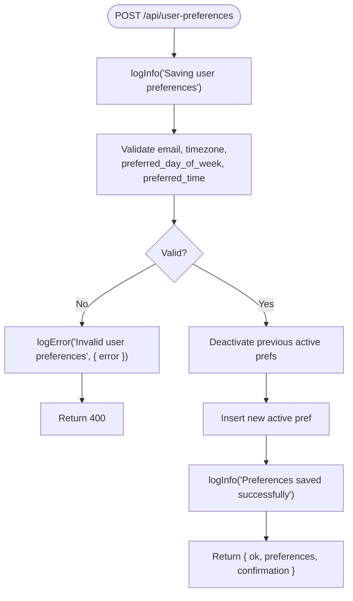

**Diagram sources**
- [server.ts:294-331](file://phase-2/src/api/server.ts#L294-L331)
- [logger.ts:1-21](file://phase-2/src/core/logger.ts#L1-L21)
- [userPrefsRepo.ts:21-43](file://phase-2/src/services/userPrefsRepo.ts#L21-L43)

**Section sources**
- [server.ts:294-331](file://phase-2/src/api/server.ts#L294-L331)
- [logger.ts:1-21](file://phase-2/src/core/logger.ts#L1-L21)
- [userPrefsRepo.ts:3-15](file://phase-2/src/services/userPrefsRepo.ts#L3-L15)
- [userPrefsRepo.ts:21-56](file://phase-2/src/services/userPrefsRepo.ts#L21-L56)

### Email Service Endpoints
- POST /api/email/test
  - Purpose: Verify SMTP configuration by sending a test email.
  - Body parameters:
    - to: string (required; must include @)
  - Validation:
    - 400 if invalid email.
  - Response:
    - ok: boolean
    - message: success confirmation

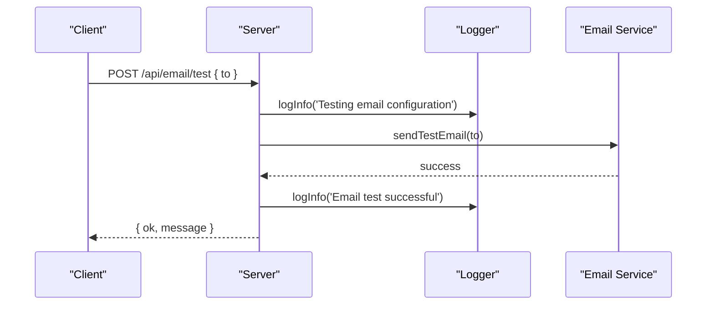

**Diagram sources**
- [server.ts:352-366](file://phase-2/src/api/server.ts#L352-L366)
- [logger.ts:1-21](file://phase-2/src/core/logger.ts#L1-L21)
- [emailService.ts:132-141](file://phase-2/src/services/emailService.ts#L132-L141)

**Section sources**
- [server.ts:352-366](file://phase-2/src/api/server.ts#L352-L366)
- [logger.ts:1-21](file://phase-2/src/core/logger.ts#L1-L21)
- [emailService.ts:99-141](file://phase-2/src/services/emailService.ts#L99-L141)

### Automation and Scheduling
- Scheduler
  - Starts automatically if Groq API key is present.
  - Runs every 5 minutes by default.
  - Enhanced error handling with structured logging for all operations.
  - Finds due preferences, generates the latest pulse for the last full week, sends email, and records job status.
- Due preferences calculation
  - Determines next send time based on preferred day/time and checks against current UTC time.
  - Filters preferences that have no sent scheduled job for the current ISO week and whose next send time is now or earlier.

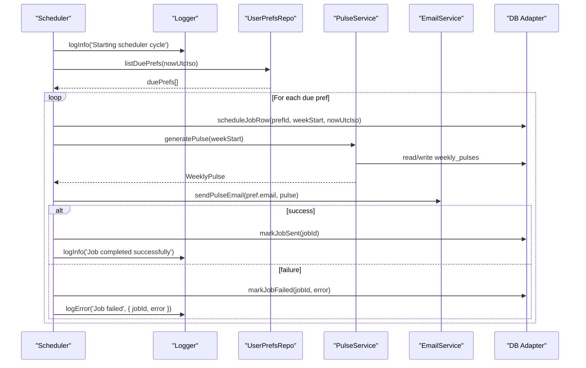

**Diagram sources**
- [schedulerJob.ts:52-84](file://phase-2/src/jobs/schedulerJob.ts#L52-L84)
- [logger.ts:1-21](file://phase-2/src/core/logger.ts#L1-L21)
- [userPrefsRepo.ts:83-94](file://phase-2/src/services/userPrefsRepo.ts#L83-L94)
- [pulseService.ts:179-241](file://phase-2/src/services/pulseService.ts#L179-L241)
- [emailService.ts:114-129](file://phase-2/src/services/emailService.ts#L114-L129)

**Section sources**
- [server.ts:388-397](file://phase-2/src/api/server.ts#L388-L397)
- [logger.ts:1-21](file://phase-2/src/core/logger.ts#L1-L21)
- [schedulerJob.ts:1-98](file://phase-2/src/jobs/schedulerJob.ts#L1-L98)
- [userPrefsRepo.ts:62-94](file://phase-2/src/services/userPrefsRepo.ts#L62-L94)

## Dependency Analysis
- External dependencies:
  - Express for routing with enhanced error handling
  - better-sqlite3 for SQLite database with improved error reporting
  - pg for PostgreSQL connection pooling with SSL configuration
  - groq-sdk for LLM with robust error handling
  - nodemailer for email with enhanced error reporting
  - zod for schema validation with descriptive error messages
  - cors for cross-origin resource sharing with environment-specific configuration
- Internal dependencies:
  - server.ts depends on services and config with structured logging
  - services depend on db adapter and config with enhanced error handling
  - scheduler depends on pulse and email services with comprehensive logging
  - db adapter provides unified interface for both database backends

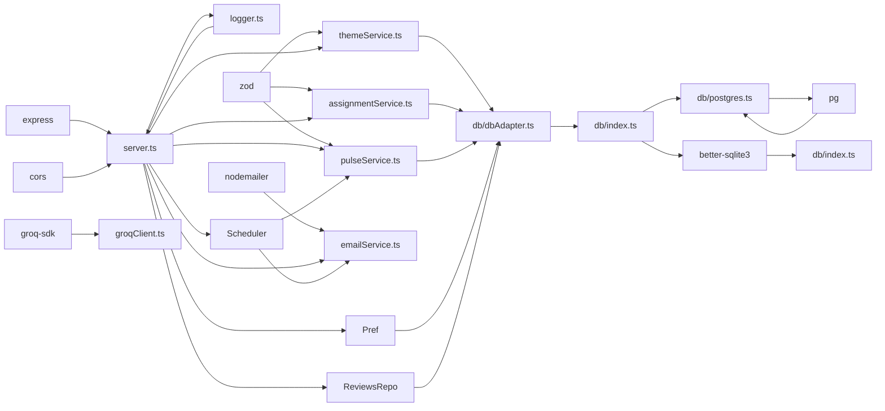

**Diagram sources**
- [package.json:13-22](file://phase-2/package.json#L13-L22)
- [server.ts:1-15](file://phase-2/src/api/server.ts#L1-L15)
- [logger.ts:1-21](file://phase-2/src/core/logger.ts#L1-L21)
- [db/dbAdapter.ts:1-178](file://phase-2/src/db/dbAdapter.ts#L1-L178)
- [db/index.ts:1-5](file://phase-2/src/db/index.ts#L1-L5)
- [db/postgres.ts:1-2](file://phase-2/src/db/postgres.ts#L1-L2)
- [groqClient.ts:1-7](file://phase-2/src/services/groqClient.ts#L1-L7)
- [emailService.ts:1-6](file://phase-2/src/services/emailService.ts#L1-L6)

**Section sources**
- [package.json:13-22](file://phase-2/package.json#L13-L22)
- [server.ts:1-15](file://phase-2/src/api/server.ts#L1-L15)
- [logger.ts:1-21](file://phase-2/src/core/logger.ts#L1-L21)

## Performance Considerations
- Dual database backend support:
  - PostgreSQL connection pooling for production scalability with SSL configuration
  - SQLite for lightweight local development with graceful fallback
  - Runtime backend selection based on environment variables with enhanced error handling
- Batch processing:
  - Assignment service processes reviews in batches to control token usage and throughput.
  - Enhanced async/await patterns for better error propagation and resource management.
- Database indexing:
  - Unique indexes on themes and weekly pulses, and indexes on review_themes and scheduled_jobs improve lookup performance.
  - PostgreSQL-specific optimizations for production deployments.
- LLM retries:
  - Groq client retries with increasing temperature to improve JSON extraction reliability.
  - Enhanced error handling for LLM operations with structured logging.
- Word count enforcement:
  - Weekly note generation enforces a strict word limit and regenerates if exceeded.
  - Improved error handling for content generation failures.
- CORS optimization:
  - Environment-specific CORS configuration reduces unnecessary preflight requests in production.
- Structured logging:
  - Consistent logging patterns across all endpoints for better observability.
  - Enhanced error logging with context information for debugging.

**Section sources**
- [db/index.ts:6-19](file://phase-2/src/db/index.ts#L6-L19)
- [db/postgres.ts:6-25](file://phase-2/src/db/postgres.ts#L6-L25)
- [db/dbAdapter.ts:13-22](file://phase-2/src/db/dbAdapter.ts#L13-L22)
- [assignmentService.ts:21-67](file://phase-2/src/services/assignmentService.ts#L21-L67)
- [db/index.ts:19-88](file://phase-2/src/db/index.ts#L19-L88)
- [groqClient.ts:39-65](file://phase-2/src/services/groqClient.ts#L39-L65)
- [pulseService.ts:134-172](file://phase-2/src/services/pulseService.ts#L134-L172)
- [server.ts:26-47](file://phase-2/src/api/server.ts#L26-L47)
- [logger.ts:1-21](file://phase-2/src/core/logger.ts#L1-L21)

## Troubleshooting Guide
- Authentication and Authorization
  - No authentication middleware is implemented in the server. Treat endpoints as internal-only or protect behind an API gateway in production.
- CORS Configuration
  - Server includes CORS middleware with environment-specific origins. In production, configure FRONTEND_URL environment variable.
- Environment configuration
  - Missing SMTP credentials cause email errors; missing GROQ API key prevents scheduler from starting.
  - DATABASE_URL environment variable determines backend selection (PostgreSQL if set, SQLite if not).
  - Enhanced error handling for missing environment variables with descriptive messages.
- Parameter validation
  - Date formats, numeric ranges, and email patterns are validated in routes; invalid inputs return 400 with structured error messages.
- Error handling
  - Routes wrap handlers in try/catch and log errors with structured logging; responses include ok:false and detailed error messages.
  - Enhanced error logging with context information for debugging.
- Database backend selection
  - PostgreSQL: Requires DATABASE_URL environment variable and connection pool initialization with SSL configuration
  - SQLite: Uses local database file specified in config with graceful fallback
  - Automatic fallback ensures graceful degradation with descriptive error messages
- PII scrubbing
  - All user-facing text is scrubbed before storage or delivery with enhanced validation.
- Logging and Monitoring
  - Consistent logInfo/logError patterns for all operations
  - Structured logging with metadata for better observability
  - Enhanced error reporting with stack traces and context information

**Section sources**
- [server.ts:26-47](file://phase-2/src/api/server.ts#L26-L47)
- [server.ts:57-111](file://phase-2/src/api/server.ts#L57-L111)
- [emailService.ts:99-102](file://phase-2/src/services/emailService.ts#L99-L102)
- [env.ts:16-21](file://phase-2/src/config/env.ts#L16-L21)
- [groqClient.ts:35-37](file://phase-2/src/services/groqClient.ts#L35-L37)
- [db/index.ts:6-19](file://phase-2/src/db/index.ts#L6-L19)
- [db/postgres.ts:8-11](file://phase-2/src/db/postgres.ts#L8-L11)
- [piiScrubber.ts:22-28](file://phase-2/src/services/piiScrubber.ts#L22-L28)
- [logger.ts:1-21](file://phase-2/src/core/logger.ts#L1-L21)

## Conclusion
Phase 2 introduces robust APIs for theme generation, review assignment, weekly pulse creation, user preference management, and automated email delivery. The system now supports dual database backend configurations with PostgreSQL connection pooling for production deployments and SQLite for development. The enhanced statistics endpoint demonstrates the flexibility of the runtime database selection logic, while maintaining strong validation, PII scrubbing, and operational safeguards.

The system features comprehensive error handling with structured logging, enhanced async/await patterns for better error propagation, and a unified database adapter that seamlessly handles both SQLite and PostgreSQL backends. All endpoints now provide more descriptive error messages and improved error reporting capabilities.

Production deployments should enforce authentication, configure rate limiting, monitor LLM usage and email deliverability, properly set up database environment variables for optimal performance, and leverage the enhanced logging infrastructure for better observability and troubleshooting.

## Appendices

### API Reference

- Dashboard & Statistics
  - GET /api/reviews/stats
    - Response: { ok: boolean; stats: { totalReviews: number; totalThemes: number; weeksCovered: number; lastPulseDate: string|null } }
    - Backend: Automatically selects PostgreSQL (connection pool with SSL) or SQLite based on DATABASE_URL environment variable
    - Error Handling: Structured logging with descriptive error messages
- Review Management
  - GET /api/reviews
    - Query: { week_start?: string; minRating?: number; maxRating?: number }
    - Response: { ok: boolean; reviews: ReviewRow[] }
    - Error Handling: Parameter validation with 400 responses and structured error logging
  - POST /api/reviews/scrape
    - Response: { ok: boolean; message: string }
    - Error Handling: Enhanced error reporting with descriptive messages
  - GET /api/reviews/week/:weekStart
    - Response: { ok: boolean; reviews: ReviewRow[] }
    - Error Handling: Structured logging and comprehensive error handling
- Theme Management
  - POST /api/themes/generate
    - Body: { weeksBack?: number; limit?: number }
    - Response: { ok: boolean; themes: [{ id: number; name: string; description: string }] }
    - Error Handling: Enhanced async/await patterns with descriptive error messages
  - GET /api/themes
    - Query: { limit?: number }
    - Response: { ok: boolean; themes: [...] }
    - Error Handling: Structured error logging with fallback mechanisms
  - POST /api/themes/assign
    - Body: { week_start: string (YYYY-MM-DD) }
    - Response: { ok: boolean; assigned: number; skipped: number; themes: number }
    - Error Handling: Comprehensive validation with 400 responses and enhanced error reporting
- Pulse Management
  - POST /api/pulses/generate
    - Body: { week_start: string (YYYY-MM-DD) }
    - Response: { ok: boolean; pulse: WeeklyPulse }
    - Error Handling: Enhanced async/await patterns with structured error logging
  - GET /api/pulses
    - Query: { limit?: number }
    - Response: { ok: boolean; pulses: [WeeklyPulse] }
  - GET /api/pulses/:id
    - Response: { ok: boolean; pulse: WeeklyPulse }
    - Error Handling: 404 handling with descriptive error messages
  - POST /api/pulses/:id/send-email
    - Body: { to?: string }
    - Response: { ok: boolean; message: string }
    - Error Handling: Comprehensive validation with 400/404 responses and enhanced error reporting
- User Preferences
  - POST /api/user-preferences
    - Body: { email: string; timezone: string; preferred_day_of_week: number; preferred_time: string }
    - Response: { ok: boolean; preferences: UserPrefsRow; confirmation: string }
    - Error Handling: Enhanced validation with descriptive error messages
  - GET /api/user-preferences
    - Response: { ok: boolean; preferences: UserPrefsRow | null }
    - Error Handling: 404 handling with structured error logging
- Email Testing
  - POST /api/email/test
    - Body: { to: string }
    - Response: { ok: boolean; message: string }
    - Error Handling: Parameter validation with 400 responses and enhanced error reporting

**Section sources**
- [server.ts:57-388](file://phase-2/src/api/server.ts#L57-L388)
- [logger.ts:1-21](file://phase-2/src/core/logger.ts#L1-L21)

### Database Configuration

- Environment Variables
  - DATABASE_URL: PostgreSQL connection string (enables PostgreSQL backend with SSL configuration)
  - DATABASE_FILE: SQLite database file path (default: 'phase1.db')
  - GROQ_API_KEY: LLM API key for scheduler functionality
  - SMTP_*: Email service configuration variables
- Backend Selection Logic
  - PostgreSQL: Used when DATABASE_URL is present with connection pooling and SSL configuration
  - SQLite: Used as fallback for local development with graceful fallback
  - Automatic runtime switching based on environment detection with enhanced error handling
- Database Adapter
  - Unified interface for both SQLite and PostgreSQL operations
  - Automatic parameter placeholder conversion (? to $1, $2, etc.) for PostgreSQL
  - Transaction support for both backends with consistent error handling
  - Enhanced async/await patterns for better resource management

**Section sources**
- [db/index.ts:6-19](file://phase-2/src/db/index.ts#L6-L19)
- [db/postgres.ts:8-11](file://phase-2/src/db/postgres.ts#L8-L11)
- [env.ts:16-21](file://phase-2/src/config/env.ts#L16-L21)
- [db/dbAdapter.ts:13-22](file://phase-2/src/db/dbAdapter.ts#L13-L22)

### Data Models

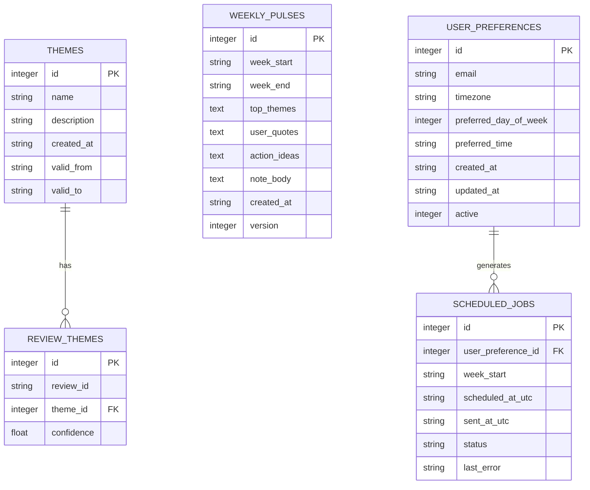

**Diagram sources**
- [db/index.ts:24-125](file://phase-2/src/db/index.ts#L24-L125)

### Request/Response Schemas

- ThemeDef
  - name: string (min 2, max 60)
  - description: string (min 5, max 200)
- WeeklyPulse
  - id: number
  - week_start: string (YYYY-MM-DD)
  - week_end: string (YYYY-MM-DD)
  - top_themes: array of ThemeSummary
  - user_quotes: array of Quote
  - action_ideas: array of ActionIdea
  - note_body: string (<= 2000 chars)
  - created_at: string (ISO)
  - version: number
- ThemeSummary
  - theme_id: number
  - name: string
  - description: string
  - review_count: number
  - avg_rating: number
- Quote
  - text: string
  - rating: number
- ActionIdea
  - idea: string (min 5, max 300)
- UserPrefsRow
  - id: number
  - email: string
  - timezone: string
  - preferred_day_of_week: number (0–6)
  - preferred_time: string ("HH:MM")
  - created_at: string (ISO)
  - updated_at: string (ISO)
  - active: number (boolean flag)

**Section sources**
- [themeService.ts:6-13](file://phase-2/src/services/themeService.ts#L6-L13)
- [pulseService.ts:11-38](file://phase-2/src/services/pulseService.ts#L11-L38)
- [userPrefsRepo.ts:3-15](file://phase-2/src/services/userPrefsRepo.ts#L3-L15)

### Example Workflows

- Theme-to-Pulse Assignment
  - Steps:
    1. POST /api/themes/generate (weeksBack, limit) with enhanced error handling
    2. POST /api/themes/assign (week_start) with comprehensive validation
    3. POST /api/pulses/generate (week_start) with structured error logging
    4. GET /api/pulses/:id with 404 handling
    5. POST /api/pulses/:id/send-email (to?) with enhanced validation
  - Validation:
    - Ensure week_start matches date pattern with descriptive error messages.
    - Ensure themes exist before generating pulse with structured error reporting.
- Automated Scheduling
  - Steps:
    1. POST /api/user-preferences (email, timezone, preferred_day_of_week, preferred_time) with enhanced validation
    2. Wait for scheduler tick (every 5 minutes) or trigger runSchedulerOnce manually
    3. Scheduler finds due preferences, generates pulse, sends email, records job with comprehensive error handling
  - Validation:
    - nextSendUtc computes the next send time; listDuePrefs filters eligible preferences.
    - Enhanced error logging for all scheduler operations.
- Preference-Based Filtering
  - Steps:
    1. GET /api/user-preferences to retrieve active preferences with 404 handling
    2. Use preferences to compute next send time and filter due recipients
- Database Backend Switching
  - Steps:
    1. Set DATABASE_URL environment variable for PostgreSQL deployment with SSL configuration
    2. Access /api/reviews/stats to automatically use PostgreSQL connection pool
    3. Remove DATABASE_URL for local development to use SQLite with graceful fallback
- Error Handling Patterns
  - Steps:
    1. All endpoints use try/catch blocks with structured logging
    2. Descriptive error messages with error context
    3. Consistent HTTP status codes (400, 404, 500) with ok:false responses
    4. Enhanced async/await patterns for better error propagation

**Section sources**
- [server.ts:57-388](file://phase-2/src/api/server.ts#L57-L388)
- [userPrefsRepo.ts:50-94](file://phase-2/src/services/userPrefsRepo.ts#L50-L94)
- [schedulerJob.ts:52-84](file://phase-2/src/jobs/schedulerJob.ts#L52-L84)
- [db/index.ts:6-19](file://phase-2/src/db/index.ts#L6-L19)
- [logger.ts:1-21](file://phase-2/src/core/logger.ts#L1-L21)

### Security, Versioning, and Rate Limiting

- Security
  - No built-in authentication; deploy behind an API gateway or reverse proxy with authentication and TLS termination.
  - Validate and sanitize all inputs; PII scrubbing is applied before storage and delivery.
  - CORS configuration supports environment-specific origins for production deployments.
  - Database backend selection is transparent and secure based on environment variables.
  - Enhanced error handling prevents sensitive information leakage in error responses.
- API Versioning
  - No versioned route paths are used; consider adding a version prefix (e.g., /v1) in future iterations.
- Rate Limiting
  - Not implemented; consider adding middleware to throttle requests per IP or user.
- Database Security
  - PostgreSQL connection pooling with SSL configuration for Render compatibility
  - SQLite file-based storage for local development
  - Environment-based backend selection prevents accidental production misconfiguration
  - Enhanced error handling for database connection failures
- Logging Security
  - Structured logging with sensitive data redaction
  - Consistent error logging patterns for security monitoring
  - Enhanced error messages without exposing internal implementation details

**Section sources**
- [server.ts:1-406](file://phase-2/src/api/server.ts#L1-L406)
- [env.ts:16-21](file://phase-2/src/config/env.ts#L16-L21)
- [server.ts:26-47](file://phase-2/src/api/server.ts#L26-L47)
- [db/postgres.ts:13-18](file://phase-2/src/db/postgres.ts#L13-L18)
- [logger.ts:1-21](file://phase-2/src/core/logger.ts#L1-L21)

### Tests and Validation References
- Pulse generation shape and word count enforcement with enhanced validation
- PII scrubber behavior with comprehensive test coverage
- User preferences CRUD and active-row semantics with robust validation
- Assignment persistence and schema allowances with error handling
- Review listing with filtering capabilities and parameter validation
- Database backend switching and connection pooling with enhanced error handling
- Statistics endpoint dual backend support with structured logging
- Async/await patterns and error propagation throughout the system
- Structured logging integration across all components

**Section sources**
- [pulse.test.ts:17-96](file://phase-2/src/tests/pulse.test.ts#L17-L96)
- [userPrefs.test.ts:50-98](file://phase-2/src/tests/userPrefs.test.ts#L50-L98)
- [assignment.test.ts:57-109](file://phase-2/src/tests/assignment.test.ts#L57-L109)
- [reviewsRepo.ts:4-24](file://phase-2/src/services/reviewsRepo.ts#L4-L24)
- [db/index.ts:6-19](file://phase-2/src/db/index.ts#L6-L19)
- [db/postgres.ts:6-25](file://phase-2/src/db/postgres.ts#L6-L25)
- [logger.ts:1-21](file://phase-2/src/core/logger.ts#L1-L21)