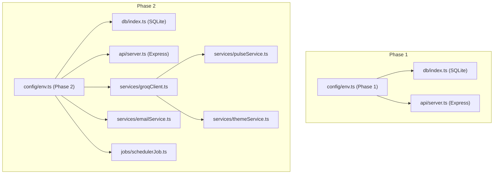
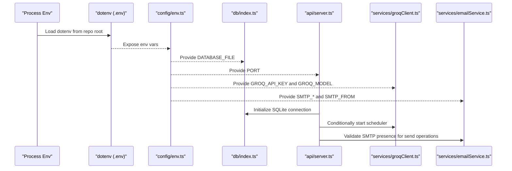
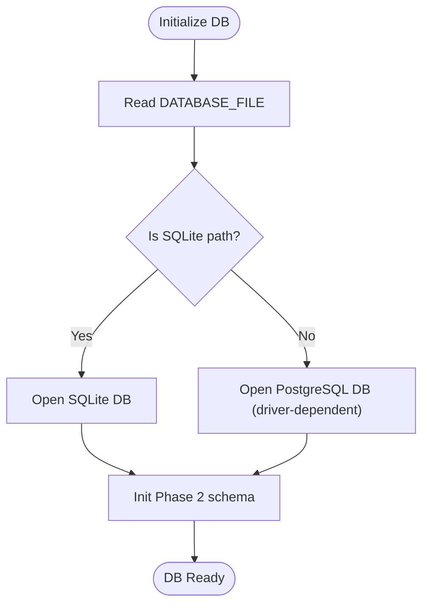
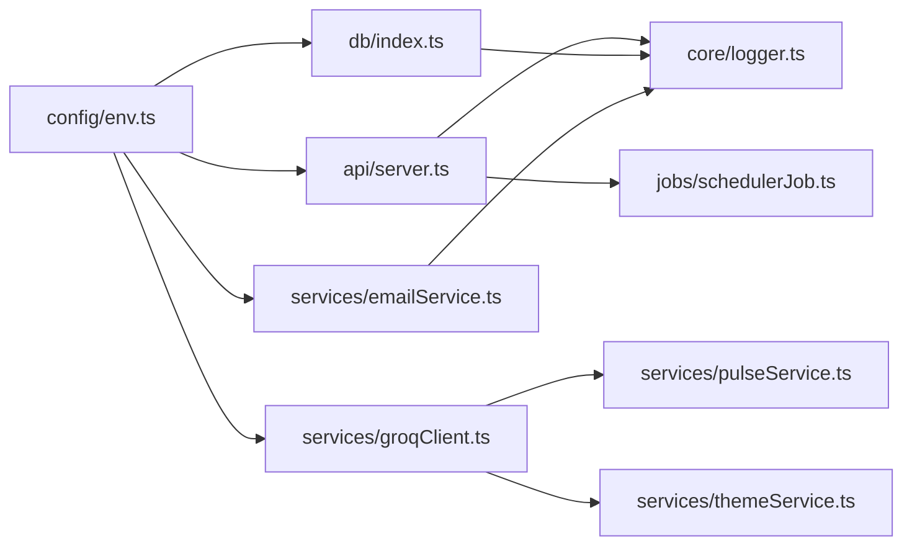

# Configuration Management

<cite>
**Referenced Files in This Document**
- [env.ts](file://phase-2/src/config/env.ts)
- [env.ts](file://phase-1/src/config/env.ts)
- [index.ts](file://phase-2/src/db/index.ts)
- [index.ts](file://phase-1/src/db/index.ts)
- [server.ts](file://phase-2/src/api/server.ts)
- [server.ts](file://phase-1/src/api/server.ts)
- [groqClient.ts](file://phase-2/src/services/groqClient.ts)
- [emailService.ts](file://phase-2/src/services/emailService.ts)
- [schedulerJob.ts](file://phase-2/src/jobs/schedulerJob.ts)
- [pulseService.ts](file://phase-2/src/services/pulseService.ts)
- [themeService.ts](file://phase-2/src/services/themeService.ts)
- [logger.ts](file://phase-2/src/core/logger.ts)
- [logger.ts](file://phase-1/src/core/logger.ts)
- [package.json](file://phase-2/package.json)
</cite>

## Table of Contents
1. [Introduction](#introduction)
2. [Project Structure](#project-structure)
3. [Core Components](#core-components)
4. [Architecture Overview](#architecture-overview)
5. [Detailed Component Analysis](#detailed-component-analysis)
6. [Dependency Analysis](#dependency-analysis)
7. [Performance Considerations](#performance-considerations)
8. [Troubleshooting Guide](#troubleshooting-guide)
9. [Conclusion](#conclusion)
10. [Appendices](#appendices)

## Introduction
This document describes configuration management for the Groww App Review Insights Analyzer across phases. It covers environment variables, configuration loading patterns, defaults, validation, and security practices. It also documents database configuration for SQLite (development) and outlines how to adapt for PostgreSQL (production). Finally, it provides troubleshooting guidance and recommendations for configuration drift prevention and monitoring.

## Project Structure
Configuration is centralized in a dedicated module per phase and consumed by services, APIs, and jobs. Phase 1 focuses on a simple SQLite-backed setup and a basic HTTP server. Phase 2 introduces SMTP, Groq integration, scheduled jobs, and richer database schemas.

**Diagram sources**
- [env.ts:1-6](file://phase-1/src/config/env.ts#L1-L6)
- [index.ts:1-31](file://phase-1/src/db/index.ts#L1-L31)
- [server.ts:1-50](file://phase-1/src/api/server.ts#L1-L50)
- [env.ts:1-23](file://phase-2/src/config/env.ts#L1-L23)
- [index.ts:1-93](file://phase-2/src/db/index.ts#L1-L93)
- [server.ts:1-266](file://phase-2/src/api/server.ts#L1-L266)
- [groqClient.ts:1-67](file://phase-2/src/services/groqClient.ts#L1-L67)
- [emailService.ts:1-142](file://phase-2/src/services/emailService.ts#L1-L142)
- [schedulerJob.ts:1-98](file://phase-2/src/jobs/schedulerJob.ts#L1-L98)
- [pulseService.ts:1-200](file://phase-2/src/services/pulseService.ts#L1-L200)
- [themeService.ts:1-68](file://phase-2/src/services/themeService.ts#L1-L68)

**Section sources**
- [env.ts:1-6](file://phase-1/src/config/env.ts#L1-L6)
- [env.ts:1-23](file://phase-2/src/config/env.ts#L1-L23)
- [index.ts:1-31](file://phase-1/src/db/index.ts#L1-L31)
- [index.ts:1-93](file://phase-2/src/db/index.ts#L1-L93)
- [server.ts:1-50](file://phase-1/src/api/server.ts#L1-L50)
- [server.ts:1-266](file://phase-2/src/api/server.ts#L1-L266)

## Core Components
- Environment configuration loader: Loads environment variables and applies defaults.
- Database initialization: Uses the configured database file for SQLite.
- API server: Reads port and logs configuration details at startup.
- Groq client: Optional; enabled only when API key is present.
- Email service: Requires SMTP credentials; validates presence at runtime.
- Scheduler: Starts automatically when Groq API key is present.

Key configuration surfaces:
- DATABASE_FILE: Path to SQLite database file.
- PORT: Server port.
- GROQ_API_KEY: Enables Groq-powered features and scheduler.
- GROQ_MODEL: Model identifier for Groq requests.
- SMTP_HOST, SMTP_PORT, SMTP_USER, SMTP_PASS, SMTP_FROM: Email delivery configuration.

**Section sources**
- [env.ts:7-21](file://phase-2/src/config/env.ts#L7-L21)
- [index.ts:1-93](file://phase-2/src/db/index.ts#L1-L93)
- [server.ts:254-263](file://phase-2/src/api/server.ts#L254-L263)
- [groqClient.ts:4-7](file://phase-2/src/services/groqClient.ts#L4-L7)
- [emailService.ts:99-112](file://phase-2/src/services/emailService.ts#L99-L112)
- [schedulerJob.ts:90-97](file://phase-2/src/jobs/schedulerJob.ts#L90-L97)

## Architecture Overview
Configuration flows from environment to services and infrastructure components. The Phase 2 environment loader also loads secrets from a project-local dotenv file, enabling local development without leaking secrets into the repository.

**Diagram sources**
- [env.ts:1-23](file://phase-2/src/config/env.ts#L1-L23)
- [index.ts:1-93](file://phase-2/src/db/index.ts#L1-L93)
- [server.ts:1-266](file://phase-2/src/api/server.ts#L1-L266)
- [groqClient.ts:1-67](file://phase-2/src/services/groqClient.ts#L1-L67)
- [emailService.ts:1-142](file://phase-2/src/services/emailService.ts#L1-L142)

## Detailed Component Analysis

### Environment Configuration Loading
- Phase 1: Minimal configuration with defaults for database file and port.
- Phase 2: Loads dotenv from a project-local path, then exposes DATABASE_FILE, PORT, GROQ_API_KEY, GROQ_MODEL, and SMTP_* variables.

Validation and defaults:
- DATABASE_FILE defaults to a SQLite file path.
- PORT defaults to a development port.
- GROQ_API_KEY defaults to empty string; when absent, Groq-dependent features are disabled.
- GROQ_MODEL defaults to a specific model identifier.
- SMTP_* defaults to empty strings; runtime validation enforces required fields.

Security:
- dotenv is loaded from a specific path to avoid accidental exposure.
- Secrets are only used when required (e.g., scheduler starts only if Groq API key is present).

**Section sources**
- [env.ts:1-6](file://phase-1/src/config/env.ts#L1-L6)
- [env.ts:1-23](file://phase-2/src/config/env.ts#L1-L23)
- [server.ts:254-263](file://phase-2/src/api/server.ts#L254-L263)

### Database Configuration
- SQLite (development):
  - Phase 1: Single-table schema for reviews.
  - Phase 2: Multi-table schema including themes, review_themes, weekly_pulses, user_preferences, and scheduled_jobs.
  - Database file path is configurable via DATABASE_FILE.

- PostgreSQL (production):
  - Not implemented in the current codebase.
  - Recommended approach:
    - Replace SQLite driver with a PostgreSQL client.
    - Use DATABASE_URL-style connection strings.
    - Migrate Phase 2 schema to PostgreSQL-compatible DDL.
    - Keep DATABASE_FILE for local SQLite fallback if desired.

**Diagram sources**
- [index.ts:1-93](file://phase-2/src/db/index.ts#L1-L93)
- [env.ts:9-10](file://phase-2/src/config/env.ts#L9-L10)

**Section sources**
- [index.ts:1-31](file://phase-1/src/db/index.ts#L1-L31)
- [index.ts:1-93](file://phase-2/src/db/index.ts#L1-L93)
- [env.ts:9-10](file://phase-2/src/config/env.ts#L9-L10)

### API Server Configuration
- Reads port from configuration and logs it at startup.
- Initializes database schema on startup.
- Conditionally starts the scheduler if Groq API key is present.

Operational notes:
- Port is configurable to avoid conflicts during local development.
- Schema initialization occurs once per process start.

**Section sources**
- [server.ts:45-48](file://phase-1/src/api/server.ts#L45-L48)
- [server.ts](file://phase-2/src/api/server.ts#L16)
- [server.ts:254-263](file://phase-2/src/api/server.ts#L254-L263)

### Groq Client Configuration
- Enabled only when GROQ_API_KEY is set.
- Uses GROQ_MODEL for chat completions.
- Includes robust retry logic and JSON extraction from LLM responses.

Validation and error handling:
- Throws a clear error if Groq API key is missing.
- Retries on transient failures with increasing temperature.

**Section sources**
- [groqClient.ts:4-7](file://phase-2/src/services/groqClient.ts#L4-L7)
- [groqClient.ts:30-67](file://phase-2/src/services/groqClient.ts#L30-L67)
- [env.ts:13-14](file://phase-2/src/config/env.ts#L13-L14)

### Email Service Configuration
- Validates SMTP_HOST, SMTP_USER, SMTP_PASS at runtime.
- Uses SMTP_PORT to determine secure mode.
- Uses SMTP_FROM for the From header, falling back to SMTP_USER if not set.

Operational notes:
- SMTP credentials are mandatory for sending emails.
- Transport is created per-send operation.

**Section sources**
- [emailService.ts:99-112](file://phase-2/src/services/emailService.ts#L99-L112)
- [emailService.ts:114-129](file://phase-2/src/services/emailService.ts#L114-L129)
- [emailService.ts:132-141](file://phase-2/src/services/emailService.ts#L132-L141)
- [env.ts:16-20](file://phase-2/src/config/env.ts#L16-L20)

### Scheduler Configuration
- Starts automatically if GROQ_API_KEY is present.
- Runs on a fixed interval and processes due user preferences.
- Persists job outcomes in the database.

Operational notes:
- Scheduler is disabled without Groq API key to prevent unintended workloads.
- Job status tracking helps monitor reliability.

**Section sources**
- [server.ts:257-262](file://phase-2/src/api/server.ts#L257-L262)
- [schedulerJob.ts:90-97](file://phase-2/src/jobs/schedulerJob.ts#L90-L97)
- [env.ts](file://phase-2/src/config/env.ts#L13)

### Theme and Pulse Generation
- Groq-based theme generation requires GROQ_API_KEY.
- Weekly pulse generation depends on themes and assigned reviews.
- Both components enforce schema validation and sanitization.

Operational notes:
- If no themes exist, pulse generation fails early with a clear message.
- Word limits and schema hints ensure consistent outputs.

**Section sources**
- [pulseService.ts:179-188](file://phase-2/src/services/pulseService.ts#L179-L188)
- [themeService.ts:17-37](file://phase-2/src/services/themeService.ts#L17-L37)

## Dependency Analysis
Configuration dependencies across modules:

**Diagram sources**
- [env.ts:1-23](file://phase-2/src/config/env.ts#L1-L23)
- [index.ts:1-93](file://phase-2/src/db/index.ts#L1-L93)
- [server.ts:1-266](file://phase-2/src/api/server.ts#L1-L266)
- [groqClient.ts:1-67](file://phase-2/src/services/groqClient.ts#L1-L67)
- [emailService.ts:1-142](file://phase-2/src/services/emailService.ts#L1-L142)
- [schedulerJob.ts:1-98](file://phase-2/src/jobs/schedulerJob.ts#L1-L98)
- [pulseService.ts:1-200](file://phase-2/src/services/pulseService.ts#L1-L200)
- [themeService.ts:1-68](file://phase-2/src/services/themeService.ts#L1-L68)
- [logger.ts:1-21](file://phase-2/src/core/logger.ts#L1-L21)

**Section sources**
- [env.ts:1-23](file://phase-2/src/config/env.ts#L1-L23)
- [index.ts:1-93](file://phase-2/src/db/index.ts#L1-L93)
- [server.ts:1-266](file://phase-2/src/api/server.ts#L1-L266)
- [groqClient.ts:1-67](file://phase-2/src/services/groqClient.ts#L1-L67)
- [emailService.ts:1-142](file://phase-2/src/services/emailService.ts#L1-L142)
- [schedulerJob.ts:1-98](file://phase-2/src/jobs/schedulerJob.ts#L1-L98)
- [pulseService.ts:1-200](file://phase-2/src/services/pulseService.ts#L1-L200)
- [themeService.ts:1-68](file://phase-2/src/services/themeService.ts#L1-L68)
- [logger.ts:1-21](file://phase-2/src/core/logger.ts#L1-L21)

## Performance Considerations
- Environment loading is synchronous and happens at process start; keep the number of environment reads minimal.
- SQLite is suitable for development and small-scale production; consider connection pooling and indexing strategies for PostgreSQL.
- Email and Groq calls are externalized; tune retry delays and concurrency carefully to avoid rate limits.

## Troubleshooting Guide
Common configuration issues and resolutions:
- Missing GROQ_API_KEY:
  - Symptom: Scheduler does not start; Groq-dependent routes fail.
  - Resolution: Set GROQ_API_KEY and restart the server.
  - Reference: [server.ts:257-262](file://phase-2/src/api/server.ts#L257-L262), [groqClient.ts:35-37](file://phase-2/src/services/groqClient.ts#L35-L37)

- Missing SMTP credentials:
  - Symptom: Email routes throw errors; test email fails.
  - Resolution: Set SMTP_HOST, SMTP_USER, SMTP_PASS; optionally set SMTP_FROM.
  - Reference: [emailService.ts:100-102](file://phase-2/src/services/emailService.ts#L100-L102)

- Incorrect database file path:
  - Symptom: Schema initialization fails or database not found.
  - Resolution: Verify DATABASE_FILE; ensure the path exists and is writable.
  - Reference: [env.ts:9-10](file://phase-2/src/config/env.ts#L9-L10), [index.ts](file://phase-2/src/db/index.ts#L5)

- Port conflicts:
  - Symptom: Server fails to bind to the configured port.
  - Resolution: Change PORT environment variable.
  - Reference: [env.ts](file://phase-2/src/config/env.ts#L11), [server.ts:254-256](file://phase-2/src/api/server.ts#L254-L256)

- No themes available:
  - Symptom: Pulse generation fails with a “no themes” error.
  - Resolution: Generate themes first via the themes route.
  - Reference: [pulseService.ts:180-183](file://phase-2/src/services/pulseService.ts#L180-L183)

- Logger behavior:
  - Symptom: Unexpected logging output or missing metadata.
  - Resolution: Confirm logger usage and ensure metadata is passed consistently.
  - Reference: [logger.ts:1-21](file://phase-2/src/core/logger.ts#L1-L21), [logger.ts:1-23](file://phase-1/src/core/logger.ts#L1-L23)

## Conclusion
Configuration in this project is intentionally minimal and explicit. Phase 2 centralizes environment variables, loads secrets from a dotenv file, and gates sensitive features behind optional credentials. SQLite is used for development, with clear pathways to migrate to PostgreSQL. Robust validation and logging help maintain reliability and observability.

## Appendices

### Environment Variables Reference
- DATABASE_FILE: Path to SQLite database file. Defaults to a development file path.
- PORT: Server port. Defaults to a development port.
- GROQ_API_KEY: API key for Groq. Required to enable Groq features and scheduler.
- GROQ_MODEL: Model identifier for Groq requests. Defaults to a specific model.
- SMTP_HOST: SMTP server hostname.
- SMTP_PORT: SMTP server port. Defaults to a common port.
- SMTP_USER: SMTP username.
- SMTP_PASS: SMTP password.
- SMTP_FROM: Sender email address; falls back to SMTP_USER if not set.

**Section sources**
- [env.ts:7-21](file://phase-2/src/config/env.ts#L7-L21)

### Deployment-Specific Settings
- Local development:
  - Use dotenv to load secrets from the repository root.
  - SQLite database file path is configurable.
- Production:
  - Prefer environment injection over dotenv.
  - Consider PostgreSQL with a connection string.
  - Enable health checks and monitoring around configuration loading.

**Section sources**
- [env.ts:4-5](file://phase-2/src/config/env.ts#L4-L5)
- [package.json:7-11](file://phase-2/package.json#L7-L11)

### Security Best Practices
- Never commit secrets to version control; use environment injection or secret managers.
- Restrict SMTP_FROM to verified sender domains.
- Rotate API keys regularly and monitor usage.
- Sanitize outputs and logs to avoid leaking sensitive data.

### Configuration Drift Prevention
- Pin dependency versions and lockfiles.
- Use a centralized configuration loader and avoid ad-hoc environment reads.
- Document environment variables and their defaults in a shared spec.
- Add pre-deploy validation to verify required variables are set.

### Monitoring Configuration Changes
- Log configuration values at startup for auditability.
- Track configuration-related errors and retries.
- Integrate with health endpoints to surface configuration status.

**Section sources**
- [server.ts:254-256](file://phase-2/src/api/server.ts#L254-L256)
- [logger.ts:1-21](file://phase-2/src/core/logger.ts#L1-L21)