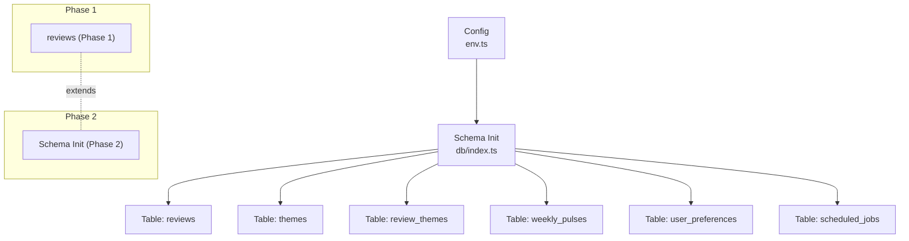
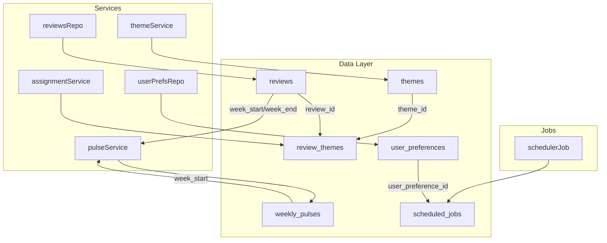
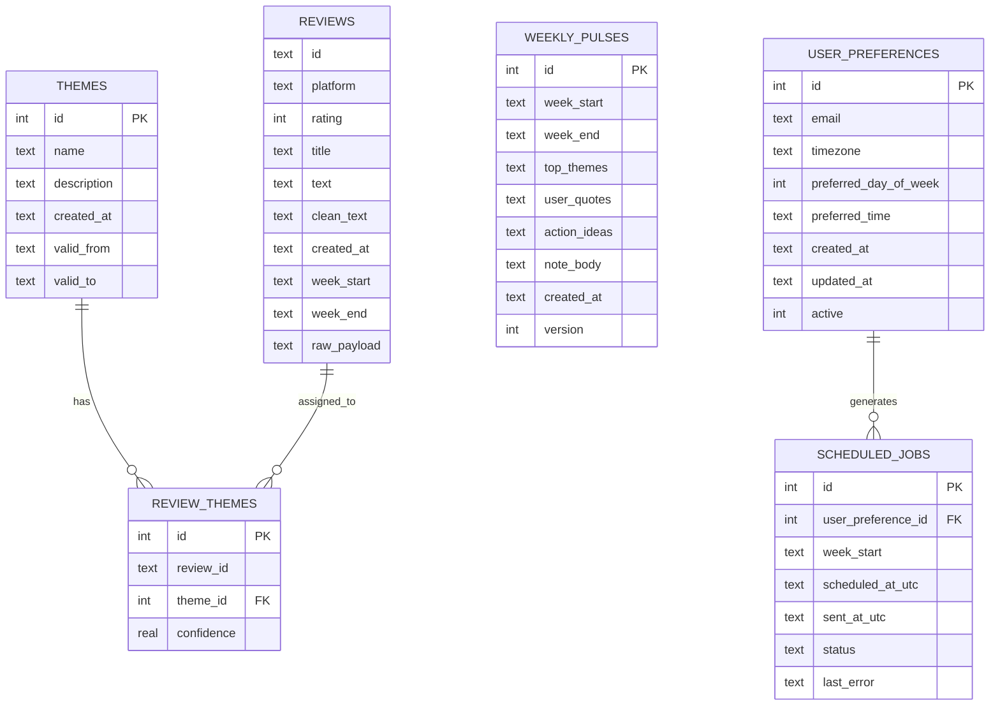
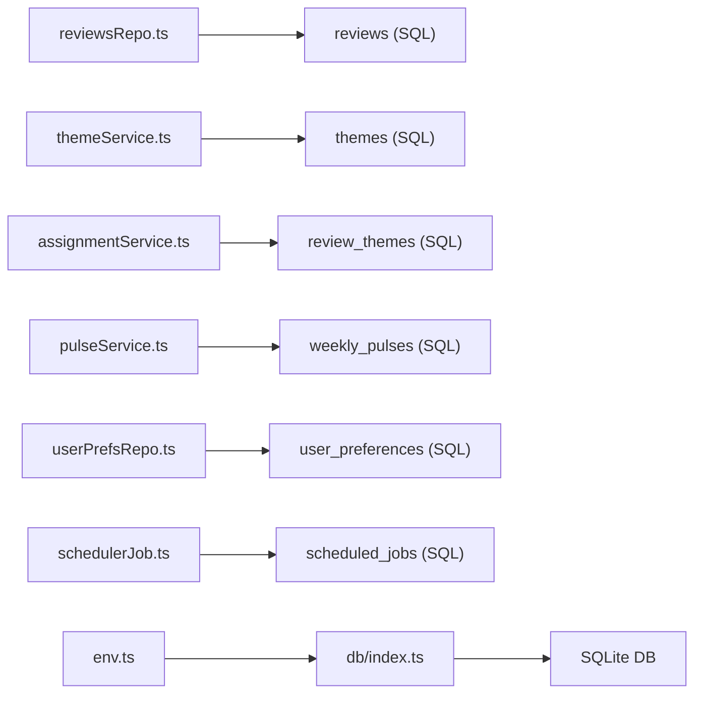

# Data Models & Schema

<cite>
**Referenced Files in This Document**
- [index.ts](file://phase-2/src/db/index.ts)
- [env.ts](file://phase-2/src/config/env.ts)
- [review.ts](file://phase-2/src/domain/review.ts)
- [reviewsRepo.ts](file://phase-2/src/services/reviewsRepo.ts)
- [themeService.ts](file://phase-2/src/services/themeService.ts)
- [assignmentService.ts](file://phase-2/src/services/assignmentService.ts)
- [pulseService.ts](file://phase-2/src/services/pulseService.ts)
- [userPrefsRepo.ts](file://phase-2/src/services/userPrefsRepo.ts)
- [schedulerJob.ts](file://phase-2/src/jobs/schedulerJob.ts)
- [review.model.ts](file://phase-1/src/domain/review.model.ts)
- [reviewService.ts](file://phase-1/src/services/reviewService.ts)
- [assignment.test.ts](file://phase-2/src/tests/assignment.test.ts)
</cite>

## Table of Contents
1. [Introduction](#introduction)
2. [Project Structure](#project-structure)
3. [Core Components](#core-components)
4. [Architecture Overview](#architecture-overview)
5. [Detailed Component Analysis](#detailed-component-analysis)
6. [Dependency Analysis](#dependency-analysis)
7. [Performance Considerations](#performance-considerations)
8. [Troubleshooting Guide](#troubleshooting-guide)
9. [Conclusion](#conclusion)
10. [Appendices](#appendices)

## Introduction
This document describes the database schema and data models for the Groww App Review Insights Analyzer. It focuses on the entities and relationships among reviews, themes, review_themes, weekly_pulses, user_preferences, and scheduled_jobs. It also documents field definitions, data types, primary and foreign keys, indexes, constraints, validation rules, referential integrity, data access patterns, caching strategies, performance considerations, data lifecycle, retention, archival, migration/versioning, and security/privacy controls.

## Project Structure
The schema is initialized in Phase 2 and extends the Phase 1 SQLite database by default. The schema initialization script defines tables, indexes, and constraints. Configuration loads the database file path and external service credentials.

**Diagram sources**
- [env.ts:1-23](file://phase-2/src/config/env.ts#L1-L23)
- [index.ts:7-91](file://phase-2/src/db/index.ts#L7-L91)

**Section sources**
- [env.ts:1-23](file://phase-2/src/config/env.ts#L1-L23)
- [index.ts:7-91](file://phase-2/src/db/index.ts#L7-L91)

## Core Components
This section documents each table’s schema, constraints, and indexes.

- reviews
  - Purpose: Stores raw and cleaned Android app store reviews.
  - Fields:
    - id: Text (Primary Key in code usage; not declared PK here)
    - platform: Text (Constant value in domain)
    - rating: Integer
    - title: Text
    - text: Text
    - clean_text: Text
    - created_at: Text (ISO string)
    - week_start: Text (YYYY-MM-DD)
    - week_end: Text (YYYY-MM-DD)
    - raw_payload: Text (JSON in Phase 1)
  - Notes:
    - Domain model in Phase 1 uses camelCase fields; Phase 2 uses snake_case for SQL mapping.
    - Access pattern: List recent and weekly reviews via repositories.

- themes
  - Purpose: Defines product themes extracted from reviews.
  - Fields:
    - id: Integer (Primary Key)
    - name: Text (Not Null)
    - description: Text (Not Null)
    - created_at: Text (Not Null)
    - valid_from: Text (Window boundary)
    - valid_to: Text (Window boundary)
  - Constraints:
    - Unique composite index on (name, valid_from, valid_to).

- review_themes
  - Purpose: Junction table linking reviews to themes with confidence scores.
  - Fields:
    - id: Integer (Primary Key)
    - review_id: Text (Not Null)
    - theme_id: Integer (Not Null)
    - confidence: Real
  - Constraints:
    - Unique constraint on (review_id, theme_id)
    - Foreign key: theme_id references themes(id)

- weekly_pulses
  - Purpose: Stores generated weekly insights (top themes, quotes, action ideas, note body).
  - Fields:
    - id: Integer (Primary Key)
    - week_start: Text (Not Null)
    - week_end: Text (Not Null)
    - top_themes: Text (JSON array of theme summaries)
    - user_quotes: Text (JSON array of quotes)
    - action_ideas: Text (JSON array of ideas)
    - note_body: Text (Generated note)
    - created_at: Text (Not Null)
    - version: Integer (Default 1)
  - Constraints:
    - Unique composite index on (week_start, version)

- user_preferences
  - Purpose: Stores recipient preferences for weekly pulse delivery.
  - Fields:
    - id: Integer (Primary Key)
    - email: Text (Not Null)
    - timezone: Text (Not Null)
    - preferred_day_of_week: Integer (Not Null; 0=Sunday .. 6=Saturday)
    - preferred_time: Text (Not Null; "HH:MM" 24h)
    - created_at: Text (Not Null)
    - updated_at: Text (Not Null)
    - active: Integer (Not Null; 1 or 0)
  - Business Rule:
    - Only one active row per user; upsert deactivates previous active rows.

- scheduled_jobs
  - Purpose: Tracks scheduled and sent weekly pulse deliveries.
  - Fields:
    - id: Integer (Primary Key)
    - user_preference_id: Integer (Not Null)
    - week_start: Text (Not Null)
    - scheduled_at_utc: Text (Not Null)
    - sent_at_utc: Text
    - status: Text (Not Null; e.g., pending, sent, failed)
    - last_error: Text
  - Constraints:
    - Foreign key: user_preference_id references user_preferences(id)
    - Index on (status, scheduled_at_utc)

Validation and Referential Integrity
- SQLite enforces:
  - NOT NULL constraints on declared fields
  - UNIQUE constraints on (name, valid_from, valid_to) and (review_id, theme_id)
  - FOREIGN KEY constraints on review_themes.theme_id and scheduled_jobs.user_preference_id
- Additional business rules enforced by application logic:
  - Active preference upsert semantics
  - Next send time calculation based on preferred day/time
  - Weekly pulse versioning and uniqueness by week_start

Indexes and Access Patterns
- themes: idx_themes_name_window
- review_themes: idx_review_themes_review_id
- weekly_pulses: idx_weekly_pulses_week_version
- scheduled_jobs: idx_scheduled_jobs_status_time

**Section sources**
- [index.ts:8-91](file://phase-2/src/db/index.ts#L8-L91)
- [reviewsRepo.ts:4-24](file://phase-2/src/services/reviewsRepo.ts#L4-L24)
- [userPrefsRepo.ts:21-56](file://phase-2/src/services/userPrefsRepo.ts#L21-L56)
- [assignmentService.ts:79-96](file://phase-2/src/services/assignmentService.ts#L79-L96)
- [pulseService.ts:218-241](file://phase-2/src/services/pulseService.ts#L218-L241)
- [schedulerJob.ts:20-40](file://phase-2/src/jobs/schedulerJob.ts#L20-L40)

## Architecture Overview
The system orchestrates scraping and cleaning (Phase 1), theme generation and assignment (Phase 2), weekly pulse generation (Phase 2), and scheduled delivery (Phase 2). The schema supports these flows with normalized entities and junction tables.

**Diagram sources**
- [index.ts:8-91](file://phase-2/src/db/index.ts#L8-L91)
- [reviewsRepo.ts:4-24](file://phase-2/src/services/reviewsRepo.ts#L4-L24)
- [themeService.ts:39-66](file://phase-2/src/services/themeService.ts#L39-L66)
- [assignmentService.ts:79-96](file://phase-2/src/services/assignmentService.ts#L79-L96)
- [pulseService.ts:179-241](file://phase-2/src/services/pulseService.ts#L179-L241)
- [userPrefsRepo.ts:45-56](file://phase-2/src/services/userPrefsRepo.ts#L45-L56)
- [schedulerJob.ts:52-84](file://phase-2/src/jobs/schedulerJob.ts#L52-L84)

## Detailed Component Analysis

### Entity Relationship Model

**Diagram sources**
- [index.ts:8-91](file://phase-2/src/db/index.ts#L8-L91)

**Section sources**
- [index.ts:8-91](file://phase-2/src/db/index.ts#L8-L91)

### Data Validation and Business Rules
- Theme creation:
  - Name length: min 2, max 60
  - Description length: min 5, max 200
  - Window validity: valid_from and valid_to are optional but form a unique window key
- Weekly Pulse:
  - Version increments per week; uniqueness enforced by composite index
  - JSON fields validated via parsing in service layer
- User Preferences:
  - Active preference upsert ensures single active row
  - Preferred day: 0–6; Preferred time: "HH:MM" 24h
- Assignment:
  - Batched LLM calls; persistence uses conflict resolution to update confidence

**Section sources**
- [themeService.ts:6-13](file://phase-2/src/services/themeService.ts#L6-L13)
- [pulseService.ts:218-241](file://phase-2/src/services/pulseService.ts#L218-L241)
- [userPrefsRepo.ts:21-43](file://phase-2/src/services/userPrefsRepo.ts#L21-L43)
- [assignmentService.ts:79-96](file://phase-2/src/services/assignmentService.ts#L79-L96)

### Sample Data Examples
- themes
  - Example row: id=1, name="Performance", description="App speed issues", created_at="2026-01-01T00:00:00Z", valid_from=null, valid_to=null
- review_themes
  - Example rows: (review_id="r1", theme_id=1, confidence=0.9), (review_id="r2", theme_id=1, confidence=0.8)
- weekly_pulses
  - Example row: week_start="2026-03-09", week_end="2026-03-15", version=1, created_at="2026-03-16T00:00:00Z"
- user_preferences
  - Example row: email="user@example.com", timezone="Asia/Kolkata", preferred_day_of_week=1, preferred_time="10:00", active=1
- scheduled_jobs
  - Example row: user_preference_id=1, week_start="2026-03-09", status="sent", sent_at_utc="2026-03-10T09:00:00Z"

[No sources needed since this section provides illustrative examples]

### Data Access Patterns
- Reviews:
  - List recent: filter by created_at >= N days ago
  - List weekly: filter by week_start
- Themes:
  - Upsert themes with window boundaries
  - List latest themes for assignment
- Assignments:
  - Batch LLM prompts; bulk insert/update review_themes
- Weekly Pulses:
  - Aggregate theme stats via join; construct JSON payloads; insert with version
- User Preferences:
  - Upsert active preference; compute next send time; list due recipients
- Scheduler:
  - Find due preferences; generate pulse; send email; record job status

**Section sources**
- [reviewsRepo.ts:4-24](file://phase-2/src/services/reviewsRepo.ts#L4-L24)
- [themeService.ts:39-66](file://phase-2/src/services/themeService.ts#L39-L66)
- [assignmentService.ts:79-96](file://phase-2/src/services/assignmentService.ts#L79-L96)
- [pulseService.ts:59-74](file://phase-2/src/services/pulseService.ts#L59-L74)
- [userPrefsRepo.ts:45-94](file://phase-2/src/services/userPrefsRepo.ts#L45-L94)
- [schedulerJob.ts:52-84](file://phase-2/src/jobs/schedulerJob.ts#L52-L84)

### Caching Strategies
- In-memory:
  - Latest themes cache: listLatestThemes returns cached in-memory rows (no explicit cache invalidation)
- Database-level:
  - Indexes on frequently filtered columns (e.g., idx_review_themes_review_id, idx_weekly_pulses_week_version)
- Application-level:
  - No explicit Redis/Memcached caches; consider adding a lightweight LRU cache for listLatestThemes if needed

**Section sources**
- [themeService.ts:58-66](file://phase-2/src/services/themeService.ts#L58-L66)
- [index.ts:36-38](file://phase-2/src/db/index.ts#L36-L38)
- [index.ts:55-57](file://phase-2/src/db/index.ts#L55-L57)

### Performance Considerations
- Indexes:
  - Ensure queries on week_start, review_id, and (week_start, version) leverage indexes
- Transactions:
  - Bulk inserts use transactions to reduce overhead
- Queries:
  - Aggregation joins should remain scoped to weekly windows
- I/O:
  - SQLite file path configured via environment; ensure local disk performance and adequate free space

**Section sources**
- [assignmentService.ts:86-96](file://phase-2/src/services/assignmentService.ts#L86-L96)
- [pulseService.ts:59-74](file://phase-2/src/services/pulseService.ts#L59-L74)
- [index.ts:36-38](file://phase-2/src/db/index.ts#L36-L38)
- [index.ts:55-57](file://phase-2/src/db/index.ts#L55-L57)
- [env.ts:9-10](file://phase-2/src/config/env.ts#L9-L10)

### Data Lifecycle, Retention, and Archival
- Lifecycle stages:
  - Ingestion: Reviews stored with timestamps and weekly buckets
  - Processing: Themes generated; assignments persisted; weekly pulses produced
  - Delivery: Scheduled jobs track status and outcomes
- Retention:
  - No explicit retention policy in code; consider pruning old weekly_pulses and scheduled_jobs after N months
- Archival:
  - Not implemented; could export weekly_pulses periodically to cold storage

[No sources needed since this section provides general guidance]

### Migration Paths, Version Management, and Schema Evolution
- Current state:
  - Schema is initialized in Phase 2; Phase 1 database extended by default
- Recommendations:
  - Use SQLite pragmas and migrations for future schema changes
  - Maintain a version table or comment-based migration markers
  - Backfill defaults for new columns; preserve backward compatibility during transitions

**Section sources**
- [env.ts:8-10](file://phase-2/src/config/env.ts#L8-L10)
- [index.ts:7-91](file://phase-2/src/db/index.ts#L7-L91)

### Security, Privacy, and Access Control
- Privacy:
  - PII scrubbing applied to generated note bodies
  - LLM prompts explicitly instruct to avoid PII
- Access control:
  - No database-level ACLs; rely on filesystem permissions and secure environment variables
- Transport/security:
  - SMTP credentials loaded from environment; ensure encrypted transport and secret management

**Section sources**
- [pulseService.ts:171](file://phase-2/src/services/pulseService.ts#L171)
- [env.ts:16-21](file://phase-2/src/config/env.ts#L16-L21)

## Dependency Analysis

**Diagram sources**
- [reviewsRepo.ts:1-2](file://phase-2/src/services/reviewsRepo.ts#L1-L2)
- [themeService.ts:1-2](file://phase-2/src/services/themeService.ts#L1-L2)
- [assignmentService.ts:1-2](file://phase-2/src/services/assignmentService.ts#L1-L2)
- [pulseService.ts:1-2](file://phase-2/src/services/pulseService.ts#L1-L2)
- [userPrefsRepo.ts:1](file://phase-2/src/services/userPrefsRepo.ts#L1)
- [schedulerJob.ts:1](file://phase-2/src/jobs/schedulerJob.ts#L1)
- [env.ts:1-2](file://phase-2/src/config/env.ts#L1-L2)
- [index.ts:1-5](file://phase-2/src/db/index.ts#L1-L5)

**Section sources**
- [reviewsRepo.ts:1-2](file://phase-2/src/services/reviewsRepo.ts#L1-L2)
- [themeService.ts:1-2](file://phase-2/src/services/themeService.ts#L1-L2)
- [assignmentService.ts:1-2](file://phase-2/src/services/assignmentService.ts#L1-L2)
- [pulseService.ts:1-2](file://phase-2/src/services/pulseService.ts#L1-L2)
- [userPrefsRepo.ts:1](file://phase-2/src/services/userPrefsRepo.ts#L1)
- [schedulerJob.ts:1](file://phase-2/src/jobs/schedulerJob.ts#L1)
- [env.ts:1-2](file://phase-2/src/config/env.ts#L1-L2)
- [index.ts:1-5](file://phase-2/src/db/index.ts#L1-L5)

## Performance Considerations
- Query patterns:
  - Prefer indexed columns (week_start, review_id, (week_start, version), (status, scheduled_at_utc))
- Write patterns:
  - Use transactions for bulk inserts (review_themes)
- Read patterns:
  - Limit recent review scans; cache latest themes
- Storage:
  - Monitor SQLite file growth; consider VACUUM/ANALYZE periodically

[No sources needed since this section provides general guidance]

## Troubleshooting Guide
- Missing themes:
  - Error thrown if no themes exist before generating pulse
- Missing reviews for week:
  - Error thrown if no reviews found for a week_start
- Scheduler failures:
  - Job status set to failed with last_error recorded
- Data inconsistencies:
  - Verify unique indexes and foreign keys; check transaction boundaries for bulk writes

**Section sources**
- [pulseService.ts:181-188](file://phase-2/src/services/pulseService.ts#L181-L188)
- [schedulerJob.ts:75-80](file://phase-2/src/jobs/schedulerJob.ts#L75-L80)
- [assignmentService.ts:86-96](file://phase-2/src/services/assignmentService.ts#L86-L96)

## Conclusion
The schema supports a robust pipeline from review ingestion to weekly insights and scheduled delivery. It leverages SQLite’s constraints and indexes to maintain integrity and performance. Future enhancements should focus on formal migration management, retention/archival policies, and optional caching layers.

[No sources needed since this section summarizes without analyzing specific files]

## Appendices

### Appendix A: Field Definitions and Types
- reviews: id (text), platform (text), rating (integer), title (text), text (text), clean_text (text), created_at (text), week_start (text), week_end (text), raw_payload (text)
- themes: id (integer), name (text), description (text), created_at (text), valid_from (text), valid_to (text)
- review_themes: id (integer), review_id (text), theme_id (integer), confidence (real)
- weekly_pulses: id (integer), week_start (text), week_end (text), top_themes (text), user_quotes (text), action_ideas (text), note_body (text), created_at (text), version (integer)
- user_preferences: id (integer), email (text), timezone (text), preferred_day_of_week (integer), preferred_time (text), created_at (text), updated_at (text), active (integer)
- scheduled_jobs: id (integer), user_preference_id (integer), week_start (text), scheduled_at_utc (text), sent_at_utc (text), status (text), last_error (text)

**Section sources**
- [index.ts:8-91](file://phase-2/src/db/index.ts#L8-L91)

### Appendix B: Domain Model Mapping
- Phase 1 Review interface uses camelCase; Phase 2 SQL uses snake_case mapping for fields like cleanText -> clean_text.

**Section sources**
- [review.model.ts:1-12](file://phase-1/src/domain/review.model.ts#L1-L12)
- [review.ts:1-10](file://phase-2/src/domain/review.ts#L1-L10)

### Appendix C: Test Schema References
- Tests define minimal schema for unit testing including themes, reviews, and review_themes.

**Section sources**
- [assignment.test.ts:15-37](file://phase-2/src/tests/assignment.test.ts#L15-L37)