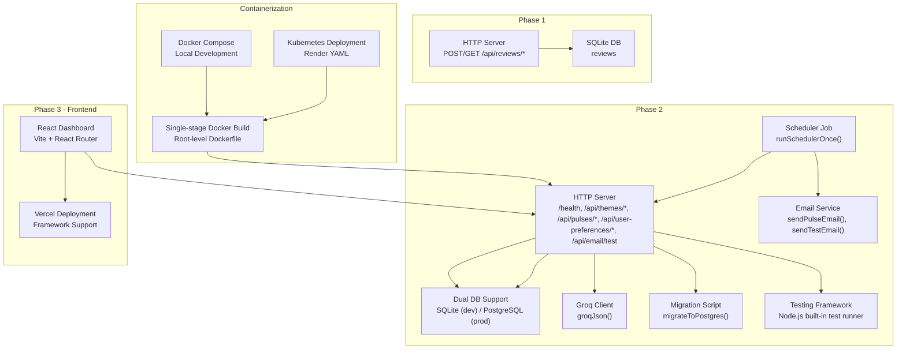
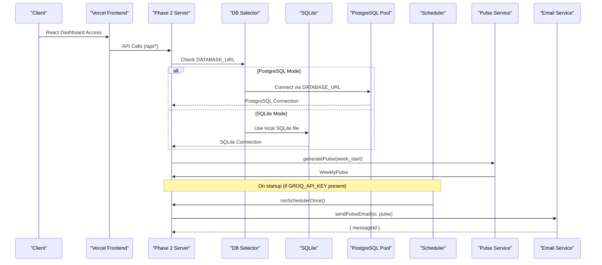
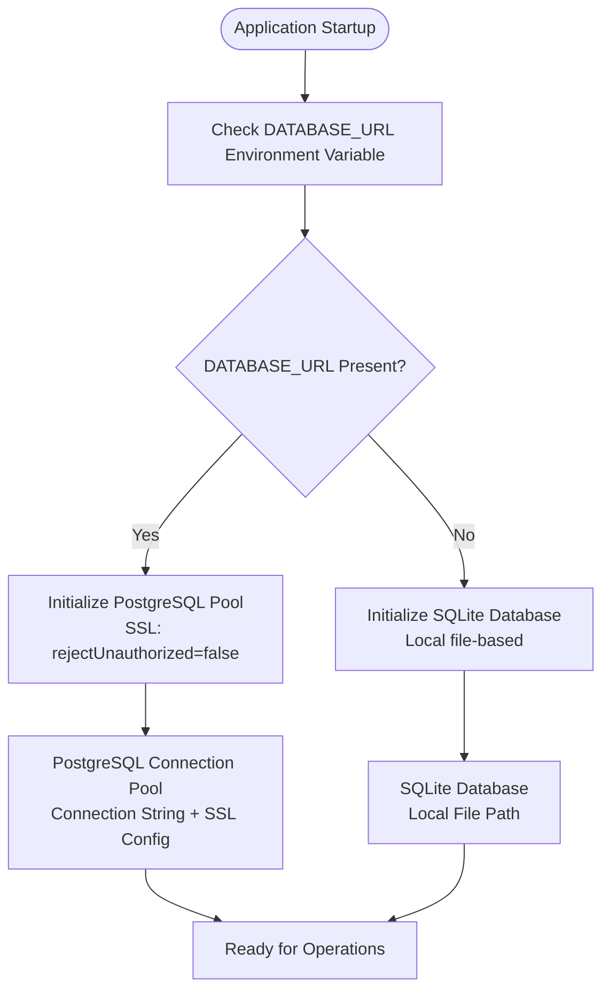
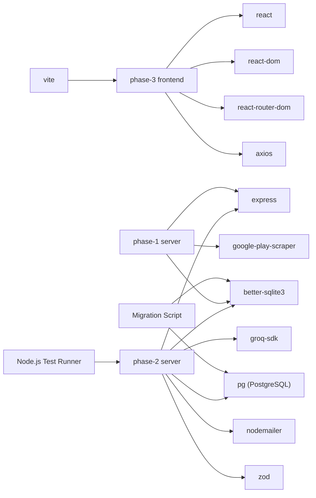

# Deployment & Operations

<cite>
**Referenced Files in This Document**
- [phase-1 env](file://phase-1/src/config/env.ts)
- [phase-2 env](file://phase-2/src/config/env.ts)
- [phase-1 server](file://phase-1/src/api/server.ts)
- [phase-2 server](file://phase-2/src/api/server.ts)
- [phase-1 logger](file://phase-1/src/core/logger.ts)
- [phase-2 logger](file://phase-2/src/core/logger.ts)
- [phase-1 db](file://phase-1/src/db/index.ts)
- [phase-2 db](file://phase-2/src/db/index.ts)
- [phase-2 postgres](file://phase-2/src/db/postgres.ts)
- [phase-2 scheduler](file://phase-2/src/jobs/schedulerJob.ts)
- [phase-2 email service](file://phase-2/src/services/emailService.ts)
- [phase-2 pulse service](file://phase-2/src/services/pulseService.ts)
- [phase-2 theme service](file://phase-2/src/services/themeService.ts)
- [phase-2 user prefs repo](file://phase-2/src/services/userPrefsRepo.ts)
- [phase-2 groq client](file://phase-2/src/services/groqClient.ts)
- [phase-2 migrate script](file://phase-2/scripts/migrateToPostgres.ts)
- [Dockerfile](file://Dockerfile)
- [docker-compose.yml](file://phase-2/docker-compose.yml)
- [render.yaml](file://phase-2/render.yaml)
- [.dockerignore](file://.dockerignore)
- [phase-2 .dockerignore](file://phase-2/.dockerignore)
- [phase-2 package.json](file://phase-2/package.json)
- [phase-2 assignment.test.ts](file://phase-2/src/tests/assignment.test.ts)
- [phase-2 email.test.ts](file://phase-2/src/tests/email.test.ts)
- [phase-2 pulse.test.ts](file://phase-2/src/tests/pulse.test.ts)
- [phase-2 scheduler.test.ts](file://phase-2/src/tests/scheduler.test.ts)
- [phase-2 schema.test.ts](file://phase-2/src/tests/schema.test.ts)
- [phase-2 userPrefs.test.ts](file://phase-2/src/tests/userPrefs.test.ts)
- [root package.json](file://package.json)
- [vercel.json](file://phase-3/vercel.json)
- [vite.config.ts](file://phase-3/vite.config.ts)
- [phase-3 package.json](file://phase-3/package.json)
- [index.html](file://phase-3/index.html)
- [App.tsx](file://phase-3/src/App.tsx)
- [main.tsx](file://phase-3/src/main.tsx)
</cite>

## Update Summary
**Changes Made**
- Added comprehensive PostgreSQL migration script (phase-2/scripts/migrateToPostgres.ts) with 110-line data migration solution from SQLite to PostgreSQL
- Enhanced CORS configuration in API server for Vercel deployment with dynamic allowed origins
- Improved JSON parsing reliability with state machine algorithm in Groq client
- Updated PostgreSQL deployment support with dedicated connection pool and SSL configuration
- Enhanced database connection handling with SSL configuration for Render compatibility

## Table of Contents
1. [Introduction](#introduction)
2. [Project Structure](#project-structure)
3. [Core Components](#core-components)
4. [Architecture Overview](#architecture-overview)
5. [Detailed Component Analysis](#detailed-component-analysis)
6. [Dependency Analysis](#dependency-analysis)
7. [Performance Considerations](#performance-considerations)
8. [Monitoring & Logging](#monitoring--logging)
9. [Environment Setup](#environment-setup)
10. [Containerization & Orchestration](#containerization--orchestration)
11. [Frontend Deployment with Vercel](#frontend-deployment-with-vercel)
12. [Scaling & High Availability](#scaling--high-availability)
13. [Security & Compliance](#security--compliance)
14. [Backup & Recovery](#backup--recovery)
15. [Disaster Recovery Planning](#disaster-recovery-planning)
16. [Maintenance & Scheduling](#maintenance--scheduling)
17. [Testing Framework](#testing-framework)
18. [Troubleshooting Guide](#troubleshooting-guide)
19. [Runbooks](#runbooks)
20. [Conclusion](#conclusion)

## Introduction
This document provides comprehensive deployment and operations guidance for the Groww App Review Insights Analyzer. It covers environment setup across development, staging, and production, containerization and orchestration strategies, frontend deployment with Vercel, monitoring and logging, backup and recovery, scaling and high availability, security and compliance, testing frameworks, and operational runbooks for troubleshooting and maintenance.

## Project Structure
The repository is split into three phases with integrated frontend deployment:
- Phase 1: Core scraping, filtering, and SQLite storage with a small HTTP API.
- Phase 2: Enhanced with theming, weekly pulse generation, scheduled email delivery, and persistence of user preferences and scheduled jobs.
- Phase 3: Complete React frontend dashboard with client-side routing and Vercel deployment configuration.

Key runtime components:
- HTTP servers for each phase
- Dual database support (SQLite for development, PostgreSQL for production)
- Scheduler for automated pulse generation and email delivery
- Email transport via SMTP
- Structured logging
- Comprehensive testing framework using Node.js built-in test runner
- React-based frontend with Vercel deployment support



**Diagram sources**
- [phase-1 server:1-50](file://phase-1/src/api/server.ts#L1-L50)
- [phase-2 server:1-266](file://phase-2/src/api/server.ts#L1-L266)
- [phase-1 db:1-31](file://phase-1/src/db/index.ts#L1-L31)
- [phase-2 db:1-133](file://phase-2/src/db/index.ts#L1-L133)
- [phase-2 postgres:1-143](file://phase-2/src/db/postgres.ts#L1-L143)
- [phase-2 scheduler:1-98](file://phase-2/src/jobs/schedulerJob.ts#L1-L98)
- [phase-2 email service:1-142](file://phase-2/src/services/emailService.ts#L1-L142)
- [phase-2 pulse service:1-265](file://phase-2/src/services/pulseService.ts#L1-L265)
- [phase-2 migrate script:1-111](file://phase-2/scripts/migrateToPostgres.ts#L1-L111)
- [phase-3 App.tsx:1-57](file://phase-3/src/App.tsx#L1-L57)
- [phase-3 vite.config.ts:1-20](file://phase-3/vite.config.ts#L1-L20)
- [Dockerfile:1-42](file://Dockerfile#L1-L42)
- [docker-compose.yml:1-34](file://phase-2/docker-compose.yml#L1-L34)
- [render.yaml:1-33](file://phase-2/render.yaml#L1-L33)

**Section sources**
- [phase-1 server:1-50](file://phase-1/src/api/server.ts#L1-L50)
- [phase-2 server:1-266](file://phase-2/src/api/server.ts#L1-L266)
- [phase-1 db:1-31](file://phase-1/src/db/index.ts#L1-L31)
- [phase-2 db:1-133](file://phase-2/src/db/index.ts#L1-L133)
- [phase-3 App.tsx:1-57](file://phase-3/src/App.tsx#L1-L57)

## Core Components
- HTTP Servers
  - Phase 1 exposes scraping and listing endpoints.
  - Phase 2 exposes health, theming, pulse, user preferences, and email test endpoints, plus starts a scheduler when configured.
- Dual Database Support
  - Phase 1: SQLite reviews table with week indexing.
  - Phase 2: Automatic database selection between SQLite (development) and PostgreSQL (production) with comprehensive schema support.
- Scheduler
  - Periodic job runner that computes due recipients, generates pulses, sends emails, and records outcomes.
- Email Delivery
  - SMTP-based transport with HTML/text bodies and PII scrubbing.
- LLM Integration
  - Groq client with enhanced JSON extraction using state machine algorithm for structured outputs.
- Logging
  - Console-based logging with INFO/ERROR helpers.
- Testing Framework
  - Comprehensive test suite using Node.js built-in test runner with isolated test files for different components.
- Frontend Dashboard
  - React-based dashboard with client-side routing, integrated with backend APIs via proxy configuration.
- **New** Data Migration Tool
  - PostgreSQL migration script for seamless SQLite to PostgreSQL data transfer.

**Section sources**
- [phase-1 server:1-50](file://phase-1/src/api/server.ts#L1-L50)
- [phase-2 server:1-266](file://phase-2/src/api/server.ts#L1-L266)
- [phase-1 db:1-31](file://phase-1/src/db/index.ts#L1-L31)
- [phase-2 db:1-133](file://phase-2/src/db/index.ts#L1-L133)
- [phase-2 postgres:1-143](file://phase-2/src/db/postgres.ts#L1-L143)
- [phase-2 scheduler:1-98](file://phase-2/src/jobs/schedulerJob.ts#L1-L98)
- [phase-2 email service:1-142](file://phase-2/src/services/emailService.ts#L1-L142)
- [phase-2 pulse service:1-265](file://phase-2/src/services/pulseService.ts#L1-L265)
- [phase-2 theme service:1-68](file://phase-2/src/services/themeService.ts#L1-L68)
- [phase-2 logger:1-21](file://phase-2/src/core/logger.ts#L1-L21)
- [phase-2 groq client:1-142](file://phase-2/src/services/groqClient.ts#L1-L142)
- [phase-2 migrate script:1-111](file://phase-2/scripts/migrateToPostgres.ts#L1-L111)
- [phase-3 App.tsx:1-57](file://phase-3/src/App.tsx#L1-L57)

## Architecture Overview
The system comprises two primary runtime phases with containerized deployment capabilities and a modern frontend deployment strategy, now featuring enhanced PostgreSQL support for production environments and improved data migration capabilities:
- Phase 1: Standalone API for scraping and storing reviews into SQLite.
- Phase 2: Full-featured API with theming, pulse generation, scheduled emails, and persistence, supporting both SQLite (development) and PostgreSQL (production) databases.
- Phase 3: React frontend with Vercel deployment and client-side routing.



**Diagram sources**
- [phase-2 server:18-23](file://phase-2/src/api/server.ts#L18-L23)
- [phase-2 db:6-19](file://phase-2/src/db/index.ts#L6-L19)
- [phase-2 postgres:6-25](file://phase-2/src/db/postgres.ts#L6-L25)
- [phase-2 scheduler:52-84](file://phase-2/src/jobs/schedulerJob.ts#L52-L84)
- [phase-2 pulse service:179-241](file://phase-2/src/services/pulseService.ts#L179-L241)
- [phase-2 email service:114-129](file://phase-2/src/services/emailService.ts#L114-L129)
- [phase-2 db:1-133](file://phase-2/src/db/index.ts#L1-L133)

## Detailed Component Analysis

### HTTP API Surface
- Phase 1
  - POST /api/reviews/scrape: triggers scraping and storage.
  - GET /api/reviews/scrape: browser-friendly trigger.
  - GET /api/reviews: lists stored reviews.
- Phase 2
  - GET /health: health check.
  - POST /api/themes/generate: generate and persist themes.
  - GET /api/themes: list latest themes.
  - POST /api/themes/assign: assign reviews to themes for a week.
  - POST /api/pulses/generate: generate weekly pulse for a week.
  - GET /api/pulses: list recent pulses.
  - GET /api/pulses/:id: fetch a pulse.
  - POST /api/pulses/:id/send-email: send a pulse via email.
  - POST /api/user-preferences: set user preferences.
  - GET /api/user-preferences: get active preferences.
  - POST /api/email/test: test SMTP configuration.

**Updated** Enhanced CORS configuration with dynamic allowed origins for improved security and flexibility.

Operational notes:
- Validation and error handling are performed at the route level.
- Logging is used for request lifecycle and errors.
- CORS configuration now supports dynamic origins via FRONTEND_URL environment variable.

**Section sources**
- [phase-1 server:9-43](file://phase-1/src/api/server.ts#L9-L43)
- [phase-2 server:28-232](file://phase-2/src/api/server.ts#L28-L232)
- [phase-2 server:22-35](file://phase-2/src/api/server.ts#L22-L35)

### Enhanced CORS Configuration
**New** The API server now features an improved CORS configuration that provides enhanced security and flexibility for Vercel deployment:

**Dynamic Origin Management**
- Static origins: Multiple Vercel preview domains for the Groww App Review Insights Analyzer
- Dynamic origin: FRONTEND_URL environment variable for custom domain support
- Production mode: Strict origin validation with allowed origins whitelist
- Development mode: Permissive CORS for local development and testing

**Implementation Details**
- Origin validation function with comprehensive error handling
- Credentials support for authenticated requests
- Graceful handling of requests with no origin (mobile apps, curl, etc.)
- Environment-aware configuration for different deployment scenarios

**Section sources**
- [phase-2 server:27-48](file://phase-2/src/api/server.ts#L27-L48)

### Dual Database Support
- Phase 1
  - reviews: id, platform, rating, title, text, clean_text, created_at, week_start, week_end, has_unicode.
  - Index: idx_reviews_week_start.
- Phase 2
  - Automatic database selection based on DATABASE_URL environment variable.
  - SQLite mode: local file-based database for development.
  - PostgreSQL mode: connection pool with SSL configuration for Render compatibility.
  - Shared schema across both databases for consistent data model.

**Updated** Enhanced PostgreSQL deployment support with dedicated connection pool and SSL configuration for Render platform compatibility.



**Diagram sources**
- [phase-2 db:6-19](file://phase-2/src/db/index.ts#L6-L19)
- [phase-2 postgres:6-25](file://phase-2/src/db/postgres.ts#L6-L25)

**Section sources**
- [phase-1 db:1-31](file://phase-1/src/db/index.ts#L1-L31)
- [phase-2 db:1-133](file://phase-2/src/db/index.ts#L1-L133)
- [phase-2 postgres:1-143](file://phase-2/src/db/postgres.ts#L1-L143)

### PostgreSQL Connection Handling
- Connection Pool Management
  - Singleton pattern ensures efficient connection reuse.
  - Environment-driven configuration with DATABASE_URL requirement.
  - SSL configuration with rejectUnauthorized: false for Render compatibility.
  - Error handling and logging for connection pool events.
- Schema Initialization
  - Comprehensive table creation for all required entities.
  - Proper indexing strategy for performance optimization.
  - Foreign key constraints and unique constraints for data integrity.
  - Timestamp columns with appropriate data types.

**Section sources**
- [phase-2 postgres:6-25](file://phase-2/src/db/postgres.ts#L6-L25)
- [phase-2 postgres:27-135](file://phase-2/src/db/postgres.ts#L27-L135)

### PostgreSQL Migration Script
**New** A comprehensive 110-line migration script has been added to facilitate seamless data transfer from SQLite to PostgreSQL:

**Migration Capabilities**
- Complete data transfer from SQLite database to PostgreSQL
- Support for all core entities: reviews, themes, review_themes, weekly_pulses, user_preferences, scheduled_jobs
- Conflict resolution using ON CONFLICT (id) DO NOTHING strategy
- Preserves data integrity and maintains referential constraints

**Migration Process**
- Initializes PostgreSQL schema before data transfer
- Connects to SQLite database using better-sqlite3
- Processes each table sequentially with progress logging
- Handles special cases like has_unicode field conversion
- Provides detailed migration statistics and completion status

**Data Preservation Features**
- Maintains unique identifiers across migration
- Preserves temporal relationships and foreign key references
- Handles JSON serialization for complex data structures
- Ensures atomic operations for data consistency

**Section sources**
- [phase-2 migrate script:1-111](file://phase-2/scripts/migrateToPostgres.ts#L1-L111)

### Scheduler and Email Automation
- Scheduler
  - Determines last full week (UTC), identifies due preferences, inserts a scheduled job row, generates the pulse, sends email, and updates job status.
  - Starts on server boot if Groq API key is present.
- Email Service
  - Builds HTML/text bodies, scrubs PII, and sends via SMTP transport.
  - Requires SMTP_HOST, SMTP_USER, SMTP_PASS, SMTP_PORT, SMTP_FROM.


**Diagram sources**
- [phase-2 scheduler:52-84](file://phase-2/src/jobs/schedulerJob.ts#L52-L84)
- [phase-2 pulse service:179-241](file://phase-2/src/services/pulseService.ts#L179-L241)
- [phase-2 email service:114-129](file://phase-2/src/services/emailService.ts#L114-L129)

**Section sources**
- [phase-2 scheduler:1-98](file://phase-2/src/jobs/schedulerJob.ts#L1-L98)
- [phase-2 email service:1-142](file://phase-2/src/services/emailService.ts#L1-L142)
- [phase-2 pulse service:1-265](file://phase-2/src/services/pulseService.ts#L1-L265)

### Theming and Pulse Generation
- Theming
  - Generates 3–5 themes from recent reviews using Groq with schema enforcement.
  - Upserts themes with timestamps and optional validity windows.
- Pulse Generation
  - Aggregates theme stats for the week, selects top themes, picks representative quotes, generates action ideas, and writes a concise note.
  - Stores the pulse with versioning and JSON-serialized fields.

**Section sources**
- [phase-2 theme service:1-68](file://phase-2/src/services/themeService.ts#L1-L68)
- [phase-2 pulse service:1-265](file://phase-2/src/services/pulseService.ts#L1-L265)

### Enhanced JSON Parsing Reliability
**New** The Groq client now features an improved state machine algorithm for more reliable JSON parsing:

**State Machine Algorithm**
- Character-by-character processing with proper quote and escape handling
- Handles nested quotes and escaped characters correctly
- Escapes newlines inside JSON strings while preserving content
- Maintains context awareness for string boundaries

**JSON Extraction Enhancements**
- Removes control characters and non-printable characters
- Strips markdown code fences (```json ... ``` or ```` ... ````)
- Extracts JSON from mixed content using bracket matching
- Provides detailed error context with position information

**Robustness Improvements**
- Handles malformed JSON gracefully with fallback strategies
- Provides debug information for parsing failures
- Implements retry mechanism with increasing temperature
- Maintains backward compatibility with existing JSON structures

**Section sources**
- [phase-2 groq client:14-91](file://phase-2/src/services/groqClient.ts#L14-L91)
- [phase-2 groq client:93-142](file://phase-2/src/services/groqClient.ts#L93-L142)

### Configuration and Environment
- Phase 1
  - DATABASE_FILE, PORT.
- Phase 2
  - DATABASE_FILE, PORT, GROQ_API_KEY, GROQ_MODEL, SMTP_HOST, SMTP_PORT, SMTP_USER, SMTP_PASS, SMTP_FROM.
  - **Updated**: DATABASE_URL for PostgreSQL connection (optional, enables production mode).
- Phase 3 (Frontend)
  - Vite configuration with React Router and proxy setup for API communication.
  - **Updated**: Node.js 20.x engine specification for consistent runtime environment.

**Section sources**
- [phase-1 env:1-6](file://phase-1/src/config/env.ts#L1-L6)
- [phase-2 env:1-23](file://phase-2/src/config/env.ts#L1-L23)
- [phase-2 env:8-11](file://phase-2/src/config/env.ts#L8-L11)
- [phase-3 vite.config.ts:6-14](file://phase-3/vite.config.ts#L6-L14)
- [phase-3 package.json:24-26](file://phase-3/package.json#L24-L26)

## Dependency Analysis
- Runtime dependencies
  - Express for HTTP.
  - better-sqlite3 for local persistence.
  - groq-sdk for LLM integration.
  - nodemailer for SMTP.
  - pg for PostgreSQL connection pooling.
  - zod for schema validation.
  - React ecosystem for frontend (React, React DOM, React Router DOM).
- Build/test/dev dependencies
  - TypeScript, ts-node, @types packages.
  - Node.js built-in test runner for comprehensive testing.
  - Vite for frontend bundling and development server.
  - React development dependencies for frontend build process.

**Updated** Added PostgreSQL driver (pg) for production database support and enhanced JSON parsing capabilities.



**Diagram sources**
- [phase-1 package.json:13-24](file://phase-1/package.json#L13-L24)
- [phase-2 package.json:13-23](file://phase-2/package.json#L13-L23)
- [phase-3 package.json:11-16](file://phase-3/package.json#L11-L16)

**Section sources**
- [phase-1 package.json:1-26](file://phase-1/package.json#L1-L26)
- [phase-2 package.json:1-34](file://phase-2/package.json#L1-L34)
- [phase-3 package.json:1-28](file://phase-3/package.json#L1-L28)

## Performance Considerations
- Database
  - Use indexes on week_start and scheduled_jobs status/time to optimize lookups.
  - PostgreSQL connection pooling reduces connection overhead in production.
  - SQLite provides excellent performance for development workloads.
  - Batch operations for theme upserts reduce transaction overhead.
- I/O Bound Tasks
  - Scraping and LLM calls are external I/O bound; consider timeouts and retries.
- Concurrency
  - Single-threaded Node process; scale horizontally behind a load balancer.
- Caching
  - Consider caching recent themes and pulses if read-heavy.
- Frontend Performance
  - React component memoization and lazy loading for optimal bundle sizes.
  - Vite's development server with hot module replacement for fast iteration.
- **New** Migration Performance
  - PostgreSQL migration script optimized for sequential processing
  - Conflict resolution minimizes write operations during data transfer
  - Progress logging enables monitoring of long-running migrations

## Monitoring & Logging
- Logging
  - Console-based INFO/ERROR logs are used across components.
  - Add structured logging (e.g., Bunyan, Winston) and export to centralized systems.
  - PostgreSQL pool error logging for connection troubleshooting.
- Metrics
  - Expose Prometheus-compatible metrics endpoint or integrate with APM.
  - Track request latency, error rates, job success/failure, and Groq API timings.
- Alerts
  - Alert on failed scheduled jobs, repeated errors, and health check failures.
  - PostgreSQL connection pool errors and database availability issues.
- Centralized Logging
  - Ship logs to a log aggregator (e.g., ELK, Loki) with correlation IDs.

## Environment Setup
- Development
  - Install dependencies for the desired phase.
  - Set environment variables for the target phase.
  - Start the server using dev scripts.
  - For frontend development, use Vite's development server with proxy configuration.
  - **Updated**: Default to SQLite mode (no DATABASE_URL required).
- Staging
  - Use a dedicated database file and SMTP credentials.
  - Enable scheduler only when Groq API key is available.
  - **Updated**: Can run in either SQLite or PostgreSQL mode based on configuration.
- Production
  - Use immutable images, non-root users, minimal base images.
  - Enforce secrets management and network policies.
  - Configure health checks and readiness probes.
  - **Updated**: PostgreSQL mode requires DATABASE_URL environment variable.

## Containerization & Orchestration

### Single-Stage Docker Build (Optimized for Render)
**Updated** The project now implements a streamlined single-stage Docker build optimized specifically for Render deployment, with enhanced database connection support:

**Build Process**
- Base Image: node:20-alpine with Python3, make, and g++ for better-sqlite3 compilation
- Enhanced dependency management: Installs all dependencies including devDependencies for build process
- PostgreSQL support: Includes pg driver for production database connections
- Post-build cleanup: Uses `npm prune --production` to remove devDependencies and reduce image size
- Optimized layer caching with efficient build steps
- Integrated health check for container monitoring
- **Updated**: Now builds from root directory with COPY commands targeting phase-2/ directory

**Production Configuration**
- Environment variables: NODE_ENV=production, PORT=4002, DATABASE_FILE=/app/data/phase1.db
- **Updated**: DATABASE_URL for PostgreSQL mode (optional)
- Health check via HTTP GET to /health endpoint with 30-second intervals
- Data directory creation for SQLite persistence
- Direct execution of compiled TypeScript output from dist/api/server.js

**Root-level Dockerfile Benefits**
- Simplified build context and reduced complexity
- Better integration with Render's deployment pipeline
- Consistent build process across development and production
- Enhanced .dockerignore patterns at root level for comprehensive exclusion

**Section sources**
- [Dockerfile:1-42](file://Dockerfile#L1-L42)

### Docker Compose Configuration
Local development environment with persistent storage and environment variable management:

**Service Configuration**
- Backend service with port mapping 4002:4002
- Persistent volume mounting for SQLite data
- Environment variable injection from .env file
- Health check integration with 30-second intervals
- Enhanced health check configuration with improved timeout settings
- **Updated**: Supports both SQLite and PostgreSQL modes

**Volume Management**
- Named volume "data" mounted to /app/data
- Automatic volume creation and persistence across container restarts

**Section sources**
- [docker-compose.yml:1-34](file://phase-2/docker-compose.yml#L1-L34)

### Kubernetes Deployment (Render Platform)
**Updated** Production-ready deployment configuration for Render's container platform with enhanced repository integration and database support:

**Platform Configuration**
- Web service type with Docker runtime
- Repository integration with GitHub: https://github.com/aravinthraj-ramalingam/Groww-App-Review-Insights-Analyzer-
- **Updated**: DockerfilePath now points to ./phase-2/Dockerfile for proper build context
- **Updated**: DockerContext now points to ./phase-2 for build context
- Multi-service deployment with single container
- Environment variable management with sync control
- Persistent disk mounting for data persistence
- **Updated**: Supports PostgreSQL connection via DATABASE_URL environment variable

**Resource Management**
- Disk allocation: 1GB persistent volume
- Mount path: /app/data for SQLite database
- Automatic restart policy: unless-stopped
- Enhanced health check configuration

**Section sources**
- [render.yaml:1-33](file://phase-2/render.yaml#L1-L33)

### Container Security and Best Practices
- Single-stage build reduces complexity while maintaining security
- Post-build cleanup removes unnecessary devDependencies
- Non-root user execution recommended
- Minimal base image (alpine linux) with optimized security
- Environment variables for configuration
- Health checks for container monitoring
- Persistent volume for data durability
- **Updated**: Enhanced .dockerignore patterns at root level for comprehensive exclusion
- **Updated**: PostgreSQL connection pool with SSL configuration for secure production connections

**Section sources**
- [Dockerfile:18-42](file://Dockerfile#L18-L42)
- [.dockerignore:1-14](file://.dockerignore#L1-L14)
- [phase-2 .dockerignore:1-12](file://phase-2/.dockerignore#L1-L12)

## Frontend Deployment with Vercel

### Vercel Configuration for React Frontend
**Updated** The project now includes comprehensive Vercel deployment configuration for the React frontend in phase-3 with enhanced CORS support and standardized Node.js runtime:

**Vercel Configuration Details**
- Framework Support: Vite framework detection for optimized build process
- Build Command: Uses root package.json script to coordinate multi-phase build
- Output Directory: dist folder containing compiled React application
- Install Command: npm install for frontend dependencies
- Rewrites: Client-side routing support with catch-all rewrite to index.html
- **Updated**: Node.js 20.x runtime standardization across all phases

**Enhanced CORS Configuration**
The backend now supports dynamic CORS origins with improved security:
- Static origins: groww-app-review-insights-analyzer.vercel.app and preview variants
- Dynamic origin: FRONTEND_URL environment variable for custom domains
- Production mode: strict origin validation; Development mode: wildcard '*'

**Rewrite Rules for Client-Side Routing**
The Vercel configuration includes rewrite rules that enable client-side routing for the React application:
- Source pattern: "/(.*)" matches all routes
- Destination: "/index.html" serves the React app for all client-side routes
- Enables deep linking and bookmarkable URLs without server configuration

**Centralized Build Orchestration**
The root package.json coordinates the build process across all phases:
- Build script: `cd phase-3 && npm install && npm run build && cp -r dist ../dist`
- Development script: `cd phase-3 && npm run dev`
- Ensures frontend build completes before overall deployment

**Frontend Application Architecture**
- React 18 with TypeScript
- React Router DOM for client-side navigation
- Vite for fast development and optimized production builds
- Proxy configuration for API communication during development
- Modern CSS and responsive design

**Development Workflow**
- Frontend development server runs on port 3000
- API proxy routes requests from /api to backend server
- Hot module replacement for rapid development iteration
- Source maps enabled for debugging

**Section sources**
- [vercel.json:1-11](file://phase-3/vercel.json#L1-L11)
- [root package.json:5-8](file://package.json#L5-L8)
- [vite.config.ts:1-20](file://phase-3/vite.config.ts#L1-L20)
- [phase-3 package.json:1-28](file://phase-3/package.json#L1-L28)
- [index.html:1-14](file://phase-3/index.html#L1-L14)
- [App.tsx:1-57](file://phase-3/src/App.tsx#L1-L57)
- [main.tsx:1-14](file://phase-3/src/main.tsx#L1-L14)
- [phase-2 server:22-35](file://phase-2/src/api/server.ts#L22-L35)

### Vercel Permission Fixes
**New** Implementation of npx --yes commands for frontend build processes to address Vercel permission issues:

**Build Process Improvements**
- Development script: `"dev": "npx --yes vite"`
- Build script: `"build": "npx --yes vite build"`
- Preview script: `"preview": "npx --yes vite preview"`

These npx --yes commands eliminate interactive prompts during Vercel builds, ensuring smooth CI/CD pipeline execution without manual intervention.

**Section sources**
- [phase-3 package.json:7-9](file://phase-3/package.json#L7-L9)

## Scaling & High Availability
- Stateless API
  - Keep servers stateless; rely on shared database for state.
- Load Balancing
  - Distribute traffic across pods; sticky sessions not required.
- Replication
  - For write-heavy workloads, consider a clustered database or migration to a managed RDBMS.
  - **Updated**: PostgreSQL supports native clustering and replication.
- Queue-Based Delivery
  - Offload email sending to a queue/job system for decoupling and reliability.
- Container Scaling
  - Horizontal pod autoscaling based on CPU/memory or custom metrics
  - Rolling updates with readiness/liveness probes
  - Persistent volume claims for stateful containers
- Frontend Scaling
  - Vercel's global CDN ensures optimal frontend delivery
  - Automatic scaling based on traffic demands
  - Edge caching for improved performance

## Security & Compliance
- Secrets Management
  - Store API keys and SMTP credentials in a secret manager; mount as environment variables.
  - **Updated**: DATABASE_URL for PostgreSQL connections.
- Network Security
  - Restrict inbound/outbound egress; use private networks and VPCs.
- Data Protection
  - Encrypt at rest; enforce access controls on database files.
  - Apply PII scrubbing consistently; avoid logging sensitive data.
- Vulnerability Management
  - Scan container images and dependencies; patch regularly.
- Compliance
  - Align logging retention and data deletion with policy; audit access to secrets.
- Container Security
  - Single-stage builds with post-build cleanup reduce attack surface
  - Non-root user execution recommended
  - Minimal base images with security scanning
  - Environment variable management for secrets
  - **Updated**: Enhanced .dockerignore patterns prevent accidental inclusion of sensitive files
  - **Updated**: PostgreSQL SSL configuration with rejectUnauthorized: false for Render compatibility
- Frontend Security
  - Vercel's security features protect against common web vulnerabilities
  - HTTPS enforcement and security headers
  - Content Security Policy configuration
  - **Updated**: Dynamic CORS configuration prevents unauthorized cross-origin requests

## Backup & Recovery
- Backups
  - Snapshot the SQLite file or PostgreSQL database; automate periodic backups to durable storage.
  - **Updated**: PostgreSQL supports native backup tools and cloud-native solutions.
- Recovery
  - Validate backups; practice restoration drills.
  - Restore to a temporary environment before promoting to production.
- Retention
  - Define retention periods for logs and backups per policy.
- Container Data Persistence
  - Persistent volume snapshots for containerized deployments
  - Volume backup strategies for stateful applications
  - **Updated**: PostgreSQL supports point-in-time recovery and logical backups.
- Frontend Data
  - Static assets cached by Vercel's CDN
  - Versioned builds for reliable rollbacks

## Disaster Recovery Planning
- RTO/RPO Targets
  - Define acceptable downtime and data loss windows.
- Failover
  - Automated failover to secondary region; switch DNS or ingress.
- Testing
  - Regular DR tests; include cross-region restore scenarios.
- Containerized DR
  - Multi-region container deployments
  - Volume replication for persistent data
  - Automated failover mechanisms
  - **Updated**: PostgreSQL clustering and replication for high availability.
- Frontend DR
  - Vercel's global infrastructure provides natural redundancy
  - Edge locations ensure geographic distribution
  - Automatic failover to nearest edge location

## Maintenance & Scheduling
- Routine Tasks
  - Dependency updates, image rebuilds, DB maintenance.
- Rotation
  - Rotate secrets periodically; rotate Groq and SMTP credentials.
  - **Updated**: Rotate PostgreSQL connection credentials.
- Capacity Planning
  - Monitor growth in reviews and pulses; plan storage and compute increases.
  - **Updated**: Monitor PostgreSQL connection pool utilization.
- Container Maintenance
  - Regular container image updates and security patches
  - Volume cleanup and optimization
  - Log rotation and cleanup policies
- Frontend Maintenance
  - Regular dependency updates for React ecosystem
  - Performance monitoring and optimization
  - Security updates for build tools and dependencies

## Testing Framework

### Node.js Built-in Test Runner
The project implements a comprehensive testing framework using Node.js built-in test runner with isolated test files for different components:

**Test Categories**
- Assignment Logic: Review-to-theme assignment with confidence scoring
- Email Generation: HTML and text email body construction with PII handling
- Pulse Generation: Weekly pulse object validation and word count enforcement
- Scheduler Logic: Due date calculation and email dispatch simulation
- User Preferences: CRUD operations with active preference management
- Schema Validation: Zod schema validation testing
- **Updated**: Database connection testing for both SQLite and PostgreSQL modes
- **New**: Migration script testing for data transfer validation

**Test Architecture**
- Each component has its own test file for focused testing
- In-memory SQLite databases for isolated test environments
- Stubbing and mocking for external dependencies (Groq API, email services)
- Comprehensive assertion coverage for business logic validation
- **Updated**: Database mode switching for testing both SQLite and PostgreSQL paths
- **New**: Migration validation tests for data integrity verification

**Test Execution**
- Built-in Node.js test runner (`node --test`)
- TypeScript compilation before test execution
- Isolated test environments preventing cross-test contamination

**Section sources**
- [phase-2 assignment.test.ts:1-110](file://phase-2/src/tests/assignment.test.ts#L1-L110)
- [phase-2 email.test.ts:1-100](file://phase-2/src/tests/email.test.ts#L1-L100)
- [phase-2 pulse.test.ts:1-97](file://phase-2/src/tests/pulse.test.ts#L1-L97)
- [phase-2 scheduler.test.ts:1-133](file://phase-2/src/tests/scheduler.test.ts#L1-L133)
- [phase-2 userPrefs.test.ts:1-99](file://phase-2/src/tests/userPrefs.test.ts#L1-L99)
- [phase-2 schema.test.ts:1-10](file://phase-2/src/tests/schema.test.ts#L1-L10)

### Test Coverage Areas
- **Assignment Logic**: Validates review-to-theme assignment with confidence scoring and database persistence
- **Email Generation**: Ensures proper HTML/text email construction, PII handling, and content validation
- **Pulse Generation**: Verifies weekly pulse object structure, word count limits, and data integrity
- **Scheduler Logic**: Tests due date calculation, timezone handling, and email dispatch workflows
- **User Preferences**: Confirms CRUD operations, active preference management, and data validation
- **Schema Validation**: Validates Zod schema parsing and type safety
- **Database Support**: Tests automatic database selection and schema initialization for both SQLite and PostgreSQL modes
- **Migration Testing**: Validates data integrity and migration completeness for PostgreSQL transfer

**Section sources**
- [phase-2 assignment.test.ts:57-92](file://phase-2/src/tests/assignment.test.ts#L57-L92)
- [phase-2 email.test.ts:38-72](file://phase-2/src/tests/email.test.ts#L38-L72)
- [phase-2 pulse.test.ts:17-45](file://phase-2/src/tests/pulse.test.ts#L17-L45)
- [phase-2 scheduler.test.ts:36-65](file://phase-2/src/tests/scheduler.test.ts#L36-L65)
- [phase-2 userPrefs.test.ts:50-78](file://phase-2/src/tests/userPrefs.test.ts#L50-L78)

## Troubleshooting Guide
- Health Checks
  - Verify /health responds OK.
- Database Issues
  - Confirm schema initialization and indexes exist.
  - **Updated**: Check DATABASE_URL environment variable for PostgreSQL mode.
  - **Updated**: Verify PostgreSQL connection pool status and SSL configuration.
- Scheduler Not Running
  - Ensure GROQ_API_KEY is set; check logs for initial tick failure.
- Email Failures
  - Validate SMTP credentials; test with /api/email/test; inspect scheduled_jobs statuses.
- LLM Errors
  - Inspect Groq API key and model; review retry logs.
- Container Issues
  - Check Docker health checks; verify environment variables; inspect container logs.
- Testing Failures
  - Run individual test suites; check in-memory database initialization; validate stub implementations.
- Frontend Issues
  - Verify Vercel deployment status; check console for JavaScript errors.
  - Ensure API proxy configuration is working during development.
  - Validate client-side routing with rewrite rules.
- **Updated** CORS Issues
  - Verify FRONTEND_URL environment variable is set for dynamic origins.
  - Check allowedOrigins array includes both static and dynamic entries.
  - Ensure production mode uses strict origin validation.
- **Updated** Database Connection Issues
  - For PostgreSQL mode: verify DATABASE_URL format and connectivity.
  - For SQLite mode: check file permissions and path accessibility.
  - Monitor PostgreSQL pool error logs for connection troubleshooting.
- **New** Migration Issues
  - Verify PostgreSQL schema initialization before migration
  - Check SQLite database connectivity and file permissions
  - Monitor migration progress and handle conflicts appropriately
  - Validate data integrity after migration completion

**Section sources**
- [phase-2 server:22-22](file://phase-2/src/api/server.ts#L22-L22)
- [phase-2 scheduler:90-97](file://phase-2/src/jobs/schedulerJob.ts#L90-L97)
- [phase-2 email service:99-112](file://phase-2/src/services/emailService.ts#L99-L112)
- [phase-2 pulse service:179-188](file://phase-2/src/services/pulseService.ts#L179-L188)
- [phase-2 db:6-7](file://phase-2/src/db/index.ts#L6-L7)
- [phase-2 postgres:8-11](file://phase-2/src/db/postgres.ts#L8-L11)
- [vercel.json:7-9](file://phase-3/vercel.json#L7-L9)
- [vite.config.ts:8-14](file://phase-3/vite.config.ts#L8-L14)
- [phase-2 server:22-35](file://phase-2/src/api/server.ts#L22-L35)
- [phase-2 migrate script:5-108](file://phase-2/scripts/migrateToPostgres.ts#L5-L108)

## Runbooks

### Runbook: Start Phase 1
- Steps
  - Set DATABASE_FILE and PORT.
  - Build and start the server.
  - Verify /api/reviews endpoints.
- Expected Outcome
  - Server listens on configured port; scraping endpoint returns results.

**Section sources**
- [phase-1 env:1-6](file://phase-1/src/config/env.ts#L1-L6)
- [phase-1 server:45-48](file://phase-1/src/api/server.ts#L45-L48)

### Runbook: Start Phase 2
- Steps
  - Set DATABASE_FILE, PORT, GROQ_API_KEY, SMTP_*.
  - Initialize schema and start server.
  - Generate themes, assign reviews, generate pulse, send test email.
- Expected Outcome
  - Scheduler starts; scheduled_jobs populated; emails sent.

**Section sources**
- [phase-2 env:7-21](file://phase-2/src/config/env.ts#L7-L21)
- [phase-2 server:15-16](file://phase-2/src/api/server.ts#L15-L16)
- [phase-2 server:254-263](file://phase-2/src/api/server.ts#L254-L263)
- [phase-2 email service:132-141](file://phase-2/src/services/emailService.ts#L132-L141)

### Runbook: Switch to PostgreSQL Mode
- Steps
  - Set DATABASE_URL environment variable with PostgreSQL connection string.
  - Ensure SSL configuration is compatible with database provider.
  - Restart the application to initialize PostgreSQL connection pool.
  - Verify database schema initialization and connection status.
- Expected Outcome
  - Application connects to PostgreSQL; all database operations use PostgreSQL.

**Section sources**
- [phase-2 env:8-11](file://phase-2/src/config/env.ts#L8-L11)
- [phase-2 postgres:6-25](file://phase-2/src/db/postgres.ts#L6-L25)
- [phase-2 db:14-15](file://phase-2/src/db/index.ts#L14-L15)

### Runbook: Execute PostgreSQL Migration
**New** Complete migration from SQLite to PostgreSQL database:

**Migration Steps**
- Verify PostgreSQL connection and schema initialization
- Backup current SQLite database
- Run migration script: `node dist/scripts/migrateToPostgres.js`
- Monitor migration progress and handle any conflicts
- Validate data integrity and referential constraints
- Update environment to use DATABASE_URL for PostgreSQL
- Test all API endpoints for data consistency

**Expected Outcome**
- Complete data transfer from SQLite to PostgreSQL
- All entities migrated with proper relationships preserved
- Application seamlessly operates on PostgreSQL backend

**Section sources**
- [phase-2 postgres:27-135](file://phase-2/src/db/postgres.ts#L27-L135)
- [phase-2 migrate script:5-108](file://phase-2/scripts/migrateToPostgres.ts#L5-L108)

### Runbook: Investigate Scheduled Emails
- Steps
  - List due preferences and next send times.
  - Check scheduled_jobs for the week.
  - Regenerate pulse and resend email manually.
- Expected Outcome
  - Identify failed jobs and resolve root cause.

**Section sources**
- [phase-2 user prefs repo:83-94](file://phase-2/src/services/userPrefsRepo.ts#L83-L94)
- [phase-2 scheduler:20-40](file://phase-2/src/jobs/schedulerJob.ts#L20-L40)
- [phase-2 pulse service:179-241](file://phase-2/src/services/pulseService.ts#L179-L241)

### Runbook: Fix SMTP Configuration
- Steps
  - Validate SMTP_HOST, SMTP_PORT, SMTP_USER, SMTP_PASS, SMTP_FROM.
  - Send test email.
- Expected Outcome
  - Test email succeeds; scheduled emails resume.

**Section sources**
- [phase-2 email service:99-112](file://phase-2/src/services/emailService.ts#L99-L112)
- [phase-2 email service:132-141](file://phase-2/src/services/emailService.ts#L132-L141)

### Runbook: Recreate Schema
- Steps
  - Stop server.
  - Drop and recreate tables as per schema.
  - Restart server.
- Expected Outcome
  - Fresh schema; reinitialize data as needed.

**Section sources**
- [phase-1 db:7-29](file://phase-1/src/db/index.ts#L7-L29)
- [phase-2 db:7-91](file://phase-2/src/db/index.ts#L7-L91)
- [phase-2 postgres:27-135](file://phase-2/src/db/postgres.ts#L27-L135)

### Runbook: Containerized Deployment
- Steps
  - Build Docker image: `docker build -t groww-insights:latest .`
  - Run with Docker Compose: `docker-compose up -d`
  - Verify health check: `curl http://localhost:4002/health`
  - Check container logs: `docker-compose logs backend`
- Expected Outcome
  - Container running with healthy status; application accessible on port 4002

**Section sources**
- [Dockerfile:1-42](file://Dockerfile#L1-L42)
- [docker-compose.yml:1-34](file://phase-2/docker-compose.yml#L1-L34)

### Runbook: Execute Test Suite
- Steps
  - Build the project: `npm run build`
  - Run all tests: `npm test`
  - Run specific test file: `node --test dist/tests/assignment.test.js`
  - Check test coverage and results
- Expected Outcome
  - All tests pass with no failures; comprehensive test coverage achieved

**Section sources**
- [phase-2 package.json:7-12](file://phase-2/package.json#L7-L12)
- [phase-2 assignment.test.ts:1-110](file://phase-2/src/tests/assignment.test.ts#L1-L110)

### Runbook: Deploy Frontend to Vercel
- Steps
  - Ensure root package.json build script executes successfully
  - Push changes to connected GitHub repository
  - Vercel automatically detects Vite framework and applies rewrite rules
  - Monitor deployment status and preview URL
  - Test client-side routing and API connectivity
  - **Updated**: Verify CORS configuration with dynamic allowed origins
- Expected Outcome
  - Frontend deployed with client-side routing support and API proxy configuration

**Section sources**
- [root package.json:5-8](file://package.json#L5-L8)
- [vercel.json:1-11](file://phase-3/vercel.json#L1-L11)
- [vite.config.ts:8-14](file://phase-3/vite.config.ts#L8-L14)
- [phase-2 server:22-35](file://phase-2/src/api/server.ts#L22-L35)

### Runbook: Configure Dynamic CORS Origins
- Steps
  - Set FRONTEND_URL environment variable to your domain
  - Verify allowedOrigins array includes both static and dynamic entries
  - Test cross-origin requests from the configured domain
  - Monitor CORS error logs for troubleshooting
- Expected Outcome
  - Dynamic origins properly validated; cross-origin requests succeed

**Section sources**
- [phase-2 server:22-35](file://phase-2/src/api/server.ts#L22-L35)

### Runbook: Validate JSON Parsing Reliability
**New** Test and validate the enhanced JSON parsing capabilities:

**Validation Steps**
- Test Groq client with various JSON formats and edge cases
- Verify state machine algorithm handles nested quotes correctly
- Check escape character handling in strings
- Validate markdown fence stripping functionality
- Test error handling and debug information output
- Monitor retry mechanism effectiveness

**Expected Outcome**
- Reliable JSON extraction from various input formats
- Proper handling of malformed JSON with graceful degradation
- Accurate error reporting and debugging information

**Section sources**
- [phase-2 groq client:14-91](file://phase-2/src/services/groqClient.ts#L14-L91)
- [phase-2 groq client:93-142](file://phase-2/src/services/groqClient.ts#L93-L142)

## Conclusion
This guide outlines a practical, layered approach to deploying and operating the Groww App Review Insights Analyzer with modern containerization practices and comprehensive frontend deployment support. The recent enhancements significantly improve the deployment experience and operational efficiency:

**Key Improvements:**
- **Enhanced PostgreSQL Deployment Support**: Dedicated PostgreSQL connection pool with SSL configuration for Render platform compatibility
- **Dual Database Architecture**: Automatic selection between SQLite (development) and PostgreSQL (production) for flexible deployment scenarios
- **Improved Database Connection Handling**: Robust connection management with proper error handling and logging
- **Enhanced Vercel Deployment**: Improved CORS configuration with dynamic allowed origins for flexible domain management
- **Node.js 20.x Standardization**: Consistent runtime environment across all phases using engines specification
- **Vercel Permission Fixes**: Implementation of npx --yes commands eliminates build-time prompts and improves CI/CD reliability
- **Centralized Build Orchestration**: Streamlined multi-phase build process through root package.json coordination
- **Comprehensive Data Migration**: 110-line migration script enabling seamless SQLite to PostgreSQL data transfer
- **Reliable JSON Parsing**: State machine algorithm ensures robust JSON extraction from LLM responses
- **Enhanced Security**: Dynamic CORS configuration with flexible origin management for Vercel deployment

The dual database support creates a robust foundation for both development and production environments, allowing seamless migration between SQLite for local development and PostgreSQL for scalable production deployments. The enhanced PostgreSQL deployment with Render compatibility ensures reliable cloud-native operation with proper SSL configuration and connection pooling.

The Vercel configuration with framework support, rewrite rules for client-side routing, and standardized Node.js runtime creates a robust foundation for both backend and frontend deployment strategies. The enhanced CORS setup with dynamic origins provides improved security while maintaining flexibility for custom domains.

The addition of the comprehensive migration script addresses the critical need for data portability, enabling organizations to transition from SQLite development to PostgreSQL production without data loss. The enhanced JSON parsing reliability ensures more robust LLM integration with improved error handling and debugging capabilities.

By implementing comprehensive testing frameworks, production-ready orchestration configurations, robust containerization strategies, and modern frontend deployment practices with enhanced CORS security, teams can operate reliably across development, staging, and production environments while maintaining strong observability, security, and operational hygiene.