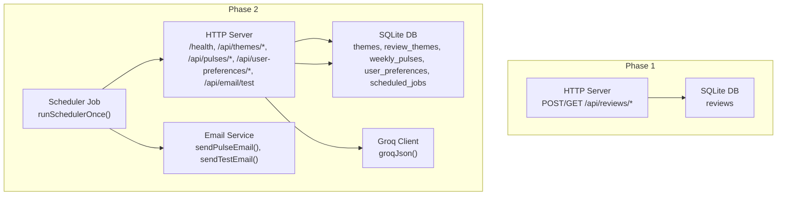
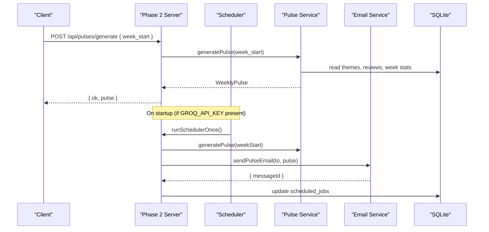
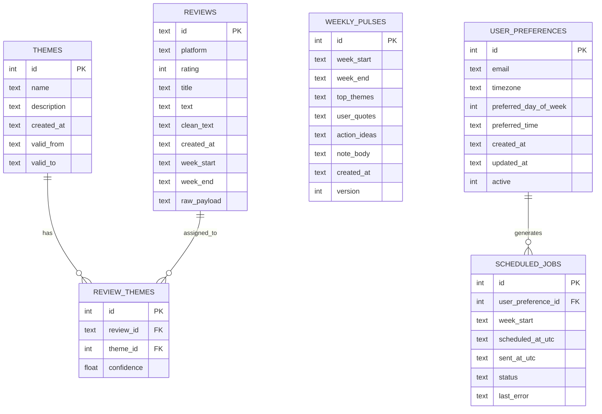
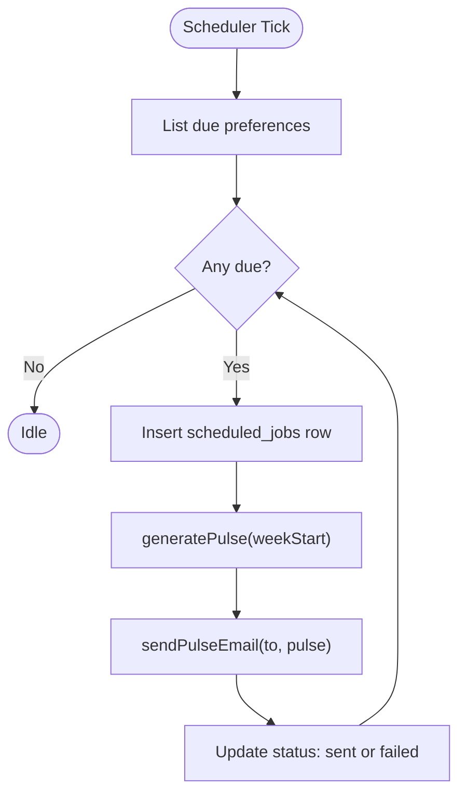
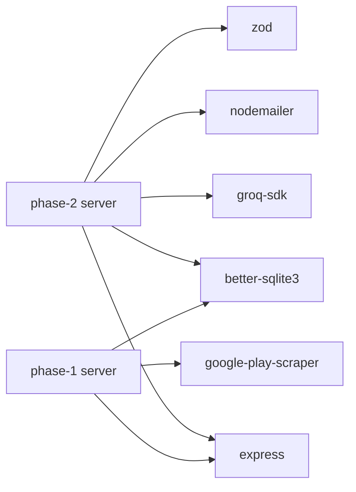

# Deployment & Operations

<cite>
**Referenced Files in This Document**
- [phase-1 env](file://phase-1/src/config/env.ts)
- [phase-2 env](file://phase-2/src/config/env.ts)
- [phase-1 server](file://phase-1/src/api/server.ts)
- [phase-2 server](file://phase-2/src/api/server.ts)
- [phase-1 logger](file://phase-1/src/core/logger.ts)
- [phase-2 logger](file://phase-2/src/core/logger.ts)
- [phase-1 db](file://phase-1/src/db/index.ts)
- [phase-2 db](file://phase-2/src/db/index.ts)
- [phase-2 scheduler](file://phase-2/src/jobs/schedulerJob.ts)
- [phase-2 email service](file://phase-2/src/services/emailService.ts)
- [phase-2 pulse service](file://phase-2/src/services/pulseService.ts)
- [phase-2 theme service](file://phase-2/src/services/themeService.ts)
- [phase-2 user prefs repo](file://phase-2/src/services/userPrefsRepo.ts)
- [phase-1 package.json](file://phase-1/package.json)
- [phase-2 package.json](file://phase-2/package.json)
</cite>

## Table of Contents
1. [Introduction](#introduction)
2. [Project Structure](#project-structure)
3. [Core Components](#core-components)
4. [Architecture Overview](#architecture-overview)
5. [Detailed Component Analysis](#detailed-component-analysis)
6. [Dependency Analysis](#dependency-analysis)
7. [Performance Considerations](#performance-considerations)
8. [Monitoring & Logging](#monitoring--logging)
9. [Environment Setup](#environment-setup)
10. [Containerization & Orchestration](#containerization--orchestration)
11. [Scaling & High Availability](#scaling--high-availability)
12. [Security & Compliance](#security--compliance)
13. [Backup & Recovery](#backup--recovery)
14. [Disaster Recovery Planning](#disaster-recovery-planning)
15. [Maintenance & Scheduling](#maintenance--scheduling)
16. [Troubleshooting Guide](#troubleshooting-guide)
17. [Runbooks](#runbooks)
18. [Conclusion](#conclusion)

## Introduction
This document provides comprehensive deployment and operations guidance for the Groww App Review Insights Analyzer. It covers environment setup across development, staging, and production, containerization and orchestration strategies, monitoring and logging, backup and recovery, scaling and high availability, security and compliance, and operational runbooks for troubleshooting and maintenance.

## Project Structure
The repository is split into three phases:
- Phase 1: Core scraping, filtering, and SQLite storage with a small HTTP API.
- Phase 2: Enhanced with theming, weekly pulse generation, scheduled email delivery, and persistence of user preferences and scheduled jobs.
- Phase 3: Contains a README with architectural notes.

Key runtime components:
- HTTP servers for each phase
- SQLite-backed persistence
- Scheduler for automated pulse generation and email delivery
- Email transport via SMTP
- Structured logging

**Diagram sources**
- [phase-1 server:1-50](file://phase-1/src/api/server.ts#L1-L50)
- [phase-2 server:1-266](file://phase-2/src/api/server.ts#L1-L266)
- [phase-1 db:1-31](file://phase-1/src/db/index.ts#L1-L31)
- [phase-2 db:1-93](file://phase-2/src/db/index.ts#L1-L93)
- [phase-2 scheduler:1-98](file://phase-2/src/jobs/schedulerJob.ts#L1-L98)
- [phase-2 email service:1-142](file://phase-2/src/services/emailService.ts#L1-L142)
- [phase-2 pulse service:1-265](file://phase-2/src/services/pulseService.ts#L1-L265)

**Section sources**
- [phase-1 server:1-50](file://phase-1/src/api/server.ts#L1-L50)
- [phase-2 server:1-266](file://phase-2/src/api/server.ts#L1-L266)
- [phase-1 db:1-31](file://phase-1/src/db/index.ts#L1-L31)
- [phase-2 db:1-93](file://phase-2/src/db/index.ts#L1-L93)

## Core Components
- HTTP Servers
  - Phase 1 exposes scraping and listing endpoints.
  - Phase 2 exposes health, theming, pulse, user preferences, and email test endpoints, plus starts a scheduler when configured.
- Persistence
  - Phase 1: reviews table with week indexing.
  - Phase 2: themes, review_themes, weekly_pulses, user_preferences, scheduled_jobs with appropriate indexes.
- Scheduler
  - Periodic job runner that computes due recipients, generates pulses, sends emails, and records outcomes.
- Email Delivery
  - SMTP-based transport with HTML/text bodies and PII scrubbing.
- LLM Integration
  - Groq client with retries and JSON extraction for structured outputs.
- Logging
  - Console-based logging with INFO/ERROR helpers.

**Section sources**
- [phase-1 server:1-50](file://phase-1/src/api/server.ts#L1-L50)
- [phase-2 server:1-266](file://phase-2/src/api/server.ts#L1-L266)
- [phase-1 db:1-31](file://phase-1/src/db/index.ts#L1-L31)
- [phase-2 db:1-93](file://phase-2/src/db/index.ts#L1-L93)
- [phase-2 scheduler:1-98](file://phase-2/src/jobs/schedulerJob.ts#L1-L98)
- [phase-2 email service:1-142](file://phase-2/src/services/emailService.ts#L1-L142)
- [phase-2 pulse service:1-265](file://phase-2/src/services/pulseService.ts#L1-L265)
- [phase-2 theme service:1-68](file://phase-2/src/services/themeService.ts#L1-L68)
- [phase-2 logger:1-21](file://phase-2/src/core/logger.ts#L1-L21)

## Architecture Overview
The system comprises two primary runtime phases:
- Phase 1: Standalone API for scraping and storing reviews into SQLite.
- Phase 2: Full-featured API with theming, pulse generation, scheduled emails, and persistence.

**Diagram sources**
- [phase-2 server:76-90](file://phase-2/src/api/server.ts#L76-L90)
- [phase-2 scheduler:52-84](file://phase-2/src/jobs/schedulerJob.ts#L52-L84)
- [phase-2 pulse service:179-241](file://phase-2/src/services/pulseService.ts#L179-L241)
- [phase-2 email service:114-129](file://phase-2/src/services/emailService.ts#L114-L129)
- [phase-2 db:1-93](file://phase-2/src/db/index.ts#L1-L93)

## Detailed Component Analysis

### HTTP API Surface
- Phase 1
  - POST /api/reviews/scrape: triggers scraping and storage.
  - GET /api/reviews/scrape: browser-friendly trigger.
  - GET /api/reviews: lists stored reviews.
- Phase 2
  - GET /health: health check.
  - POST /api/themes/generate: generate and persist themes.
  - GET /api/themes: list latest themes.
  - POST /api/themes/assign: assign reviews to themes for a week.
  - POST /api/pulses/generate: generate weekly pulse for a week.
  - GET /api/pulses: list recent pulses.
  - GET /api/pulses/:id: fetch a pulse.
  - POST /api/pulses/:id/send-email: send a pulse via email.
  - POST /api/user-preferences: set user preferences.
  - GET /api/user-preferences: get active preferences.
  - POST /api/email/test: test SMTP configuration.

Operational notes:
- Validation and error handling are performed at the route level.
- Logging is used for request lifecycle and errors.

**Section sources**
- [phase-1 server:9-43](file://phase-1/src/api/server.ts#L9-L43)
- [phase-2 server:28-232](file://phase-2/src/api/server.ts#L28-L232)

### Persistence Model
- Phase 1
  - reviews: id, platform, rating, title, text, clean_text, created_at, week_start, week_end, raw_payload.
  - Index: idx_reviews_week_start.
- Phase 2
  - themes: id, name, description, created_at, valid_from, valid_to.
  - review_themes: id, review_id, theme_id, confidence.
  - weekly_pulses: id, week_start, week_end, top_themes (JSON), user_quotes (JSON), action_ideas (JSON), note_body, created_at, version.
  - user_preferences: id, email, timezone, preferred_day_of_week, preferred_time, created_at, updated_at, active.
  - scheduled_jobs: id, user_preference_id, week_start, scheduled_at_utc, sent_at_utc, status, last_error.

**Diagram sources**
- [phase-1 db:8-26](file://phase-1/src/db/index.ts#L8-L26)
- [phase-2 db:8-88](file://phase-2/src/db/index.ts#L8-L88)

**Section sources**
- [phase-1 db:1-31](file://phase-1/src/db/index.ts#L1-L31)
- [phase-2 db:1-93](file://phase-2/src/db/index.ts#L1-L93)

### Scheduler and Email Automation
- Scheduler
  - Determines last full week (UTC), identifies due preferences, inserts a scheduled job row, generates the pulse, sends email, and updates job status.
  - Starts on server boot if Groq API key is present.
- Email Service
  - Builds HTML/text bodies, scrubs PII, and sends via SMTP transport.
  - Requires SMTP_HOST, SMTP_USER, SMTP_PASS, SMTP_PORT, SMTP_FROM.

**Diagram sources**
- [phase-2 scheduler:52-84](file://phase-2/src/jobs/schedulerJob.ts#L52-L84)
- [phase-2 pulse service:179-241](file://phase-2/src/services/pulseService.ts#L179-L241)
- [phase-2 email service:114-129](file://phase-2/src/services/emailService.ts#L114-L129)

**Section sources**
- [phase-2 scheduler:1-98](file://phase-2/src/jobs/schedulerJob.ts#L1-L98)
- [phase-2 email service:1-142](file://phase-2/src/services/emailService.ts#L1-L142)
- [phase-2 pulse service:1-265](file://phase-2/src/services/pulseService.ts#L1-L265)

### Theming and Pulse Generation
- Theming
  - Generates 3–5 themes from recent reviews using Groq with schema enforcement.
  - Upserts themes with timestamps and optional validity windows.
- Pulse Generation
  - Aggregates theme stats for the week, selects top themes, picks representative quotes, generates action ideas, and writes a concise note.
  - Stores the pulse with versioning and JSON-serialized fields.

**Section sources**
- [phase-2 theme service:1-68](file://phase-2/src/services/themeService.ts#L1-L68)
- [phase-2 pulse service:1-265](file://phase-2/src/services/pulseService.ts#L1-L265)

### Configuration and Environment
- Phase 1
  - DATABASE_FILE, PORT.
- Phase 2
  - DATABASE_FILE, PORT, GROQ_API_KEY, GROQ_MODEL, SMTP_HOST, SMTP_PORT, SMTP_USER, SMTP_PASS, SMTP_FROM.

**Section sources**
- [phase-1 env:1-6](file://phase-1/src/config/env.ts#L1-L6)
- [phase-2 env:1-23](file://phase-2/src/config/env.ts#L1-L23)

## Dependency Analysis
- Runtime dependencies
  - Express for HTTP.
  - better-sqlite3 for local persistence.
  - groq-sdk for LLM integration.
  - nodemailer for SMTP.
  - zod for schema validation.
- Build/test/dev dependencies
  - TypeScript, ts-node, @types packages.

**Diagram sources**
- [phase-1 package.json:13-24](file://phase-1/package.json#L13-L24)
- [phase-2 package.json:13-28](file://phase-2/package.json#L13-L28)

**Section sources**
- [phase-1 package.json:1-26](file://phase-1/package.json#L1-L26)
- [phase-2 package.json:1-30](file://phase-2/package.json#L1-L30)

## Performance Considerations
- Database
  - Use indexes on week_start and scheduled_jobs status/time to optimize lookups.
  - Batch operations for theme upserts reduce transaction overhead.
- I/O Bound Tasks
  - Scraping and LLM calls are external I/O bound; consider timeouts and retries.
- Concurrency
  - Single-threaded Node process; scale horizontally behind a load balancer.
- Caching
  - Consider caching recent themes and pulses if read-heavy.

[No sources needed since this section provides general guidance]

## Monitoring & Logging
- Logging
  - Console-based INFO/ERROR logs are used across components.
  - Add structured logging (e.g., Bunyan, Winston) and export to centralized systems.
- Metrics
  - Expose Prometheus-compatible metrics endpoint or integrate with APM.
  - Track request latency, error rates, job success/failure, and Groq API timings.
- Alerts
  - Alert on failed scheduled jobs, repeated errors, and health check failures.
- Centralized Logging
  - Ship logs to a log aggregator (e.g., ELK, Loki) with correlation IDs.

[No sources needed since this section provides general guidance]

## Environment Setup
- Development
  - Install dependencies for the desired phase.
  - Set environment variables for the target phase.
  - Start the server using dev scripts.
- Staging
  - Use a dedicated database file and SMTP credentials.
  - Enable scheduler only when Groq API key is available.
- Production
  - Use immutable images, non-root users, minimal base images.
  - Enforce secrets management and network policies.
  - Configure health checks and readiness probes.

[No sources needed since this section provides general guidance]

## Containerization & Orchestration
- Images
  - Multi-stage builds: compile TypeScript, copy runtime deps, install production deps only.
  - Use a non-root user and lock down filesystem permissions.
- Volumes
  - Mount persistent volume for the SQLite file if running multiple replicas; otherwise, prefer a shared storage backend.
- Orchestration
  - Kubernetes: Deploy separate workloads for Phase 1 and Phase 2; expose HTTP services; manage secrets and configmaps.
  - Horizontal Pod Autoscaling based on CPU/memory or custom metrics.
  - Rolling updates with readiness/liveness probes.
- Networking
  - Ingress/Route with TLS termination; restrict egress to external APIs (Play Store, Groq, SMTP).

[No sources needed since this section provides general guidance]

## Scaling & High Availability
- Stateless API
  - Keep servers stateless; rely on shared database for state.
- Load Balancing
  - Distribute traffic across pods; sticky sessions not required.
- Replication
  - For write-heavy workloads, consider a clustered database or migration to a managed RDBMS.
- Queue-Based Delivery
  - Offload email sending to a queue/job system for decoupling and reliability.

[No sources needed since this section provides general guidance]

## Security & Compliance
- Secrets Management
  - Store API keys and SMTP credentials in a secret manager; mount as environment variables.
- Network Security
  - Restrict inbound/outbound egress; use private networks and VPCs.
- Data Protection
  - Encrypt at rest; enforce access controls on database files.
  - Apply PII scrubbing consistently; avoid logging sensitive data.
- Vulnerability Management
  - Scan container images and dependencies; patch regularly.
- Compliance
  - Align logging retention and data deletion with policy; audit access to secrets.

[No sources needed since this section provides general guidance]

## Backup & Recovery
- Backups
  - Snapshot the SQLite file; automate periodic backups to durable storage.
  - For high availability, replicate the database to a standby.
- Recovery
  - Validate backups; practice restoration drills.
  - Restore to a temporary environment before promoting to production.
- Retention
  - Define retention periods for logs and backups per policy.

[No sources needed since this section provides general guidance]

## Disaster Recovery Planning
- RTO/RPO Targets
  - Define acceptable downtime and data loss windows.
- Failover
  - Automated failover to secondary region; switch DNS or ingress.
- Testing
  - Regular DR tests; include cross-region restore scenarios.

[No sources needed since this section provides general guidance]

## Maintenance & Scheduling
- Routine Tasks
  - Dependency updates, image rebuilds, DB maintenance.
- Rotation
  - Rotate secrets periodically; rotate Groq and SMTP credentials.
- Capacity Planning
  - Monitor growth in reviews and pulses; plan storage and compute increases.

[No sources needed since this section provides general guidance]

## Troubleshooting Guide
- Health Checks
  - Verify /health responds OK.
- Database Issues
  - Confirm schema initialization and indexes exist.
- Scheduler Not Running
  - Ensure GROQ_API_KEY is set; check logs for initial tick failure.
- Email Failures
  - Validate SMTP credentials; test with /api/email/test; inspect scheduled_jobs statuses.
- LLM Errors
  - Inspect Groq API key and model; review retry logs.

**Section sources**
- [phase-2 server:22-22](file://phase-2/src/api/server.ts#L22-L22)
- [phase-2 scheduler:90-97](file://phase-2/src/jobs/schedulerJob.ts#L90-L97)
- [phase-2 email service:99-112](file://phase-2/src/services/emailService.ts#L99-L112)
- [phase-2 pulse service:179-188](file://phase-2/src/services/pulseService.ts#L179-L188)

## Runbooks

### Runbook: Start Phase 1
- Steps
  - Set DATABASE_FILE and PORT.
  - Build and start the server.
  - Verify /api/reviews endpoints.
- Expected Outcome
  - Server listens on configured port; scraping endpoint returns results.

**Section sources**
- [phase-1 env:1-6](file://phase-1/src/config/env.ts#L1-L6)
- [phase-1 server:45-48](file://phase-1/src/api/server.ts#L45-L48)

### Runbook: Start Phase 2
- Steps
  - Set DATABASE_FILE, PORT, GROQ_API_KEY, SMTP_*.
  - Initialize schema and start server.
  - Generate themes, assign reviews, generate pulse, send test email.
- Expected Outcome
  - Scheduler starts; scheduled_jobs populated; emails sent.

**Section sources**
- [phase-2 env:7-21](file://phase-2/src/config/env.ts#L7-L21)
- [phase-2 server:15-16](file://phase-2/src/api/server.ts#L15-L16)
- [phase-2 server:254-263](file://phase-2/src/api/server.ts#L254-L263)
- [phase-2 email service:132-141](file://phase-2/src/services/emailService.ts#L132-L141)

### Runbook: Investigate Scheduled Emails
- Steps
  - List due preferences and next send times.
  - Check scheduled_jobs for the week.
  - Regenerate pulse and resend email manually.
- Expected Outcome
  - Identify failed jobs and resolve root cause.

**Section sources**
- [phase-2 user prefs repo:83-94](file://phase-2/src/services/userPrefsRepo.ts#L83-L94)
- [phase-2 scheduler:20-40](file://phase-2/src/jobs/schedulerJob.ts#L20-L40)
- [phase-2 pulse service:179-241](file://phase-2/src/services/pulseService.ts#L179-L241)

### Runbook: Fix SMTP Configuration
- Steps
  - Validate SMTP_HOST, SMTP_PORT, SMTP_USER, SMTP_PASS, SMTP_FROM.
  - Send test email.
- Expected Outcome
  - Test email succeeds; scheduled emails resume.

**Section sources**
- [phase-2 email service:99-112](file://phase-2/src/services/emailService.ts#L99-L112)
- [phase-2 email service:132-141](file://phase-2/src/services/emailService.ts#L132-L141)

### Runbook: Recreate Schema
- Steps
  - Stop server.
  - Drop and recreate tables as per schema.
  - Restart server.
- Expected Outcome
  - Fresh schema; reinitialize data as needed.

**Section sources**
- [phase-1 db:7-29](file://phase-1/src/db/index.ts#L7-L29)
- [phase-2 db:7-91](file://phase-2/src/db/index.ts#L7-L91)

## Conclusion
This guide outlines a practical, layered approach to deploying and operating the Groww App Review Insights Analyzer. By separating concerns into distinct phases, leveraging SQLite for persistence, and building robust automation around theming, pulse generation, and email delivery, teams can operate reliably in development, staging, and production environments while maintaining strong observability, security, and operational hygiene.