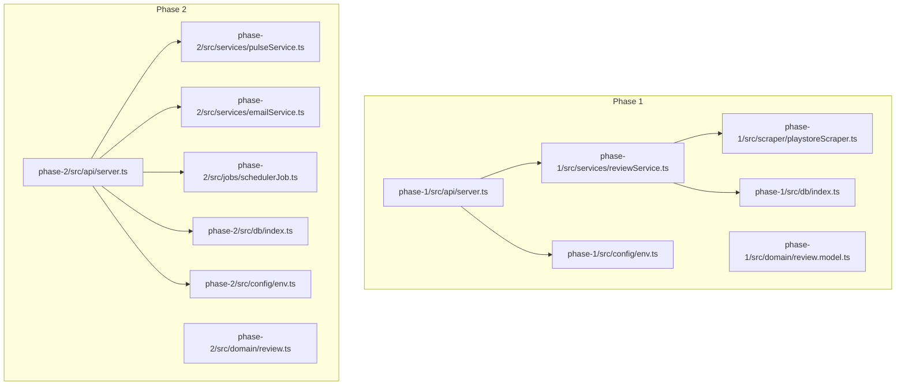
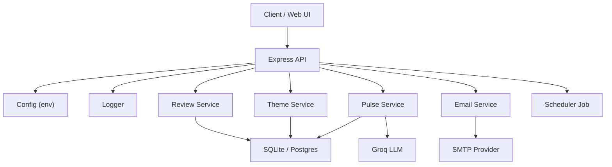
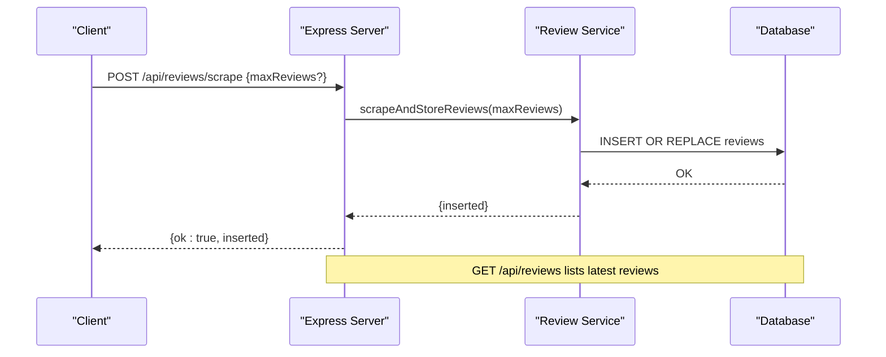
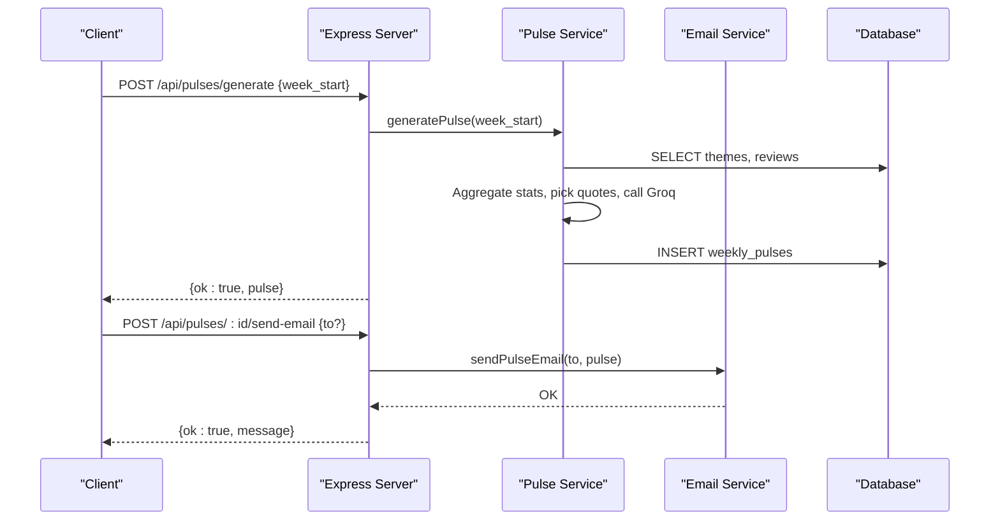
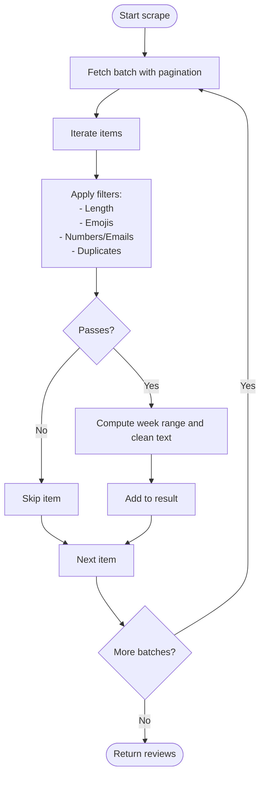
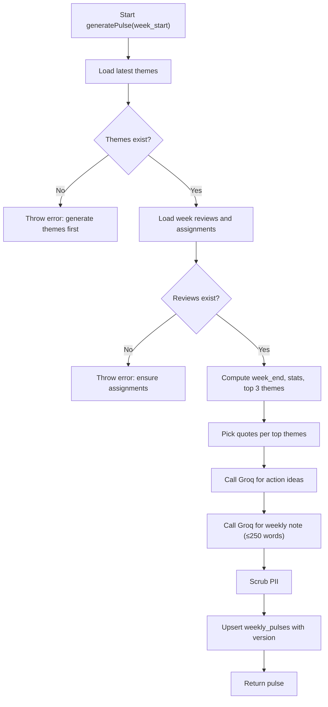
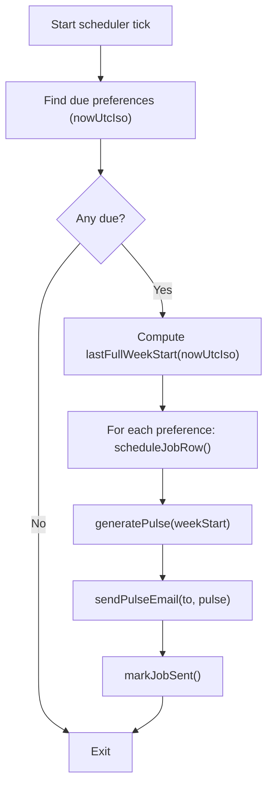
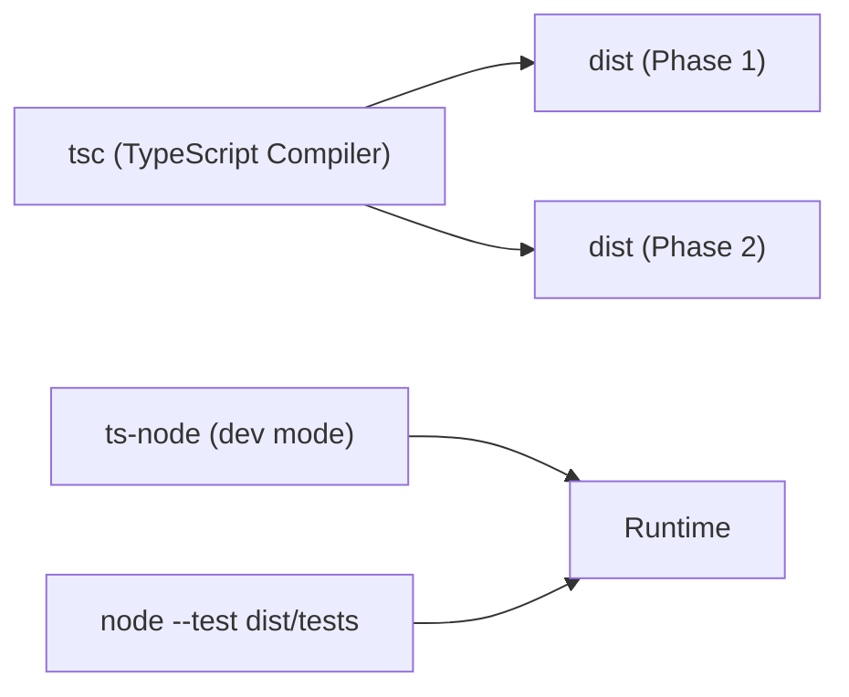

# Development Guidelines

<cite>
**Referenced Files in This Document**
- [ARCHITECTURE.md](file://ARCHITECTURE.md)
- [phase-1 package.json](file://phase-1/package.json)
- [phase-1 tsconfig.json](file://phase-1/tsconfig.json)
- [phase-1 src/api/server.ts](file://phase-1/src/api/server.ts)
- [phase-1 src/config/env.ts](file://phase-1/src/config/env.ts)
- [phase-1 src/domain/review.model.ts](file://phase-1/src/domain/review.model.ts)
- [phase-1 src/services/reviewService.ts](file://phase-1/src/services/reviewService.ts)
- [phase-1 src/scraper/playstoreScraper.ts](file://phase-1/src/scraper/playstoreScraper.ts)
- [phase-2 package.json](file://phase-2/package.json)
- [phase-2 tsconfig.json](file://phase-2/tsconfig.json)
- [phase-2 src/api/server.ts](file://phase-2/src/api/server.ts)
- [phase-2 src/domain/review.ts](file://phase-2/src/domain/review.ts)
- [phase-2 src/services/pulseService.ts](file://phase-2/src/services/pulseService.ts)
- [phase-2 src/services/emailService.ts](file://phase-2/src/services/emailService.ts)
- [phase-2 src/jobs/schedulerJob.ts](file://phase-2/src/jobs/schedulerJob.ts)
</cite>

## Table of Contents
1. [Introduction](#introduction)
2. [Project Structure](#project-structure)
3. [Core Components](#core-components)
4. [Architecture Overview](#architecture-overview)
5. [Detailed Component Analysis](#detailed-component-analysis)
6. [Dependency Analysis](#dependency-analysis)
7. [Performance Considerations](#performance-considerations)
8. [Troubleshooting Guide](#troubleshooting-guide)
9. [Contribution Workflow](#contribution-workflow)
10. [Development Environment Setup](#development-environment-setup)
11. [Release Procedures and Versioning](#release-procedures-and-versioning)
12. [Documentation Standards](#documentation-standards)
13. [Code Quality Tools and Automated Checks](#code-quality-tools-and-automated-checks)
14. [Examples of Good Practices and Anti-Patterns](#examples-of-good-practices-and-anti-patterns)
15. [Team Collaboration and Communication](#team-collaboration-and-communication)
16. [Conclusion](#conclusion)

## Introduction
This document defines comprehensive development guidelines for contributing to the Groww App Review Insights Analyzer. It covers code standards, architectural principles, contribution workflow, environment setup, testing, release procedures, documentation, quality tools, and collaboration practices. The project is implemented in TypeScript across two phases: Phase 1 focuses on scraping, filtering, and storing Play Store reviews; Phase 2 adds theme generation, weekly pulse creation, and email scheduling.

## Project Structure
The repository is organized into distinct phases, each with its own self-contained Node.js/TypeScript project:
- phase-1: Core scraping, filtering, and storage of Play Store reviews.
- phase-2: Groq-powered theme generation, weekly pulse orchestration, and email scheduling.
- ARCHITECTURE.md: High-level architecture and design rationale.

Key folders and responsibilities:
- config: Environment configuration loading.
- core: Shared utilities like logging.
- db: Database initialization and schema management.
- domain: Internal data models.
- scraper: Play Store scraping and filtering logic.
- services: Business logic for reviews, themes, pulses, emails, and preferences.
- api: Express server and route handlers.
- jobs: Scheduler for periodic pulse generation and email dispatch.
- tests: Unit and integration tests (compiled and executed via npm test).
- utils: Shared helpers (e.g., date utilities).

**Diagram sources**
- [phase-1 src/api/server.ts:1-50](file://phase-1/src/api/server.ts#L1-L50)
- [phase-1 src/services/reviewService.ts:1-101](file://phase-1/src/services/reviewService.ts#L1-L101)
- [phase-1 src/scraper/playstoreScraper.ts:1-153](file://phase-1/src/scraper/playstoreScraper.ts#L1-L153)
- [phase-2 src/api/server.ts:1-266](file://phase-2/src/api/server.ts#L1-L266)
- [phase-2 src/services/pulseService.ts:1-265](file://phase-2/src/services/pulseService.ts#L1-L265)
- [phase-2 src/services/emailService.ts:1-142](file://phase-2/src/services/emailService.ts#L1-L142)
- [phase-2 src/jobs/schedulerJob.ts:1-98](file://phase-2/src/jobs/schedulerJob.ts#L1-L98)

**Section sources**
- [ARCHITECTURE.md:44-83](file://ARCHITECTURE.md#L44-L83)
- [phase-1 package.json:1-26](file://phase-1/package.json#L1-L26)
- [phase-2 package.json:1-30](file://phase-2/package.json#L1-L30)

## Core Components
- Configuration and environment:
  - Load environment variables for ports, database files, and third-party keys.
  - Ensure sensitive configuration is not hardcoded and is validated at runtime.
- Logging:
  - Centralized logging for requests, errors, and operational events.
- Database:
  - Initialize schema and manage transactions for bulk inserts.
- Scraping and filtering:
  - Fetch Play Store reviews with pagination, apply filters, and compute weekly buckets.
- Services:
  - Review service: scrape, persist, and list reviews.
  - Pulse service: generate themes, assign reviews to themes, produce weekly pulse, and store results.
  - Email service: build HTML/text bodies and send via SMTP.
  - Scheduler job: periodically evaluate due preferences and dispatch pulses.
- API:
  - REST endpoints for scraping, listing reviews, generating themes, managing user preferences, and sending emails.

**Section sources**
- [phase-1 src/config/env.ts:1-6](file://phase-1/src/config/env.ts#L1-L6)
- [phase-1 src/core/logger.ts:1-200](file://phase-1/src/core/logger.ts#L1-L200)
- [phase-1 src/db/index.ts:1-200](file://phase-1/src/db/index.ts#L1-L200)
- [phase-1 src/services/reviewService.ts:1-101](file://phase-1/src/services/reviewService.ts#L1-L101)
- [phase-1 src/scraper/playstoreScraper.ts:1-153](file://phase-1/src/scraper/playstoreScraper.ts#L1-L153)
- [phase-2 src/services/pulseService.ts:1-265](file://phase-2/src/services/pulseService.ts#L1-L265)
- [phase-2 src/services/emailService.ts:1-142](file://phase-2/src/services/emailService.ts#L1-L142)
- [phase-2 src/jobs/schedulerJob.ts:1-98](file://phase-2/src/jobs/schedulerJob.ts#L1-L98)
- [phase-2 src/api/server.ts:1-266](file://phase-2/src/api/server.ts#L1-L266)

## Architecture Overview
The system follows a layered architecture:
- Presentation: Express routes expose REST endpoints.
- Application: Services encapsulate business logic.
- Persistence: SQLite for local runs; designed for Postgres in production.
- Integrations: Groq for LLM tasks and SMTP for email delivery.

**Diagram sources**
- [phase-2 src/api/server.ts:1-266](file://phase-2/src/api/server.ts#L1-L266)
- [phase-2 src/services/pulseService.ts:1-265](file://phase-2/src/services/pulseService.ts#L1-L265)
- [phase-2 src/services/emailService.ts:1-142](file://phase-2/src/services/emailService.ts#L1-L142)
- [phase-2 src/jobs/schedulerJob.ts:1-98](file://phase-2/src/jobs/schedulerJob.ts#L1-L98)

**Section sources**
- [ARCHITECTURE.md:17-41](file://ARCHITECTURE.md#L17-L41)

## Detailed Component Analysis

### API Server (Phase 1)
Responsibilities:
- Parse JSON requests.
- Validate inputs for scraping endpoints.
- Delegate to review service for scraping and listing.
- Log successes and failures.

**Diagram sources**
- [phase-1 src/api/server.ts:9-43](file://phase-1/src/api/server.ts#L9-L43)
- [phase-1 src/services/reviewService.ts:10-75](file://phase-1/src/services/reviewService.ts#L10-L75)

**Section sources**
- [phase-1 src/api/server.ts:1-50](file://phase-1/src/api/server.ts#L1-L50)
- [phase-1 src/services/reviewService.ts:1-101](file://phase-1/src/services/reviewService.ts#L1-L101)

### API Server (Phase 2)
Responsibilities:
- Health check endpoint.
- Theme generation and listing.
- Weekly pulse generation, listing, retrieval, and email dispatch.
- User preferences management.
- Scheduler startup guarded by API key presence.

**Diagram sources**
- [phase-2 src/api/server.ts:76-154](file://phase-2/src/api/server.ts#L76-L154)
- [phase-2 src/services/pulseService.ts:179-241](file://phase-2/src/services/pulseService.ts#L179-L241)
- [phase-2 src/services/emailService.ts:114-129](file://phase-2/src/services/emailService.ts#L114-L129)

**Section sources**
- [phase-2 src/api/server.ts:1-266](file://phase-2/src/api/server.ts#L1-L266)
- [phase-2 src/services/pulseService.ts:1-265](file://phase-2/src/services/pulseService.ts#L1-L265)
- [phase-2 src/services/emailService.ts:1-142](file://phase-2/src/services/emailService.ts#L1-L142)

### Scraper and Filters (Phase 1)
Processing logic:
- Paginate Play Store reviews with token-based pagination.
- Apply filters to remove short, emoji-only, PII-containing, and duplicate reviews.
- Normalize and compute weekly buckets.
- Fallback to minimally cleaned reviews if filters drop all items.

**Diagram sources**
- [phase-1 src/scraper/playstoreScraper.ts:13-151](file://phase-1/src/scraper/playstoreScraper.ts#L13-L151)

**Section sources**
- [phase-1 src/scraper/playstoreScraper.ts:1-153](file://phase-1/src/scraper/playstoreScraper.ts#L1-L153)

### Pulse Generation (Phase 2)
Core steps:
- Validate prerequisites (themes and week data).
- Aggregate per-theme statistics for the week.
- Select top 3 themes; otherwise fall back to global themes with zero counts.
- Pick quotes per theme from assigned reviews.
- Generate action ideas and a ≤250-word weekly note via Groq.
- Scrub PII and persist the pulse with versioning.

**Diagram sources**
- [phase-2 src/services/pulseService.ts:179-241](file://phase-2/src/services/pulseService.ts#L179-L241)

**Section sources**
- [phase-2 src/services/pulseService.ts:1-265](file://phase-2/src/services/pulseService.ts#L1-L265)

### Scheduler (Phase 2)
Behavior:
- Determine the last full week (UTC).
- Identify due user preferences based on timezone and preferred time.
- For each due preference: schedule job, generate pulse, send email, and update job status.

**Diagram sources**
- [phase-2 src/jobs/schedulerJob.ts:52-84](file://phase-2/src/jobs/schedulerJob.ts#L52-L84)

**Section sources**
- [phase-2 src/jobs/schedulerJob.ts:1-98](file://phase-2/src/jobs/schedulerJob.ts#L1-L98)

## Dependency Analysis
- Phase 1:
  - Dependencies: express, better-sqlite3, google-play-scraper.
  - Dev dependencies: types for express, node, better-sqlite3, ts-node, typescript.
- Phase 2:
  - Dependencies: express, better-sqlite3, dotenv, nodemailer, groq-sdk, zod.
  - Dev dependencies: additional @types for nodemailer.

Build and test scripts:
- build: tsc
- start: node dist/api/server.js
- dev: ts-node src/api/server.ts
- test: compile tests then run with node --test

**Diagram sources**
- [phase-1 package.json:7-12](file://phase-1/package.json#L7-L12)
- [phase-2 package.json:7-12](file://phase-2/package.json#L7-L12)

**Section sources**
- [phase-1 package.json:1-26](file://phase-1/package.json#L1-L26)
- [phase-2 package.json:1-30](file://phase-2/package.json#L1-L30)
- [phase-1 tsconfig.json:1-15](file://phase-1/tsconfig.json#L1-L15)
- [phase-2 tsconfig.json:1-15](file://phase-2/tsconfig.json#L1-L15)

## Performance Considerations
- Batch processing:
  - Use transactions for bulk inserts to reduce I/O overhead.
  - Paginate scraper requests and cap max pages to prevent excessive network usage.
- Caching and reuse:
  - Reuse themes across a rolling window (e.g., last 8–12 weeks) to minimize LLM calls.
- Asynchronous orchestration:
  - Offload heavy LLM work to background jobs and avoid blocking API threads.
- Observability:
  - Log metrics for scrape counts, filter drops, Groq latency, and email send outcomes.

[No sources needed since this section provides general guidance]

## Troubleshooting Guide
Common issues and remedies:
- SMTP configuration errors:
  - Ensure SMTP_HOST, SMTP_USER, SMTP_PASS, and SMTP_FROM are set; verify port/security settings.
- Missing Groq API key:
  - Scheduler does not start without GROQ_API_KEY; set the key to enable automatic pulse delivery.
- Database connectivity:
  - Verify DATABASE_FILE path and permissions; confirm schema initialization runs on startup.
- API errors:
  - Check request payloads for required fields (e.g., week_start format).
  - Inspect logs for detailed error messages and stack traces.

**Section sources**
- [phase-2 src/services/emailService.ts:99-112](file://phase-2/src/services/emailService.ts#L99-L112)
- [phase-2 src/api/server.ts:257-262](file://phase-2/src/api/server.ts#L257-L262)
- [phase-2 src/services/pulseService.ts:179-188](file://phase-2/src/services/pulseService.ts#L179-L188)

## Contribution Workflow
Branching and PR process:
- Feature branches: develop feature branches from main for each phase.
- Commit early and often; keep commits focused and atomic.
- Pull requests: open against the appropriate phase folder; include a summary and rationale.
- Code review: require at least one reviewer; address feedback promptly.
- Testing: ensure tests pass locally before opening a PR; add new tests for new features.
- Merge: fast-forward or squash-and-merge; keep history clean.

[No sources needed since this section provides general guidance]

## Development Environment Setup
Prerequisites:
- Node.js LTS and npm.
- Git.
- Editor with TypeScript support (VS Code recommended).

Steps:
1. Clone the repository.
2. Install dependencies for the desired phase:
   - cd phase-1 or cd phase-2
   - npm ci
3. Configure environment variables:
   - Copy .env.example to .env and fill in values (e.g., PORT, DATABASE_FILE, GROQ_API_KEY, SMTP_*).
4. Build and run:
   - npm run build
   - npm run dev (for hot reload during development)
   - npm start (for production-like execution)
5. Run tests:
   - npm test

**Section sources**
- [phase-1 package.json:7-12](file://phase-1/package.json#L7-L12)
- [phase-2 package.json:7-12](file://phase-2/package.json#L7-L12)

## Release Procedures and Versioning
Versioning strategy:
- Semantic versioning (MAJOR.MINOR.PATCH).
- Increment PATCH for bug fixes, MINOR for backward-compatible features, MAJOR for breaking changes.
- Tag releases in Git and publish artifacts as needed.

Release checklist:
- Update version in package.json.
- Verify builds for both phases.
- Run integration tests.
- Document changes in release notes.
- Tag and push the release.

[No sources needed since this section provides general guidance]

## Documentation Standards
Standards:
- Keep ARCHITECTURE.md updated with design decisions and changes.
- Add inline comments for complex logic; avoid redundant comments for obvious code.
- Use JSDoc-style comments for exported functions and services.
- Maintain READMEs for each phase with purpose, setup, and usage.

**Section sources**
- [ARCHITECTURE.md:1-516](file://ARCHITECTURE.md#L1-L516)

## Code Quality Tools and Automated Checks
Current tooling:
- TypeScript compiler (tsc) with strict mode enabled.
- Node built-in test runner for unit/integration tests.

Recommendations:
- Add ESLint with TypeScript support for style enforcement.
- Add Prettier for consistent formatting.
- Integrate Husky and lint-staged for pre-commit checks.
- Add Vitest or Jest for unit testing framework if desired.

**Section sources**
- [phase-1 tsconfig.json:2-11](file://phase-1/tsconfig.json#L2-L11)
- [phase-2 tsconfig.json:2-11](file://phase-2/tsconfig.json#L2-L11)
- [phase-1 package.json:7-12](file://phase-1/package.json#L7-L12)
- [phase-2 package.json:7-12](file://phase-2/package.json#L7-L12)

## Examples of Good Practices and Anti-Patterns
Good practices:
- Use transactions for bulk writes to maintain consistency.
- Validate and sanitize inputs at the API boundary.
- Keep services pure and delegate side effects to dedicated modules (e.g., email, logging).
- Prefer explicit error messages and structured logging for observability.
- Guard optional integrations (e.g., scheduler) behind feature flags or environment checks.

Anti-patterns to avoid:
- Hardcoding secrets or configuration values.
- Performing heavy I/O inside synchronous request handlers.
- Storing PII; scrub or drop sensitive data before persistence.
- Ignoring pagination limits; always cap max pages and records.

[No sources needed since this section provides general guidance]

## Team Collaboration and Communication
Collaboration practices:
- Use GitHub Issues for tracking bugs and features.
- Use GitHub Discussions for design proposals and questions.
- Establish a regular sync cadence for cross-phase coordination.
- Document decisions and trade-offs in ARCHITECTURE.md and inline comments.

**Section sources**
- [ARCHITECTURE.md:498-516](file://ARCHITECTURE.md#L498-L516)

## Conclusion
These guidelines provide a consistent foundation for developing, testing, releasing, and maintaining the Groww App Review Insights Analyzer across phases. By adhering to the outlined standards, workflows, and practices, contributors can ensure high-quality, observable, and maintainable code that scales with evolving requirements.