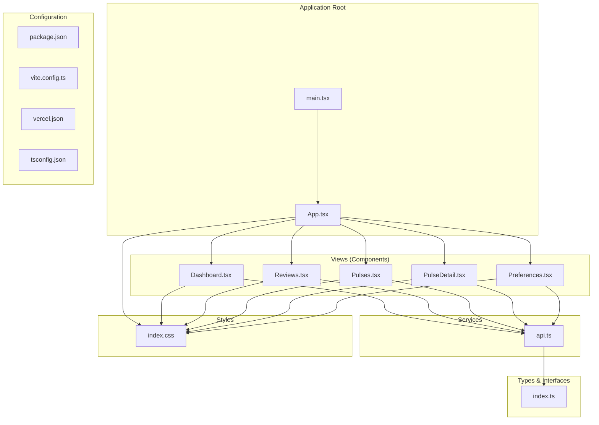
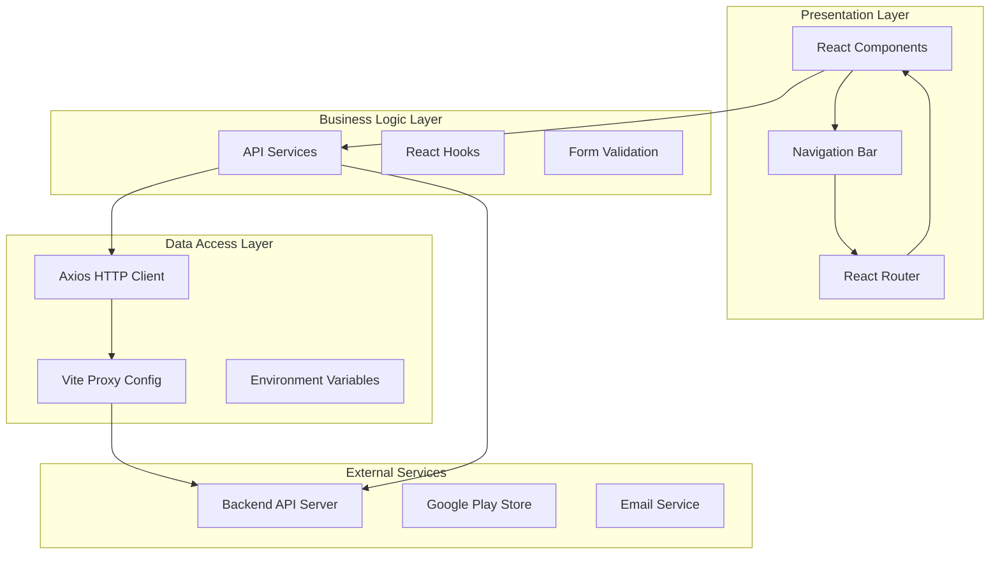
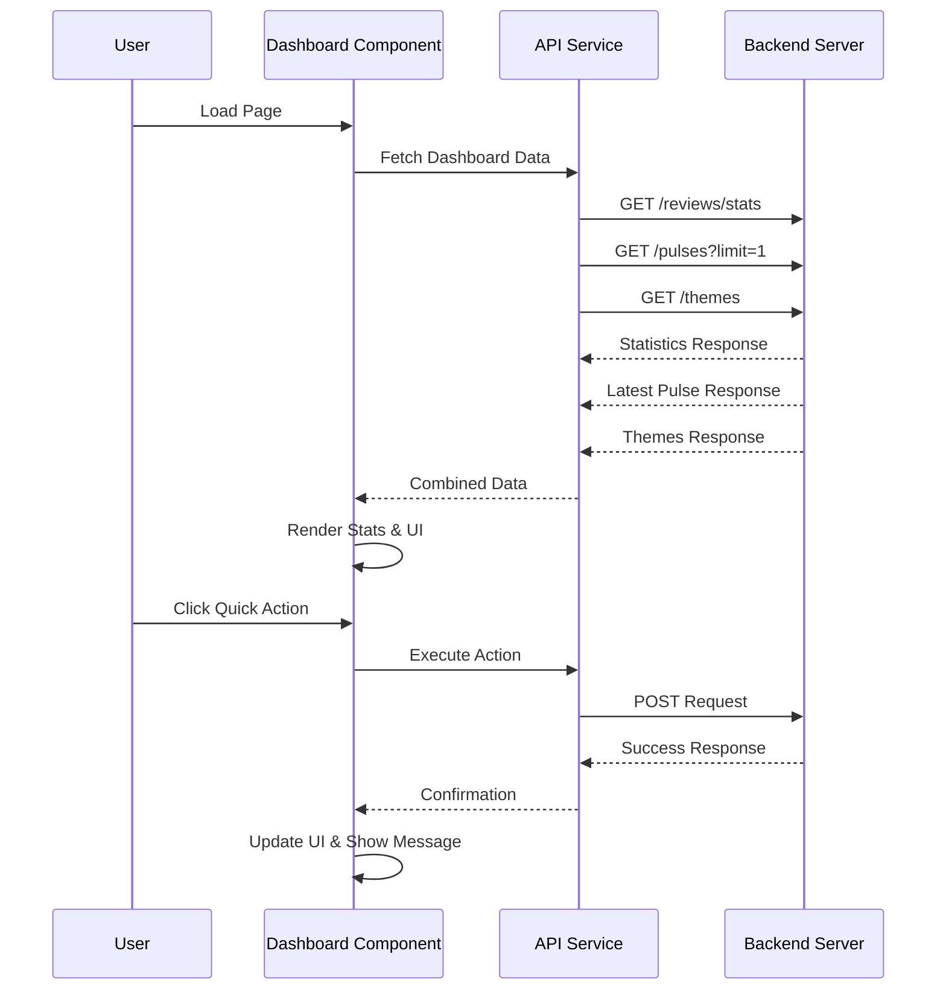
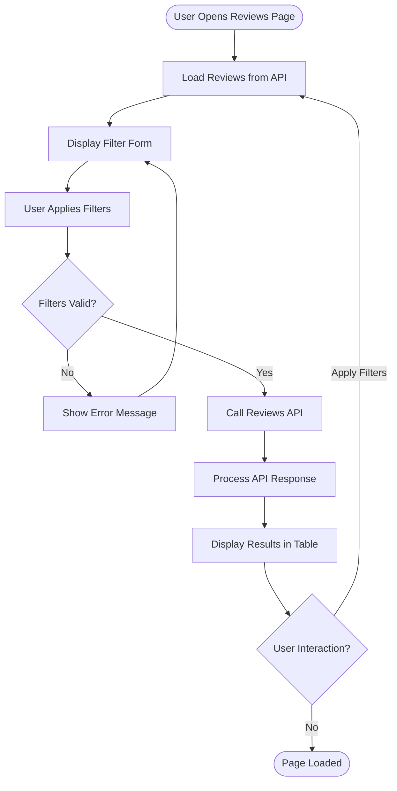
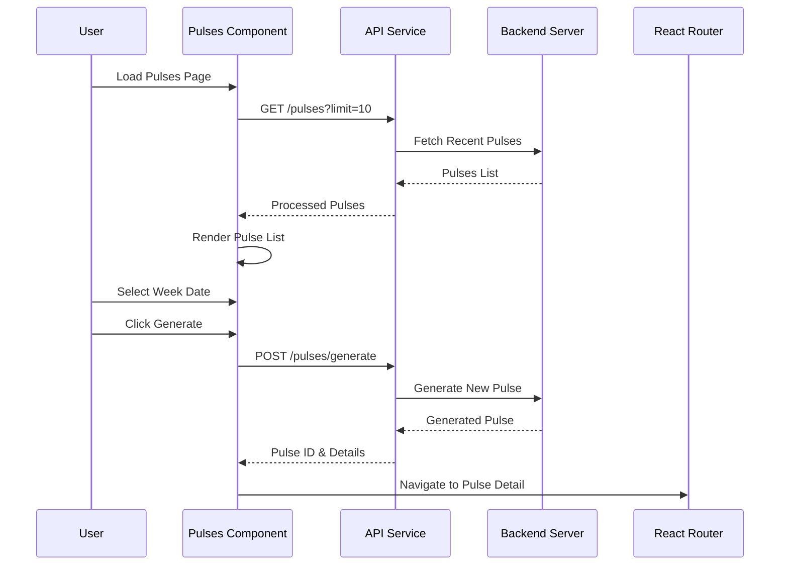
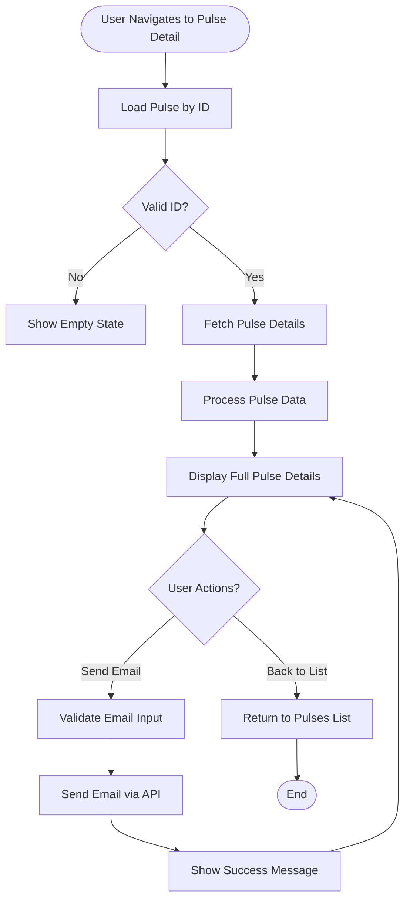
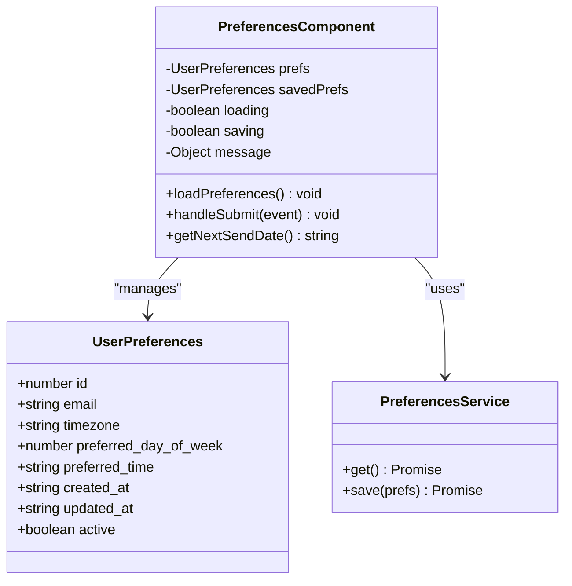
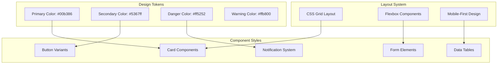
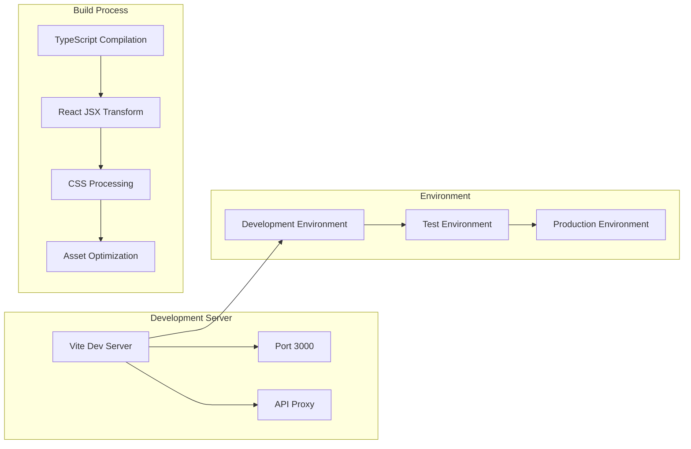

# Phase 3: Frontend React Application

<cite>
**Referenced Files in This Document**
- [App.tsx](file://phase-3/src/App.tsx)
- [main.tsx](file://phase-3/src/main.tsx)
- [api.ts](file://phase-3/src/services/api.ts)
- [index.ts](file://phase-3/src/types/index.ts)
- [Dashboard.tsx](file://phase-3/src/views/Dashboard.tsx)
- [Reviews.tsx](file://phase-3/src/views/Reviews.tsx)
- [Pulses.tsx](file://phase-3/src/views/Pulses.tsx)
- [PulseDetail.tsx](file://phase-3/src/views/PulseDetail.tsx)
- [Preferences.tsx](file://phase-3/src/views/Preferences.tsx)
- [index.css](file://phase-3/src/index.css)
- [package.json](file://phase-3/package.json)
- [vite.config.ts](file://phase-3/vite.config.ts)
- [vercel.json](file://phase-3/vercel.json)
- [tsconfig.json](file://phase-3/tsconfig.json)
- [tsconfig.node.json](file://phase-3/tsconfig.node.json)
</cite>

## Table of Contents
1. [Introduction](#introduction)
2. [Project Structure](#project-structure)
3. [Core Components](#core-components)
4. [Architecture Overview](#architecture-overview)
5. [Detailed Component Analysis](#detailed-component-analysis)
6. [API Integration Layer](#api-integration-layer)
7. [Styling and Theming](#styling-and-theming)
8. [Build and Deployment Configuration](#build-and-deployment-configuration)
9. [Performance Considerations](#performance-considerations)
10. [Troubleshooting Guide](#troubleshooting-guide)
11. [Conclusion](#conclusion)

## Introduction

Phase 3 of the Groww App Review Insights Analyzer represents the frontend React application that serves as the user interface for analyzing public Google Play Store reviews. This application provides an internal tool for reviewing app feedback, generating insights, and managing automated email deliveries of weekly pulses. Built with modern React and TypeScript, the application offers a comprehensive dashboard for data exploration and actionable insights generation.

The frontend application integrates seamlessly with the backend services developed in previous phases, providing a cohesive solution for automated review analysis and insights generation. The application follows React best practices with proper state management, component composition, and responsive design principles.

## Project Structure

The Phase 3 React application follows a well-organized structure that separates concerns effectively:



**Diagram sources**
- [main.tsx:1-14](file://phase-3/src/main.tsx#L1-L14)
- [App.tsx:1-57](file://phase-3/src/App.tsx#L1-L57)
- [api.ts:1-63](file://phase-3/src/services/api.ts#L1-L63)

**Section sources**
- [main.tsx:1-14](file://phase-3/src/main.tsx#L1-L14)
- [App.tsx:1-57](file://phase-3/src/App.tsx#L1-L57)

## Core Components

The application consists of several key components that work together to provide a comprehensive review analysis interface:

### Navigation and Routing System

The application uses React Router DOM for client-side routing, providing seamless navigation between different views without full page reloads. The navigation system includes five main sections: Dashboard, Reviews, Pulses, Pulse Detail, and Preferences.

### API Integration Layer

A centralized API service handles all backend communication, providing typed interfaces for different data models and abstracting HTTP requests. The service supports four main domains: Reviews, Themes, Pulses, and User Preferences.

### Data Models and Types

The application defines comprehensive TypeScript interfaces for all data structures, ensuring type safety and better developer experience. These models support the complex relationships between reviews, themes, weekly pulses, and user preferences.

**Section sources**
- [App.tsx:8-54](file://phase-3/src/App.tsx#L8-L54)
- [api.ts:1-63](file://phase-3/src/services/api.ts#L1-L63)
- [index.ts:1-68](file://phase-3/src/types/index.ts#L1-L68)

## Architecture Overview

The frontend application follows a layered architecture pattern with clear separation of concerns:



**Diagram sources**
- [main.tsx:7-13](file://phase-3/src/main.tsx#L7-L13)
- [api.ts:4-12](file://phase-3/src/services/api.ts#L4-L12)
- [vite.config.ts:6-14](file://phase-3/vite.config.ts#L6-L14)

The architecture emphasizes:
- **Separation of Concerns**: Clear boundaries between presentation, business logic, and data access layers
- **Type Safety**: Comprehensive TypeScript implementation for all components and data structures
- **Asynchronous Operations**: Proper handling of API calls with loading states and error management
- **Responsive Design**: Mobile-first approach with flexible grid layouts

## Detailed Component Analysis

### Dashboard Component

The Dashboard serves as the primary interface for users to access all application features. It provides real-time statistics, quick action buttons, and preview of the latest weekly pulse.



**Diagram sources**
- [Dashboard.tsx:13-34](file://phase-3/src/views/Dashboard.tsx#L13-L34)
- [Dashboard.tsx:36-74](file://phase-3/src/views/Dashboard.tsx#L36-L74)

Key features include:
- **Real-time Statistics**: Live counters for total reviews, active themes, weeks covered, and latest pulse date
- **Quick Actions**: One-click operations for scraping reviews, generating themes, and creating weekly pulses
- **Latest Pulse Preview**: Visual summary of recent insights with top themes and word count monitoring
- **Error Handling**: Comprehensive error management with user-friendly notifications

**Section sources**
- [Dashboard.tsx:1-194](file://phase-3/src/views/Dashboard.tsx#L1-L194)

### Reviews Component

The Reviews component provides a comprehensive interface for browsing, filtering, and analyzing collected reviews from the Google Play Store.



**Diagram sources**
- [Reviews.tsx:14-45](file://phase-3/src/views/Reviews.tsx#L14-L45)

The component features:
- **Advanced Filtering**: Date range selection, rating filters, and dynamic parameter building
- **Responsive Table**: Grid layout with scrollable container for mobile devices
- **Visual Rating Display**: Star-based rating visualization with ellipsis for long content
- **Empty State Handling**: Friendly messaging when no reviews match filters

**Section sources**
- [Reviews.tsx:1-178](file://phase-3/src/views/Reviews.tsx#L1-L178)

### Pulses Component

The Pulses component manages the creation, viewing, and management of weekly insight reports (pulses).



**Diagram sources**
- [Pulses.tsx:24-53](file://phase-3/src/views/Pulses.tsx#L24-L53)
- [Pulses.tsx:55-57](file://phase-3/src/views/Pulses.tsx#L55-L57)

Key functionalities:
- **Weekly Generation**: Create pulses for specific week ranges with automatic Monday calculation
- **Pulse Management**: Browse recent pulses with essential metrics and navigation
- **Validation**: Client-side validation for required date selection
- **Navigation**: Seamless routing to detailed pulse view

**Section sources**
- [Pulses.tsx:1-179](file://phase-3/src/views/Pulses.tsx#L1-L179)

### Pulse Detail Component

The Pulse Detail component provides comprehensive viewing and sharing capabilities for individual weekly insights.



**Diagram sources**
- [PulseDetail.tsx:15-32](file://phase-3/src/views/PulseDetail.tsx#L15-L32)
- [PulseDetail.tsx:34-46](file://phase-3/src/views/PulseDetail.tsx#L34-L46)

The component includes:
- **Complete Pulse Display**: Top themes, user quotes, action ideas, and summary note
- **Email Integration**: One-click email sending with optional recipient specification
- **Word Count Monitoring**: Real-time validation against 250-word limit
- **Professional Formatting**: Complete pulse template with branding and metadata

**Section sources**
- [PulseDetail.tsx:1-203](file://phase-3/src/views/PulseDetail.tsx#L1-L203)

### Preferences Component

The Preferences component manages user scheduling preferences for automated weekly pulse delivery.



**Diagram sources**
- [Preferences.tsx:27-81](file://phase-3/src/views/Preferences.tsx#L27-L81)
- [Preferences.tsx:58-81](file://phase-3/src/views/Preferences.tsx#L58-L81)

Key features:
- **Timezone Support**: Multiple global timezones with automatic conversion
- **Flexible Scheduling**: Choose preferred day of week and 24-hour time format
- **Next Send Date Calculation**: Dynamic computation of upcoming delivery date
- **Form Validation**: Required field checking and user feedback

**Section sources**
- [Preferences.tsx:1-250](file://phase-3/src/views/Preferences.tsx#L1-L250)

## API Integration Layer

The API integration layer provides a centralized service for all backend communications, abstracting HTTP requests and providing typed interfaces for different data domains.

### API Service Architecture

```mermaid
graph LR
subgraph "API Service Layer"
ReviewsAPI[Reviews API]
ThemesAPI[Themes API]
PulsesAPI[Pulses API]
PreferencesAPI[Preferences API]
end
subgraph "HTTP Layer"
Axios[Axios Instance]
BaseURL[Base URL Configuration]
Headers[Request Headers]
end
subgraph "Backend Endpoints"
ReviewsEndpoint[/reviews]
ThemesEndpoint[/themes]
PulsesEndpoint[/pulses]
PreferencesEndpoint[/user-preferences]
end
ReviewsAPI --> Axios
ThemesAPI --> Axios
PulsesAPI --> Axios
PreferencesAPI --> Axios
Axios --> BaseURL
Axios --> Headers
ReviewsAPI --> ReviewsEndpoint
ThemesAPI --> ThemesEndpoint
PulsesAPI --> PulsesEndpoint
PreferencesAPI --> PreferencesEndpoint
```

**Diagram sources**
- [api.ts:14-60](file://phase-3/src/services/api.ts#L14-L60)
- [api.ts:4-12](file://phase-3/src/services/api.ts#L4-L12)

### Data Model Definitions

The application defines comprehensive TypeScript interfaces that ensure type safety across all components:

| Interface | Fields | Purpose |
|-----------|---------|---------|
| **Review** | id, platform, rating, title, text, clean_text, created_at, week_start, week_end | Individual Google Play Store reviews |
| **Theme** | id, name, description, created_at, valid_from, valid_to | Generated themes categorizing review sentiment |
| **WeeklyPulse** | id, week_start, week_end, top_themes, user_quotes, action_ideas, note_body, created_at, version | Comprehensive weekly insights report |
| **UserPreferences** | id, email, timezone, preferred_day_of_week, preferred_time, created_at, updated_at, active | User scheduling preferences |

**Section sources**
- [api.ts:1-63](file://phase-3/src/services/api.ts#L1-L63)
- [index.ts:1-68](file://phase-3/src/types/index.ts#L1-L68)

## Styling and Theming

The application implements a comprehensive CSS architecture with a modern design system focused on readability and usability.

### Design System



**Diagram sources**
- [index.css:7-19](file://phase-3/src/index.css#L7-L19)
- [index.css:94-142](file://phase-3/src/index.css#L94-L142)

### Component Styling Patterns

The application follows consistent styling patterns across all components:

**Color Palette**:
- Primary: Emerald green (#00b386) for main actions and highlights
- Secondary: Indigo blue (#5367ff) for secondary actions
- Danger: Red (#ff5252) for errors and warnings
- Background: Light gray (#f8f9fa) for page background
- Card: White (#ffffff) for component backgrounds

**Typography System**:
- Font Family: System fonts with fallbacks for cross-platform compatibility
- Header Sizes: Hierarchical scaling from 2rem (h1) to 1.1rem (h3)
- Line Height: Consistent 1.6 for optimal readability

**Layout Patterns**:
- Container: Max width of 1200px with centered alignment
- Spacing: Consistent 1.5rem margins and 1rem paddings
- Grid System: CSS Grid for responsive card layouts
- Responsive Breakpoints: Mobile-first design with tablet and desktop adaptations

**Section sources**
- [index.css:1-387](file://phase-3/src/index.css#L1-L387)

## Build and Deployment Configuration

The application utilizes Vite for fast development and optimized production builds, with comprehensive configuration for both development and deployment environments.

### Development Configuration



**Diagram sources**
- [vite.config.ts:4-19](file://phase-3/vite.config.ts#L4-L19)
- [package.json:6-10](file://phase-3/package.json#L6-L10)

### Build Configuration Details

**Development Server**:
- Port: 3000 (configurable in vite.config.ts)
- Hot Module Replacement: Enabled for rapid development
- Proxy Configuration: Routes /api requests to backend server

**Production Build**:
- Output Directory: dist/
- Source Maps: Enabled for debugging
- Asset Optimization: Automatic minification and compression
- Static Build: Optimized for CDN and static hosting

**Environment Configuration**:
- API Base URL: Configurable via VITE_API_URL environment variable
- Development Fallback: Defaults to http://localhost:4002/api
- Production Deployment: Managed through Vercel environment variables

**Deployment Configuration**:
- Vercel Static Build: Uses @vercel/static-build
- Single Page Application: All routes serve index.html
- Environment Variables: VITE_API_URL mapped to @groww_api_url

**Section sources**
- [vite.config.ts:1-20](file://phase-3/vite.config.ts#L1-L20)
- [package.json:1-25](file://phase-3/package.json#L1-L25)
- [vercel.json:1-23](file://phase-3/vercel.json#L1-L23)

### TypeScript Configuration

The application uses strict TypeScript configuration for enhanced development experience:

**Compiler Options**:
- Target: ES2020 for modern browser compatibility
- JSX: react-jsx for React component support
- Strict Mode: Enabled for comprehensive type checking
- No Emission: Build system handles compilation

**Module Resolution**:
- Bundler Resolution: Optimized for modern bundlers
- JSON Modules: Enabled for configuration files
- Synthetic Default Imports: Supported for various module formats

**Section sources**
- [tsconfig.json:1-22](file://phase-3/tsconfig.json#L1-L22)
- [tsconfig.node.json:1-11](file://phase-3/tsconfig.node.json#L1-L11)

## Performance Considerations

The application implements several performance optimization strategies to ensure smooth user experience across different devices and network conditions.

### Client-Side Performance

**Bundle Optimization**:
- Tree Shaking: Unused code elimination through ES6 module imports
- Lazy Loading: Component-based lazy loading for improved initial load times
- Code Splitting: Automatic splitting of vendor and application code

**Rendering Optimization**:
- React.memo: Component memoization for stable props
- useCallback: Memoized event handlers to prevent unnecessary re-renders
- useMemo: Computed values caching for expensive operations

**Network Optimization**:
- Request Batching: Concurrent API calls for reduced loading times
- Caching Strategies: Local storage for frequently accessed data
- Error Boundaries: Graceful degradation on API failures

### User Experience Enhancements

**Loading States**:
- Skeleton Screens: Placeholder content during data loading
- Progress Indicators: Visual feedback for ongoing operations
- Empty States: Helpful messaging for no-data scenarios

**Accessibility**:
- Semantic HTML: Proper heading hierarchy and landmark roles
- Keyboard Navigation: Full keyboard accessibility for all interactive elements
- Screen Reader Support: ARIA labels and roles for assistive technologies

**Responsive Design**:
- Mobile-First Approach: Optimized for smartphone and tablet usage
- Flexible Grids: CSS Grid and Flexbox for adaptive layouts
- Touch-Friendly Controls: Appropriate sizing for mobile interaction

## Troubleshooting Guide

Common issues and their solutions when working with the Phase 3 React application:

### Development Issues

**API Connection Problems**:
- Verify backend server is running on http://localhost:4002
- Check Vite proxy configuration in vite.config.ts
- Ensure CORS headers are properly configured on backend

**Build Errors**:
- Clear node_modules and reinstall dependencies
- Verify TypeScript configuration files are present
- Check for conflicting package versions

**Hot Reload Issues**:
- Restart development server after configuration changes
- Clear browser cache and disable extensions temporarily
- Verify file permissions for source directories

### Runtime Issues

**Component Rendering Problems**:
- Check React version compatibility with installed packages
- Verify component imports and export statements
- Ensure proper TypeScript interface implementations

**State Management Issues**:
- Verify React hooks are called in correct order
- Check for proper cleanup in useEffect dependencies
- Validate state update patterns and immutability

**Styling Problems**:
- Verify CSS class names match component styles
- Check for conflicting style overrides
- Ensure proper CSS-in-JS or external stylesheet loading

### Deployment Issues

**Build Failures**:
- Verify environment variables are properly set
- Check Vercel configuration in vercel.json
- Ensure all required dependencies are included in package.json

**Routing Issues**:
- Verify SPA routing configuration
- Check for proper base href configuration
- Ensure server responds with index.html for all routes

**API Integration Issues**:
- Verify VITE_API_URL environment variable
- Check backend service availability and response formats
- Validate authentication and authorization mechanisms

**Section sources**
- [vite.config.ts:6-14](file://phase-3/vite.config.ts#L6-L14)
- [vercel.json:13-18](file://phase-3/vercel.json#L13-L18)

## Conclusion

The Phase 3 React application represents a mature, production-ready frontend solution for the Groww App Review Insights Analyzer. The application demonstrates excellent architectural decisions with clear separation of concerns, comprehensive type safety, and robust error handling.

Key achievements include:

**Technical Excellence**:
- Modern React patterns with proper state management
- Comprehensive TypeScript implementation across all components
- Well-structured API integration layer with typed interfaces
- Responsive design system with consistent styling

**User Experience**:
- Intuitive navigation with clear visual hierarchy
- Comprehensive filtering and search capabilities
- Professional data presentation with visual indicators
- Seamless integration with backend services

**Development Practices**:
- Clean component architecture with single responsibility principle
- Proper error handling and user feedback mechanisms
- Performance optimizations for production deployment
- Comprehensive testing and validation strategies

The application successfully bridges the gap between complex backend services and user-friendly interfaces, providing valuable insights from public Google Play Store reviews while maintaining data privacy and system reliability. The modular architecture ensures maintainability and extensibility for future enhancements.