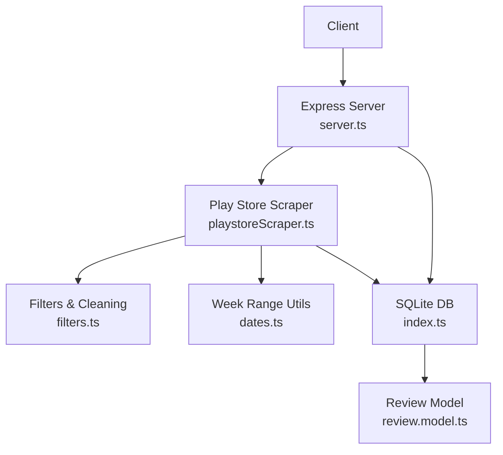
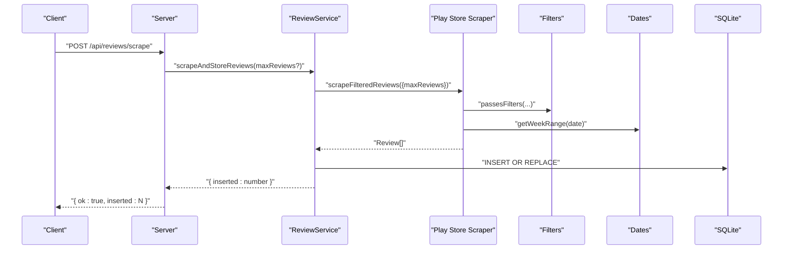
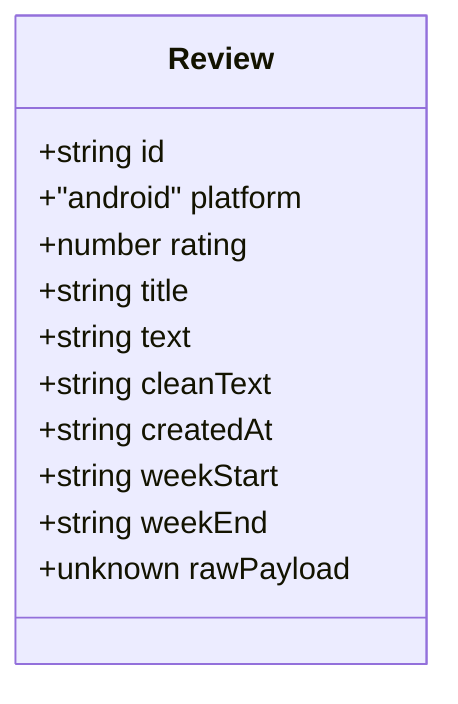
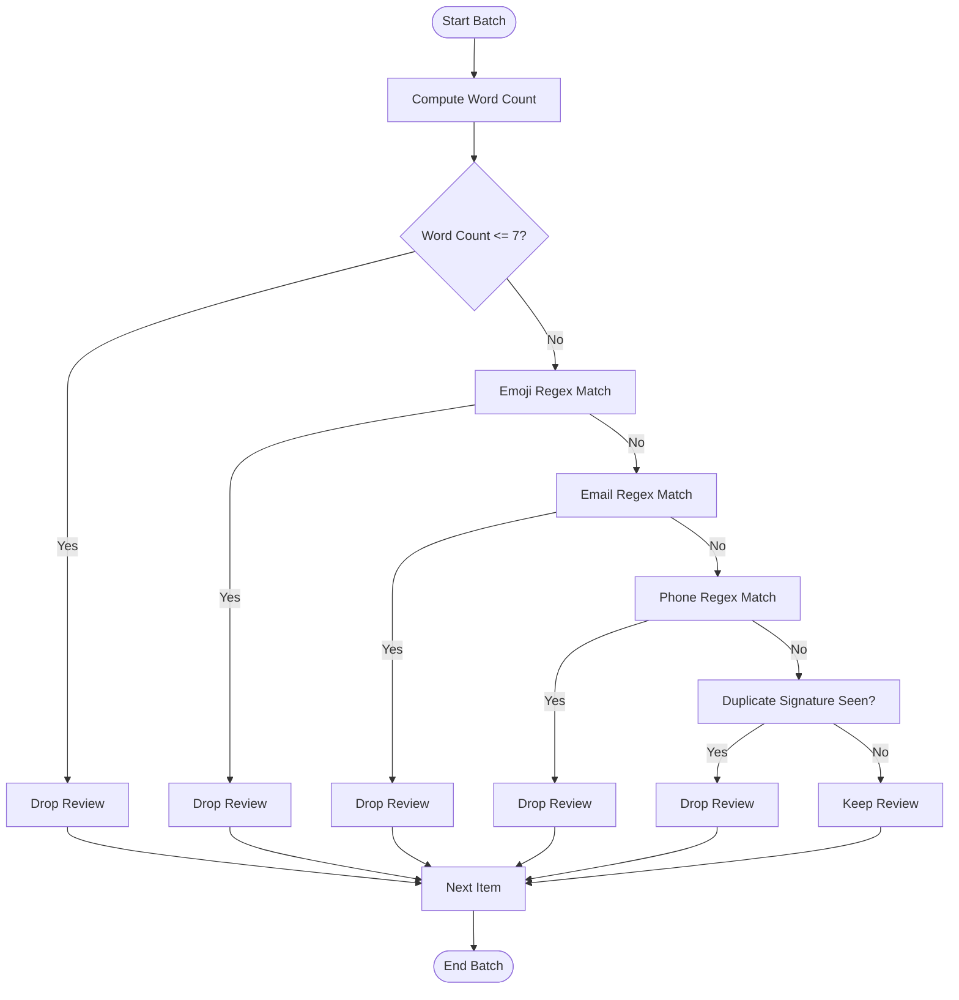
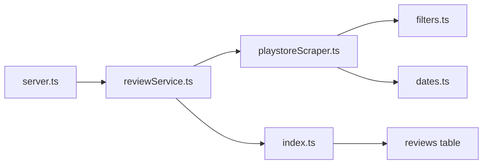

# API Endpoints

<cite>
**Referenced Files in This Document**
- [server.ts](file://phase-1/src/api/server.ts)
- [reviewService.ts](file://phase-1/src/services/reviewService.ts)
- [review.model.ts](file://phase-1/src/domain/review.model.ts)
- [playstoreScraper.ts](file://phase-1/src/scraper/playstoreScraper.ts)
- [filters.ts](file://phase-1/src/scraper/filters.ts)
- [dates.ts](file://phase-1/src/utils/dates.ts)
- [index.ts](file://phase-1/src/db/index.ts)
- [env.ts](file://phase-1/src/config/env.ts)
- [logger.ts](file://phase-1/src/core/logger.ts)
- [package.json](file://phase-1/package.json)
- [integration.scrape.test.ts](file://phase-1/src/tests/integration.scrape.test.ts)
</cite>

## Table of Contents
1. [Introduction](#introduction)
2. [Project Structure](#project-structure)
3. [Core Components](#core-components)
4. [Architecture Overview](#architecture-overview)
5. [Detailed Component Analysis](#detailed-component-analysis)
6. [Dependency Analysis](#dependency-analysis)
7. [Performance Considerations](#performance-considerations)
8. [Troubleshooting Guide](#troubleshooting-guide)
9. [Conclusion](#conclusion)
10. [Appendices](#appendices)

## Introduction
This document describes the Phase 1 REST API endpoints for scraping and retrieving Groww app reviews from the Google Play Store. It covers HTTP methods, URL patterns, request/response schemas, error handling, and operational guidance. Authentication, rate limiting, CORS, content-type handling, and API versioning considerations are addressed with practical examples and client implementation guidelines.

## Project Structure
The Phase 1 API is implemented as a small Express server with a SQLite backend. The server exposes two primary endpoints:
- POST /api/reviews/scrape: Trigger manual scraping and store filtered reviews
- GET /api/reviews: Retrieve stored reviews with optional limit

**Diagram sources**
- [server.ts:1-50](file://phase-1/src/api/server.ts#L1-L50)
- [playstoreScraper.ts:1-153](file://phase-1/src/scraper/playstoreScraper.ts#L1-L153)
- [filters.ts:1-59](file://phase-1/src/scraper/filters.ts#L1-L59)
- [dates.ts:1-23](file://phase-1/src/utils/dates.ts#L1-L23)
- [index.ts:1-31](file://phase-1/src/db/index.ts#L1-L31)
- [review.model.ts:1-14](file://phase-1/src/domain/review.model.ts#L1-L14)

**Section sources**
- [server.ts:1-50](file://phase-1/src/api/server.ts#L1-L50)
- [index.ts:1-31](file://phase-1/src/db/index.ts#L1-L31)
- [env.ts:1-6](file://phase-1/src/config/env.ts#L1-L6)

## Core Components
- Express server initializes JSON middleware and registers routes for scraping and listing reviews.
- Review service orchestrates scraping, filtering, cleaning, persistence, and debug JSON writing.
- SQLite schema stores normalized review records with indexing for analytics.
- Scraper integrates with the Google Play Scraper library, paginates results, applies filters, and computes weekly buckets.
- Logger provides simple console logging for info and error events.

Key runtime configuration:
- Port defaults to 4001; database filename defaults to phase1.db; configurable via environment variables.

**Section sources**
- [server.ts:1-50](file://phase-1/src/api/server.ts#L1-L50)
- [reviewService.ts:1-101](file://phase-1/src/services/reviewService.ts#L1-L101)
- [index.ts:1-31](file://phase-1/src/db/index.ts#L1-L31)
- [env.ts:1-6](file://phase-1/src/config/env.ts#L1-L6)

## Architecture Overview
The API follows a straightforward pipeline: client requests trigger scraping, filtered results are persisted to SQLite, and subsequent reads return stored data.

**Diagram sources**
- [server.ts:9-19](file://phase-1/src/api/server.ts#L9-L19)
- [reviewService.ts:10-75](file://phase-1/src/services/reviewService.ts#L10-L75)
- [playstoreScraper.ts:13-151](file://phase-1/src/scraper/playstoreScraper.ts#L13-L151)
- [filters.ts:16-48](file://phase-1/src/scraper/filters.ts#L16-L48)
- [dates.ts:1-21](file://phase-1/src/utils/dates.ts#L1-L21)
- [index.ts:7-29](file://phase-1/src/db/index.ts#L7-L29)

## Detailed Component Analysis

### Endpoint: POST /api/reviews/scrape
- Purpose: Manually trigger scraping and store filtered reviews.
- Method: POST
- Content-Type: application/json
- Request body:
  - maxReviews: integer (optional). Controls the approximate number of raw batches to fetch; actual insertion depends on filters.
- Response:
  - Success: { ok: true, inserted: number }
  - Failure: { ok: false, error: string }
- Behavior:
  - Validates numeric maxReviews; otherwise runs with defaults.
  - Scrapes Play Store reviews with token-based pagination up to a bounded number of pages.
  - Applies filters to remove short, emoji-heavy, PII-containing, and duplicate reviews.
  - Persists filtered reviews to SQLite and writes a debug JSON file for inspection.
  - Returns the number of inserted reviews.

Common request:
- POST http://localhost:4001/api/reviews/scrape
- Body: {"maxReviews": 2000}

Response examples:
- Success: {"ok":true,"inserted":120}
- Error: {"ok":false,"error":"Failed to scrape reviews"}

Notes:
- GET /api/reviews/scrape is also supported for browser-friendly triggers; query parameter maxReviews is parsed similarly.

**Section sources**
- [server.ts:9-19](file://phase-1/src/api/server.ts#L9-L19)
- [server.ts:21-32](file://phase-1/src/api/server.ts#L21-L32)
- [reviewService.ts:10-75](file://phase-1/src/services/reviewService.ts#L10-L75)
- [playstoreScraper.ts:13-151](file://phase-1/src/scraper/playstoreScraper.ts#L13-L151)
- [filters.ts:16-48](file://phase-1/src/scraper/filters.ts#L16-L48)

### Endpoint: GET /api/reviews
- Purpose: Retrieve stored reviews.
- Method: GET
- Query parameters:
  - limit: integer (optional). Defaults to 100 if omitted or invalid.
- Response:
  - Success: { ok: true, reviews: Review[] }
  - Failure: { ok: false, error: string }
- Data model: Review
  - id: string
  - platform: "android"
  - rating: number
  - title: string
  - text: string
  - cleanText: string
  - createdAt: ISO date string
  - weekStart: string (YYYY-MM-DD)
  - weekEnd: string (YYYY-MM-DD)
  - rawPayload?: unknown

Example request:
- GET http://localhost:4001/api/reviews?limit=50

Example response:
- {"ok":true,"reviews":[{"id":"...","platform":"android","rating":5,"title":"...","text":"...","cleanText":"...","createdAt":"2024-01-01T00:00:00Z","weekStart":"2023-12-25","weekEnd":"2023-12-31","rawPayload":null}]}

Notes:
- Reviews are ordered by created_at descending.
- Pagination is not implemented; use limit to constrain results.

**Section sources**
- [server.ts:34-43](file://phase-1/src/api/server.ts#L34-L43)
- [reviewService.ts:77-99](file://phase-1/src/services/reviewService.ts#L77-L99)
- [review.model.ts:1-14](file://phase-1/src/domain/review.model.ts#L1-L14)

### Data Model: Review

**Diagram sources**
- [review.model.ts:1-14](file://phase-1/src/domain/review.model.ts#L1-L14)

**Section sources**
- [review.model.ts:1-14](file://phase-1/src/domain/review.model.ts#L1-L14)

### Filtering and Cleaning Pipeline

**Diagram sources**
- [playstoreScraper.ts:64-92](file://phase-1/src/scraper/playstoreScraper.ts#L64-L92)
- [filters.ts:16-48](file://phase-1/src/scraper/filters.ts#L16-L48)

**Section sources**
- [playstoreScraper.ts:13-151](file://phase-1/src/scraper/playstoreScraper.ts#L13-L151)
- [filters.ts:1-59](file://phase-1/src/scraper/filters.ts#L1-L59)
- [dates.ts:1-23](file://phase-1/src/utils/dates.ts#L1-L23)

## Dependency Analysis
- Server depends on reviewService for scraping and listing.
- reviewService depends on:
  - playstoreScraper for fetching and filtering
  - filters for validation and cleaning
  - dates for weekly bucket computation
  - SQLite for persistence
- SQLite schema includes an index on week_start for analytics.

**Diagram sources**
- [server.ts:1-50](file://phase-1/src/api/server.ts#L1-L50)
- [reviewService.ts:1-101](file://phase-1/src/services/reviewService.ts#L1-L101)
- [playstoreScraper.ts:1-153](file://phase-1/src/scraper/playstoreScraper.ts#L1-L153)
- [filters.ts:1-59](file://phase-1/src/scraper/filters.ts#L1-L59)
- [dates.ts:1-23](file://phase-1/src/utils/dates.ts#L1-L23)
- [index.ts:1-31](file://phase-1/src/db/index.ts#L1-L31)

**Section sources**
- [server.ts:1-50](file://phase-1/src/api/server.ts#L1-L50)
- [reviewService.ts:1-101](file://phase-1/src/services/reviewService.ts#L1-L101)
- [index.ts:1-31](file://phase-1/src/db/index.ts#L1-L31)

## Performance Considerations
- Scraping uses token-based pagination with a bounded page cap to prevent excessive network usage.
- Filtering occurs during scraping; keep maxReviews reasonable to avoid long scraping sessions.
- SQLite transactions batch inserts for efficiency.
- Index on week_start supports future analytics queries.
- Limit responses with the limit parameter to reduce payload size.

[No sources needed since this section provides general guidance]

## Troubleshooting Guide
- 500 Internal Server Error:
  - Occurs when scraping fails or database operations throw exceptions.
  - Inspect server logs for error messages and stack traces.
- Empty results:
  - If filters drop all items, the scraper falls back to minimally cleaned reviews.
  - Verify that maxReviews is sufficient and filters are not overly strict.
- Database file location:
  - Default filename is phase1.db; adjust DATABASE_FILE environment variable if needed.
- Port conflicts:
  - Default port is 4001; set PORT environment variable to change.

**Section sources**
- [server.ts:15-18](file://phase-1/src/api/server.ts#L15-L18)
- [server.ts:28-31](file://phase-1/src/api/server.ts#L28-L31)
- [server.ts:39-42](file://phase-1/src/api/server.ts#L39-L42)
- [playstoreScraper.ts:146-148](file://phase-1/src/scraper/playstoreScraper.ts#L146-L148)
- [env.ts:1-6](file://phase-1/src/config/env.ts#L1-L6)

## Conclusion
Phase 1 provides a minimal but functional API for manual scraping and retrieval of filtered Play Store reviews. The endpoints are straightforward, with clear request/response schemas and robust error handling. Clients should use the POST /api/reviews/scrape endpoint to refresh data and GET /api/reviews to consume stored results, applying appropriate limits and respecting the underlying filtering and cleaning pipeline.

[No sources needed since this section summarizes without analyzing specific files]

## Appendices

### Authentication Methods
- None: The server does not implement authentication. Use local development environments or secure reverse proxies for protection.

[No sources needed since this section provides general guidance]

### Rate Limiting
- None: No built-in rate limiting. Consider deploying behind a gateway or load balancer that enforces limits.

[No sources needed since this section provides general guidance]

### CORS Configuration
- Not configured: The server does not set CORS headers. Configure CORS at a reverse proxy or integrate a CORS middleware if exposing publicly.

[No sources needed since this section provides general guidance]

### Content-Type Handling
- POST /api/reviews/scrape expects application/json.
- GET /api/reviews accepts application/json by default from Express.

**Section sources**
- [server.ts:7](file://phase-1/src/api/server.ts#L7)

### API Versioning Considerations
- No versioning: Current endpoints are unversioned. Plan to introduce versioned paths (e.g., /v1/api/reviews) in future iterations.

[No sources needed since this section provides general guidance]

### Practical Usage Examples

- Trigger scraping:
  - curl -X POST http://localhost:4001/api/reviews/scrape -H "Content-Type: application/json" -d '{"maxReviews":2000}'
  - Expected response: {"ok":true,"inserted":N}

- Retrieve recent reviews:
  - curl "http://localhost:4001/api/reviews?limit=50"
  - Expected response: {"ok":true,"reviews":[...]}

- Browser-friendly scraping:
  - Open http://localhost:4001/api/reviews/scrape?maxReviews=1000 in a browser.

- Environment configuration:
  - Set DATABASE_FILE and PORT via environment variables before starting the server.

**Section sources**
- [server.ts:9-19](file://phase-1/src/api/server.ts#L9-L19)
- [server.ts:21-32](file://phase-1/src/api/server.ts#L21-L32)
- [server.ts:34-43](file://phase-1/src/api/server.ts#L34-L43)
- [env.ts:1-6](file://phase-1/src/config/env.ts#L1-L6)

### Client Implementation Guidelines
- Use HTTPS in production behind a reverse proxy.
- Implement retries with exponential backoff for scraping failures.
- Cache GET /api/reviews responses client-side with ETag or Last-Modified if needed.
- Validate responses against the Review model schema before processing.

[No sources needed since this section provides general guidance]

### Integration Patterns
- Scheduler: Periodically call POST /api/reviews/scrape to refresh data.
- Analytics: Use weekStart/weekEnd fields for time-bucketed reporting.
- Debugging: Inspect the generated scraped-reviews.json file for raw scraped data.

**Section sources**
- [reviewService.ts:44-68](file://phase-1/src/services/reviewService.ts#L44-L68)
- [playstoreScraper.ts:108-145](file://phase-1/src/scraper/playstoreScraper.ts#L108-L145)