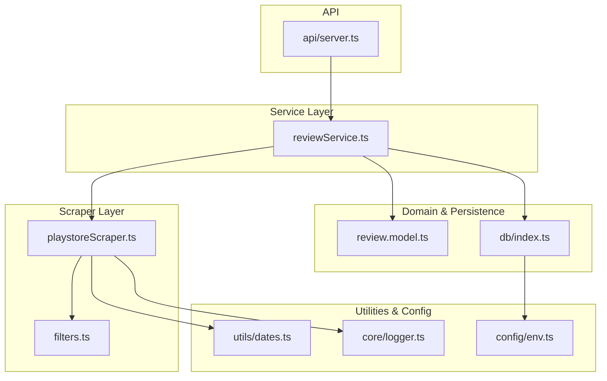
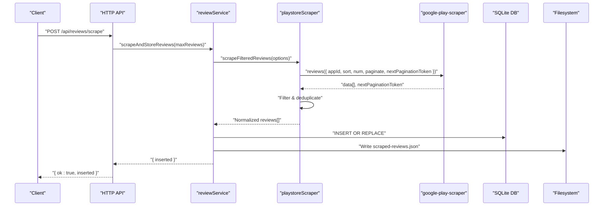
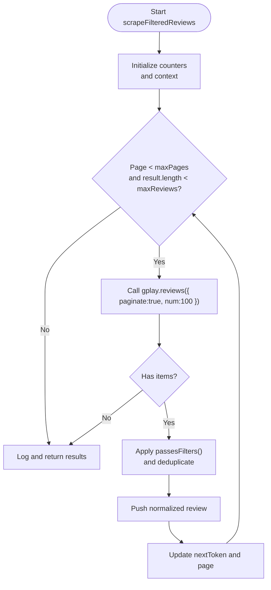
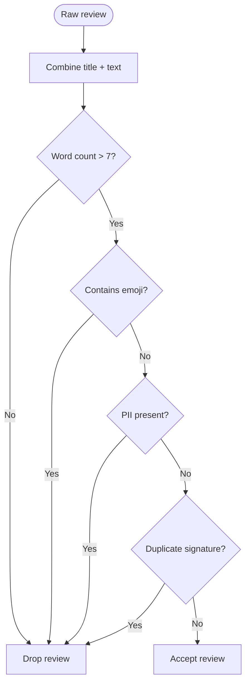
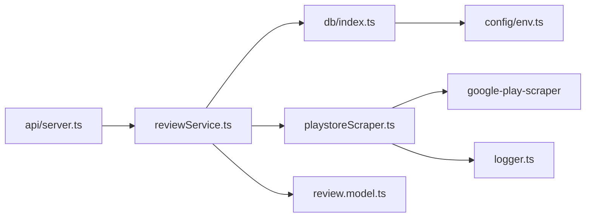

# Core Scraper Module

<cite>
**Referenced Files in This Document**
- [playstoreScraper.ts](file://phase-1/src/scraper/playstoreScraper.ts)
- [filters.ts](file://phase-1/src/scraper/filters.ts)
- [reviewService.ts](file://phase-1/src/services/reviewService.ts)
- [review.model.ts](file://phase-1/src/domain/review.model.ts)
- [server.ts](file://phase-1/src/api/server.ts)
- [index.ts](file://phase-1/src/db/index.ts)
- [dates.ts](file://phase-1/src/utils/dates.ts)
- [logger.ts](file://phase-1/src/core/logger.ts)
- [env.ts](file://phase-1/src/config/env.ts)
- [package.json](file://phase-1/package.json)
- [filters.test.ts](file://phase-1/src/tests/filters.test.ts)
- [integration.scrape.test.ts](file://phase-1/src/tests/integration.scrape.test.ts)
</cite>

## Table of Contents
1. [Introduction](#introduction)
2. [Project Structure](#project-structure)
3. [Core Components](#core-components)
4. [Architecture Overview](#architecture-overview)
5. [Detailed Component Analysis](#detailed-component-analysis)
6. [Dependency Analysis](#dependency-analysis)
7. [Performance Considerations](#performance-considerations)
8. [Troubleshooting Guide](#troubleshooting-guide)
9. [Conclusion](#conclusion)

## Introduction
This document provides comprehensive documentation for the core Google Play Store scraper module used to collect and process Android app reviews for the Groww application. The module implements token-based pagination to systematically traverse review pages, applies robust filtering and cleaning logic to ensure data quality, integrates with the google-play-scraper library for API interactions, and persists results to a local SQLite database. It includes built-in safety limits to prevent excessive pagination, handles error scenarios gracefully, and exposes a simple HTTP API for triggering scrapes and retrieving results.

## Project Structure
The scraper module resides in the Phase 1 codebase under the src/scraper directory and integrates with services, domain models, database, utilities, logging, configuration, and tests. The API server orchestrates scraping requests and serves results.

**Diagram sources**
- [playstoreScraper.ts:1-153](file://phase-1/src/scraper/playstoreScraper.ts#L1-L153)
- [filters.ts:1-59](file://phase-1/src/scraper/filters.ts#L1-L59)
- [reviewService.ts:1-101](file://phase-1/src/services/reviewService.ts#L1-L101)
- [review.model.ts:1-14](file://phase-1/src/domain/review.model.ts#L1-L14)
- [index.ts:1-31](file://phase-1/src/db/index.ts#L1-L31)
- [dates.ts:1-23](file://phase-1/src/utils/dates.ts#L1-L23)
- [logger.ts:1-23](file://phase-1/src/core/logger.ts#L1-L23)
- [env.ts:1-6](file://phase-1/src/config/env.ts#L1-L6)
- [server.ts:1-50](file://phase-1/src/api/server.ts#L1-L50)

**Section sources**
- [playstoreScraper.ts:1-153](file://phase-1/src/scraper/playstoreScraper.ts#L1-L153)
- [reviewService.ts:1-101](file://phase-1/src/services/reviewService.ts#L1-L101)
- [server.ts:1-50](file://phase-1/src/api/server.ts#L1-L50)

## Core Components
- Token-based pagination with google-play-scraper: The scraper uses token-based pagination to iterate through review pages, requesting full batches (typically 100 reviews per page) and continuing until either the target number of reviews is reached or the maximum page limit is hit.
- Filtering and deduplication: Reviews are filtered based on length, presence of emojis, PII (emails, phone numbers), and duplicate signatures. A FilterContext maintains a set of seen signatures to prevent duplicates.
- Cleaning pipeline: Text is minimally cleaned to redact PII while preserving meaningful content for downstream analysis.
- Data model normalization: Reviews are normalized into a consistent domain model with derived fields such as week ranges for temporal grouping.
- Persistence and API: Scraped reviews are persisted to SQLite and exposed via an HTTP endpoint for programmatic access.

**Section sources**
- [playstoreScraper.ts:13-151](file://phase-1/src/scraper/playstoreScraper.ts#L13-L151)
- [filters.ts:16-48](file://phase-1/src/scraper/filters.ts#L16-L48)
- [review.model.ts:1-14](file://phase-1/src/domain/review.model.ts#L1-L14)
- [reviewService.ts:10-75](file://phase-1/src/services/reviewService.ts#L10-L75)

## Architecture Overview
The scraper workflow begins with an HTTP request to trigger a scrape. The service invokes the scraper, which paginates through Google Play Store reviews, applies filters, and returns normalized results. The service persists the results to SQLite and writes a debug JSON file for inspection.

**Diagram sources**
- [server.ts:9-32](file://phase-1/src/api/server.ts#L9-L32)
- [reviewService.ts:10-75](file://phase-1/src/services/reviewService.ts#L10-L75)
- [playstoreScraper.ts:13-151](file://phase-1/src/scraper/playstoreScraper.ts#L13-L151)

## Detailed Component Analysis

### Token-Based Pagination Strategy
- Pagination mechanism: The scraper uses the google-play-scraper paginate option and iterates using nextPaginationToken until either the desired number of reviews is collected or the maximum page limit is reached.
- Batch size and safety: Requests are made with a fixed batch size to maximize throughput while allowing filters to reduce the final count. A hard cap of 50 pages prevents runaway pagination when filters remove most items.
- Termination conditions: Loop exits early if no items are returned or if the next token is absent.

**Diagram sources**
- [playstoreScraper.ts:13-104](file://phase-1/src/scraper/playstoreScraper.ts#L13-L104)

**Section sources**
- [playstoreScraper.ts:25-104](file://phase-1/src/scraper/playstoreScraper.ts#L25-L104)

### Integration with google-play-scraper
- Library usage: The module imports google-play-scraper and uses its reviews method with paginate enabled to obtain token-based pagination support.
- Request parameters: Uses appId, sort order (newest), and a fixed batch size. Pagination continues using nextPaginationToken.
- Response handling: Normalizes responses that may vary in shape (array vs object with data field) and logs pagination metadata.

**Section sources**
- [playstoreScraper.ts:33-46](file://phase-1/src/scraper/playstoreScraper.ts#L33-L46)
- [playstoreScraper.ts:21-24](file://phase-1/src/scraper/playstoreScraper.ts#L21-L24)

### Filtering and Deduplication Pipeline
- Filters applied:
  - Minimum word count threshold to discard very short reviews.
  - Emoji removal to avoid sentiment noise.
  - PII detection for emails and phone numbers (including Indian mobile numbers and generic phone patterns).
  - Duplicate detection using a normalized signature of combined title and text.
- Cleaning: A minimal cleaning pass redacts PII while preserving text for downstream analysis.

**Diagram sources**
- [filters.ts:16-48](file://phase-1/src/scraper/filters.ts#L16-L48)

**Section sources**
- [filters.ts:16-48](file://phase-1/src/scraper/filters.ts#L16-L48)
- [filters.ts:50-57](file://phase-1/src/scraper/filters.ts#L50-L57)

### Data Model and Normalization
- Domain model fields include identifiers, platform, rating, title, text, clean text, creation date, weekly grouping bounds, and optional raw payload for debugging.
- Normalization enriches each review with weekStart and weekEnd derived from createdAt, enabling time-based analytics.

**Section sources**
- [review.model.ts:1-14](file://phase-1/src/domain/review.model.ts#L1-L14)
- [dates.ts:1-23](file://phase-1/src/utils/dates.ts#L1-L23)
- [playstoreScraper.ts:73-88](file://phase-1/src/scraper/playstoreScraper.ts#L73-L88)

### Persistence and Debug Output
- Database schema: Creates a reviews table with primary key on id and an index on week_start for efficient time-based queries.
- Transactional inserts: Uses a transaction wrapper to batch insert normalized reviews.
- Debug JSON: Writes a JSON snapshot of scraped reviews for quick inspection.

**Section sources**
- [index.ts:7-29](file://phase-1/src/db/index.ts#L7-L29)
- [reviewService.ts:19-42](file://phase-1/src/services/reviewService.ts#L19-L42)
- [reviewService.ts:44-68](file://phase-1/src/services/reviewService.ts#L44-L68)

### API Integration
- Endpoints:
  - POST /api/reviews/scrape: Triggers scraping with optional maxReviews parameter.
  - GET /api/reviews/scrape: Same as POST but accepts query parameters.
  - GET /api/reviews: Lists recent reviews with optional limit.
- Error handling: Wraps handlers in try/catch blocks and logs errors.

**Section sources**
- [server.ts:9-43](file://phase-1/src/api/server.ts#L9-L43)

## Dependency Analysis
External dependencies relevant to the scraper module:
- google-play-scraper: Provides token-based pagination and review retrieval.
- better-sqlite3: Handles local SQLite database operations.
- express: Exposes HTTP endpoints for scraping and listing reviews.
- Node.js built-ins: fs and path for file operations.

**Diagram sources**
- [playstoreScraper.ts:1](file://phase-1/src/scraper/playstoreScraper.ts#L1)
- [reviewService.ts:1-7](file://phase-1/src/services/reviewService.ts#L1-L7)
- [server.ts:1-4](file://phase-1/src/api/server.ts#L1-L4)
- [index.ts:1](file://phase-1/src/db/index.ts#L1)
- [env.ts:1-6](file://phase-1/src/config/env.ts#L1-L6)

**Section sources**
- [package.json:13-24](file://phase-1/package.json#L13-L24)

## Performance Considerations
- Batch size tuning: The fixed batch size balances throughput against memory usage. Adjusting num impacts both network requests and post-filtering overhead.
- Filter efficiency: Early rejection of short, emoji-heavy, or PII-containing reviews reduces downstream processing and storage costs.
- Indexing: The week_start index supports efficient time-based queries for reporting and analytics.
- Transaction batching: Using a transaction for inserts minimizes filesystem overhead and improves durability.
- Safety limits: The 50-page cap prevents excessive pagination when filters are strict, reducing runtime and resource consumption.

[No sources needed since this section provides general guidance]

## Troubleshooting Guide
Common issues and resolutions:
- Network failures during scraping:
  - Symptom: Empty results or partial batches.
  - Action: Inspect logs for error messages and verify connectivity. The scraper catches exceptions and logs them; re-run with reduced maxReviews to mitigate timeouts.
- API changes or malformed responses:
  - Symptom: Unexpected response shapes or missing fields.
  - Action: Normalize response handling to support both array and object-with-data forms. Validate fields before accessing and adjust parsing logic accordingly.
- IP blocking or rate limiting:
  - Symptom: Repeated failures or empty results after a few pages.
  - Action: Introduce delays between requests, rotate user agents (if supported), or use proxy rotation. Consider reducing batch sizes and adding jitter to request timing.
- Data quality concerns:
  - Symptom: Too many duplicates or low-quality reviews.
  - Action: Tighten filters (e.g., increase word count threshold) or expand PII regex patterns. Validate deduplication logic and ensure signatures are consistently normalized.
- Storage and persistence errors:
  - Symptom: Failure to write debug JSON or insert records.
  - Action: Verify database file permissions and disk space. Ensure the schema is initialized before inserting. Check transaction boundaries and handle partial failures.

**Section sources**
- [playstoreScraper.ts:146-148](file://phase-1/src/scraper/playstoreScraper.ts#L146-L148)
- [reviewService.ts:44-68](file://phase-1/src/services/reviewService.ts#L44-L68)
- [index.ts:7-29](file://phase-1/src/db/index.ts#L7-L29)

## Conclusion
The core scraper module provides a robust, token-based approach to collecting Google Play Store reviews with strong filtering, deduplication, and persistence capabilities. Its integration with google-play-scraper, SQLite, and Express enables a streamlined workflow from request to stored results. Built-in safety limits and logging facilitate reliable operation, while the modular design supports future enhancements such as retry logic, rate limiting, and advanced anti-blocking strategies.