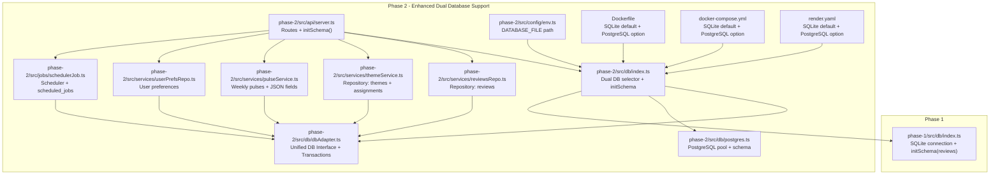
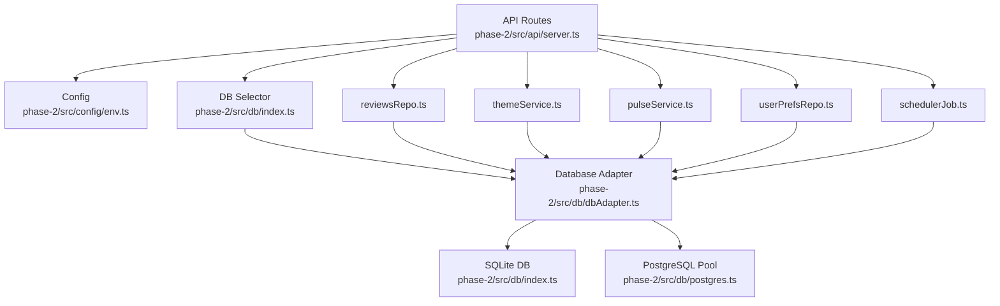
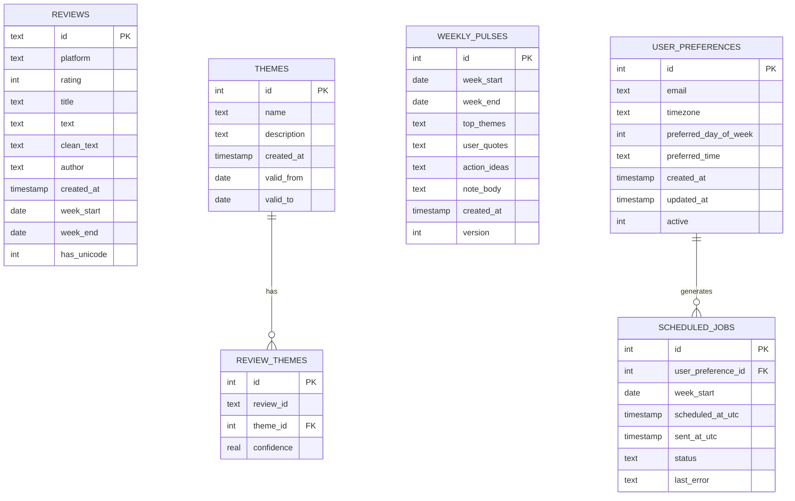
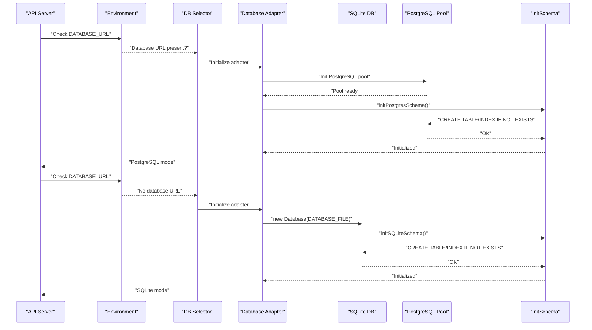
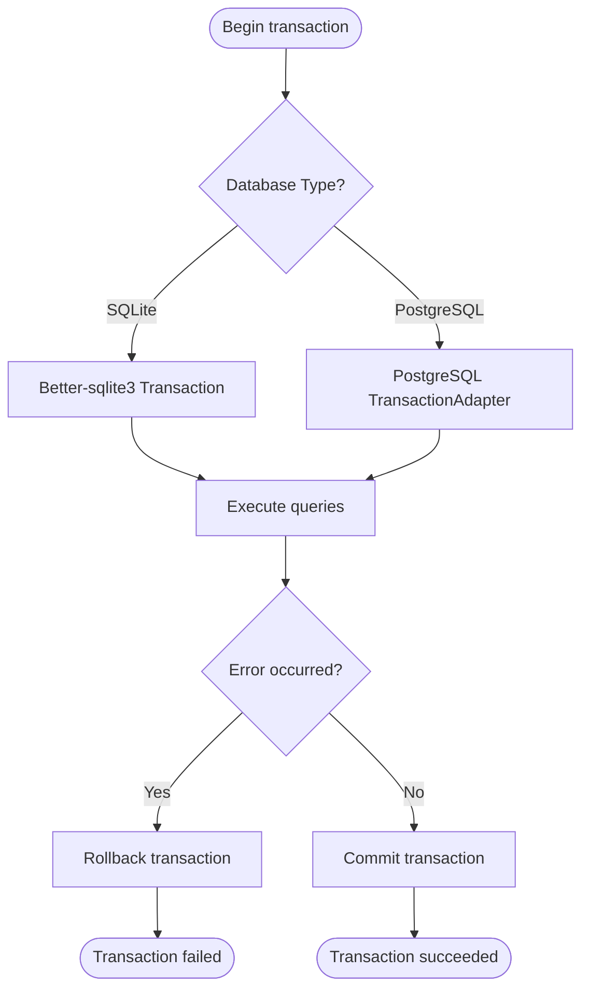
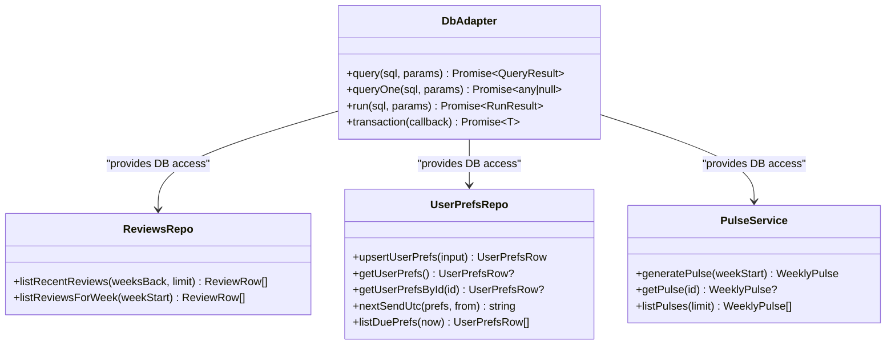
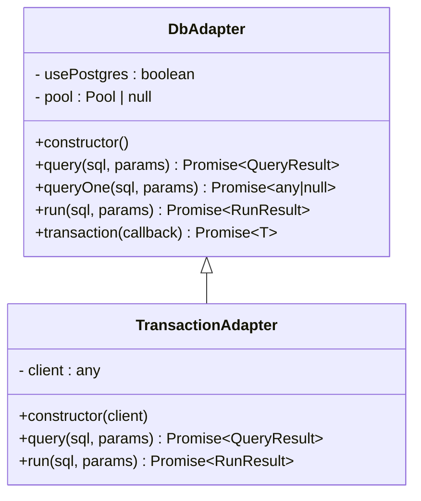
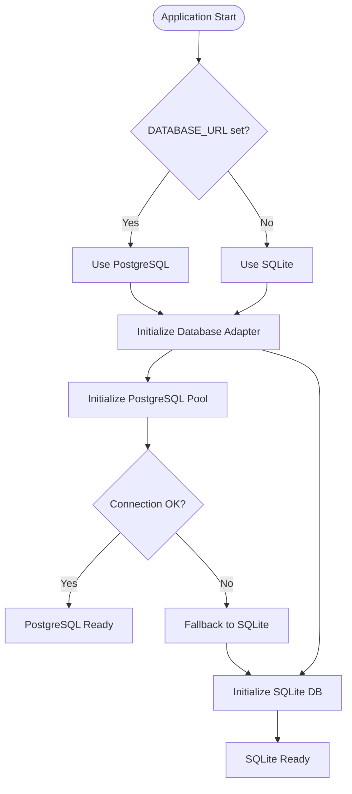
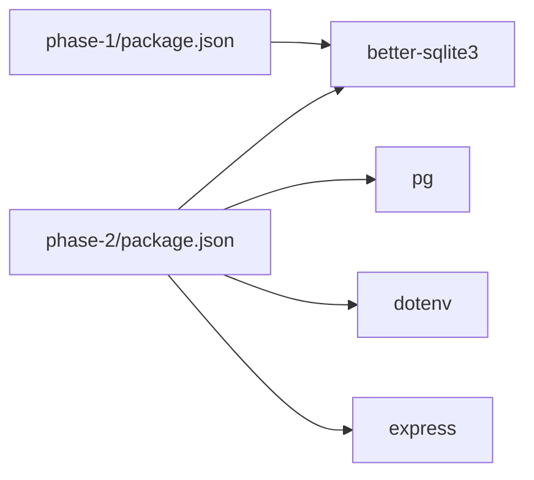

# Database Layer

<cite>
**Referenced Files in This Document**
- [phase-1/src/db/index.ts](file://phase-1/src/db/index.ts)
- [phase-2/src/db/index.ts](file://phase-2/src/db/index.ts)
- [phase-2/src/db/postgres.ts](file://phase-2/src/db/postgres.ts)
- [phase-2/src/db/dbAdapter.ts](file://phase-2/src/db/dbAdapter.ts)
- [phase-2/src/domain/review.ts](file://phase-2/src/domain/review.ts)
- [phase-2/src/services/reviewsRepo.ts](file://phase-2/src/services/reviewsRepo.ts)
- [phase-2/src/services/themeService.ts](file://phase-2/src/services/themeService.ts)
- [phase-2/src/services/pulseService.ts](file://phase-2/src/services/pulseService.ts)
- [phase-2/src/services/userPrefsRepo.ts](file://phase-2/src/services/userPrefsRepo.ts)
- [phase-2/src/jobs/schedulerJob.ts](file://phase-2/src/jobs/schedulerJob.ts)
- [phase-2/src/api/server.ts](file://phase-2/src/api/server.ts)
- [phase-2/src/config/env.ts](file://phase-2/src/config/env.ts)
- [phase-2/package.json](file://phase-2/package.json)
- [phase-1/package.json](file://phase-1/package.json)
- [Dockerfile](file://Dockerfile)
- [phase-2/docker-compose.yml](file://phase-2/docker-compose.yml)
- [phase-2/render.yaml](file://phase-2/render.yaml)
</cite>

## Update Summary
**Changes Made**
- **Added comprehensive PostgreSQL database adapter support**: Introduced dbAdapter.ts providing unified interface for both SQLite and PostgreSQL with automatic placeholder conversion
- **Enhanced transaction support**: Added transaction method with automatic rollback/commit handling for both database types
- **Improved error handling**: Enhanced error handling for database operations with consistent error reporting
- **Database-agnostic operations**: All service layers now use the database adapter for improved consistency and database-agnostic operations
- **Automatic placeholder conversion**: SQLite uses '?' placeholders while PostgreSQL uses '$1', '$2', etc. with automatic conversion

## Table of Contents
1. [Introduction](#introduction)
2. [Project Structure](#project-structure)
3. [Core Components](#core-components)
4. [Architecture Overview](#architecture-overview)
5. [Detailed Component Analysis](#detailed-component-analysis)
6. [Database Adapter Architecture](#database-adapter-architecture)
7. [Dual Database Support](#dual-database-support)
8. [Dependency Analysis](#dependency-analysis)
9. [Performance Considerations](#performance-considerations)
10. [Troubleshooting Guide](#troubleshooting-guide)
11. [Conclusion](#conclusion)
12. [Appendices](#appendices)

## Introduction
This document describes the dual database layer architecture supporting both SQLite and PostgreSQL for data persistence. The system provides automatic database selection based on environment variables, enhanced error handling for empty databases, and seamless migration between database backends. The new database adapter provides a unified interface for database operations with automatic placeholder conversion, transaction support, and enhanced error handling. It covers the schema design for the Review entity and related tables, connection management, transaction handling, repository-style data access patterns, initialization and migration strategies, backup procedures, CRUD and query examples, indexing and optimization strategies, concurrency and integrity handling, and troubleshooting guidance.

## Project Structure
The database layer spans two phases with comprehensive dual database support through the new database adapter:
- Phase 1: Initializes the core reviews table and a primary index.
- Phase 2: Extends the schema with themes, review-themes linkage, weekly pulses, user preferences, and scheduled jobs, and adds repository services for data access with dual database support through the database adapter.



**Diagram sources**
- [phase-2/src/api/server.ts:15-16](file://phase-2/src/api/server.ts#L15-L16)
- [phase-2/src/db/index.ts:1-133](file://phase-2/src/db/index.ts#L1-L133)
- [phase-2/src/db/dbAdapter.ts:1-178](file://phase-2/src/db/dbAdapter.ts#L1-L178)
- [phase-2/src/db/postgres.ts:1-143](file://phase-2/src/db/postgres.ts#L1-L143)
- [phase-1/src/db/index.ts:1-31](file://phase-1/src/db/index.ts#L1-L31)
- [phase-2/src/services/reviewsRepo.ts:1-26](file://phase-2/src/services/reviewsRepo.ts#L1-L26)
- [phase-2/src/services/themeService.ts:1-78](file://phase-2/src/services/themeService.ts#L1-L78)
- [phase-2/src/services/pulseService.ts:1-270](file://phase-2/src/services/pulseService.ts#L1-L270)
- [phase-2/src/services/userPrefsRepo.ts:1-94](file://phase-2/src/services/userPrefsRepo.ts#L1-L94)
- [phase-2/src/jobs/schedulerJob.ts:1-99](file://phase-2/src/jobs/schedulerJob.ts#L1-L99)
- [phase-2/src/config/env.ts:7-10](file://phase-2/src/config/env.ts#L7-L10)
- [Dockerfile:28-31](file://Dockerfile#L28-L31)
- [phase-2/docker-compose.yml:11-14](file://phase-2/docker-compose.yml#L11-L14)
- [phase-2/render.yaml:13-14](file://phase-2/render.yaml#L13-L14)

**Section sources**
- [phase-2/src/api/server.ts:15-16](file://phase-2/src/api/server.ts#L15-L16)
- [phase-2/src/db/index.ts:1-133](file://phase-2/src/db/index.ts#L1-L133)
- [phase-1/src/db/index.ts:1-31](file://phase-1/src/db/index.ts#L1-L31)

## Core Components
- **Database Adapter**:
  - Unified interface for SQLite and PostgreSQL operations with automatic placeholder conversion
  - Supports query, queryOne, run, and transaction methods for both database types
  - Automatic database selection based on DATABASE_URL environment variable
  - Enhanced error handling and consistent return types
- **Dual Database Selection**:
  - Automatic database selection based on `DATABASE_URL` environment variable
  - SQLite as default for local development, PostgreSQL for production
  - Environment-based configuration with fallback to SQLite
- **SQLite connection and initialization**:
  - Phase 1: Creates the reviews table and a primary key index on week_start
  - Phase 2: Adds themes, review_themes, weekly_pulses, user_preferences, and scheduled_jobs, plus supporting indexes
- **PostgreSQL connection and initialization**:
  - Connection pooling with SSL configuration for Render deployment
  - Schema initialization with PostgreSQL-specific data types and constraints
  - Error handling for missing DATABASE_URL environment variable
- **Domain model**:
  - ReviewRow defines the shape of review records returned by repositories
- **Repository services**:
  - All services now use dbAdapter for database operations: reviewsRepo, themeService, pulseService, userPrefsRepo, schedulerJob
  - Enhanced consistency and database-agnostic operations
- **API server**:
  - Calls initSchema at startup and exposes routes for themes, pulses, user preferences, and convenience endpoints

**Section sources**
- [phase-2/src/db/dbAdapter.ts:13-125](file://phase-2/src/db/dbAdapter.ts#L13-L125)
- [phase-2/src/db/index.ts:6-19](file://phase-2/src/db/index.ts#L6-L19)
- [phase-2/src/db/postgres.ts:6-25](file://phase-2/src/db/postgres.ts#L6-L25)
- [phase-1/src/db/index.ts:7-29](file://phase-1/src/db/index.ts#L7-L29)
- [phase-2/src/db/index.ts:21-128](file://phase-2/src/db/index.ts#L21-L128)
- [phase-2/src/db/postgres.ts:27-135](file://phase-2/src/db/postgres.ts#L27-L135)
- [phase-2/src/domain/review.ts:1-12](file://phase-2/src/domain/review.ts#L1-L12)
- [phase-2/src/services/reviewsRepo.ts:1-26](file://phase-2/src/services/reviewsRepo.ts#L1-L26)
- [phase-2/src/services/themeService.ts:1-78](file://phase-2/src/services/themeService.ts#L1-L78)
- [phase-2/src/services/pulseService.ts:1-270](file://phase-2/src/services/pulseService.ts#L1-L270)
- [phase-2/src/services/userPrefsRepo.ts:1-94](file://phase-2/src/services/userPrefsRepo.ts#L1-L94)
- [phase-2/src/jobs/schedulerJob.ts:1-99](file://phase-2/src/jobs/schedulerJob.ts#L1-L99)
- [phase-2/src/api/server.ts:15-16](file://phase-2/src/api/server.ts#L15-L16)

## Architecture Overview
The database layer follows a layered architecture with enhanced dual database support through the database adapter:
- **Database Adapter Layer**: Unified interface for SQLite and PostgreSQL with automatic placeholder conversion and transaction support
- **Data access layer**: better-sqlite3 connection for SQLite and PostgreSQL Pool for PostgreSQL connections
- **Repository services**: encapsulate SQL queries using dbAdapter and expose typed functions
- **Application services**: orchestrate higher-level operations (theme generation, pulse creation, scheduling)
- **API layer**: exposes endpoints that call into services and repositories
- **Environment-based routing**: automatic database selection based on configuration



**Diagram sources**
- [phase-2/src/api/server.ts:15-16](file://phase-2/src/api/server.ts#L15-L16)
- [phase-2/src/config/env.ts:7-10](file://phase-2/src/config/env.ts#L7-L10)
- [phase-2/src/db/index.ts:1-133](file://phase-2/src/db/index.ts#L1-L133)
- [phase-2/src/db/dbAdapter.ts:1-178](file://phase-2/src/db/dbAdapter.ts#L1-L178)
- [phase-2/src/db/postgres.ts:1-143](file://phase-2/src/db/postgres.ts#L1-L143)
- [phase-2/src/services/reviewsRepo.ts:1-26](file://phase-2/src/services/reviewsRepo.ts#L1-L26)
- [phase-2/src/services/themeService.ts:1-78](file://phase-2/src/services/themeService.ts#L1-L78)
- [phase-2/src/services/pulseService.ts:1-270](file://phase-2/src/services/pulseService.ts#L1-L270)
- [phase-2/src/services/userPrefsRepo.ts:1-94](file://phase-2/src/services/userPrefsRepo.ts#L1-L94)
- [phase-2/src/jobs/schedulerJob.ts:1-99](file://phase-2/src/jobs/schedulerJob.ts#L1-L99)

## Detailed Component Analysis

### Database Schema Design
The schema consists of five core tables with indexes and constraints, supporting both SQLite and PostgreSQL:

#### Reviews (Phase 1)
- **Fields**: id (TEXT, PK), platform (TEXT), rating (INTEGER), title (TEXT), text (TEXT), clean_text (TEXT), author (TEXT), created_at (TEXT for SQLite, TIMESTAMP for PostgreSQL), week_start (TEXT for SQLite, DATE for PostgreSQL), week_end (TEXT for SQLite, DATE for PostgreSQL), has_unicode (INTEGER)
- **Index**: idx_reviews_week_start on week_start
- **Purpose**: Stores raw and cleaned review data with weekly grouping metadata

#### Themes (Phase 2)
- **Fields**: id (INTEGER for SQLite, SERIAL for PostgreSQL, PK, AUTOINCREMENT), name (TEXT, NOT NULL), description (TEXT, NOT NULL), created_at (TEXT for SQLite, TIMESTAMP for PostgreSQL, NOT NULL, DEFAULT CURRENT_TIMESTAMP), valid_from (TEXT for SQLite, DATE for PostgreSQL), valid_to (TEXT for SQLite, DATE for PostgreSQL)
- **Index**: idx_themes_name_window (unique on name, valid_from, valid_to)
- **Purpose**: Stores curated themes with optional validity windows

#### Review_Themes (Phase 2)
- **Fields**: id (INTEGER for SQLite, SERIAL for PostgreSQL, PK, AUTOINCREMENT), review_id (TEXT, NOT NULL), theme_id (INTEGER, NOT NULL), confidence (REAL)
- **Constraints**: UNIQUE(review_id, theme_id), FOREIGN KEY(theme_id) references themes(id)
- **Index**: idx_review_themes_review_id on review_id
- **Purpose**: Links reviews to themes with optional confidence score

#### Weekly_Pulses (Phase 2)
- **Fields**: id (INTEGER for SQLite, SERIAL for PostgreSQL, PK, AUTOINCREMENT), week_start (TEXT for SQLite, DATE for PostgreSQL, NOT NULL), week_end (TEXT for SQLite, DATE for PostgreSQL, NOT NULL), top_themes (TEXT, NOT NULL), user_quotes (TEXT, NOT NULL), action_ideas (TEXT, NOT NULL), note_body (TEXT, NOT NULL), created_at (TEXT for SQLite, TIMESTAMP for PostgreSQL, NOT NULL, DEFAULT CURRENT_TIMESTAMP), version (INTEGER, NOT NULL DEFAULT 1)
- **Index**: idx_weekly_pulses_week_version (unique on week_start, version)
- **Purpose**: Stores generated weekly insights as JSON blobs

#### User_Preferences (Phase 2)
- **Fields**: id (INTEGER for SQLite, SERIAL for PostgreSQL, PK, AUTOINCREMENT), email (TEXT, NOT NULL), timezone (TEXT, NOT NULL), preferred_day_of_week (INTEGER, NOT NULL), preferred_time (TEXT, NOT NULL), created_at (TEXT for SQLite, TIMESTAMP for PostgreSQL, NOT NULL, DEFAULT CURRENT_TIMESTAMP), updated_at (TEXT for SQLite, TIMESTAMP for PostgreSQL, NOT NULL, DEFAULT CURRENT_TIMESTAMP), active (INTEGER, NOT NULL DEFAULT 1)
- **Purpose**: Stores user's email and scheduling preferences; only one active row is maintained

#### Scheduled_Jobs (Phase 2)
- **Fields**: id (INTEGER for SQLite, SERIAL for PostgreSQL, PK, AUTOINCREMENT), user_preference_id (INTEGER, NOT NULL), week_start (TEXT for SQLite, DATE for PostgreSQL, NOT NULL), scheduled_at_utc (TEXT for SQLite, TIMESTAMP for PostgreSQL, NOT NULL), sent_at_utc (TEXT for SQLite, TIMESTAMP for PostgreSQL), status (TEXT, NOT NULL), last_error (TEXT)
- **Index**: idx_scheduled_jobs_status_time on (status, scheduled_at_utc)
- **Constraints**: FOREIGN KEY(user_preference_id) references user_preferences(id)
- **Purpose**: Tracks scheduled job execution state



**Diagram sources**
- [phase-1/src/db/index.ts:9-21](file://phase-1/src/db/index.ts#L9-L21)
- [phase-2/src/db/index.ts:24-106](file://phase-2/src/db/index.ts#L24-L106)
- [phase-2/src/db/postgres.ts:30-123](file://phase-2/src/db/postgres.ts#L30-L123)

**Section sources**
- [phase-1/src/db/index.ts:9-21](file://phase-1/src/db/index.ts#L9-L21)
- [phase-2/src/db/index.ts:24-106](file://phase-2/src/db/index.ts#L24-L106)
- [phase-2/src/db/postgres.ts:30-123](file://phase-2/src/db/postgres.ts#L30-L123)

### Connection Management and Initialization
- **Connection Strategy**:
  - Automatic database selection based on `DATABASE_URL` environment variable
  - SQLite as default for local development, PostgreSQL for production environments
  - Graceful fallback to SQLite when DATABASE_URL is not set
- **Database Adapter**:
  - Provides unified interface for both SQLite and PostgreSQL operations
  - Automatically converts '?' placeholders to '$1', '$2', etc. for PostgreSQL
  - Supports transaction operations with automatic rollback/commit handling
- **SQLite Initialization**:
  - better-sqlite3 client is instantiated with the DATABASE_FILE path from environment configuration
  - Phase 1: Creates reviews table and index
  - Phase 2: Creates themes, review_themes, weekly_pulses, user_preferences, scheduled_jobs, and associated indexes
- **PostgreSQL Initialization**:
  - Connection pool created with DATABASE_URL environment variable
  - SSL configuration enabled for Render deployment compatibility
  - Schema initialization with PostgreSQL-specific data types and constraints
  - Error handling for missing DATABASE_URL environment variable
- **Startup Process**:
  - API server calls initSchema at startup to ensure schema readiness
  - Automatic database detection and initialization based on environment



**Diagram sources**
- [phase-2/src/db/index.ts:6-19](file://phase-2/src/db/index.ts#L6-L19)
- [phase-2/src/db/dbAdapter.ts:17-22](file://phase-2/src/db/dbAdapter.ts#L17-L22)
- [phase-2/src/db/postgres.ts:6-25](file://phase-2/src/db/postgres.ts#L6-L25)
- [phase-2/src/db/index.ts:21-128](file://phase-2/src/db/index.ts#L21-L128)
- [phase-2/src/db/postgres.ts:27-135](file://phase-2/src/db/postgres.ts#L27-L135)

**Section sources**
- [phase-2/src/db/index.ts:6-19](file://phase-2/src/db/index.ts#L6-L19)
- [phase-2/src/db/dbAdapter.ts:17-22](file://phase-2/src/db/dbAdapter.ts#L17-L22)
- [phase-2/src/db/postgres.ts:6-25](file://phase-2/src/db/postgres.ts#L6-L25)
- [phase-2/src/db/index.ts:21-128](file://phase-2/src/db/index.ts#L21-L128)
- [phase-2/src/db/postgres.ts:27-135](file://phase-2/src/db/postgres.ts#L27-L135)
- [phase-2/src/api/server.ts:15-16](file://phase-2/src/api/server.ts#L15-L16)

### Transaction Handling
- **Enhanced Transaction Support**: The database adapter provides comprehensive transaction handling for both database types
- **SQLite transactions**: Better-sqlite3 provides native transaction support with rollback capabilities
- **PostgreSQL transactions**: Managed through connection pooling with automatic transaction handling via TransactionAdapter
- **Automatic Placeholder Conversion**: Transactions handle automatic conversion of '?' to '$' placeholders for PostgreSQL
- **Consistent Error Handling**: Both database types provide consistent error handling and rollback semantics



**Diagram sources**
- [phase-2/src/db/dbAdapter.ts:102-124](file://phase-2/src/db/dbAdapter.ts#L102-L124)
- [phase-2/src/db/dbAdapter.ts:130-174](file://phase-2/src/db/dbAdapter.ts#L130-L174)

**Section sources**
- [phase-2/src/db/dbAdapter.ts:102-124](file://phase-2/src/db/dbAdapter.ts#L102-L124)
- [phase-2/src/db/dbAdapter.ts:130-174](file://phase-2/src/db/dbAdapter.ts#L130-L174)

### Repository Pattern Implementation
- **Enhanced Repository Services**:
  - All services now use dbAdapter for database operations: reviewsRepo, themeService, pulseService, userPrefsRepo, schedulerJob
  - Consistent interface across both database types with automatic placeholder conversion
  - Improved error handling and transaction support
- **reviewsRepo**:
  - listRecentReviews: filters reviews by created_at within a rolling window and sorts by recency
  - listReviewsForWeek: filters reviews by week_start
- **userPrefsRepo**:
  - upsertUserPrefs: deactivates existing active rows and inserts a new active row
  - getUserPrefs/getUserPrefsById: retrieve active or specific preferences
  - nextSendUtc/listDuePrefs: compute next send time and filter due preferences
- **pulseService**:
  - getWeekThemeStats: aggregates per-theme stats joining themes, review_themes, and reviews
  - generatePulse: orchestrates theme stats, quotes, action ideas, note generation, and persistence
  - getPulse/listPulses: fetches stored weekly pulses and deserializes JSON fields



**Diagram sources**
- [phase-2/src/db/dbAdapter.ts:13-125](file://phase-2/src/db/dbAdapter.ts#L13-L125)
- [phase-2/src/services/reviewsRepo.ts:4-24](file://phase-2/src/services/reviewsRepo.ts#L4-L24)
- [phase-2/src/services/userPrefsRepo.ts:21-94](file://phase-2/src/services/userPrefsRepo.ts#L21-L94)
- [phase-2/src/services/pulseService.ts:179-241](file://phase-2/src/services/pulseService.ts#L179-L241)

**Section sources**
- [phase-2/src/db/dbAdapter.ts:13-125](file://phase-2/src/db/dbAdapter.ts#L13-L125)
- [phase-2/src/services/reviewsRepo.ts:4-24](file://phase-2/src/services/reviewsRepo.ts#L4-L24)
- [phase-2/src/services/userPrefsRepo.ts:21-94](file://phase-2/src/services/userPrefsRepo.ts#L21-L94)
- [phase-2/src/services/pulseService.ts:59-74](file://phase-2/src/services/pulseService.ts#L59-L74)

### Migration Strategies
- **Incremental schema evolution**:
  - Phase 1 initializes the reviews table and index
  - Phase 2 extends the schema with new tables and indexes
- **Backward compatibility**:
  - Phase 2 defaults to using the Phase 1 database file by default, enabling seamless extension without breaking prior data
  - Automatic database selection ensures smooth migration between SQLite and PostgreSQL
- **Database Adapter Benefits**:
  - Seamless migration between database types without code changes
  - Consistent API across both database implementations
  - Automatic placeholder conversion for SQL queries
- **Best practices**:
  - Add indexes for frequently filtered/sorted columns
  - Use unique constraints to prevent duplicates
  - Normalize joins (themes ↔ review_themes ↔ reviews) to avoid duplication
  - Environment-based configuration for easy deployment switching

**Section sources**
- [phase-2/src/config/env.ts:8-10](file://phase-2/src/config/env.ts#L8-L10)
- [phase-1/src/db/index.ts:7-29](file://phase-1/src/db/index.ts#L7-L29)
- [phase-2/src/db/index.ts:7-19](file://phase-2/src/db/index.ts#L7-L19)
- [phase-2/src/db/index.ts:21-128](file://phase-2/src/db/index.ts#L21-L128)

### Backup Procedures
- **File-level backup**:
  - Copy the DATABASE_FILE to a safe location regularly
  - For PostgreSQL, use pg_dump for logical backups
- **Integrity checks**:
  - Use PRAGMA integrity_check and PRAGMA quick_check periodically for SQLite
  - Use PostgreSQL's built-in integrity checks for PostgreSQL
- **WAL mode considerations**:
  - Consider enabling WAL mode for concurrent reads/writes if needed; ensure backups occur during maintenance windows
- **Environment-specific backups**:
  - Automated backup strategies based on database type selection

### CRUD Operations and Examples
- **Create**
  - Upsert themes: insert multiple themes atomically with transaction support
  - Upsert user preferences: deactivates previous active rows and inserts a new one
  - Generate and persist weekly pulse: computes stats, quotes, ideas, and writes to weekly_pulses
- **Read**
  - List recent reviews within a rolling time window
  - List reviews for a specific week
  - Fetch latest themes
  - Retrieve active user preferences and due preferences
  - Get a specific weekly pulse by ID
- **Update**
  - Update scheduled_jobs status and timestamps upon completion or failure
- **Delete**
  - Not exposed in current schema; consider soft-deletion patterns if needed

**Section sources**
- [phase-2/src/services/themeService.ts:51-65](file://phase-2/src/services/themeService.ts#L51-L65)
- [phase-2/src/services/userPrefsRepo.ts:21-43](file://phase-2/src/services/userPrefsRepo.ts#L21-L43)
- [phase-2/src/services/pulseService.ts:222-245](file://phase-2/src/services/pulseService.ts#L222-L245)
- [phase-2/src/services/reviewsRepo.ts:4-24](file://phase-2/src/services/reviewsRepo.ts#L4-L24)
- [phase-2/src/services/userPrefsRepo.ts:50-56](file://phase-2/src/services/userPrefsRepo.ts#L50-L56)
- [phase-2/src/jobs/schedulerJob.ts:20-41](file://phase-2/src/jobs/schedulerJob.ts#L20-L41)

### Query Optimization and Indexing
- **Indexes currently defined**:
  - reviews: idx_reviews_week_start
  - themes: idx_themes_name_window (unique)
  - review_themes: idx_review_themes_review_id
  - weekly_pulses: idx_weekly_pulses_week_version (unique)
  - scheduled_jobs: idx_scheduled_jobs_status_time
- **Recommendations**:
  - Add composite indexes for frequent joins and filters (e.g., reviews(week_start, created_at))
  - Monitor slow queries with EXPLAIN QUERY PLAN and add targeted indexes
  - Consider partial indexes for filtered subsets (e.g., active user preferences)
  - Database-specific optimizations based on selected backend

**Section sources**
- [phase-1/src/db/index.ts:23-26](file://phase-1/src/db/index.ts#L23-L26)
- [phase-2/src/db/index.ts:19-22](file://phase-2/src/db/index.ts#L19-L22)
- [phase-2/src/db/index.ts:35-38](file://phase-2/src/db/index.ts#L35-L38)
- [phase-2/src/db/index.ts:54-57](file://phase-2/src/db/index.ts#L54-L57)
- [phase-2/src/db/index.ts:85-88](file://phase-2/src/db/index.ts#L85-L88)

### Concurrency Handling and Data Integrity
- **Enhanced Concurrency Support**:
  - better-sqlite3 is synchronous; use worker threads or separate processes for heavy workloads
  - PostgreSQL provides robust connection pooling for concurrent access
  - Database adapter handles transaction isolation and consistency
- **Integrity**:
  - Unique constraints on (name, valid_from, valid_to) and (review_id, theme_id) prevent duplicates
  - Foreign keys maintain referential integrity between themes and review_themes, and between user_preferences and scheduled_jobs
  - Active-row enforcement via upsert ensures only one active preference
- **Database-specific considerations**:
  - SQLite: synchronous operations, WAL mode for concurrent reads
  - PostgreSQL: connection pooling, ACID compliance, advanced indexing

**Section sources**
- [phase-2/src/db/index.ts:30-32](file://phase-2/src/db/index.ts#L30-L32)
- [phase-2/src/db/index.ts:81-82](file://phase-2/src/db/index.ts#L81-L82)
- [phase-2/src/services/userPrefsRepo.ts:24-25](file://phase-2/src/services/userPrefsRepo.ts#L24-L25)

## Database Adapter Architecture

### Unified Database Interface
The database adapter provides a consistent interface for both SQLite and PostgreSQL operations:



**Diagram sources**
- [phase-2/src/db/dbAdapter.ts:13-125](file://phase-2/src/db/dbAdapter.ts#L13-L125)
- [phase-2/src/db/dbAdapter.ts:130-174](file://phase-2/src/db/dbAdapter.ts#L130-L174)

### Automatic Placeholder Conversion
The database adapter automatically converts SQL placeholders between database types:

- **SQLite**: Uses '?' placeholders for parameters
- **PostgreSQL**: Uses '$1', '$2', etc. for parameters
- **Automatic Conversion**: The adapter detects '?' characters and replaces them with appropriate PostgreSQL placeholders

**Section sources**
- [phase-2/src/db/dbAdapter.ts:28-52](file://phase-2/src/db/dbAdapter.ts#L28-L52)
- [phase-2/src/db/dbAdapter.ts:138-151](file://phase-2/src/db/dbAdapter.ts#L138-L151)

### Transaction Support
The database adapter provides comprehensive transaction support:

- **SQLite Transactions**: Native better-sqlite3 transaction support with rollback capabilities
- **PostgreSQL Transactions**: Managed through connection pooling with automatic transaction handling
- **Consistent API**: Same transaction interface for both database types
- **Error Handling**: Automatic rollback on errors with consistent error reporting

**Section sources**
- [phase-2/src/db/dbAdapter.ts:102-124](file://phase-2/src/db/dbAdapter.ts#L102-L124)
- [phase-2/src/db/dbAdapter.ts:130-174](file://phase-2/src/db/dbAdapter.ts#L130-L174)

## Dual Database Support

### Automatic Database Selection
The system automatically selects the appropriate database backend based on environment configuration:



**Diagram sources**
- [phase-2/src/db/index.ts:6-19](file://phase-2/src/db/index.ts#L6-L19)
- [phase-2/src/db/dbAdapter.ts:17-22](file://phase-2/src/db/dbAdapter.ts#L17-L22)
- [phase-2/src/db/postgres.ts:6-25](file://phase-2/src/db/postgres.ts#L6-L25)

### PostgreSQL Configuration
- **Connection Pooling**: Uses pg.Pool for connection management with SSL configuration
- **SSL Configuration**: Enabled for Render deployment compatibility with `rejectUnauthorized: false`
- **Error Handling**: Comprehensive error logging and graceful fallback mechanisms
- **Data Types**: PostgreSQL-specific data types (SERIAL, DATE, TIMESTAMP) for optimal performance

### SQLite Configuration
- **Local Development**: Default database for local development and testing
- **File-based Storage**: Simple file-based database with automatic schema initialization
- **Performance**: Optimized for single-threaded access and local development scenarios

### Deployment Configuration
- **Docker**: Default SQLite configuration with optional PostgreSQL environment variables
- **Render**: Default SQLite configuration with PostgreSQL deployment option
- **docker-compose**: SQLite default with PostgreSQL environment variable support

**Section sources**
- [phase-2/src/db/index.ts:6-19](file://phase-2/src/db/index.ts#L6-L19)
- [phase-2/src/db/dbAdapter.ts:17-22](file://phase-2/src/db/dbAdapter.ts#L17-L22)
- [phase-2/src/db/postgres.ts:6-25](file://phase-2/src/db/postgres.ts#L6-L25)
- [phase-2/src/db/postgres.ts:13-18](file://phase-2/src/db/postgres.ts#L13-L18)
- [Dockerfile:28-31](file://Dockerfile#L28-L31)
- [phase-2/docker-compose.yml:11-14](file://phase-2/docker-compose.yml#L11-L14)
- [phase-2/render.yaml:13-14](file://phase-2/render.yaml#L13-L14)

## Dependency Analysis
External dependencies relevant to the database layer:
- **better-sqlite3**: SQLite driver used for connection and prepared statements
- **pg**: PostgreSQL driver for connection pooling and database operations
- **dotenv**: loads environment variables including DATABASE_FILE and DATABASE_URL
- **express**: API server that triggers schema initialization and routes



**Diagram sources**
- [phase-2/package.json:13-22](file://phase-2/package.json#L13-L22)
- [phase-1/package.json:13-17](file://phase-1/package.json#L13-L17)

**Section sources**
- [phase-2/package.json:13-22](file://phase-2/package.json#L13-L22)
- [phase-1/package.json:13-17](file://phase-1/package.json#L13-L17)

## Performance Considerations
- **Prepared statements**: Reuse compiled statements for repeated queries to reduce parsing overhead
- **Indexes**: Ensure appropriate indexes for filters and joins; monitor query plans
- **JSON fields**: weekly_pulses stores arrays/objects as JSON; consider normalization if queries become complex
- **Batch operations**: Use transactions for bulk inserts (e.g., themes)
- **I/O**: Place DATABASE_FILE on fast storage; avoid network filesystems for SQLite
- **Connection pooling**: PostgreSQL uses connection pooling for optimal resource utilization
- **Database selection**: Automatic selection based on environment for optimal performance
- **Memory usage**: SQLite for local development, PostgreSQL for production scalability
- **Database Adapter Benefits**: Consistent performance characteristics across database types

## Troubleshooting Guide
- **Schema not initialized**:
  - Ensure initSchema is called at startup and DATABASE_FILE path is correct
  - For PostgreSQL, verify DATABASE_URL environment variable is set
- **Missing DATABASE_FILE**:
  - Verify .env configuration and path resolution
  - Check Docker environment variables for database file path
- **PostgreSQL connection issues**:
  - Verify DATABASE_URL format and accessibility
  - Check SSL configuration for Render deployment
  - Ensure PostgreSQL server is reachable and accepting connections
- **Database Adapter errors**:
  - Check for proper initialization of dbAdapter singleton
  - Verify automatic placeholder conversion is working correctly
  - Ensure transaction boundaries are properly defined
- **Integrity errors**:
  - Check unique constraints and foreign keys; validate inputs before inserts
  - Verify database type compatibility for data types
- **Slow queries**:
  - Add missing indexes; rewrite queries to leverage existing indexes
  - Monitor database-specific performance metrics
- **Scheduler not starting**:
  - Confirm GROQ_API_KEY presence; scheduler starts only when enabled
  - Check database connectivity for scheduled job operations

**Section sources**
- [phase-2/src/api/server.ts:15-16](file://phase-2/src/api/server.ts#L15-L16)
- [phase-2/src/config/env.ts:7-10](file://phase-2/src/config/env.ts#L7-L10)
- [phase-2/src/db/index.ts:30-32](file://phase-2/src/db/index.ts#L30-L32)
- [phase-2/src/db/index.ts:81-82](file://phase-2/src/db/index.ts#L81-L82)
- [phase-2/src/db/postgres.ts:9-11](file://phase-2/src/db/postgres.ts#L9-L11)
- [phase-2/src/api/server.ts:257-262](file://phase-2/src/api/server.ts#L257-L262)

## Conclusion
The database layer employs a robust dual database architecture supporting both SQLite and PostgreSQL with automatic selection based on environment variables. The new database adapter provides a unified interface for database operations with automatic placeholder conversion, transaction support, and enhanced error handling. The system provides enhanced error handling for empty databases, seamless migration between database backends, and maintains clear separation of concerns via repository services. Phase 2 extends Phase 1's schema to support theme generation, assignment, and weekly pulse delivery, while maintaining data integrity through constraints and indexes. The database adapter ensures consistent API across both database types, enabling seamless migration and improved maintainability. The design supports incremental evolution, efficient querying, operational reliability, and flexible deployment options.

## Appendices

### Appendix A: Environment Configuration
- **DATABASE_FILE**: Path to the SQLite database file. Defaults to the Phase 1 database path in Phase 2 for continuity
- **DATABASE_URL**: PostgreSQL connection string for production deployments
- **Automatic selection**: DATABASE_URL determines database backend, with SQLite as fallback

**Section sources**
- [phase-2/src/config/env.ts:8-10](file://phase-2/src/config/env.ts#L8-L10)
- [phase-2/src/db/index.ts:6-7](file://phase-2/src/db/index.ts#L6-L7)

### Appendix B: Deployment Configuration
- **Docker**: Default SQLite configuration with optional PostgreSQL environment variables
- **Render**: Default SQLite configuration with PostgreSQL deployment option
- **docker-compose**: SQLite default with PostgreSQL environment variable support

**Section sources**
- [Dockerfile:28-31](file://Dockerfile#L28-L31)
- [phase-2/docker-compose.yml:11-14](file://phase-2/docker-compose.yml#L11-L14)
- [phase-2/render.yaml:13-14](file://phase-2/render.yaml#L13-L14)

### Appendix C: Database Adapter Usage Examples
The database adapter can be used in any service layer:

```typescript
import { dbAdapter } from '../db/dbAdapter';

// Query with parameters
const result = await dbAdapter.query(
  'SELECT * FROM users WHERE age > ? AND city = ?',
  [25, 'New York']
);

// Single row query
const user = await dbAdapter.queryOne(
  'SELECT * FROM users WHERE id = ?',
  [userId]
);

// Insert operation
const result = await dbAdapter.run(
  'INSERT INTO users (name, email) VALUES (?, ?)',
  [name, email]
);

// Transaction with multiple operations
await dbAdapter.transaction(async (adapter) => {
  await adapter.run('UPDATE accounts SET balance = balance - ?', [amount]);
  await adapter.run('UPDATE accounts SET balance = balance + ?', [amount]);
});
```

**Section sources**
- [phase-2/src/db/dbAdapter.ts:28-97](file://phase-2/src/db/dbAdapter.ts#L28-L97)
- [phase-2/src/db/dbAdapter.ts:102-124](file://phase-2/src/db/dbAdapter.ts#L102-L124)