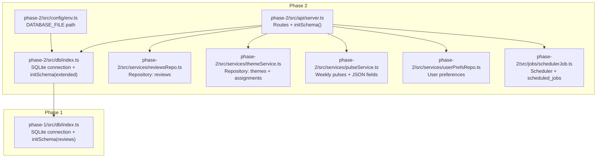
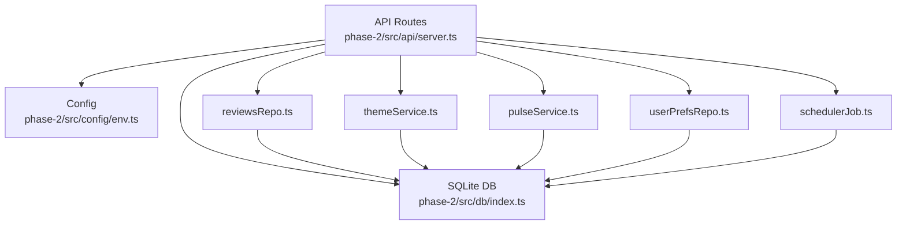
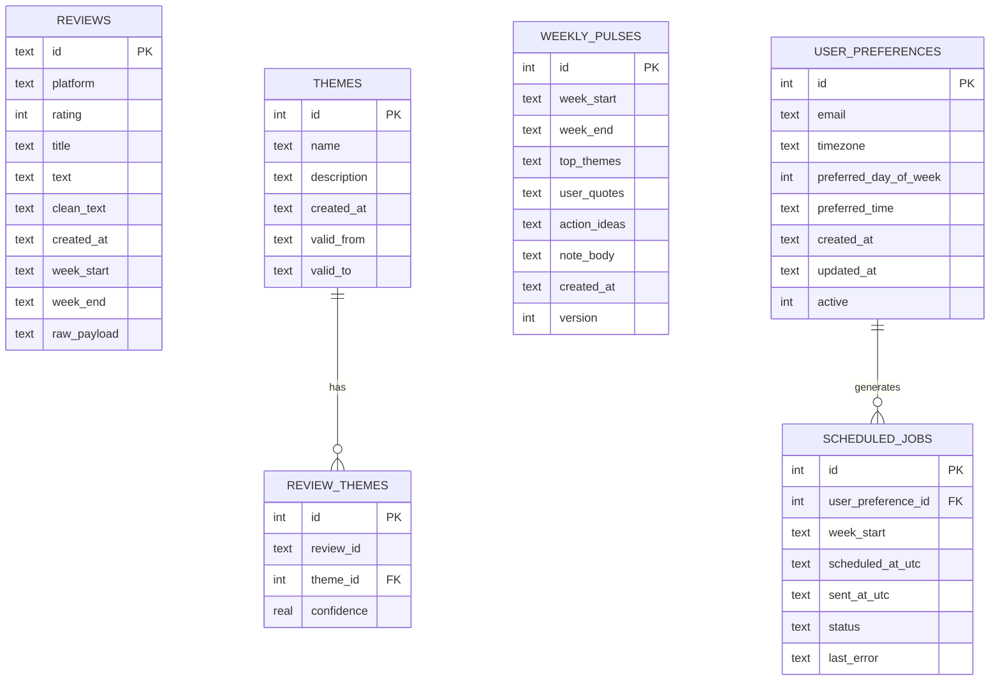
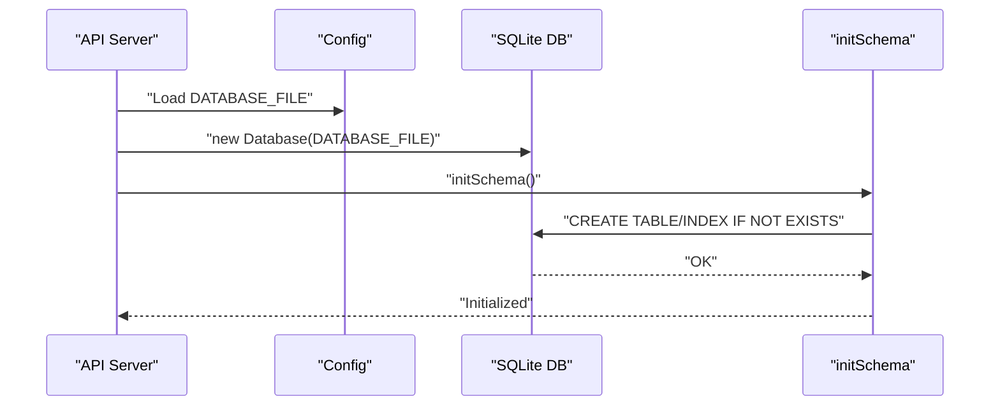
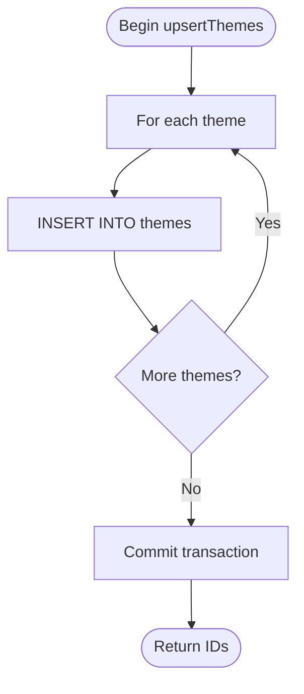
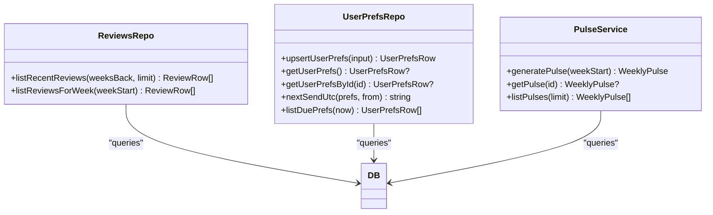
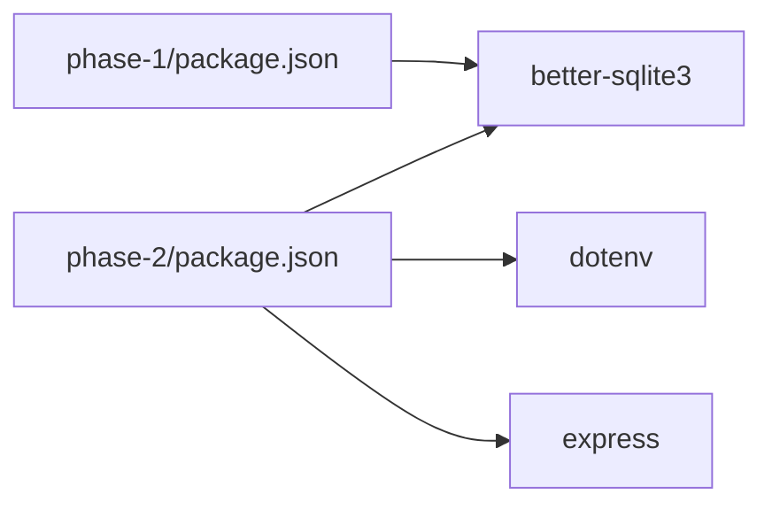

# Database Layer

<cite>
**Referenced Files in This Document**
- [phase-1/src/db/index.ts](file://phase-1/src/db/index.ts)
- [phase-2/src/db/index.ts](file://phase-2/src/db/index.ts)
- [phase-2/src/domain/review.ts](file://phase-2/src/domain/review.ts)
- [phase-2/src/services/reviewsRepo.ts](file://phase-2/src/services/reviewsRepo.ts)
- [phase-2/src/services/themeService.ts](file://phase-2/src/services/themeService.ts)
- [phase-2/src/services/pulseService.ts](file://phase-2/src/services/pulseService.ts)
- [phase-2/src/services/userPrefsRepo.ts](file://phase-2/src/services/userPrefsRepo.ts)
- [phase-2/src/jobs/schedulerJob.ts](file://phase-2/src/jobs/schedulerJob.ts)
- [phase-2/src/api/server.ts](file://phase-2/src/api/server.ts)
- [phase-2/src/config/env.ts](file://phase-2/src/config/env.ts)
- [phase-2/package.json](file://phase-2/package.json)
- [phase-1/package.json](file://phase-1/package.json)
</cite>

## Table of Contents
1. [Introduction](#introduction)
2. [Project Structure](#project-structure)
3. [Core Components](#core-components)
4. [Architecture Overview](#architecture-overview)
5. [Detailed Component Analysis](#detailed-component-analysis)
6. [Dependency Analysis](#dependency-analysis)
7. [Performance Considerations](#performance-considerations)
8. [Troubleshooting Guide](#troubleshooting-guide)
9. [Conclusion](#conclusion)
10. [Appendices](#appendices)

## Introduction
This document describes the SQLite database layer and data persistence architecture used in the project. It covers the schema design for the Review entity and related tables, connection management, transaction handling, repository-style data access patterns, initialization and migration strategies, backup procedures, CRUD and query examples, indexing and optimization strategies, concurrency and integrity handling, and troubleshooting guidance.

## Project Structure
The database layer spans two phases:
- Phase 1: Initializes the core reviews table and a primary index.
- Phase 2: Extends the schema with themes, review-themes linkage, weekly pulses, user preferences, and scheduled jobs, and adds repository services for data access.

**Diagram sources**
- [phase-2/src/api/server.ts:15-16](file://phase-2/src/api/server.ts#L15-L16)
- [phase-2/src/db/index.ts:1-93](file://phase-2/src/db/index.ts#L1-L93)
- [phase-1/src/db/index.ts:1-31](file://phase-1/src/db/index.ts#L1-L31)
- [phase-2/src/services/reviewsRepo.ts:1-26](file://phase-2/src/services/reviewsRepo.ts#L1-L26)
- [phase-2/src/services/themeService.ts:1-68](file://phase-2/src/services/themeService.ts#L1-L68)
- [phase-2/src/services/pulseService.ts:1-265](file://phase-2/src/services/pulseService.ts#L1-L265)
- [phase-2/src/services/userPrefsRepo.ts:1-95](file://phase-2/src/services/userPrefsRepo.ts#L1-L95)
- [phase-2/src/jobs/schedulerJob.ts:1-98](file://phase-2/src/jobs/schedulerJob.ts#L1-L98)
- [phase-2/src/config/env.ts:7-10](file://phase-2/src/config/env.ts#L7-L10)

**Section sources**
- [phase-2/src/api/server.ts:15-16](file://phase-2/src/api/server.ts#L15-L16)
- [phase-2/src/db/index.ts:1-93](file://phase-2/src/db/index.ts#L1-L93)
- [phase-1/src/db/index.ts:1-31](file://phase-1/src/db/index.ts#L1-L31)

## Core Components
- SQLite connection and initialization:
  - Phase 1: Creates the reviews table and a primary key index on week_start.
  - Phase 2: Adds themes, review_themes, weekly_pulses, user_preferences, and scheduled_jobs, plus supporting indexes.
- Domain model:
  - ReviewRow defines the shape of review records returned by repositories.
- Repository services:
  - reviewsRepo: queries for recent and weekly reviews.
  - themeService: generates themes, upserts into themes, lists latest themes, and coordinates theme assignment via a separate assignment service.
  - pulseService: aggregates theme stats, selects quotes, generates action ideas and weekly notes, persists weekly_pulses with JSON fields.
  - userPrefsRepo: manages user preferences with an active-row constraint and helpers for scheduling.
  - schedulerJob: orchestrates weekly pulse generation and email delivery, tracking outcomes in scheduled_jobs.
- API server:
  - Calls initSchema at startup and exposes routes for themes, pulses, user preferences, and convenience endpoints.

**Section sources**
- [phase-1/src/db/index.ts:7-29](file://phase-1/src/db/index.ts#L7-L29)
- [phase-2/src/db/index.ts:7-91](file://phase-2/src/db/index.ts#L7-L91)
- [phase-2/src/domain/review.ts:1-12](file://phase-2/src/domain/review.ts#L1-L12)
- [phase-2/src/services/reviewsRepo.ts:4-24](file://phase-2/src/services/reviewsRepo.ts#L4-L24)
- [phase-2/src/services/themeService.ts:39-66](file://phase-2/src/services/themeService.ts#L39-L66)
- [phase-2/src/services/pulseService.ts:59-74](file://phase-2/src/services/pulseService.ts#L59-L74)
- [phase-2/src/services/userPrefsRepo.ts:21-56](file://phase-2/src/services/userPrefsRepo.ts#L21-L56)
- [phase-2/src/jobs/schedulerJob.ts:52-84](file://phase-2/src/jobs/schedulerJob.ts#L52-L84)
- [phase-2/src/api/server.ts:15-16](file://phase-2/src/api/server.ts#L15-L16)

## Architecture Overview
The database layer follows a layered architecture:
- Data access layer: better-sqlite3 connection and prepared statements.
- Repository services: encapsulate SQL queries and expose typed functions.
- Application services: orchestrate higher-level operations (theme generation, pulse creation, scheduling).
- API layer: exposes endpoints that call into services and repositories.

**Diagram sources**
- [phase-2/src/api/server.ts:15-16](file://phase-2/src/api/server.ts#L15-L16)
- [phase-2/src/config/env.ts:7-10](file://phase-2/src/config/env.ts#L7-L10)
- [phase-2/src/db/index.ts:1-93](file://phase-2/src/db/index.ts#L1-L93)
- [phase-2/src/services/reviewsRepo.ts:1-26](file://phase-2/src/services/reviewsRepo.ts#L1-L26)
- [phase-2/src/services/themeService.ts:1-68](file://phase-2/src/services/themeService.ts#L1-L68)
- [phase-2/src/services/pulseService.ts:1-265](file://phase-2/src/services/pulseService.ts#L1-L265)
- [phase-2/src/services/userPrefsRepo.ts:1-95](file://phase-2/src/services/userPrefsRepo.ts#L1-L95)
- [phase-2/src/jobs/schedulerJob.ts:1-98](file://phase-2/src/jobs/schedulerJob.ts#L1-L98)

## Detailed Component Analysis

### Database Schema Design
The schema consists of five core tables with indexes and constraints:

- Reviews (Phase 1)
  - Fields: id (TEXT, PK), platform (TEXT), rating (INTEGER), title (TEXT), text (TEXT), clean_text (TEXT), created_at (TEXT), week_start (TEXT), week_end (TEXT), raw_payload (TEXT).
  - Index: idx_reviews_week_start on week_start.
  - Purpose: Stores raw and cleaned review data with weekly grouping metadata.

- Themes (Phase 2)
  - Fields: id (INTEGER, PK, AUTOINCREMENT), name (TEXT, NOT NULL), description (TEXT, NOT NULL), created_at (TEXT, NOT NULL), valid_from (TEXT), valid_to (TEXT).
  - Indexes: idx_themes_name_window (unique on name, valid_from, valid_to).
  - Purpose: Stores curated themes with optional validity windows.

- Review_Themes (Phase 2)
  - Fields: id (INTEGER, PK, AUTOINCREMENT), review_id (TEXT, NOT NULL), theme_id (INTEGER, NOT NULL), confidence (REAL).
  - Constraints: UNIQUE(review_id, theme_id), FOREIGN KEY(theme_id) references themes(id).
  - Index: idx_review_themes_review_id on review_id.
  - Purpose: Links reviews to themes with optional confidence score.

- Weekly_Pulses (Phase 2)
  - Fields: id (INTEGER, PK, AUTOINCREMENT), week_start (TEXT, NOT NULL), week_end (TEXT, NOT NULL), top_themes (TEXT, NOT NULL), user_quotes (TEXT, NOT NULL), action_ideas (TEXT, NOT NULL), note_body (TEXT, NOT NULL), created_at (TEXT, NOT NULL), version (INTEGER, NOT NULL DEFAULT 1).
  - Indexes: idx_weekly_pulses_week_version (unique on week_start, version).
  - Purpose: Stores generated weekly insights as JSON blobs.

- User_Preferences (Phase 2)
  - Fields: id (INTEGER, PK, AUTOINCREMENT), email (TEXT, NOT NULL), timezone (TEXT, NOT NULL), preferred_day_of_week (INTEGER, NOT NULL), preferred_time (TEXT, NOT NULL), created_at (TEXT, NOT NULL), updated_at (TEXT, NOT NULL), active (INTEGER, NOT NULL DEFAULT 1).
  - Purpose: Stores user’s email and scheduling preferences; only one active row is maintained.

- Scheduled_Jobs (Phase 2)
  - Fields: id (INTEGER, PK, AUTOINCREMENT), user_preference_id (INTEGER, NOT NULL), week_start (TEXT, NOT NULL), scheduled_at_utc (TEXT, NOT NULL), sent_at_utc (TEXT), status (TEXT, NOT NULL), last_error (TEXT).
  - Indexes: idx_scheduled_jobs_status_time on (status, scheduled_at_utc).
  - Constraints: FOREIGN KEY(user_preference_id) references user_preferences(id).
  - Purpose: Tracks scheduled job execution state.

**Diagram sources**
- [phase-1/src/db/index.ts:9-21](file://phase-1/src/db/index.ts#L9-L21)
- [phase-2/src/db/index.ts:9-83](file://phase-2/src/db/index.ts#L9-L83)

**Section sources**
- [phase-1/src/db/index.ts:9-21](file://phase-1/src/db/index.ts#L9-L21)
- [phase-2/src/db/index.ts:9-83](file://phase-2/src/db/index.ts#L9-L83)

### Connection Management and Initialization
- Connection:
  - better-sqlite3 client is instantiated with the DATABASE_FILE path from environment configuration.
- Initialization:
  - Phase 1: Creates reviews table and index.
  - Phase 2: Creates themes, review_themes, weekly_pulses, user_preferences, scheduled_jobs, and associated indexes.
- Startup:
  - API server calls initSchema at startup to ensure schema readiness.

**Diagram sources**
- [phase-2/src/api/server.ts:15-16](file://phase-2/src/api/server.ts#L15-L16)
- [phase-2/src/config/env.ts:7-10](file://phase-2/src/config/env.ts#L7-L10)
- [phase-2/src/db/index.ts:5-91](file://phase-2/src/db/index.ts#L5-L91)
- [phase-1/src/db/index.ts:7-29](file://phase-1/src/db/index.ts#L7-L29)

**Section sources**
- [phase-2/src/config/env.ts:7-10](file://phase-2/src/config/env.ts#L7-L10)
- [phase-2/src/db/index.ts:5-91](file://phase-2/src/db/index.ts#L5-L91)
- [phase-1/src/db/index.ts:7-29](file://phase-1/src/db/index.ts#L7-L29)
- [phase-2/src/api/server.ts:15-16](file://phase-2/src/api/server.ts#L15-L16)

### Transaction Handling
- Transactions are used to batch inserts into themes within a single unit of work, ensuring atomicity across multiple inserts.
- This reduces overhead and maintains consistency during theme bulk insertion.

**Diagram sources**
- [phase-2/src/services/themeService.ts:47-55](file://phase-2/src/services/themeService.ts#L47-L55)

**Section sources**
- [phase-2/src/services/themeService.ts:47-55](file://phase-2/src/services/themeService.ts#L47-L55)

### Repository Pattern Implementation
- reviewsRepo:
  - listRecentReviews: filters reviews by created_at within a rolling window and sorts by recency.
  - listReviewsForWeek: filters reviews by week_start.
- userPrefsRepo:
  - upsertUserPrefs: deactivates existing active rows and inserts a new active row.
  - getUserPrefs/getUserPrefsById: retrieve active or specific preferences.
  - nextSendUtc/listDuePrefs: compute next send time and filter due preferences.
- pulseService:
  - getWeekThemeStats: aggregates per-theme stats joining themes, review_themes, and reviews.
  - generatePulse: orchestrates theme stats, quotes, action ideas, note generation, and persistence.
  - getPulse/listPulses: fetches stored weekly pulses and deserializes JSON fields.

**Diagram sources**
- [phase-2/src/services/reviewsRepo.ts:4-24](file://phase-2/src/services/reviewsRepo.ts#L4-L24)
- [phase-2/src/services/userPrefsRepo.ts:21-94](file://phase-2/src/services/userPrefsRepo.ts#L21-L94)
- [phase-2/src/services/pulseService.ts:179-241](file://phase-2/src/services/pulseService.ts#L179-L241)

**Section sources**
- [phase-2/src/services/reviewsRepo.ts:4-24](file://phase-2/src/services/reviewsRepo.ts#L4-L24)
- [phase-2/src/services/userPrefsRepo.ts:21-94](file://phase-2/src/services/userPrefsRepo.ts#L21-L94)
- [phase-2/src/services/pulseService.ts:59-74](file://phase-2/src/services/pulseService.ts#L59-L74)

### Migration Strategies
- Incremental schema evolution:
  - Phase 1 initializes the reviews table and index.
  - Phase 2 extends the schema with new tables and indexes.
- Backward compatibility:
  - Phase 2 defaults to using the Phase 1 database file by default, enabling seamless extension without breaking prior data.
- Best practices:
  - Add indexes for frequently filtered/sorted columns.
  - Use unique constraints to prevent duplicates.
  - Normalize joins (themes ↔ review_themes ↔ reviews) to avoid duplication.

**Section sources**
- [phase-2/src/config/env.ts:8-10](file://phase-2/src/config/env.ts#L8-L10)
- [phase-1/src/db/index.ts:7-29](file://phase-1/src/db/index.ts#L7-L29)
- [phase-2/src/db/index.ts:7-91](file://phase-2/src/db/index.ts#L7-L91)

### Backup Procedures
- File-level backup:
  - Copy the DATABASE_FILE to a safe location regularly.
- Integrity checks:
  - Use PRAGMA integrity_check and PRAGMA quick_check periodically.
- WAL mode considerations:
  - Consider enabling WAL mode for concurrent reads/writes if needed; ensure backups occur during maintenance windows.

[No sources needed since this section provides general guidance]

### CRUD Operations and Examples
- Create
  - Upsert themes: insert multiple themes atomically.
  - Upsert user preferences: deactivates previous active rows and inserts a new one.
  - Generate and persist weekly pulse: computes stats, quotes, ideas, and writes to weekly_pulses.
- Read
  - List recent reviews within a rolling time window.
  - List reviews for a specific week.
  - Fetch latest themes.
  - Retrieve active user preferences and due preferences.
  - Get a specific weekly pulse by ID.
- Update
  - Update scheduled_jobs status and timestamps upon completion or failure.
- Delete
  - Not exposed in current schema; consider soft-deletion patterns if needed.

**Section sources**
- [phase-2/src/services/themeService.ts:39-56](file://phase-2/src/services/themeService.ts#L39-L56)
- [phase-2/src/services/userPrefsRepo.ts:21-43](file://phase-2/src/services/userPrefsRepo.ts#L21-L43)
- [phase-2/src/services/pulseService.ts:218-241](file://phase-2/src/services/pulseService.ts#L218-L241)
- [phase-2/src/services/reviewsRepo.ts:4-24](file://phase-2/src/services/reviewsRepo.ts#L4-L24)
- [phase-2/src/services/userPrefsRepo.ts:50-56](file://phase-2/src/services/userPrefsRepo.ts#L50-L56)
- [phase-2/src/jobs/schedulerJob.ts:30-40](file://phase-2/src/jobs/schedulerJob.ts#L30-L40)

### Query Optimization and Indexing
- Indexes currently defined:
  - reviews: idx_reviews_week_start
  - themes: idx_themes_name_window (unique)
  - review_themes: idx_review_themes_review_id
  - weekly_pulses: idx_weekly_pulses_week_version (unique)
  - scheduled_jobs: idx_scheduled_jobs_status_time
- Recommendations:
  - Add composite indexes for frequent joins and filters (e.g., reviews(week_start, created_at)).
  - Monitor slow queries with EXPLAIN QUERY PLAN and add targeted indexes.
  - Consider partial indexes for filtered subsets (e.g., active user preferences).

**Section sources**
- [phase-1/src/db/index.ts:23-26](file://phase-1/src/db/index.ts#L23-L26)
- [phase-2/src/db/index.ts:19-22](file://phase-2/src/db/index.ts#L19-L22)
- [phase-2/src/db/index.ts:35-38](file://phase-2/src/db/index.ts#L35-L38)
- [phase-2/src/db/index.ts:54-57](file://phase-2/src/db/index.ts#L54-L57)
- [phase-2/src/db/index.ts:85-88](file://phase-2/src/db/index.ts#L85-L88)

### Concurrency Handling and Data Integrity
- Concurrency:
  - better-sqlite3 is synchronous; use worker threads or separate processes for heavy workloads.
  - Scheduler runs at intervals; ensure idempotent operations (e.g., unique indexes on week_start/version).
- Integrity:
  - Unique constraints on (name, valid_from, valid_to) and (review_id, theme_id) prevent duplicates.
  - Foreign keys maintain referential integrity between themes and review_themes, and between user_preferences and scheduled_jobs.
  - Active-row enforcement via upsert ensures only one active preference.

**Section sources**
- [phase-2/src/db/index.ts:30-32](file://phase-2/src/db/index.ts#L30-L32)
- [phase-2/src/db/index.ts:81-82](file://phase-2/src/db/index.ts#L81-L82)
- [phase-2/src/services/userPrefsRepo.ts:24-25](file://phase-2/src/services/userPrefsRepo.ts#L24-L25)

## Dependency Analysis
External dependencies relevant to the database layer:
- better-sqlite3: SQLite driver used for connection and prepared statements.
- dotenv: loads environment variables including DATABASE_FILE.
- express: API server that triggers schema initialization and routes.

**Diagram sources**
- [phase-2/package.json:13-20](file://phase-2/package.json#L13-L20)
- [phase-1/package.json:13-17](file://phase-1/package.json#L13-L17)

**Section sources**
- [phase-2/package.json:13-20](file://phase-2/package.json#L13-L20)
- [phase-1/package.json:13-17](file://phase-1/package.json#L13-L17)

## Performance Considerations
- Prepared statements: Reuse compiled statements for repeated queries to reduce parsing overhead.
- Indexes: Ensure appropriate indexes for filters and joins; monitor query plans.
- JSON fields: weekly_pulses stores arrays/objects as JSON; consider normalization if queries become complex.
- Batch operations: Use transactions for bulk inserts (e.g., themes).
- I/O: Place DATABASE_FILE on fast storage; avoid network filesystems for SQLite.

[No sources needed since this section provides general guidance]

## Troubleshooting Guide
- Schema not initialized:
  - Ensure initSchema is called at startup and DATABASE_FILE path is correct.
- Missing DATABASE_FILE:
  - Verify .env configuration and path resolution.
- Integrity errors:
  - Check unique constraints and foreign keys; validate inputs before inserts.
- Slow queries:
  - Add missing indexes; rewrite queries to leverage existing indexes.
- Scheduler not starting:
  - Confirm GROQ_API_KEY presence; scheduler starts only when enabled.

**Section sources**
- [phase-2/src/api/server.ts:15-16](file://phase-2/src/api/server.ts#L15-L16)
- [phase-2/src/config/env.ts:7-10](file://phase-2/src/config/env.ts#L7-L10)
- [phase-2/src/db/index.ts:30-32](file://phase-2/src/db/index.ts#L30-L32)
- [phase-2/src/db/index.ts:81-82](file://phase-2/src/db/index.ts#L81-L82)
- [phase-2/src/api/server.ts:257-262](file://phase-2/src/api/server.ts#L257-L262)

## Conclusion
The database layer employs a straightforward, robust SQLite schema with clear separation of concerns via repository services. Phase 2 extends Phase 1’s schema to support theme generation, assignment, and weekly pulse delivery, while maintaining data integrity through constraints and indexes. The design supports incremental evolution, efficient querying, and operational reliability.

## Appendices

### Appendix A: Environment Configuration
- DATABASE_FILE: Path to the SQLite database file. Defaults to the Phase 1 database path in Phase 2 for continuity.

**Section sources**
- [phase-2/src/config/env.ts:8-10](file://phase-2/src/config/env.ts#L8-L10)