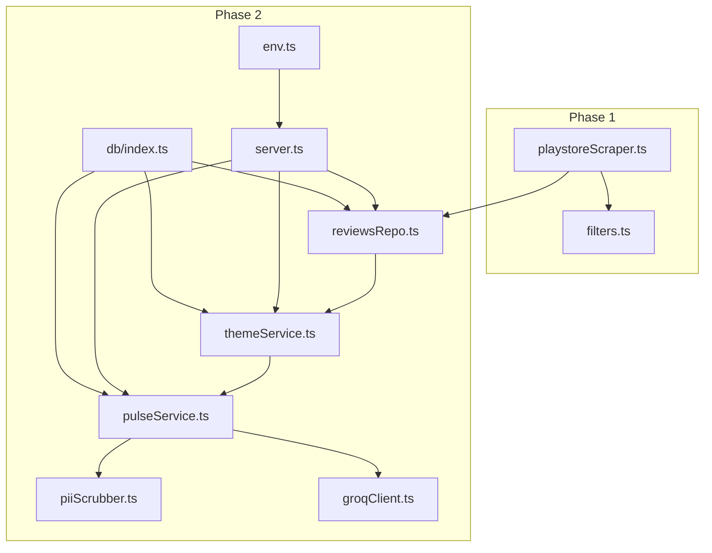
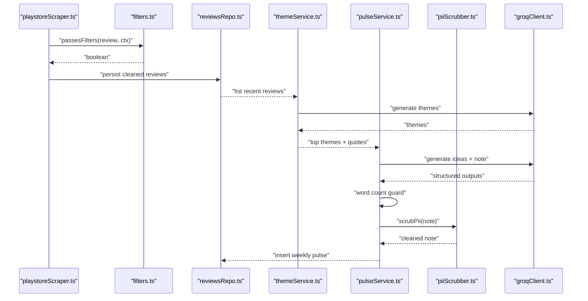
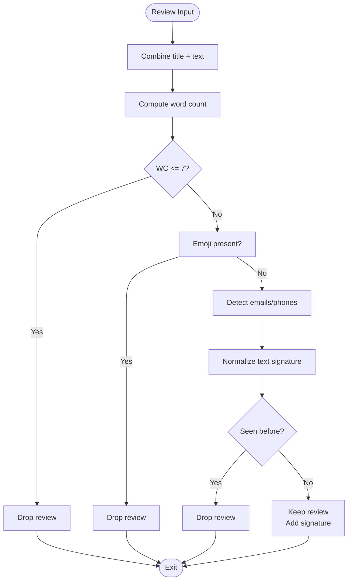
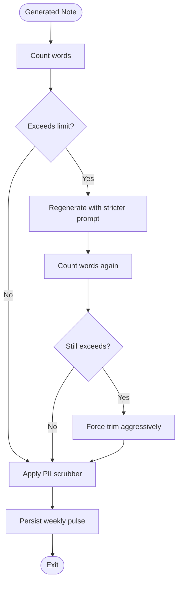
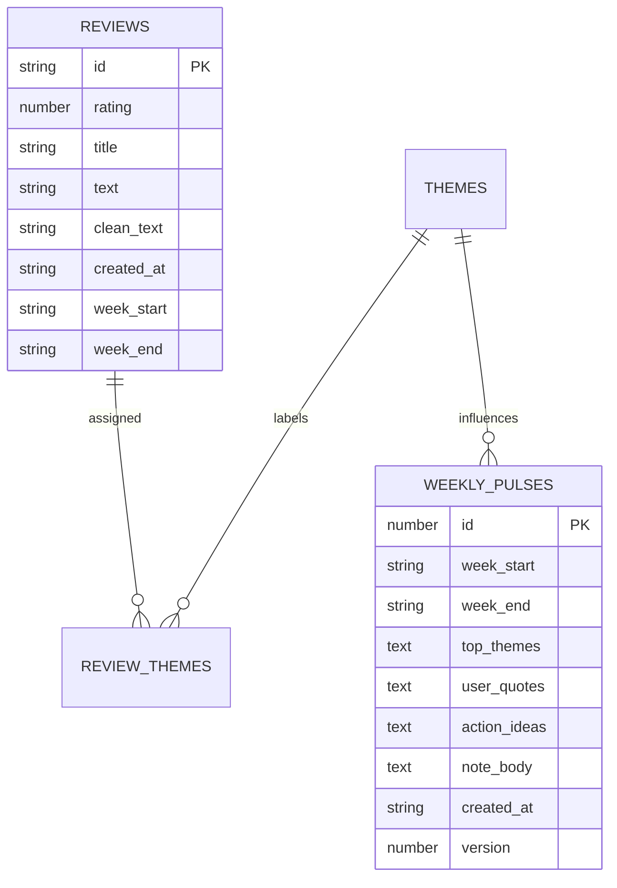
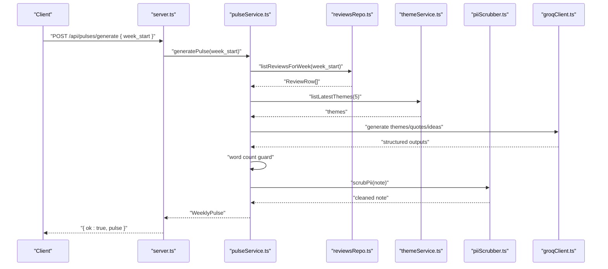
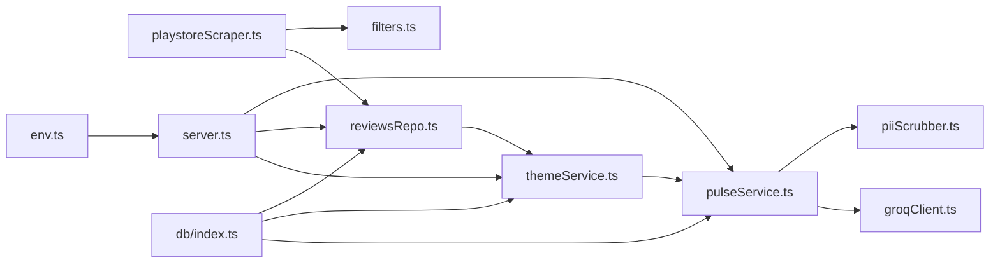

# Filtering Pipeline

<cite>
**Referenced Files in This Document**
- [filters.ts](file://phase-1/src/scraper/filters.ts)
- [filters.test.ts](file://phase-1/src/tests/filters.test.ts)
- [playstoreScraper.ts](file://phase-1/src/scraper/playstoreScraper.ts)
- [piiScrubber.ts](file://phase-2/src/services/piiScrubber.ts)
- [pulseService.ts](file://phase-2/src/services/pulseService.ts)
- [pulse.test.ts](file://phase-2/src/tests/pulse.test.ts)
- [review.ts](file://phase-2/src/domain/review.ts)
- [reviewsRepo.ts](file://phase-2/src/services/reviewsRepo.ts)
- [themeService.ts](file://phase-2/src/services/themeService.ts)
- [groqClient.ts](file://phase-2/src/services/groqClient.ts)
- [server.ts](file://phase-2/src/api/server.ts)
- [env.ts](file://phase-2/src/config/env.ts)
- [index.ts](file://phase-2/src/db/index.ts)
</cite>

## Table of Contents
1. [Introduction](#introduction)
2. [Project Structure](#project-structure)
3. [Core Components](#core-components)
4. [Architecture Overview](#architecture-overview)
5. [Detailed Component Analysis](#detailed-component-analysis)
6. [Dependency Analysis](#dependency-analysis)
7. [Performance Considerations](#performance-considerations)
8. [Troubleshooting Guide](#troubleshooting-guide)
9. [Conclusion](#conclusion)
10. [Appendices](#appendices)

## Introduction
This document describes the multi-layered filtering pipeline that ensures data quality and privacy for app store reviews. It covers:
- PII detection and redaction across ingestion and generation stages
- Duplicate detection via normalized text signatures
- Emoji filtering and word count validation rules
- The filtering chain workflow from scraping to weekly pulse generation
- Configurable thresholds and extensibility
- Examples of filter configurations, custom rule implementation, debugging techniques
- False positive handling, filter bypass scenarios, and quality metrics

## Project Structure
The filtering pipeline spans two phases:
- Phase 1: Scraping and initial filtering of raw reviews
- Phase 2: Aggregation, theming, and weekly pulse generation with robust PII scrubbing and word count enforcement

**Diagram sources**
- [playstoreScraper.ts:13-151](file://phase-1/src/scraper/playstoreScraper.ts#L13-L151)
- [filters.ts:16-48](file://phase-1/src/scraper/filters.ts#L16-L48)
- [reviewsRepo.ts:4-26](file://phase-2/src/services/reviewsRepo.ts#L4-L26)
- [themeService.ts:17-37](file://phase-2/src/services/themeService.ts#L17-L37)
- [pulseService.ts:179-241](file://phase-2/src/services/pulseService.ts#L179-L241)
- [piiScrubber.ts:22-28](file://phase-2/src/services/piiScrubber.ts#L22-L28)
- [groqClient.ts:30-67](file://phase-2/src/services/groqClient.ts#L30-L67)
- [server.ts:28-121](file://phase-2/src/api/server.ts#L28-L121)
- [env.ts:7-21](file://phase-2/src/config/env.ts#L7-L21)
- [index.ts:7-91](file://phase-2/src/db/index.ts#L7-L91)

**Section sources**
- [playstoreScraper.ts:13-151](file://phase-1/src/scraper/playstoreScraper.ts#L13-L151)
- [filters.ts:16-48](file://phase-1/src/scraper/filters.ts#L16-L48)
- [reviewsRepo.ts:4-26](file://phase-2/src/services/reviewsRepo.ts#L4-L26)
- [themeService.ts:17-37](file://phase-2/src/services/themeService.ts#L17-L37)
- [pulseService.ts:179-241](file://phase-2/src/services/pulseService.ts#L179-L241)
- [piiScrubber.ts:22-28](file://phase-2/src/services/piiScrubber.ts#L22-L28)
- [groqClient.ts:30-67](file://phase-2/src/services/groqClient.ts#L30-L67)
- [server.ts:28-121](file://phase-2/src/api/server.ts#L28-L121)
- [env.ts:7-21](file://phase-2/src/config/env.ts#L7-L21)
- [index.ts:7-91](file://phase-2/src/db/index.ts#L7-L91)

## Core Components
- Initial filters (Phase 1):
  - Word count threshold (<= 7 words)
  - Emoji presence filter
  - Email and phone number detection
  - Duplicate detection via normalized text signature
  - Basic cleaning pass to redact PII during ingestion
- Final PII scrubber (Phase 2):
  - Regex-based redaction for emails, phones, URLs, and handles
  - Applied as a final pass before storage or user-facing output
- Word count guard (Phase 2):
  - Enforces strict word limits for generated notes
  - Retries with stricter prompts if limits are exceeded
- Data model and persistence:
  - Cleaned review rows stored with clean_text and metadata
  - Weekly pulses persisted with top themes, quotes, and action ideas

**Section sources**
- [filters.ts:16-48](file://phase-1/src/scraper/filters.ts#L16-L48)
- [filters.ts:50-57](file://phase-1/src/scraper/filters.ts#L50-L57)
- [piiScrubber.ts:22-28](file://phase-2/src/services/piiScrubber.ts#L22-L28)
- [pulseService.ts:52-54](file://phase-2/src/services/pulseService.ts#L52-L54)
- [pulseService.ts:162-171](file://phase-2/src/services/pulseService.ts#L162-L171)
- [review.ts:1-12](file://phase-2/src/domain/review.ts#L1-L12)

## Architecture Overview
The filtering pipeline operates in two stages:
- Ingestion stage (Phase 1): Fetches reviews, applies initial filters, and cleans text
- Generation stage (Phase 2): Aggregates reviews, generates themes, selects quotes, creates weekly notes, enforces word limits, scrubs PII, persists results

**Diagram sources**
- [playstoreScraper.ts:64-92](file://phase-1/src/scraper/playstoreScraper.ts#L64-L92)
- [filters.ts:16-48](file://phase-1/src/scraper/filters.ts#L16-L48)
- [reviewsRepo.ts:4-26](file://phase-2/src/services/reviewsRepo.ts#L4-L26)
- [themeService.ts:17-37](file://phase-2/src/services/themeService.ts#L17-L37)
- [pulseService.ts:179-241](file://phase-2/src/services/pulseService.ts#L179-L241)
- [groqClient.ts:30-67](file://phase-2/src/services/groqClient.ts#L30-L67)
- [piiScrubber.ts:22-28](file://phase-2/src/services/piiScrubber.ts#L22-L28)

## Detailed Component Analysis

### Phase 1: Initial Filtering and Cleaning
- Filters:
  - Word count threshold: Reviews with combined title + text <= 7 words are dropped
  - Emoji filter: Reviews containing emoji characters are dropped
  - PII detection: Emails and phone numbers (Indian mobile and generic) are detected and removed
  - Duplicate detection: Reviews with identical normalized text are deduplicated
- Cleaning:
  - basicCleanText replaces detected PII with a placeholder for downstream processing

**Diagram sources**
- [filters.ts:16-48](file://phase-1/src/scraper/filters.ts#L16-L48)

**Section sources**
- [filters.ts:16-48](file://phase-1/src/scraper/filters.ts#L16-L48)
- [filters.ts:50-57](file://phase-1/src/scraper/filters.ts#L50-L57)
- [filters.test.ts:13-25](file://phase-1/src/tests/filters.test.ts#L13-L25)

### Phase 2: PII Scrubber and Word Count Guard
- PII Scrubber:
  - Applies multiple regex patterns to redact emails, Indian mobile numbers, international phone numbers, URLs, and handles
  - Returns text with all matches replaced by a placeholder
- Word Count Guard:
  - Enforces a strict upper bound on generated note length
  - If the first attempt exceeds the limit, retries with a stricter prompt
- Weekly Pulse Generation:
  - Aggregates top themes, picks representative quotes, generates action ideas, and writes a structured note
  - Scrubs PII from the final note before persistence

**Diagram sources**
- [pulseService.ts:162-171](file://phase-2/src/services/pulseService.ts#L162-L171)
- [pulseService.ts:52-54](file://phase-2/src/services/pulseService.ts#L52-L54)
- [piiScrubber.ts:22-28](file://phase-2/src/services/piiScrubber.ts#L22-L28)

**Section sources**
- [piiScrubber.ts:22-28](file://phase-2/src/services/piiScrubber.ts#L22-L28)
- [pulseService.ts:162-171](file://phase-2/src/services/pulseService.ts#L162-L171)
- [pulse.test.ts:49-59](file://phase-2/src/tests/pulse.test.ts#L49-L59)

### Data Model and Persistence
- ReviewRow stores cleaned text and metadata for downstream analysis
- WeeklyPulse persists aggregated insights, quotes, and action ideas with versioning

**Diagram sources**
- [review.ts:1-12](file://phase-2/src/domain/review.ts#L1-L12)
- [index.ts:41-57](file://phase-2/src/db/index.ts#L41-L57)

**Section sources**
- [review.ts:1-12](file://phase-2/src/domain/review.ts#L1-L12)
- [index.ts:41-57](file://phase-2/src/db/index.ts#L41-L57)

### API Workflow: Weekly Pulse Generation

**Diagram sources**
- [server.ts:76-90](file://phase-2/src/api/server.ts#L76-L90)
- [pulseService.ts:179-241](file://phase-2/src/services/pulseService.ts#L179-L241)
- [reviewsRepo.ts:16-24](file://phase-2/src/services/reviewsRepo.ts#L16-L24)
- [themeService.ts:58-66](file://phase-2/src/services/themeService.ts#L58-L66)
- [groqClient.ts:30-67](file://phase-2/src/services/groqClient.ts#L30-L67)
- [piiScrubber.ts:22-28](file://phase-2/src/services/piiScrubber.ts#L22-L28)

**Section sources**
- [server.ts:76-90](file://phase-2/src/api/server.ts#L76-L90)
- [pulseService.ts:179-241](file://phase-2/src/services/pulseService.ts#L179-L241)

## Dependency Analysis
- Phase 1 depends on:
  - filters.ts for ingestion-time filtering and cleaning
  - playstoreScraper.ts orchestrating scraping and applying filters
- Phase 2 depends on:
  - reviewsRepo.ts for fetching reviews
  - themeService.ts for generating themes
  - pulseService.ts for orchestration, word counting, and PII scrubbing
  - groqClient.ts for LLM-backed generation
  - server.ts for API exposure
  - env.ts and db/index.ts for configuration and persistence

**Diagram sources**
- [playstoreScraper.ts:13-151](file://phase-1/src/scraper/playstoreScraper.ts#L13-L151)
- [filters.ts:16-48](file://phase-1/src/scraper/filters.ts#L16-L48)
- [reviewsRepo.ts:4-26](file://phase-2/src/services/reviewsRepo.ts#L4-L26)
- [themeService.ts:17-37](file://phase-2/src/services/themeService.ts#L17-L37)
- [pulseService.ts:179-241](file://phase-2/src/services/pulseService.ts#L179-L241)
- [piiScrubber.ts:22-28](file://phase-2/src/services/piiScrubber.ts#L22-L28)
- [groqClient.ts:30-67](file://phase-2/src/services/groqClient.ts#L30-L67)
- [server.ts:28-121](file://phase-2/src/api/server.ts#L28-L121)
- [env.ts:7-21](file://phase-2/src/config/env.ts#L7-L21)
- [index.ts:7-91](file://phase-2/src/db/index.ts#L7-L91)

**Section sources**
- [playstoreScraper.ts:13-151](file://phase-1/src/scraper/playstoreScraper.ts#L13-L151)
- [filters.ts:16-48](file://phase-1/src/scraper/filters.ts#L16-L48)
- [reviewsRepo.ts:4-26](file://phase-2/src/services/reviewsRepo.ts#L4-L26)
- [themeService.ts:17-37](file://phase-2/src/services/themeService.ts#L17-L37)
- [pulseService.ts:179-241](file://phase-2/src/services/pulseService.ts#L179-L241)
- [piiScrubber.ts:22-28](file://phase-2/src/services/piiScrubber.ts#L22-L28)
- [groqClient.ts:30-67](file://phase-2/src/services/groqClient.ts#L30-L67)
- [server.ts:28-121](file://phase-2/src/api/server.ts#L28-L121)
- [env.ts:7-21](file://phase-2/src/config/env.ts#L7-L21)
- [index.ts:7-91](file://phase-2/src/db/index.ts#L7-L91)

## Performance Considerations
- Ingestion:
  - Pagination safety: Limits maximum pages fetched to prevent excessive scraping when filters drop most items
  - Fallback: If no reviews pass filters, falls back to minimally cleaned raw reviews to ensure progress
- Generation:
  - Word count guard avoids expensive retries by enforcing limits early
  - Strict prompts and schema hints reduce hallucinations and parsing overhead
- Storage:
  - SQLite schema optimized with indexes for joins and lookups
- Caching and memory:
  - seenSignatures is a Set; ensure it is reset or scoped appropriately to avoid unbounded growth across runs

**Section sources**
- [playstoreScraper.ts:29-104](file://phase-1/src/scraper/playstoreScraper.ts#L29-L104)
- [playstoreScraper.ts:110-145](file://phase-1/src/scraper/playstoreScraper.ts#L110-L145)
- [pulseService.ts:162-171](file://phase-2/src/services/pulseService.ts#L162-L171)
- [index.ts:19-88](file://phase-2/src/db/index.ts#L19-L88)

## Troubleshooting Guide
- Symptom: No reviews returned after scraping
  - Cause: Filters dropping all items
  - Mitigation: The scraper falls back to minimally cleaned raw reviews; verify logs and adjust thresholds
  - References: [playstoreScraper.ts:108-145](file://phase-1/src/scraper/playstoreScraper.ts#L108-L145)
- Symptom: Generated note exceeds word limit
  - Cause: LLM output too verbose
  - Mitigation: Word count guard triggers a retry with stricter prompt; ensure schema hints are enforced
  - References: [pulseService.ts:162-171](file://phase-2/src/services/pulseService.ts#L162-L171), [pulse.test.ts:49-59](file://phase-2/src/tests/pulse.test.ts#L49-L59)
- Symptom: PII still visible in outputs
  - Cause: Pattern misses or insufficient scrubbing
  - Mitigation: Extend regex patterns in the PII scrubber; apply scrubbing consistently before storage and email
  - References: [piiScrubber.ts:22-28](file://phase-2/src/services/piiScrubber.ts#L22-L28), [pulseService.ts:171](file://phase-2/src/services/pulseService.ts#L171)
- Symptom: Duplicate reviews persist
  - Cause: Signature normalization differences
  - Mitigation: Normalize whitespace and casing consistently; consider hashing combined text
  - References: [filters.ts:40-45](file://phase-1/src/scraper/filters.ts#L40-L45)
- Debugging techniques:
  - Use test suites to validate behavior of cleaning and filtering functions
  - References: [filters.test.ts:1-27](file://phase-1/src/tests/filters.test.ts#L1-L27), [pulse.test.ts:17-45](file://phase-2/src/tests/pulse.test.ts#L17-L45)
  - Inspect week-specific review lists via API for verification
  - References: [server.ts:238-248](file://phase-2/src/api/server.ts#L238-L248)

**Section sources**
- [playstoreScraper.ts:108-145](file://phase-1/src/scraper/playstoreScraper.ts#L108-L145)
- [pulseService.ts:162-171](file://phase-2/src/services/pulseService.ts#L162-L171)
- [piiScrubber.ts:22-28](file://phase-2/src/services/piiScrubber.ts#L22-L28)
- [filters.ts:40-45](file://phase-1/src/scraper/filters.ts#L40-L45)
- [filters.test.ts:1-27](file://phase-1/src/tests/filters.test.ts#L1-L27)
- [pulse.test.ts:17-45](file://phase-2/src/tests/pulse.test.ts#L17-L45)
- [server.ts:238-248](file://phase-2/src/api/server.ts#L238-L248)

## Conclusion
The filtering pipeline combines ingestion-time checks (word count, emoji, PII, duplicates) with robust generation-time safeguards (PII scrubbing, strict word limits, schema-enforced outputs). Together, these layers ensure high-quality, privacy-compliant insights suitable for weekly pulse generation and distribution.

## Appendices

### Configurable Thresholds and Extensibility
- Word count threshold:
  - Ingestion: <= 7 words
  - Generation: <= 250 words for weekly notes
  - References: [filters.ts:20-23](file://phase-1/src/scraper/filters.ts#L20-L23), [pulseService.ts:139](file://phase-2/src/services/pulseService.ts#L139), [pulse.test.ts:49-59](file://phase-2/src/tests/pulse.test.ts#L49-L59)
- Emoji filter:
  - Removal of emoji-containing reviews
  - References: [filters.ts:25-28](file://phase-1/src/scraper/filters.ts#L25-L28)
- PII patterns:
  - Extend scrubber patterns for additional identifiers
  - References: [piiScrubber.ts:7-18](file://phase-2/src/services/piiScrubber.ts#L7-L18)
- Duplicate detection:
  - Normalize text (lowercase, single spaces) before hashing
  - References: [filters.ts:40-45](file://phase-1/src/scraper/filters.ts#L40-L45)

### Examples of Filter Configurations
- Adjust word count threshold:
  - Modify the ingestion threshold in the filter function
  - Reference: [filters.ts:20-23](file://phase-1/src/scraper/filters.ts#L20-L23)
- Tighten emoji filter:
  - Expand emoji regex range or remove the check
  - Reference: [filters.ts:1](file://phase-1/src/scraper/filters.ts#L1), [filters.ts:25-28](file://phase-1/src/scraper/filters.ts#L25-L28)
- Customize PII patterns:
  - Add or refine regexes in the scrubber
  - Reference: [piiScrubber.ts:7-18](file://phase-2/src/services/piiScrubber.ts#L7-L18)
- Tune word limit:
  - Change the maximum word count in the generation guard
  - Reference: [pulseService.ts:139](file://phase-2/src/services/pulseService.ts#L139)

### Custom Rule Implementation
- New filter rule:
  - Add a new condition in the ingestion filter function
  - Reference: [filters.ts:16-48](file://phase-1/src/scraper/filters.ts#L16-L48)
- New PII category:
  - Extend the scrubber’s pattern list
  - Reference: [piiScrubber.ts:7-18](file://phase-2/src/services/piiScrubber.ts#L7-L18)
- Duplicate variant:
  - Use content hashing (e.g., SHA-256) of normalized text for deduplication
  - Reference: [filters.ts:40-45](file://phase-1/src/scraper/filters.ts#L40-L45)

### Quality Metrics for Filtered Data
- Metrics to track:
  - Total reviews scraped vs. kept
  - Reasons for dropping (short, emoji, PII, duplicate)
  - Word count distribution of kept reviews
  - PII redaction completeness
  - Weekly note word counts and retries
- References:
  - Logging in scraper for kept/dropped counts
    - [playstoreScraper.ts:94-99](file://phase-1/src/scraper/playstoreScraper.ts#L94-L99)
  - Word count tests
    - [pulse.test.ts:49-59](file://phase-2/src/tests/pulse.test.ts#L49-L59)
  - PII scrubber tests
    - [pulse.test.ts:17-45](file://phase-2/src/tests/pulse.test.ts#L17-L45)