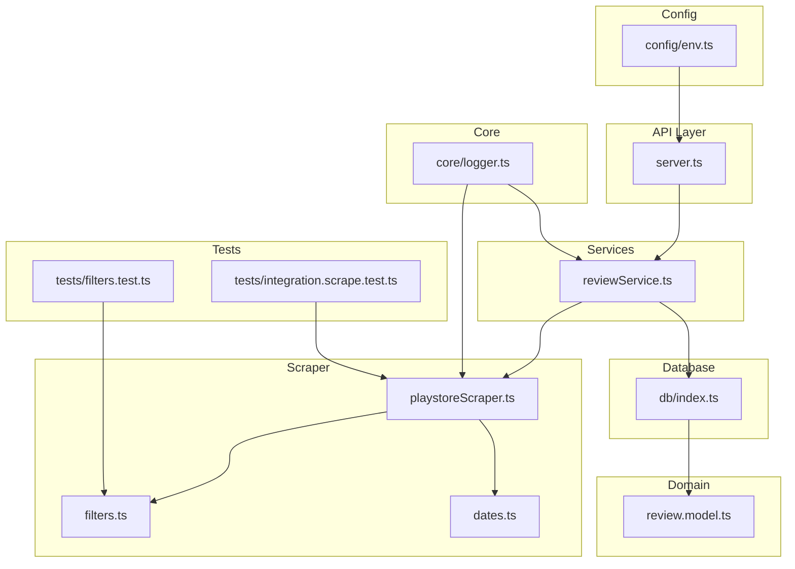
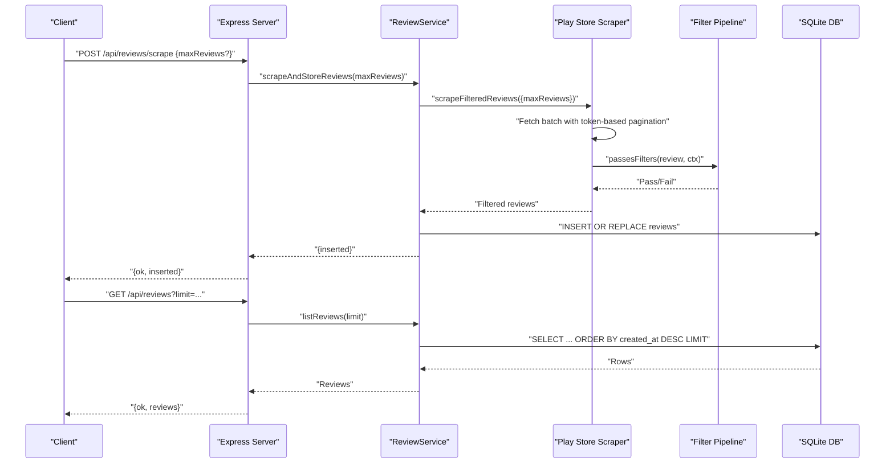
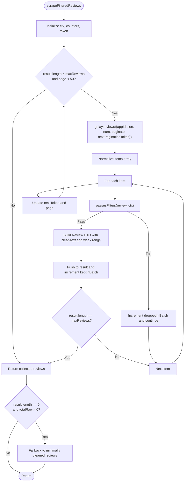
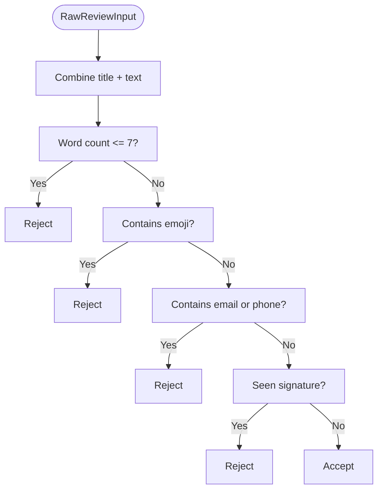
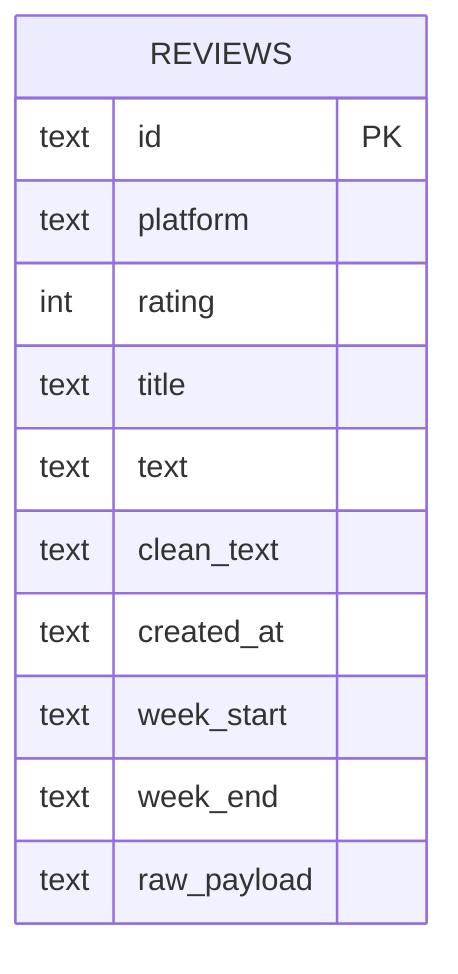
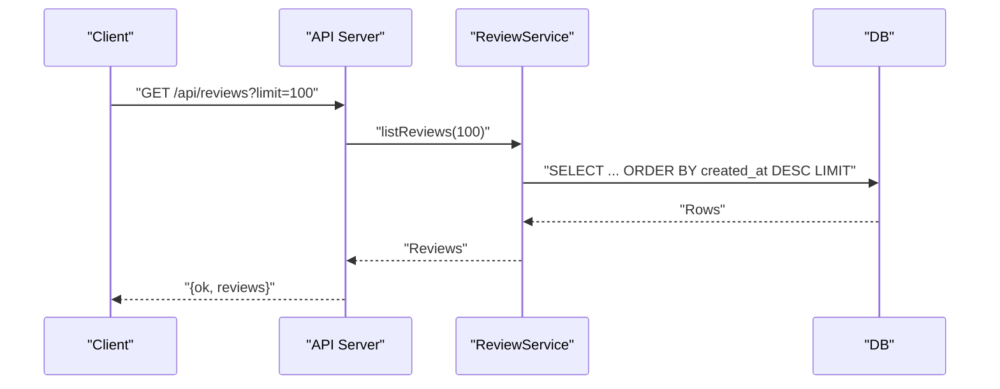
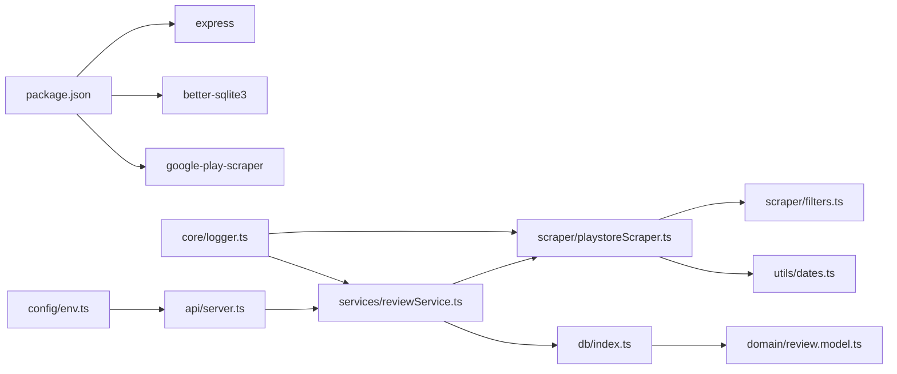

# Phase 1: Review Scraper

<cite>
**Referenced Files in This Document**
- [playstoreScraper.ts](file://phase-1/src/scraper/playstoreScraper.ts)
- [filters.ts](file://phase-1/src/scraper/filters.ts)
- [reviewService.ts](file://phase-1/src/services/reviewService.ts)
- [index.ts](file://phase-1/src/db/index.ts)
- [review.model.ts](file://phase-1/src/domain/review.model.ts)
- [server.ts](file://phase-1/src/api/server.ts)
- [env.ts](file://phase-1/src/config/env.ts)
- [dates.ts](file://phase-1/src/utils/dates.ts)
- [logger.ts](file://phase-1/src/core/logger.ts)
- [filters.test.ts](file://phase-1/src/tests/filters.test.ts)
- [integration.scrape.test.ts](file://phase-1/src/tests/integration.scrape.test.ts)
- [package.json](file://phase-1/package.json)
- [tsconfig.json](file://phase-1/tsconfig.json)
</cite>

## Table of Contents
1. [Introduction](#introduction)
2. [Project Structure](#project-structure)
3. [Core Components](#core-components)
4. [Architecture Overview](#architecture-overview)
5. [Detailed Component Analysis](#detailed-component-analysis)
6. [Dependency Analysis](#dependency-analysis)
7. [Performance Considerations](#performance-considerations)
8. [Troubleshooting Guide](#troubleshooting-guide)
9. [Conclusion](#conclusion)
10. [Appendices](#appendices)

## Introduction
Phase 1 of the Groww App Review Insights Analyzer establishes the foundational capabilities for collecting, filtering, and storing Android Play Store reviews. It integrates the google-play-scraper library to perform token-based pagination, applies a multi-layered filtering pipeline to remove low-quality, sensitive, or redundant content, and persists filtered results into a local SQLite database. The system exposes REST endpoints for scraping and retrieving reviews, and includes a lightweight logging and configuration framework suitable for early-stage development.

## Project Structure
The Phase 1 codebase is organized by functional layers:
- API: Express server exposing endpoints for scraping and listing reviews
- Services: Orchestration of scraping and persistence
- Scraper: Play Store integration and filtering logic
- Domain: Data model definitions
- Database: Schema initialization and SQLite access
- Config: Environment configuration
- Utils: Helper utilities (date week calculation)
- Core: Logging utilities
- Tests: Unit and integration tests

**Diagram sources**
- [server.ts:1-50](file://phase-1/src/api/server.ts#L1-L50)
- [reviewService.ts:1-101](file://phase-1/src/services/reviewService.ts#L1-L101)
- [playstoreScraper.ts:1-153](file://phase-1/src/scraper/playstoreScraper.ts#L1-L153)
- [filters.ts:1-59](file://phase-1/src/scraper/filters.ts#L1-L59)
- [dates.ts:1-23](file://phase-1/src/utils/dates.ts#L1-L23)
- [review.model.ts:1-14](file://phase-1/src/domain/review.model.ts#L1-L14)
- [db/index.ts:1-31](file://phase-1/src/db/index.ts#L1-L31)
- [config/env.ts:1-6](file://phase-1/src/config/env.ts#L1-L6)
- [core/logger.ts:1-23](file://phase-1/src/core/logger.ts#L1-L23)
- [tests/filters.test.ts:1-27](file://phase-1/src/tests/filters.test.ts#L1-L27)
- [tests/integration.scrape.test.ts:1-14](file://phase-1/src/tests/integration.scrape.test.ts#L1-L14)

**Section sources**
- [package.json:1-26](file://phase-1/package.json#L1-L26)
- [tsconfig.json:1-15](file://phase-1/tsconfig.json#L1-L15)

## Core Components
- Play Store Scraper: Implements token-based pagination with a 50-page safety limit, fetching batches of reviews and applying filters during iteration.
- Filtering Pipeline: Multi-layered checks for word count, emojis, PII (emails, phone numbers), and duplicate removal using normalized signatures.
- Review Service: Orchestrates scraping, persistence, and debug JSON export; provides listing of recent reviews.
- SQLite Storage: Creates a schema for reviews with indexing on week_start; stores raw payloads for traceability.
- REST API: Exposes endpoints for scraping and listing reviews with support for query/body parameters.
- Utilities: Week range calculation for grouping reviews by calendar weeks.

**Section sources**
- [playstoreScraper.ts:13-151](file://phase-1/src/scraper/playstoreScraper.ts#L13-L151)
- [filters.ts:16-48](file://phase-1/src/scraper/filters.ts#L16-L48)
- [reviewService.ts:10-99](file://phase-1/src/services/reviewService.ts#L10-L99)
- [index.ts:7-29](file://phase-1/src/db/index.ts#L7-L29)
- [server.ts:9-43](file://phase-1/src/api/server.ts#L9-L43)
- [dates.ts:1-23](file://phase-1/src/utils/dates.ts#L1-L23)

## Architecture Overview
The system follows a layered architecture:
- API layer handles HTTP requests and delegates to service layer
- Service layer coordinates scraping and database operations
- Scraper layer interacts with external APIs and applies filters
- Database layer manages schema and persistence
- Utilities and configuration provide shared helpers and environment settings

**Diagram sources**
- [server.ts:9-43](file://phase-1/src/api/server.ts#L9-L43)
- [reviewService.ts:10-99](file://phase-1/src/services/reviewService.ts#L10-L99)
- [playstoreScraper.ts:13-151](file://phase-1/src/scraper/playstoreScraper.ts#L13-L151)
- [filters.ts:16-48](file://phase-1/src/scraper/filters.ts#L16-L48)
- [index.ts:7-29](file://phase-1/src/db/index.ts#L7-L29)

## Detailed Component Analysis

### Play Store Scraper and Token-Based Pagination
- Uses google-play-scraper with paginate enabled and nextPaginationToken to iterate pages.
- Fetches fixed-size batches (num: 100) to maximize filter effectiveness.
- Enforces a 50-page safety limit to prevent excessive pagination when filters drop most items.
- Normalizes response shapes across versions and iterates until target count or pagination end.
- On empty results but existing raw batches, falls back to minimally cleaned reviews to ensure Phase 1 remains demonstrable.

**Diagram sources**
- [playstoreScraper.ts:13-151](file://phase-1/src/scraper/playstoreScraper.ts#L13-L151)

**Section sources**
- [playstoreScraper.ts:13-151](file://phase-1/src/scraper/playstoreScraper.ts#L13-L151)

### Multi-Layered Filtering Pipeline
- Word Count Validation: Drops reviews with ≤7 words to ensure quality.
- Emoji Filtering: Removes reviews containing Unicode emoji ranges.
- PII Detection: Redacts emails and phone numbers using regex patterns; phones include Indian mobile and generic formats.
- Duplicate Removal: Tracks normalized signatures in a Set to prevent repeated content.

**Diagram sources**
- [filters.ts:16-48](file://phase-1/src/scraper/filters.ts#L16-L48)

**Section sources**
- [filters.ts:16-59](file://phase-1/src/scraper/filters.ts#L16-L59)

### SQLite Database Schema and Data Storage Patterns
- Schema: reviews table with primary key id, platform, rating, title, text, clean_text, created_at, week_start, week_end, and raw_payload.
- Index: idx_reviews_week_start on week_start to support time-based queries.
- Persistence: INSERT OR REPLACE prepared statement executed inside a transaction for atomicity.
- Debug Export: Writes a JSON file with selected fields for inspection.

**Diagram sources**
- [index.ts:8-21](file://phase-1/src/db/index.ts#L8-L21)

**Section sources**
- [index.ts:7-29](file://phase-1/src/db/index.ts#L7-L29)
- [review.model.ts:1-14](file://phase-1/src/domain/review.model.ts#L1-L14)

### Review Service Business Logic and REST API Endpoints
- scrapeAndStoreReviews: Orchestrates scraping, persistence, and debug JSON export; returns inserted count.
- listReviews: Retrieves recent reviews ordered by creation time with configurable limit.
- REST Endpoints:
  - POST /api/reviews/scrape: Accepts maxReviews in body; returns {ok, inserted}.
  - GET /api/reviews/scrape: Accepts maxReviews as query param; returns {ok, inserted}.
  - GET /api/reviews: Accepts limit as query param; returns {ok, reviews}.

**Diagram sources**
- [server.ts:34-43](file://phase-1/src/api/server.ts#L34-L43)
- [reviewService.ts:77-99](file://phase-1/src/services/reviewService.ts#L77-L99)

**Section sources**
- [reviewService.ts:10-99](file://phase-1/src/services/reviewService.ts#L10-L99)
- [server.ts:9-43](file://phase-1/src/api/server.ts#L9-L43)

### Practical Examples and Workflows
- Scraping Workflow:
  - Endpoint: POST /api/reviews/scrape with body { maxReviews: number } or GET /api/reviews/scrape?maxReviews=...
  - Behavior: Fetches up to maxReviews reviews (default 2000), applies filters, persists to DB, writes debug JSON.
- Filter Configuration:
  - Word count threshold: 7 words
  - Emojis: Disallowed
  - PII: Emails and phone numbers redacted; phones include Indian mobile and generic formats
  - Duplicates: Detected via normalized signature
- Database Operations:
  - Insertion: INSERT OR REPLACE with transaction
  - Listing: SELECT with ORDER BY created_at DESC and LIMIT

**Section sources**
- [server.ts:9-43](file://phase-1/src/api/server.ts#L9-L43)
- [filters.ts:16-48](file://phase-1/src/scraper/filters.ts#L16-L48)
- [reviewService.ts:19-42](file://phase-1/src/services/reviewService.ts#L19-L42)

## Dependency Analysis
External dependencies include express for HTTP, better-sqlite3 for database, and google-play-scraper for Play Store data. Internal dependencies form a clear layering with minimal coupling.

**Diagram sources**
- [package.json:13-24](file://phase-1/package.json#L13-L24)
- [server.ts:1-50](file://phase-1/src/api/server.ts#L1-L50)
- [reviewService.ts:1-10](file://phase-1/src/services/reviewService.ts#L1-L10)
- [playstoreScraper.ts:1-6](file://phase-1/src/scraper/playstoreScraper.ts#L1-L6)
- [filters.ts:1-5](file://phase-1/src/scraper/filters.ts#L1-L5)
- [dates.ts:1-23](file://phase-1/src/utils/dates.ts#L1-L23)
- [index.ts:1-5](file://phase-1/src/db/index.ts#L1-L5)
- [review.model.ts:1-14](file://phase-1/src/domain/review.model.ts#L1-L14)
- [env.ts:1-6](file://phase-1/src/config/env.ts#L1-L6)
- [logger.ts:1-23](file://phase-1/src/core/logger.ts#L1-L23)

**Section sources**
- [package.json:13-24](file://phase-1/package.json#L13-L24)

## Performance Considerations
- Token-based pagination with fixed batch sizes balances throughput and memory usage.
- 50-page safety limit prevents runaway pagination when filters are strict.
- Transactional inserts minimize overhead and ensure atomicity.
- Index on week_start supports efficient time-based queries.
- Logging includes batch-level metrics to monitor filter effectiveness.

[No sources needed since this section provides general guidance]

## Troubleshooting Guide
- API Errors:
  - Ensure environment variables DATABASE_FILE and PORT are set appropriately.
  - Verify server startup logs indicate the port is listening.
- Scraping Failures:
  - Check network connectivity and Play Store availability.
  - Review logs for pagination token handling and fallback conditions.
- Database Issues:
  - Confirm schema initialization and index creation.
  - Validate file permissions for the database file path.
- Filter Behavior:
  - Adjust word count thresholds or regex patterns if needed.
  - Use debug JSON to inspect redactions and duplicates.

**Section sources**
- [env.ts:1-6](file://phase-1/src/config/env.ts#L1-L6)
- [server.ts:45-48](file://phase-1/src/api/server.ts#L45-L48)
- [index.ts:7-29](file://phase-1/src/db/index.ts#L7-L29)
- [logger.ts:1-23](file://phase-1/src/core/logger.ts#L1-L23)

## Conclusion
Phase 1 delivers a robust foundation for Play Store review ingestion, including token-based pagination, comprehensive filtering, and reliable persistence. The REST API enables straightforward automation and inspection, while the SQLite schema supports future analytical queries. The modular design facilitates incremental enhancements in subsequent phases.

[No sources needed since this section summarizes without analyzing specific files]

## Appendices

### API Reference
- POST /api/reviews/scrape
  - Body: { maxReviews?: number }
  - Response: { ok: boolean, inserted: number }
- GET /api/reviews/scrape
  - Query: { maxReviews?: number }
  - Response: { ok: boolean, inserted: number }
- GET /api/reviews
  - Query: { limit?: number }
  - Response: { ok: boolean, reviews: Review[] }

**Section sources**
- [server.ts:9-43](file://phase-1/src/api/server.ts#L9-L43)

### Testing Notes
- Unit tests validate cleaning and filtering logic.
- Integration test requires explicit enablement via environment variable.

**Section sources**
- [filters.test.ts:1-27](file://phase-1/src/tests/filters.test.ts#L1-L27)
- [integration.scrape.test.ts:1-14](file://phase-1/src/tests/integration.scrape.test.ts#L1-L14)