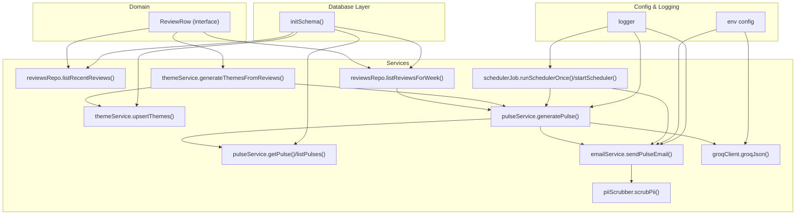
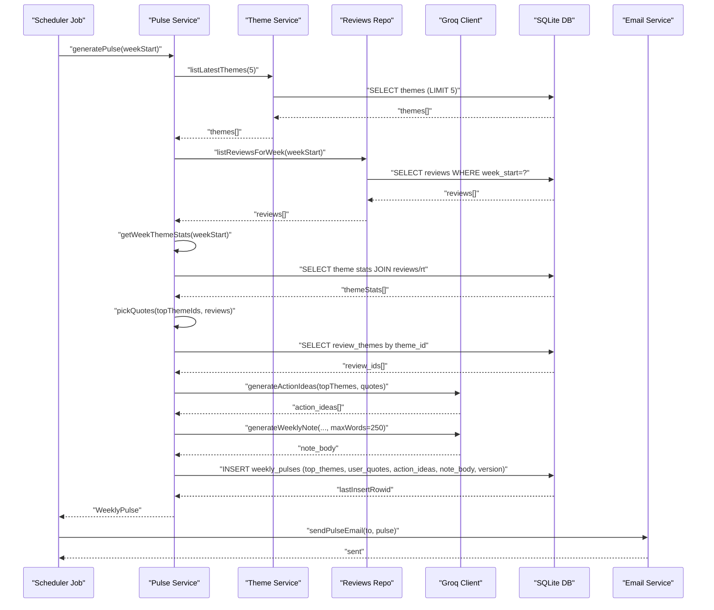
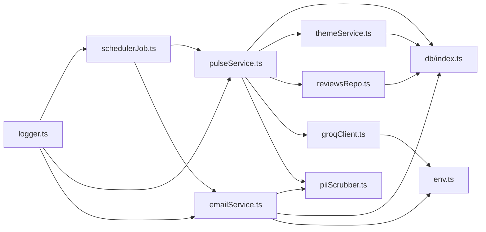

# Review Service

<cite>
**Referenced Files in This Document**
- [reviewsRepo.ts](file://phase-2/src/services/reviewsRepo.ts)
- [review.ts](file://phase-2/src/domain/review.ts)
- [index.ts](file://phase-2/src/db/index.ts)
- [pulseService.ts](file://phase-2/src/services/pulseService.ts)
- [schedulerJob.ts](file://phase-2/src/jobs/schedulerJob.ts)
- [themeService.ts](file://phase-2/src/services/themeService.ts)
- [userPrefsRepo.ts](file://phase-2/src/services/userPrefsRepo.ts)
- [emailService.ts](file://phase-2/src/services/emailService.ts)
- [groqClient.ts](file://phase-2/src/services/groqClient.ts)
- [piiScrubber.ts](file://phase-2/src/services/piiScrubber.ts)
- [env.ts](file://phase-2/src/config/env.ts)
- [logger.ts](file://phase-2/src/core/logger.ts)
- [pulse.test.ts](file://phase-2/src/tests/pulse.test.ts)
</cite>

## Table of Contents
1. [Introduction](#introduction)
2. [Project Structure](#project-structure)
3. [Core Components](#core-components)
4. [Architecture Overview](#architecture-overview)
5. [Detailed Component Analysis](#detailed-component-analysis)
6. [Dependency Analysis](#dependency-analysis)
7. [Performance Considerations](#performance-considerations)
8. [Troubleshooting Guide](#troubleshooting-guide)
9. [Conclusion](#conclusion)
10. [Appendices](#appendices)

## Introduction
This document describes the review service business logic layer responsible for collecting, filtering, transforming, validating, and persisting app store reviews into weekly insights. It explains how reviews are aggregated, how themes are derived, how quotes are selected, and how weekly pulses are generated and emailed. It also covers integration with the database layer, concurrency and transaction boundaries, error handling, and performance optimization strategies.

## Project Structure
The review service spans several modules:
- Domain: defines the canonical review row shape used across services.
- Database: initializes schema and exposes the SQLite connection.
- Services:
  - Reviews repository: queries recent and weekly reviews.
  - Theme service: generates themes from review samples and persists them.
  - Pulse service: orchestrates weekly pulse generation, including LLM-driven content creation and persistence.
  - Email service: builds and sends HTML/text emails.
  - Scheduler job: runs periodic scheduling of pulse generation and delivery.
  - PII scrubber: redacts sensitive information before storage or email.
  - Groq client: robust JSON extraction and retries for LLM calls.
- Config and logging: environment configuration and logging utilities.
- Tests: validate pulse shape, word limits, and PII scrubbing.

**Diagram sources**
- [review.ts:1-12](file://phase-2/src/domain/review.ts#L1-L12)
- [index.ts:7-91](file://phase-2/src/db/index.ts#L7-L91)
- [reviewsRepo.ts:4-24](file://phase-2/src/services/reviewsRepo.ts#L4-L24)
- [themeService.ts:17-66](file://phase-2/src/services/themeService.ts#L17-L66)
- [pulseService.ts:59-241](file://phase-2/src/services/pulseService.ts#L59-L241)
- [emailService.ts:114-129](file://phase-2/src/services/emailService.ts#L114-L129)
- [schedulerJob.ts:52-84](file://phase-2/src/jobs/schedulerJob.ts#L52-L84)
- [piiScrubber.ts:22-28](file://phase-2/src/services/piiScrubber.ts#L22-L28)
- [groqClient.ts:30-65](file://phase-2/src/services/groqClient.ts#L30-L65)
- [env.ts:7-21](file://phase-2/src/config/env.ts#L7-L21)
- [logger.ts:1-21](file://phase-2/src/core/logger.ts#L1-L21)

**Section sources**
- [review.ts:1-12](file://phase-2/src/domain/review.ts#L1-L12)
- [index.ts:7-91](file://phase-2/src/db/index.ts#L7-L91)
- [reviewsRepo.ts:4-24](file://phase-2/src/services/reviewsRepo.ts#L4-L24)
- [themeService.ts:17-66](file://phase-2/src/services/themeService.ts#L17-L66)
- [pulseService.ts:59-241](file://phase-2/src/services/pulseService.ts#L59-L241)
- [emailService.ts:114-129](file://phase-2/src/services/emailService.ts#L114-L129)
- [schedulerJob.ts:52-84](file://phase-2/src/jobs/schedulerJob.ts#L52-L84)
- [piiScrubber.ts:22-28](file://phase-2/src/services/piiScrubber.ts#L22-L28)
- [groqClient.ts:30-65](file://phase-2/src/services/groqClient.ts#L30-L65)
- [env.ts:7-21](file://phase-2/src/config/env.ts#L7-L21)
- [logger.ts:1-21](file://phase-2/src/core/logger.ts#L1-L21)

## Core Components
- Review domain model: defines the canonical shape of a persisted review row used across services.
- Database initialization: creates tables and indexes for themes, review-themes joins, weekly pulses, user preferences, and scheduled jobs.
- Reviews repository: provides recent and weekly review retrieval for downstream analytics.
- Theme service: derives themes from review samples via LLM and upserts them into the themes table.
- Pulse service: aggregates per-week themes, selects representative quotes, generates action ideas and a weekly note via LLM, enforces word limits, scrubs PII, and persists the weekly pulse.
- Scheduler job: computes the last full week, identifies due recipients, generates pulses, sends emails, and records job outcomes.
- Email service: constructs HTML/text bodies and sends emails using SMTP.
- PII scrubber: redacts emails, phone numbers, URLs, and handles.
- Groq client: robust chat completions with JSON extraction and retry logic.
- Environment and logging: centralizes configuration and structured logs.

**Section sources**
- [review.ts:1-12](file://phase-2/src/domain/review.ts#L1-L12)
- [index.ts:7-91](file://phase-2/src/db/index.ts#L7-L91)
- [reviewsRepo.ts:4-24](file://phase-2/src/services/reviewsRepo.ts#L4-L24)
- [themeService.ts:17-66](file://phase-2/src/services/themeService.ts#L17-L66)
- [pulseService.ts:59-241](file://phase-2/src/services/pulseService.ts#L59-L241)
- [schedulerJob.ts:52-84](file://phase-2/src/jobs/schedulerJob.ts#L52-L84)
- [emailService.ts:114-129](file://phase-2/src/services/emailService.ts#L114-L129)
- [piiScrubber.ts:22-28](file://phase-2/src/services/piiScrubber.ts#L22-L28)
- [groqClient.ts:30-65](file://phase-2/src/services/groqClient.ts#L30-L65)
- [env.ts:7-21](file://phase-2/src/config/env.ts#L7-L21)
- [logger.ts:1-21](file://phase-2/src/core/logger.ts#L1-L21)

## Architecture Overview
The system follows a layered architecture:
- Data ingestion and preparation: reviews are ingested and stored in the database (outside the scope of this document).
- Business logic layer: theme generation, weekly aggregation, quote selection, LLM-driven content creation, and persistence.
- Delivery layer: email rendering and dispatch.
- Infrastructure: database schema, environment configuration, and logging.

**Diagram sources**
- [schedulerJob.ts:52-84](file://phase-2/src/jobs/schedulerJob.ts#L52-L84)
- [pulseService.ts:179-241](file://phase-2/src/services/pulseService.ts#L179-L241)
- [themeService.ts:58-66](file://phase-2/src/services/themeService.ts#L58-L66)
- [reviewsRepo.ts:16-24](file://phase-2/src/services/reviewsRepo.ts#L16-L24)
- [groqClient.ts:30-65](file://phase-2/src/services/groqClient.ts#L30-L65)
- [emailService.ts:114-129](file://phase-2/src/services/emailService.ts#L114-L129)

## Detailed Component Analysis

### Reviews Repository
Responsibilities:
- Retrieve recent reviews within a rolling window.
- Retrieve all reviews for a given week start boundary.

Key behaviors:
- Uses SQL date arithmetic to compute the lower bound for recent reviews.
- Orders by creation time descending and applies a limit.
- Filters by week_start for weekly aggregation.

Concurrency and transactions:
- Pure read operations; no transactions required.

Error handling:
- Returns empty arrays when no rows match; callers must validate results.

Performance:
- Indexes on foreign keys and weekly boundaries improve lookup performance.

**Section sources**
- [reviewsRepo.ts:4-24](file://phase-2/src/services/reviewsRepo.ts#L4-L24)
- [index.ts:35-38](file://phase-2/src/db/index.ts#L35-L38)

### Theme Service
Responsibilities:
- Generate themes from a sample of cleaned or raw review text via LLM.
- Upsert themes into the themes table with timestamps and optional validity windows.
- List latest themes for downstream use.

Validation:
- Zod schemas enforce minimum/maximum lengths and array sizes for theme definitions.

Transactions:
- Batch insert is wrapped in a transaction to ensure atomicity across multiple inserts.

Concurrency:
- Upserts are serialized per batch; concurrent batches are safe due to transaction boundaries.

**Section sources**
- [themeService.ts:17-66](file://phase-2/src/services/themeService.ts#L17-L66)
- [index.ts:8-33](file://phase-2/src/db/index.ts#L8-L33)

### Pulse Service
Responsibilities:
- Aggregate per-week theme statistics from joined tables.
- Select representative quotes per top theme, ensuring uniqueness and length thresholds.
- Generate action ideas and a weekly note via LLM, enforcing strict word limits with retry.
- Persist the weekly pulse with versioning and JSON-serialized fields.
- Provide retrieval helpers for a specific pulse or recent pulses.

Validation and sanitization:
- Zod schemas validate LLM outputs for action ideas and weekly note length.
- PII scrubbing is applied to all user-facing text before persistence and email.

Concurrency and transactions:
- Version calculation reads the maximum existing version and increments atomically.
- Persistence uses a single insert statement; no explicit transaction block is needed here because the versioning logic is a read-then-write that is safe under SQLite’s ACID semantics.

Error handling:
- Throws descriptive errors when prerequisites are missing (no themes or no reviews for the week).
- Word count guard ensures compliance; if exceeded, a retry prompt is used.

**Section sources**
- [pulseService.ts:59-241](file://phase-2/src/services/pulseService.ts#L59-L241)
- [pulse.test.ts:49-85](file://phase-2/src/tests/pulse.test.ts#L49-L85)

### Scheduler Job
Responsibilities:
- Compute the last full week (Monday to Sunday) based on UTC time.
- Identify due user preferences whose next send time aligns with the current time.
- For each due preference, schedule a job row, generate the pulse, send the email, and record success or failure.

Concurrency:
- Runs periodically on an interval; each tick processes independently.
- Uses database updates to record job status transitions.

Error handling:
- Catches exceptions per job, marks failure with error message, and continues processing.

**Section sources**
- [schedulerJob.ts:52-84](file://phase-2/src/jobs/schedulerJob.ts#L52-L84)

### Email Service
Responsibilities:
- Build HTML and text email bodies from a weekly pulse.
- Send emails via SMTP with structured content and sanitized text.
- Provide a test endpoint to validate SMTP configuration.

Security:
- Applies PII scrubbing to both HTML and text bodies before sending.

**Section sources**
- [emailService.ts:9-129](file://phase-2/src/services/emailService.ts#L9-L129)

### PII Scrubber
Responsibilities:
- Redact emails, phone numbers (including Indian and international formats), URLs, and social handles.
- Applied as a final pass before storage or email delivery.

**Section sources**
- [piiScrubber.ts:22-28](file://phase-2/src/services/piiScrubber.ts#L22-L28)

### Groq Client
Responsibilities:
- Invoke LLM chat completions with structured prompts and schema hints.
- Extract valid JSON from potentially noisy outputs.
- Retry with increasing temperature on failures.

**Section sources**
- [groqClient.ts:30-65](file://phase-2/src/services/groqClient.ts#L30-L65)

### Database Schema
Highlights:
- Themes table with unique constraint on name and validity window.
- Review-themes join table linking reviews to themes with confidence.
- Weekly pulses table with JSON-serialized arrays and versioning.
- User preferences and scheduled jobs tables for delivery orchestration.

Indexes:
- Unique indexes on themes and weekly pulses to prevent duplicates and enable fast lookups.
- Index on scheduled_jobs for efficient status/time filtering.

**Section sources**
- [index.ts:7-91](file://phase-2/src/db/index.ts#L7-L91)

### Domain Model
Defines the canonical shape of a review row used across services, including identifiers, ratings, titles, texts, timestamps, and weekly boundaries.

**Section sources**
- [review.ts:1-12](file://phase-2/src/domain/review.ts#L1-L12)

## Dependency Analysis

**Diagram sources**
- [reviewsRepo.ts:1-2](file://phase-2/src/services/reviewsRepo.ts#L1-L2)
- [themeService.ts:1-3](file://phase-2/src/services/themeService.ts#L1-L3)
- [pulseService.ts:1-8](file://phase-2/src/services/pulseService.ts#L1-L8)
- [schedulerJob.ts:1-5](file://phase-2/src/jobs/schedulerJob.ts#L1-L5)
- [emailService.ts:1-5](file://phase-2/src/services/emailService.ts#L1-L5)
- [groqClient.ts:1-2](file://phase-2/src/services/groqClient.ts#L1-L2)
- [index.ts:1-5](file://phase-2/src/db/index.ts#L1-L5)
- [env.ts:1-5](file://phase-2/src/config/env.ts#L1-L5)
- [logger.ts:1-3](file://phase-2/src/core/logger.ts#L1-L3)

**Section sources**
- [reviewsRepo.ts:1-2](file://phase-2/src/services/reviewsRepo.ts#L1-L2)
- [themeService.ts:1-3](file://phase-2/src/services/themeService.ts#L1-L3)
- [pulseService.ts:1-8](file://phase-2/src/services/pulseService.ts#L1-L8)
- [schedulerJob.ts:1-5](file://phase-2/src/jobs/schedulerJob.ts#L1-L5)
- [emailService.ts:1-5](file://phase-2/src/services/emailService.ts#L1-L5)
- [groqClient.ts:1-2](file://phase-2/src/services/groqClient.ts#L1-L2)
- [index.ts:1-5](file://phase-2/src/db/index.ts#L1-L5)
- [env.ts:1-5](file://phase-2/src/config/env.ts#L1-L5)
- [logger.ts:1-3](file://phase-2/src/core/logger.ts#L1-L3)

## Performance Considerations
- Database indexing:
  - Ensure indexes exist on foreign keys and weekly boundaries to accelerate joins and lookups.
  - Unique indexes on themes and weekly pulses prevent duplicates and speed reconciliation.
- Transaction boundaries:
  - Use transactions for batch theme upserts to minimize WAL overhead and ensure atomicity.
- Query limits:
  - Apply reasonable limits on recent and weekly review fetches to avoid large result sets.
- LLM cost and latency:
  - Reuse precomputed themes and weekly stats where possible.
  - Enforce strict word limits early to reduce retry attempts.
- Concurrency:
  - Scheduler ticks are independent; avoid overlapping writes to the same week’s pulse by relying on versioning and unique constraints.
- Caching:
  - Cache frequently accessed theme lists for a short TTL to reduce repeated LLM calls.

[No sources needed since this section provides general guidance]

## Troubleshooting Guide
Common issues and resolutions:
- Missing themes:
  - Symptom: Error indicating no themes found during pulse generation.
  - Resolution: Generate themes from recent reviews first, then rerun pulse generation.
  - Reference: [pulseService.ts:180-183](file://phase-2/src/services/pulseService.ts#L180-L183)
- No reviews for the week:
  - Symptom: Error stating no reviews found for the target week.
  - Resolution: Confirm theme assignment ran and that the week boundaries align with stored data.
  - Reference: [pulseService.ts:185-188](file://phase-2/src/services/pulseService.ts#L185-L188)
- SMTP configuration errors:
  - Symptom: Error indicating missing SMTP credentials.
  - Resolution: Set required environment variables for SMTP host, port, user, pass, and sender address.
  - Reference: [emailService.ts:99-112](file://phase-2/src/services/emailService.ts#L99-L112), [env.ts:16-21](file://phase-2/src/config/env.ts#L16-L21)
- LLM API key missing:
  - Symptom: Error indicating GROQ_API_KEY is not set.
  - Resolution: Configure the API key and model in environment variables.
  - Reference: [groqClient.ts:35-37](file://phase-2/src/services/groqClient.ts#L35-L37), [env.ts:13-14](file://phase-2/src/config/env.ts#L13-L14)
- Excessive word count in weekly note:
  - Symptom: Note exceeds the enforced word limit.
  - Resolution: The service retries with stricter prompts; verify the limit and adjust prompts if needed.
  - Reference: [pulseService.ts:162-169](file://phase-2/src/services/pulseService.ts#L162-L169), [pulse.test.ts:49-59](file://phase-2/src/tests/pulse.test.ts#L49-L59)
- PII leakage:
  - Symptom: Sensitive data present in stored or emailed content.
  - Resolution: Ensure PII scrubbing is applied before persistence and email dispatch.
  - Reference: [pulseService.ts:171](file://phase-2/src/services/pulseService.ts#L171), [emailService.ts:115-116](file://phase-2/src/services/emailService.ts#L115-L116), [piiScrubber.ts:22-28](file://phase-2/src/services/piiScrubber.ts#L22-L28)

**Section sources**
- [pulseService.ts:180-188](file://phase-2/src/services/pulseService.ts#L180-L188)
- [emailService.ts:99-112](file://phase-2/src/services/emailService.ts#L99-L112)
- [env.ts:13-21](file://phase-2/src/config/env.ts#L13-L21)
- [groqClient.ts:35-37](file://phase-2/src/services/groqClient.ts#L35-L37)
- [pulseService.ts:162-169](file://phase-2/src/services/pulseService.ts#L162-L169)
- [pulse.test.ts:49-59](file://phase-2/src/tests/pulse.test.ts#L49-L59)
- [emailService.ts:115-116](file://phase-2/src/services/emailService.ts#L115-L116)
- [piiScrubber.ts:22-28](file://phase-2/src/services/piiScrubber.ts#L22-L28)

## Conclusion
The review service layer integrates database queries, LLM-driven content generation, and email delivery to produce weekly insights from app store reviews. It emphasizes data validation, PII safety, and robust error handling. By leveraging transactions, indexes, and strict schemas, it maintains consistency and performance while supporting scalable, scheduled delivery.

[No sources needed since this section summarizes without analyzing specific files]

## Appendices

### API Endpoints and Usage Examples
- Endpoint: POST /api/themes/generate
  - Purpose: Generate themes from recent reviews.
  - Example usage: Trigger theme generation after scraping completes.
  - References: [themeService.ts:17-37](file://phase-2/src/services/themeService.ts#L17-L37), [index.ts:8-33](file://phase-2/src/db/index.ts#L8-L33)
- Endpoint: POST /api/pulse/generate?week_start=YYYY-MM-DD
  - Purpose: Generate or regenerate a weekly pulse for the given week.
  - Example usage: Manually trigger pulse generation for a specific week.
  - References: [pulseService.ts:179-241](file://phase-2/src/services/pulseService.ts#L179-L241)
- Endpoint: GET /api/pulses/{id}
  - Purpose: Retrieve a specific weekly pulse.
  - Example usage: Fetch a previously generated pulse by ID.
  - References: [pulseService.ts:243-252](file://phase-2/src/services/pulseService.ts#L243-L252)
- Endpoint: GET /api/pulses
  - Purpose: List recent weekly pulses.
  - Example usage: Paginate recent pulses for admin views.
  - References: [pulseService.ts:254-264](file://phase-2/src/services/pulseService.ts#L254-L264)
- Endpoint: POST /api/email/test
  - Purpose: Send a test email to verify SMTP configuration.
  - Example usage: Validate email infrastructure.
  - References: [emailService.ts:132-141](file://phase-2/src/services/emailService.ts#L132-L141)

[No sources needed since this section does not analyze specific files]

### Batch Processing Workflows
- Theme generation batch:
  - Collect a sample of recent reviews.
  - Generate themes via LLM.
  - Upsert themes in a single transaction.
  - References: [themeService.ts:17-56](file://phase-2/src/services/themeService.ts#L17-L56)
- Weekly pulse generation batch:
  - Compute week boundaries.
  - Aggregate theme stats and select top themes.
  - Pick quotes and generate action ideas and weekly note.
  - Persist pulse with versioning.
  - References: [pulseService.ts:179-241](file://phase-2/src/services/pulseService.ts#L179-L241)
- Scheduled delivery batch:
  - Identify due recipients.
  - For each recipient, generate pulse and send email.
  - Record job outcomes.
  - References: [schedulerJob.ts:52-84](file://phase-2/src/jobs/schedulerJob.ts#L52-L84)

[No sources needed since this section does not analyze specific files]

### Concurrent Access Patterns and Consistency Guarantees
- Transactions:
  - Theme upserts are wrapped in a transaction to ensure atomicity.
  - References: [themeService.ts:47-54](file://phase-2/src/services/themeService.ts#L47-L54)
- Versioning:
  - Weekly pulses are versioned per week; the service reads the maximum version and increments it.
  - References: [pulseService.ts:218-221](file://phase-2/src/services/pulseService.ts#L218-L221)
- Indexes:
  - Unique indexes on themes and weekly pulses prevent duplicates and support fast reconciliation.
  - References: [index.ts:20](file://phase-2/src/db/index.ts#L20), [index.ts:55](file://phase-2/src/db/index.ts#L55)

[No sources needed since this section does not analyze specific files]