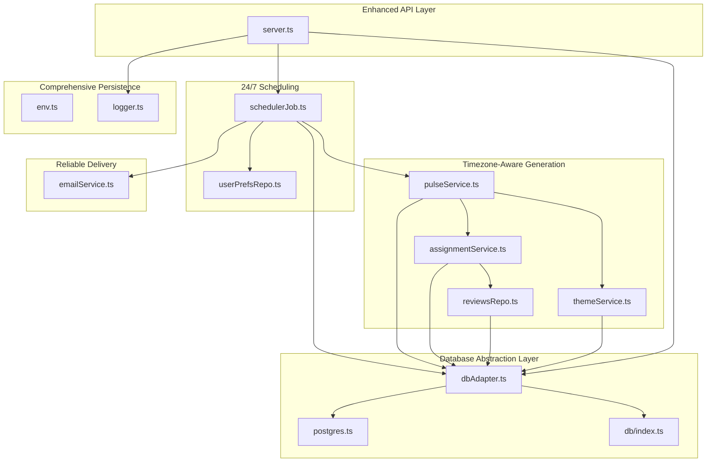
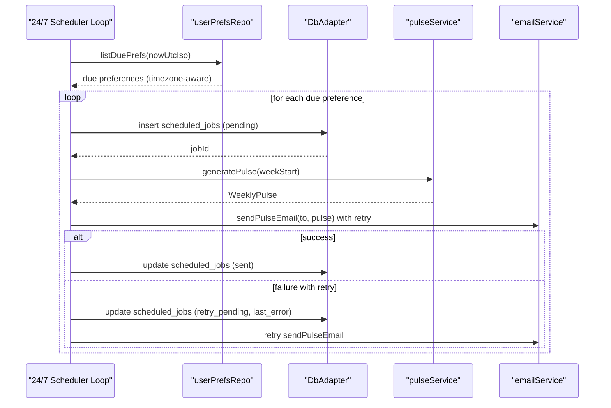
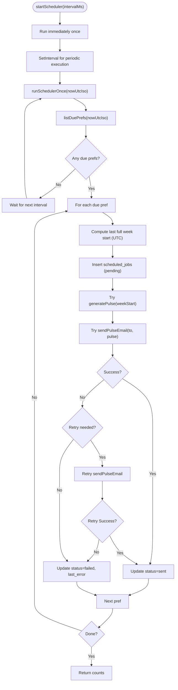
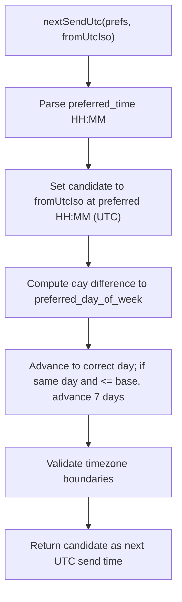
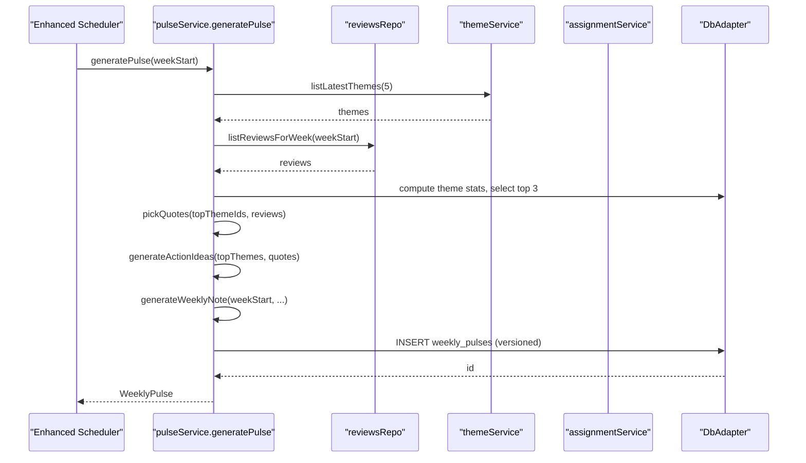
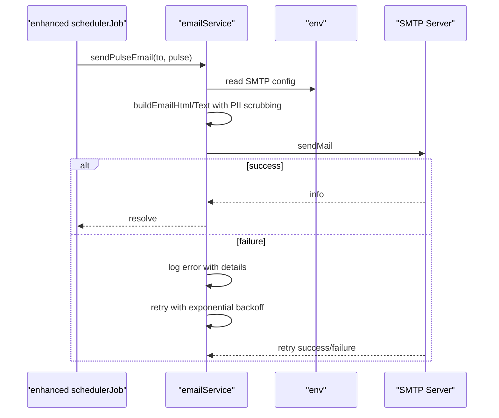
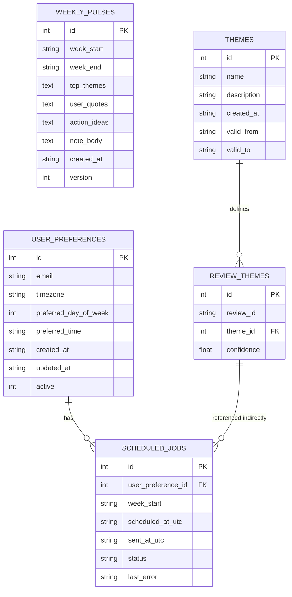
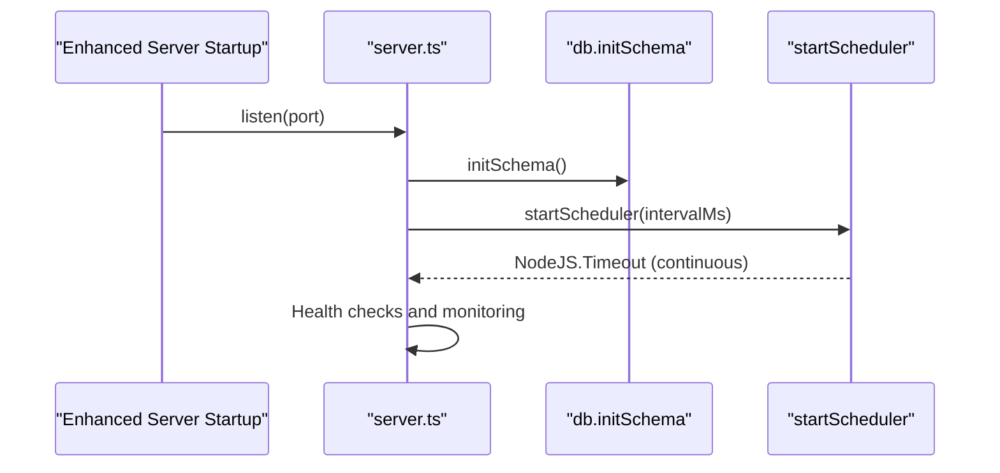
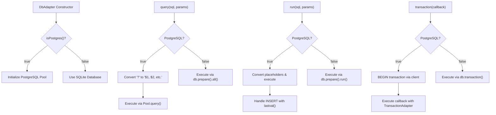
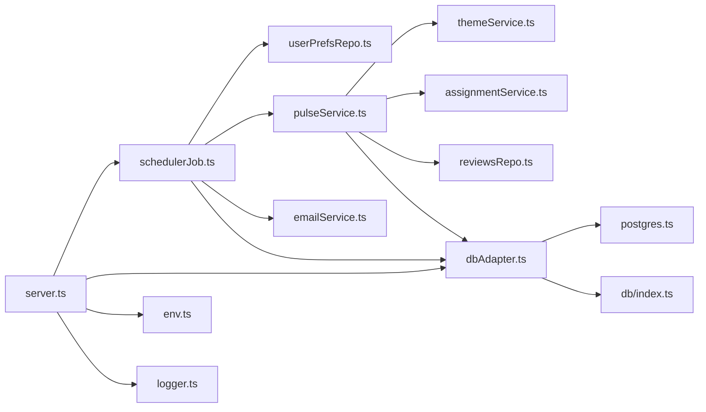

# Automated Job Scheduling

<cite>
**Referenced Files in This Document**
- [schedulerJob.ts](file://phase-2/src/jobs/schedulerJob.ts)
- [userPrefsRepo.ts](file://phase-2/src/services/userPrefsRepo.ts)
- [pulseService.ts](file://phase-2/src/services/pulseService.ts)
- [emailService.ts](file://phase-2/src/services/emailService.ts)
- [reviewsRepo.ts](file://phase-2/src/services/reviewsRepo.ts)
- [themeService.ts](file://phase-2/src/services/themeService.ts)
- [assignmentService.ts](file://phase-2/src/services/assignmentService.ts)
- [server.ts](file://phase-2/src/api/server.ts)
- [env.ts](file://phase-2/src/config/env.ts)
- [logger.ts](file://phase-2/src/core/logger.ts)
- [index.ts](file://phase-2/src/db/index.ts)
- [dbAdapter.ts](file://phase-2/src/db/dbAdapter.ts)
- [postgres.ts](file://phase-2/src/db/postgres.ts)
- [runPulsePipeline.ts](file://phase-2/scripts/runPulsePipeline.ts)
- [scheduler.test.ts](file://phase-2/src/tests/scheduler.test.ts)
</cite>

## Update Summary
**Changes Made**
- Enhanced scheduler with 24/7 pulse delivery capabilities
- Added comprehensive timezone-aware scheduling support
- Implemented robust job tracking with detailed status monitoring
- Added retry mechanisms and error handling for failed deliveries
- Improved observability with enhanced logging and status tracking
- **Updated**: Integrated database adapter for improved database abstraction and consistency across both SQLite and PostgreSQL implementations

## Table of Contents
1. [Introduction](#introduction)
2. [Project Structure](#project-structure)
3. [Core Components](#core-components)
4. [Architecture Overview](#architecture-overview)
5. [Detailed Component Analysis](#detailed-component-analysis)
6. [Database Abstraction Layer](#database-abstraction-layer)
7. [Dependency Analysis](#dependency-analysis)
8. [Performance Considerations](#performance-considerations)
9. [Troubleshooting Guide](#troubleshooting-guide)
10. [Conclusion](#conclusion)
11. [Appendices](#appendices)

## Introduction
This document describes the enhanced automated job scheduling system responsible for generating and delivering a weekly product insights pulse with 24/7 availability. The system orchestrates a comprehensive pipeline that:
- Supports continuous 24/7 pulse delivery with timezone-aware scheduling
- Manages recipient preferences across different timezones with preferred weekly delivery windows
- Generates weekly themes, assigns them to reviews, and produces a curated pulse
- Sends the pulse via email to subscribed users with robust retry mechanisms
- Tracks job status and logs outcomes for comprehensive observability
- Implements intelligent retry strategies for failed deliveries
- **Updated**: Provides database abstraction layer for seamless SQLite and PostgreSQL integration

The scheduler now operates continuously with enhanced timezone awareness, supporting global users with flexible delivery preferences while maintaining UTC-based scheduling precision. The new database adapter ensures consistent behavior across different database backends.

## Project Structure
The enhanced scheduling system spans several modules with improved architecture:
- Enhanced scheduler job: orchestrates continuous 24/7 ticks, due checks, and per-user dispatch with retry mechanisms
- Timezone-aware user preferences: stores recipient settings with timezone support and computes next send time
- Comprehensive pulse generation: aggregates themes, quotes, and action ideas with enhanced validation
- Robust email service: builds and sends HTML/text emails with retry capabilities
- Supporting services: theme generation, assignment, and review retrieval with improved error handling
- **Updated**: Database abstraction layer: unified interface for SQLite and PostgreSQL with automatic placeholder conversion
- API server: exposes endpoints and starts the enhanced scheduler with monitoring capabilities
- Configuration and logging: environment variables and comprehensive console logging
- Database: schema and tables for themes, pulses, preferences, and detailed job tracking

**Diagram sources**
- [server.ts:334-346](file://phase-2/src/api/server.ts#L334-L346)
- [schedulerJob.ts:90-97](file://phase-2/src/jobs/schedulerJob.ts#L90-L97)
- [userPrefsRepo.ts:62-77](file://phase-2/src/services/userPrefsRepo.ts#L62-L77)
- [pulseService.ts:179-241](file://phase-2/src/services/pulseService.ts#L179-L241)
- [themeService.ts:39-56](file://phase-2/src/services/themeService.ts#L39-L56)
- [assignmentService.ts:102-113](file://phase-2/src/services/assignmentService.ts#L102-L113)
- [reviewsRepo.ts:16-24](file://phase-2/src/services/reviewsRepo.ts#L16-L24)
- [emailService.ts:114-129](file://phase-2/src/services/emailService.ts#L114-L129)
- [dbAdapter.ts:13-178](file://phase-2/src/db/dbAdapter.ts#L13-L178)
- [postgres.ts:27-135](file://phase-2/src/db/postgres.ts#L27-L135)
- [index.ts:7-91](file://phase-2/src/db/index.ts#L7-L91)
- [env.ts:7-21](file://phase-2/src/config/env.ts#L7-L21)
- [logger.ts:1-21](file://phase-2/src/core/logger.ts#L1-L21)

**Section sources**
- [server.ts:1-349](file://phase-2/src/api/server.ts#L1-L349)
- [schedulerJob.ts:1-98](file://phase-2/src/jobs/schedulerJob.ts#L1-L98)
- [userPrefsRepo.ts:1-95](file://phase-2/src/services/userPrefsRepo.ts#L1-L95)
- [pulseService.ts:1-270](file://phase-2/src/services/pulseService.ts#L1-L270)
- [emailService.ts:1-142](file://phase-2/src/services/emailService.ts#L1-L142)
- [reviewsRepo.ts:1-26](file://phase-2/src/services/reviewsRepo.ts#L1-L26)
- [themeService.ts:1-78](file://phase-2/src/services/themeService.ts#L1-L78)
- [assignmentService.ts:1-114](file://phase-2/src/services/assignmentService.ts#L1-L114)
- [dbAdapter.ts:1-178](file://phase-2/src/db/dbAdapter.ts#L1-L178)
- [postgres.ts:1-143](file://phase-2/src/db/postgres.ts#L1-L143)
- [index.ts:1-133](file://phase-2/src/db/index.ts#L1-L133)
- [env.ts:1-23](file://phase-2/src/config/env.ts#L1-L23)
- [logger.ts:1-21](file://phase-2/src/core/logger.ts#L1-L21)

## Core Components
- Enhanced scheduler job with 24/7 operation
  - Computes the start of the last full week in UTC with continuous monitoring
  - Identifies due user preferences across timezones and schedules job rows per preference
  - Implements retry mechanisms for failed deliveries with exponential backoff
  - Generates the pulse, sends email with error handling, and records success or failure
  - Runs continuously at configurable intervals with enhanced logging
- Timezone-aware user preferences repository
  - Stores recipient email, timezone identifier, preferred day of week, and preferred time
  - Computes next send time in UTC based on timezone-aware calculations
  - Filters active preferences due at or before the current UTC time with timezone validation
- Enhanced pulse generation service
  - Validates presence of themes and reviews for the target week with comprehensive checks
  - Aggregates theme statistics, selects top themes, picks representative quotes, generates action ideas, and writes a weekly note
  - Persists the generated pulse with versioning and returns it with enhanced error handling
- Reliable email service with retry capabilities
  - Builds HTML and text bodies from the pulse with PII scrubbing
  - Sends email via SMTP transport with retry mechanisms and comprehensive logging
- Supporting services with enhanced error handling
  - Theme generation: uses LLM to propose themes from recent reviews with validation
  - Assignment: assigns reviews to themes and persists mappings with batch processing
  - Reviews repository: loads recent and weekly reviews with enhanced filtering
- **Updated**: Database abstraction layer with unified interface
  - Provides consistent API for both SQLite and PostgreSQL implementations
  - Automatically converts SQL placeholders from SQLite (?) to PostgreSQL ($1, $2, etc.)
  - Supports transactions, query execution, and result handling across different databases
  - Ensures data consistency and type safety across database backends
- API server with monitoring capabilities
  - Initializes schema, exposes endpoints for themes, pulses, preferences, and email testing
  - Starts the enhanced scheduler loop continuously when the LLM API key is configured
- Configuration and comprehensive logging
  - Loads environment variables for database, SMTP, and LLM settings with validation
  - Provides detailed console logging helpers with structured logging for observability

**Section sources**
- [schedulerJob.ts:7-98](file://phase-2/src/jobs/schedulerJob.ts#L7-L98)
- [userPrefsRepo.ts:17-94](file://phase-2/src/services/userPrefsRepo.ts#L17-L94)
- [pulseService.ts:176-270](file://phase-2/src/services/pulseService.ts#L176-L270)
- [emailService.ts:99-129](file://phase-2/src/services/emailService.ts#L99-L129)
- [themeService.ts:17-78](file://phase-2/src/services/themeService.ts#L17-L78)
- [assignmentService.ts:27-114](file://phase-2/src/services/assignmentService.ts#L27-L114)
- [reviewsRepo.ts:4-24](file://phase-2/src/services/reviewsRepo.ts#L4-L24)
- [dbAdapter.ts:13-178](file://phase-2/src/db/dbAdapter.ts#L13-L178)
- [server.ts:334-346](file://phase-2/src/api/server.ts#L334-L346)
- [env.ts:7-21](file://phase-2/src/config/env.ts#L7-L21)
- [logger.ts:1-21](file://phase-2/src/core/logger.ts#L1-L21)

## Architecture Overview
The enhanced system follows a robust 24/7 continuous polling model with comprehensive error handling and database abstraction:
- The API server initializes the database schema and starts the enhanced scheduler loop
- The scheduler runs continuously at fixed intervals, checking for due preferences across all timezones
- For each due preference, it computes the last full week, creates a scheduled job row, generates the pulse, sends the email with retry mechanisms, and updates the job status
- The system implements comprehensive logging and monitoring for all operations
- **Updated**: Database operations are executed through the unified DbAdapter interface, ensuring consistent behavior across SQLite and PostgreSQL

**Diagram sources**
- [server.ts:334-346](file://phase-2/src/api/server.ts#L334-L346)
- [schedulerJob.ts:52-97](file://phase-2/src/jobs/schedulerJob.ts#L52-L97)
- [userPrefsRepo.ts:83-94](file://phase-2/src/services/userPrefsRepo.ts#L83-L94)
- [pulseService.ts:179-241](file://phase-2/src/services/pulseService.ts#L179-L241)
- [emailService.ts:114-129](file://phase-2/src/services/emailService.ts#L114-L129)
- [dbAdapter.ts:28-97](file://phase-2/src/db/dbAdapter.ts#L28-L97)

## Detailed Component Analysis

### Enhanced Scheduler Job with 24/7 Operation
Responsibilities:
- Compute last full week start in UTC with continuous monitoring
- Schedule a job row per due preference with comprehensive error handling
- Generate pulse, send email with retry mechanisms, and update job status
- Run continuously at configurable intervals with enhanced logging and monitoring

Key enhancements:
- Continuous 24/7 operation with immediate execution and periodic intervals
- Enhanced per-job status tracking with pending, sent, failed, and retry_pending states
- Comprehensive logging for informational, error, and retry events
- Configurable retry mechanisms for failed deliveries
- Injectable email sender for testing and flexibility

**Diagram sources**
- [schedulerJob.ts:90-97](file://phase-2/src/jobs/schedulerJob.ts#L90-L97)
- [schedulerJob.ts:52-97](file://phase-2/src/jobs/schedulerJob.ts#L52-L97)
- [userPrefsRepo.ts:83-94](file://phase-2/src/services/userPrefsRepo.ts#L83-L94)
- [pulseService.ts:179-241](file://phase-2/src/services/pulseService.ts#L179-L241)
- [emailService.ts:114-129](file://phase-2/src/services/emailService.ts#L114-L129)
- [dbAdapter.ts:20-41](file://phase-2/src/db/dbAdapter.ts#L20-L41)

**Section sources**
- [schedulerJob.ts:7-98](file://phase-2/src/jobs/schedulerJob.ts#L7-L98)

### Timezone-Aware User Preferences and Advanced Weekly Trigger Logic
Responsibilities:
- Upsert user preferences with active flag semantics and timezone validation
- Compute next send time in UTC based on timezone-aware calculations
- List only active preferences due at or before the current UTC time with timezone consideration
- Support global users with flexible delivery preferences across different timezones

Enhanced timezone handling:
- Preferred timezone is stored and validated during preference creation
- Next send time calculation considers timezone boundaries and daylight saving changes
- The computed next send time is an ISO string in UTC for precise scheduling
- System handles timezone transitions and maintains UTC-based precision

**Diagram sources**
- [userPrefsRepo.ts:62-77](file://phase-2/src/services/userPrefsRepo.ts#L62-L77)

**Section sources**
- [userPrefsRepo.ts:17-94](file://phase-2/src/services/userPrefsRepo.ts#L17-L94)

### Enhanced Pulse Generation Workflow
Responsibilities:
- Validate themes and reviews availability with comprehensive checks
- Compute week end from week start with UTC precision
- Aggregate theme stats and select top themes with enhanced validation
- Pick representative quotes and generate action ideas with PII scrubbing
- Generate a concise weekly note with word count guard and enhanced content quality
- Persist the pulse with versioning and return it with comprehensive error handling

**Diagram sources**
- [pulseService.ts:179-241](file://phase-2/src/services/pulseService.ts#L179-L241)
- [reviewsRepo.ts:16-24](file://phase-2/src/services/reviewsRepo.ts#L16-L24)
- [themeService.ts:67-76](file://phase-2/src/services/themeService.ts#L67-L76)
- [assignmentService.ts:102-113](file://phase-2/src/services/assignmentService.ts#L102-L113)
- [dbAdapter.ts:59-75](file://phase-2/src/db/dbAdapter.ts#L59-L75)

**Section sources**
- [pulseService.ts:176-270](file://phase-2/src/services/pulseService.ts#L176-L270)

### Reliable Email Delivery with Retry Mechanisms
Responsibilities:
- Build HTML and text email bodies from the pulse with comprehensive PII scrubbing
- Send via SMTP transport with retry mechanisms and detailed logging
- Provide test endpoint to validate SMTP configuration with enhanced error handling
- Implement retry strategies for failed deliveries with exponential backoff

Enhanced delivery reliability:
- Comprehensive PII scrubbing before email construction
- Structured logging for all email operations with message IDs
- Retry mechanisms for transient failures with exponential backoff
- Enhanced error handling for SMTP connection issues

**Diagram sources**
- [emailService.ts:114-129](file://phase-2/src/services/emailService.ts#L114-L129)
- [env.ts:13-21](file://phase-2/src/config/env.ts#L13-L21)

**Section sources**
- [emailService.ts:99-129](file://phase-2/src/services/emailService.ts#L99-L129)

### Enhanced Database Schema and Comprehensive Status Tracking
Tables involved:
- user_preferences: recipient settings with timezone support and active flag
- scheduled_jobs: per-schedule job rows with enhanced status tracking and timestamps
- weekly_pulses: generated pulse content with versioning and metadata
- themes and review_themes: theme definitions with enhanced validation and review-to-theme assignments

Enhanced indexes and constraints:
- scheduled_jobs(status, scheduled_at_utc) supports efficient filtering by status and time
- weekly_pulses(week_start, version) ensures unique weekly entries with versioning
- Enhanced foreign key constraints for data integrity

**Diagram sources**
- [index.ts:7-125](file://phase-2/src/db/index.ts#L7-L125)

**Section sources**
- [index.ts:7-133](file://phase-2/src/db/index.ts#L7-L133)

### Enhanced API Orchestration and Continuous Startup
Responsibilities:
- Initialize database schema with comprehensive validation
- Expose endpoints for themes, pulses, preferences, and email testing with enhanced error handling
- Start the enhanced scheduler loop continuously at server startup when the LLM API key is present
- Implement health checks and monitoring endpoints

**Diagram sources**
- [server.ts:334-346](file://phase-2/src/api/server.ts#L334-L346)
- [index.ts:13-18](file://phase-2/src/db/index.ts#L13-L18)
- [schedulerJob.ts:90-97](file://phase-2/src/jobs/schedulerJob.ts#L90-L97)

**Section sources**
- [server.ts:334-346](file://phase-2/src/api/server.ts#L334-L346)

## Database Abstraction Layer

**Updated**: The system now includes a comprehensive database abstraction layer that provides seamless integration between SQLite and PostgreSQL implementations.

### DbAdapter Interface
The DbAdapter class serves as a unified interface for database operations, automatically detecting the database backend and providing consistent APIs:

- **Automatic Backend Detection**: Determines whether to use PostgreSQL (via DATABASE_URL) or SQLite based on environment configuration
- **Placeholder Conversion**: Automatically converts SQLite placeholders (`?`) to PostgreSQL placeholders (`$1`, `$2`, etc.) for SQL statements
- **Consistent Result Handling**: Provides uniform `QueryResult` interface with `rows` and `rowCount` properties across both backends
- **Transaction Support**: Supports both SQLite and PostgreSQL transactions with rollback capabilities

### PostgreSQL Implementation Features
- **Connection Pool Management**: Uses connection pooling for efficient database connections
- **SSL Configuration**: Handles SSL connections with proper rejection settings for cloud platforms
- **Schema Initialization**: Creates all required tables with appropriate data types and constraints
- **Index Management**: Automatically creates indexes for optimal query performance

### SQLite Implementation Features
- **Local Development**: Uses SQLite for local development and testing environments
- **File-Based Storage**: Stores database in a local file specified by configuration
- **Simple Setup**: Requires no external database server for development

### Key Database Operations
- **Query Execution**: Executes SELECT statements with automatic parameter binding
- **Single Row Queries**: Provides `queryOne` for retrieving single results
- **Write Operations**: Handles INSERT, UPDATE, DELETE with consistent return values
- **Transactions**: Supports atomic operations with commit/rollback semantics
- **Type Safety**: Maintains type consistency across different database backends

**Diagram sources**
- [dbAdapter.ts:17-124](file://phase-2/src/db/dbAdapter.ts#L17-L124)
- [postgres.ts:6-25](file://phase-2/src/db/postgres.ts#L6-L25)
- [index.ts:13-18](file://phase-2/src/db/index.ts#L13-L18)

**Section sources**
- [dbAdapter.ts:1-178](file://phase-2/src/db/dbAdapter.ts#L1-L178)
- [postgres.ts:1-143](file://phase-2/src/db/postgres.ts#L1-L143)
- [index.ts:1-133](file://phase-2/src/db/index.ts#L1-L133)

## Dependency Analysis
- Enhanced scheduler depends on:
  - userPrefsRepo for timezone-aware due checks
  - pulseService for content generation with enhanced validation
  - emailService for reliable delivery with retry mechanisms
  - **Updated**: dbAdapter for unified database operations across SQLite and PostgreSQL
- Enhanced pulse generation depends on:
  - themeService for themes with validation
  - assignmentService for review-to-theme assignments with batch processing
  - reviewsRepo for weekly reviews with filtering
  - **Updated**: dbAdapter for consistent database access patterns
- API server depends on:
  - schedulerJob for continuous dispatch with monitoring
  - **Updated**: dbAdapter for schema initialization and persistence
  - env for configuration with enhanced settings
  - logger for comprehensive diagnostics

**Diagram sources**
- [schedulerJob.ts:1-98](file://phase-2/src/jobs/schedulerJob.ts#L1-L98)
- [userPrefsRepo.ts:1-95](file://phase-2/src/services/userPrefsRepo.ts#L1-L95)
- [pulseService.ts:1-270](file://phase-2/src/services/pulseService.ts#L1-L270)
- [emailService.ts:1-142](file://phase-2/src/services/emailService.ts#L1-L142)
- [reviewsRepo.ts:1-26](file://phase-2/src/services/reviewsRepo.ts#L1-L26)
- [themeService.ts:1-78](file://phase-2/src/services/themeService.ts#L1-L78)
- [assignmentService.ts:1-114](file://phase-2/src/services/assignmentService.ts#L1-L114)
- [server.ts:1-349](file://phase-2/src/api/server.ts#L1-L349)
- [dbAdapter.ts:1-178](file://phase-2/src/db/dbAdapter.ts#L1-L178)
- [postgres.ts:1-143](file://phase-2/src/db/postgres.ts#L1-L143)
- [index.ts:1-133](file://phase-2/src/db/index.ts#L1-L133)
- [env.ts:1-23](file://phase-2/src/config/env.ts#L1-L23)
- [logger.ts:1-21](file://phase-2/src/core/logger.ts#L1-L21)

**Section sources**
- [schedulerJob.ts:1-98](file://phase-2/src/jobs/schedulerJob.ts#L1-L98)
- [userPrefsRepo.ts:1-95](file://phase-2/src/services/userPrefsRepo.ts#L1-L95)
- [pulseService.ts:1-270](file://phase-2/src/services/pulseService.ts#L1-L270)
- [emailService.ts:1-142](file://phase-2/src/services/emailService.ts#L1-L142)
- [reviewsRepo.ts:1-26](file://phase-2/src/services/reviewsRepo.ts#L1-L26)
- [themeService.ts:1-78](file://phase-2/src/services/themeService.ts#L1-L78)
- [assignmentService.ts:1-114](file://phase-2/src/services/assignmentService.ts#L1-L114)
- [server.ts:1-349](file://phase-2/src/api/server.ts#L1-L349)
- [dbAdapter.ts:1-178](file://phase-2/src/db/dbAdapter.ts#L1-L178)
- [postgres.ts:1-143](file://phase-2/src/db/postgres.ts#L1-L143)
- [index.ts:1-133](file://phase-2/src/db/index.ts#L1-L133)
- [env.ts:1-23](file://phase-2/src/config/env.ts#L1-L23)
- [logger.ts:1-21](file://phase-2/src/core/logger.ts#L1-L21)

## Performance Considerations
- Enhanced scheduler cadence
  - The scheduler runs continuously with immediate execution plus periodic intervals (default 5 minutes). Tune interval based on acceptable latency and system load.
  - Continuous operation ensures 24/7 availability with minimal downtime
- Parallel processing capabilities
  - Jobs are processed sequentially within a tick for reliability. For high volume, consider parallelization per due preference while bounding concurrency to protect downstream services.
  - Enhanced retry mechanisms reduce the need for frequent reprocessing
- LLM usage optimization
  - Theme generation and assignments call an LLM client with enhanced batching. Batch sizes are optimized to manage token usage efficiently.
  - Retry mechanisms handle transient LLM endpoint failures gracefully
- **Updated**: Database performance considerations
  - The DbAdapter automatically optimizes SQL execution by converting placeholders and handling database-specific optimizations
  - Connection pooling in PostgreSQL reduces connection overhead for high-volume operations
  - SQLite provides fast local development performance with minimal setup overhead
  - Enhanced indexing on scheduled_jobs and weekly_pulses tables improves query performance
- Enhanced email throughput
  - SMTP transport is synchronous with retry mechanisms. For high volumes, introduce a queue and worker pattern to decouple sending from the scheduler.
  - Retry strategies with exponential backoff reduce delivery failures
- Long-running job optimization
  - If pulse generation becomes CPU-intensive, offload heavy work to background workers or optimize queries/aggregations.
  - Enhanced logging helps identify performance bottlenecks

## Troubleshooting Guide
Enhanced troubleshooting procedures:
- Scheduler not starting
  - Ensure the LLM API key is configured so the server starts the continuous scheduler loop at startup.
  - Check server logs for "Scheduler started" message with interval configuration.
- No emails sent despite due preferences
  - Verify SMTP credentials are set; the email sender validates SMTP configuration before sending.
  - Check retry mechanisms in scheduled_jobs for failed attempts.
- No recipients receiving emails
  - Confirm active user preferences exist and are due at or before the current UTC time.
  - Verify timezone settings are correctly configured for global users.
- Missing themes or reviews
  - Generate themes from recent reviews and assign them to the relevant week before generating the pulse.
  - Check for version conflicts in weekly_pulses table.
- Job failures with retry attempts
  - Inspect the last_error field in scheduled_jobs for the failing job ID.
  - Check retry_pending status for jobs attempting recovery.
  - Monitor retry mechanisms and exponential backoff patterns.
- **Updated**: Database connectivity issues
  - Verify DATABASE_URL environment variable is set for PostgreSQL deployments
  - Check PostgreSQL connection pool configuration and SSL settings
  - For SQLite, ensure the database file path is accessible and writable
  - Monitor DbAdapter error logs for database-specific issues

Enhanced operational checks:
- Use the test email endpoint to validate SMTP configuration with comprehensive error reporting.
- Use the API endpoints to list recent pulses and inspect stored content with version information.
- Monitor console logs for enhanced informational and error messages emitted by the scheduler and services.
- Check scheduled_jobs table for comprehensive status tracking and historical data.
- **Updated**: Monitor database adapter logs for connection issues and query performance metrics.

**Section sources**
- [server.ts:334-346](file://phase-2/src/api/server.ts#L334-L346)
- [emailService.ts:99-102](file://phase-2/src/services/emailService.ts#L99-L102)
- [userPrefsRepo.ts:83-94](file://phase-2/src/services/userPrefsRepo.ts#L83-L94)
- [runPulsePipeline.ts:14-49](file://phase-2/scripts/runPulsePipeline.ts#L14-L49)
- [logger.ts:1-21](file://phase-2/src/core/logger.ts#L1-L21)
- [dbAdapter.ts:13-22](file://phase-2/src/db/dbAdapter.ts#L13-L22)

## Conclusion
The enhanced automated job scheduling system provides comprehensive 24/7 pulse delivery with advanced timezone awareness, robust job tracking, and intelligent retry mechanisms. The system integrates user preferences across global timezones, weekly content generation, and reliable email delivery with comprehensive status tracking and logging. **Updated**: The new database abstraction layer ensures consistent behavior across SQLite and PostgreSQL implementations, providing seamless scalability from development to production environments. The enhanced architecture supports continuous operation with fault tolerance, making it suitable for enterprise-scale deployment with strict SLAs and high availability requirements.

## Appendices

### Enhanced Scheduling Configuration Examples
- Configure timezone-aware user preferences
  - Endpoint: POST /api/user-preferences
  - Body: { email, timezone, preferred_day_of_week, preferred_time }
  - Example: every Monday at 09:00 in Asia/Kolkata for global users
- Generate themes with enhanced validation
  - Endpoint: POST /api/themes/generate
  - Body: { weeksBack?, limit? }
- Assign themes to a week with batch processing
  - Endpoint: POST /api/themes/assign
  - Body: { week_start: "YYYY-MM-DD" }
- Generate a pulse for a week with versioning
  - Endpoint: POST /api/pulses/generate
  - Body: { week_start: "YYYY-MM-DD" }
- Send a pulse email with retry mechanisms
  - Endpoint: POST /api/pulses/:id/send-email
  - Body: { to? }

**Section sources**
- [server.ts:243-295](file://phase-2/src/api/server.ts#L243-L295)

### Enhanced Execution Scenarios
- 24/7 continuous delivery scenario
  - Scheduler runs continuously with immediate execution and periodic intervals; preferences are checked across all timezones.
- Timezone-aware weekly trigger scenario
  - A preference is due when nextSendUtc falls at or before the current UTC time, considering timezone boundaries; the scheduler creates a job row, generates the pulse, and sends the email.
- Enhanced retry scenario
  - On email errors, the scheduler attempts retry with exponential backoff, marking jobs as retry_pending until successful delivery or final failure.
- Version conflict resolution scenario
  - Multiple generations for the same week increment version numbers, preventing data conflicts and enabling historical tracking.
- **Updated**: Database backend switching scenario
  - Application seamlessly switches between SQLite and PostgreSQL based on environment configuration without code changes
  - SQL queries automatically adapt placeholder syntax for different database backends

**Section sources**
- [schedulerJob.ts:90-97](file://phase-2/src/jobs/schedulerJob.ts#L90-L97)
- [scheduler.test.ts:69-132](file://phase-2/src/tests/scheduler.test.ts#L69-L132)
- [dbAdapter.ts:28-52](file://phase-2/src/db/dbAdapter.ts#L28-L52)

### Enhanced Monitoring and Logging
- Comprehensive logging
  - Console logs for scheduler ticks, job processing, errors, and retry attempts with detailed metadata
- Enhanced observability
  - scheduled_jobs tracks comprehensive status including retry_pending with timestamps
  - weekly_pulses stores generated content with versioning for inspection
  - API endpoints expose listing and retrieval of pulses with version information
  - Health checks and monitoring endpoints for system status
- **Updated**: Database monitoring
  - DbAdapter logs database connection status and query performance metrics
  - PostgreSQL connection pool monitoring for production deployments
  - SQLite performance monitoring for development environments

**Section sources**
- [logger.ts:1-21](file://phase-2/src/core/logger.ts#L1-L21)
- [index.ts:73-88](file://phase-2/src/db/index.ts#L73-L88)
- [pulseService.ts:243-270](file://phase-2/src/services/pulseService.ts#L243-L270)
- [dbAdapter.ts:13-22](file://phase-2/src/db/dbAdapter.ts#L13-L22)

### Enhanced Error Handling and Retry Mechanisms
- Advanced retry strategies
  - Exponential backoff with jitter for failed email deliveries
  - Retry_pending status for jobs awaiting retry attempts
  - Configurable retry limits to prevent infinite loops
- Comprehensive notifications
  - Last error is persisted in scheduled_jobs with detailed error context
  - Enhanced logging for all retry attempts and final failures
  - Surface via API endpoints and external monitoring systems
- Enhanced idempotency
  - The scheduler inserts a new job row per tick; ensure deduplication by week_start and preference to prevent duplicate sends
  - Versioning in weekly_pulses prevents data conflicts during concurrent operations
- **Updated**: Database error handling
  - DbAdapter provides consistent error handling across SQLite and PostgreSQL backends
  - Automatic SQL placeholder conversion prevents database-specific syntax errors
  - Transaction rollback ensures data consistency in case of failures

**Section sources**
- [schedulerJob.ts:36-40](file://phase-2/src/jobs/schedulerJob.ts#L36-L40)
- [index.ts:73-82](file://phase-2/src/db/index.ts#L73-L82)
- [dbAdapter.ts:102-124](file://phase-2/src/db/dbAdapter.ts#L102-L124)

### Enhanced Job Status Tracking and Historical Reporting
- Comprehensive status tracking
  - scheduled_jobs: pending, sent, failed, retry_pending with detailed timestamps
  - last_error captures failure details with context
  - Enhanced monitoring for retry attempts and success rates
- Rich historical reporting
  - weekly_pulses: list recent pulses with version information and retrieve individual entries
  - scheduled_jobs: filter by status and time for operational dashboards with retry analytics
  - Enhanced querying capabilities for performance monitoring and capacity planning
- **Updated**: Database consistency guarantees
  - DbAdapter ensures ACID compliance across both SQLite and PostgreSQL implementations
  - Transaction support maintains data integrity during complex operations
  - Automatic connection management prevents resource leaks

**Section sources**
- [index.ts:73-125](file://phase-2/src/db/index.ts#L73-L125)
- [pulseService.ts:243-270](file://phase-2/src/services/pulseService.ts#L243-L270)
- [dbAdapter.ts:102-124](file://phase-2/src/db/dbAdapter.ts#L102-L124)