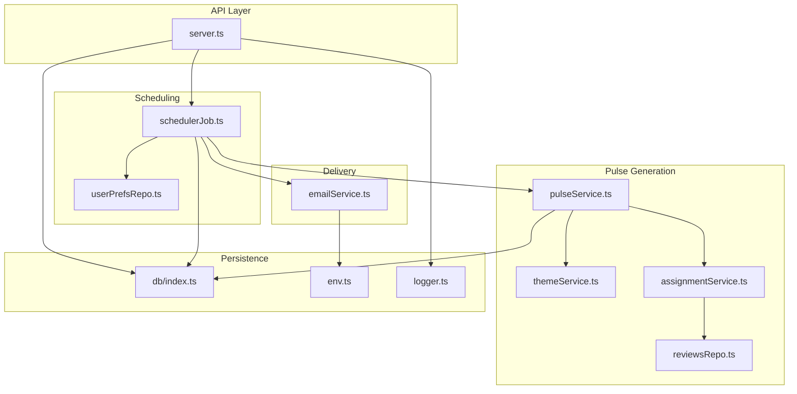
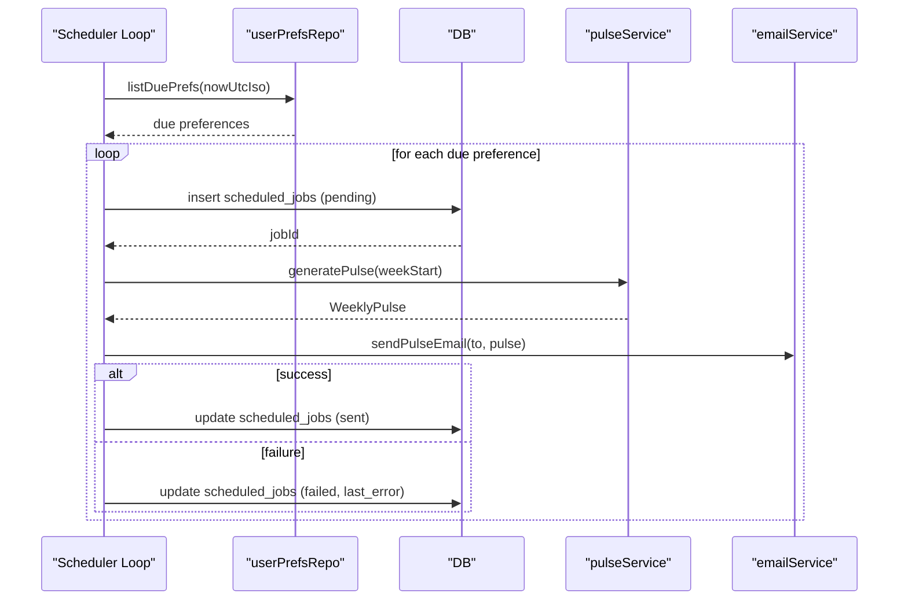
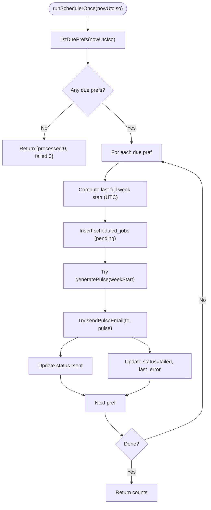
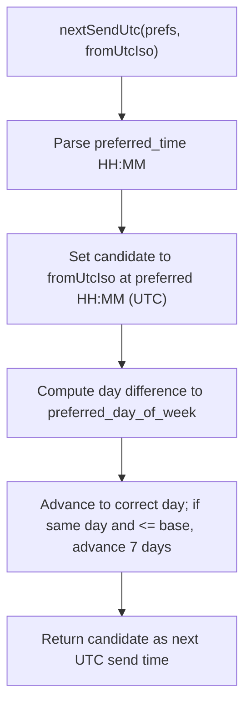
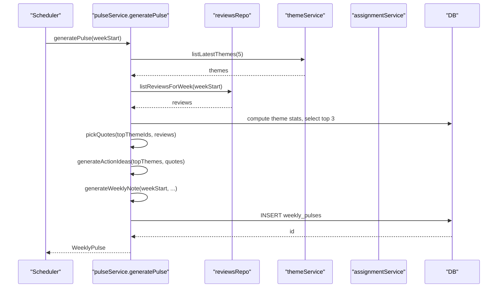
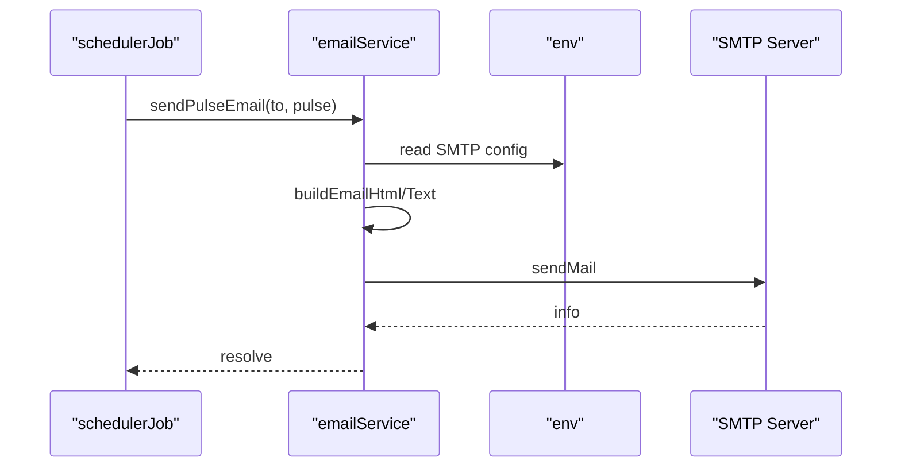
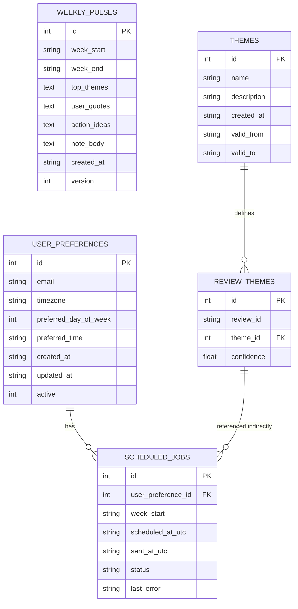
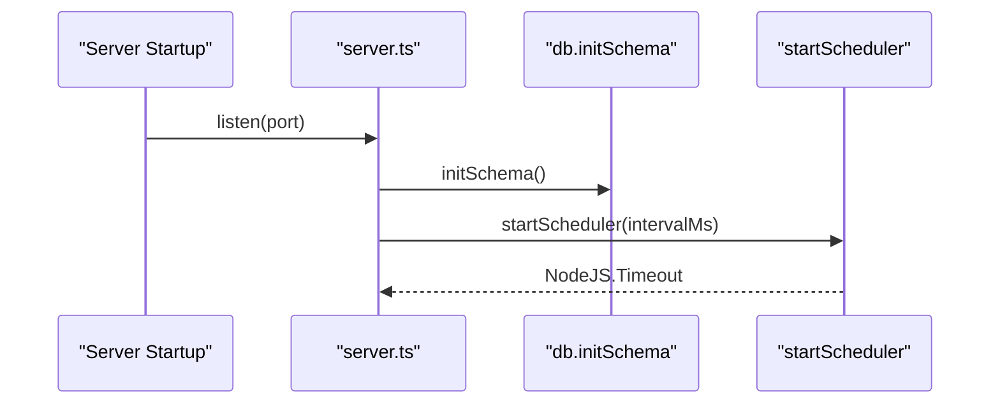
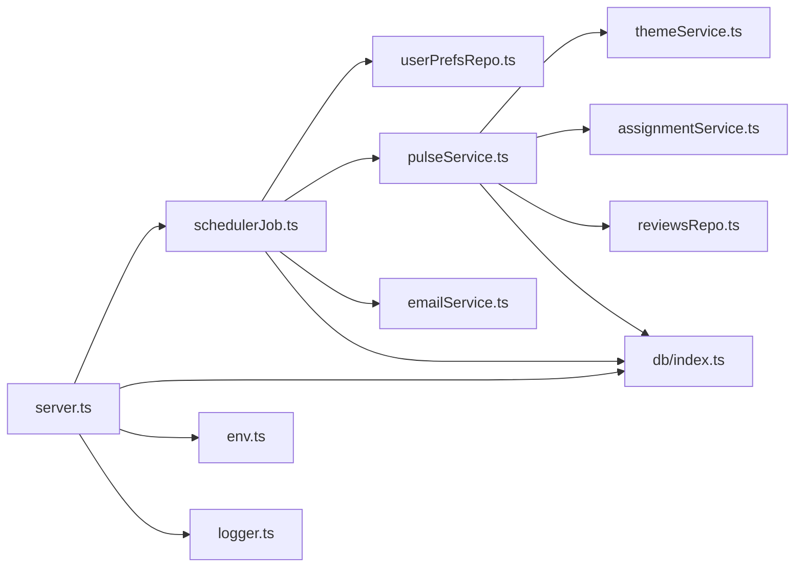

# Automated Job Scheduling

<cite>
**Referenced Files in This Document**
- [schedulerJob.ts](file://phase-2/src/jobs/schedulerJob.ts)
- [userPrefsRepo.ts](file://phase-2/src/services/userPrefsRepo.ts)
- [pulseService.ts](file://phase-2/src/services/pulseService.ts)
- [emailService.ts](file://phase-2/src/services/emailService.ts)
- [reviewsRepo.ts](file://phase-2/src/services/reviewsRepo.ts)
- [themeService.ts](file://phase-2/src/services/themeService.ts)
- [assignmentService.ts](file://phase-2/src/services/assignmentService.ts)
- [server.ts](file://phase-2/src/api/server.ts)
- [env.ts](file://phase-2/src/config/env.ts)
- [logger.ts](file://phase-2/src/core/logger.ts)
- [index.ts](file://phase-2/src/db/index.ts)
- [runPulsePipeline.ts](file://phase-2/scripts/runPulsePipeline.ts)
- [scheduler.test.ts](file://phase-2/src/tests/scheduler.test.ts)
</cite>

## Table of Contents
1. [Introduction](#introduction)
2. [Project Structure](#project-structure)
3. [Core Components](#core-components)
4. [Architecture Overview](#architecture-overview)
5. [Detailed Component Analysis](#detailed-component-analysis)
6. [Dependency Analysis](#dependency-analysis)
7. [Performance Considerations](#performance-considerations)
8. [Troubleshooting Guide](#troubleshooting-guide)
9. [Conclusion](#conclusion)
10. [Appendices](#appendices)

## Introduction
This document describes the automated job scheduling system responsible for generating and delivering a weekly product insights pulse. The system orchestrates a pipeline that:
- Determines recipients and their preferred weekly delivery windows
- Generates weekly themes, assigns them to reviews, and produces a curated pulse
- Sends the pulse via email to subscribed users
- Tracks job status and logs outcomes for observability

It supports weekly triggers aligned to a user’s preferred day and time, with UTC-based scheduling and timezone-aware computation. The scheduler runs periodically and dispatches emails only when due.

## Project Structure
The scheduling system spans several modules:
- Scheduler job: orchestrates periodic ticks, due checks, and per-user dispatch
- User preferences: stores recipient settings and computes next send time
- Pulse generation: aggregates themes, quotes, and action ideas
- Email service: builds and sends HTML/text emails
- Supporting services: theme generation, assignment, and review retrieval
- API server: exposes endpoints and starts the scheduler
- Configuration and logging: environment variables and console logging
- Database: schema and tables for themes, pulses, preferences, and scheduled jobs

**Diagram sources**
- [server.ts:251-263](file://phase-2/src/api/server.ts#L251-L263)
- [schedulerJob.ts:52-97](file://phase-2/src/jobs/schedulerJob.ts#L52-L97)
- [userPrefsRepo.ts:83-94](file://phase-2/src/services/userPrefsRepo.ts#L83-L94)
- [pulseService.ts:179-241](file://phase-2/src/services/pulseService.ts#L179-L241)
- [themeService.ts:39-56](file://phase-2/src/services/themeService.ts#L39-L56)
- [assignmentService.ts:102-113](file://phase-2/src/services/assignmentService.ts#L102-L113)
- [reviewsRepo.ts:16-24](file://phase-2/src/services/reviewsRepo.ts#L16-L24)
- [emailService.ts:114-129](file://phase-2/src/services/emailService.ts#L114-L129)
- [index.ts:7-91](file://phase-2/src/db/index.ts#L7-L91)
- [env.ts:7-21](file://phase-2/src/config/env.ts#L7-L21)
- [logger.ts:1-21](file://phase-2/src/core/logger.ts#L1-L21)

**Section sources**
- [server.ts:15-263](file://phase-2/src/api/server.ts#L15-L263)
- [schedulerJob.ts:1-98](file://phase-2/src/jobs/schedulerJob.ts#L1-L98)
- [userPrefsRepo.ts:1-95](file://phase-2/src/services/userPrefsRepo.ts#L1-L95)
- [pulseService.ts:1-265](file://phase-2/src/services/pulseService.ts#L1-L265)
- [emailService.ts:1-142](file://phase-2/src/services/emailService.ts#L1-L142)
- [reviewsRepo.ts:1-26](file://phase-2/src/services/reviewsRepo.ts#L1-L26)
- [themeService.ts:1-68](file://phase-2/src/services/themeService.ts#L1-L68)
- [assignmentService.ts:1-114](file://phase-2/src/services/assignmentService.ts#L1-L114)
- [index.ts:1-93](file://phase-2/src/db/index.ts#L1-L93)
- [env.ts:1-23](file://phase-2/src/config/env.ts#L1-L23)
- [logger.ts:1-21](file://phase-2/src/core/logger.ts#L1-L21)

## Core Components
- Scheduler job
  - Computes the start of the last full week in UTC
  - Identifies due user preferences and schedules a job row per preference
  - Generates the pulse, sends email, and records success or failure
  - Runs continuously at a fixed interval
- User preferences repository
  - Stores recipient email, timezone, preferred day of week, and preferred time
  - Computes next send time in UTC based on the preferred day/time
  - Filters active preferences due at or before the current UTC time
- Pulse generation service
  - Validates presence of themes and reviews for the target week
  - Aggregates theme statistics, selects top themes, picks representative quotes, generates action ideas, and writes a weekly note
  - Persists the generated pulse and returns it
- Email service
  - Builds HTML and text bodies from the pulse
  - Sends email via SMTP transport and logs outcome
- Supporting services
  - Theme generation: uses LLM to propose themes from recent reviews
  - Assignment: assigns reviews to themes and persists mappings
  - Reviews repository: loads recent and weekly reviews
- API server
  - Initializes schema, exposes endpoints for themes, pulses, preferences, and email testing
  - Starts the scheduler only when the LLM API key is configured
- Configuration and logging
  - Loads environment variables for database, SMTP, and LLM settings
  - Provides simple console logging helpers

**Section sources**
- [schedulerJob.ts:7-98](file://phase-2/src/jobs/schedulerJob.ts#L7-L98)
- [userPrefsRepo.ts:17-94](file://phase-2/src/services/userPrefsRepo.ts#L17-L94)
- [pulseService.ts:176-264](file://phase-2/src/services/pulseService.ts#L176-L264)
- [emailService.ts:99-129](file://phase-2/src/services/emailService.ts#L99-L129)
- [themeService.ts:17-56](file://phase-2/src/services/themeService.ts#L17-L56)
- [assignmentService.ts:27-113](file://phase-2/src/services/assignmentService.ts#L27-L113)
- [reviewsRepo.ts:4-24](file://phase-2/src/services/reviewsRepo.ts#L4-L24)
- [server.ts:251-263](file://phase-2/src/api/server.ts#L251-L263)
- [env.ts:7-21](file://phase-2/src/config/env.ts#L7-L21)
- [logger.ts:1-21](file://phase-2/src/core/logger.ts#L1-L21)

## Architecture Overview
The system follows a periodic polling model:
- The API server initializes the database schema and starts the scheduler loop
- The scheduler runs at a fixed interval, checking for due preferences
- For each due preference, it computes the last full week, creates a scheduled job row, generates the pulse, sends the email, and updates the job status

**Diagram sources**
- [server.ts:251-263](file://phase-2/src/api/server.ts#L251-L263)
- [schedulerJob.ts:52-97](file://phase-2/src/jobs/schedulerJob.ts#L52-L97)
- [userPrefsRepo.ts:83-94](file://phase-2/src/services/userPrefsRepo.ts#L83-L94)
- [pulseService.ts:179-241](file://phase-2/src/services/pulseService.ts#L179-L241)
- [emailService.ts:114-129](file://phase-2/src/services/emailService.ts#L114-L129)
- [index.ts:73-88](file://phase-2/src/db/index.ts#L73-L88)

## Detailed Component Analysis

### Scheduler Job
Responsibilities:
- Compute last full week start in UTC
- Schedule a job row per due preference
- Generate pulse, send email, and update job status
- Run continuously at a configurable interval

Key behaviors:
- Weekly trigger alignment computed via UTC day-of-week arithmetic
- Per-job status tracking with pending/sent/failed states and last error
- Logging for informational and error events

**Diagram sources**
- [schedulerJob.ts:52-97](file://phase-2/src/jobs/schedulerJob.ts#L52-L97)
- [userPrefsRepo.ts:83-94](file://phase-2/src/services/userPrefsRepo.ts#L83-L94)
- [pulseService.ts:179-241](file://phase-2/src/services/pulseService.ts#L179-L241)
- [emailService.ts:114-129](file://phase-2/src/services/emailService.ts#L114-L129)
- [index.ts:73-88](file://phase-2/src/db/index.ts#L73-L88)

**Section sources**
- [schedulerJob.ts:7-98](file://phase-2/src/jobs/schedulerJob.ts#L7-L98)

### User Preferences and Weekly Trigger Logic
Responsibilities:
- Upsert user preferences with active flag semantics
- Compute next send time in UTC based on preferred day of week and time
- List only active preferences due at or before the current UTC time

Timezone handling:
- Preferred time is treated as UTC-equivalent for scheduling
- The computed next send time is an ISO string in UTC
- The system does not apply timezone offset during scheduling; recipients’ local time is considered conceptually via the preferred day/time

**Diagram sources**
- [userPrefsRepo.ts:62-77](file://phase-2/src/services/userPrefsRepo.ts#L62-L77)

**Section sources**
- [userPrefsRepo.ts:17-94](file://phase-2/src/services/userPrefsRepo.ts#L17-L94)

### Pulse Generation Workflow
Responsibilities:
- Validate themes and reviews availability
- Compute week end from week start
- Aggregate theme stats and select top themes
- Pick representative quotes and generate action ideas
- Generate a concise weekly note with word count guard
- Persist the pulse and return it

**Diagram sources**
- [pulseService.ts:179-241](file://phase-2/src/services/pulseService.ts#L179-L241)
- [reviewsRepo.ts:16-24](file://phase-2/src/services/reviewsRepo.ts#L16-L24)
- [themeService.ts:58-66](file://phase-2/src/services/themeService.ts#L58-L66)
- [assignmentService.ts:102-113](file://phase-2/src/services/assignmentService.ts#L102-L113)
- [index.ts:41-57](file://phase-2/src/db/index.ts#L41-L57)

**Section sources**
- [pulseService.ts:176-264](file://phase-2/src/services/pulseService.ts#L176-L264)

### Email Delivery
Responsibilities:
- Build HTML and text email bodies from the pulse
- Send via SMTP transport and log success
- Provide a test endpoint to validate SMTP configuration

**Diagram sources**
- [emailService.ts:114-129](file://phase-2/src/services/emailService.ts#L114-L129)
- [env.ts:13-21](file://phase-2/src/config/env.ts#L13-L21)

**Section sources**
- [emailService.ts:99-129](file://phase-2/src/services/emailService.ts#L99-L129)

### Database Schema and Status Tracking
Tables involved:
- user_preferences: recipient settings and active flag
- scheduled_jobs: per-schedule job rows with status and timestamps
- weekly_pulses: generated pulse content and metadata
- themes and review_themes: theme definitions and review-to-theme assignments

Indexes:
- scheduled_jobs(status, scheduled_at_utc) supports efficient filtering by status and time

**Diagram sources**
- [index.ts:7-91](file://phase-2/src/db/index.ts#L7-L91)

**Section sources**
- [index.ts:7-91](file://phase-2/src/db/index.ts#L7-L91)

### API Orchestration and Startup
Responsibilities:
- Initialize database schema
- Expose endpoints for themes, pulses, preferences, and email testing
- Start the scheduler loop at server startup when the LLM API key is present

**Diagram sources**
- [server.ts:251-263](file://phase-2/src/api/server.ts#L251-L263)
- [index.ts:7-91](file://phase-2/src/db/index.ts#L7-L91)
- [schedulerJob.ts:90-97](file://phase-2/src/jobs/schedulerJob.ts#L90-L97)

**Section sources**
- [server.ts:251-263](file://phase-2/src/api/server.ts#L251-L263)

## Dependency Analysis
- Scheduler depends on:
  - userPrefsRepo for due checks
  - pulseService for content generation
  - emailService for delivery
  - db for persistence of scheduled_jobs and weekly_pulses
- Pulse generation depends on:
  - themeService for themes
  - assignmentService for review-to-theme assignments
  - reviewsRepo for weekly reviews
  - db for aggregations and inserts
- API server depends on:
  - schedulerJob for periodic dispatch
  - db for schema initialization
  - env for configuration
  - logger for diagnostics

**Diagram sources**
- [schedulerJob.ts:1-98](file://phase-2/src/jobs/schedulerJob.ts#L1-L98)
- [userPrefsRepo.ts:1-95](file://phase-2/src/services/userPrefsRepo.ts#L1-L95)
- [pulseService.ts:1-265](file://phase-2/src/services/pulseService.ts#L1-L265)
- [emailService.ts:1-142](file://phase-2/src/services/emailService.ts#L1-L142)
- [reviewsRepo.ts:1-26](file://phase-2/src/services/reviewsRepo.ts#L1-L26)
- [themeService.ts:1-68](file://phase-2/src/services/themeService.ts#L1-L68)
- [assignmentService.ts:1-114](file://phase-2/src/services/assignmentService.ts#L1-L114)
- [server.ts:1-266](file://phase-2/src/api/server.ts#L1-L266)
- [index.ts:1-93](file://phase-2/src/db/index.ts#L1-L93)
- [env.ts:1-23](file://phase-2/src/config/env.ts#L1-L23)
- [logger.ts:1-21](file://phase-2/src/core/logger.ts#L1-L21)

**Section sources**
- [schedulerJob.ts:1-98](file://phase-2/src/jobs/schedulerJob.ts#L1-L98)
- [userPrefsRepo.ts:1-95](file://phase-2/src/services/userPrefsRepo.ts#L1-L95)
- [pulseService.ts:1-265](file://phase-2/src/services/pulseService.ts#L1-L265)
- [emailService.ts:1-142](file://phase-2/src/services/emailService.ts#L1-L142)
- [reviewsRepo.ts:1-26](file://phase-2/src/services/reviewsRepo.ts#L1-L26)
- [themeService.ts:1-68](file://phase-2/src/services/themeService.ts#L1-L68)
- [assignmentService.ts:1-114](file://phase-2/src/services/assignmentService.ts#L1-L114)
- [server.ts:1-266](file://phase-2/src/api/server.ts#L1-L266)
- [index.ts:1-93](file://phase-2/src/db/index.ts#L1-L93)
- [env.ts:1-23](file://phase-2/src/config/env.ts#L1-L23)
- [logger.ts:1-21](file://phase-2/src/core/logger.ts#L1-L21)

## Performance Considerations
- Scheduler cadence
  - The scheduler runs at a fixed interval (default 5 minutes). Tune interval based on acceptable latency and system load.
- Per-job processing
  - Jobs are processed sequentially within a tick. For high volume, consider parallelization per due preference while bounding concurrency to protect downstream services.
- LLM usage
  - Theme generation and assignments call an LLM client. Batch sizes are controlled to manage token usage. Consider rate limiting and retries for LLM endpoints.
- Database operations
  - Queries use indexes on scheduled_jobs for efficient filtering. Ensure adequate indexing and avoid N+1 patterns.
- Email throughput
  - SMTP transport is synchronous. For high volumes, introduce a queue and worker pattern to decouple sending from the scheduler.
- Long-running jobs
  - If pulse generation becomes CPU-intensive, offload heavy work to background workers or optimize queries/aggregations.

[No sources needed since this section provides general guidance]

## Troubleshooting Guide
Common issues and resolutions:
- Scheduler not starting
  - Ensure the LLM API key is configured so the server starts the scheduler loop at startup.
- No emails sent
  - Verify SMTP credentials are set; the email sender validates SMTP configuration before sending.
- No recipients receiving emails
  - Confirm active user preferences exist and are due at or before the current UTC time.
- Missing themes or reviews
  - Generate themes from recent reviews and assign them to the relevant week before generating the pulse.
- Job failures recorded
  - Inspect the last_error field in scheduled_jobs for the failing job ID.

Operational checks:
- Use the test email endpoint to validate SMTP configuration.
- Use the API endpoints to list recent pulses and inspect stored content.
- Monitor console logs for informational and error messages emitted by the scheduler and services.

**Section sources**
- [server.ts:251-263](file://phase-2/src/api/server.ts#L251-L263)
- [emailService.ts:99-102](file://phase-2/src/services/emailService.ts#L99-L102)
- [userPrefsRepo.ts:83-94](file://phase-2/src/services/userPrefsRepo.ts#L83-L94)
- [runPulsePipeline.ts:14-49](file://phase-2/scripts/runPulsePipeline.ts#L14-L49)
- [logger.ts:1-21](file://phase-2/src/core/logger.ts#L1-L21)

## Conclusion
The automated job scheduling system integrates user preferences, weekly content generation, and email delivery with robust status tracking and logging. It uses UTC-based scheduling aligned to user-defined weekly windows, ensuring predictable weekly triggers. Extending the system to support parallel processing, queuing, and richer observability would further improve scalability and reliability.

[No sources needed since this section summarizes without analyzing specific files]

## Appendices

### Scheduling Configuration Examples
- Configure user preferences
  - Endpoint: POST /api/user-preferences
  - Body: { email, timezone, preferred_day_of_week, preferred_time }
  - Example: every Monday at 09:00 in Asia/Kolkata
- Generate themes
  - Endpoint: POST /api/themes/generate
  - Body: { weeksBack?, limit? }
- Assign themes to a week
  - Endpoint: POST /api/themes/assign
  - Body: { week_start: "YYYY-MM-DD" }
- Generate a pulse for a week
  - Endpoint: POST /api/pulses/generate
  - Body: { week_start: "YYYY-MM-DD" }
- Send a pulse email
  - Endpoint: POST /api/pulses/:id/send-email
  - Body: { to? }

**Section sources**
- [server.ts:28-212](file://phase-2/src/api/server.ts#L28-L212)

### Execution Scenarios
- Weekly trigger scenario
  - A preference is due when nextSendUtc falls at or before the current UTC time; the scheduler creates a job row, generates the pulse, and sends the email.
- Empty due list scenario
  - If no preferences are due, the scheduler returns zero processed and failed counts.
- Failure scenario
  - On email errors, the scheduler marks the job as failed and records the last error.

**Section sources**
- [schedulerJob.ts:52-97](file://phase-2/src/jobs/schedulerJob.ts#L52-L97)
- [scheduler.test.ts:69-132](file://phase-2/src/tests/scheduler.test.ts#L69-L132)

### Monitoring and Logging
- Logging
  - Console logs for scheduler ticks, job processing, and errors
- Observability
  - scheduled_jobs tracks status and timestamps
  - weekly_pulses stores generated content for inspection
  - API endpoints expose listing and retrieval of pulses

**Section sources**
- [logger.ts:1-21](file://phase-2/src/core/logger.ts#L1-L21)
- [index.ts:73-88](file://phase-2/src/db/index.ts#L73-L88)
- [pulseService.ts:243-264](file://phase-2/src/services/pulseService.ts#L243-L264)

### Error Handling and Recovery
- Retry strategies
  - Not implemented in the scheduler; consider adding exponential backoff and dead-letter handling for failed jobs
- Notifications
  - Last error is persisted in scheduled_jobs; surface via API or external alerting
- Idempotency
  - The scheduler inserts a new job row per tick; ensure deduplication by week_start and preference to prevent duplicate sends

**Section sources**
- [schedulerJob.ts:36-40](file://phase-2/src/jobs/schedulerJob.ts#L36-L40)
- [index.ts:73-82](file://phase-2/src/db/index.ts#L73-L82)

### Job Status Tracking and Historical Reporting
- Status tracking
  - scheduled_jobs: pending, sent, failed
  - last_error captures failure details
- Historical reporting
  - weekly_pulses: list recent pulses and retrieve individual entries
  - scheduled_jobs: filter by status and time for operational dashboards

**Section sources**
- [index.ts:73-88](file://phase-2/src/db/index.ts#L73-L88)
- [pulseService.ts:243-264](file://phase-2/src/services/pulseService.ts#L243-L264)