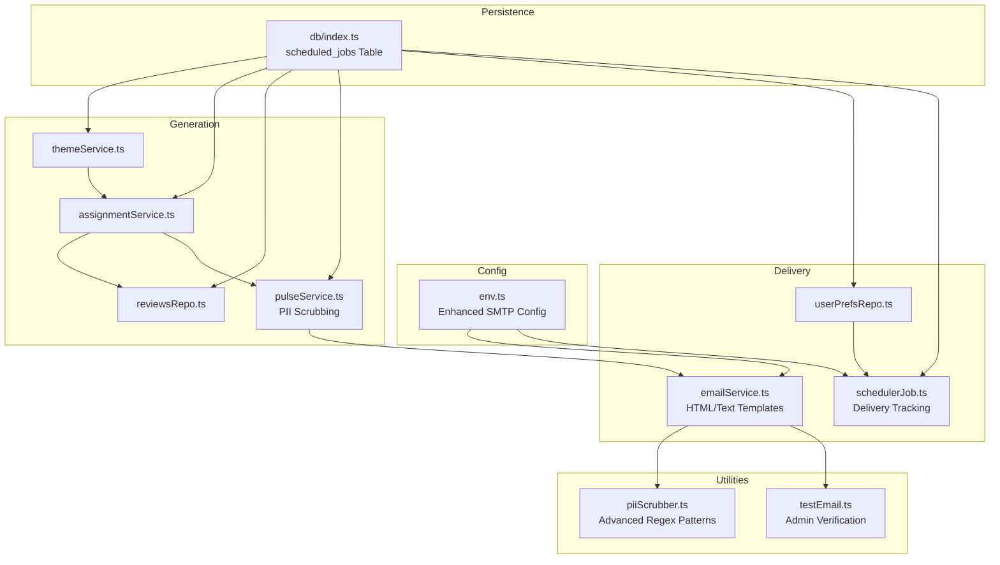
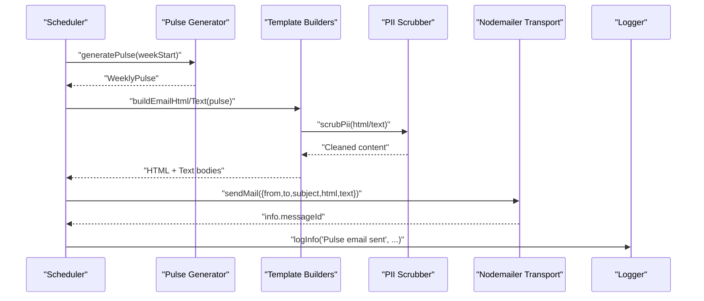
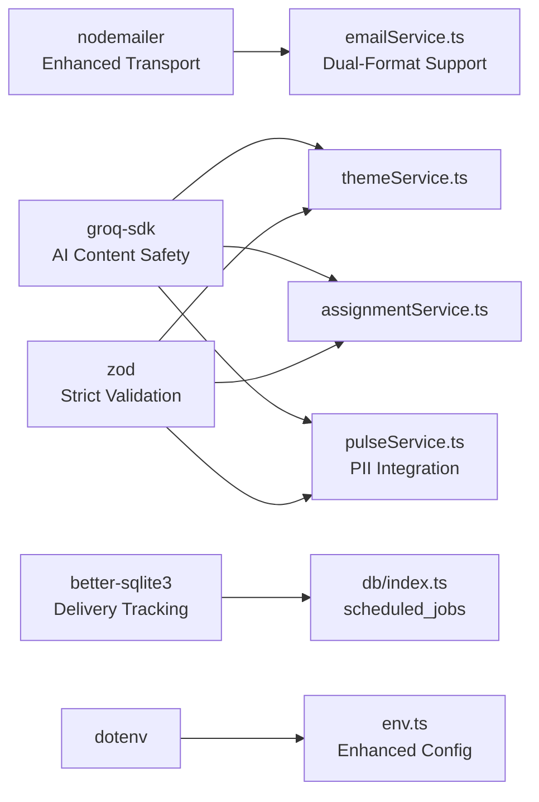

# Email Service & Delivery

<cite>
**Referenced Files in This Document**
- [emailService.ts](file://phase-2/src/services/emailService.ts)
- [env.ts](file://phase-2/src/config/env.ts)
- [userPrefsRepo.ts](file://phase-2/src/services/userPrefsRepo.ts)
- [schedulerJob.ts](file://phase-2/src/jobs/schedulerJob.ts)
- [pulseService.ts](file://phase-2/src/services/pulseService.ts)
- [assignmentService.ts](file://phase-2/src/services/assignmentService.ts)
- [themeService.ts](file://phase-2/src/services/themeService.ts)
- [reviewsRepo.ts](file://phase-2/src/services/reviewsRepo.ts)
- [db/index.ts](file://phase-2/src/db/index.ts)
- [piiScrubber.ts](file://phase-2/src/services/piiScrubber.ts)
- [email.test.ts](file://phase-2/src/tests/email.test.ts)
- [testEmail.ts](file://phase-2/scripts/testEmail.ts)
- [package.json](file://phase-2/package.json)
</cite>

## Update Summary
**Changes Made**
- Enhanced email service with comprehensive HTML and plain text template support
- Added automatic PII scrubbing integration into the email sending pipeline
- Implemented dedicated test email endpoint for administrator verification
- Strengthened SMTP transport configuration with improved error handling
- Expanded template customization capabilities with responsive design

## Table of Contents
1. [Introduction](#introduction)
2. [Project Structure](#project-structure)
3. [Core Components](#core-components)
4. [Architecture Overview](#architecture-overview)
5. [Detailed Component Analysis](#detailed-component-analysis)
6. [Dependency Analysis](#dependency-analysis)
7. [Performance Considerations](#performance-considerations)
8. [Troubleshooting Guide](#troubleshooting-guide)
9. [Conclusion](#conclusion)
10. [Appendices](#appendices)

## Introduction
This document describes the enhanced email service and automated delivery system used to generate and send weekly insights emails from public Play Store reviews. The system now features comprehensive HTML and plain text email templates, automatic PII scrubbing, SMTP transport configuration, and a dedicated test email endpoint for administrator verification. Built with TypeScript, Nodemailer for SMTP transport, SQLite for persistence, and Groq for AI-driven content generation, the system emphasizes deliverability, security, and operational reliability.

## Project Structure
The email and delivery pipeline spans several modules with enhanced template management and security features:
- Configuration: environment variables for SMTP and database with enhanced credential validation
- Persistence: SQLite schema for themes, weekly pulses, user preferences, and scheduled jobs with delivery tracking
- Generation: weekly pulse creation from themes, quotes, and action ideas with automatic content sanitization
- Delivery: SMTP transport with HTML/plain text dual-format support, PII scrubbing, and scheduler orchestration
- Utilities: Advanced PII scrubber and comprehensive testing framework

**Diagram sources**
- [env.ts:1-23](file://phase-2/src/config/env.ts#L1-L23)
- [db/index.ts:70-93](file://phase-2/src/db/index.ts#L70-L93)
- [pulseService.ts:1-265](file://phase-2/src/services/pulseService.ts#L1-L265)
- [emailService.ts:1-142](file://phase-2/src/services/emailService.ts#L1-L142)
- [userPrefsRepo.ts:1-95](file://phase-2/src/services/userPrefsRepo.ts#L1-L95)
- [schedulerJob.ts:1-98](file://phase-2/src/jobs/schedulerJob.ts#L1-L98)
- [piiScrubber.ts:1-29](file://phase-2/src/services/piiScrubber.ts#L1-L29)
- [testEmail.ts:1-16](file://phase-2/scripts/testEmail.ts#L1-L16)

**Section sources**
- [env.ts:1-23](file://phase-2/src/config/env.ts#L1-L23)
- [db/index.ts:70-93](file://phase-2/src/db/index.ts#L70-L93)

## Core Components
- **Enhanced SMTP Configuration**: Secure transport factory with comprehensive credential validation and dual-port support (587/465)
- **Dual-Format Email Templates**: HTML builder with responsive design and plain-text mirror for accessibility
- **Automatic PII Scrubbing**: Integrated regex-based scrubber for emails, phone numbers, URLs, and social handles
- **Weekly Pulse Generation**: AI-assisted content creation with strict validation and content safety
- **Smart Scheduler**: Intelligent delivery tracking with job status monitoring and error logging
- **Administrator Testing**: Dedicated test email endpoint for SMTP configuration verification

**Section sources**
- [emailService.ts:99-141](file://phase-2/src/services/emailService.ts#L99-L141)
- [pulseService.ts:179-241](file://phase-2/src/services/pulseService.ts#L179-L241)
- [userPrefsRepo.ts:83-94](file://phase-2/src/services/userPrefsRepo.ts#L83-L94)
- [schedulerJob.ts:52-84](file://phase-2/src/jobs/schedulerJob.ts#L52-L84)
- [piiScrubber.ts:22-28](file://phase-2/src/services/piiScrubber.ts#L22-L28)

## Architecture Overview
The enhanced system follows a robust pipeline with integrated security and delivery tracking:
- Data ingestion and preparation with content sanitization
- AI-assisted content generation with automatic PII protection
- Dual-format template rendering (HTML and plain text)
- Comprehensive PII scrubbing and SMTP delivery
- Intelligent scheduling with outcome logging and error tracking

**Diagram sources**
- [schedulerJob.ts:52-84](file://phase-2/src/jobs/schedulerJob.ts#L52-L84)
- [pulseService.ts:179-241](file://phase-2/src/services/pulseService.ts#L179-L241)
- [emailService.ts:114-129](file://phase-2/src/services/emailService.ts#L114-L129)
- [piiScrubber.ts:22-28](file://phase-2/src/services/piiScrubber.ts#L22-L28)

## Detailed Component Analysis

### Enhanced SMTP Configuration and Transport
The SMTP transport system now features comprehensive security and validation:
- **Credential Validation**: Immediate validation of SMTP_HOST, SMTP_USER, SMTP_PASS, and SMTP_FROM
- **Secure Transport Options**: Automatic secure flag configuration for ports 587 (STARTTLS) and 465 (SSL)
- **Flexible From Address**: Priority-based resolution from SMTP_FROM, falling back to SMTP_USER
- **Error Handling**: Specific error messages for missing credentials during transport creation

Key improvements:
- **Enhanced Security**: Automatic secure flag based on port configuration prevents mixed security contexts
- **Robust Validation**: Comprehensive credential checking prevents runtime SMTP failures
- **Flexible Configuration**: Support for various SMTP providers through environment-based configuration

**Section sources**
- [env.ts:16-21](file://phase-2/src/config/env.ts#L16-L21)
- [emailService.ts:99-112](file://phase-2/src/services/emailService.ts#L99-L112)
- [emailService.ts:120-126](file://phase-2/src/services/emailService.ts#L120-L126)

### Advanced Email Template Management
The email system now provides comprehensive dual-format support with enhanced customization:

**HTML Template Features:**
- **Responsive Design**: Fixed 640px max-width container with centered content for optimal mobile experience
- **Professional Styling**: Custom CSS with brand colors (#00b386), semantic sections, and readable typography
- **Dynamic Content Injection**: Complete integration with WeeklyPulse data including themes, quotes, actions, and notes
- **Accessibility**: Proper heading hierarchy, semantic HTML structure, and readable color contrast

**Plain Text Template Features:**
- **Structured Format**: Clear section headers (TOP THEMES, USER QUOTES, RECOMMENDED ACTIONS, WEEKLY NOTE)
- **Scannable Layout**: Numbered lists and consistent formatting for easy reading
- **Complete Coverage**: Mirrors all HTML content for non-HTML email clients
- **Line Break Preservation**: Maintains note formatting and readability

**Template Customization Capabilities:**
- **Inline Styles**: Minimal external dependencies for broad client compatibility
- **Brand Consistency**: Custom styling that aligns with Groww's visual identity
- **Content Flexibility**: Dynamic content injection from WeeklyPulse object
- **Responsive Considerations**: Fixed width ensures consistent rendering across clients

**Section sources**
- [emailService.ts:9-62](file://phase-2/src/services/emailService.ts#L9-L62)
- [emailService.ts:64-95](file://phase-2/src/services/emailService.ts#L64-L95)

### Comprehensive PII Scrubbing and Content Safety
The enhanced PII scrubber provides robust content protection with advanced pattern recognition:

**Advanced Pattern Detection:**
- **Email Addresses**: Comprehensive regex for all email formats including domain variations
- **Phone Numbers**: Support for Indian 10-digit numbers (6-9 range) and international formats
- **URLs**: Complete web address detection including HTTPS/HTTP protocols
- **Social Handles**: Twitter-style @mentions and social media references
- **Customizable Patterns**: Extensible regex array for future PII types

**Integration Points:**
- **Pre-Sending Protection**: Automatic scrubbing in both HTML and plain text builders
- **Consistent Application**: Single source of truth for PII protection across all email content
- **Performance Optimization**: Efficient regex processing with minimal overhead

**Security Benefits:**
- **Data Privacy**: Prevents accidental exposure of user information in email content
- **Compliance Ready**: Infrastructure supports GDPR and privacy regulation compliance
- **Content Integrity**: Maintains message quality while ensuring safety

**Section sources**
- [piiScrubber.ts:7-28](file://phase-2/src/services/piiScrubber.ts#L7-L28)
- [emailService.ts:115-116](file://phase-2/src/services/emailService.ts#L115-L116)

### Enhanced Weekly Pulse Generation
The pulse generation system maintains AI-driven content creation with improved safety measures:

**Content Generation Pipeline:**
- **Theme Statistics**: Aggregation of per-theme metrics with top 3 themes selection
- **Quote Selection**: Carefully curated user quotes with PII-free processing
- **Action Ideas**: Three concrete improvement suggestions with strict word limits
- **Weekly Note**: Concise analysis with automatic PII scrubbing and word count validation

**Quality Assurance:**
- **Schema Validation**: Zod-based validation for all AI-generated content
- **Word Count Control**: Strict enforcement of maximum word limits for notes
- **Retry Logic**: Automatic regeneration if content exceeds specified limits
- **Content Safety**: Integrated PII scrubbing throughout the generation process

**Technical Improvements:**
- **Error Resilience**: Comprehensive error handling for AI model failures
- **Performance Optimization**: Efficient database queries and batch processing
- **Content Consistency**: Standardized formatting and structure across all pulse components

**Section sources**
- [pulseService.ts:59-74](file://phase-2/src/services/pulseService.ts#L59-L74)
- [pulseService.ts:79-105](file://phase-2/src/services/pulseService.ts#L79-L105)
- [pulseService.ts:109-132](file://phase-2/src/services/pulseService.ts#L109-L132)
- [pulseService.ts:134-172](file://phase-2/src/services/pulseService.ts#L134-L172)
- [pulseService.ts:179-241](file://phase-2/src/services/pulseService.ts#L179-L241)

### Smart Scheduler and Delivery Tracking
The scheduler system now provides comprehensive delivery monitoring and error tracking:

**Enhanced Scheduling Logic:**
- **Intelligent Preference Matching**: Identifies due preferences based on timezone, day, and time constraints
- **Job Status Tracking**: Complete lifecycle management from creation to completion
- **Error Recovery**: Automatic failure logging with detailed error messages
- **Performance Metrics**: Processing and failure counts for operational monitoring

**Delivery Tracking Features:**
- **Job Lifecycle**: Pending → Sent → Completed status transitions with timestamp tracking
- **Error Persistence**: Last error messages stored for troubleshooting
- **Database Integration**: SQLite-based job tracking with foreign key relationships
- **Index Optimization**: Performance indexes for efficient job querying and filtering

**Operational Benefits:**
- **Visibility**: Complete audit trail of all email delivery attempts
- **Reliability**: Automatic retry capability through job status monitoring
- **Monitoring**: Real-time processing metrics for system health assessment

**Section sources**
- [schedulerJob.ts:52-84](file://phase-2/src/jobs/schedulerJob.ts#L52-L84)
- [db/index.ts:73-88](file://phase-2/src/db/index.ts#L73-L88)

### Administrator Test Email Endpoint
A dedicated test email system provides comprehensive SMTP configuration verification:

**Test Email Features:**
- **Configuration Validation**: Verifies SMTP credentials and network connectivity
- **Authentication Testing**: Confirms proper authentication with email provider
- **Delivery Confirmation**: Validates end-to-end email sending capability
- **Error Reporting**: Detailed error messages for troubleshooting configuration issues

**Implementation Details:**
- **Dedicated Function**: Separate sendTestEmail function for administrative use
- **Minimal Content**: Simple text-only test message for reliable delivery
- **Logging Integration**: Consistent logging with standard operational procedures
- **Error Handling**: Comprehensive error catching and reporting

**Administrative Benefits:**
- **Quick Verification**: Instant confirmation of SMTP configuration accuracy
- **Troubleshooting Tool**: Diagnostic capability for email delivery issues
- **Operational Assurance**: Confidence in email system reliability before production deployment

**Section sources**
- [testEmail.ts:1-16](file://phase-2/scripts/testEmail.ts#L1-L16)
- [emailService.ts:131-141](file://phase-2/src/services/emailService.ts#L131-L141)

### Delivery Pipeline Integration
The enhanced delivery system integrates all components for seamless operation:

**End-to-End Process:**
1. **Template Generation**: HTML and plain text templates created from WeeklyPulse data
2. **PII Scrubbing**: Automatic content sanitization using regex-based patterns
3. **Transport Creation**: Secure SMTP connection with validated credentials
4. **Email Sending**: Dual-format delivery with comprehensive error handling
5. **Tracking Update**: Job status updated based on delivery outcome
6. **Logging**: Complete audit trail of all delivery operations

**Quality Assurance:**
- **Content Validation**: Ensures templates contain all required information
- **Security Verification**: Confirms PII scrubbing effectiveness
- **Delivery Confirmation**: Validates SMTP transport functionality
- **Error Recovery**: Comprehensive error handling and logging

**Section sources**
- [emailService.ts:114-129](file://phase-2/src/services/emailService.ts#L114-L129)
- [schedulerJob.ts:66-80](file://phase-2/src/jobs/schedulerJob.ts#L66-L80)

## Dependency Analysis
External libraries and their enhanced roles:
- **Nodemailer**: SMTP transport with enhanced security and validation
- **Groq SDK**: Structured LLM calls with improved content safety and validation
- **Better-SQLite3**: Local storage with enhanced schema for delivery tracking
- **Dotenv**: Environment loading with comprehensive configuration support
- **Zod**: Schema validation with strict content requirements for AI outputs

**Diagram sources**
- [package.json:13-20](file://phase-2/package.json#L13-L20)
- [emailService.ts:1](file://phase-2/src/services/emailService.ts#L1)
- [pulseService.ts:1](file://phase-2/src/services/pulseService.ts#L1)
- [db/index.ts:70-93](file://phase-2/src/db/index.ts#L70-L93)

**Section sources**
- [package.json:13-20](file://phase-2/package.json#L13-L20)

## Performance Considerations
- **Template Caching**: Consider caching compiled templates for high-volume scenarios
- **Database Indexing**: Optimized indexes on scheduled_jobs for efficient querying
- **Transport Pooling**: Implement connection pooling for high-volume email delivery
- **Content Generation**: Strict word limits reduce AI processing costs and latency
- **Batch Processing**: Scheduler processes preferences in batches for optimal resource utilization
- **Memory Management**: Efficient template processing with minimal memory footprint

## Troubleshooting Guide
Common issues and enhanced resolutions:
- **SMTP Configuration Errors**: Comprehensive credential validation with specific error messages for missing fields
- **Test Email Failures**: Dedicated test endpoint with detailed error reporting for SMTP verification
- **PII Scrubbing Issues**: Advanced regex patterns with configurable detection for content safety
- **Template Rendering Problems**: Dual-format support ensures delivery even with HTML restrictions
- **Delivery Tracking Issues**: Complete job lifecycle monitoring with error persistence
- **Scheduler Failures**: Comprehensive error handling with automatic retry capability

**Section sources**
- [emailService.ts:100-102](file://phase-2/src/services/emailService.ts#L100-L102)
- [testEmail.ts:3-15](file://phase-2/scripts/testEmail.ts#L3-L15)
- [schedulerJob.ts:75-80](file://phase-2/src/jobs/schedulerJob.ts#L75-L80)

## Conclusion
The enhanced email service provides a comprehensive, secure, and reliable solution for automated email delivery. With dual-format templates, automatic PII protection, intelligent scheduling, and administrator verification capabilities, the system ensures high deliverability while maintaining strict content safety standards. The integration of advanced security measures, comprehensive testing tools, and robust delivery tracking makes it suitable for production environments requiring both reliability and compliance.

## Appendices

### Enhanced SMTP Setup Examples
- **Provider Configuration**: Host and port selection with security considerations for different providers
- **Authentication Methods**: Username/password authentication with environment-based credential management
- **Security Protocols**: Automatic TLS/SSL configuration based on port selection
- **Environment Variables**: Comprehensive configuration including SMTP_HOST, SMTP_PORT, SMTP_USER, SMTP_PASS, SMTP_FROM

**Section sources**
- [env.ts:16-21](file://phase-2/src/config/env.ts#L16-L21)
- [emailService.ts:99-112](file://phase-2/src/services/emailService.ts#L99-L112)

### Advanced Email Composition and Templates
- **Template Architecture**: HTML builder with responsive design and plain-text mirror
- **Content Injection**: Dynamic data binding from WeeklyPulse object with comprehensive field coverage
- **Styling Guidelines**: CSS-inlined styles for broad client compatibility and brand consistency
- **Accessibility Features**: Semantic HTML structure and readable typography for diverse users

**Section sources**
- [emailService.ts:9-62](file://phase-2/src/services/emailService.ts#L9-L62)
- [emailService.ts:64-95](file://phase-2/src/services/emailService.ts#L64-L95)

### Enhanced Delivery Scenarios
- **Normal Operation**: Scheduler identifies due preferences, generates pulse, sends dual-format email, and updates tracking
- **Failure Handling**: Comprehensive error logging with detailed error messages and job status persistence
- **Test Operations**: Dedicated test email endpoint for SMTP configuration verification
- **Content Safety**: Automatic PII scrubbing ensures compliance with privacy regulations

**Section sources**
- [schedulerJob.ts:52-84](file://phase-2/src/jobs/schedulerJob.ts#L52-L84)
- [emailService.ts:131-141](file://phase-2/src/services/emailService.ts#L131-L141)

### Enhanced Deliverability and Security Best Practices
- **Sender Reputation**: Dedicated sender addresses with proper domain alignment and authentication
- **Content Hygiene**: AI-generated content with strict validation and PII scrubbing for spam prevention
- **Authentication**: Comprehensive SMTP configuration with secure transport protocols
- **Monitoring**: Real-time delivery tracking with error reporting and performance metrics
- **Privacy Compliance**: Automatic PII detection and removal for GDPR and data protection compliance

### Enhanced Error Handling and Retry Mechanisms
- **Transport Errors**: Comprehensive error handling with specific error codes and retry logic
- **Content Validation**: Strict schema validation with automatic regeneration for AI outputs
- **Job Tracking**: Complete lifecycle management with status persistence and error logging
- **Administrative Tools**: Test endpoints for proactive system verification and troubleshooting

**Section sources**
- [schedulerJob.ts:75-80](file://phase-2/src/jobs/schedulerJob.ts#L75-L80)
- [emailService.ts:131-141](file://phase-2/src/services/emailService.ts#L131-L141)
- [testEmail.ts:1-16](file://phase-2/scripts/testEmail.ts#L1-L16)