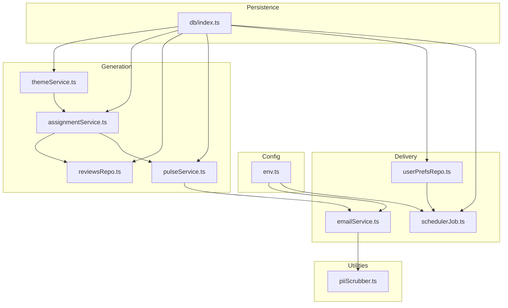
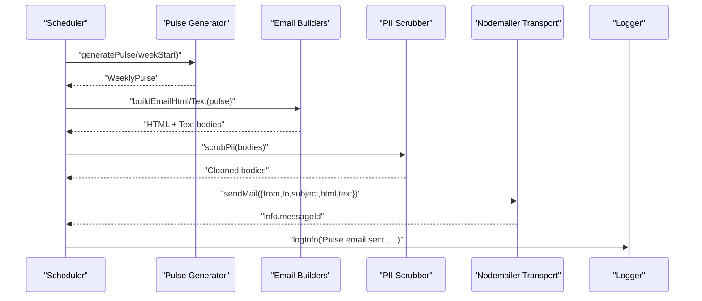
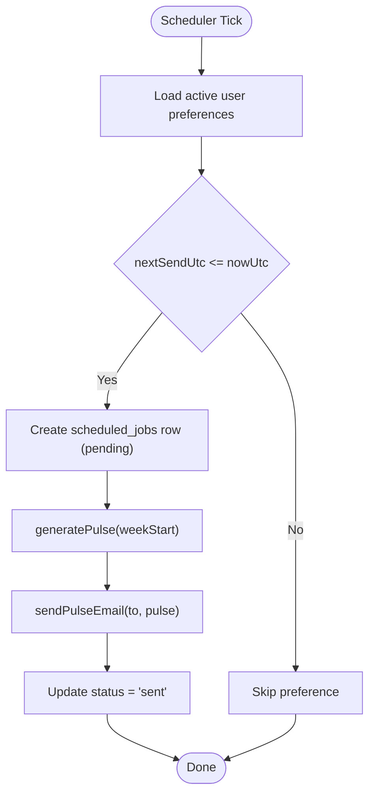
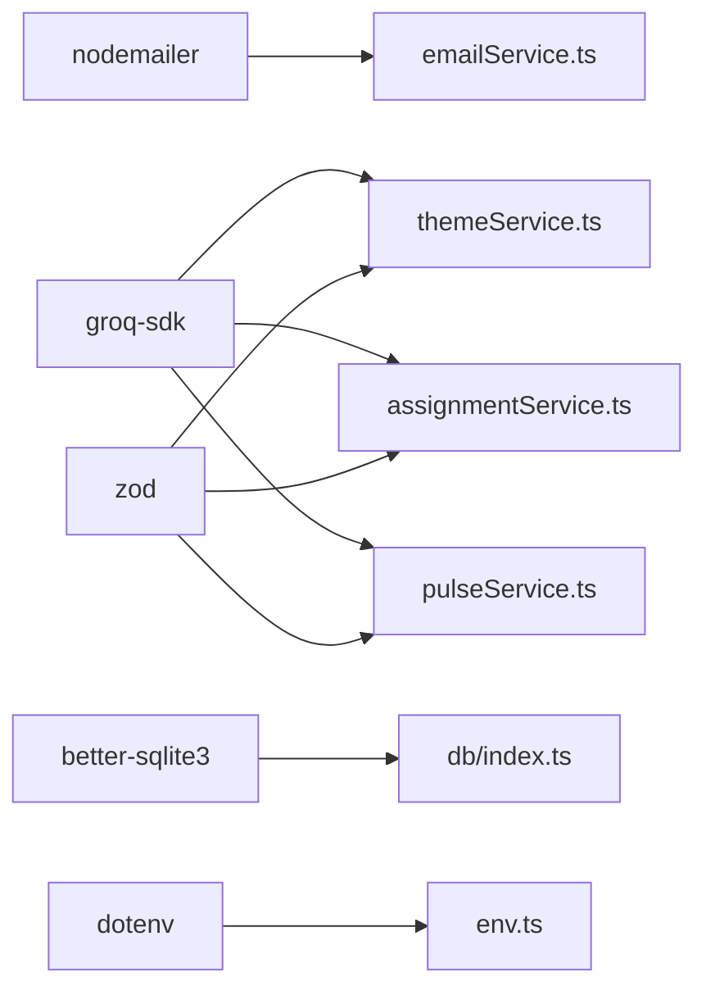

# Email Service & Delivery

<cite>
**Referenced Files in This Document**
- [emailService.ts](file://phase-2/src/services/emailService.ts)
- [env.ts](file://phase-2/src/config/env.ts)
- [userPrefsRepo.ts](file://phase-2/src/services/userPrefsRepo.ts)
- [schedulerJob.ts](file://phase-2/src/jobs/schedulerJob.ts)
- [pulseService.ts](file://phase-2/src/services/pulseService.ts)
- [assignmentService.ts](file://phase-2/src/services/assignmentService.ts)
- [themeService.ts](file://phase-2/src/services/themeService.ts)
- [reviewsRepo.ts](file://phase-2/src/services/reviewsRepo.ts)
- [db/index.ts](file://phase-2/src/db/index.ts)
- [piiScrubber.ts](file://phase-2/src/services/piiScrubber.ts)
- [email.test.ts](file://phase-2/src/tests/email.test.ts)
- [testEmail.ts](file://phase-2/scripts/testEmail.ts)
- [package.json](file://phase-2/package.json)
</cite>

## Table of Contents
1. [Introduction](#introduction)
2. [Project Structure](#project-structure)
3. [Core Components](#core-components)
4. [Architecture Overview](#architecture-overview)
5. [Detailed Component Analysis](#detailed-component-analysis)
6. [Dependency Analysis](#dependency-analysis)
7. [Performance Considerations](#performance-considerations)
8. [Troubleshooting Guide](#troubleshooting-guide)
9. [Conclusion](#conclusion)
10. [Appendices](#appendices)

## Introduction
This document describes the email service and automated delivery system used to generate and send a weekly insights email from public Play Store reviews. It covers SMTP configuration, email templates (HTML and plain text), user preferences integration, scheduling and delivery tracking, PII scrubbing, and operational best practices. The system is built with TypeScript, Nodemailer for SMTP, SQLite for persistence, and Groq for AI-driven content generation.

## Project Structure
The email and delivery pipeline spans several modules:
- Configuration: environment variables for SMTP and database
- Persistence: SQLite schema for themes, weekly pulses, user preferences, and scheduled jobs
- Generation: weekly pulse creation from themes, quotes, and action ideas
- Delivery: SMTP transport, email building, and scheduler orchestration
- Utilities: PII scrubbing and tests

**Diagram sources**
- [env.ts:1-23](file://phase-2/src/config/env.ts#L1-L23)
- [db/index.ts:1-93](file://phase-2/src/db/index.ts#L1-L93)
- [themeService.ts:1-68](file://phase-2/src/services/themeService.ts#L1-L68)
- [assignmentService.ts:1-114](file://phase-2/src/services/assignmentService.ts#L1-L114)
- [reviewsRepo.ts:1-26](file://phase-2/src/services/reviewsRepo.ts#L1-L26)
- [pulseService.ts:1-265](file://phase-2/src/services/pulseService.ts#L1-L265)
- [emailService.ts:1-142](file://phase-2/src/services/emailService.ts#L1-L142)
- [userPrefsRepo.ts:1-95](file://phase-2/src/services/userPrefsRepo.ts#L1-L95)
- [schedulerJob.ts:1-98](file://phase-2/src/jobs/schedulerJob.ts#L1-L98)
- [piiScrubber.ts:1-29](file://phase-2/src/services/piiScrubber.ts#L1-L29)

**Section sources**
- [env.ts:1-23](file://phase-2/src/config/env.ts#L1-L23)
- [db/index.ts:1-93](file://phase-2/src/db/index.ts#L1-L93)

## Core Components
- SMTP configuration via environment variables and transport factory
- Email body builders for HTML and plain text
- Pulse generation from themes, quotes, and action ideas
- User preferences for scheduling and personalization
- Scheduler that generates pulses, sends emails, and tracks outcomes
- PII scrubber to remove sensitive data before sending

**Section sources**
- [emailService.ts:99-141](file://phase-2/src/services/emailService.ts#L99-L141)
- [pulseService.ts:28-38](file://phase-2/src/services/pulseService.ts#L28-L38)
- [userPrefsRepo.ts:3-15](file://phase-2/src/services/userPrefsRepo.ts#L3-L15)
- [schedulerJob.ts:52-84](file://phase-2/src/jobs/schedulerJob.ts#L52-L84)
- [piiScrubber.ts:22-28](file://phase-2/src/services/piiScrubber.ts#L22-L28)

## Architecture Overview
The system follows a pipeline:
- Data ingestion and preparation (themes, assignments, weekly reviews)
- AI-assisted content generation (action ideas, weekly note)
- Template rendering (HTML and plain text)
- PII scrubbing and SMTP delivery
- Scheduling and outcome logging

**Diagram sources**
- [schedulerJob.ts:52-84](file://phase-2/src/jobs/schedulerJob.ts#L52-L84)
- [pulseService.ts:179-241](file://phase-2/src/services/pulseService.ts#L179-L241)
- [emailService.ts:99-129](file://phase-2/src/services/emailService.ts#L99-L129)
- [piiScrubber.ts:22-28](file://phase-2/src/services/piiScrubber.ts#L22-L28)

## Detailed Component Analysis

### SMTP Configuration and Transport
- SMTP credentials are loaded from environment variables and validated before transport creation.
- Transport supports ports 587 (STARTTLS) and 465 (SSL), with secure flag set accordingly.
- From address is derived from SMTP_FROM or falls back to SMTP_USER.

Key behaviors:
- Missing credentials cause an immediate error during transport creation.
- Subject and sender are constructed from configuration and pulse metadata.

**Section sources**
- [env.ts:16-21](file://phase-2/src/config/env.ts#L16-L21)
- [emailService.ts:99-112](file://phase-2/src/services/emailService.ts#L99-L112)
- [emailService.ts:120-126](file://phase-2/src/services/emailService.ts#L120-L126)

### Email Template Management
- HTML builder composes a responsive, readable layout with inline styles and semantic sections.
- Plain-text builder mirrors the HTML content in a structured, scannable format.
- Dynamic content injection pulls top themes, user quotes, action ideas, and the weekly note.
- Line breaks in the note are preserved for readability.

Responsive design considerations:
- Fixed max-width container and centered content.
- Minimal inline styles for broad client compatibility.

**Section sources**
- [emailService.ts:9-62](file://phase-2/src/services/emailService.ts#L9-L62)
- [emailService.ts:64-95](file://phase-2/src/services/emailService.ts#L64-L95)

### PII Scrubbing and Content Safety
- A regex-based scrubber redacts emails, phone numbers (including Indian and generic formats), URLs, and social handles.
- Applied before sending to ensure no sensitive data leaks.

**Section sources**
- [piiScrubber.ts:7-28](file://phase-2/src/services/piiScrubber.ts#L7-L28)
- [emailService.ts:115-116](file://phase-2/src/services/emailService.ts#L115-L116)

### Weekly Pulse Generation
- Aggregates theme statistics for the target week and selects top themes.
- Picks curated quotes per theme from cleaned or raw review text.
- Generates three action ideas and a concise weekly note via Groq with strict word limits and schema enforcement.
- Stores the resulting pulse in SQLite with JSON-serialized arrays.

Validation and safety:
- Enforces minimum and maximum lengths for ideas and note.
- Re-generates note if word count exceeds the limit.

**Section sources**
- [pulseService.ts:59-74](file://phase-2/src/services/pulseService.ts#L59-L74)
- [pulseService.ts:79-105](file://phase-2/src/services/pulseService.ts#L79-L105)
- [pulseService.ts:109-132](file://phase-2/src/services/pulseService.ts#L109-L132)
- [pulseService.ts:134-172](file://phase-2/src/services/pulseService.ts#L134-L172)
- [pulseService.ts:179-241](file://phase-2/src/services/pulseService.ts#L179-L241)

### Theme and Assignment Pipeline
- Generates candidate themes from recent reviews and persists them.
- Assigns each week’s reviews to themes using Groq, batching to manage token usage.
- Persists assignments with confidence scores and deduplicates conflicts.

**Section sources**
- [themeService.ts:17-37](file://phase-2/src/services/themeService.ts#L17-L37)
- [themeService.ts:39-56](file://phase-2/src/services/themeService.ts#L39-L56)
- [assignmentService.ts:27-67](file://phase-2/src/services/assignmentService.ts#L27-L67)
- [assignmentService.ts:73-97](file://phase-2/src/services/assignmentService.ts#L73-L97)
- [assignmentService.ts:102-113](file://phase-2/src/services/assignmentService.ts#L102-L113)

### User Preferences and Scheduling
- User preferences define timezone, preferred day of week, and preferred time.
- Next send time is computed relative to a reference UTC time.
- Due preferences are those whose next send time is reached or exceeded.
- Scheduler creates a scheduled job row, generates the pulse, sends the email, and records success or failure.

**Diagram sources**
- [userPrefsRepo.ts:83-94](file://phase-2/src/services/userPrefsRepo.ts#L83-L94)
- [schedulerJob.ts:52-84](file://phase-2/src/jobs/schedulerJob.ts#L52-L84)

**Section sources**
- [userPrefsRepo.ts:21-43](file://phase-2/src/services/userPrefsRepo.ts#L21-L43)
- [userPrefsRepo.ts:62-77](file://phase-2/src/services/userPrefsRepo.ts#L62-L77)
- [userPrefsRepo.ts:83-94](file://phase-2/src/services/userPrefsRepo.ts#L83-L94)
- [schedulerJob.ts:52-84](file://phase-2/src/jobs/schedulerJob.ts#L52-L84)

### Delivery Tracking and Outcome Logging
- Scheduled jobs table stores user preference linkage, week range, scheduling and send timestamps, and status.
- On success, status transitions to “sent”; on failure, status becomes “failed” with last error recorded.
- Logs are emitted around scheduling, sending, and failures.

**Section sources**
- [db/index.ts:73-88](file://phase-2/src/db/index.ts#L73-L88)
- [schedulerJob.ts:20-40](file://phase-2/src/jobs/schedulerJob.ts#L20-L40)
- [schedulerJob.ts:66-80](file://phase-2/src/jobs/schedulerJob.ts#L66-L80)

### Test Email and Validation
- A dedicated script sends a simple test email to verify SMTP configuration.
- Unit tests validate HTML and text template content and confirm PII handling expectations.

**Section sources**
- [testEmail.ts:1-16](file://phase-2/scripts/testEmail.ts#L1-L16)
- [email.test.ts:1-100](file://phase-2/src/tests/email.test.ts#L1-L100)

## Dependency Analysis
External libraries and their roles:
- Nodemailer: SMTP transport and mail sending
- Groq SDK: Structured LLM calls for theme generation, assignments, and content creation
- Better-SQLite3: Local relational storage for themes, assignments, pulses, preferences, and scheduled jobs
- Dotenv: Environment loading from .env
- Zod: Schema validation for LLM outputs

**Diagram sources**
- [package.json:13-20](file://phase-2/package.json#L13-L20)
- [emailService.ts:1](file://phase-2/src/services/emailService.ts#L1)
- [themeService.ts:1](file://phase-2/src/services/themeService.ts#L1)
- [assignmentService.ts:1](file://phase-2/src/services/assignmentService.ts#L1)
- [pulseService.ts:1](file://phase-2/src/services/pulseService.ts#L1)
- [db/index.ts:1](file://phase-2/src/db/index.ts#L1)
- [env.ts:1](file://phase-2/src/config/env.ts#L1)

**Section sources**
- [package.json:13-20](file://phase-2/package.json#L13-L20)

## Performance Considerations
- Batch processing: Assignments are processed in small batches to control token usage and latency.
- Database indexing: Unique and composite indexes on themes, review_themes, weekly_pulses, and scheduled_jobs improve lookup performance.
- Transport reuse: Transport is created per send operation; consider pooling for high-volume scenarios.
- Content generation: Limiting note length and enforcing schema reduces retries and cost.
- Scheduling cadence: The scheduler runs periodically; tune interval based on throughput needs.

[No sources needed since this section provides general guidance]

## Troubleshooting Guide
Common issues and resolutions:
- SMTP credentials missing: Ensure SMTP_HOST, SMTP_PORT, SMTP_USER, SMTP_PASS, and SMTP_FROM are set. The transport factory throws if any are absent.
- Test email fails: Use the test script to verify connectivity and credentials.
- PII leakage risk: Confirm scrubbing occurs before sending; verify that note bodies and quotes are scrubbed.
- No emails sent: Check scheduled_jobs status and logs; ensure preferences are active and nextSendUtc has passed.
- Schema validation errors: LLM outputs are validated; adjust prompts or retry logic if parsing fails.

**Section sources**
- [emailService.ts:100-102](file://phase-2/src/services/emailService.ts#L100-L102)
- [testEmail.ts:3-15](file://phase-2/scripts/testEmail.ts#L3-L15)
- [schedulerJob.ts:36-40](file://phase-2/src/jobs/schedulerJob.ts#L36-L40)
- [email.test.ts:64-72](file://phase-2/src/tests/email.test.ts#L64-L72)

## Conclusion
The email service integrates AI-driven content generation with a robust delivery pipeline. It emphasizes safety (PII scrubbing), reliability (schema validation and logging), and flexibility (user preferences and scheduling). By following the configuration steps and best practices outlined here, teams can maintain high deliverability and operational visibility.

[No sources needed since this section summarizes without analyzing specific files]

## Appendices

### SMTP Setup Examples
- Provider-specific configuration:
  - Host and port selection for common providers
  - Authentication method: username/password via environment variables
  - Security: TLS vs SSL based on port choice
- Environment variables to configure:
  - SMTP_HOST, SMTP_PORT, SMTP_USER, SMTP_PASS, SMTP_FROM

**Section sources**
- [env.ts:16-21](file://phase-2/src/config/env.ts#L16-L21)
- [emailService.ts:99-112](file://phase-2/src/services/emailService.ts#L99-L112)

### Email Composition and Templates
- Composition:
  - Build HTML and plain-text bodies from a WeeklyPulse object
  - Inject top themes, quotes, action ideas, and weekly note
- Template customization:
  - Modify styles and sections in the HTML builder
  - Keep plain-text aligned with HTML sections for accessibility

**Section sources**
- [emailService.ts:9-62](file://phase-2/src/services/emailService.ts#L9-L62)
- [emailService.ts:64-95](file://phase-2/src/services/emailService.ts#L64-L95)

### Delivery Scenarios
- Normal weekly delivery:
  - Scheduler identifies due preferences, generates pulse, sends email, and marks success
- Failure handling:
  - Errors are caught, logged, and stored in scheduled_jobs with status “failed”
- Test delivery:
  - A simple test email verifies SMTP configuration

**Section sources**
- [schedulerJob.ts:52-84](file://phase-2/src/jobs/schedulerJob.ts#L52-L84)
- [emailService.ts:132-141](file://phase-2/src/services/emailService.ts#L132-L141)

### Deliverability and Spam Prevention
- Sender reputation: Use a dedicated sender address and domain alignment
- Content hygiene: Avoid excessive links, promotional language, and spam triggers
- Authentication: Configure SPF/DKIM/DMARC records for your domain
- Monitoring: Track bounces and complaints; adjust content and frequency based on feedback

[No sources needed since this section provides general guidance]

### Error Handling and Retry Mechanisms
- Transport errors: Caught and logged; consider exponential backoff in production deployments
- LLM validation errors: Retries with stricter prompts; enforce word limits for notes
- Job tracking: Use scheduled_jobs to monitor failures and re-run as needed

**Section sources**
- [schedulerJob.ts:75-80](file://phase-2/src/jobs/schedulerJob.ts#L75-L80)
- [pulseService.ts:163-169](file://phase-2/src/services/pulseService.ts#L163-L169)