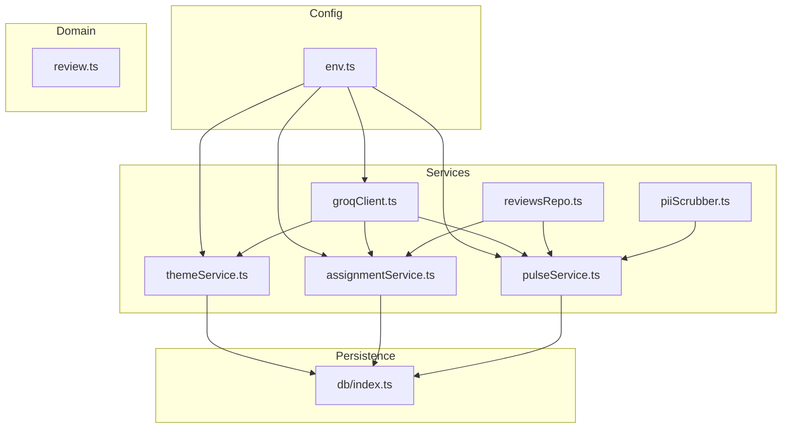
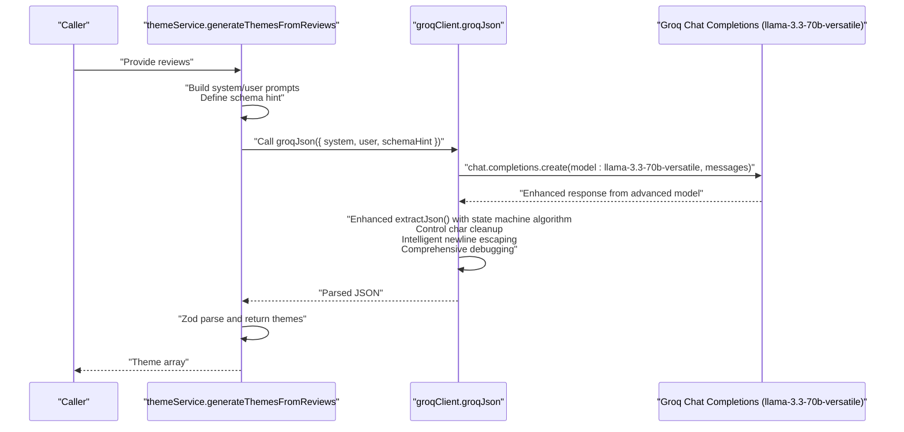
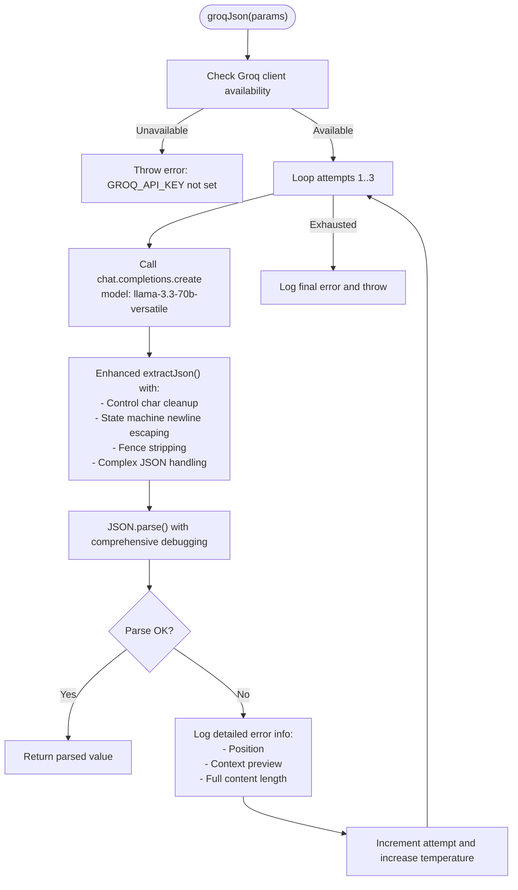
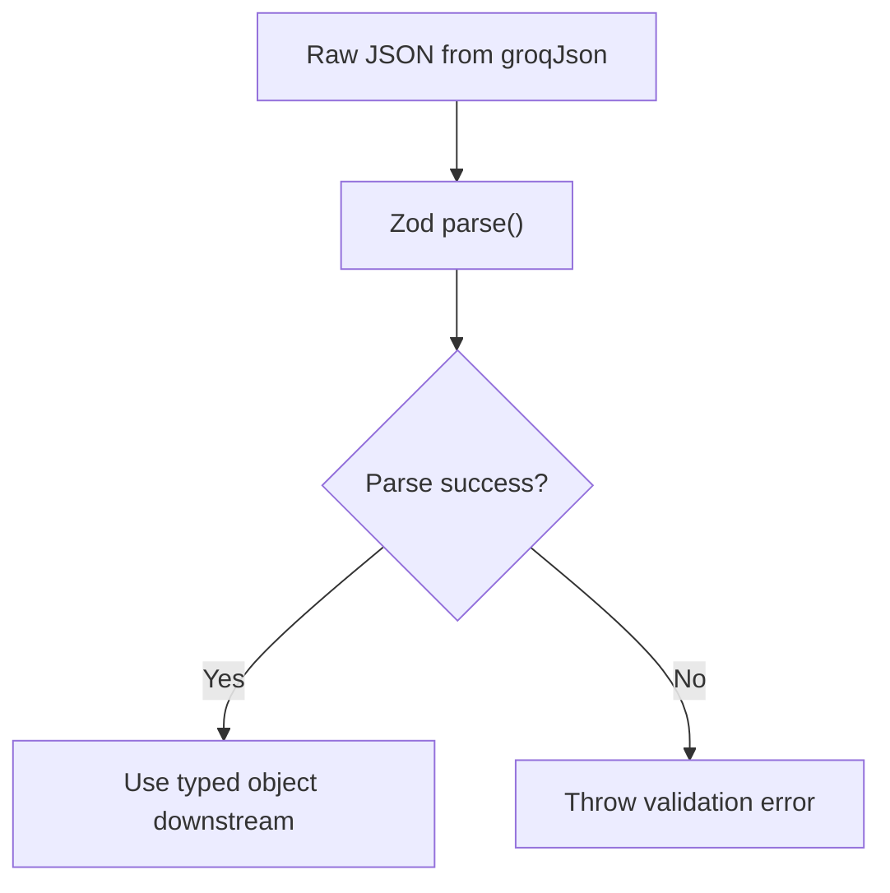
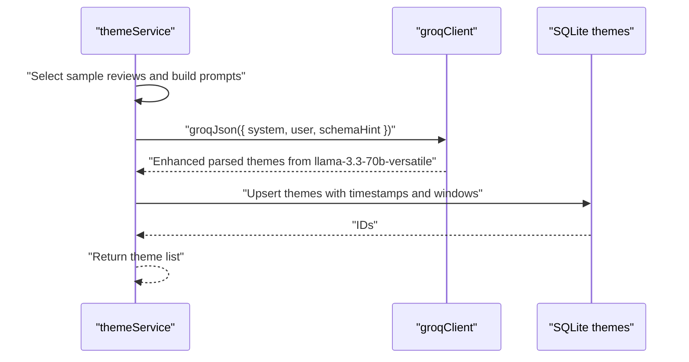
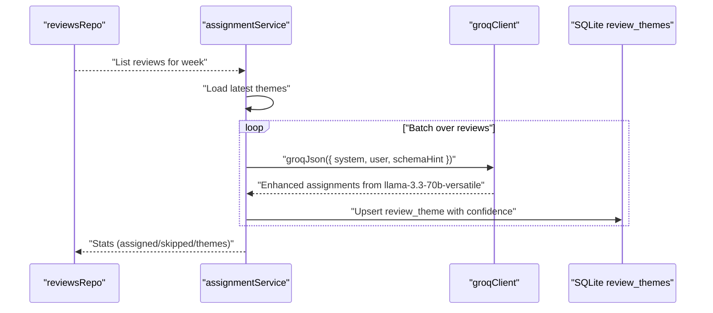
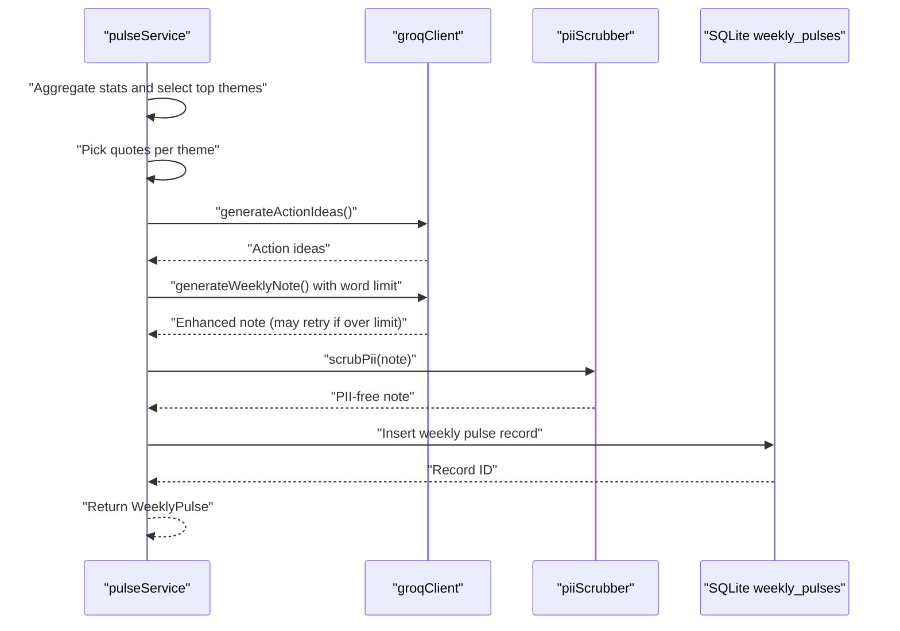
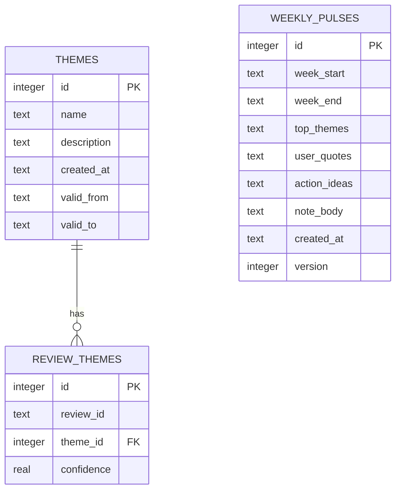
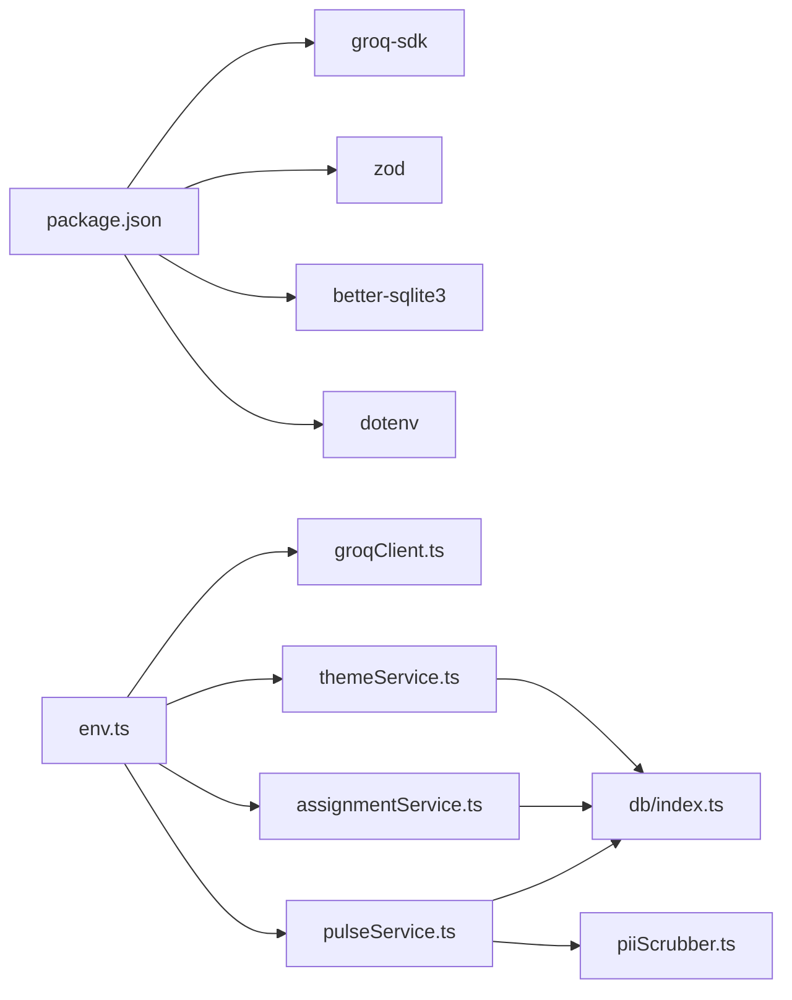

# LLM Integration with Groq

<cite>
**Referenced Files in This Document**
- [groqClient.ts](file://phase-2/src/services/groqClient.ts)
- [themeService.ts](file://phase-2/src/services/themeService.ts)
- [assignmentService.ts](file://phase-2/src/services/assignmentService.ts)
- [pulseService.ts](file://phase-2/src/services/pulseService.ts)
- [reviewsRepo.ts](file://phase-2/src/services/reviewsRepo.ts)
- [env.ts](file://phase-2/src/config/env.ts)
- [review.ts](file://phase-2/src/domain/review.ts)
- [index.ts](file://phase-2/src/db/index.ts)
- [pulse.test.ts](file://phase-2/src/tests/pulse.test.ts)
- [schema.test.ts](file://phase-2/src/tests/schema.test.ts)
- [package.json](file://phase-2/package.json)
</cite>

## Update Summary
**Changes Made**
- Updated Groq model configuration to reflect the upgraded llama-3.3-70b-versatile model
- Enhanced performance considerations section to highlight improved AI processing capabilities
- Updated troubleshooting guide to include model-specific guidance
- Revised environment configuration documentation to specify the new model requirements

## Table of Contents
1. [Introduction](#introduction)
2. [Project Structure](#project-structure)
3. [Core Components](#core-components)
4. [Architecture Overview](#architecture-overview)
5. [Detailed Component Analysis](#detailed-component-analysis)
6. [Dependency Analysis](#dependency-analysis)
7. [Performance Considerations](#performance-considerations)
8. [Enhanced JSON Parsing Reliability](#enhanced-json-parsing-reliability)
9. [Comprehensive Debugging Capabilities](#comprehensive-debugging-capabilities)
10. [Troubleshooting Guide](#troubleshooting-guide)
11. [Conclusion](#conclusion)
12. [Appendices](#appendices)

## Introduction
This document explains the LLM integration with Groq in Phase 2, focusing on the GroqClient implementation, prompt engineering strategies, JSON schema validation, error handling and retry logic, and the end-to-end theme generation workflow. The system now utilizes the advanced llama-3.3-70b-versatile model, which provides significantly enhanced AI processing capabilities and performance compared to previous generations. It features robust JSON parsing reliability with a sophisticated state machine algorithm that properly handles nested quotes, escaped characters, and complex JSON structures, dramatically reducing parsing failures from large language model outputs. Practical examples illustrate prompt construction, response parsing, and error recovery. Finally, it outlines performance optimization, rate limiting considerations, and cost management strategies.

## Project Structure
Phase 2 builds upon Phase 1's SQLite database and introduces new services for Groq-powered insights:
- Configuration loads environment variables for Groq API key, model, and SMTP settings.
- Services implement theme generation, review assignment, and weekly pulse creation.
- Validation uses Zod schemas to ensure robust parsing and shape guarantees.
- Tests validate schema correctness and word-count enforcement.



**Diagram sources**
- [env.ts:1-23](file://phase-2/src/config/env.ts#L1-L23)
- [groqClient.ts:1-142](file://phase-2/src/services/groqClient.ts#L1-L142)
- [themeService.ts:1-78](file://phase-2/src/services/themeService.ts#L1-L78)
- [assignmentService.ts:1-114](file://phase-2/src/services/assignmentService.ts#L1-L114)
- [pulseService.ts:1-270](file://phase-2/src/services/pulseService.ts#L1-L270)
- [reviewsRepo.ts:1-26](file://phase-2/src/services/reviewsRepo.ts#L1-L26)
- [review.ts:1-12](file://phase-2/src/domain/review.ts#L1-L12)
- [index.ts:1-93](file://phase-2/src/db/index.ts#L1-L93)

**Section sources**
- [env.ts:1-23](file://phase-2/src/config/env.ts#L1-L23)
- [package.json:1-34](file://phase-2/package.json#L1-L34)

## Core Components
- GroqClient: Initializes the Groq SDK client from environment variables and provides a generic JSON extraction and retry mechanism for chat completions with enhanced control character cleanup, intelligent newline escaping, and sophisticated state machine parsing for complex JSON structures. Now operates on the advanced llama-3.3-70b-versatile model for superior performance.
- ThemeService: Generates themes from recent reviews using structured prompts and validates outputs via Zod schemas.
- AssignmentService: Assigns reviews to themes with confidence scores, batching requests to manage token usage.
- PulseService: Aggregates weekly insights, generates action ideas and a concise weekly note, enforces word limits, and scrubs PII.
- Persistence: SQLite-backed schema for themes, review-theme assignments, weekly pulses, preferences, and scheduled jobs.
- Validation: Zod schemas ensure strict typing and shape guarantees for all LLM responses.

**Section sources**
- [groqClient.ts:1-142](file://phase-2/src/services/groqClient.ts#L1-L142)
- [themeService.ts:1-78](file://phase-2/src/services/themeService.ts#L1-L78)
- [assignmentService.ts:1-114](file://phase-2/src/services/assignmentService.ts#L1-L114)
- [pulseService.ts:1-270](file://phase-2/src/services/pulseService.ts#L1-L270)
- [index.ts:1-93](file://phase-2/src/db/index.ts#L1-L93)

## Architecture Overview
The system orchestrates three primary workflows using the enhanced llama-3.3-70b-versatile model:
- Theme Generation: Collects a sample of cleaned review texts, constructs a system and user prompt, calls Groq, extracts JSON with enhanced parsing reliability, validates with Zod, and persists themes.
- Review Assignment: Iterates over weekly reviews in batches, assigns each to a theme or "Other," and persists the mapping with optional confidence.
- Weekly Pulse: Aggregates theme statistics for the week, selects representative quotes, generates action ideas, writes a concise note, enforces word limits, scrubs PII, and stores the result.



**Diagram sources**
- [themeService.ts:17-37](file://phase-2/src/services/themeService.ts#L17-L37)
- [groqClient.ts:93-140](file://phase-2/src/services/groqClient.ts#L93-L140)

## Detailed Component Analysis

### GroqClient Implementation
- Initialization: Creates a Groq client only when the API key is present; otherwise returns null to prevent runtime errors.
- Enhanced JSON Extraction: Robustly extracts JSON from fenced code blocks or malformed outputs by:
  - Removing ALL control characters and non-printable characters (keeping only printable ASCII 32-126 and common whitespace)
  - Stripping zero-width spaces and replacement characters
  - Handling markdown code fences with intelligent fallback to brace-matching
  - Fixing unescaped newlines inside JSON strings with sophisticated state machine algorithm
- State Machine Algorithm: Implements a comprehensive state machine that properly handles:
  - Nested quotes within JSON strings
  - Escaped characters (backslashes) that precede quotes
  - Complex JSON structures with multiple levels of nesting
  - Proper escape sequence preservation during newline conversion
- Retry Logic: Attempts up to three times with incremental temperature increases to improve deterministic JSON output on retries.
- Request Construction: Sends a system message and a user message that includes a strict instruction to return only valid JSON and a schema hint.
- Model Configuration: Now operates on the advanced llama-3.3-70b-versatile model for enhanced AI processing capabilities.

**Updated** The GroqClient now operates on the llama-3.3-70b-versatile model, which provides significantly enhanced AI processing capabilities and performance compared to previous model generations. This upgrade enables more sophisticated reasoning, improved accuracy in theme generation, and better handling of complex review analysis tasks.



**Diagram sources**
- [groqClient.ts:93-140](file://phase-2/src/services/groqClient.ts#L93-L140)

**Section sources**
- [groqClient.ts:1-142](file://phase-2/src/services/groqClient.ts#L1-L142)
- [env.ts:13-14](file://phase-2/src/config/env.ts#L13-L14)

### Prompt Engineering Strategies
- Role Definitions: System messages define the persona (product analyst) and constraints (no PII, concise output).
- Instruction Formatting: User prompts include:
  - A clear directive to return only valid JSON.
  - A schema hint to guide the model's output structure.
  - Structured context (e.g., theme lists, review samples).
- Temperature Tuning: Slightly increasing temperature on retries improves convergence toward deterministic JSON.
- Model Optimization: The llama-3.3-70b-versatile model provides enhanced reasoning capabilities for more sophisticated prompt processing.

Examples by component:
- Theme Generation: Builds a system role and a user prompt enumerating a sample of cleaned review texts, then requests a JSON array of themes with enhanced processing capabilities.
- Assignment: Provides allowed theme names and descriptions, instructs the model to assign each review to one theme or "Other," and requests a JSON array of assignments with optional confidence.
- Weekly Pulse: Supplies top themes, quotes, and action ideas, and enforces a strict word limit in the note.

**Section sources**
- [themeService.ts:17-37](file://phase-2/src/services/themeService.ts#L17-L37)
- [assignmentService.ts:27-67](file://phase-2/src/services/assignmentService.ts#L27-L67)
- [pulseService.ts:109-172](file://phase-2/src/services/pulseService.ts#L109-L172)

### JSON Schema Validation and Parsing
- Zod Schemas: Define strict shapes for:
  - Theme arrays with min/max lengths and field constraints.
  - Assignment arrays with review identifiers, theme names, and optional confidence.
  - Weekly note with a bounded word count.
- Validation Pipeline: After groqJson returns raw JSON, each service parses with its Zod schema. On failure, the error propagates for upstream handling.
- Word Count Guard: Weekly note generation includes a second pass if the initial output exceeds the word limit.



**Diagram sources**
- [themeService.ts:6-13](file://phase-2/src/services/themeService.ts#L6-L13)
- [assignmentService.ts:9-17](file://phase-2/src/services/assignmentService.ts#L9-L17)
- [pulseService.ts:42-48](file://phase-2/src/services/pulseService.ts#L42-L48)

**Section sources**
- [themeService.ts:1-78](file://phase-2/src/services/themeService.ts#L1-L78)
- [assignmentService.ts:1-114](file://phase-2/src/services/assignmentService.ts#L1-L114)
- [pulseService.ts:1-270](file://phase-2/src/services/pulseService.ts#L1-L270)

### Theme Generation Workflow
- Input: Reviews are sampled and cleaned; a system role defines the analyst persona and PII constraints; a user prompt enumerates review excerpts.
- Processing: Calls groqJson with a schema hint for an array of themes using enhanced JSON parsing with state machine algorithm on the llama-3.3-70b-versatile model.
- Output: Zod-parsed themes are returned and persisted via upsert.



**Diagram sources**
- [themeService.ts:17-49](file://phase-2/src/services/themeService.ts#L17-L49)
- [groqClient.ts:93-140](file://phase-2/src/services/groqClient.ts#L93-L140)
- [index.ts:7-52](file://phase-2/src/db/index.ts#L7-L52)

**Section sources**
- [themeService.ts:17-49](file://phase-2/src/services/themeService.ts#L17-L49)

### Review Assignment to Themes
- Input: Weekly reviews and latest themes.
- Processing: Iterates over reviews in batches, constructs a user prompt with allowed themes, calls groqJson with enhanced parsing using state machine algorithm on the llama-3.3-70b-versatile model, parses assignments, and persists mappings with optional confidence.
- Persistence: Uses an upsert to update confidence values for repeated runs.



**Diagram sources**
- [reviewsRepo.ts:16-24](file://phase-2/src/services/reviewsRepo.ts#L16-L24)
- [assignmentService.ts:31-71](file://phase-2/src/services/assignmentService.ts#L31-L71)
- [index.ts:24-33](file://phase-2/src/db/index.ts#L24-L33)

**Section sources**
- [assignmentService.ts:31-71](file://phase-2/src/services/assignmentService.ts#L31-L71)

### Weekly Pulse Generation
- Inputs: Top themes, selected quotes, and generated action ideas.
- Processing: Generates action ideas and a weekly note; enforces a strict word limit with a fallback prompt if exceeded; scrubs PII before storage.
- Storage: Inserts a record with JSON-serialized arrays and metadata.



**Diagram sources**
- [pulseService.ts:109-172](file://phase-2/src/services/pulseService.ts#L109-L172)
- [pulse.test.ts:49-85](file://phase-2/src/tests/pulse.test.ts#L49-L85)

**Section sources**
- [pulseService.ts:109-172](file://phase-2/src/services/pulseService.ts#L109-L172)
- [pulse.test.ts:49-85](file://phase-2/src/tests/pulse.test.ts#L49-L85)

### Data Models and Persistence
- Themes: name, description, timestamps, and optional validity window.
- Review-Theme Assignments: review_id, theme_id, and optional confidence.
- Weekly Pulses: week range, serialized top themes, quotes, action ideas, note body, timestamps, and version.
- Indexes: Unique constraints and indexes optimize lookups and prevent duplicates.



**Diagram sources**
- [index.ts:9-52](file://phase-2/src/db/index.ts#L9-L52)

**Section sources**
- [index.ts:1-93](file://phase-2/src/db/index.ts#L1-L93)

## Dependency Analysis
- External Dependencies: groq-sdk, zod, better-sqlite3, dotenv, express, nodemailer.
- Internal Dependencies: Services depend on env configuration, domain types, and the SQLite database. Validation ensures robustness across the pipeline.



**Diagram sources**
- [package.json:13-23](file://phase-2/package.json#L13-L23)
- [env.ts:7-21](file://phase-2/src/config/env.ts#L7-L21)
- [groqClient.ts:1-7](file://phase-2/src/services/groqClient.ts#L1-L7)
- [index.ts:1-5](file://phase-2/src/db/index.ts#L1-L5)

**Section sources**
- [package.json:1-34](file://phase-2/package.json#L1-L34)
- [env.ts:1-23](file://phase-2/src/config/env.ts#L1-L23)

## Performance Considerations
- Token Management:
  - Batch processing: AssignmentService processes reviews in fixed-size batches to control token consumption per request.
  - Prompt minimization: Use concise theme lists and truncated review excerpts to reduce input size.
- Retry Strategy:
  - Incremental temperature on retries improves determinism for JSON parsing.
  - Limit retries to avoid excessive latency and cost.
- Caching and Deduplication:
  - Reuse latest themes to minimize repeated generation.
  - Avoid regenerating weekly pulses for the same week_start/version.
- Database Efficiency:
  - Use upserts and transactions to reduce round-trips.
  - Leverage indexes on foreign keys and uniqueness constraints.
- Cost Control:
  - Choose appropriate models and tune temperature to balance quality and cost.
  - Monitor output length (word count) to avoid unnecessary tokens.
- Model Performance Benefits:
  - The llama-3.3-70b-versatile model provides enhanced processing capabilities with improved accuracy and reasoning.
  - Better handling of complex review analysis tasks reduces the need for multiple API calls.
  - Enhanced JSON parsing reliability reduces retry attempts and associated costs.
- State Machine Complexity:
  - The state machine algorithm adds computational overhead for complex JSON parsing.
  - Performance impact is minimal compared to the benefits of reduced parsing failures.

**Updated** The llama-3.3-70b-versatile model upgrade provides significant performance improvements including enhanced processing capabilities, improved accuracy in theme generation, and better handling of complex review analysis tasks. These improvements reduce the need for multiple API calls and enhance overall system efficiency.

## Enhanced JSON Parsing Reliability

**Updated** The GroqClient now features significantly enhanced JSON parsing reliability with a sophisticated state machine algorithm that properly handles nested quotes, escaped characters, and complex JSON structures, dramatically reducing parsing failures from large language model outputs. The llama-3.3-70b-versatile model provides enhanced processing capabilities that further improve parsing accuracy.

### State Machine Algorithm Implementation
The enhanced `extractJson` function implements a comprehensive state machine that tracks parsing state across complex JSON structures:

#### Core State Tracking
- **inString**: Boolean flag indicating whether the parser is currently inside a JSON string
- **escaped**: Boolean flag tracking if the previous character was a backslash
- **Character-by-character Processing**: Iterates through each character while maintaining state

#### State Transitions
The state machine handles four primary states:
1. **Outside String**: Characters are preserved as-is
2. **Inside String**: Special handling for quotes, backslashes, and control characters
3. **Escaped Character**: Previous character was a backslash, preserve next character literally
4. **Quote Boundary**: Handle opening and closing quotes appropriately

#### Complex JSON Structure Handling
The state machine algorithm excels at:
- **Nested Quotes**: Properly identifies string boundaries even with nested quotes
- **Escaped Characters**: Correctly preserves escaped quotes, backslashes, and other escape sequences
- **Complex Nesting**: Handles arrays, objects, and mixed structures with multiple levels
- **Mixed Content**: Processes strings containing both literal and escaped content

### Control Character Cleanup
The enhanced `extractJson` function implements aggressive control character removal:
- Removes ALL control characters (ASCII 0-8, 11, 12, 14-31, 127-159)
- Strips zero-width spaces and invisible Unicode characters
- Eliminates replacement characters that break JSON parsing
- Preserves only printable ASCII characters (32-126) and common whitespace

### Intelligent Newline Escaping
Addresses a common LLM issue where unescaped newlines within JSON string values cause parsing failures:
- Identifies string values within JSON using regex patterns
- Escapes actual newlines (`\n`) and carriage returns (`\r`) with proper JSON escape sequences
- Handles backslash escaping precedence to prevent double-escaping issues
- Maintains original string content while ensuring JSON compliance

### Markdown Fence Handling
Implements intelligent markdown code fence detection and extraction:
- Supports both ```json and ``` syntax variations
- Extracts content between fences while removing surrounding formatting
- Falls back to brace-matching algorithm when fences are absent
- Trims whitespace while preserving structural integrity

### State Machine Processing Flow
```mermaid
flowchart TD
Start(["Input JSON String"]) --> Init["Initialize state:<br/>inString=false<br/>escaped=false"]
Init --> Loop{"More characters?"}
Loop --> |Yes| Char["Process character i"]
Char --> CheckEsc{"Previous char was \\"? "}
CheckEsc --> |Yes| Preserve["Preserve character<br/>Set escaped=false"]
CheckEsc --> |No| CheckBackslash{"Char is \\"? "}
CheckBackslash --> |Yes| MarkEsc["Mark escaped=true<br/>Add to result"]
CheckBackslash --> |No| CheckQuote{"Char is '? "}
CheckQuote --> |Yes| ToggleString["Toggle inString state<br/>Add to result"]
CheckQuote --> |No| InString{"In string?"}
InString --> |Yes| CheckControl{"Control character?"}
CheckControl --> |Yes| Escape["Escape control char<br/>Add \\n, \\r, or \\t"]
CheckControl --> |No| AddChar["Add character as-is"]
InString --> |No| AddChar2["Add character as-is"]
Escape --> Next["Next character"]
AddChar --> Next
AddChar2 --> Next
ToggleString --> Next
MarkEsc --> Next
Preserve --> Next
Next --> Loop
Loop --> |No| End["Return processed JSON"]
```

**Diagram sources**
- [groqClient.ts:35-88](file://phase-2/src/services/groqClient.ts#L35-L88)

**Section sources**
- [groqClient.ts:14-91](file://phase-2/src/services/groqClient.ts#L14-L91)

## Comprehensive Debugging Capabilities

**Updated** The GroqClient now provides extensive debugging capabilities with detailed error logging for troubleshooting failed API responses, enhanced by the llama-3.3-70b-versatile model's improved error reporting.

### Detailed Error Logging
The enhanced error handling system provides comprehensive debugging information:
- Logs JSON parse error positions with precise character locations
- Captures content previews (first 300 characters) for immediate diagnosis
- Records raw content previews to compare with processed output
- Includes retry attempt information for sequential debugging
- Leverages model-specific error reporting from llama-3.3-70b-versatile

### Debug Information Structure
When JSON parsing fails, the system logs:
- `[DEBUG] JSON parse error: <error_message>`
- `[DEBUG] Error around position <pos>:`
- `[DEBUG] Context: ...<processed_json_preview>...`
- `[DEBUG] Full content length: <length>`

### Error Recovery Flow
The debugging-enabled retry mechanism:
- Attempts up to three parsing attempts with incremental temperature increases
- Logs detailed information on each failure for systematic troubleshooting
- Provides comprehensive context for developers to identify root causes
- Maintains error propagation while preserving diagnostic information
- Utilizes enhanced error reporting capabilities of the llama-3.3-70b-versatile model

**Section sources**
- [groqClient.ts:119-131](file://phase-2/src/services/groqClient.ts#L119-L131)

## Performance Considerations
- Token Management:
  - Batch processing: AssignmentService processes reviews in fixed-size batches to control token consumption per request.
  - Prompt minimization: Use concise theme lists and truncated review excerpts to reduce input size.
- Retry Strategy:
  - Incremental temperature on retries improves determinism for JSON parsing.
  - Limit retries to avoid excessive latency and cost.
- Caching and Deduplication:
  - Reuse latest themes to minimize repeated generation.
  - Avoid regenerating weekly pulses for the same week_start/version.
- Database Efficiency:
  - Use upserts and transactions to reduce round-trips.
  - Leverage indexes on foreign keys and uniqueness constraints.
- Cost Control:
  - Choose appropriate models and tune temperature to balance quality and cost.
  - Monitor output length (word count) to avoid unnecessary tokens.
- Model Performance Benefits:
  - The llama-3.3-70b-versatile model provides enhanced processing capabilities with improved accuracy and reasoning.
  - Better handling of complex review analysis tasks reduces the need for multiple API calls.
  - Enhanced JSON parsing reliability reduces retry attempts and associated costs.
- State Machine Performance:
  - The state machine algorithm has O(n) time complexity where n is the length of the JSON string
  - Memory usage is minimal, proportional to input size plus small constant overhead
  - Performance impact is negligible compared to the dramatic reduction in parsing failures

**Updated** The llama-3.3-70b-versatile model upgrade provides significant performance improvements including enhanced processing capabilities, improved accuracy in theme generation, and better handling of complex review analysis tasks. These improvements reduce the need for multiple API calls and enhance overall system efficiency.

## Troubleshooting Guide
- Missing API Key:
  - Symptom: Error indicating the Groq API key is not set.
  - Resolution: Set GROQ_API_KEY in the environment file and restart the service.
- Enhanced JSON Parsing Failures:
  - Symptom: Validation errors or groqJson throwing after retries with detailed debug logs.
  - Resolution: Check the debug logs for error positions and content previews; strengthen schema hints, enforce stricter instructions in prompts, and verify model consistency.
- State Machine Issues:
  - Symptom: Complex JSON structures still failing to parse despite state machine enhancements.
  - Resolution: Review debug logs for specific character positions; check for unusual escape sequences or malformed JSON structures.
- Control Character Issues:
  - Symptom: JSON parsing errors due to invisible characters or special Unicode.
  - Resolution: The enhanced parser automatically removes control characters; verify that the raw content preview shows clean JSON output.
- Newline Escaping Problems:
  - Symptom: String values containing actual newlines causing parsing failures.
  - Resolution: The intelligent newline escaping mechanism automatically handles this; check debug logs to confirm proper escaping.
- Over-limit Outputs:
  - Symptom: Weekly note exceeds word count.
  - Resolution: Use the built-in retry with a stricter prompt; optionally shorten theme/quote summaries.
- PII Exposure:
  - Symptom: Sensitive data in outputs.
  - Resolution: Apply PII scrubbing before storing or sending; ensure system/user prompts explicitly forbid PII.
- Empty Inputs:
  - Symptom: No themes found or no reviews for the week.
  - Resolution: Trigger theme generation first; ensure weekly assignment runs after theme generation.
- Model-Specific Issues:
  - Symptom: Unexpected behavior with llama-3.3-70b-versatile model.
  - Resolution: Verify model configuration in environment variables; check Groq API status; consider adjusting temperature settings for optimal performance.

**Updated** Added troubleshooting guidance for model-specific issues related to the llama-3.3-70b-versatile upgrade, including verification of model configuration and API status checks.

**Section sources**
- [groqClient.ts:98-140](file://phase-2/src/services/groqClient.ts#L98-L140)
- [pulseService.ts:162-171](file://phase-2/src/services/pulseService.ts#L162-L171)
- [pulse.test.ts:49-85](file://phase-2/src/tests/pulse.test.ts#L49-L85)
- [env.ts:13-14](file://phase-2/src/config/env.ts#L13-L14)

## Conclusion
Phase 2 integrates Groq to power theme generation, review assignment, and weekly pulse creation with significantly enhanced JSON parsing reliability. The system now features a sophisticated state machine algorithm that properly handles nested quotes, escaped characters, and complex JSON structures, dramatically reducing parsing failures from large language model outputs. The llama-3.3-70b-versatile model upgrade provides enhanced AI processing capabilities and performance, enabling more sophisticated reasoning and improved accuracy in theme generation and review analysis. The GroqClient provides comprehensive control character cleanup, intelligent newline escaping, and detailed debugging capabilities with extensive error logging. Robust prompt engineering, strict JSON schema validation, and resilient retry logic ensure reliable outputs. Persistence is optimized with SQLite and Zod validations. By following the outlined practices—prompt discipline, batching, validation, PII scrubbing, and cost-conscious model selection—the system scales efficiently while maintaining data integrity and user safety.

**Updated** The llama-3.3-70b-versatile model upgrade significantly enhances the system's AI processing capabilities, providing improved accuracy, reasoning abilities, and performance for theme generation and review analysis tasks.

## Appendices

### Environment Configuration
- Required Variables:
  - GROQ_API_KEY: Groq API key for authentication.
  - GROQ_MODEL: Model identifier used for chat completions (default: llama-3.3-70b-versatile).
  - DATABASE_FILE: Path to the SQLite database file.
  - SMTP_*: SMTP host, port, credentials, and sender address for email notifications.

**Updated** The GROQ_MODEL environment variable now defaults to llama-3.3-70b-versatile, providing enhanced AI processing capabilities.

**Section sources**
- [env.ts:7-21](file://phase-2/src/config/env.ts#L7-L21)

### Example Prompt Construction Patterns
- Theme Generation:
  - System: Analyst role with PII constraints.
  - User: Enumerated review excerpts with explicit JSON-only instruction and schema hint.
- Assignment:
  - System: Analyst role with assignment constraints.
  - User: Allowed theme list and a batch of reviews with explicit JSON-only instruction and schema hint.
- Weekly Pulse:
  - System: Analyst role with word limit constraints.
  - User: Top themes, quotes, and action ideas with explicit JSON-only instruction and schema hint.

**Section sources**
- [themeService.ts:17-37](file://phase-2/src/services/themeService.ts#L17-L37)
- [assignmentService.ts:27-67](file://phase-2/src/services/assignmentService.ts#L27-L67)
- [pulseService.ts:109-172](file://phase-2/src/services/pulseService.ts#L109-L172)

### Testing Highlights
- Zod Validation: Ensures schema correctness in isolation.
- Word Count Guard: Validates that generated notes adhere to the specified word limit.
- PII Scrubber: Confirms redaction of emails, phone numbers, URLs, and handles.

**Section sources**
- [schema.test.ts:1-10](file://phase-2/src/tests/schema.test.ts#L1-L10)
- [pulse.test.ts:49-85](file://phase-2/src/tests/pulse.test.ts#L49-L85)

### Enhanced Debugging Procedures
- Enable Debug Mode: The system automatically logs detailed information on JSON parsing failures.
- Analyze Error Positions: Use the logged character positions to identify problematic JSON segments.
- Compare Content Previews: Examine both processed and raw content previews to understand transformation effects.
- Monitor Retry Attempts: Track sequential failures to identify persistent issues.
- State Machine Analysis: For complex JSON failures, examine the specific character positions where state transitions occur.
- Model Error Reporting: Leverage enhanced error reporting capabilities of the llama-3.3-70b-versatile model.

**Updated** Added guidance for leveraging enhanced error reporting capabilities of the llama-3.3-70b-versatile model.

**Section sources**
- [groqClient.ts:119-131](file://phase-2/src/services/groqClient.ts#L119-L131)

### State Machine Algorithm Details
The state machine algorithm provides several key advantages:
- **Nested Quote Handling**: Correctly identifies string boundaries even with complex nested structures
- **Escape Sequence Preservation**: Maintains proper escape sequences while fixing malformed JSON
- **Performance Optimization**: Minimal memory overhead with linear time complexity
- **Robust Error Recovery**: Handles edge cases that traditional regex-based approaches miss

**Section sources**
- [groqClient.ts:35-88](file://phase-2/src/services/groqClient.ts#L35-L88)

### Model Upgrade Benefits
The llama-3.3-70b-versatile model upgrade provides:
- **Enhanced Processing Power**: Improved reasoning capabilities for complex review analysis
- **Better Accuracy**: More precise theme generation and review assignment
- **Reduced API Calls**: Enhanced performance reduces the need for multiple API requests
- **Improved Reliability**: Better handling of edge cases and complex JSON structures
- **Cost Efficiency**: Reduced retry attempts and improved parsing reliability lower operational costs

**Updated** Added comprehensive coverage of the llama-3.3-70b-versatile model upgrade benefits and implications.