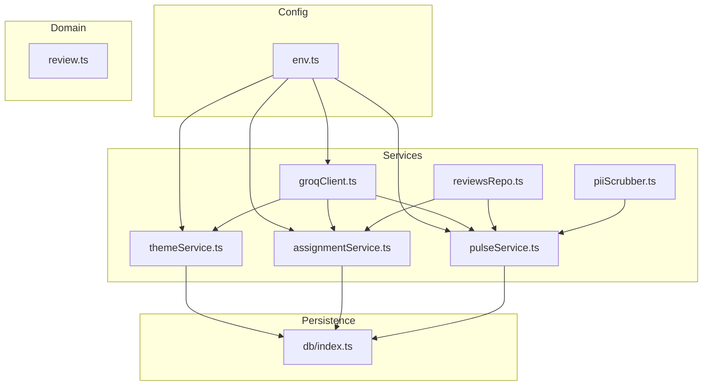
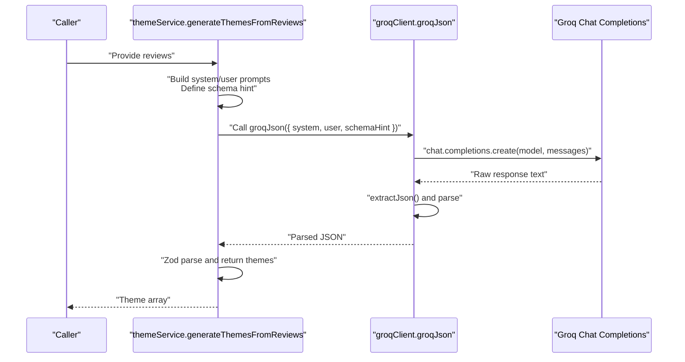
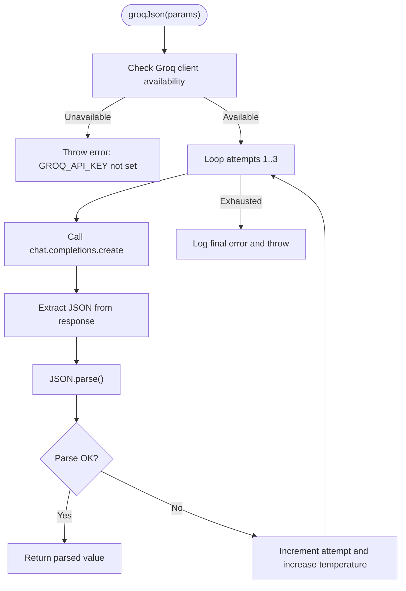
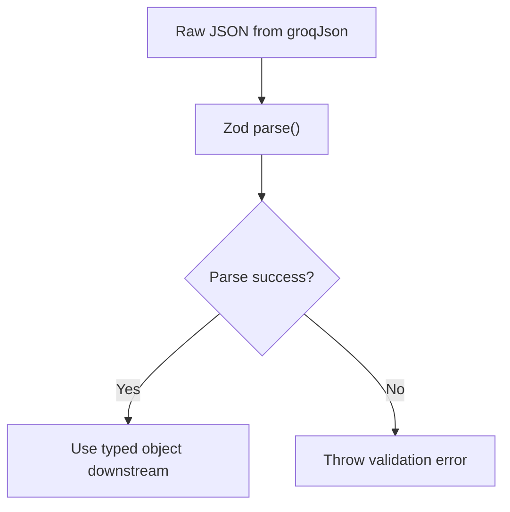
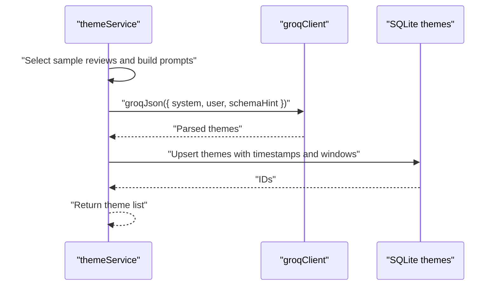
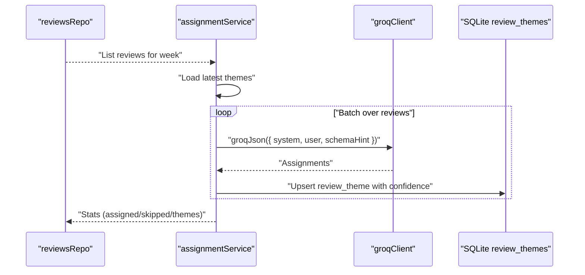
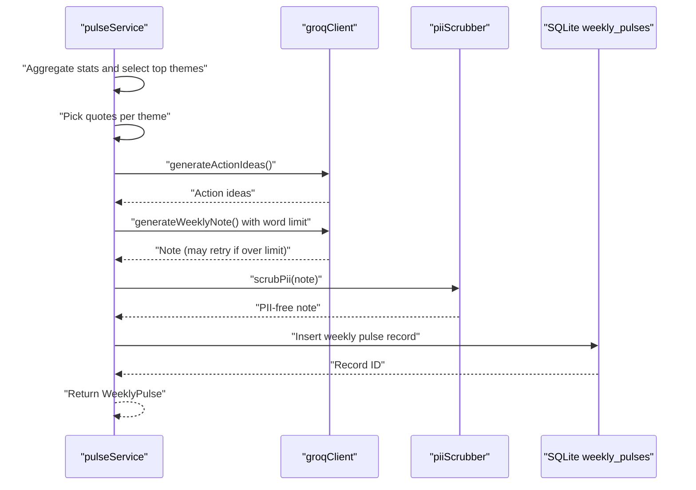
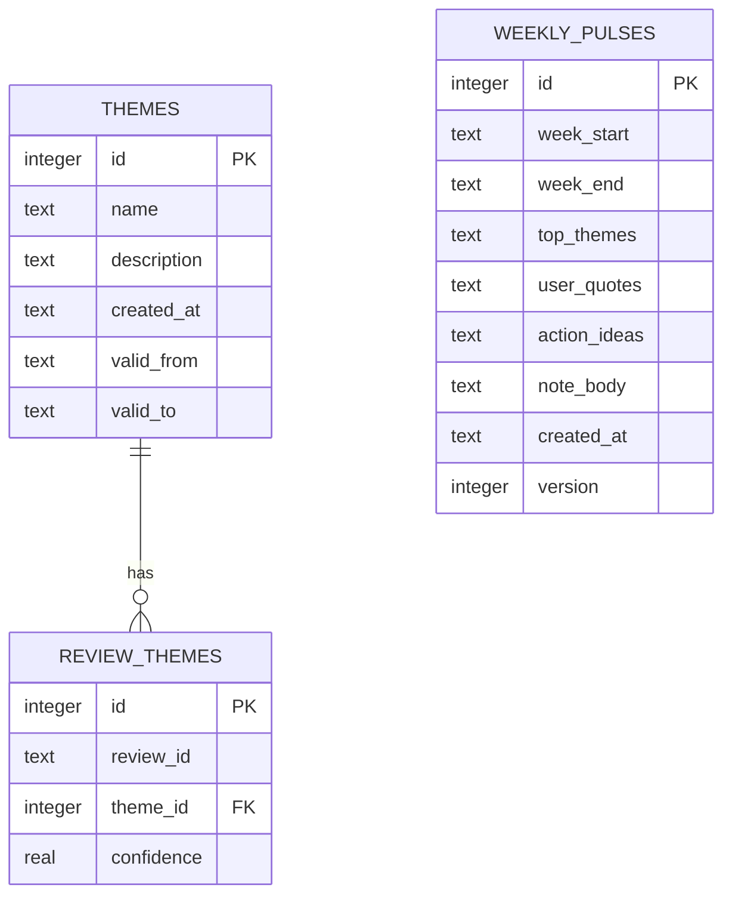
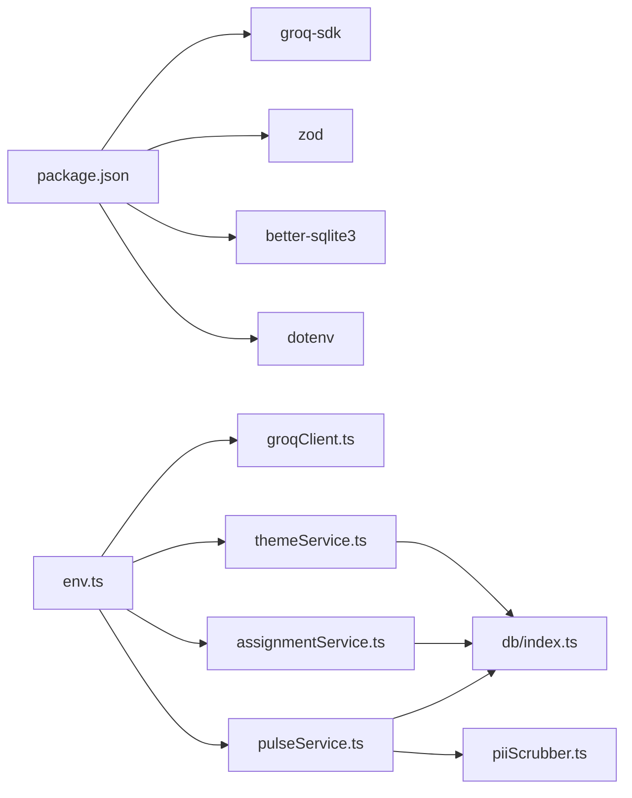

# LLM Integration with Groq

<cite>
**Referenced Files in This Document**
- [groqClient.ts](file://phase-2/src/services/groqClient.ts)
- [themeService.ts](file://phase-2/src/services/themeService.ts)
- [assignmentService.ts](file://phase-2/src/services/assignmentService.ts)
- [pulseService.ts](file://phase-2/src/services/pulseService.ts)
- [reviewsRepo.ts](file://phase-2/src/services/reviewsRepo.ts)
- [env.ts](file://phase-2/src/config/env.ts)
- [review.ts](file://phase-2/src/domain/review.ts)
- [index.ts](file://phase-2/src/db/index.ts)
- [pulse.test.ts](file://phase-2/src/tests/pulse.test.ts)
- [schema.test.ts](file://phase-2/src/tests/schema.test.ts)
- [package.json](file://phase-2/package.json)
</cite>

## Table of Contents
1. [Introduction](#introduction)
2. [Project Structure](#project-structure)
3. [Core Components](#core-components)
4. [Architecture Overview](#architecture-overview)
5. [Detailed Component Analysis](#detailed-component-analysis)
6. [Dependency Analysis](#dependency-analysis)
7. [Performance Considerations](#performance-considerations)
8. [Troubleshooting Guide](#troubleshooting-guide)
9. [Conclusion](#conclusion)
10. [Appendices](#appendices)

## Introduction
This document explains the LLM integration with Groq in Phase 2, focusing on the GroqClient implementation, prompt engineering strategies, JSON schema validation, error handling and retry logic, and the end-to-end theme generation workflow. It also covers the assignment of reviews to themes, weekly pulse generation, and safeguards against PII exposure. Practical examples illustrate prompt construction, response parsing, and error recovery. Finally, it outlines performance optimization, rate limiting considerations, and cost management strategies.

## Project Structure
Phase 2 builds upon Phase 1’s SQLite database and introduces new services for Groq-powered insights:
- Configuration loads environment variables for Groq API key, model, and SMTP settings.
- Services implement theme generation, review assignment, and weekly pulse creation.
- Validation uses Zod schemas to ensure robust parsing and shape guarantees.
- Tests validate schema correctness and word-count enforcement.

**Diagram sources**
- [env.ts:1-23](file://phase-2/src/config/env.ts#L1-L23)
- [groqClient.ts:1-67](file://phase-2/src/services/groqClient.ts#L1-L67)
- [themeService.ts:1-68](file://phase-2/src/services/themeService.ts#L1-L68)
- [assignmentService.ts:1-114](file://phase-2/src/services/assignmentService.ts#L1-L114)
- [pulseService.ts:1-265](file://phase-2/src/services/pulseService.ts#L1-L265)
- [reviewsRepo.ts:1-26](file://phase-2/src/services/reviewsRepo.ts#L1-L26)
- [review.ts:1-12](file://phase-2/src/domain/review.ts#L1-L12)
- [index.ts:1-93](file://phase-2/src/db/index.ts#L1-L93)

**Section sources**
- [env.ts:1-23](file://phase-2/src/config/env.ts#L1-L23)
- [package.json:1-30](file://phase-2/package.json#L1-L30)

## Core Components
- GroqClient: Initializes the Groq SDK client from environment variables and provides a generic JSON extraction and retry mechanism for chat completions.
- ThemeService: Generates themes from recent reviews using structured prompts and validates outputs via Zod schemas.
- AssignmentService: Assigns reviews to themes with confidence scores, batching requests to manage token usage.
- PulseService: Aggregates weekly insights, generates action ideas and a concise weekly note, enforces word limits, and scrubs PII.
- Persistence: SQLite-backed schema for themes, review-theme assignments, weekly pulses, preferences, and scheduled jobs.
- Validation: Zod schemas ensure strict typing and shape guarantees for all LLM responses.

**Section sources**
- [groqClient.ts:1-67](file://phase-2/src/services/groqClient.ts#L1-L67)
- [themeService.ts:1-68](file://phase-2/src/services/themeService.ts#L1-L68)
- [assignmentService.ts:1-114](file://phase-2/src/services/assignmentService.ts#L1-L114)
- [pulseService.ts:1-265](file://phase-2/src/services/pulseService.ts#L1-L265)
- [index.ts:1-93](file://phase-2/src/db/index.ts#L1-L93)

## Architecture Overview
The system orchestrates three primary workflows:
- Theme Generation: Collects a sample of cleaned review texts, constructs a system and user prompt, calls Groq, extracts JSON, validates with Zod, and persists themes.
- Review Assignment: Iterates over weekly reviews in batches, assigns each to a theme or “Other,” and persists the mapping with optional confidence.
- Weekly Pulse: Aggregates theme statistics for the week, selects representative quotes, generates action ideas, writes a concise note, enforces word limits, scrubs PII, and stores the result.

**Diagram sources**
- [themeService.ts:17-37](file://phase-2/src/services/themeService.ts#L17-L37)
- [groqClient.ts:30-65](file://phase-2/src/services/groqClient.ts#L30-L65)

## Detailed Component Analysis

### GroqClient Implementation
- Initialization: Creates a Groq client only when the API key is present; otherwise returns null to prevent runtime errors.
- JSON Extraction: Robustly extracts JSON from fenced code blocks or malformed outputs by locating braces and trimming whitespace.
- Retry Logic: Attempts up to three times with incremental temperature increases to improve deterministic JSON output on retries.
- Request Construction: Sends a system message and a user message that includes a strict instruction to return only valid JSON and a schema hint.

**Diagram sources**
- [groqClient.ts:30-65](file://phase-2/src/services/groqClient.ts#L30-L65)

**Section sources**
- [groqClient.ts:1-67](file://phase-2/src/services/groqClient.ts#L1-L67)

### Prompt Engineering Strategies
- Role Definitions: System messages define the persona (product analyst) and constraints (no PII, concise output).
- Instruction Formatting: User prompts include:
  - A clear directive to return only valid JSON.
  - A schema hint to guide the model’s output structure.
  - Structured context (e.g., theme lists, review samples).
- Temperature Tuning: Slightly increasing temperature on retries improves convergence toward deterministic JSON.

Examples by component:
- Theme Generation: Builds a system role and a user prompt enumerating a sample of cleaned review texts, then requests a JSON array of themes.
- Assignment: Provides allowed theme names and descriptions, instructs the model to assign each review to one theme or “Other,” and requests a JSON array of assignments with optional confidence.
- Weekly Pulse: Supplies top themes, quotes, and action ideas, and enforces a strict word limit in the note.

**Section sources**
- [themeService.ts:17-37](file://phase-2/src/services/themeService.ts#L17-L37)
- [assignmentService.ts:27-67](file://phase-2/src/services/assignmentService.ts#L27-L67)
- [pulseService.ts:109-172](file://phase-2/src/services/pulseService.ts#L109-L172)

### JSON Schema Validation and Parsing
- Zod Schemas: Define strict shapes for:
  - Theme arrays with min/max lengths and field constraints.
  - Assignment arrays with review identifiers, theme names, and optional confidence.
  - Weekly note with a bounded word count.
- Validation Pipeline: After groqJson returns raw JSON, each service parses with its Zod schema. On failure, the error propagates for upstream handling.
- Word Count Guard: Weekly note generation includes a second pass if the initial output exceeds the word limit.

**Diagram sources**
- [themeService.ts:6-13](file://phase-2/src/services/themeService.ts#L6-L13)
- [assignmentService.ts:9-17](file://phase-2/src/services/assignmentService.ts#L9-L17)
- [pulseService.ts:42-48](file://phase-2/src/services/pulseService.ts#L42-L48)

**Section sources**
- [themeService.ts:1-68](file://phase-2/src/services/themeService.ts#L1-L68)
- [assignmentService.ts:1-114](file://phase-2/src/services/assignmentService.ts#L1-L114)
- [pulseService.ts:1-265](file://phase-2/src/services/pulseService.ts#L1-L265)

### Theme Generation Workflow
- Input: Reviews are sampled and cleaned; a system role defines the analyst persona and PII constraints; a user prompt enumerates review excerpts.
- Processing: Calls groqJson with a schema hint for an array of themes.
- Output: Zod-parsed themes are returned and persisted via upsert.

**Diagram sources**
- [themeService.ts:17-56](file://phase-2/src/services/themeService.ts#L17-L56)
- [groqClient.ts:30-65](file://phase-2/src/services/groqClient.ts#L30-L65)
- [index.ts:7-52](file://phase-2/src/db/index.ts#L7-L52)

**Section sources**
- [themeService.ts:17-56](file://phase-2/src/services/themeService.ts#L17-L56)

### Review Assignment to Themes
- Input: Weekly reviews and latest themes.
- Processing: Iterates over reviews in batches, constructs a user prompt with allowed themes, calls groqJson, parses assignments, and persists mappings with optional confidence.
- Persistence: Uses an upsert to update confidence values for repeated runs.

**Diagram sources**
- [reviewsRepo.ts:16-24](file://phase-2/src/services/reviewsRepo.ts#L16-L24)
- [assignmentService.ts:27-97](file://phase-2/src/services/assignmentService.ts#L27-L97)
- [index.ts:24-33](file://phase-2/src/db/index.ts#L24-L33)

**Section sources**
- [assignmentService.ts:27-97](file://phase-2/src/services/assignmentService.ts#L27-L97)

### Weekly Pulse Generation
- Inputs: Top themes, selected quotes, and generated action ideas.
- Processing: Generates action ideas and a weekly note; enforces a strict word limit with a fallback prompt if exceeded; scrubs PII before storage.
- Storage: Inserts a record with JSON-serialized arrays and metadata.

**Diagram sources**
- [pulseService.ts:109-241](file://phase-2/src/services/pulseService.ts#L109-L241)
- [pulse.test.ts:49-85](file://phase-2/src/tests/pulse.test.ts#L49-L85)

**Section sources**
- [pulseService.ts:109-241](file://phase-2/src/services/pulseService.ts#L109-L241)
- [pulse.test.ts:49-85](file://phase-2/src/tests/pulse.test.ts#L49-L85)

### Data Models and Persistence
- Themes: name, description, timestamps, and optional validity window.
- Review-Theme Assignments: review_id, theme_id, and optional confidence.
- Weekly Pulses: week range, serialized top themes, quotes, action ideas, note body, timestamps, and version.
- Indexes: Unique constraints and indexes optimize lookups and prevent duplicates.

**Diagram sources**
- [index.ts:9-52](file://phase-2/src/db/index.ts#L9-L52)

**Section sources**
- [index.ts:1-93](file://phase-2/src/db/index.ts#L1-L93)

## Dependency Analysis
- External Dependencies: groq-sdk, zod, better-sqlite3, dotenv, express, nodemailer.
- Internal Dependencies: Services depend on env configuration, domain types, and the SQLite database. Validation ensures robustness across the pipeline.

**Diagram sources**
- [package.json:13-20](file://phase-2/package.json#L13-L20)
- [env.ts:7-21](file://phase-2/src/config/env.ts#L7-L21)
- [groqClient.ts:1-7](file://phase-2/src/services/groqClient.ts#L1-L7)
- [index.ts:1-5](file://phase-2/src/db/index.ts#L1-L5)

**Section sources**
- [package.json:1-30](file://phase-2/package.json#L1-L30)
- [env.ts:1-23](file://phase-2/src/config/env.ts#L1-L23)

## Performance Considerations
- Token Management:
  - Batch processing: AssignmentService processes reviews in fixed-size batches to control token consumption per request.
  - Prompt minimization: Use concise theme lists and truncated review excerpts to reduce input size.
- Retry Strategy:
  - Incremental temperature on retries improves determinism for JSON parsing.
  - Limit retries to avoid excessive latency and cost.
- Caching and Deduplication:
  - Reuse latest themes to minimize repeated generation.
  - Avoid regenerating weekly pulses for the same week_start/version.
- Database Efficiency:
  - Use upserts and transactions to reduce round-trips.
  - Leverage indexes on foreign keys and uniqueness constraints.
- Cost Control:
  - Choose appropriate models and tune temperature to balance quality and cost.
  - Monitor output length (word count) to avoid unnecessary tokens.

[No sources needed since this section provides general guidance]

## Troubleshooting Guide
- Missing API Key:
  - Symptom: Error indicating the Groq API key is not set.
  - Resolution: Set GROQ_API_KEY in the environment file and restart the service.
- JSON Parsing Failures:
  - Symptom: Validation errors or groqJson throwing after retries.
  - Resolution: Strengthen schema hints, enforce stricter instructions in prompts, and verify model consistency.
- Over-limit Outputs:
  - Symptom: Weekly note exceeds word count.
  - Resolution: Use the built-in retry with a stricter prompt; optionally shorten theme/quote summaries.
- PII Exposure:
  - Symptom: Sensitive data in outputs.
  - Resolution: Apply PII scrubbing before storing or sending; ensure system/user prompts explicitly forbid PII.
- Empty Inputs:
  - Symptom: No themes found or no reviews for the week.
  - Resolution: Trigger theme generation first; ensure weekly assignment runs after theme generation.

**Section sources**
- [groqClient.ts:35-65](file://phase-2/src/services/groqClient.ts#L35-L65)
- [pulseService.ts:162-171](file://phase-2/src/services/pulseService.ts#L162-L171)
- [pulse.test.ts:49-85](file://phase-2/src/tests/pulse.test.ts#L49-L85)

## Conclusion
Phase 2 integrates Groq to power theme generation, review assignment, and weekly pulse creation. Robust prompt engineering, strict JSON schema validation, and resilient retry logic ensure reliable outputs. Persistence is optimized with SQLite and Zod validations. By following the outlined practices—prompt discipline, batching, validation, PII scrubbing, and cost-conscious model selection—the system scales efficiently while maintaining data integrity and user safety.

[No sources needed since this section summarizes without analyzing specific files]

## Appendices

### Environment Configuration
- Required Variables:
  - GROQ_API_KEY: Groq API key for authentication.
  - GROQ_MODEL: Model identifier used for chat completions.
  - DATABASE_FILE: Path to the SQLite database file.
  - SMTP_*: SMTP host, port, credentials, and sender address for email notifications.

**Section sources**
- [env.ts:7-21](file://phase-2/src/config/env.ts#L7-L21)

### Example Prompt Construction Patterns
- Theme Generation:
  - System: Analyst role with PII constraints.
  - User: Enumerated review excerpts with explicit JSON-only instruction and schema hint.
- Assignment:
  - System: Analyst role with assignment constraints.
  - User: Allowed theme list and a batch of reviews with explicit JSON-only instruction and schema hint.
- Weekly Pulse:
  - System: Analyst role with word limit constraints.
  - User: Top themes, quotes, and action ideas with explicit JSON-only instruction and schema hint.

**Section sources**
- [themeService.ts:17-37](file://phase-2/src/services/themeService.ts#L17-L37)
- [assignmentService.ts:27-67](file://phase-2/src/services/assignmentService.ts#L27-L67)
- [pulseService.ts:109-172](file://phase-2/src/services/pulseService.ts#L109-L172)

### Testing Highlights
- Zod Validation: Ensures schema correctness in isolation.
- Word Count Guard: Validates that generated notes adhere to the specified word limit.
- PII Scrubber: Confirms redaction of emails, phone numbers, URLs, and handles.

**Section sources**
- [schema.test.ts:1-10](file://phase-2/src/tests/schema.test.ts#L1-L10)
- [pulse.test.ts:49-85](file://phase-2/src/tests/pulse.test.ts#L49-L85)