# Phase 2: Advanced Analytics & Automation

<cite>
**Referenced Files in This Document**
- [server.ts](file://phase-2/src/api/server.ts)
- [env.ts](file://phase-2/src/config/env.ts)
- [groqClient.ts](file://phase-2/src/services/groqClient.ts)
- [themeService.ts](file://phase-2/src/services/themeService.ts)
- [assignmentService.ts](file://phase-2/src/services/assignmentService.ts)
- [pulseService.ts](file://phase-2/src/services/pulseService.ts)
- [emailService.ts](file://phase-2/src/services/emailService.ts)
- [schedulerJob.ts](file://phase-2/src/jobs/schedulerJob.ts)
- [reviewsRepo.ts](file://phase-2/src/services/reviewsRepo.ts)
- [userPrefsRepo.ts](file://phase-2/src/services/userPrefsRepo.ts)
- [index.ts](file://phase-2/src/db/index.ts)
- [review.ts](file://phase-2/src/domain/review.ts)
- [runPulsePipeline.ts](file://phase-2/scripts/runPulsePipeline.ts)
- [testEmail.ts](file://phase-2/scripts/testEmail.ts)
- [package.json](file://phase-2/package.json)
</cite>

## Table of Contents
1. [Introduction](#introduction)
2. [Project Structure](#project-structure)
3. [Core Components](#core-components)
4. [Architecture Overview](#architecture-overview)
5. [Detailed Component Analysis](#detailed-component-analysis)
6. [Dependency Analysis](#dependency-analysis)
7. [Performance Considerations](#performance-considerations)
8. [Troubleshooting Guide](#troubleshooting-guide)
9. [Conclusion](#conclusion)
10. [Appendices](#appendices)

## Introduction
Phase 2 introduces advanced AI-driven analytics powered by Groq, enabling theme generation from recent reviews, review-to-theme assignment with confidence scores, and automated weekly pulse creation. It integrates robust prompt engineering, strict JSON schema validation, and PII scrubbing to ensure safe, reliable outputs. The system includes a production-ready email service with SMTP configuration and template management, plus a scheduler that automatically generates and delivers weekly pulses to user preferences. APIs expose endpoints for theme management, pulse generation, and user preferences, while database schema extensions support persistent storage of themes, assignments, weekly pulses, user preferences, and scheduled jobs.

## Project Structure
Phase 2 builds upon Phase 1’s SQLite database and adds a modular backend with:
- API layer exposing REST endpoints
- Services for Groq integration, theme management, assignment, pulse generation, email, and user preferences
- Scheduler for automated weekly pulse generation and delivery
- Scripts for end-to-end pipeline runs and email testing
- Strong typing via Zod schemas and domain models

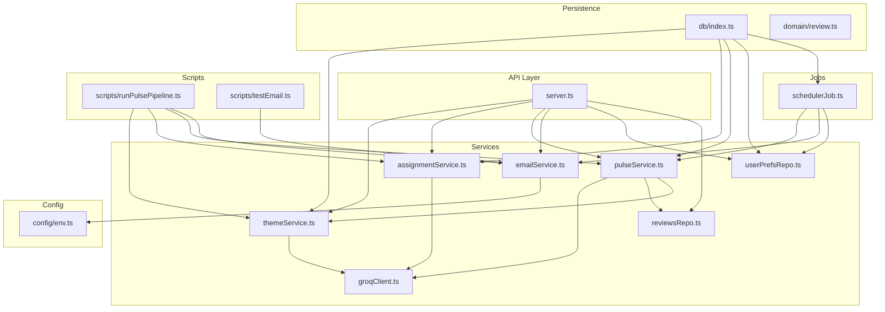

**Diagram sources**
- [server.ts:1-266](file://phase-2/src/api/server.ts#L1-L266)
- [groqClient.ts:1-67](file://phase-2/src/services/groqClient.ts#L1-L67)
- [themeService.ts:1-68](file://phase-2/src/services/themeService.ts#L1-L68)
- [assignmentService.ts:1-114](file://phase-2/src/services/assignmentService.ts#L1-L114)
- [pulseService.ts:1-265](file://phase-2/src/services/pulseService.ts#L1-L265)
- [emailService.ts:1-142](file://phase-2/src/services/emailService.ts#L1-L142)
- [schedulerJob.ts:1-98](file://phase-2/src/jobs/schedulerJob.ts#L1-L98)
- [reviewsRepo.ts:1-26](file://phase-2/src/services/reviewsRepo.ts#L1-L26)
- [userPrefsRepo.ts:1-95](file://phase-2/src/services/userPrefsRepo.ts#L1-L95)
- [index.ts:1-93](file://phase-2/src/db/index.ts#L1-L93)
- [review.ts:1-12](file://phase-2/src/domain/review.ts#L1-L12)
- [env.ts:1-23](file://phase-2/src/config/env.ts#L1-L23)
- [runPulsePipeline.ts:1-52](file://phase-2/scripts/runPulsePipeline.ts#L1-L52)
- [testEmail.ts:1-16](file://phase-2/scripts/testEmail.ts#L1-L16)

**Section sources**
- [server.ts:1-266](file://phase-2/src/api/server.ts#L1-L266)
- [env.ts:1-23](file://phase-2/src/config/env.ts#L1-L23)
- [index.ts:1-93](file://phase-2/src/db/index.ts#L1-L93)
- [package.json:1-30](file://phase-2/package.json#L1-L30)

## Core Components
- Groq client with robust JSON extraction and retry logic
- Theme generation using LLM with schema validation
- Review-to-theme assignment with confidence scoring
- Weekly pulse generation with action ideas and note composition
- Email service with HTML/text templates and SMTP transport
- Automated scheduler for weekly pulse delivery based on user preferences
- Database schema extensions for themes, assignments, pulses, preferences, and scheduled jobs
- API endpoints for theme management, pulse generation, and user preferences

**Section sources**
- [groqClient.ts:1-67](file://phase-2/src/services/groqClient.ts#L1-L67)
- [themeService.ts:1-68](file://phase-2/src/services/themeService.ts#L1-L68)
- [assignmentService.ts:1-114](file://phase-2/src/services/assignmentService.ts#L1-L114)
- [pulseService.ts:1-265](file://phase-2/src/services/pulseService.ts#L1-L265)
- [emailService.ts:1-142](file://phase-2/src/services/emailService.ts#L1-L142)
- [schedulerJob.ts:1-98](file://phase-2/src/jobs/schedulerJob.ts#L1-L98)
- [index.ts:1-93](file://phase-2/src/db/index.ts#L1-L93)
- [server.ts:28-248](file://phase-2/src/api/server.ts#L28-L248)

## Architecture Overview
The system orchestrates a data flow from stored reviews to AI-generated insights and automated delivery:
- API routes trigger theme generation, assignment, and pulse creation
- Groq is used for structured outputs with schema hints and retries
- Zod validates AI outputs against strict schemas
- SQLite persists themes, assignments, pulses, preferences, and scheduled jobs
- Nodemailer sends HTML/text emails with PII scrubbing
- Scheduler periodically checks due preferences and dispatches pulses

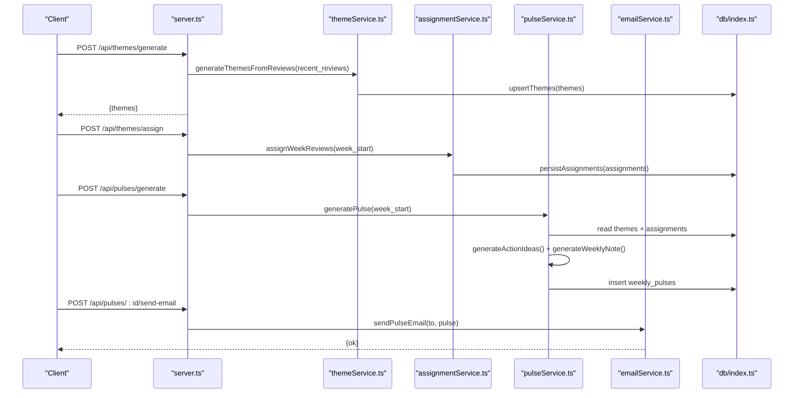

**Diagram sources**
- [server.ts:28-154](file://phase-2/src/api/server.ts#L28-L154)
- [themeService.ts:17-56](file://phase-2/src/services/themeService.ts#L17-L56)
- [assignmentService.ts:27-113](file://phase-2/src/services/assignmentService.ts#L27-L113)
- [pulseService.ts:179-241](file://phase-2/src/services/pulseService.ts#L179-L241)
- [emailService.ts:114-129](file://phase-2/src/services/emailService.ts#L114-L129)
- [index.ts:7-91](file://phase-2/src/db/index.ts#L7-L91)

## Detailed Component Analysis

### Groq Client and Prompt Engineering
- Initializes Groq SDK only when API key is present
- Implements robust JSON extraction from LLM responses, including fenced code blocks
- Retries with increasing temperature to improve reliability
- Enforces strict schema hints and parses responses with Zod

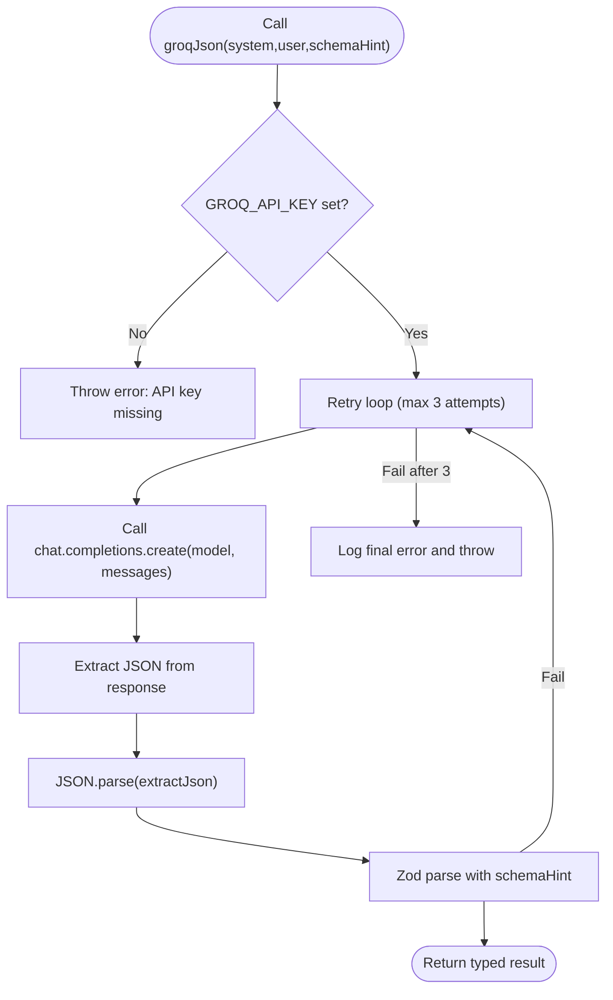

**Diagram sources**
- [groqClient.ts:30-67](file://phase-2/src/services/groqClient.ts#L30-L67)

**Section sources**
- [groqClient.ts:1-67](file://phase-2/src/services/groqClient.ts#L1-L67)

### Theme Generation Workflow
- Loads recent reviews and samples a subset
- Prompts Groq to propose 3–5 themes with names and descriptions
- Validates response using Zod schema
- Upserts themes into the database with timestamps

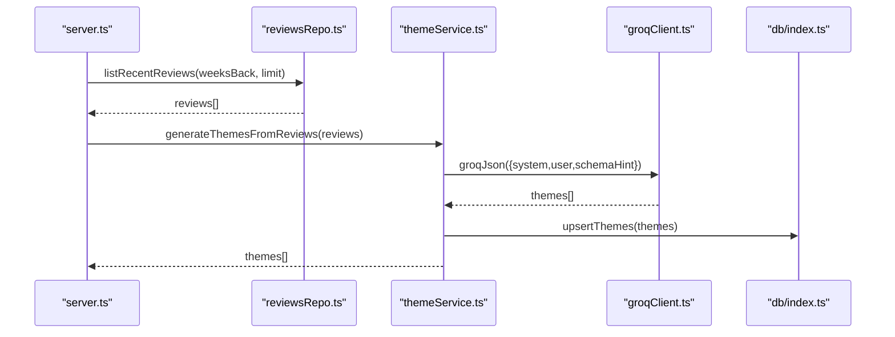

**Diagram sources**
- [server.ts:28-43](file://phase-2/src/api/server.ts#L28-L43)
- [reviewsRepo.ts:4-14](file://phase-2/src/services/reviewsRepo.ts#L4-L14)
- [themeService.ts:17-37](file://phase-2/src/services/themeService.ts#L17-L37)
- [groqClient.ts:30-56](file://phase-2/src/services/groqClient.ts#L30-L56)
- [index.ts:7-22](file://phase-2/src/db/index.ts#L7-L22)

**Section sources**
- [themeService.ts:17-56](file://phase-2/src/services/themeService.ts#L17-L56)
- [reviewsRepo.ts:4-14](file://phase-2/src/services/reviewsRepo.ts#L4-L14)

### Review-to-Theme Assignment with Confidence Scoring
- Loads a week’s reviews and latest themes
- Sends a batched prompt to Groq to assign each review to a theme or “Other”
- Persists assignments with optional confidence scores
- Returns statistics for assigned and skipped items

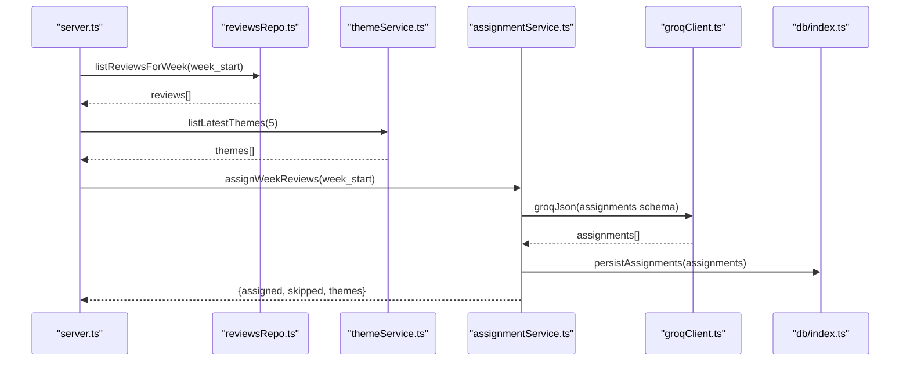

**Diagram sources**
- [server.ts:56-70](file://phase-2/src/api/server.ts#L56-L70)
- [reviewsRepo.ts:16-24](file://phase-2/src/services/reviewsRepo.ts#L16-L24)
- [themeService.ts:58-66](file://phase-2/src/services/themeService.ts#L58-L66)
- [assignmentService.ts:27-113](file://phase-2/src/services/assignmentService.ts#L27-L113)
- [groqClient.ts:30-67](file://phase-2/src/services/groqClient.ts#L30-L67)
- [index.ts:24-38](file://phase-2/src/db/index.ts#L24-L38)

**Section sources**
- [assignmentService.ts:27-113](file://phase-2/src/services/assignmentService.ts#L27-L113)

### Weekly Pulse Generation and Note Composition
- Aggregates per-theme stats for the week and selects top 3
- Picks representative quotes per theme (PII-free)
- Generates 3 concise action ideas and a scannable weekly note (≤250 words)
- Stores the pulse with versioning and returns it

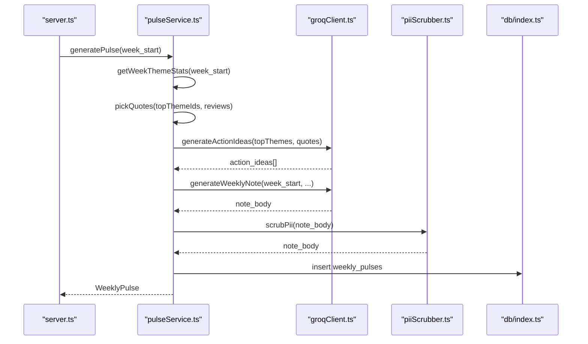

**Diagram sources**
- [server.ts:76-90](file://phase-2/src/api/server.ts#L76-L90)
- [pulseService.ts:179-241](file://phase-2/src/services/pulseService.ts#L179-L241)
- [groqClient.ts:30-67](file://phase-2/src/services/groqClient.ts#L30-L67)
- [index.ts:40-57](file://phase-2/src/db/index.ts#L40-L57)

**Section sources**
- [pulseService.ts:179-241](file://phase-2/src/services/pulseService.ts#L179-L241)

### Email Service Implementation
- Builds HTML and text templates from pulse data
- Uses Nodemailer with configurable SMTP settings
- Scrubs PII from email bodies before sending
- Provides a test endpoint to validate SMTP configuration

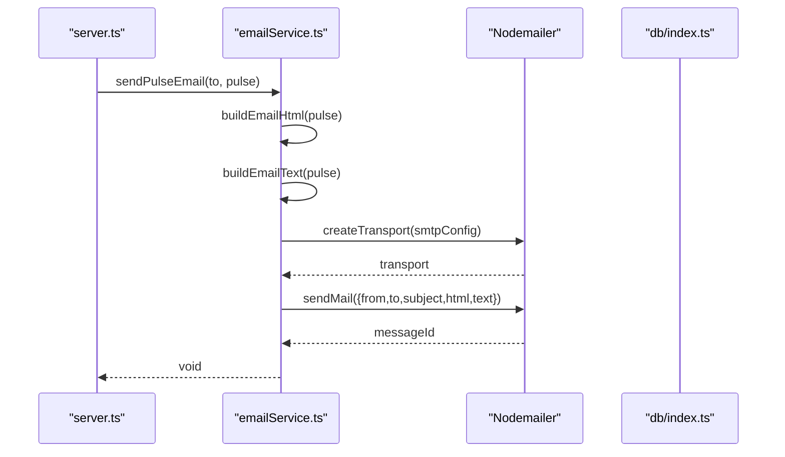

**Diagram sources**
- [server.ts:123-154](file://phase-2/src/api/server.ts#L123-L154)
- [emailService.ts:9-129](file://phase-2/src/services/emailService.ts#L9-L129)
- [env.ts:16-21](file://phase-2/src/config/env.ts#L16-L21)

**Section sources**
- [emailService.ts:9-129](file://phase-2/src/services/emailService.ts#L1-L129)
- [env.ts:16-21](file://phase-2/src/config/env.ts#L16-L21)

### Automated Job Scheduling System
- Computes the most recent full week (last Monday) based on UTC
- Identifies due user preferences whose next send time is now or earlier
- Generates the pulse, sends email, and records job status in the database
- Runs on a fixed interval with exponential backoff via retries

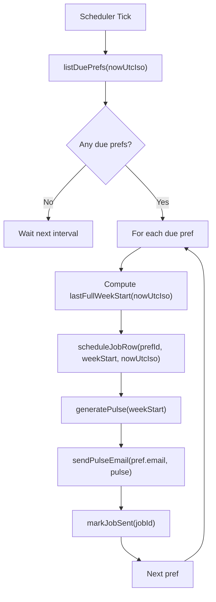

**Diagram sources**
- [schedulerJob.ts:52-97](file://phase-2/src/jobs/schedulerJob.ts#L52-L97)
- [index.ts:73-88](file://phase-2/src/db/index.ts#L73-L88)

**Section sources**
- [schedulerJob.ts:52-97](file://phase-2/src/jobs/schedulerJob.ts#L1-L98)

### User Preferences Management
- Upserts preferences, deactivating previous active rows
- Computes next send time based on preferred day of week and time
- Filters due preferences for the scheduler

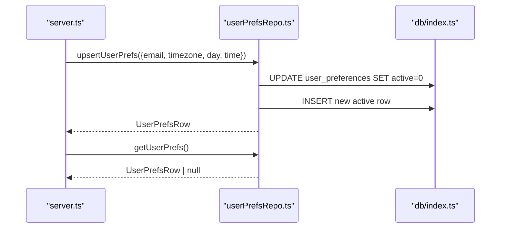

**Diagram sources**
- [server.ts:160-212](file://phase-2/src/api/server.ts#L160-L212)
- [userPrefsRepo.ts:21-56](file://phase-2/src/services/userPrefsRepo.ts#L21-L56)
- [index.ts:60-69](file://phase-2/src/db/index.ts#L60-L69)

**Section sources**
- [userPrefsRepo.ts:21-95](file://phase-2/src/services/userPrefsRepo.ts#L1-L95)

### Database Schema Extensions
- themes: stores theme definitions with validity windows
- review_themes: maps reviews to themes with optional confidence
- weekly_pulses: stores generated pulses with JSON payloads and versioning
- user_preferences: stores user email and delivery preferences
- scheduled_jobs: tracks scheduler execution status and errors

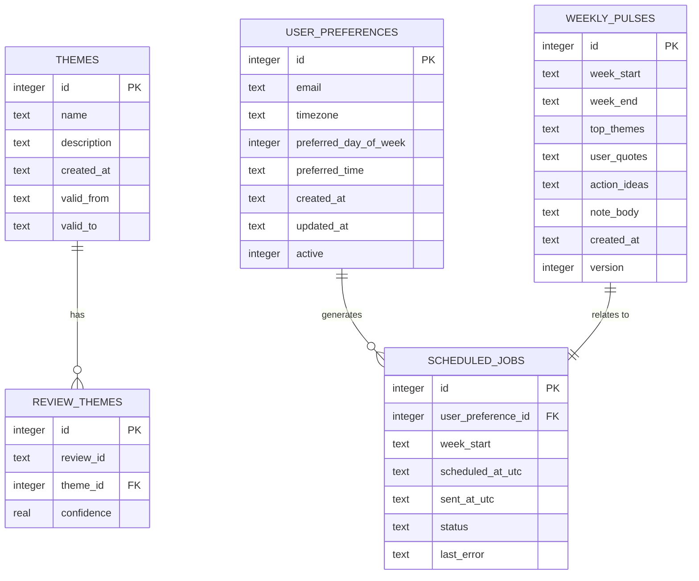

**Diagram sources**
- [index.ts:7-91](file://phase-2/src/db/index.ts#L7-L91)

**Section sources**
- [index.ts:7-91](file://phase-2/src/db/index.ts#L1-L93)

### API Endpoints
- Theme management
  - POST /api/themes/generate: generate and store 3–5 themes from recent reviews
  - GET /api/themes: list latest themes
  - POST /api/themes/assign: assign reviews for a week to the latest themes
- Pulse management
  - POST /api/pulses/generate: generate weekly pulse for a given week
  - GET /api/pulses: list recent pulses
  - GET /api/pulses/:id: fetch a single pulse
  - POST /api/pulses/:id/send-email: email a pulse to a recipient
- User preferences
  - POST /api/user-preferences: save user preferences
  - GET /api/user-preferences: retrieve active preferences
- Email testing
  - POST /api/email/test: send a test email to verify SMTP setup
- Debug convenience
  - GET /api/reviews/week/:weekStart: list a week’s reviews

**Section sources**
- [server.ts:28-248](file://phase-2/src/api/server.ts#L28-L248)

## Dependency Analysis
- External libraries
  - Express: web framework
  - better-sqlite3: embedded database
  - groq-sdk: Groq client
  - nodemailer: SMTP transport
  - zod: schema validation
  - dotenv: environment loading
- Internal dependencies
  - API depends on services and repositories
  - Services depend on Groq client, Zod schemas, and database
  - Scheduler depends on pulse and email services and user preferences
  - Scripts orchestrate full pipeline execution

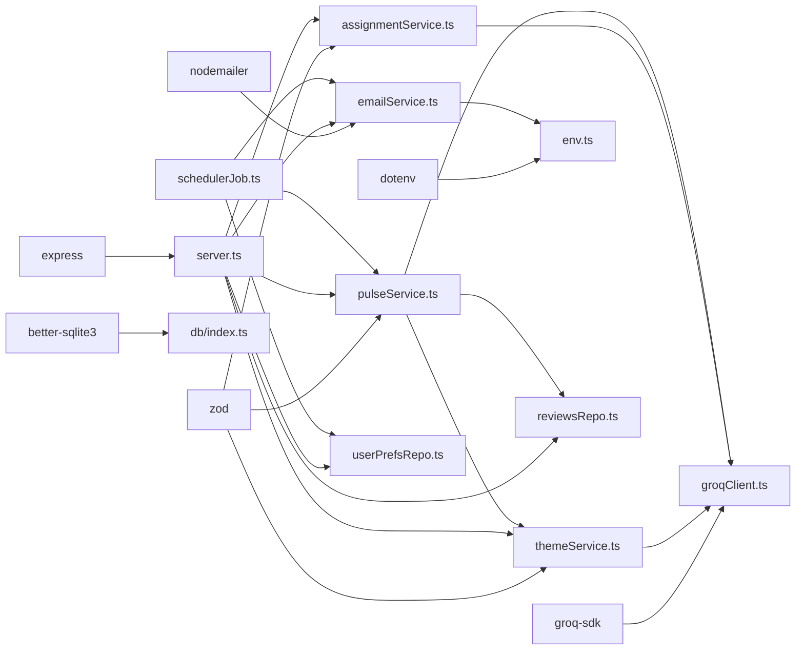

**Diagram sources**
- [package.json:13-28](file://phase-2/package.json#L13-L28)
- [server.ts:1-13](file://phase-2/src/api/server.ts#L1-L13)
- [groqClient.ts:1](file://phase-2/src/services/groqClient.ts#L1)
- [emailService.ts:1](file://phase-2/src/services/emailService.ts#L1)
- [env.ts:5](file://phase-2/src/config/env.ts#L5)
- [index.ts:5](file://phase-2/src/db/index.ts#L5)

**Section sources**
- [package.json:13-28](file://phase-2/package.json#L13-L28)

## Performance Considerations
- Batched Groq calls: assignmentService processes reviews in small batches to manage token usage and cost
- Schema-first prompts: strict schema hints reduce hallucinations and parsing overhead
- SQLite indexing: unique indexes on themes and weekly pulses prevent duplicates and speed lookups
- Retry with jittered temperature: improves resilience without excessive retries
- PII scrubbing: minimal regex passes ensure safe outputs before persistence or email
- Scheduler cadence: default 5-minute intervals balance timeliness and resource usage

[No sources needed since this section provides general guidance]

## Troubleshooting Guide
- Groq API key missing
  - Symptom: error thrown when calling Groq client
  - Resolution: set GROQ_API_KEY or disable scheduler
- SMTP configuration errors
  - Symptom: error indicating missing SMTP credentials
  - Resolution: configure SMTP_HOST, SMTP_USER, SMTP_PASS, SMTP_FROM
- No themes found
  - Symptom: error when generating pulse without prior theme generation
  - Resolution: run theme generation endpoint first
- No reviews for week
  - Symptom: error when generating pulse before assignment
  - Resolution: run theme assignment for the target week
- Scheduler not starting
  - Symptom: scheduler logs indicate not started
  - Resolution: set GROQ_API_KEY to enable automatic scheduler start
- Email delivery failures
  - Use the test endpoint to validate SMTP configuration
- Pipeline script issues
  - Ensure database initialization and recent reviews exist before running the pipeline

**Section sources**
- [groqClient.ts:35-37](file://phase-2/src/services/groqClient.ts#L35-L37)
- [emailService.ts:99-112](file://phase-2/src/services/emailService.ts#L99-L112)
- [pulseService.ts:179-188](file://phase-2/src/services/pulseService.ts#L179-L188)
- [server.ts:257-262](file://phase-2/src/api/server.ts#L257-L262)
- [testEmail.ts:1-16](file://phase-2/scripts/testEmail.ts#L1-L16)
- [runPulsePipeline.ts:14-49](file://phase-2/scripts/runPulsePipeline.ts#L14-L49)

## Conclusion
Phase 2 delivers a production-grade, AI-powered analytics pipeline that transforms app store reviews into actionable insights. By combining structured prompts, schema validation, and robust persistence, it ensures reliable theme generation, accurate assignments, and high-quality weekly pulses. The email service and scheduler automate delivery based on user preferences, while the API exposes clear endpoints for operational control. Extensive logging, error handling, and testing support ongoing maintenance and scaling.

[No sources needed since this section summarizes without analyzing specific files]

## Appendices

### Practical Examples

- LLM Interaction Example
  - Generate themes from recent reviews
    - Endpoint: POST /api/themes/generate
    - Behavior: loads recent reviews, calls Groq with schema hint, validates with Zod, upserts themes
    - Reference: [server.ts:28-43](file://phase-2/src/api/server.ts#L28-L43), [themeService.ts:17-37](file://phase-2/src/services/themeService.ts#L17-L37)
  - Assign reviews to themes with confidence
    - Endpoint: POST /api/themes/assign
    - Behavior: batched Groq prompts, Zod validation, persisted assignments
    - Reference: [server.ts:56-70](file://phase-2/src/api/server.ts#L56-L70), [assignmentService.ts:27-67](file://phase-2/src/services/assignmentService.ts#L27-L67)

- Scheduling Workflow Example
  - Automatic pulse delivery
    - Behavior: compute last full week, find due preferences, generate pulse, send email, record job
    - Reference: [schedulerJob.ts:52-97](file://phase-2/src/jobs/schedulerJob.ts#L52-L97)
  - Manual pulse generation
    - Endpoint: POST /api/pulses/generate
    - Reference: [server.ts:76-90](file://phase-2/src/api/server.ts#L76-L90), [pulseService.ts:179-241](file://phase-2/src/services/pulseService.ts#L179-L241)

- Email Automation Example
  - Send pulse via email
    - Endpoint: POST /api/pulses/:id/send-email
    - Behavior: resolves recipient from body or user preferences, builds HTML/text, scrubs PII, sends
    - Reference: [server.ts:123-154](file://phase-2/src/api/server.ts#L123-L154), [emailService.ts:9-129](file://phase-2/src/services/emailService.ts#L9-L129)

- End-to-End Pipeline Script
  - Full pipeline execution
    - Script: scripts/runPulsePipeline.ts
    - Steps: init schema, generate themes, assign themes, generate pulse, send email
    - Reference: [runPulsePipeline.ts:14-49](file://phase-2/scripts/runPulsePipeline.ts#L14-L49)

**Section sources**
- [server.ts:28-154](file://phase-2/src/api/server.ts#L28-L154)
- [themeService.ts:17-37](file://phase-2/src/services/themeService.ts#L17-L37)
- [assignmentService.ts:27-67](file://phase-2/src/services/assignmentService.ts#L27-L67)
- [pulseService.ts:179-241](file://phase-2/src/services/pulseService.ts#L179-L241)
- [emailService.ts:9-129](file://phase-2/src/services/emailService.ts#L9-L129)
- [runPulsePipeline.ts:14-49](file://phase-2/scripts/runPulsePipeline.ts#L14-L49)