# Phase 2: Advanced Analytics & Automation

<cite>
**Referenced Files in This Document**
- [server.ts](file://phase-2/src/api/server.ts)
- [env.ts](file://phase-2/src/config/env.ts)
- [groqClient.ts](file://phase-2/src/services/groqClient.ts)
- [themeService.ts](file://phase-2/src/services/themeService.ts)
- [assignmentService.ts](file://phase-2/src/services/assignmentService.ts)
- [pulseService.ts](file://phase-2/src/services/pulseService.ts)
- [emailService.ts](file://phase-2/src/services/emailService.ts)
- [schedulerJob.ts](file://phase-2/src/jobs/schedulerJob.ts)
- [reviewsRepo.ts](file://phase-2/src/services/reviewsRepo.ts)
- [userPrefsRepo.ts](file://phase-2/src/services/userPrefsRepo.ts)
- [index.ts](file://phase-2/src/db/index.ts)
- [postgres.ts](file://phase-2/src/db/postgres.ts)
- [review.ts](file://phase-2/src/domain/review.ts)
- [runPulsePipeline.ts](file://phase-2/scripts/runPulsePipeline.ts)
- [testEmail.ts](file://phase-2/scripts/testEmail.ts)
- [migrateToPostgres.ts](file://phase-2/scripts/migrateToPostgres.ts)
- [package.json](file://phase-2/package.json)
- [Dockerfile](file://Dockerfile)
- [render.yaml](file://phase-2/render.yaml)
</cite>

## Update Summary
**Changes Made**
- Enhanced LLM Integration with Groq now includes improved JSON parsing with state machine algorithm for better reliability
- Added comprehensive PostgreSQL migration system with dedicated migration script and enhanced database abstraction layer
- Implemented runtime database backend detection capabilities for seamless development and production switching
- Enhanced API configuration for production deployment with improved CORS handling and health checks
- Added production-ready deployment configuration for Render platform with PostgreSQL support

## Table of Contents
1. [Introduction](#introduction)
2. [Project Structure](#project-structure)
3. [Core Components](#core-components)
4. [Architecture Overview](#architecture-overview)
5. [Detailed Component Analysis](#detailed-component-analysis)
6. [Dependency Analysis](#dependency-analysis)
7. [Performance Considerations](#performance-considerations)
8. [Troubleshooting Guide](#troubleshooting-guide)
9. [Conclusion](#conclusion)
10. [Appendices](#appendices)

## Introduction
Phase 2 introduces advanced AI-driven analytics powered by Groq, enabling theme generation from recent reviews, review-to-theme assignment with confidence scores, and automated weekly pulse creation. It integrates robust prompt engineering, strict JSON schema validation, and PII scrubbing to ensure safe, reliable outputs. The system includes a production-ready email service with SMTP configuration and template management, plus a scheduler that automatically generates and delivers weekly pulses to user preferences. APIs expose endpoints for theme management, pulse generation, and user preferences, while database schema extensions support persistent storage of themes, assignments, weekly pulses, user preferences, and scheduled jobs.

**Updated** Enhanced with comprehensive PostgreSQL migration capabilities, runtime database backend detection, and production-ready deployment configuration for seamless development and production environments.

## Project Structure
Phase 2 builds upon Phase 1's SQLite database and adds a modular backend with:
- API layer exposing REST endpoints with production-ready CORS configuration
- Services for Groq integration, theme management, assignment, pulse generation, email, and user preferences
- Scheduler for automated weekly pulse generation and delivery
- Scripts for end-to-end pipeline runs, email testing, and PostgreSQL migration
- Strong typing via Zod schemas and domain models
- Dual database support (SQLite for development, PostgreSQL for production) with automatic backend detection

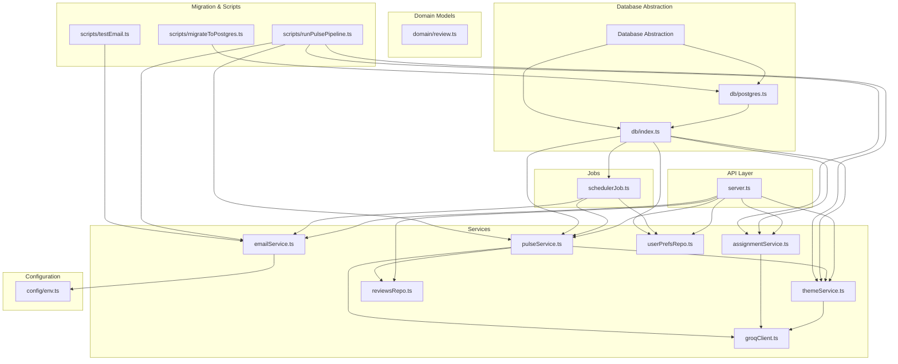

**Diagram sources**
- [server.ts:1-400](file://phase-2/src/api/server.ts#L1-L400)
- [groqClient.ts:1-142](file://phase-2/src/services/groqClient.ts#L1-L142)
- [themeService.ts:1-68](file://phase-2/src/services/themeService.ts#L1-L68)
- [assignmentService.ts:1-114](file://phase-2/src/services/assignmentService.ts#L1-L114)
- [pulseService.ts:1-265](file://phase-2/src/services/pulseService.ts#L1-L265)
- [emailService.ts:1-142](file://phase-2/src/services/emailService.ts#L1-L142)
- [schedulerJob.ts:1-98](file://phase-2/src/jobs/schedulerJob.ts#L1-L98)
- [reviewsRepo.ts:1-26](file://phase-2/src/services/reviewsRepo.ts#L1-L26)
- [userPrefsRepo.ts:1-95](file://phase-2/src/services/userPrefsRepo.ts#L1-L95)
- [index.ts:1-133](file://phase-2/src/db/index.ts#L1-L133)
- [postgres.ts:1-143](file://phase-2/src/db/postgres.ts#L1-L143)
- [review.ts:1-12](file://phase-2/src/domain/review.ts#L1-L12)
- [env.ts:1-23](file://phase-2/src/config/env.ts#L1-L23)
- [runPulsePipeline.ts:1-52](file://phase-2/scripts/runPulsePipeline.ts#L1-L52)
- [testEmail.ts:1-16](file://phase-2/scripts/testEmail.ts#L1-L16)
- [migrateToPostgres.ts:1-111](file://phase-2/scripts/migrateToPostgres.ts#L1-L111)

**Section sources**
- [server.ts:1-400](file://phase-2/src/api/server.ts#L1-L400)
- [env.ts:1-23](file://phase-2/src/config/env.ts#L1-L23)
- [index.ts:1-133](file://phase-2/src/db/index.ts#L1-L133)
- [postgres.ts:1-143](file://phase-2/src/db/postgres.ts#L1-L143)
- [package.json:1-34](file://phase-2/package.json#L1-L34)

## Core Components
- Groq client with robust JSON extraction using state machine algorithm and retry logic
- Theme generation using LLM with schema validation
- Review-to-theme assignment with confidence scoring
- Weekly pulse generation with action ideas and note composition
- Email service with HTML/text templates and SMTP transport
- Automated scheduler for weekly pulse delivery based on user preferences
- Database abstraction layer with runtime backend detection (SQLite vs PostgreSQL)
- PostgreSQL migration system with data preservation and conflict resolution
- Dual database support with automatic schema initialization
- API endpoints for theme management, pulse generation, and user preferences
- Production-ready deployment configuration with health checks and CORS

**Updated** Enhanced with comprehensive PostgreSQL migration capabilities, runtime database backend detection, and production-ready deployment configuration.

**Section sources**
- [groqClient.ts:1-142](file://phase-2/src/services/groqClient.ts#L1-L142)
- [themeService.ts:1-68](file://phase-2/src/services/themeService.ts#L1-L68)
- [assignmentService.ts:1-114](file://phase-2/src/services/assignmentService.ts#L1-L114)
- [pulseService.ts:1-265](file://phase-2/src/services/pulseService.ts#L1-L265)
- [emailService.ts:1-142](file://phase-2/src/services/emailService.ts#L1-L142)
- [schedulerJob.ts:1-98](file://phase-2/src/jobs/schedulerJob.ts#L1-L98)
- [index.ts:1-133](file://phase-2/src/db/index.ts#L1-L133)
- [postgres.ts:1-143](file://phase-2/src/db/postgres.ts#L1-L143)
- [migrateToPostgres.ts:1-111](file://phase-2/scripts/migrateToPostgres.ts#L1-L111)
- [server.ts:27-52](file://phase-2/src/api/server.ts#L27-L52)

## Architecture Overview
The system orchestrates a data flow from stored reviews to AI-generated insights and automated delivery with intelligent database backend selection:
- API routes trigger theme generation, assignment, and pulse creation with production-ready CORS
- Groq is used for structured outputs with schema hints and retries using enhanced JSON parsing
- Zod validates AI outputs against strict schemas
- Runtime database backend detection automatically selects SQLite for development or PostgreSQL for production
- Nodemailer sends HTML/text emails with PII scrubbing
- Scheduler periodically checks due preferences and dispatches pulses
- PostgreSQL migration script preserves data during transition from SQLite with conflict resolution

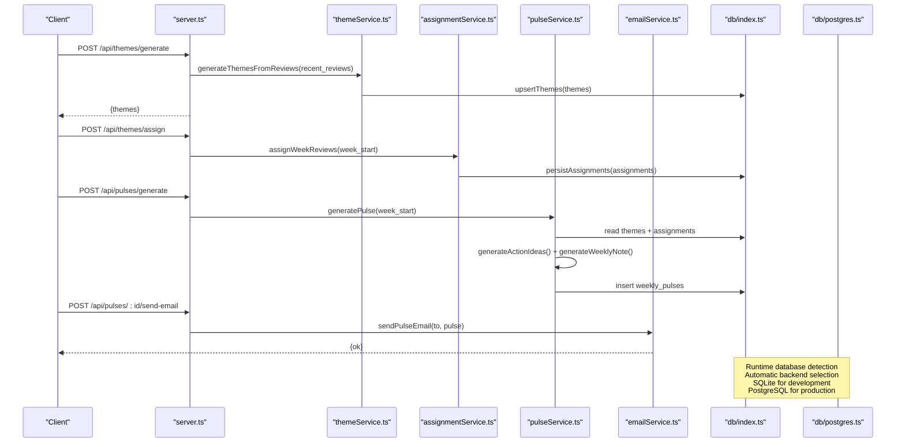

**Diagram sources**
- [server.ts:28-154](file://phase-2/src/api/server.ts#L28-L154)
- [themeService.ts:17-56](file://phase-2/src/services/themeService.ts#L17-L56)
- [assignmentService.ts:27-113](file://phase-2/src/services/assignmentService.ts#L27-L113)
- [pulseService.ts:179-241](file://phase-2/src/services/pulseService.ts#L179-L241)
- [emailService.ts:114-129](file://phase-2/src/services/emailService.ts#L114-L129)
- [index.ts:13-19](file://phase-2/src/db/index.ts#L13-L19)
- [postgres.ts:6-25](file://phase-2/src/db/postgres.ts#L6-L25)

## Detailed Component Analysis

### Enhanced Groq Client and JSON Parsing
- Initializes Groq SDK only when API key is present
- Implements robust JSON extraction using state machine algorithm for better reliability
- Handles markdown code fences, control characters, and malformed JSON gracefully
- Retries with increasing temperature to improve reliability
- Enforces strict schema hints and parses responses with Zod

**Updated** Enhanced with state machine algorithm for JSON parsing that properly handles nested quotes, escaped characters, and unescaped newlines within JSON strings.

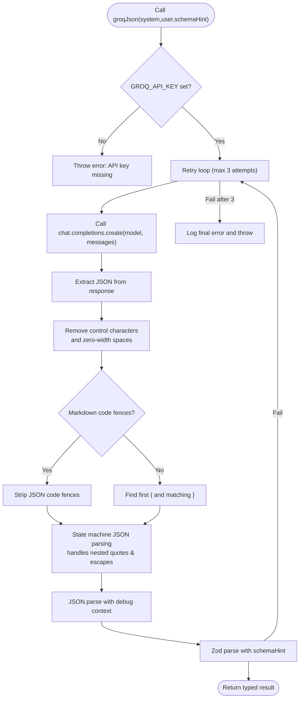

**Diagram sources**
- [groqClient.ts:14-91](file://phase-2/src/services/groqClient.ts#L14-L91)
- [groqClient.ts:93-140](file://phase-2/src/services/groqClient.ts#L93-L140)

**Section sources**
- [groqClient.ts:1-142](file://phase-2/src/services/groqClient.ts#L1-L142)

### Comprehensive PostgreSQL Migration System
- Dedicated migration script (`migrateToPostgres.ts`) for seamless transition from SQLite to PostgreSQL
- Preserves all data integrity with conflict resolution using `ON CONFLICT (id) DO NOTHING`
- Supports migration from Phase 1 SQLite database to PostgreSQL schema
- Maintains referential integrity across all tables during migration
- Handles different data types and constraints between SQLite and PostgreSQL

**New** Added comprehensive PostgreSQL migration capabilities for production deployments with automatic schema conversion and data preservation.

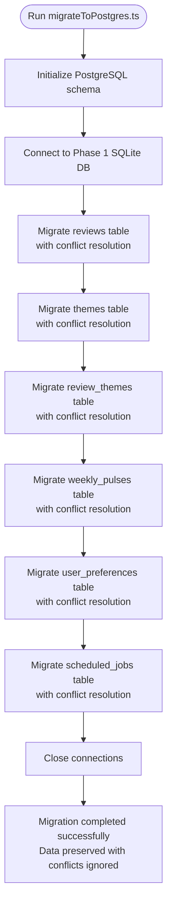

**Diagram sources**
- [migrateToPostgres.ts:5-108](file://phase-2/scripts/migrateToPostgres.ts#L5-L108)

**Section sources**
- [migrateToPostgres.ts:1-111](file://phase-2/scripts/migrateToPostgres.ts#L1-L111)
- [postgres.ts:27-135](file://phase-2/src/db/postgres.ts#L27-L135)

### Database Abstraction Layer with Runtime Detection
- Automatic backend detection based on `DATABASE_URL` environment variable
- Unified interface for SQLite and PostgreSQL operations
- Conditional schema initialization for development vs production
- Connection pooling for PostgreSQL with SSL configuration
- Type-safe database operations with consistent API

**New** Enhanced with runtime database backend detection and unified abstraction layer for seamless development and production switching.

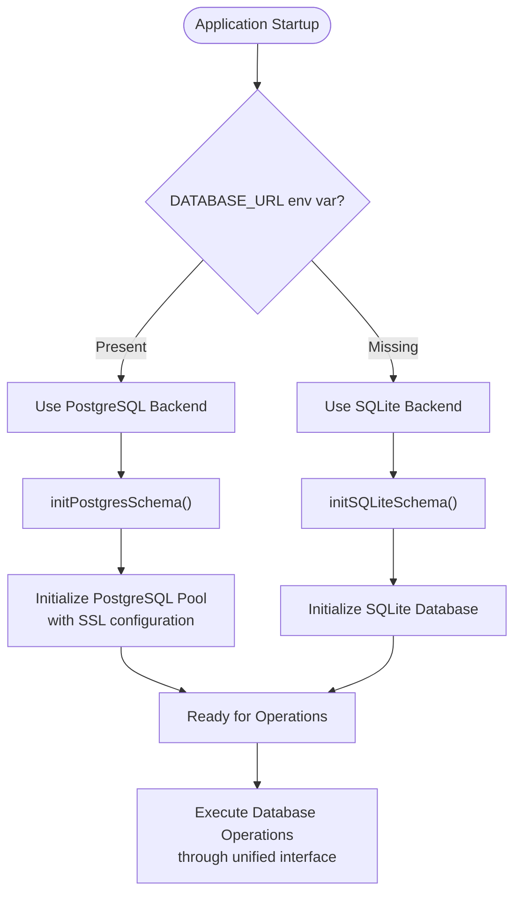

**Diagram sources**
- [index.ts:6-19](file://phase-2/src/db/index.ts#L6-L19)
- [postgres.ts:6-25](file://phase-2/src/db/postgres.ts#L6-L25)

**Section sources**
- [index.ts:1-133](file://phase-2/src/db/index.ts#L1-L133)
- [postgres.ts:1-143](file://phase-2/src/db/postgres.ts#L1-L143)

### Theme Generation Workflow
- Loads recent reviews and samples a subset
- Prompts Groq to propose 3–5 themes with names and descriptions
- Validates response using Zod schema with enhanced JSON parsing
- Upserts themes into the database with timestamps

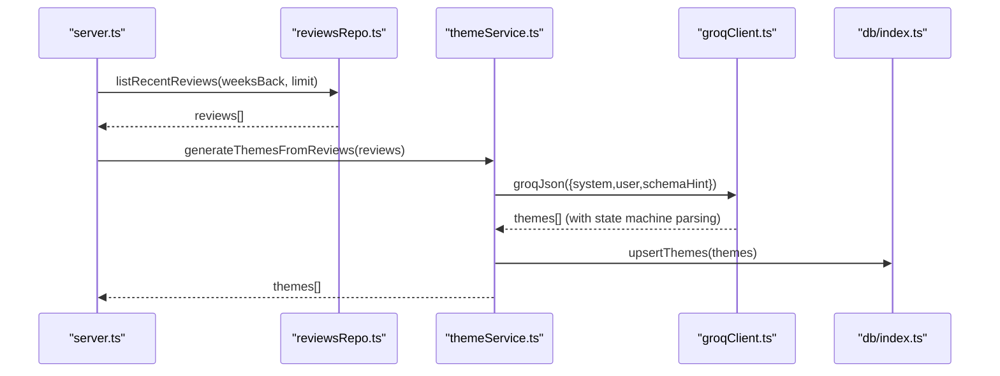

**Diagram sources**
- [server.ts:144-159](file://phase-2/src/api/server.ts#L144-L159)
- [reviewsRepo.ts:4-14](file://phase-2/src/services/reviewsRepo.ts#L4-L14)
- [themeService.ts:17-37](file://phase-2/src/services/themeService.ts#L17-L37)
- [groqClient.ts:93-140](file://phase-2/src/services/groqClient.ts#L93-L140)
- [index.ts:13-19](file://phase-2/src/db/index.ts#L13-L19)

**Section sources**
- [themeService.ts:17-56](file://phase-2/src/services/themeService.ts#L17-L56)
- [reviewsRepo.ts:4-14](file://phase-2/src/services/reviewsRepo.ts#L4-L14)

### Review-to-Theme Assignment with Confidence Scoring
- Loads a week's reviews and latest themes
- Sends a batched prompt to Groq to assign each review to a theme or "Other"
- Persists assignments with optional confidence scores
- Returns statistics for assigned and skipped items

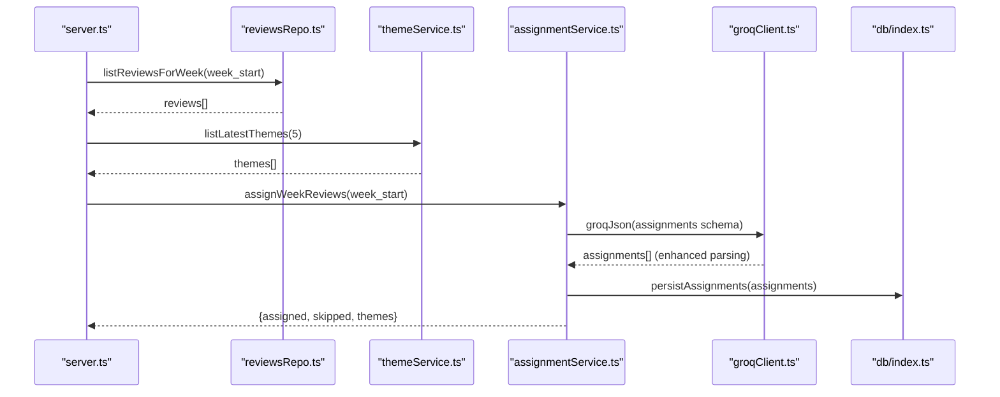

**Diagram sources**
- [server.ts:172-186](file://phase-2/src/api/server.ts#L172-L186)
- [reviewsRepo.ts:16-24](file://phase-2/src/services/reviewsRepo.ts#L16-L24)
- [themeService.ts:58-66](file://phase-2/src/services/themeService.ts#L58-L66)
- [assignmentService.ts:27-113](file://phase-2/src/services/assignmentService.ts#L27-L113)
- [groqClient.ts:93-140](file://phase-2/src/services/groqClient.ts#L93-L140)
- [index.ts:13-19](file://phase-2/src/db/index.ts#L13-L19)

**Section sources**
- [assignmentService.ts:27-113](file://phase-2/src/services/assignmentService.ts#L27-L113)

### Weekly Pulse Generation and Note Composition
- Aggregates per-theme stats for the week and selects top 3
- Picks representative quotes per theme (PII-free)
- Generates 3 concise action ideas and a scannable weekly note (≤250 words)
- Stores the pulse with versioning and returns it

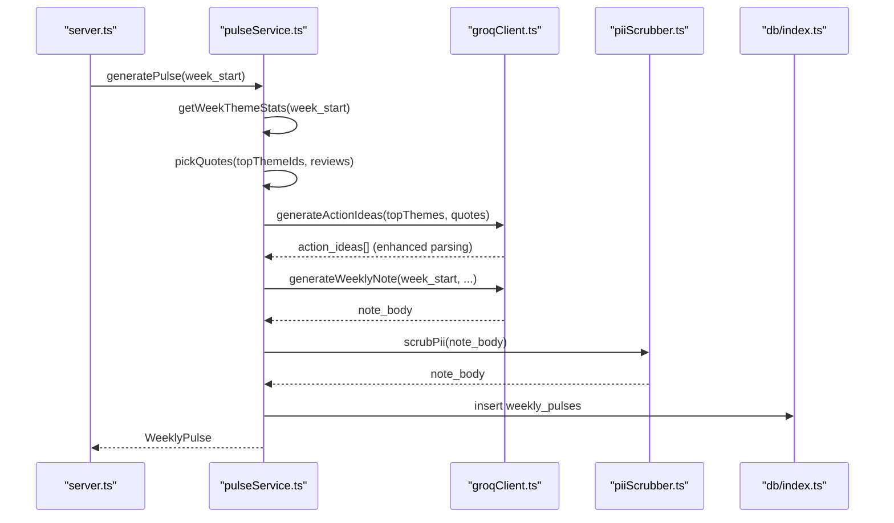

**Diagram sources**
- [server.ts:192-206](file://phase-2/src/api/server.ts#L192-L206)
- [pulseService.ts:179-241](file://phase-2/src/services/pulseService.ts#L179-L241)
- [groqClient.ts:93-140](file://phase-2/src/services/groqClient.ts#L93-L140)
- [index.ts:13-19](file://phase-2/src/db/index.ts#L13-L19)

**Section sources**
- [pulseService.ts:179-241](file://phase-2/src/services/pulseService.ts#L179-L241)

### Email Service Implementation
- Builds HTML and text templates from pulse data
- Uses Nodemailer with configurable SMTP settings
- Scrubs PII from email bodies before sending
- Provides a test endpoint to validate SMTP configuration

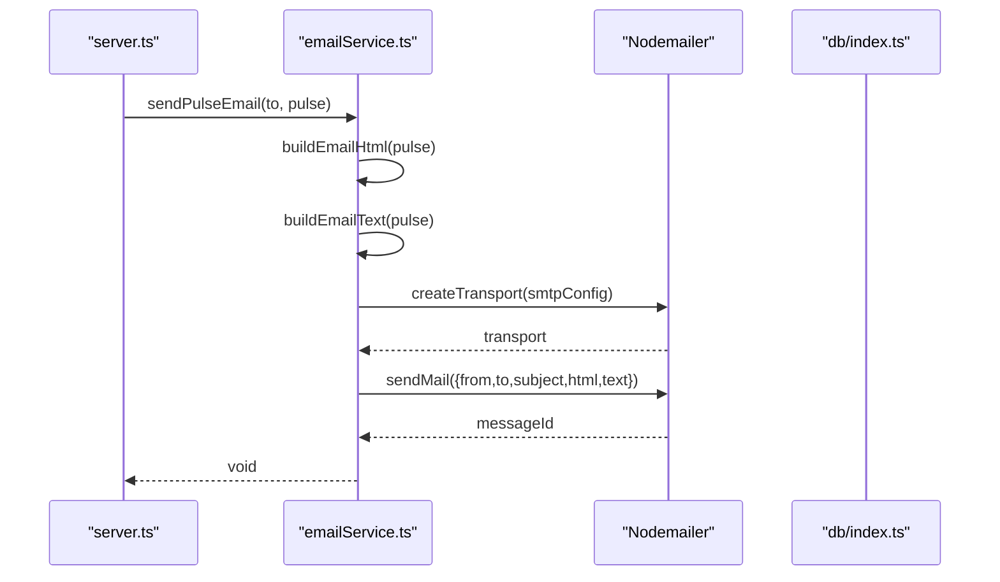

**Diagram sources**
- [server.ts:239-270](file://phase-2/src/api/server.ts#L239-L270)
- [emailService.ts:9-129](file://phase-2/src/services/emailService.ts#L9-L129)
- [env.ts:16-21](file://phase-2/src/config/env.ts#L16-L21)

**Section sources**
- [emailService.ts:9-129](file://phase-2/src/services/emailService.ts#L1-L129)
- [env.ts:16-21](file://phase-2/src/config/env.ts#L16-L21)

### Automated Job Scheduling System
- Computes the most recent full week (last Monday) based on UTC
- Identifies due user preferences whose next send time is now or earlier
- Generates the pulse, sends email, and records job status in the database
- Runs on a fixed interval with exponential backoff via retries

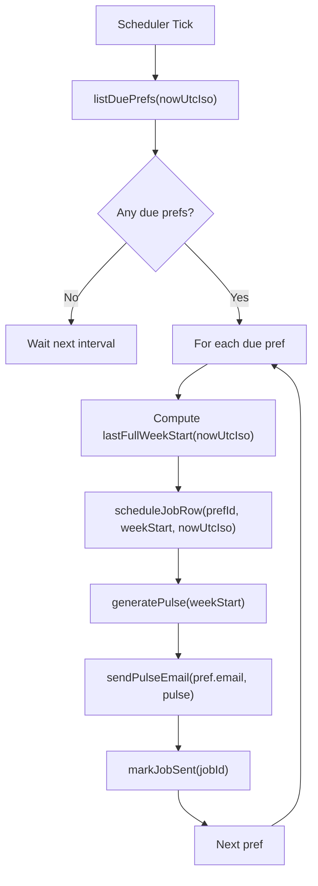

**Diagram sources**
- [schedulerJob.ts:52-97](file://phase-2/src/jobs/schedulerJob.ts#L52-L97)
- [index.ts:73-88](file://phase-2/src/db/index.ts#L73-L88)

**Section sources**
- [schedulerJob.ts:52-97](file://phase-2/src/jobs/schedulerJob.ts#L1-L98)

### Enhanced API Configuration for Production
- Production-ready CORS configuration with multiple frontend origins
- Health check endpoint for container monitoring
- Automatic database selection (SQLite vs PostgreSQL) based on environment
- Environment-specific configuration management
- Dashboard statistics with backend-aware queries

**Updated** Enhanced with production-ready CORS configuration, health checks, and backend-aware dashboard statistics.

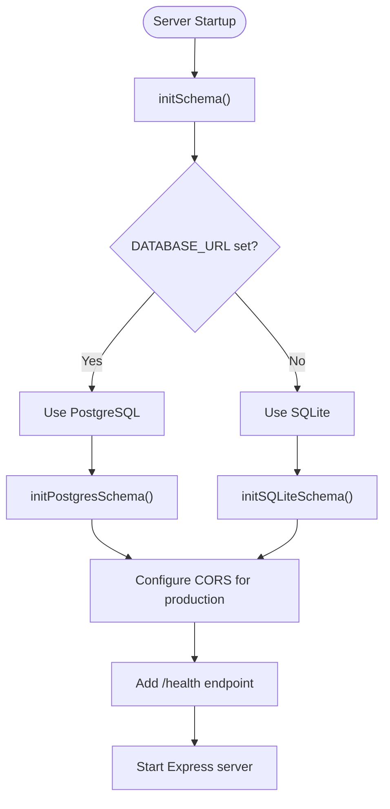

**Diagram sources**
- [server.ts:18-23](file://phase-2/src/api/server.ts#L18-L23)
- [server.ts:27-52](file://phase-2/src/api/server.ts#L27-L52)
- [server.ts:51-52](file://phase-2/src/api/server.ts#L51-L52)
- [index.ts:13-19](file://phase-2/src/db/index.ts#L13-L19)
- [postgres.ts:27-135](file://phase-2/src/db/postgres.ts#L27-L135)

**Section sources**
- [server.ts:27-52](file://phase-2/src/api/server.ts#L27-L52)
- [index.ts:6-7](file://phase-2/src/db/index.ts#L6-L7)

### User Preferences Management
- Upserts preferences, deactivating previous active rows
- Computes next send time based on preferred day of week and time
- Filters due preferences for the scheduler

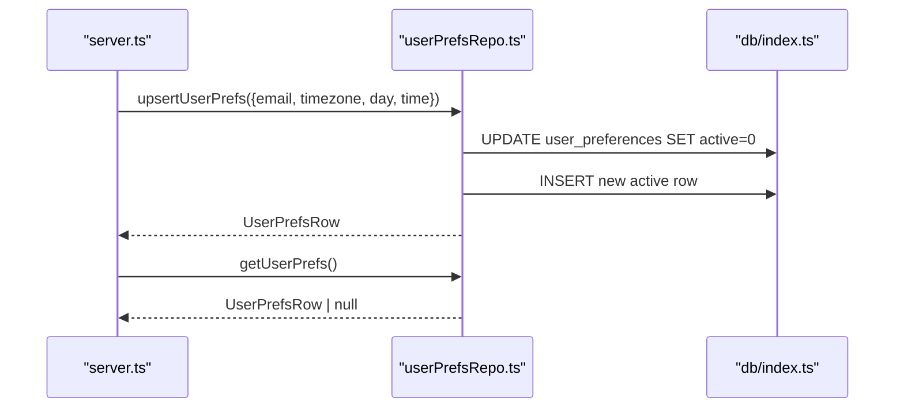

**Diagram sources**
- [server.ts:280-328](file://phase-2/src/api/server.ts#L280-L328)
- [userPrefsRepo.ts:21-56](file://phase-2/src/services/userPrefsRepo.ts#L21-L56)
- [index.ts:60-69](file://phase-2/src/db/index.ts#L60-L69)

**Section sources**
- [userPrefsRepo.ts:21-95](file://phase-2/src/services/userPrefsRepo.ts#L1-L95)

### Database Schema Extensions
- themes: stores theme definitions with validity windows
- review_themes: maps reviews to themes with optional confidence
- weekly_pulses: stores generated pulses with JSON payloads and versioning
- user_preferences: stores user email and delivery preferences
- scheduled_jobs: tracks scheduler execution status and errors

**Updated** Enhanced with dual database support and automatic schema initialization with runtime backend detection.

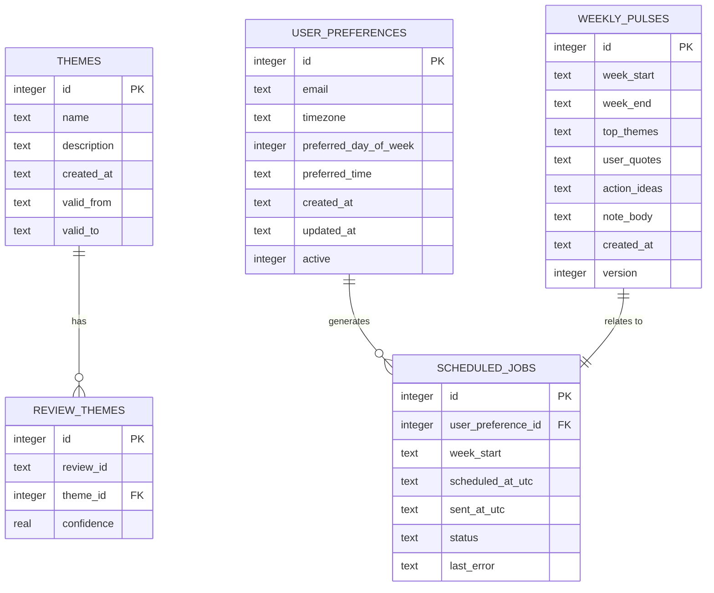

**Diagram sources**
- [index.ts:7-128](file://phase-2/src/db/index.ts#L7-L128)
- [postgres.ts:30-124](file://phase-2/src/db/postgres.ts#L30-L124)

**Section sources**
- [index.ts:7-128](file://phase-2/src/db/index.ts#L1-L133)
- [postgres.ts:27-135](file://phase-2/src/db/postgres.ts#L1-L143)

### API Endpoints
- Theme management
  - POST /api/themes/generate: generate and store 3–5 themes from recent reviews
  - GET /api/themes: list latest themes
  - POST /api/themes/assign: assign reviews for a week to the latest themes
- Pulse management
  - POST /api/pulses/generate: generate weekly pulse for a given week
  - GET /api/pulses: list recent pulses
  - GET /api/pulses/:id: fetch a single pulse
  - POST /api/pulses/:id/send-email: email a pulse to a recipient
- User preferences
  - POST /api/user-preferences: save user preferences
  - GET /api/user-preferences: retrieve active preferences
- Email testing
  - POST /api/email/test: send a test email to verify SMTP setup
- Debug convenience
  - GET /api/reviews/week/:weekStart: list a week's reviews
  - GET /api/reviews/stats: get dashboard statistics (backend-aware)
- Production endpoints
  - GET /health: health check endpoint for monitoring

**Updated** Added health check endpoint for production monitoring, backend-aware statistics endpoint, and enhanced CORS configuration.

**Section sources**
- [server.ts:28-400](file://phase-2/src/api/server.ts#L28-L400)

## Dependency Analysis
- External libraries
  - Express: web framework with production-ready CORS
  - better-sqlite3: embedded database for development
  - groq-sdk: Groq client with enhanced JSON parsing
  - nodemailer: SMTP transport
  - zod: schema validation
  - dotenv: environment loading
  - pg: PostgreSQL driver for production with connection pooling
- Internal dependencies
  - API depends on services and repositories
  - Services depend on Groq client, Zod schemas, and database abstraction
  - Scheduler depends on pulse and email services and user preferences
  - Scripts orchestrate full pipeline execution and database migration
  - PostgreSQL module provides production database connectivity with SSL configuration

**Updated** Added PostgreSQL driver dependency with connection pooling and SSL configuration for production deployments.

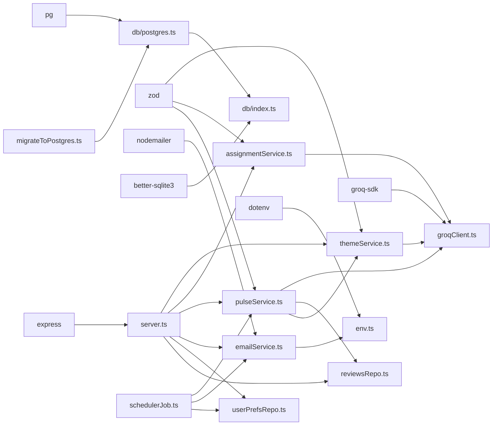

**Diagram sources**
- [package.json:13-23](file://phase-2/package.json#L13-L23)
- [server.ts:1-16](file://phase-2/src/api/server.ts#L1-L16)
- [groqClient.ts:1](file://phase-2/src/services/groqClient.ts#L1)
- [emailService.ts:1](file://phase-2/src/services/emailService.ts#L1)
- [env.ts:5](file://phase-2/src/config/env.ts#L5)
- [index.ts:5](file://phase-2/src/db/index.ts#L5)
- [postgres.ts:1](file://phase-2/src/db/postgres.ts#L1)

**Section sources**
- [package.json:13-23](file://phase-2/package.json#L13-L23)

## Performance Considerations
- Batched Groq calls: assignmentService processes reviews in small batches to manage token usage and cost
- Schema-first prompts: strict schema hints reduce hallucinations and parsing overhead
- Enhanced JSON parsing: state machine algorithm improves reliability and reduces parsing failures
- Runtime database backend detection: automatic selection optimizes for development vs production environments
- SQLite indexing: unique indexes on themes and weekly pulses prevent duplicates and speed lookups
- PostgreSQL connection pooling: efficient resource utilization with SSL configuration in production
- Retry with jittered temperature: improves resilience without excessive retries
- PII scrubbing: minimal regex passes ensure safe outputs before persistence or email
- Scheduler cadence: default 5-minute intervals balance timeliness and resource usage
- Migration performance: batch processing with conflict resolution prevents data loss

**Updated** Enhanced with PostgreSQL connection pooling, SSL configuration, and migration performance optimizations.

## Troubleshooting Guide
- Groq API key missing
  - Symptom: error thrown when calling Groq client
  - Resolution: set GROQ_API_KEY or disable scheduler
- SMTP configuration errors
  - Symptom: error indicating missing SMTP credentials
  - Resolution: configure SMTP_HOST, SMTP_USER, SMTP_PASS, SMTP_FROM
- No themes found
  - Symptom: error when generating pulse without prior theme generation
  - Resolution: run theme generation endpoint first
- No reviews for week
  - Symptom: error when generating pulse before assignment
  - Resolution: run theme assignment for the target week
- Scheduler not starting
  - Symptom: scheduler logs indicate not started
  - Resolution: set GROQ_API_KEY to enable automatic scheduler start
- Database connection issues
  - Symptom: PostgreSQL connection errors in production
  - Resolution: ensure DATABASE_URL environment variable is set correctly with SSL configuration
- JSON parsing failures
  - Symptom: Groq responses not properly parsed
  - Resolution: enhanced state machine algorithm handles malformed JSON more reliably
- Migration failures
  - Symptom: PostgreSQL migration errors
  - Resolution: verify Phase 1 SQLite database exists, PostgreSQL connection is available, and migration script has proper permissions
- Email delivery failures
  - Use the test endpoint to validate SMTP configuration
- Pipeline script issues
  - Ensure database initialization and recent reviews exist before running the pipeline
- Backend detection issues
  - Symptom: unexpected database backend usage
  - Resolution: verify DATABASE_URL environment variable presence for PostgreSQL detection

**Updated** Added troubleshooting for database connection issues, JSON parsing failures, migration failures, and backend detection issues.

**Section sources**
- [groqClient.ts:98-100](file://phase-2/src/services/groqClient.ts#L98-L100)
- [emailService.ts:99-112](file://phase-2/src/services/emailService.ts#L99-L112)
- [pulseService.ts:179-188](file://phase-2/src/services/pulseService.ts#L179-L188)
- [server.ts:374-378](file://phase-2/src/api/server.ts#L374-L378)
- [postgres.ts:8-11](file://phase-2/src/db/postgres.ts#L8-L11)
- [migrateToPostgres.ts:104-107](file://phase-2/scripts/migrateToPostgres.ts#L104-L107)
- [testEmail.ts:1-16](file://phase-2/scripts/testEmail.ts#L1-L16)
- [runPulsePipeline.ts:14-49](file://phase-2/scripts/runPulsePipeline.ts#L14-L49)

## Conclusion
Phase 2 delivers a production-grade, AI-powered analytics pipeline that transforms app store reviews into actionable insights with comprehensive database migration capabilities. By combining structured prompts, schema validation, and robust persistence with intelligent backend detection, it ensures reliable theme generation, accurate assignments, and high-quality weekly pulses. The enhanced JSON parsing with state machine algorithm improves reliability, while the dual database support enables seamless development and production deployments with automatic backend selection. The PostgreSQL migration system provides smooth transition paths with data preservation, and the email service and scheduler automate delivery based on user preferences. The API exposes clear endpoints for operational control with production-ready monitoring and CORS configuration. Extensive logging, error handling, and testing support ongoing maintenance and scaling.

**Updated** Enhanced with comprehensive PostgreSQL migration capabilities, runtime database backend detection, and production-ready deployment configuration.

## Appendices

### Practical Examples

- LLM Interaction Example
  - Generate themes from recent reviews
    - Endpoint: POST /api/themes/generate
    - Behavior: loads recent reviews, calls Groq with schema hint, enhanced JSON parsing, validates with Zod, upserts themes
    - Reference: [server.ts:144-159](file://phase-2/src/api/server.ts#L144-L159), [themeService.ts:17-37](file://phase-2/src/services/themeService.ts#L17-L37)
  - Assign reviews to themes with confidence
    - Endpoint: POST /api/themes/assign
    - Behavior: batched Groq prompts, enhanced JSON parsing, Zod validation, persisted assignments
    - Reference: [server.ts:172-186](file://phase-2/src/api/server.ts#L172-L186), [assignmentService.ts:27-67](file://phase-2/src/services/assignmentService.ts#L27-L67)

- Scheduling Workflow Example
  - Automatic pulse delivery
    - Behavior: compute last full week, find due preferences, generate pulse, send email, record job
    - Reference: [schedulerJob.ts:52-97](file://phase-2/src/jobs/schedulerJob.ts#L52-L97)
  - Manual pulse generation
    - Endpoint: POST /api/pulses/generate
    - Reference: [server.ts:192-206](file://phase-2/src/api/server.ts#L192-L206), [pulseService.ts:179-241](file://phase-2/src/services/pulseService.ts#L179-L241)

- Email Automation Example
  - Send pulse via email
    - Endpoint: POST /api/pulses/:id/send-email
    - Behavior: resolves recipient from body or user preferences, builds HTML/text, scrubs PII, sends
    - Reference: [server.ts:239-270](file://phase-2/src/api/server.ts#L239-L270), [emailService.ts:9-129](file://phase-2/src/services/emailService.ts#L9-L129)

- PostgreSQL Migration Example
  - Migrate from SQLite to PostgreSQL
    - Script: scripts/migrateToPostgres.ts
    - Behavior: initializes PostgreSQL schema, migrates all tables with data preservation and conflict resolution
    - Reference: [migrateToPostgres.ts:5-108](file://phase-2/scripts/migrateToPostgres.ts#L5-L108)

- Database Backend Detection Example
  - Runtime backend selection
    - Behavior: automatic detection based on DATABASE_URL environment variable
    - Reference: [index.ts:6-19](file://phase-2/src/db/index.ts#L6-L19), [postgres.ts:6-25](file://phase-2/src/db/postgres.ts#L6-L25)

- Production Deployment Example
  - Health check monitoring
    - Endpoint: GET /health
    - Behavior: returns application health status for container monitoring
    - Reference: [server.ts:51-52](file://phase-2/src/api/server.ts#L51-L52)
  - CORS configuration
    - Behavior: allows multiple frontend origins in production with dynamic origin checking
    - Reference: [server.ts:27-48](file://phase-2/src/api/server.ts#L27-L48)

- End-to-End Pipeline Script
  - Full pipeline execution
    - Script: scripts/runPulsePipeline.ts
    - Steps: init schema, generate themes, assign themes, generate pulse, send email
    - Reference: [runPulsePipeline.ts:14-49](file://phase-2/scripts/runPulsePipeline.ts#L14-L49)

**Updated** Added PostgreSQL migration, database backend detection, and production deployment examples.

**Section sources**
- [server.ts:144-270](file://phase-2/src/api/server.ts#L144-L270)
- [themeService.ts:17-37](file://phase-2/src/services/themeService.ts#L17-L37)
- [assignmentService.ts:27-67](file://phase-2/src/services/assignmentService.ts#L27-L67)
- [pulseService.ts:179-241](file://phase-2/src/services/pulseService.ts#L179-L241)
- [emailService.ts:9-129](file://phase-2/src/services/emailService.ts#L9-L129)
- [migrateToPostgres.ts:5-108](file://phase-2/scripts/migrateToPostgres.ts#L5-L108)
- [runPulsePipeline.ts:14-49](file://phase-2/scripts/runPulsePipeline.ts#L14-L49)
- [index.ts:6-19](file://phase-2/src/db/index.ts#L6-L19)
- [postgres.ts:6-25](file://phase-2/src/db/postgres.ts#L6-L25)