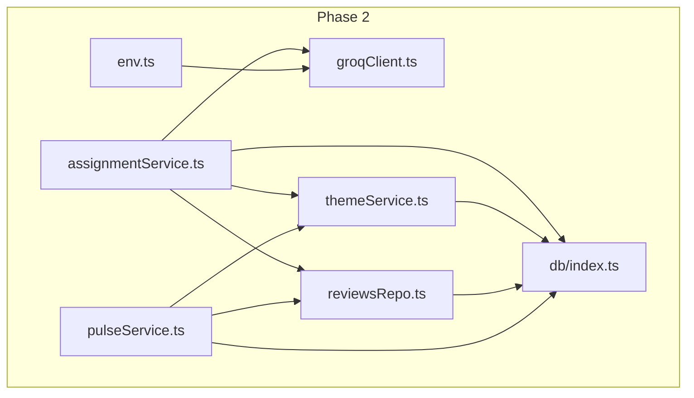
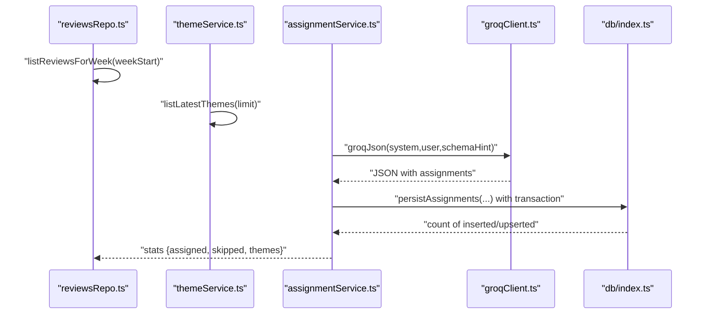
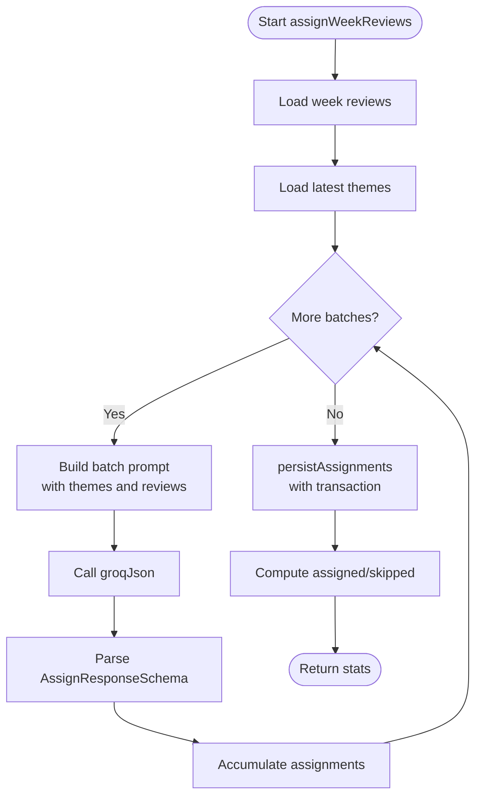
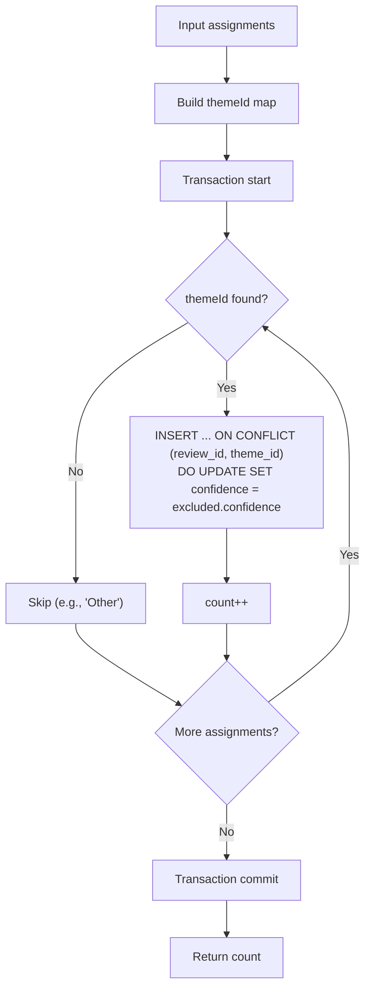
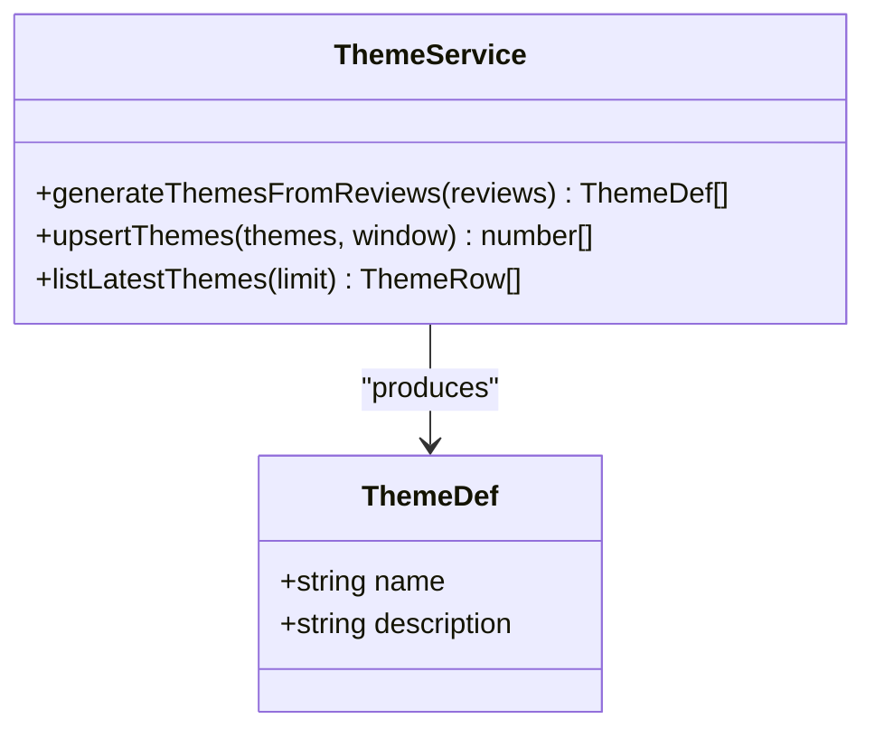
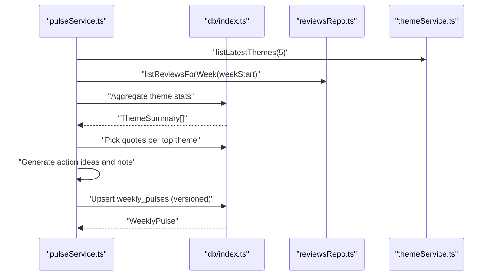
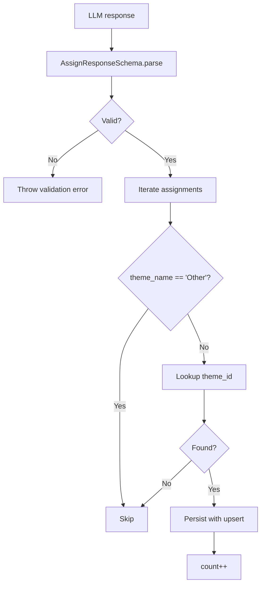
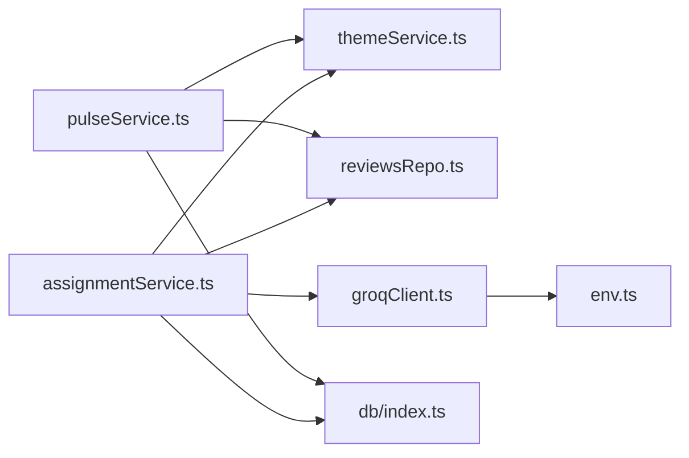

# Review-to-Theme Assignment

<cite>
**Referenced Files in This Document**
- [assignmentService.ts](file://phase-2/src/services/assignmentService.ts)
- [themeService.ts](file://phase-2/src/services/themeService.ts)
- [reviewsRepo.ts](file://phase-2/src/services/reviewsRepo.ts)
- [pulseService.ts](file://phase-2/src/services/pulseService.ts)
- [groqClient.ts](file://phase-2/src/services/groqClient.ts)
- [db/index.ts](file://phase-2/src/db/index.ts)
- [env.ts](file://phase-2/src/config/env.ts)
- [assignment.test.ts](file://phase-2/src/tests/assignment.test.ts)
- [schedulerJob.ts](file://phase-2/src/jobs/schedulerJob.ts)
- [review.ts](file://phase-2/src/domain/review.ts)
</cite>

## Table of Contents
1. [Introduction](#introduction)
2. [Project Structure](#project-structure)
3. [Core Components](#core-components)
4. [Architecture Overview](#architecture-overview)
5. [Detailed Component Analysis](#detailed-component-analysis)
6. [Dependency Analysis](#dependency-analysis)
7. [Performance Considerations](#performance-considerations)
8. [Troubleshooting Guide](#troubleshooting-guide)
9. [Conclusion](#conclusion)
10. [Appendices](#appendices)

## Introduction
This document explains the review-to-theme assignment system that automatically categorizes app store reviews into predefined themes using LLM-powered classification. It covers the batch processing strategy, algorithm selection, confidence handling, persistence, conflict resolution, manual override capabilities, validation, duplicate handling, assignment history tracking, and performance optimizations. It also addresses scalability and concurrency considerations for large-scale datasets.

## Project Structure
The assignment system lives in Phase 2 and integrates with the database schema initialized in Phase 2. The key modules are:
- Assignment service: orchestrates LLM-based assignment and persists results
- Theme service: generates and manages themes
- Reviews repository: loads reviews for assignment windows
- Pulse service: consumes assignments to produce weekly insights
- Groq client: interacts with the LLM provider
- Database: schema and indexes supporting assignment storage and retrieval
- Scheduler job: coordinates periodic runs for weekly pulses

**Diagram sources**
- [assignmentService.ts:1-114](file://phase-2/src/services/assignmentService.ts#L1-L114)
- [themeService.ts:1-68](file://phase-2/src/services/themeService.ts#L1-L68)
- [reviewsRepo.ts:1-26](file://phase-2/src/services/reviewsRepo.ts#L1-L26)
- [pulseService.ts:1-265](file://phase-2/src/services/pulseService.ts#L1-L265)
- [groqClient.ts:1-67](file://phase-2/src/services/groqClient.ts#L1-L67)
- [db/index.ts:1-93](file://phase-2/src/db/index.ts#L1-L93)
- [env.ts:1-23](file://phase-2/src/config/env.ts#L1-L23)

**Section sources**
- [assignmentService.ts:1-114](file://phase-2/src/services/assignmentService.ts#L1-L114)
- [db/index.ts:1-93](file://phase-2/src/db/index.ts#L1-L93)

## Core Components
- Assignment orchestration: loads a weekly cohort of reviews, fetches latest themes, assigns reviews to themes via LLM, and persists results
- Theme management: generates candidate themes from recent reviews and upserts them into the database
- Persistence: bulk upsert of assignments with conflict resolution and transactional guarantees
- Validation: strict schema enforcement for assignments and themes
- Confidence handling: optional numeric confidence scores returned by the LLM
- Conflict resolution: unique constraint on (review_id, theme_id) with update semantics
- Manual override capability: “Other” theme is supported; assignments to “Other” are skipped during persistence
- Assignment history tracking: weekly pulses capture top themes, quotes, and action ideas derived from assignments

**Section sources**
- [assignmentService.ts:27-113](file://phase-2/src/services/assignmentService.ts#L27-L113)
- [themeService.ts:17-66](file://phase-2/src/services/themeService.ts#L17-L66)
- [pulseService.ts:59-241](file://phase-2/src/services/pulseService.ts#L59-L241)
- [db/index.ts:24-38](file://phase-2/src/db/index.ts#L24-L38)

## Architecture Overview
The assignment pipeline is a batch-driven workflow that:
1. Loads a week’s worth of reviews
2. Loads latest themes
3. Calls the LLM to assign each review to a single theme or “Other”
4. Persists assignments in a transactional upsert
5. Produces weekly pulse reports based on persisted assignments

**Diagram sources**
- [assignmentService.ts:27-113](file://phase-2/src/services/assignmentService.ts#L27-L113)
- [themeService.ts:58-66](file://phase-2/src/services/themeService.ts#L58-L66)
- [reviewsRepo.ts:16-24](file://phase-2/src/services/reviewsRepo.ts#L16-L24)
- [groqClient.ts:30-65](file://phase-2/src/services/groqClient.ts#L30-L65)
- [db/index.ts:79-96](file://phase-2/src/db/index.ts#L79-L96)

## Detailed Component Analysis

### Assignment Orchestration
- Batch processing strategy: reviews are processed in fixed-size batches to manage token usage and throughput
- Algorithm selection: LLM-based classification with explicit instructions and schema hints
- Confidence thresholding: confidence is optional; missing values are stored as null
- Assignment workflow:
  - Load week’s reviews and latest themes
  - Construct prompts with theme names and descriptions
  - Call LLM to produce structured JSON with assignments
  - Persist assignments via transactional upsert
  - Skip “Other” and unknown theme names

**Diagram sources**
- [assignmentService.ts:27-113](file://phase-2/src/services/assignmentService.ts#L27-L113)
- [groqClient.ts:30-65](file://phase-2/src/services/groqClient.ts#L30-L65)

**Section sources**
- [assignmentService.ts:27-113](file://phase-2/src/services/assignmentService.ts#L27-L113)

### Persistence and Conflict Resolution
- Transactional upsert: wraps assignment insertion in a transaction to ensure atomicity
- Unique constraint: (review_id, theme_id) prevents duplicates
- Update-on-conflict: when a review is reassigned, confidence is refreshed
- Manual override: “Other” theme names are ignored during persistence

**Diagram sources**
- [assignmentService.ts:73-97](file://phase-2/src/services/assignmentService.ts#L73-L97)
- [db/index.ts:24-33](file://phase-2/src/db/index.ts#L24-L33)

**Section sources**
- [assignmentService.ts:73-97](file://phase-2/src/services/assignmentService.ts#L73-L97)
- [db/index.ts:24-33](file://phase-2/src/db/index.ts#L24-L33)

### Theme Management
- Generation: samples recent reviews and asks the LLM to propose 3–5 themes with concise names and descriptions
- Upsert: inserts themes with timestamps and optional validity windows
- Listing: retrieves latest themes for assignment

**Diagram sources**
- [themeService.ts:17-66](file://phase-2/src/services/themeService.ts#L17-L66)

**Section sources**
- [themeService.ts:17-66](file://phase-2/src/services/themeService.ts#L17-L66)

### Weekly Pulse Consumption
- Aggregation: computes per-theme counts and average ratings from review_themes joined with reviews
- Quote selection: picks short, PII-free quotes per top theme
- Action ideas and note generation: produces weekly insights and action items
- History tracking: stores weekly pulses with versioning and JSON-serialized artifacts

**Diagram sources**
- [pulseService.ts:179-241](file://phase-2/src/services/pulseService.ts#L179-L241)
- [db/index.ts:40-57](file://phase-2/src/db/index.ts#L40-L57)

**Section sources**
- [pulseService.ts:59-241](file://phase-2/src/services/pulseService.ts#L59-L241)
- [db/index.ts:40-57](file://phase-2/src/db/index.ts#L40-L57)

### Assignment Validation and Duplicate Handling
- Schema validation: strict parsing of LLM responses ensures consistent structure
- Confidence handling: optional confidence is validated and stored as nullable
- Duplicate handling: unique constraint on (review_id, theme_id) prevents duplicates; updates refresh confidence
- Test coverage: validates persistence behavior and schema flexibility

**Diagram sources**
- [assignmentService.ts:9-17](file://phase-2/src/services/assignmentService.ts#L9-L17)
- [assignmentService.ts:61-62](file://phase-2/src/services/assignmentService.ts#L61-L62)
- [assignmentService.ts:73-97](file://phase-2/src/services/assignmentService.ts#L73-L97)
- [assignment.test.ts:57-92](file://phase-2/src/tests/assignment.test.ts#L57-L92)

**Section sources**
- [assignmentService.ts:9-17](file://phase-2/src/services/assignmentService.ts#L9-L17)
- [assignmentService.ts:61-62](file://phase-2/src/services/assignmentService.ts#L61-L62)
- [assignmentService.ts:73-97](file://phase-2/src/services/assignmentService.ts#L73-L97)
- [assignment.test.ts:57-92](file://phase-2/src/tests/assignment.test.ts#L57-L92)

### Manual Override Capabilities
- “Other” theme support: LLM may return “Other”; these are intentionally skipped during persistence
- Future overrides: the system can be extended to accept manual assignments and persist them similarly

**Section sources**
- [assignmentService.ts:73-97](file://phase-2/src/services/assignmentService.ts#L73-L97)

### Assignment History Tracking
- Weekly pulses: captures top themes, quotes, action ideas, and note body with versioning
- Versioning: increments version per week to maintain history
- JSON serialization: stores structured artifacts for reporting

**Section sources**
- [pulseService.ts:217-241](file://phase-2/src/services/pulseService.ts#L217-L241)
- [db/index.ts:40-57](file://phase-2/src/db/index.ts#L40-L57)

## Dependency Analysis
- assignmentService depends on:
  - themeService for theme metadata
  - reviewsRepo for review data
  - groqClient for LLM inference
  - db for schema and persistence
- pulseService depends on:
  - db for aggregations and storage
  - themeService and reviewsRepo for inputs
- groqClient depends on environment configuration for credentials and model

**Diagram sources**
- [assignmentService.ts:1-114](file://phase-2/src/services/assignmentService.ts#L1-L114)
- [pulseService.ts:1-265](file://phase-2/src/services/pulseService.ts#L1-L265)
- [groqClient.ts:1-67](file://phase-2/src/services/groqClient.ts#L1-L67)
- [env.ts:1-23](file://phase-2/src/config/env.ts#L1-L23)

**Section sources**
- [assignmentService.ts:1-114](file://phase-2/src/services/assignmentService.ts#L1-L114)
- [pulseService.ts:1-265](file://phase-2/src/services/pulseService.ts#L1-L265)
- [groqClient.ts:1-67](file://phase-2/src/services/groqClient.ts#L1-L67)
- [env.ts:1-23](file://phase-2/src/config/env.ts#L1-L23)

## Performance Considerations
- Batch processing: fixed batch size controls token usage and throughput
- Transactional upsert: reduces overhead and ensures consistency
- Indexing:
  - review_themes.review_id: supports fast lookups when selecting quotes or aggregations
  - themes(name, valid_from, valid_to): unique composite index for theme validity windows
  - scheduled_jobs(status, scheduled_at_utc): supports scheduler filtering
- Concurrency:
  - Single-threaded SQLite: avoid concurrent writes to the same table; use transactions
  - Scheduler intervals: stagger runs to prevent overlapping writes
- Memory:
  - Batch iteration avoids loading entire datasets into memory
- LLM retries: built-in retry with increasing temperature to improve JSON extraction reliability

**Section sources**
- [assignmentService.ts:21-67](file://phase-2/src/services/assignmentService.ts#L21-L67)
- [assignmentService.ts:86-96](file://phase-2/src/services/assignmentService.ts#L86-L96)
- [db/index.ts:35-38](file://phase-2/src/db/index.ts#L35-L38)
- [db/index.ts:19-22](file://phase-2/src/db/index.ts#L19-L22)
- [db/index.ts:86-88](file://phase-2/src/db/index.ts#L86-L88)
- [groqClient.ts:39-65](file://phase-2/src/services/groqClient.ts#L39-L65)

## Troubleshooting Guide
- No assignments returned:
  - Ensure themes exist before running assignment
  - Verify LLM API key and model configuration
- Validation errors:
  - Confirm LLM response matches expected schema
  - Check schema hint alignment with system prompt
- Missing “Other” assignments:
  - By design, “Other” is skipped during persistence
- Duplicate assignments:
  - Unique constraint prevents duplicates; updates refresh confidence
- Scheduler failures:
  - Inspect job status and last_error fields
  - Ensure proper environment variables for SMTP and database

**Section sources**
- [assignmentService.ts:31-32](file://phase-2/src/services/assignmentService.ts#L31-L32)
- [pulseService.ts:180-188](file://phase-2/src/services/pulseService.ts#L180-L188)
- [groqClient.ts:35-37](file://phase-2/src/services/groqClient.ts#L35-L37)
- [db/index.ts:30-31](file://phase-2/src/db/index.ts#L30-L31)
- [schedulerJob.ts:36-40](file://phase-2/src/jobs/schedulerJob.ts#L36-L40)

## Conclusion
The review-to-theme assignment system combines efficient batch processing, robust schema validation, and transactional persistence to reliably categorize reviews. It leverages LLMs for flexible classification while maintaining strong constraints to prevent duplicates and ensure data integrity. Weekly pulses consume these assignments to drive product insights, and the database schema and indexes support scalable retrieval and reporting.

## Appendices

### Example Scenarios and Edge Cases
- Empty inputs:
  - No reviews or no themes returns empty assignments
- Confidence handling:
  - Missing confidence is stored as null; present values are preserved
- “Other” theme:
  - Returned by LLM but skipped during persistence
- No prior themes:
  - Weekly pulse generation requires themes; otherwise throws an error
- No reviews for week:
  - Weekly pulse generation requires reviews; otherwise throws an error

**Section sources**
- [assignmentService.ts:31-32](file://phase-2/src/services/assignmentService.ts#L31-L32)
- [assignmentService.ts:61-62](file://phase-2/src/services/assignmentService.ts#L61-L62)
- [assignmentService.ts:89-91](file://phase-2/src/services/assignmentService.ts#L89-L91)
- [pulseService.ts:180-188](file://phase-2/src/services/pulseService.ts#L180-L188)
- [pulseService.ts:186-188](file://phase-2/src/services/pulseService.ts#L186-L188)

### Scalability and Concurrency Notes
- Large-scale datasets:
  - Keep batch size tuned to token limits; adjust as needed
  - Use weekly windows to bound dataset sizes
- Concurrent operations:
  - SQLite is single-writer; serialize write operations
  - Use scheduler intervals to avoid overlap
- Indexing:
  - Ensure indexes exist for review_themes.review_id and themes(name, valid_from, valid_to)

**Section sources**
- [assignmentService.ts:21-67](file://phase-2/src/services/assignmentService.ts#L21-L67)
- [db/index.ts:35-38](file://phase-2/src/db/index.ts#L35-L38)
- [db/index.ts:19-22](file://phase-2/src/db/index.ts#L19-L22)
- [schedulerJob.ts:90-97](file://phase-2/src/jobs/schedulerJob.ts#L90-L97)