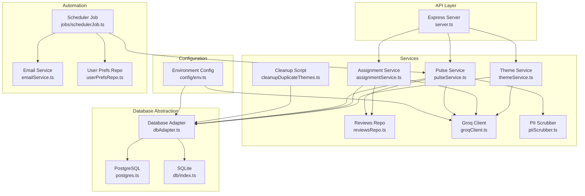
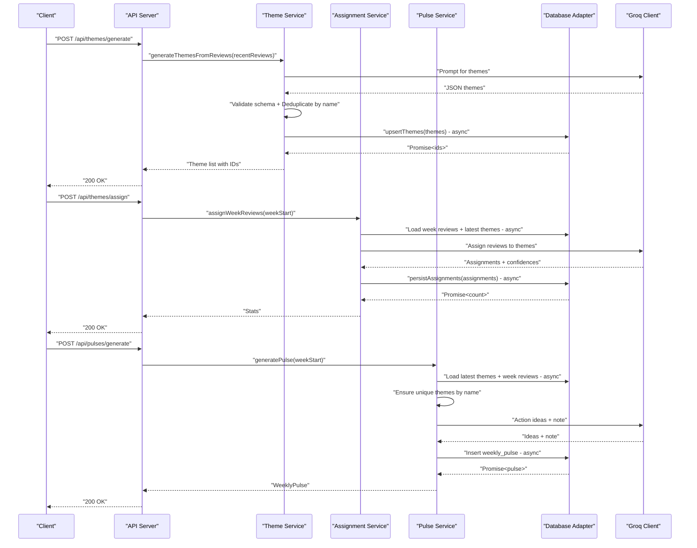
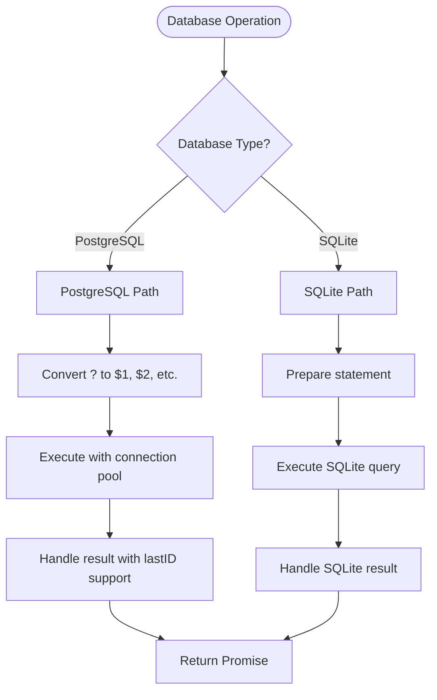
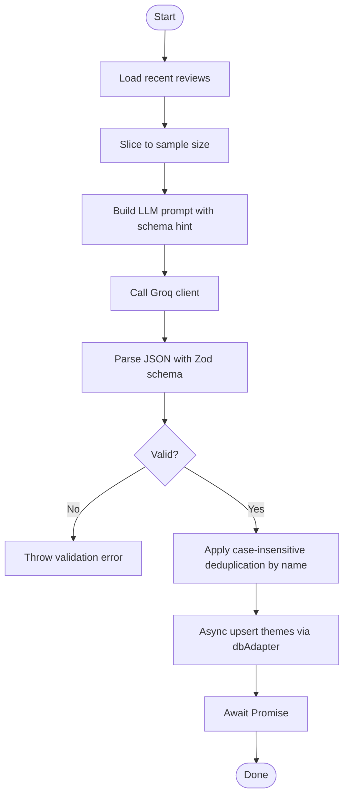
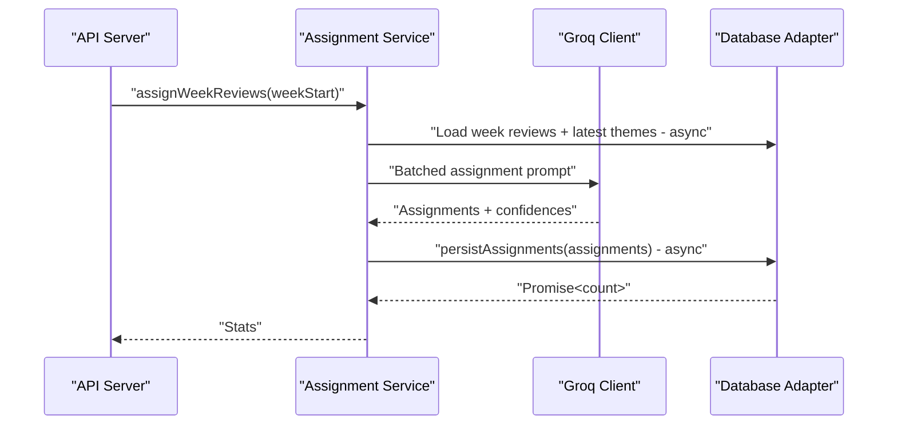
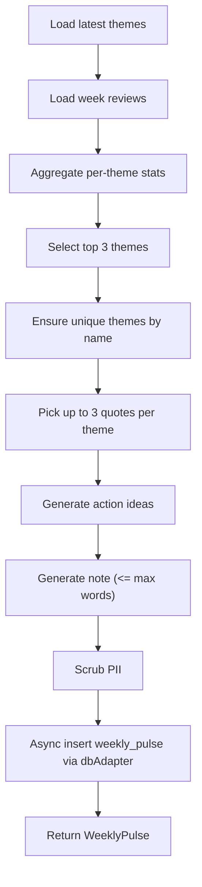
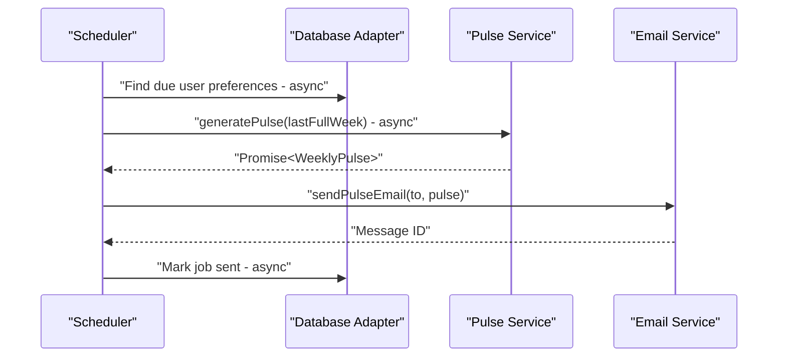
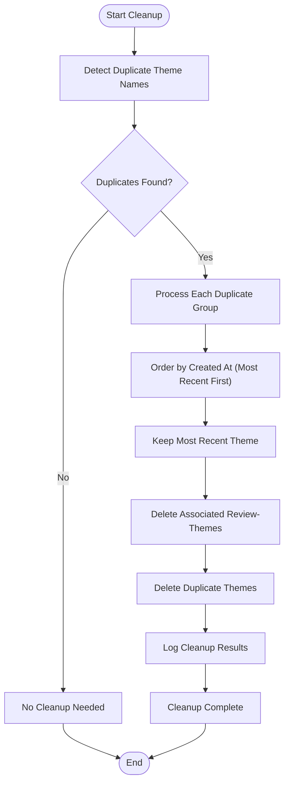
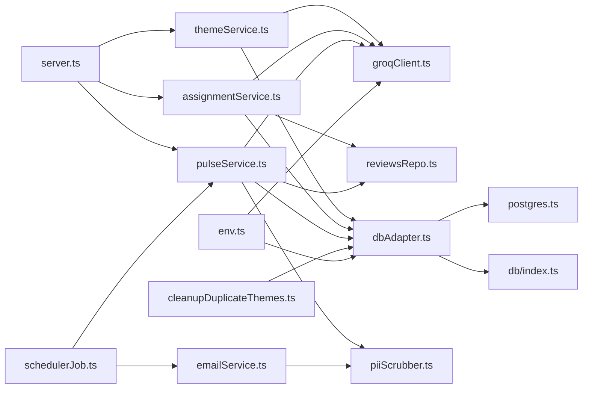

# Theme Generation & Management

<cite>
**Referenced Files in This Document**
- [themeService.ts](file://phase-2/src/services/themeService.ts)
- [assignmentService.ts](file://phase-2/src/services/assignmentService.ts)
- [pulseService.ts](file://phase-2/src/services/pulseService.ts)
- [reviewsRepo.ts](file://phase-2/src/services/reviewsRepo.ts)
- [groqClient.ts](file://phase-2/src/services/groqClient.ts)
- [server.ts](file://phase-2/src/api/server.ts)
- [index.ts](file://phase-2/src/db/index.ts)
- [env.ts](file://phase-2/src/config/env.ts)
- [schedulerJob.ts](file://phase-2/src/jobs/schedulerJob.ts)
- [emailService.ts](file://phase-2/src/services/emailService.ts)
- [userPrefsRepo.ts](file://phase-2/src/services/userPrefsRepo.ts)
- [piiScrubber.ts](file://phase-2/src/services/piiScrubber.ts)
- [review.ts](file://phase-2/src/domain/review.ts)
- [cleanupDuplicateThemes.ts](file://phase-2/scripts/cleanupDuplicateThemes.ts)
- [dbAdapter.ts](file://phase-2/src/db/dbAdapter.ts)
- [postgres.ts](file://phase-2/src/db/postgres.ts)
</cite>

## Update Summary
**Changes Made**
- Updated database operations to use asynchronous database adapter pattern
- Converted synchronous calls to asynchronous operations with proper error handling
- Enhanced database abstraction layer with unified interface for SQLite and PostgreSQL
- Improved error handling and transaction support across all database operations

## Table of Contents
1. [Introduction](#introduction)
2. [Project Structure](#project-structure)
3. [Core Components](#core-components)
4. [Architecture Overview](#architecture-overview)
5. [Detailed Component Analysis](#detailed-component-analysis)
6. [Database Integrity & Cleanup Procedures](#database-integrity--cleanup-procedures)
7. [Dependency Analysis](#dependency-analysis)
8. [Performance Considerations](#performance-considerations)
9. [Troubleshooting Guide](#troubleshooting-guide)
10. [Conclusion](#conclusion)
11. [Appendices](#appendices)

## Introduction
This document explains the theme generation and management system that transforms processed app store reviews into validated, confidence-scored themes, assigns them to weekly reviews, and produces weekly pulses with curated insights. The system now uses a unified database adapter pattern that provides asynchronous operations with proper error handling and supports both SQLite and PostgreSQL databases. It covers the end-to-end workflow, validation rules, persistence strategy, categorization and metadata handling, search capabilities, lifecycle management, database integrity procedures, and performance considerations for bulk operations.

## Project Structure
The theme system spans several modules with enhanced database abstraction:
- API layer exposes endpoints to generate themes, assign them to weekly reviews, and produce weekly pulses.
- Services encapsulate theme generation, assignment, pulse creation, and email delivery with asynchronous database operations.
- Database adapter provides unified interface for SQLite and PostgreSQL with automatic error handling.
- Database schema stores themes, review-theme mappings, weekly pulses, and auxiliary entities.
- Configuration and scheduler integrate external LLM APIs and automated email delivery.
- **New**: Comprehensive database adapter with transaction support and connection pooling.

**Diagram sources**
- [server.ts:1-266](file://phase-2/src/api/server.ts#L1-L266)
- [themeService.ts:1-78](file://phase-2/src/services/themeService.ts#L1-L78)
- [assignmentService.ts:1-114](file://phase-2/src/services/assignmentService.ts#L1-L114)
- [pulseService.ts:1-270](file://phase-2/src/services/pulseService.ts#L1-L270)
- [reviewsRepo.ts:1-26](file://phase-2/src/services/reviewsRepo.ts#L1-L26)
- [groqClient.ts:1-67](file://phase-2/src/services/groqClient.ts#L1-L67)
- [dbAdapter.ts:1-178](file://phase-2/src/db/dbAdapter.ts#L1-L178)
- [postgres.ts:1-143](file://phase-2/src/db/postgres.ts#L1-L143)
- [index.ts:1-133](file://phase-2/src/db/index.ts#L1-L133)
- [env.ts:1-23](file://phase-2/src/config/env.ts#L1-L23)
- [schedulerJob.ts:1-98](file://phase-2/src/jobs/schedulerJob.ts#L1-L98)
- [emailService.ts:1-142](file://phase-2/src/services/emailService.ts#L1-L142)
- [userPrefsRepo.ts:1-95](file://phase-2/src/services/userPrefsRepo.ts#L1-L95)
- [piiScrubber.ts:1-29](file://phase-2/src/services/piiScrubber.ts#L1-L29)
- [cleanupDuplicateThemes.ts:1-59](file://phase-2/scripts/cleanupDuplicateThemes.ts#L1-L59)

**Section sources**
- [server.ts:1-266](file://phase-2/src/api/server.ts#L1-L266)
- [dbAdapter.ts:1-178](file://phase-2/src/db/dbAdapter.ts#L1-L178)
- [index.ts:1-133](file://phase-2/src/db/index.ts#L1-L133)

## Core Components
- Theme Service: Generates themes from recent reviews using an LLM, validates them, and persists them asynchronously with optional validity windows. **Enhanced**: Now uses database adapter for all operations with proper error handling.
- Assignment Service: Assigns each review to a theme with optional confidence and persists mappings asynchronously.
- Pulse Service: Aggregates theme stats per week, selects top themes, picks representative quotes, generates action ideas and a concise weekly note, and persists the weekly pulse asynchronously. **Enhanced**: Includes deduplication to ensure unique themes by name.
- Database Adapter: Unified interface providing asynchronous operations for both SQLite and PostgreSQL with automatic parameter conversion and error handling.
- Database Schema: Defines tables for themes, review-theme mappings, weekly pulses, user preferences, scheduled jobs, and indexes for performance.
- API Routes: Expose endpoints to trigger generation, assignment, and pulse creation; manage user preferences; and send test emails.
- Scheduler: Automatically generates and emails weekly pulses to subscribed users based on preferences.
- **New**: Cleanup Script: Removes duplicate themes from the database and maintains data integrity.

**Section sources**
- [themeService.ts:17-78](file://phase-2/src/services/themeService.ts#L17-L78)
- [assignmentService.ts:31-114](file://phase-2/src/services/assignmentService.ts#L31-L114)
- [pulseService.ts:178-270](file://phase-2/src/services/pulseService.ts#L178-L270)
- [dbAdapter.ts:13-178](file://phase-2/src/db/dbAdapter.ts#L13-L178)
- [index.ts:46-125](file://phase-2/src/db/index.ts#L46-L125)
- [server.ts:28-248](file://phase-2/src/api/server.ts#L28-L248)
- [schedulerJob.ts:52-97](file://phase-2/src/jobs/schedulerJob.ts#L52-L97)
- [cleanupDuplicateThemes.ts:7-56](file://phase-2/scripts/cleanupDuplicateThemes.ts#L7-L56)

## Architecture Overview
The system orchestrates three primary workflows with asynchronous database operations:
- Theme generation: Loads recent reviews, prompts an LLM to propose 3–5 themes, validates the response, applies deduplication, and asynchronously inserts them into the themes table.
- Theme assignment: Loads a week's reviews and latest themes, assigns each review to a theme (or "Other"), records confidence, and asynchronously updates the review-themes mapping.
- Weekly pulse: Aggregates per-week stats, selects top themes, curates quotes, generates action ideas and a note, scrubs PII, and asynchronously stores the pulse.

**Diagram sources**
- [server.ts:28-90](file://phase-2/src/api/server.ts#L28-L90)
- [themeService.ts:17-78](file://phase-2/src/services/themeService.ts#L17-L78)
- [assignmentService.ts:31-114](file://phase-2/src/services/assignmentService.ts#L31-L114)
- [pulseService.ts:178-270](file://phase-2/src/services/pulseService.ts#L178-L270)
- [dbAdapter.ts:28-97](file://phase-2/src/db/dbAdapter.ts#L28-L97)
- [groqClient.ts:30-65](file://phase-2/src/services/groqClient.ts#L30-L65)

## Detailed Component Analysis

### Database Adapter Pattern
**Updated** The system now uses a comprehensive database adapter pattern that provides asynchronous operations with proper error handling:

- **Unified Interface**: Single interface for both SQLite and PostgreSQL with automatic parameter conversion.
- **Asynchronous Operations**: All database calls return promises for non-blocking execution.
- **Parameter Conversion**: Converts SQLite '?' placeholders to PostgreSQL '$1', '$2', etc. automatically.
- **Transaction Support**: Built-in transaction wrapper with proper rollback handling.
- **Connection Pooling**: PostgreSQL uses connection pooling for optimal performance.
- **Error Handling**: Centralized error handling with meaningful error messages.

**Diagram sources**
- [dbAdapter.ts:28-97](file://phase-2/src/db/dbAdapter.ts#L28-L97)
- [postgres.ts:6-25](file://phase-2/src/db/postgres.ts#L6-L25)
- [index.ts:21-18](file://phase-2/src/db/index.ts#L21-L18)

**Section sources**
- [dbAdapter.ts:13-178](file://phase-2/src/db/dbAdapter.ts#L13-L178)
- [postgres.ts:1-143](file://phase-2/src/db/postgres.ts#L1-L143)

### Theme Generation Workflow
- Input: Recent reviews filtered by recency and capped sample size.
- Prompting: A system prompt instructs the LLM to propose 3–5 themes with concise names and descriptions; a schema hint ensures structured JSON.
- Validation: Zod schema enforces theme count bounds and field constraints.
- **Enhanced Deduplication**: Case-insensitive deduplication by theme name to prevent duplicate themes.
- **Updated Persistence**: Asynchronous upsert using database adapter with proper error handling.

**Diagram sources**
- [themeService.ts:17-78](file://phase-2/src/services/themeService.ts#L17-L78)
- [dbAdapter.ts:65-97](file://phase-2/src/db/dbAdapter.ts#L65-L97)
- [groqClient.ts:30-65](file://phase-2/src/services/groqClient.ts#L30-L65)

**Section sources**
- [themeService.ts:17-78](file://phase-2/src/services/themeService.ts#L17-L78)
- [dbAdapter.ts:65-97](file://phase-2/src/db/dbAdapter.ts#L65-L97)
- [groqClient.ts:30-65](file://phase-2/src/services/groqClient.ts#L30-L65)

### Theme Validation Rules and Uniqueness Criteria
- Validation rules:
  - Theme name length: minimum and maximum enforced.
  - Description length: minimum and maximum enforced.
  - Count constraint: exactly 3–5 themes returned by the LLM.
- **Enhanced Uniqueness**:
  - Composite unique index on themes: name, valid_from, valid_to.
  - **New**: Case-insensitive deduplication in themeService.ts to prevent duplicate names.
  - **New**: Additional deduplication in pulseService.ts to ensure unique themes by name.
  - **New**: Database adapter ensures atomic operations with proper error handling.
  - This prevents duplicate themes within the same validity window and across different generations.

**Section sources**
- [themeService.ts:6-13](file://phase-2/src/services/themeService.ts#L6-L13)
- [themeService.ts:39-46](file://phase-2/src/services/themeService.ts#L39-L46)
- [pulseService.ts:200-204](file://phase-2/src/services/pulseService.ts#L200-L204)
- [index.ts:56-59](file://phase-2/src/db/index.ts#L56-L59)
- [dbAdapter.ts:102-124](file://phase-2/src/db/dbAdapter.ts#L102-L124)

### Temporal Validity Constraints
- Themes include valid_from and valid_to fields.
- Uniqueness index enforces distinct themes per window.
- **Updated**: Asynchronous upsert operation writes these fields via database adapter; callers can pass a window to scope theme applicability.

**Section sources**
- [themeService.ts:51-68](file://phase-2/src/services/themeService.ts#L51-L68)
- [dbAdapter.ts:65-97](file://phase-2/src/db/dbAdapter.ts#L65-L97)
- [index.ts:46-54](file://phase-2/src/db/index.ts#L46-L54)

### Theme Persistence Strategy
- Themes table: name, description, timestamps, and validity window.
- Review-theme mapping: review_id, theme_id, confidence; unique per review-theme pair.
- Weekly pulses: JSON blobs for top themes, quotes, and action ideas; scalar fields for week range and note body.
- **Enhanced**: Database adapter provides transaction support for bulk operations.
- **New**: Connection pooling for PostgreSQL for improved performance.
- Indexes: composite unique index on themes(name, valid_from, valid_to); indexes on review_themes(review_id) and scheduled_jobs(status, scheduled_at_utc).

**Section sources**
- [index.ts:46-94](file://phase-2/src/db/index.ts#L46-L94)
- [dbAdapter.ts:102-124](file://phase-2/src/db/dbAdapter.ts#L102-L124)
- [postgres.ts:27-135](file://phase-2/src/db/postgres.ts#L27-L135)

### Theme Categorization, Metadata, and Search Capabilities
- Categorization:
  - Themes are static categories with names and descriptions.
  - Assignment maps each review to a theme via review_themes.
- Metadata:
  - Confidence scores stored alongside assignments.
  - Per-week stats derived from review_themes joins.
- Search:
  - List latest themes endpoint.
  - List recent pulses endpoint.
  - Per-week aggregation enables filtering by theme and rating.

**Section sources**
- [themeService.ts:70-78](file://phase-2/src/services/themeService.ts#L70-L78)
- [pulseService.ts:59-74](file://phase-2/src/services/pulseService.ts#L59-L74)
- [server.ts:45-101](file://phase-2/src/api/server.ts#L45-L101)

### Assignment Service and Confidence Scoring
- Batched assignment: processes reviews in fixed-size batches to control token usage.
- Prompt includes theme list and review excerpts; returns review_id, theme_name, and optional confidence.
- **Updated Persistence**: Asynchronous upsert using database adapter with transaction support; skips "Other" or unknown theme names.

**Diagram sources**
- [assignmentService.ts:31-114](file://phase-2/src/services/assignmentService.ts#L31-L114)
- [dbAdapter.ts:65-97](file://phase-2/src/db/dbAdapter.ts#L65-L97)
- [groqClient.ts:30-65](file://phase-2/src/services/groqClient.ts#L30-L65)

**Section sources**
- [assignmentService.ts:31-114](file://phase-2/src/services/assignmentService.ts#L31-L114)
- [dbAdapter.ts:65-97](file://phase-2/src/db/dbAdapter.ts#L65-L97)

### Weekly Pulse Generation and Content Composition
- Inputs: Latest themes and reviews for the target week.
- Outputs: Top themes with counts and average ratings, curated quotes, action ideas, and a concise note.
- **Enhanced Deduplication**: Ensures unique themes by name even when no assignments exist.
- **Updated Persistence**: Asynchronous insert using database adapter with transaction support; version increments per week.

**Diagram sources**
- [pulseService.ts:178-270](file://phase-2/src/services/pulseService.ts#L178-L270)
- [dbAdapter.ts:28-97](file://phase-2/src/db/dbAdapter.ts#L28-L97)
- [reviewsRepo.ts:16-24](file://phase-2/src/services/reviewsRepo.ts#L16-L24)
- [index.ts:77-94](file://phase-2/src/db/index.ts#L77-L94)

**Section sources**
- [pulseService.ts:178-270](file://phase-2/src/services/pulseService.ts#L178-L270)
- [dbAdapter.ts:28-97](file://phase-2/src/db/dbAdapter.ts#L28-L97)

### API Endpoints and Manual Intervention
- Theme endpoints:
  - POST /api/themes/generate: generate and store themes asynchronously.
  - GET /api/themes: list latest themes asynchronously.
- Assignment endpoint:
  - POST /api/themes/assign: assign reviews for a week to latest themes asynchronously.
- Pulse endpoints:
  - POST /api/pulses/generate: generate a weekly pulse asynchronously.
  - GET /api/pulses: list recent pulses asynchronously.
  - GET /api/pulses/:id: fetch a specific pulse asynchronously.
  - POST /api/pulses/:id/send-email: send a pulse via email.
- User preferences:
  - POST /api/user-preferences: configure delivery preferences.
  - GET /api/user-preferences: retrieve active preferences.
- Debug helper:
  - GET /api/reviews/week/:weekStart: list a week's reviews.

Manual intervention scenarios:
- Missing themes: generating a pulse without prior theme generation yields an error requiring theme creation first.
- No assignments: generating a pulse for a week with no review-theme mappings falls back to global themes with zero counts and deduplicated names.
- No reviews: assignment for a week with no reviews triggers an error advising to run theme assignment.

**Section sources**
- [server.ts:28-248](file://phase-2/src/api/server.ts#L28-L248)
- [pulseService.ts:180-188](file://phase-2/src/services/pulseService.ts#L180-L188)

### Scheduler and Automated Delivery
- Scheduler determines the last full week (UTC), identifies due user preferences, generates the pulse asynchronously, sends email, and records job outcomes.
- Email content is built from HTML and text templates, with PII scrubbing applied before sending.

**Diagram sources**
- [schedulerJob.ts:52-84](file://phase-2/src/jobs/schedulerJob.ts#L52-L84)
- [pulseService.ts:178-270](file://phase-2/src/services/pulseService.ts#L178-L270)
- [emailService.ts:114-129](file://phase-2/src/services/emailService.ts#L114-L129)

**Section sources**
- [schedulerJob.ts:52-84](file://phase-2/src/jobs/schedulerJob.ts#L52-L84)
- [emailService.ts:9-129](file://phase-2/src/services/emailService.ts#L9-L129)

## Database Integrity & Cleanup Procedures

### Database Integrity Maintenance
The system includes comprehensive measures to maintain database integrity and prevent duplicate themes with enhanced database operations:

- **Composite Unique Index**: Prevents duplicate themes within the same validity window.
- **Case-Insensitive Deduplication**: Multiple layers of deduplication to ensure theme uniqueness.
- **Foreign Key Constraints**: Proper referential integrity between themes and review_themes tables.
- **Transaction Support**: Database adapter provides atomic operations for bulk operations.
- **Connection Pooling**: PostgreSQL uses connection pooling for optimal performance.

### Cleanup Script Implementation
**New**: The cleanupDuplicateThemes.ts script provides automated database integrity maintenance:

- **Duplicate Detection**: Identifies themes with duplicate names across the database.
- **Selective Deletion**: Keeps the most recent theme instance and deletes older duplicates.
- **Foreign Key Handling**: Properly handles deletion of associated review_theme relationships before removing themes.
- **Audit Logging**: Comprehensive logging of cleanup operations for monitoring and debugging.
- **Asynchronous Operations**: Uses database adapter for all cleanup operations.

**Diagram sources**
- [cleanupDuplicateThemes.ts:7-56](file://phase-2/scripts/cleanupDuplicateThemes.ts#L7-L56)

### Deduplication Mechanisms
**Enhanced**: Multiple deduplication layers ensure data integrity with improved database operations:

1. **LLM-Level Deduplication**: System prompts explicitly instruct the LLM to avoid duplicate theme names.
2. **Application-Level Deduplication**: Case-insensitive deduplication in themeService.ts using database adapter.
3. **Fallback Deduplication**: Additional deduplication in pulseService.ts for edge cases.
4. **Database-Level Constraints**: Composite unique index prevents duplicates at the database level.
5. **Atomic Operations**: Database adapter ensures all operations are atomic and properly handled.

**Section sources**
- [cleanupDuplicateThemes.ts:7-56](file://phase-2/scripts/cleanupDuplicateThemes.ts#L7-L56)
- [themeService.ts:23-46](file://phase-2/src/services/themeService.ts#L23-L46)
- [themeService.ts:39-46](file://phase-2/src/services/themeService.ts#L39-L46)
- [pulseService.ts:200-204](file://phase-2/src/services/pulseService.ts#L200-L204)
- [index.ts:56-59](file://phase-2/src/db/index.ts#L56-L59)
- [dbAdapter.ts:102-124](file://phase-2/src/db/dbAdapter.ts#L102-L124)

## Dependency Analysis
Key dependencies and relationships with enhanced database abstraction:
- API routes depend on services for orchestration.
- Services depend on the database adapter for persistence and on the Groq client for LLM interactions.
- Scheduler depends on pulse service and email service; it also maintains scheduled_jobs for auditability.
- PII scrubber is used across pulse generation and email building.
- **New**: Database adapter provides unified interface for both SQLite and PostgreSQL.
- **New**: Cleanup script depends on database adapter and logging utilities.

**Diagram sources**
- [server.ts:1-266](file://phase-2/src/api/server.ts#L1-L266)
- [themeService.ts:1-78](file://phase-2/src/services/themeService.ts#L1-L78)
- [assignmentService.ts:1-114](file://phase-2/src/services/assignmentService.ts#L1-L114)
- [pulseService.ts:1-270](file://phase-2/src/services/pulseService.ts#L1-L270)
- [reviewsRepo.ts:1-26](file://phase-2/src/services/reviewsRepo.ts#L1-L26)
- [groqClient.ts:1-67](file://phase-2/src/services/groqClient.ts#L1-L67)
- [dbAdapter.ts:1-178](file://phase-2/src/db/dbAdapter.ts#L1-L178)
- [postgres.ts:1-143](file://phase-2/src/db/postgres.ts#L1-L143)
- [index.ts:1-133](file://phase-2/src/db/index.ts#L1-L133)
- [schedulerJob.ts:1-98](file://phase-2/src/jobs/schedulerJob.ts#L1-L98)
- [emailService.ts:1-142](file://phase-2/src/services/emailService.ts#L1-L142)
- [piiScrubber.ts:1-29](file://phase-2/src/services/piiScrubber.ts#L1-L29)
- [env.ts:1-23](file://phase-2/src/config/env.ts#L1-L23)
- [cleanupDuplicateThemes.ts:1-59](file://phase-2/scripts/cleanupDuplicateThemes.ts#L1-L59)

**Section sources**
- [index.ts:7-133](file://phase-2/src/db/index.ts#L7-L133)
- [dbAdapter.ts:13-178](file://phase-2/src/db/dbAdapter.ts#L13-L178)

## Performance Considerations
- Bulk theme generation:
  - Uses a bounded sample of recent reviews and limits the number of items considered to reduce token usage and latency.
  - LLM calls are retried with increasing temperature to improve JSON parsing reliability.
  - **Enhanced**: Deduplication adds minimal overhead but significantly improves data quality.
  - **New**: Database adapter provides connection pooling for PostgreSQL operations.
- Concurrent processing:
  - Assignment batches requests to control token consumption and throughput.
  - **Enhanced**: Database adapter wraps operations in transactions for consistency.
  - **New**: Asynchronous operations prevent blocking during database operations.
  - **New**: Cleanup script runs independently to avoid blocking main operations.
- Indexing:
  - Unique composite index on themes(name, valid_from, valid_to) prevents duplicates and supports fast lookup.
  - Index on review_themes(review_id) accelerates assignment lookups.
  - **New**: Connection pooling improves PostgreSQL query performance.
- I/O and memory:
  - JSON serialization for weekly pulses keeps payloads compact while preserving structure.
  - Word-count guard in note generation ensures content stays within limits.
  - **New**: Database adapter optimizes parameter binding for different database types.
  - **New**: Transaction support ensures data consistency during bulk operations.

## Troubleshooting Guide
Common issues and resolutions with enhanced database operations:
- Validation failures during theme generation:
  - Symptoms: 500 errors when generating themes.
  - Causes: LLM response did not match schema (e.g., wrong number of themes or missing fields).
  - Resolution: Regenerate themes after ensuring sufficient review volume and adjusting prompt constraints.
- **New**: Database adapter errors:
  - Symptoms: Database connection errors or query failures.
  - Causes: Incorrect database configuration or connection pool issues.
  - Resolution: Verify DATABASE_URL environment variable for PostgreSQL or database file path for SQLite.
- **New**: Duplicate themes detected:
  - Symptoms: Unexpected theme duplicates in database or reports.
  - Causes: LLM-generated duplicates or edge cases in processing.
  - Resolution: Run cleanupDuplicateThemes.ts script to remove duplicates automatically.
- No themes found for pulse generation:
  - Symptoms: Error indicating to run theme generation first.
  - Resolution: Execute theme generation before attempting pulse creation.
- No assignments recorded:
  - Symptoms: Pulse generated with zero counts for themes.
  - Causes: Assignment endpoint not executed or "Other" theme selected for all reviews.
  - Resolution: Run assignment for the week; verify theme names and descriptions.
- No reviews for a week:
  - Symptoms: Error stating no reviews found for the week.
  - Resolution: Confirm scraping and ingestion pipeline for the week; rerun assignment after data is available.
- Scheduler not starting:
  - Symptoms: No automated emails despite valid preferences.
  - Causes: Missing GROQ_API_KEY environment variable.
  - Resolution: Set GROQ_API_KEY to enable scheduler startup.
- SMTP configuration errors:
  - Symptoms: Errors when sending test or pulse emails.
  - Causes: Missing SMTP credentials.
  - Resolution: Configure SMTP_HOST, SMTP_USER, SMTP_PASS, and SMTP_FROM.
- **New**: Transaction failures:
  - Symptoms: Partial data insertion or inconsistent state.
  - Causes: Database adapter transaction errors.
  - Resolution: Check database connectivity and retry operations; verify transaction boundaries.

**Section sources**
- [themeService.ts:36-37](file://phase-2/src/services/themeService.ts#L36-L37)
- [pulseService.ts:180-188](file://phase-2/src/services/pulseService.ts#L180-L188)
- [server.ts:56-70](file://phase-2/src/api/server.ts#L56-L70)
- [cleanupDuplicateThemes.ts:53-55](file://phase-2/scripts/cleanupDuplicateThemes.ts#L53-L55)
- [schedulerJob.ts:258-262](file://phase-2/src/api/server.ts#L258-L262)
- [emailService.ts:99-102](file://phase-2/src/services/emailService.ts#L99-L102)
- [dbAdapter.ts:102-124](file://phase-2/src/db/dbAdapter.ts#L102-L124)

## Conclusion
The theme generation and management system provides a robust pipeline from raw reviews to validated themes, confident assignments, and curated weekly pulses. The enhanced database adapter pattern provides asynchronous operations with proper error handling, supporting both SQLite and PostgreSQL databases. Its enhanced deduplication mechanisms and comprehensive database integrity procedures ensure high-quality, conflict-free theme data. The addition of automated cleanup scripts, transaction support, and connection pooling provides defense-in-depth against data integrity issues and improves system performance. The system's schema enforces uniqueness and validity windows, while services implement batching, validation, and PII scrubbing to ensure quality and safety. The scheduler automates delivery, and the API offers clear endpoints for manual intervention and monitoring.

## Appendices

### Database Schema Extensions and Relationships
- themes: id, name, description, created_at, valid_from, valid_to; unique composite index on (name, valid_from, valid_to).
- review_themes: id, review_id, theme_id, confidence; unique (review_id, theme_id); foreign key to themes.
- weekly_pulses: id, week_start, week_end, top_themes (JSON), user_quotes (JSON), action_ideas (JSON), note_body, created_at, version; unique composite index on (week_start, version).
- user_preferences: id, email, timezone, preferred_day_of_week, preferred_time, created_at, updated_at, active.
- scheduled_jobs: id, user_preference_id, week_start, scheduled_at_utc, sent_at_utc, status, last_error; indexed by (status, scheduled_at_utc).

**Section sources**
- [index.ts:46-125](file://phase-2/src/db/index.ts#L46-L125)
- [postgres.ts:27-135](file://phase-2/src/db/postgres.ts#L27-L135)

### Enhanced Deduplication Mechanisms

#### Case-Insensitive Deduplication in Theme Service
- **Implementation**: Filters themes by converting names to lowercase and trimming whitespace before comparison.
- **Scope**: Prevents duplicates during theme generation from LLM responses.
- **Behavior**: Maintains the first occurrence of each theme name (case-insensitive).

#### Fallback Deduplication in Pulse Service
- **Implementation**: Additional deduplication step when no theme assignments exist.
- **Scope**: Ensures unique themes even when fallback global themes are used.
- **Behavior**: Creates unique theme list from available themes before pulse generation.

#### Cleanup Script Operations
- **Detection**: Identifies themes with duplicate names across the entire database.
- **Selection**: Chooses the most recently created theme as the keeper.
- **Deletion**: Safely removes duplicate themes while maintaining referential integrity.

**Section sources**
- [themeService.ts:39-46](file://phase-2/src/services/themeService.ts#L39-L46)
- [pulseService.ts:200-204](file://phase-2/src/services/pulseService.ts#L200-L204)
- [cleanupDuplicateThemes.ts:11-46](file://phase-2/scripts/cleanupDuplicateThemes.ts#L11-L46)

### Example Workflows

- Theme generation process:
  - Endpoint: POST /api/themes/generate
  - Steps: Load recent reviews, prompt LLM, validate schema, apply deduplication, async upsert themes, return IDs.
  - Reference: [server.ts:28-43](file://phase-2/src/api/server.ts#L28-L43), [themeService.ts:17-78](file://phase-2/src/services/themeService.ts#L17-L78)

- **New**: Database cleanup workflow:
  - Script: cleanupDuplicateThemes.ts
  - Steps: Initialize schema, detect duplicates, keep most recent, delete associations, remove duplicates, log results.
  - Reference: [cleanupDuplicateThemes.ts:7-56](file://phase-2/scripts/cleanupDuplicateThemes.ts#L7-L56)

- **New**: Database adapter operations:
  - Pattern: dbAdapter.run() and dbAdapter.query() for async database operations.
  - Benefits: Automatic parameter conversion, error handling, and transaction support.
  - Reference: [dbAdapter.ts:28-97](file://phase-2/src/db/dbAdapter.ts#L28-L97)

- Validation failure scenario:
  - Symptom: 500 error due to invalid theme count or fields.
  - Resolution: Regenerate themes after verifying review volume and prompt constraints.
  - Reference: [themeService.ts:36-37](file://phase-2/src/services/themeService.ts#L36-L37)

- Manual intervention: assigning themes to a week:
  - Endpoint: POST /api/themes/assign
  - Steps: Load week reviews and latest themes, batch assignment, async persist mappings.
  - Reference: [server.ts:56-70](file://phase-2/src/api/server.ts#L56-L70), [assignmentService.ts:31-114](file://phase-2/src/services/assignmentService.ts#L31-L114)

- Weekly pulse generation:
  - Endpoint: POST /api/pulses/generate
  - Steps: Aggregate stats, select top themes, ensure unique names, pick quotes, generate ideas and note, async persist pulse.
  - Reference: [server.ts:76-90](file://phase-2/src/api/server.ts#L76-L90), [pulseService.ts:178-270](file://phase-2/src/services/pulseService.ts#L178-L270)

- Scheduler-driven delivery:
  - Behavior: Determines last full week, finds due preferences, generates pulse, sends email, records job outcome.
  - Reference: [schedulerJob.ts:52-84](file://phase-2/src/jobs/schedulerJob.ts#L52-L84)

### Database Adapter Features
**New**: Comprehensive database adapter with the following features:

- **Automatic Database Selection**: Detects PostgreSQL vs SQLite based on environment variables.
- **Parameter Conversion**: Converts SQLite '?' placeholders to PostgreSQL '$1', '$2', etc.
- **Connection Pooling**: PostgreSQL uses connection pooling for optimal performance.
- **Transaction Support**: Built-in transaction wrapper with proper rollback handling.
- **Error Handling**: Centralized error handling with meaningful error messages.
- **Type Safety**: TypeScript interfaces for database operations.
- **Async Operations**: All operations return promises for non-blocking execution.

**Section sources**
- [dbAdapter.ts:13-178](file://phase-2/src/db/dbAdapter.ts#L13-L178)
- [postgres.ts:6-25](file://phase-2/src/db/postgres.ts#L6-L25)
- [index.ts:6-18](file://phase-2/src/db/index.ts#L6-L18)