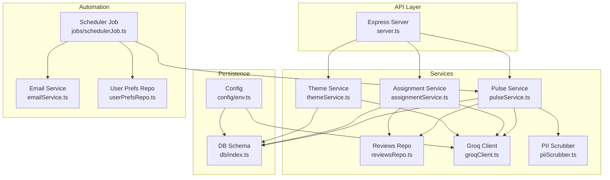
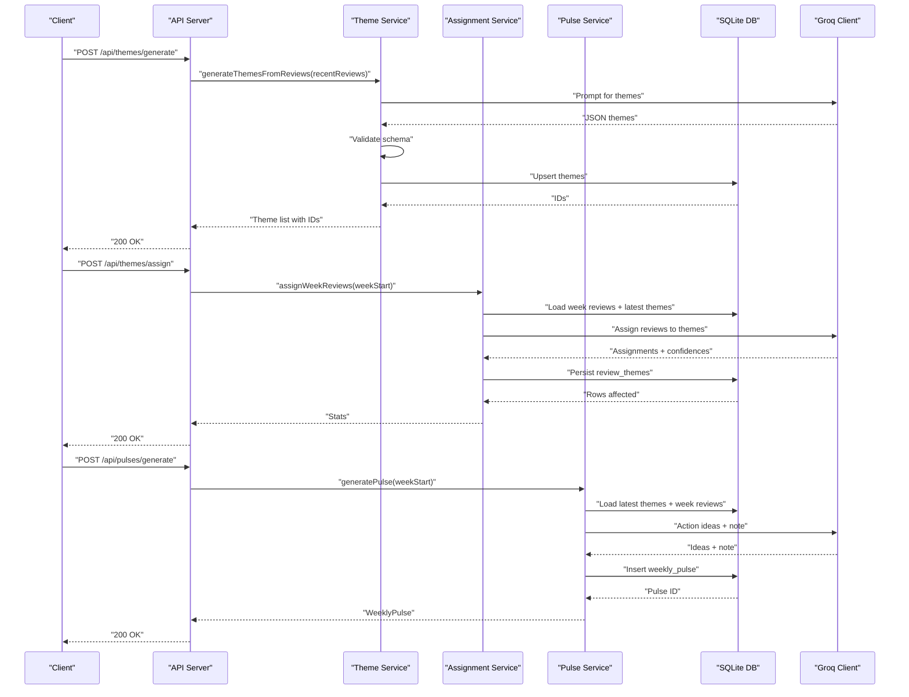
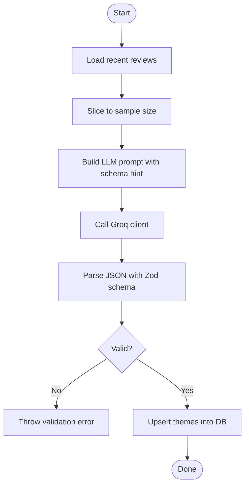
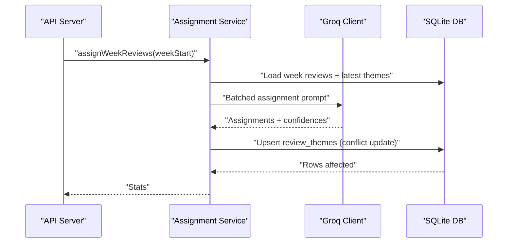
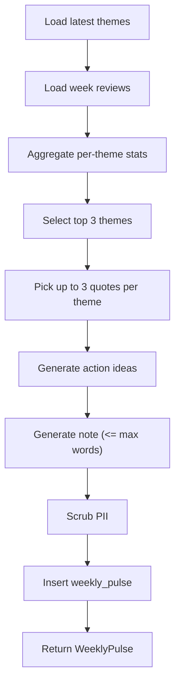
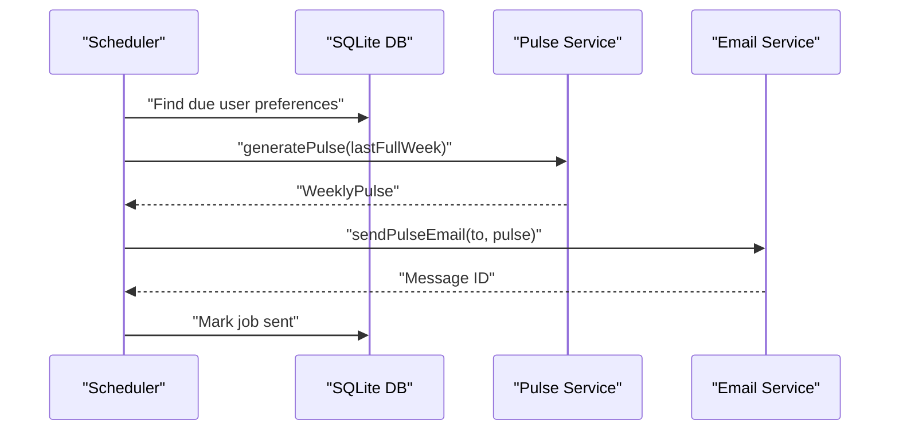
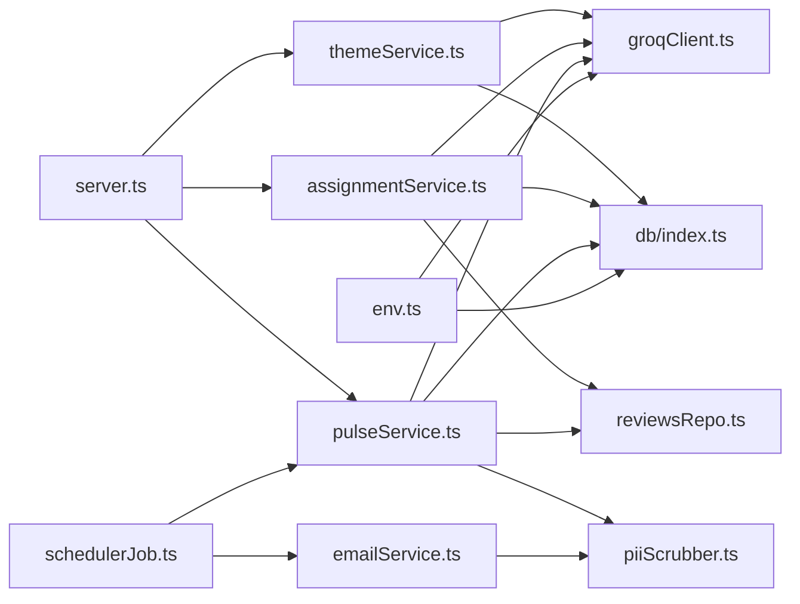

# Theme Generation & Management

<cite>
**Referenced Files in This Document**
- [themeService.ts](file://phase-2/src/services/themeService.ts)
- [assignmentService.ts](file://phase-2/src/services/assignmentService.ts)
- [pulseService.ts](file://phase-2/src/services/pulseService.ts)
- [reviewsRepo.ts](file://phase-2/src/services/reviewsRepo.ts)
- [groqClient.ts](file://phase-2/src/services/groqClient.ts)
- [server.ts](file://phase-2/src/api/server.ts)
- [index.ts](file://phase-2/src/db/index.ts)
- [env.ts](file://phase-2/src/config/env.ts)
- [schedulerJob.ts](file://phase-2/src/jobs/schedulerJob.ts)
- [emailService.ts](file://phase-2/src/services/emailService.ts)
- [userPrefsRepo.ts](file://phase-2/src/services/userPrefsRepo.ts)
- [piiScrubber.ts](file://phase-2/src/services/piiScrubber.ts)
- [review.ts](file://phase-2/src/domain/review.ts)
</cite>

## Table of Contents
1. [Introduction](#introduction)
2. [Project Structure](#project-structure)
3. [Core Components](#core-components)
4. [Architecture Overview](#architecture-overview)
5. [Detailed Component Analysis](#detailed-component-analysis)
6. [Dependency Analysis](#dependency-analysis)
7. [Performance Considerations](#performance-considerations)
8. [Troubleshooting Guide](#troubleshooting-guide)
9. [Conclusion](#conclusion)
10. [Appendices](#appendices)

## Introduction
This document explains the theme generation and management system that transforms processed app store reviews into validated, confidence-scored themes, assigns them to weekly reviews, and produces weekly pulses with curated insights. It covers the end-to-end workflow, validation rules, persistence strategy, categorization and metadata handling, search capabilities, lifecycle management, and performance considerations for bulk operations.

## Project Structure
The theme system spans several modules:
- API layer exposes endpoints to generate themes, assign them to weekly reviews, and produce weekly pulses.
- Services encapsulate theme generation, assignment, pulse creation, and email delivery.
- Database schema stores themes, review-theme mappings, weekly pulses, and auxiliary entities.
- Configuration and scheduler integrate external LLM APIs and automated email delivery.

**Diagram sources**
- [server.ts:1-266](file://phase-2/src/api/server.ts#L1-L266)
- [themeService.ts:1-68](file://phase-2/src/services/themeService.ts#L1-L68)
- [assignmentService.ts:1-114](file://phase-2/src/services/assignmentService.ts#L1-L114)
- [pulseService.ts:1-265](file://phase-2/src/services/pulseService.ts#L1-L265)
- [reviewsRepo.ts:1-26](file://phase-2/src/services/reviewsRepo.ts#L1-L26)
- [groqClient.ts:1-67](file://phase-2/src/services/groqClient.ts#L1-L67)
- [index.ts:1-93](file://phase-2/src/db/index.ts#L1-L93)
- [env.ts:1-23](file://phase-2/src/config/env.ts#L1-L23)
- [schedulerJob.ts:1-98](file://phase-2/src/jobs/schedulerJob.ts#L1-L98)
- [emailService.ts:1-142](file://phase-2/src/services/emailService.ts#L1-L142)
- [userPrefsRepo.ts:1-95](file://phase-2/src/services/userPrefsRepo.ts#L1-L95)
- [piiScrubber.ts:1-29](file://phase-2/src/services/piiScrubber.ts#L1-L29)

**Section sources**
- [server.ts:1-266](file://phase-2/src/api/server.ts#L1-L266)
- [index.ts:1-93](file://phase-2/src/db/index.ts#L1-L93)

## Core Components
- Theme Service: Generates themes from recent reviews using an LLM, validates them, and persists them with optional validity windows.
- Assignment Service: Assigns each review to a theme with optional confidence and persists mappings.
- Pulse Service: Aggregates theme stats per week, selects top themes, picks representative quotes, generates action ideas and a concise weekly note, and persists the weekly pulse.
- Database Schema: Defines tables for themes, review-theme mappings, weekly pulses, user preferences, scheduled jobs, and indexes for performance.
- API Routes: Expose endpoints to trigger generation, assignment, and pulse creation; manage user preferences; and send test emails.
- Scheduler: Automatically generates and emails weekly pulses to subscribed users based on preferences.

**Section sources**
- [themeService.ts:17-66](file://phase-2/src/services/themeService.ts#L17-L66)
- [assignmentService.ts:27-113](file://phase-2/src/services/assignmentService.ts#L27-L113)
- [pulseService.ts:59-241](file://phase-2/src/services/pulseService.ts#L59-L241)
- [index.ts:7-91](file://phase-2/src/db/index.ts#L7-L91)
- [server.ts:28-154](file://phase-2/src/api/server.ts#L28-L154)
- [schedulerJob.ts:52-97](file://phase-2/src/jobs/schedulerJob.ts#L52-L97)

## Architecture Overview
The system orchestrates three primary workflows:
- Theme generation: Loads recent reviews, prompts an LLM to propose 3–5 themes, validates the response, and inserts them into the themes table.
- Theme assignment: Loads a week’s reviews and latest themes, assigns each review to a theme (or “Other”), records confidence, and updates the review-themes mapping.
- Weekly pulse: Aggregates per-week stats, selects top themes, curates quotes, generates action ideas and a note, scrubs PII, and stores the pulse.

**Diagram sources**
- [server.ts:28-90](file://phase-2/src/api/server.ts#L28-L90)
- [themeService.ts:17-37](file://phase-2/src/services/themeService.ts#L17-L37)
- [assignmentService.ts:27-113](file://phase-2/src/services/assignmentService.ts#L27-L113)
- [pulseService.ts:179-241](file://phase-2/src/services/pulseService.ts#L179-L241)
- [groqClient.ts:30-65](file://phase-2/src/services/groqClient.ts#L30-L65)
- [index.ts:9-33](file://phase-2/src/db/index.ts#L9-L33)

## Detailed Component Analysis

### Theme Generation Workflow
- Input: Recent reviews filtered by recency and capped sample size.
- Prompting: A system prompt instructs the LLM to propose 3–5 themes with concise names and descriptions; a schema hint ensures structured JSON.
- Validation: Zod schema enforces theme count bounds and field constraints.
- Persistence: Upsert inserts themes with timestamps and optional validity window fields.

**Diagram sources**
- [themeService.ts:17-37](file://phase-2/src/services/themeService.ts#L17-L37)
- [groqClient.ts:30-65](file://phase-2/src/services/groqClient.ts#L30-L65)
- [index.ts:9-17](file://phase-2/src/db/index.ts#L9-L17)

**Section sources**
- [themeService.ts:17-37](file://phase-2/src/services/themeService.ts#L17-L37)
- [groqClient.ts:30-65](file://phase-2/src/services/groqClient.ts#L30-L65)

### Theme Validation Rules and Uniqueness Criteria
- Validation rules:
  - Theme name length: minimum and maximum enforced.
  - Description length: minimum and maximum enforced.
  - Count constraint: exactly 3–5 themes returned by the LLM.
- Uniqueness:
  - Composite unique index on themes: name, valid_from, valid_to.
  - This prevents duplicate themes within the same validity window.

**Section sources**
- [themeService.ts:6-13](file://phase-2/src/services/themeService.ts#L6-L13)
- [index.ts:19-22](file://phase-2/src/db/index.ts#L19-L22)

### Temporal Validity Constraints
- Themes include valid_from and valid_to fields.
- Uniqueness index enforces distinct themes per window.
- Upsert operation writes these fields; callers can pass a window to scope theme applicability.

**Section sources**
- [themeService.ts:39-56](file://phase-2/src/services/themeService.ts#L39-L56)
- [index.ts:9-16](file://phase-2/src/db/index.ts#L9-L16)

### Theme Persistence Strategy
- Themes table: name, description, timestamps, and validity window.
- Review-theme mapping: review_id, theme_id, confidence; unique per review-theme pair.
- Weekly pulses: JSON blobs for top themes, quotes, and action ideas; scalar fields for week range and note body.
- Indexes: composite unique index on themes(name, valid_from, valid_to); indexes on review_themes(review_id) and scheduled_jobs(status, scheduled_at_utc).

**Section sources**
- [index.ts:9-57](file://phase-2/src/db/index.ts#L9-L57)

### Theme Categorization, Metadata, and Search Capabilities
- Categorization:
  - Themes are static categories with names and descriptions.
  - Assignment maps each review to a theme via review_themes.
- Metadata:
  - Confidence scores stored alongside assignments.
  - Per-week stats derived from review_themes joins.
- Search:
  - List latest themes endpoint.
  - List recent pulses endpoint.
  - Per-week aggregation enables filtering by theme and rating.

**Section sources**
- [themeService.ts:58-66](file://phase-2/src/services/themeService.ts#L58-L66)
- [pulseService.ts:59-74](file://phase-2/src/services/pulseService.ts#L59-L74)
- [server.ts:45-101](file://phase-2/src/api/server.ts#L45-L101)

### Assignment Service and Confidence Scoring
- Batched assignment: processes reviews in fixed-size batches to control token usage.
- Prompt includes theme list and review excerpts; returns review_id, theme_name, and optional confidence.
- Persistence: upserts review_themes with confidence; skips “Other” or unknown theme names.

**Diagram sources**
- [assignmentService.ts:27-97](file://phase-2/src/services/assignmentService.ts#L27-L97)
- [groqClient.ts:30-65](file://phase-2/src/services/groqClient.ts#L30-L65)
- [index.ts:25-33](file://phase-2/src/db/index.ts#L25-L33)

**Section sources**
- [assignmentService.ts:27-97](file://phase-2/src/services/assignmentService.ts#L27-L97)

### Weekly Pulse Generation and Content Composition
- Inputs: Latest themes and reviews for the target week.
- Outputs: Top themes with counts and average ratings, curated quotes, action ideas, and a concise note.
- Persistence: Stores JSON payloads and scalar fields; version increments per week.

**Diagram sources**
- [pulseService.ts:179-241](file://phase-2/src/services/pulseService.ts#L179-L241)
- [reviewsRepo.ts:16-24](file://phase-2/src/services/reviewsRepo.ts#L16-L24)
- [index.ts:41-57](file://phase-2/src/db/index.ts#L41-L57)

**Section sources**
- [pulseService.ts:179-241](file://phase-2/src/services/pulseService.ts#L179-L241)

### API Endpoints and Manual Intervention
- Theme endpoints:
  - POST /api/themes/generate: generate and store themes.
  - GET /api/themes: list latest themes.
- Assignment endpoint:
  - POST /api/themes/assign: assign reviews for a week to latest themes.
- Pulse endpoints:
  - POST /api/pulses/generate: generate a weekly pulse.
  - GET /api/pulses: list recent pulses.
  - GET /api/pulses/:id: fetch a specific pulse.
  - POST /api/pulses/:id/send-email: send a pulse via email.
- User preferences:
  - POST /api/user-preferences: configure delivery preferences.
  - GET /api/user-preferences: retrieve active preferences.
- Debug helper:
  - GET /api/reviews/week/:weekStart: list a week’s reviews.

Manual intervention scenarios:
- Missing themes: generating a pulse without prior theme generation yields an error requiring theme creation first.
- No assignments: generating a pulse for a week with no review-theme mappings falls back to global themes with zero counts.
- No reviews: assignment for a week with no reviews triggers an error advising to run theme assignment.

**Section sources**
- [server.ts:28-248](file://phase-2/src/api/server.ts#L28-L248)
- [pulseService.ts:180-188](file://phase-2/src/services/pulseService.ts#L180-L188)

### Scheduler and Automated Delivery
- Scheduler determines the last full week (UTC), identifies due user preferences, generates the pulse, sends email, and records job outcomes.
- Email content is built from HTML and text templates, with PII scrubbing applied before sending.

**Diagram sources**
- [schedulerJob.ts:52-84](file://phase-2/src/jobs/schedulerJob.ts#L52-L84)
- [pulseService.ts:179-241](file://phase-2/src/services/pulseService.ts#L179-L241)
- [emailService.ts:114-129](file://phase-2/src/services/emailService.ts#L114-L129)

**Section sources**
- [schedulerJob.ts:52-84](file://phase-2/src/jobs/schedulerJob.ts#L52-L84)
- [emailService.ts:9-129](file://phase-2/src/services/emailService.ts#L9-L129)

## Dependency Analysis
Key dependencies and relationships:
- API routes depend on services for orchestration.
- Services depend on the database schema for persistence and on the Groq client for LLM interactions.
- Scheduler depends on pulse service and email service; it also maintains scheduled_jobs for auditability.
- PII scrubber is used across pulse generation and email building.

**Diagram sources**
- [server.ts:1-266](file://phase-2/src/api/server.ts#L1-L266)
- [themeService.ts:1-68](file://phase-2/src/services/themeService.ts#L1-L68)
- [assignmentService.ts:1-114](file://phase-2/src/services/assignmentService.ts#L1-L114)
- [pulseService.ts:1-265](file://phase-2/src/services/pulseService.ts#L1-L265)
- [reviewsRepo.ts:1-26](file://phase-2/src/services/reviewsRepo.ts#L1-L26)
- [groqClient.ts:1-67](file://phase-2/src/services/groqClient.ts#L1-L67)
- [index.ts:1-93](file://phase-2/src/db/index.ts#L1-L93)
- [schedulerJob.ts:1-98](file://phase-2/src/jobs/schedulerJob.ts#L1-L98)
- [emailService.ts:1-142](file://phase-2/src/services/emailService.ts#L1-L142)
- [piiScrubber.ts:1-29](file://phase-2/src/services/piiScrubber.ts#L1-L29)
- [env.ts:1-23](file://phase-2/src/config/env.ts#L1-L23)

**Section sources**
- [index.ts:7-91](file://phase-2/src/db/index.ts#L7-L91)

## Performance Considerations
- Bulk theme generation:
  - Uses a bounded sample of recent reviews and limits the number of items considered to reduce token usage and latency.
  - LLM calls are retried with increasing temperature to improve JSON parsing reliability.
- Concurrent processing:
  - Assignment batches requests to control token consumption and throughput.
  - Database transactions wrap bulk inserts/upserts to maintain consistency.
- Indexing:
  - Unique composite index on themes(name, valid_from, valid_to) prevents duplicates and supports fast lookup.
  - Index on review_themes(review_id) accelerates assignment lookups.
- I/O and memory:
  - JSON serialization for weekly pulses keeps payloads compact while preserving structure.
  - Word-count guard in note generation ensures content stays within limits.

[No sources needed since this section provides general guidance]

## Troubleshooting Guide
Common issues and resolutions:
- Validation failures during theme generation:
  - Symptoms: 500 errors when generating themes.
  - Causes: LLM response did not match schema (e.g., wrong number of themes or missing fields).
  - Resolution: Regenerate themes after ensuring sufficient review volume and adjusting prompt constraints.
- No themes found for pulse generation:
  - Symptoms: Error indicating to run theme generation first.
  - Resolution: Execute theme generation before attempting pulse creation.
- No assignments recorded:
  - Symptoms: Pulse generated with zero counts for themes.
  - Causes: Assignment endpoint not executed or “Other” theme selected for all reviews.
  - Resolution: Run assignment for the week; verify theme names and descriptions.
- No reviews for a week:
  - Symptoms: Error stating no reviews found for the week.
  - Resolution: Confirm scraping and ingestion pipeline for the week; rerun assignment after data is available.
- Scheduler not starting:
  - Symptoms: No automated emails despite valid preferences.
  - Causes: Missing GROQ_API_KEY environment variable.
  - Resolution: Set GROQ_API_KEY to enable scheduler startup.
- SMTP configuration errors:
  - Symptoms: Errors when sending test or pulse emails.
  - Causes: Missing SMTP credentials.
  - Resolution: Configure SMTP_HOST, SMTP_USER, SMTP_PASS, and SMTP_FROM.

**Section sources**
- [themeService.ts:34-36](file://phase-2/src/services/themeService.ts#L34-L36)
- [pulseService.ts:180-188](file://phase-2/src/services/pulseService.ts#L180-L188)
- [server.ts:56-70](file://phase-2/src/api/server.ts#L56-L70)
- [schedulerJob.ts:258-262](file://phase-2/src/api/server.ts#L258-L262)
- [emailService.ts:99-102](file://phase-2/src/services/emailService.ts#L99-L102)

## Conclusion
The theme generation and management system provides a robust pipeline from raw reviews to validated themes, confident assignments, and curated weekly pulses. Its schema enforces uniqueness and validity windows, while services implement batching, validation, and PII scrubbing to ensure quality and safety. The scheduler automates delivery, and the API offers clear endpoints for manual intervention and monitoring.

[No sources needed since this section summarizes without analyzing specific files]

## Appendices

### Database Schema Extensions and Relationships
- themes: id, name, description, created_at, valid_from, valid_to; unique composite index on (name, valid_from, valid_to).
- review_themes: id, review_id, theme_id, confidence; unique (review_id, theme_id); foreign key to themes.
- weekly_pulses: id, week_start, week_end, top_themes (JSON), user_quotes (JSON), action_ideas (JSON), note_body, created_at, version; unique composite index on (week_start, version).
- user_preferences: id, email, timezone, preferred_day_of_week, preferred_time, created_at, updated_at, active.
- scheduled_jobs: id, user_preference_id, week_start, scheduled_at_utc, sent_at_utc, status, last_error; indexed by (status, scheduled_at_utc).

**Section sources**
- [index.ts:9-88](file://phase-2/src/db/index.ts#L9-L88)

### Example Workflows

- Theme generation process:
  - Endpoint: POST /api/themes/generate
  - Steps: Load recent reviews, prompt LLM, validate schema, upsert themes, return IDs.
  - Reference: [server.ts:28-43](file://phase-2/src/api/server.ts#L28-L43), [themeService.ts:17-37](file://phase-2/src/services/themeService.ts#L17-L37)

- Validation failure scenario:
  - Symptom: 500 error due to invalid theme count or fields.
  - Resolution: Regenerate themes after verifying review volume and prompt constraints.
  - Reference: [themeService.ts:34-36](file://phase-2/src/services/themeService.ts#L34-L36)

- Manual intervention: assigning themes to a week:
  - Endpoint: POST /api/themes/assign
  - Steps: Load week reviews and latest themes, batch assignment, persist mappings.
  - Reference: [server.ts:56-70](file://phase-2/src/api/server.ts#L56-L70), [assignmentService.ts:27-97](file://phase-2/src/services/assignmentService.ts#L27-L97)

- Weekly pulse generation:
  - Endpoint: POST /api/pulses/generate
  - Steps: Aggregate stats, select top themes, pick quotes, generate ideas and note, persist pulse.
  - Reference: [server.ts:76-90](file://phase-2/src/api/server.ts#L76-L90), [pulseService.ts:179-241](file://phase-2/src/services/pulseService.ts#L179-L241)

- Scheduler-driven delivery:
  - Behavior: Determines last full week, finds due preferences, generates pulse, sends email, records job outcome.
  - Reference: [schedulerJob.ts:52-84](file://phase-2/src/jobs/schedulerJob.ts#L52-L84)