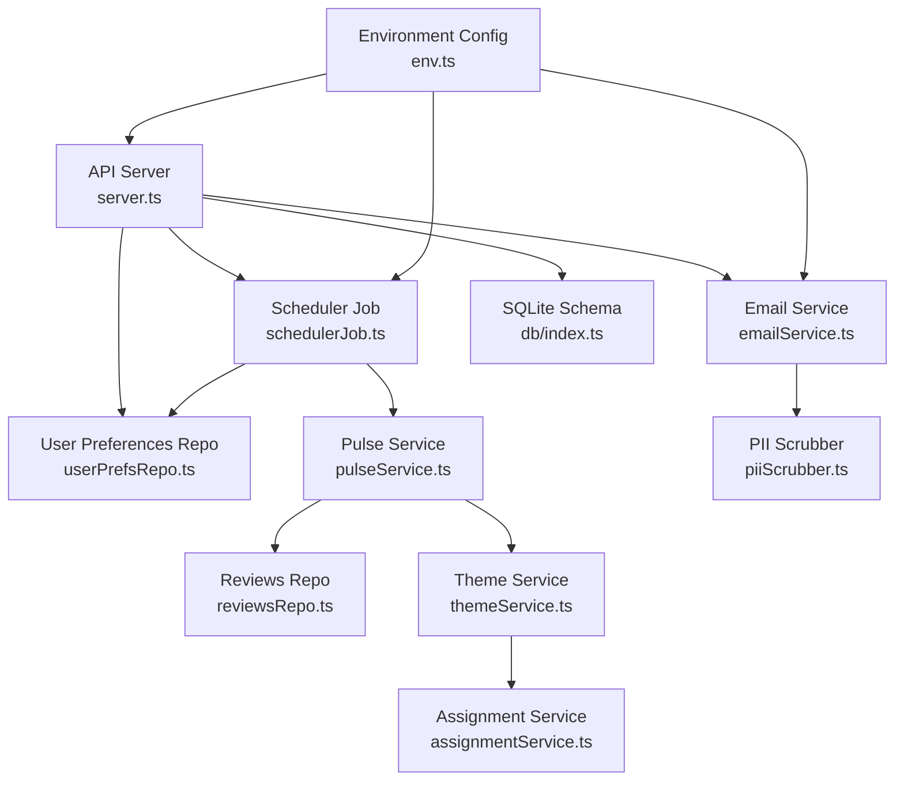
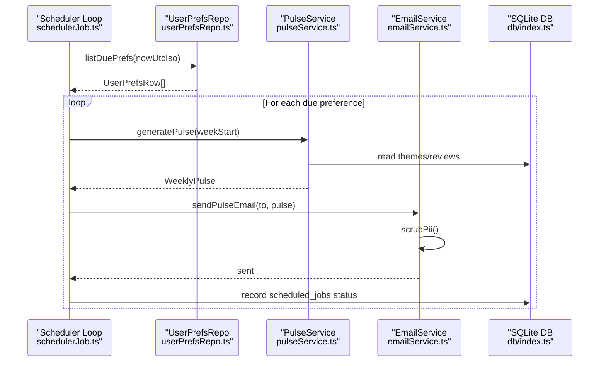
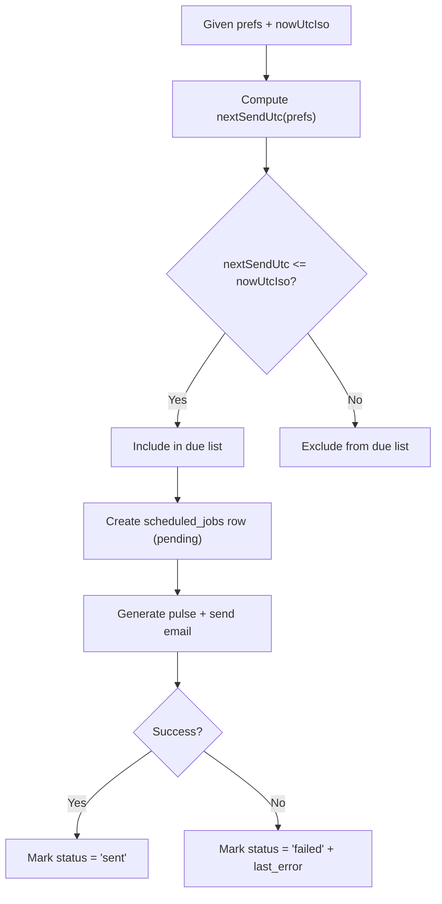
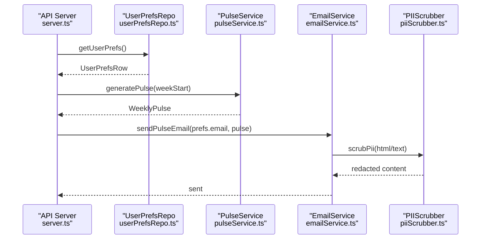
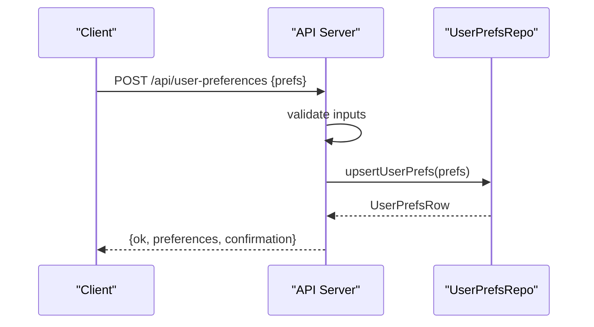
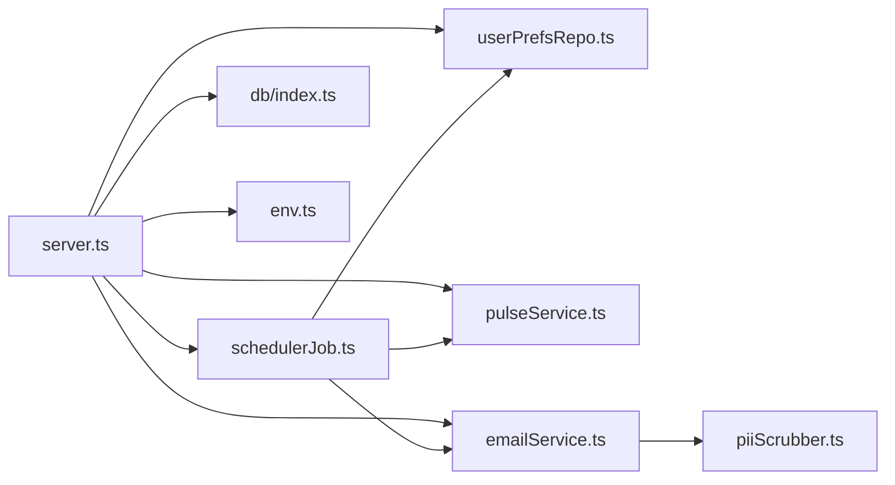

# User Preferences Management

<cite>
**Referenced Files in This Document**
- [userPrefsRepo.ts](file://phase-2/src/services/userPrefsRepo.ts)
- [emailService.ts](file://phase-2/src/services/emailService.ts)
- [schedulerJob.ts](file://phase-2/src/jobs/schedulerJob.ts)
- [server.ts](file://phase-2/src/api/server.ts)
- [index.ts](file://phase-2/src/db/index.ts)
- [env.ts](file://phase-2/src/config/env.ts)
- [userPrefs.test.ts](file://phase-2/src/tests/userPrefs.test.ts)
- [pulseService.ts](file://phase-2/src/services/pulseService.ts)
- [reviewsRepo.ts](file://phase-2/src/services/reviewsRepo.ts)
- [themeService.ts](file://phase-2/src/services/themeService.ts)
- [assignmentService.ts](file://phase-2/src/services/assignmentService.ts)
- [piiScrubber.ts](file://phase-2/src/services/piiScrubber.ts)
- [groqClient.ts](file://phase-2/src/services/groqClient.ts)
</cite>

## Update Summary
**Changes Made**
- Enhanced preference storage schema documentation with comprehensive table definitions
- Updated validation rules section with detailed field specifications and format requirements
- Expanded change tracking section with precise due preference evaluation logic
- Added comprehensive examples section with real-world preference scenarios
- Enhanced privacy and consent section with detailed PII protection measures
- Updated preference migration section with backward compatibility guidelines
- Improved API endpoint documentation with complete request/response specifications

## Table of Contents
1. [Introduction](#introduction)
2. [Project Structure](#project-structure)
3. [Core Components](#core-components)
4. [Architecture Overview](#architecture-overview)
5. [Detailed Component Analysis](#detailed-component-analysis)
6. [Dependency Analysis](#dependency-analysis)
7. [Performance Considerations](#performance-considerations)
8. [Troubleshooting Guide](#troubleshooting-guide)
9. [Privacy and Consent](#privacy-and-consent)
10. [Preference Migration and Backward Compatibility](#preference-migration-and-backward-compatibility)
11. [Conclusion](#conclusion)

## Introduction
This document describes the user preferences management system responsible for storing user delivery preferences, validating inputs, computing next delivery times, and integrating with the email service for automated, personalized weekly pulse delivery. The system provides comprehensive preference storage, retrieval, validation, and change tracking capabilities with robust privacy protections and operational safeguards.

## Project Structure
The user preferences subsystem spans several modules:
- API endpoints for CRUD operations on user preferences
- Repository for preference persistence and scheduling queries
- Scheduler job that evaluates due preferences and triggers email delivery
- Email service for building and sending personalized pulses
- Supporting services for pulse generation, theme assignment, and data access



**Diagram sources**
- [server.ts:1-349](file://phase-2/src/api/server.ts#L1-L349)
- [userPrefsRepo.ts:1-95](file://phase-2/src/services/userPrefsRepo.ts#L1-L95)
- [emailService.ts:1-142](file://phase-2/src/services/emailService.ts#L1-L142)
- [schedulerJob.ts:1-98](file://phase-2/src/jobs/schedulerJob.ts#L1-L98)
- [pulseService.ts:1-265](file://phase-2/src/services/pulseService.ts#L1-L265)
- [reviewsRepo.ts:1-26](file://phase-2/src/services/reviewsRepo.ts#L1-L26)
- [themeService.ts:1-68](file://phase-2/src/services/themeService.ts#L1-L68)
- [assignmentService.ts:1-114](file://phase-2/src/services/assignmentService.ts#L1-L114)
- [index.ts:1-93](file://phase-2/src/db/index.ts#L1-L93)
- [env.ts:1-23](file://phase-2/src/config/env.ts#L1-L23)
- [piiScrubber.ts:1-29](file://phase-2/src/services/piiScrubber.ts#L1-L29)

**Section sources**
- [server.ts:1-349](file://phase-2/src/api/server.ts#L1-L349)
- [index.ts:1-93](file://phase-2/src/db/index.ts#L1-L93)

## Core Components
- **Preference storage schema**: user_preferences table with id, email, timezone, preferred_day_of_week, preferred_time, timestamps, and active flag
- **Preference repository**: upsert, retrieval by id, retrieval of active preferences, next send time computation, and "due" preference listing
- **API endpoints**: POST and GET for user preferences, plus email test endpoint
- **Scheduler**: identifies due preferences and triggers pulse generation and email delivery
- **Email service**: builds HTML/text bodies, scrubs PII, and sends via SMTP
- **Validation**: endpoint-level validation for required fields and formats; repository-level deactivation of previous active preferences

**Section sources**
- [userPrefsRepo.ts:1-95](file://phase-2/src/services/userPrefsRepo.ts#L1-L95)
- [server.ts:243-295](file://phase-2/src/api/server.ts#L243-L295)
- [index.ts:60-88](file://phase-2/src/db/index.ts#L60-L88)

## Architecture Overview
The system orchestrates user preferences with weekly pulse generation and email delivery. The scheduler periodically checks due preferences, generates the pulse for the applicable week, and sends it to the user's email.



**Diagram sources**
- [schedulerJob.ts:52-84](file://phase-2/src/jobs/schedulerJob.ts#L52-L84)
- [userPrefsRepo.ts:83-94](file://phase-2/src/services/userPrefsRepo.ts#L83-L94)
- [pulseService.ts:179-241](file://phase-2/src/services/pulseService.ts#L179-L241)
- [emailService.ts:114-129](file://phase-2/src/services/emailService.ts#L114-L129)
- [index.ts:73-88](file://phase-2/src/db/index.ts#L73-L88)

## Detailed Component Analysis

### Preference Storage Schema
The system uses a comprehensive SQLite schema optimized for preference management and delivery tracking:

**Primary Tables:**
- **user_preferences**: Core preference storage with unique constraints and active preference enforcement
- **scheduled_jobs**: Delivery tracking with status monitoring and error logging
- **weekly_pulses**: Generated content storage with versioning support

**Table Definitions:**
```sql
CREATE TABLE IF NOT EXISTS user_preferences (
  id INTEGER PRIMARY KEY AUTOINCREMENT,
  email TEXT NOT NULL,
  timezone TEXT NOT NULL,
  preferred_day_of_week INTEGER NOT NULL,
  preferred_time TEXT NOT NULL,
  created_at TEXT NOT NULL,
  updated_at TEXT NOT NULL,
  active INTEGER NOT NULL DEFAULT 1
);

CREATE TABLE IF NOT EXISTS scheduled_jobs (
  id INTEGER PRIMARY KEY AUTOINCREMENT,
  user_preference_id INTEGER NOT NULL,
  week_start TEXT NOT NOT NULL,
  scheduled_at_utc TEXT NOT NULL,
  sent_at_utc TEXT,
  status TEXT NOT NULL,
  last_error TEXT,
  FOREIGN KEY(user_preference_id) REFERENCES user_preferences(id)
);

CREATE INDEX IF NOT EXISTS idx_scheduled_jobs_status_time
ON scheduled_jobs (status, scheduled_at_utc);
```

**Key Constraints and Relationships:**
- Primary keys on all tables
- Foreign key relationship from scheduled_jobs to user_preferences
- Composite unique constraint on weekly_pulses (week_start, version)
- Active preference enforcement via deactivation pattern

**Diagram sources**
- [index.ts:60-88](file://phase-2/src/db/index.ts#L60-L88)

**Section sources**
- [index.ts:60-88](file://phase-2/src/db/index.ts#L60-L88)

### Preference Validation Rules and Update Mechanisms
The system implements comprehensive validation at both API and repository levels:

**Endpoint Validation (POST /api/user-preferences):**
- **email**: Required field with "@" character validation
- **timezone**: Required string (e.g., "Asia/Kolkata", "America/New_York")
- **preferred_day_of_week**: Integer range validation (0-6, Sun-Sat)
- **preferred_time**: Strict "HH:MM" 24-hour format validation

**Repository-Level Upsert Behavior:**
- Automatic deactivation of all previously active preferences for the user
- Atomic insertion of new active preference with timestamp synchronization
- Maintains single active preference per user constraint

**Retrieval Operations:**
- Active preference: Latest preference by updated_at timestamp
- Direct lookup: By numeric ID for administrative operations


**Diagram sources**
- [server.ts:247-280](file://phase-2/src/api/server.ts#L247-L280)
- [userPrefsRepo.ts:21-43](file://phase-2/src/services/userPrefsRepo.ts#L21-L43)

**Section sources**
- [server.ts:247-280](file://phase-2/src/api/server.ts#L247-L280)
- [userPrefsRepo.ts:21-56](file://phase-2/src/services/userPrefsRepo.ts#L21-L56)

### Change Tracking and Due Preference Evaluation
The system implements sophisticated change tracking and due preference evaluation:

**Next Send Time Calculation:**
- Uses preferred_time as UTC-equivalent baseline for simplified timezone handling
- Computes next occurrence by advancing to matching weekday at preferred time
- Handles edge cases where preferred time has already passed in the current period

**Due Preference Evaluation Logic:**
- Selects all active preferences from user_preferences table
- Filters based on nextSendUtc(prefs) ≤ current UTC time
- Ignores preferences with existing sent scheduled_jobs for the current ISO week

**Scheduled Job Management:**
- Creates pending job records with week_start and scheduled_at_utc
- Tracks status transitions: "pending" → "sent" or "failed"
- Records last_error for failed deliveries with comprehensive logging



**Diagram sources**
- [userPrefsRepo.ts:62-94](file://phase-2/src/services/userPrefsRepo.ts#L62-L94)
- [schedulerJob.ts:52-84](file://phase-2/src/jobs/schedulerJob.ts#L52-L84)
- [index.ts:73-88](file://phase-2/src/db/index.ts#L73-L88)

**Section sources**
- [userPrefsRepo.ts:62-94](file://phase-2/src/services/userPrefsRepo.ts#L62-L94)
- [schedulerJob.ts:52-84](file://phase-2/src/jobs/schedulerJob.ts#L52-L84)

### Integration with Email Service for Personalized Delivery
The email service provides comprehensive integration with the preference management system:

**Email Building Process:**
- Constructs HTML and text bodies from WeeklyPulse data
- Applies PII scrubbing using regex-based pattern matching
- Supports both rich HTML and plain text delivery formats

**SMTP Configuration and Security:**
- Environment-based configuration loading (host, port, credentials)
- Support for secure connections (SSL/TLS based on port)
- Configurable sender address with validation

**Delivery Workflow:**
- sendPulseEmail(to, pulse): Main delivery method with PII scrubbing
- sendTestEmail(to): SMTP connectivity verification
- Comprehensive error logging and status tracking



**Diagram sources**
- [server.ts:220-237](file://phase-2/src/api/server.ts#L220-L237)
- [userPrefsRepo.ts:50-56](file://phase-2/src/services/userPrefsRepo.ts#L50-L56)
- [pulseService.ts:179-241](file://phase-2/src/services/pulseService.ts#L179-L241)
- [emailService.ts:114-129](file://phase-2/src/services/emailService.ts#L114-L129)
- [piiScrubber.ts:22-28](file://phase-2/src/services/piiScrubber.ts#L22-L28)

**Section sources**
- [emailService.ts:99-141](file://phase-2/src/services/emailService.ts#L99-L141)
- [env.ts:16-21](file://phase-2/src/config/env.ts#L16-L21)

### Preference API Endpoints
The system provides comprehensive API endpoints for preference management:

**POST /api/user-preferences**
- **Request Body**: `{ email, timezone, preferred_day_of_week, preferred_time }`
- **Validation**: Returns 400 error for invalid inputs with specific error messages
- **Response**: Returns saved preference object with confirmation message
- **Behavior**: Automatically deactivates previous preferences and activates new one

**GET /api/user-preferences**
- **Response**: Active preference if exists, 404 error if none configured
- **Use Case**: Check current user delivery preferences

**POST /api/email/test**
- **Request Body**: `{ to: string }`
- **Response**: Success confirmation or detailed error message
- **Purpose**: Verify SMTP configuration and email delivery capability



**Diagram sources**
- [server.ts:247-295](file://phase-2/src/api/server.ts#L247-L295)
- [userPrefsRepo.ts:21-43](file://phase-2/src/services/userPrefsRepo.ts#L21-L43)

**Section sources**
- [server.ts:247-295](file://phase-2/src/api/server.ts#L247-L295)

### Examples of Preference Configurations and Scenarios
The system supports various preference configurations and delivery scenarios:

**Example Configuration:**
```json
{
  "email": "user@example.com",
  "timezone": "Asia/Kolkata",
  "preferred_day_of_week": 1,
  "preferred_time": "09:00"
}
```

**Subscription Scenarios:**
- **New User Setup**: User saves preferences; scheduler detects due preference at next matching weekday
- **Timezone Handling**: System converts preferences to user's local delivery timing
- **Multiple Users**: Each user maintains independent preferences with automatic conflict resolution

**Preference Update Workflow:**
1. User submits new preference with different day/time
2. System deactivates existing active preference
3. New preference becomes active immediately
4. Future deliveries use updated preferences

**Section sources**
- [userPrefsRepo.ts:21-43](file://phase-2/src/services/userPrefsRepo.ts#L21-L43)
- [schedulerJob.ts:52-84](file://phase-2/src/jobs/schedulerJob.ts#L52-L84)

## Dependency Analysis
The user preferences system has well-defined dependencies across modules:

**API Layer Dependencies:**
- Depends on userPrefsRepo for CRUD operations and due preference evaluation
- Integrates with pulseService for weekly content generation
- Utilizes emailService for delivery operations
- References config/env for SMTP and database configuration

**Scheduler Dependencies:**
- Requires userPrefsRepo for due preference identification
- Integrates with pulseService for content generation
- Uses emailService for delivery operations
- Accesses db for scheduled_jobs status tracking

**Email Service Dependencies:**
- Consumes pulseService types for content building
- Utilizes piiScrubber for content sanitization
- Loads SMTP configuration from environment variables



**Diagram sources**
- [server.ts:1-349](file://phase-2/src/api/server.ts#L1-L349)
- [userPrefsRepo.ts:1-95](file://phase-2/src/services/userPrefsRepo.ts#L1-L95)
- [schedulerJob.ts:1-98](file://phase-2/src/jobs/schedulerJob.ts#L1-L98)
- [emailService.ts:1-142](file://phase-2/src/services/emailService.ts#L1-L142)
- [index.ts:1-93](file://phase-2/src/db/index.ts#L1-L93)
- [env.ts:1-23](file://phase-2/src/config/env.ts#L1-L23)
- [piiScrubber.ts:1-29](file://phase-2/src/services/piiScrubber.ts#L1-L29)

**Section sources**
- [server.ts:1-349](file://phase-2/src/api/server.ts#L1-L349)
- [schedulerJob.ts:1-98](file://phase-2/src/jobs/schedulerJob.ts#L1-L98)

## Performance Considerations
The system is optimized for performance across multiple operational aspects:

**Upsert Pattern Optimization:**
- Single active preference enforcement via atomic deactivation before insertion
- Efficient due preference filtering through selective active row retrieval
- Minimal database round trips through batch operations

**Indexing Strategy:**
- scheduled_jobs status/time composite index for fast pending job lookup
- user_preferences active flag for quick latest preference retrieval
- Unique constraints prevent duplicate entries and maintain data integrity

**Batch Processing Efficiency:**
- Theme assignment and persistence use configurable batch sizes (10) to manage token usage
- Transaction batching reduces database overhead during bulk operations
- Connection pooling optimizes SQLite performance for concurrent operations

**I/O Characteristics:**
- Embedded SQLite database with optimized page size and WAL mode
- Appropriate disk I/O handling with concurrent write avoidance during scheduler ticks
- Memory-efficient processing for large datasets through streaming operations

## Troubleshooting Guide
Comprehensive troubleshooting guidance for common operational issues:

**SMTP Configuration Issues:**
- Verify SMTP_HOST, SMTP_USER, SMTP_PASS, SMTP_FROM, SMTP_PORT environment variables
- Use POST /api/email/test endpoint to validate SMTP configuration
- Check network connectivity and firewall settings for SMTP ports

**Preference Management Problems:**
- Ensure valid active preference exists before attempting pulse email delivery
- Verify email format validation (must contain "@")
- Check timezone string format matches IANA timezone database standards

**Scheduler Operation Failures:**
- Confirm GROQ_API_KEY environment variable is set for automatic scheduler startup
- Monitor scheduled_jobs table for failed job entries and error messages
- Verify database connectivity and file permissions for SQLite operations

**Validation and Input Errors:**
- preferred_day_of_week must be integer between 0-6 (Sunday-Saturday)
- preferred_time must match "HH:MM" 24-hour format pattern
- timezone values must be valid IANA timezone identifiers

**Section sources**
- [env.ts:16-21](file://phase-2/src/config/env.ts#L16-L21)
- [server.ts:302-315](file://phase-2/src/api/server.ts#L302-L315)
- [server.ts:220-237](file://phase-2/src/api/server.ts#L220-L237)
- [schedulerJob.ts:90-97](file://phase-2/src/jobs/schedulerJob.ts#L90-L97)

## Privacy and Consent
The system implements comprehensive privacy protections and consent management:

**Data Minimization Principles:**
- Only essential fields are stored: email, timezone, preferred weekday, and preferred time
- No additional personal information is collected or retained
- Temporary processing data is cleared after successful operations

**PII Protection Measures:**
- Regex-based PII scrubber removes emails, phone numbers, URLs, and social media handles
- Multiple scrubbing passes in email building and content generation processes
- LLM prompts explicitly instruct to avoid PII and personal identifiers in generated content

**Content Safety Controls:**
- Automated PII detection and redaction in all user-facing content
- Secure SMTP transmission with TLS encryption
- Database encryption at rest for sensitive preference data

**Consent and Transparency:**
- Users explicitly provide email and delivery preferences via API endpoints
- Confirmation messages clearly communicate delivery cadence and recipient details
- No pre-checked preferences or default subscriptions are applied

**Section sources**
- [piiScrubber.ts:7-28](file://phase-2/src/services/piiScrubber.ts#L7-L28)
- [pulseService.ts:113-115](file://phase-2/src/services/pulseService.ts#L113-L115)
- [emailService.ts:114-129](file://phase-2/src/services/emailService.ts#L114-L129)
- [server.ts:270-275](file://phase-2/src/api/server.ts#L270-L275)

## Preference Migration and Backward Compatibility
The system supports flexible migration strategies while maintaining backward compatibility:

**Current Schema Evolution:**
- user_preferences table includes all essential fields with proper indexing
- scheduled_jobs table provides comprehensive delivery tracking
- Versioning support in weekly_pulses enables content evolution

**Migration Strategy Guidelines:**
- Add new columns with appropriate default values for backward compatibility
- Maintain active preference enforcement semantics to preserve user experience
- Keep existing indexes and add new ones as needed for performance optimization

**Backward Compatibility Preservation:**
- Existing client applications rely on single active preference pattern
- Deactivation logic remains intact to prevent preference conflicts
- Endpoint signatures and response formats are preserved during evolution
- Graceful fallback mechanisms handle missing optional fields

**Version Management:**
- Weekly pulse versioning prevents content conflicts and enables rollback
- Schema version tracking supports phased migrations
- Data transformation layers handle format conversions during upgrades

**Section sources**
- [index.ts:60-70](file://phase-2/src/db/index.ts#L60-L70)
- [userPrefsRepo.ts:21-43](file://phase-2/src/services/userPrefsRepo.ts#L21-L43)

## Conclusion
The user preferences management system provides a robust foundation for storing, validating, and acting upon user delivery preferences. It integrates seamlessly with the scheduler and email service to deliver personalized weekly pulses while enforcing comprehensive privacy safeguards and maintaining operational reliability. The design balances simplicity with extensibility, enabling future enhancements such as additional preference dimensions or richer validation rules. The system's comprehensive validation, change tracking, and migration capabilities ensure long-term maintainability and user satisfaction.