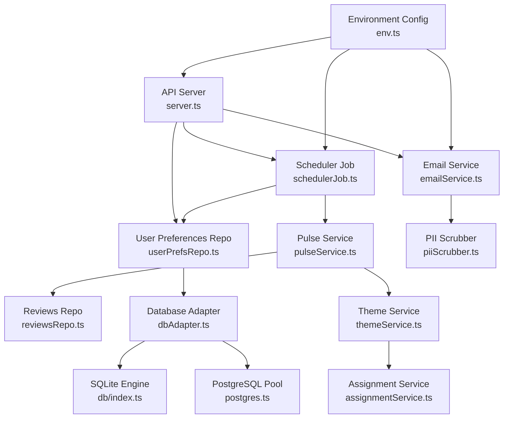
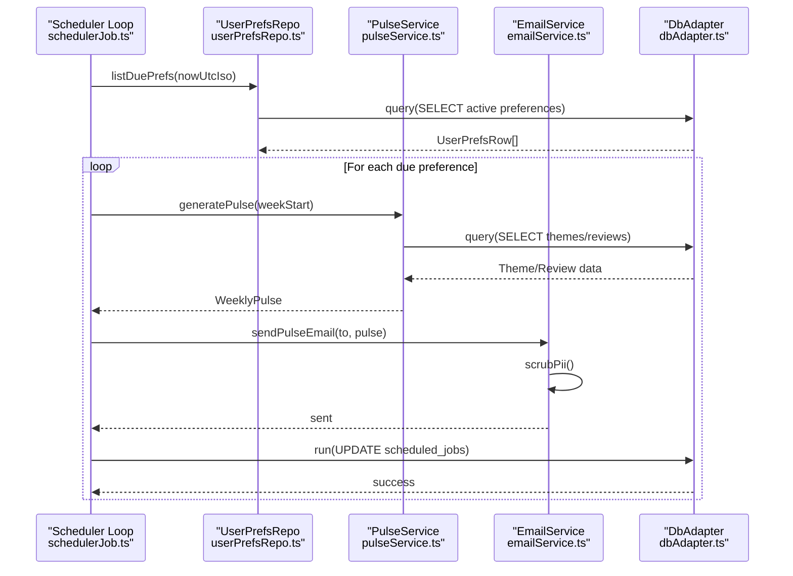
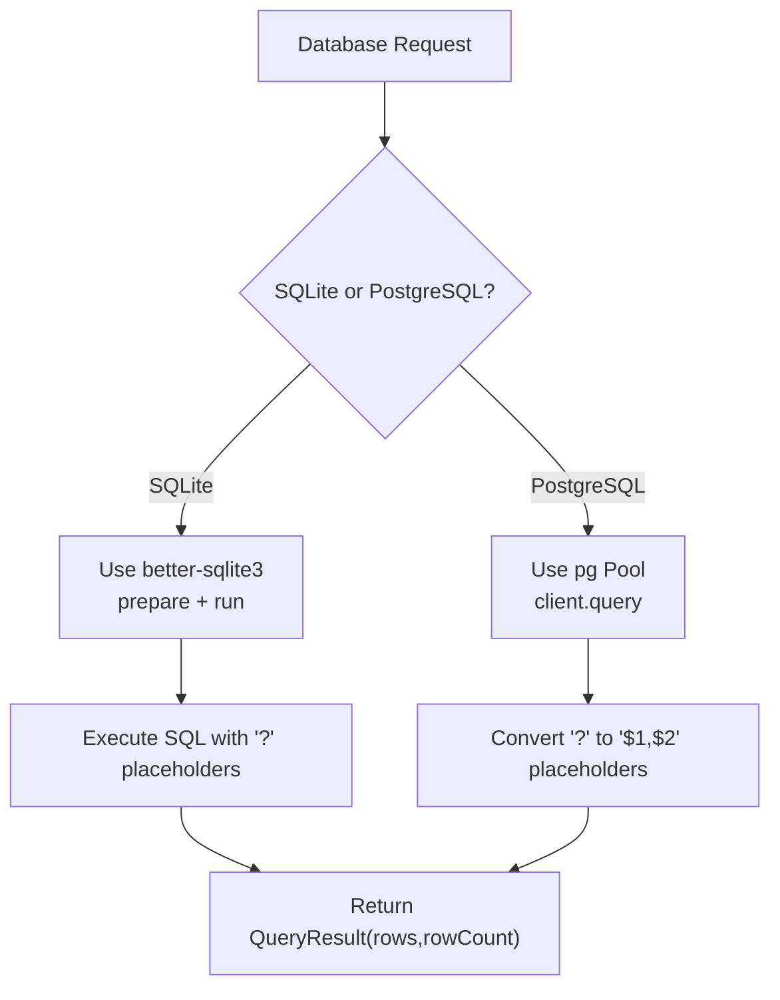
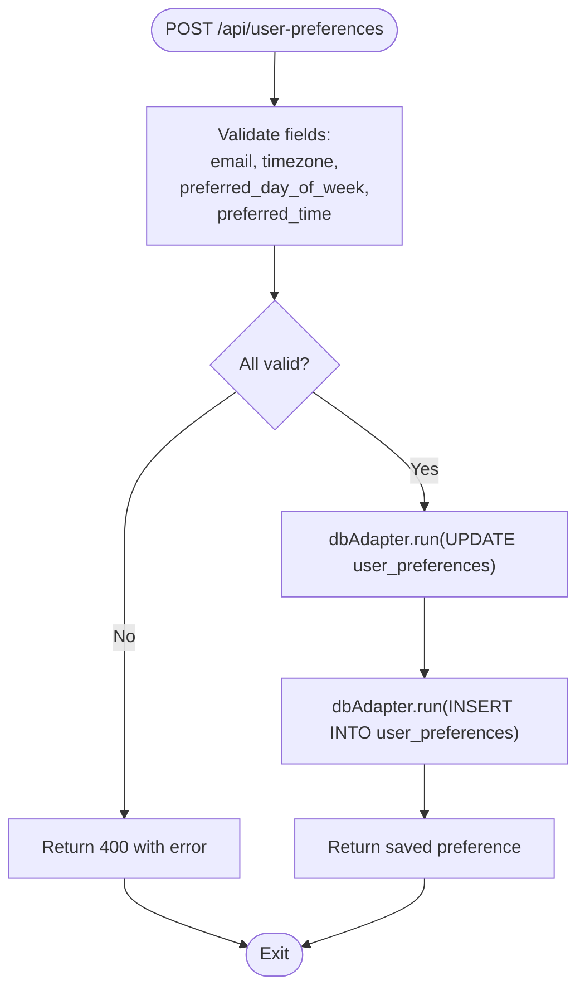
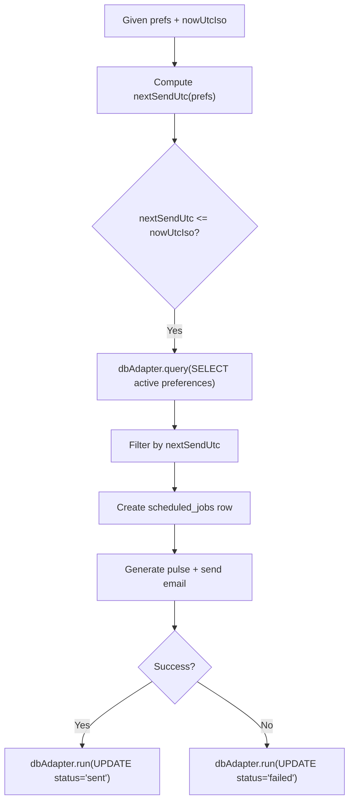
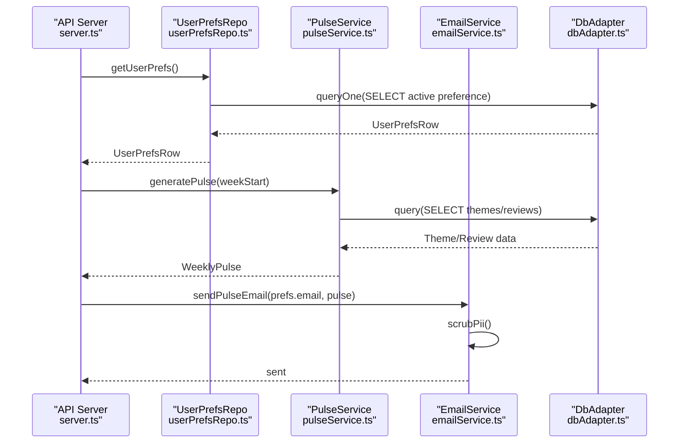
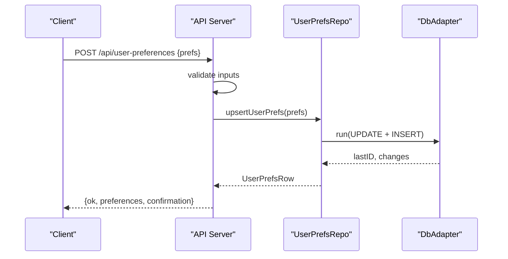
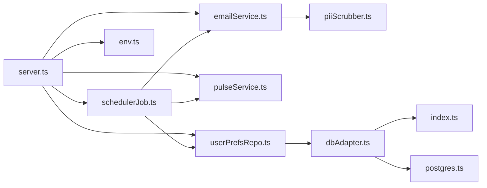

# User Preferences Management

<cite>
**Referenced Files in This Document**
- [dbAdapter.ts](file://phase-2/src/db/dbAdapter.ts)
- [index.ts](file://phase-2/src/db/index.ts)
- [postgres.ts](file://phase-2/src/db/postgres.ts)
- [userPrefsRepo.ts](file://phase-2/src/services/userPrefsRepo.ts)
- [emailService.ts](file://phase-2/src/services/emailService.ts)
- [schedulerJob.ts](file://phase-2/src/jobs/schedulerJob.ts)
- [server.ts](file://phase-2/src/api/server.ts)
- [env.ts](file://phase-2/src/config/env.ts)
- [userPrefs.test.ts](file://phase-2/src/tests/userPrefs.test.ts)
- [pulseService.ts](file://phase-2/src/services/pulseService.ts)
- [reviewsRepo.ts](file://phase-2/src/services/reviewsRepo.ts)
- [themeService.ts](file://phase-2/src/services/themeService.ts)
- [assignmentService.ts](file://phase-2/src/services/assignmentService.ts)
- [piiScrubber.ts](file://phase-2/src/services/piiScrubber.ts)
- [groqClient.ts](file://phase-2/src/services/groqClient.ts)
</cite>

## Update Summary
**Changes Made**
- Updated database layer documentation to reflect the new database adapter abstraction
- Enhanced preference storage schema documentation with PostgreSQL compatibility details
- Updated validation rules section with unified database operation behavior
- Expanded change tracking section with consistent transaction handling
- Enhanced privacy and consent section with database security considerations
- Updated preference migration section with cross-database compatibility guidelines
- Improved API endpoint documentation with database adapter integration

## Table of Contents
1. [Introduction](#introduction)
2. [Project Structure](#project-structure)
3. [Core Components](#core-components)
4. [Architecture Overview](#architecture-overview)
5. [Detailed Component Analysis](#detailed-component-analysis)
6. [Dependency Analysis](#dependency-analysis)
7. [Performance Considerations](#performance-considerations)
8. [Troubleshooting Guide](#troubleshooting-guide)
9. [Privacy and Consent](#privacy-and-consent)
10. [Preference Migration and Backward Compatibility](#preference-migration-and-backward-compatibility)
11. [Conclusion](#conclusion)

## Introduction
This document describes the user preferences management system responsible for storing user delivery preferences, validating inputs, computing next delivery times, and integrating with the email service for automated, personalized weekly pulse delivery. The system provides comprehensive preference storage, retrieval, validation, and change tracking capabilities with robust privacy protections and operational safeguards. The system now utilizes a unified database adapter that provides consistent behavior across both SQLite and PostgreSQL implementations.

## Project Structure
The user preferences subsystem spans several modules with a unified database adapter layer:
- API endpoints for CRUD operations on user preferences
- Database adapter providing unified interface for SQLite and PostgreSQL
- Repository for preference persistence and scheduling queries
- Scheduler job that evaluates due preferences and triggers email delivery
- Email service for building and sending personalized pulses
- Supporting services for pulse generation, theme assignment, and data access



**Diagram sources**
- [server.ts:1-399](file://phase-2/src/api/server.ts#L1-L399)
- [userPrefsRepo.ts:1-94](file://phase-2/src/services/userPrefsRepo.ts#L1-L94)
- [emailService.ts:1-142](file://phase-2/src/services/emailService.ts#L1-L142)
- [schedulerJob.ts:1-99](file://phase-2/src/jobs/schedulerJob.ts#L1-L99)
- [pulseService.ts:1-200](file://phase-2/src/services/pulseService.ts#L1-L200)
- [reviewsRepo.ts:1-26](file://phase-2/src/services/reviewsRepo.ts#L1-L26)
- [themeService.ts:1-78](file://phase-2/src/services/themeService.ts#L1-L78)
- [assignmentService.ts:1-114](file://phase-2/src/services/assignmentService.ts#L1-L114)
- [dbAdapter.ts:1-178](file://phase-2/src/db/dbAdapter.ts#L1-L178)
- [index.ts:1-133](file://phase-2/src/db/index.ts#L1-L133)
- [postgres.ts:1-143](file://phase-2/src/db/postgres.ts#L1-L143)
- [env.ts:1-23](file://phase-2/src/config/env.ts#L1-L23)
- [piiScrubber.ts:1-29](file://phase-2/src/services/piiScrubber.ts#L1-L29)

**Section sources**
- [server.ts:1-399](file://phase-2/src/api/server.ts#L1-L399)
- [dbAdapter.ts:1-178](file://phase-2/src/db/dbAdapter.ts#L1-L178)
- [index.ts:1-133](file://phase-2/src/db/index.ts#L1-L133)

## Core Components
- **Unified Database Adapter**: DbAdapter class providing consistent interface for both SQLite and PostgreSQL operations
- **Preference storage schema**: user_preferences table with id, email, timezone, preferred_day_of_week, preferred_time, timestamps, and active flag
- **Preference repository**: upsert, retrieval by id, retrieval of active preferences, next send time computation, and "due" preference listing
- **API endpoints**: POST and GET for user preferences, plus email test endpoint
- **Scheduler**: identifies due preferences and triggers pulse generation and email delivery
- **Email service**: builds HTML/text bodies, scrubs PII, and sends via SMTP
- **Validation**: endpoint-level validation for required fields and formats; repository-level deactivation of previous active preferences

**Section sources**
- [dbAdapter.ts:13-178](file://phase-2/src/db/dbAdapter.ts#L13-L178)
- [userPrefsRepo.ts:1-94](file://phase-2/src/services/userPrefsRepo.ts#L1-L94)
- [server.ts:300-352](file://phase-2/src/api/server.ts#L300-L352)
- [index.ts:96-125](file://phase-2/src/db/index.ts#L96-L125)

## Architecture Overview
The system orchestrates user preferences with weekly pulse generation and email delivery through a unified database adapter that abstracts database differences between SQLite and PostgreSQL implementations. The scheduler periodically checks due preferences, generates the pulse for the applicable week, and sends it to the user's email.



**Diagram sources**
- [schedulerJob.ts:53-85](file://phase-2/src/jobs/schedulerJob.ts#L53-L85)
- [userPrefsRepo.ts:83-94](file://phase-2/src/services/userPrefsRepo.ts#L83-L94)
- [pulseService.ts:59-73](file://phase-2/src/services/pulseService.ts#L59-L73)
- [emailService.ts:114-129](file://phase-2/src/services/emailService.ts#L114-L129)
- [dbAdapter.ts:28-52](file://phase-2/src/db/dbAdapter.ts#L28-L52)

## Detailed Component Analysis

### Unified Database Adapter Layer
The system now employs a comprehensive database adapter that provides consistent behavior across both SQLite and PostgreSQL implementations:

**Database Adapter Architecture:**
- **DbAdapter Class**: Centralized interface for all database operations
- **Dual Database Support**: Automatic detection of SQLite vs PostgreSQL environments
- **Placeholder Translation**: Converts SQLite "?" placeholders to PostgreSQL "$1", "$2" syntax
- **Transaction Support**: Unified transaction handling for both database engines
- **Type Safety**: Consistent return types and error handling across databases

**Database Detection and Initialization:**
- Environment-based database selection using DATABASE_URL presence
- SQLite initialization with better-sqlite3 for local development
- PostgreSQL initialization with connection pooling for production

**Key Features:**
- **Query Method**: Executes SELECT statements with parameter binding
- **Run Method**: Executes INSERT/UPDATE/DELETE with result tracking
- **QueryOne Method**: Returns single row results
- **Transaction Method**: Provides ACID guarantees across operations



**Diagram sources**
- [dbAdapter.ts:17-52](file://phase-2/src/db/dbAdapter.ts#L17-L52)
- [index.ts:6-18](file://phase-2/src/db/index.ts#L6-L18)
- [postgres.ts:6-25](file://phase-2/src/db/postgres.ts#L6-L25)

**Section sources**
- [dbAdapter.ts:13-178](file://phase-2/src/db/dbAdapter.ts#L13-L178)
- [index.ts:6-18](file://phase-2/src/db/index.ts#L6-L18)
- [postgres.ts:1-143](file://phase-2/src/db/postgres.ts#L1-L143)

### Preference Storage Schema
The system uses a comprehensive schema optimized for preference management and delivery tracking with cross-database compatibility:

**Primary Tables:**
- **user_preferences**: Core preference storage with unique constraints and active preference enforcement
- **scheduled_jobs**: Delivery tracking with status monitoring and error logging
- **weekly_pulses**: Generated content storage with versioning support

**Cross-Database Schema Differences:**
- **SQLite**: INTEGER PRIMARY KEY AUTOINCREMENT, TEXT timestamps
- **PostgreSQL**: SERIAL PRIMARY KEY, TIMESTAMP with timezone support

**Table Definitions:**
```sql
CREATE TABLE IF NOT EXISTS user_preferences (
  id INTEGER PRIMARY KEY AUTOINCREMENT, -- SQLite
  id SERIAL PRIMARY KEY,                -- PostgreSQL
  email TEXT NOT NULL,
  timezone TEXT NOT NULL,
  preferred_day_of_week INTEGER NOT NULL,
  preferred_time TEXT NOT NULL,
  created_at TEXT NOT NULL,             -- SQLite: TEXT
  created_at TIMESTAMP NOT NULL,        -- PostgreSQL: TIMESTAMP
  updated_at TEXT NOT NULL,             -- SQLite: TEXT
  updated_at TIMESTAMP NOT NULL,        -- PostgreSQL: TIMESTAMP
  active INTEGER NOT NULL DEFAULT 1     -- SQLite: INTEGER
  active INTEGER NOT NULL DEFAULT 1     -- PostgreSQL: INTEGER
);

CREATE TABLE IF NOT EXISTS scheduled_jobs (
  id INTEGER PRIMARY KEY AUTOINCREMENT, -- SQLite
  id SERIAL PRIMARY KEY,                -- PostgreSQL
  user_preference_id INTEGER NOT NULL,
  week_start TEXT NOT NULL,             -- SQLite: TEXT
  week_start DATE NOT NULL,             -- PostgreSQL: DATE
  scheduled_at_utc TEXT NOT NULL,       -- SQLite: TEXT
  scheduled_at_utc TIMESTAMP NOT NULL,  -- PostgreSQL: TIMESTAMP
  sent_at_utc TEXT,                     -- SQLite: TEXT
  sent_at_utc TIMESTAMP,                -- PostgreSQL: TIMESTAMP
  status TEXT NOT NULL,
  last_error TEXT,
  FOREIGN KEY(user_preference_id) REFERENCES user_preferences(id)
);

CREATE INDEX IF NOT EXISTS idx_scheduled_jobs_status_time
ON scheduled_jobs (status, scheduled_at_utc);
```

**Key Constraints and Relationships:**
- Primary keys on all tables with database-appropriate types
- Foreign key relationship from scheduled_jobs to user_preferences
- Composite unique constraint on weekly_pulses (week_start, version)
- Active preference enforcement via deactivation pattern

**Section sources**
- [index.ts:96-125](file://phase-2/src/db/index.ts#L96-L125)
- [postgres.ts:99-129](file://phase-2/src/db/postgres.ts#L99-L129)

### Preference Validation Rules and Update Mechanisms
The system implements comprehensive validation at both API and repository levels with unified database operations:

**Endpoint Validation (POST /api/user-preferences):**
- **email**: Required field with "@" character validation
- **timezone**: Required string (e.g., "Asia/Kolkata", "America/New_York")
- **preferred_day_of_week**: Integer range validation (0-6, Sun-Sat)
- **preferred_time**: Strict "HH:MM" 24-hour format validation

**Repository-Level Upsert Behavior:**
- Automatic deactivation of all previously active preferences for the user using unified database adapter
- Atomic insertion of new active preference with timestamp synchronization
- Maintains single active preference per user constraint

**Retrieval Operations:**
- Active preference: Latest preference by updated_at timestamp using consistent query interface
- Direct lookup: By numeric ID for administrative operations



**Diagram sources**
- [server.ts:304-337](file://phase-2/src/api/server.ts#L304-L337)
- [userPrefsRepo.ts:21-42](file://phase-2/src/services/userPrefsRepo.ts#L21-L42)
- [dbAdapter.ts:65-97](file://phase-2/src/db/dbAdapter.ts#L65-L97)

**Section sources**
- [server.ts:304-337](file://phase-2/src/api/server.ts#L304-L337)
- [userPrefsRepo.ts:21-42](file://phase-2/src/services/userPrefsRepo.ts#L21-L42)
- [dbAdapter.ts:65-97](file://phase-2/src/db/dbAdapter.ts#L65-L97)

### Change Tracking and Due Preference Evaluation
The system implements sophisticated change tracking and due preference evaluation with consistent database operations:

**Next Send Time Calculation:**
- Uses preferred_time as UTC-equivalent baseline for simplified timezone handling
- Computes next occurrence by advancing to matching weekday at preferred time
- Handles edge cases where preferred time has already passed in the current period

**Due Preference Evaluation Logic:**
- Selects all active preferences from user_preferences table using unified query interface
- Filters based on nextSendUtc(prefs) ≤ current UTC time
- Ignores preferences with existing sent scheduled_jobs for the current ISO week

**Scheduled Job Management:**
- Creates pending job records with week_start and scheduled_at_utc using consistent INSERT syntax
- Tracks status transitions: "pending" → "sent" or "failed"
- Records last_error for failed deliveries with comprehensive logging



**Diagram sources**
- [userPrefsRepo.ts:83-94](file://phase-2/src/services/userPrefsRepo.ts#L83-L94)
- [schedulerJob.ts:20-41](file://phase-2/src/jobs/schedulerJob.ts#L20-L41)
- [dbAdapter.ts:28-52](file://phase-2/src/db/dbAdapter.ts#L28-L52)

**Section sources**
- [userPrefsRepo.ts:83-94](file://phase-2/src/services/userPrefsRepo.ts#L83-L94)
- [schedulerJob.ts:20-41](file://phase-2/src/jobs/schedulerJob.ts#L20-L41)
- [dbAdapter.ts:28-52](file://phase-2/src/db/dbAdapter.ts#L28-L52)

### Integration with Email Service for Personalized Delivery
The email service provides comprehensive integration with the preference management system through unified database operations:

**Email Building Process:**
- Constructs HTML and text bodies from WeeklyPulse data
- Applies PII scrubbing using regex-based pattern matching
- Supports both rich HTML and plain text delivery formats

**SMTP Configuration and Security:**
- Environment-based configuration loading (host, port, credentials)
- Support for secure connections (SSL/TLS based on port)
- Configurable sender address with validation

**Delivery Workflow:**
- sendPulseEmail(to, pulse): Main delivery method with PII scrubbing
- sendTestEmail(to): SMTP connectivity verification
- Comprehensive error logging and status tracking



**Diagram sources**
- [server.ts:340-352](file://phase-2/src/api/server.ts#L340-L352)
- [userPrefsRepo.ts:49-56](file://phase-2/src/services/userPrefsRepo.ts#L49-L56)
- [pulseService.ts:59-73](file://phase-2/src/services/pulseService.ts#L59-L73)
- [emailService.ts:114-129](file://phase-2/src/services/emailService.ts#L114-L129)
- [dbAdapter.ts:57-60](file://phase-2/src/db/dbAdapter.ts#L57-L60)

**Section sources**
- [emailService.ts:114-142](file://phase-2/src/services/emailService.ts#L114-L142)
- [env.ts:16-21](file://phase-2/src/config/env.ts#L16-L21)

### Preference API Endpoints
The system provides comprehensive API endpoints for preference management with unified database operations:

**POST /api/user-preferences**
- **Request Body**: `{ email, timezone, preferred_day_of_week, preferred_time }`
- **Validation**: Returns 400 error for invalid inputs with specific error messages
- **Response**: Returns saved preference object with confirmation message
- **Behavior**: Automatically deactivates previous preferences and activates new one using database adapter

**GET /api/user-preferences**
- **Response**: Active preference if exists, 404 error if none configured
- **Use Case**: Check current user delivery preferences

**POST /api/email/test**
- **Request Body**: `{ to: string }`
- **Response**: Success confirmation or detailed error message
- **Purpose**: Verify SMTP configuration and email delivery capability



**Diagram sources**
- [server.ts:304-337](file://phase-2/src/api/server.ts#L304-L337)
- [userPrefsRepo.ts:21-42](file://phase-2/src/services/userPrefsRepo.ts#L21-L42)
- [dbAdapter.ts:65-97](file://phase-2/src/db/dbAdapter.ts#L65-L97)

**Section sources**
- [server.ts:304-337](file://phase-2/src/api/server.ts#L304-L337)

### Examples of Preference Configurations and Scenarios
The system supports various preference configurations and delivery scenarios with consistent database behavior:

**Example Configuration:**
```json
{
  "email": "user@example.com",
  "timezone": "Asia/Kolkata",
  "preferred_day_of_week": 1,
  "preferred_time": "09:00"
}
```

**Subscription Scenarios:**
- **New User Setup**: User saves preferences; scheduler detects due preference at next matching weekday
- **Timezone Handling**: System converts preferences to user's local delivery timing
- **Multiple Users**: Each user maintains independent preferences with automatic conflict resolution

**Preference Update Workflow:**
1. User submits new preference with different day/time
2. System deactivates existing active preference using unified database adapter
3. New preference becomes active immediately
4. Future deliveries use updated preferences

**Section sources**
- [userPrefsRepo.ts:21-42](file://phase-2/src/services/userPrefsRepo.ts#L21-L42)
- [schedulerJob.ts:53-85](file://phase-2/src/jobs/schedulerJob.ts#L53-L85)

## Dependency Analysis
The user preferences system has well-defined dependencies across modules with unified database abstraction:

**API Layer Dependencies:**
- Depends on userPrefsRepo for CRUD operations and due preference evaluation
- Integrates with pulseService for weekly content generation
- Utilizes emailService for delivery operations
- References config/env for SMTP and database configuration

**Scheduler Dependencies:**
- Requires userPrefsRepo for due preference identification
- Integrates with pulseService for content generation
- Uses emailService for delivery operations
- Accesses dbAdapter for scheduled_jobs status tracking

**Email Service Dependencies:**
- Consumes pulseService types for content building
- Utilizes piiScrubber for content sanitization
- Loads SMTP configuration from environment variables

**Database Abstraction Dependencies:**
- All services depend on dbAdapter for database operations
- Provides transparent SQLite/PostgreSQL compatibility
- Maintains consistent transaction handling



**Diagram sources**
- [server.ts:1-399](file://phase-2/src/api/server.ts#L1-L399)
- [userPrefsRepo.ts:1-94](file://phase-2/src/services/userPrefsRepo.ts#L1-L94)
- [schedulerJob.ts:1-99](file://phase-2/src/jobs/schedulerJob.ts#L1-L99)
- [emailService.ts:1-142](file://phase-2/src/services/emailService.ts#L1-L142)
- [dbAdapter.ts:1-178](file://phase-2/src/db/dbAdapter.ts#L1-L178)
- [index.ts:1-133](file://phase-2/src/db/index.ts#L1-L133)
- [postgres.ts:1-143](file://phase-2/src/db/postgres.ts#L1-L143)
- [env.ts:1-23](file://phase-2/src/config/env.ts#L1-L23)
- [piiScrubber.ts:1-29](file://phase-2/src/services/piiScrubber.ts#L1-L29)

**Section sources**
- [server.ts:1-399](file://phase-2/src/api/server.ts#L1-L399)
- [schedulerJob.ts:1-99](file://phase-2/src/jobs/schedulerJob.ts#L1-L99)
- [dbAdapter.ts:1-178](file://phase-2/src/db/dbAdapter.ts#L1-L178)

## Performance Considerations
The system is optimized for performance across multiple operational aspects with unified database operations:

**Database Adapter Optimizations:**
- **Connection Pooling**: PostgreSQL uses efficient connection pooling for concurrent operations
- **Placeholder Translation**: Automatic conversion minimizes query preparation overhead
- **Transaction Batching**: Unified transaction handling reduces database round trips

**Upsert Pattern Optimization:**
- Single active preference enforcement via atomic deactivation before insertion
- Efficient due preference filtering through selective active row retrieval
- Minimal database round trips through batch operations

**Indexing Strategy:**
- scheduled_jobs status/time composite index for fast pending job lookup
- user_preferences active flag for quick latest preference retrieval
- Unique constraints prevent duplicate entries and maintain data integrity

**Cross-Database Performance:**
- SQLite optimized for local development with WAL mode
- PostgreSQL optimized for production with connection pooling
- Consistent query patterns minimize performance differences

**I/O Characteristics:**
- Embedded SQLite database with optimized page size and WAL mode
- Appropriate disk I/O handling with concurrent write avoidance during scheduler ticks
- Memory-efficient processing for large datasets through streaming operations

## Troubleshooting Guide
Comprehensive troubleshooting guidance for common operational issues with database adapter considerations:

**Database Configuration Issues:**
- **SQLite Mode**: Default local development using better-sqlite3
- **PostgreSQL Mode**: Set DATABASE_URL environment variable for production
- **Connection Pool**: Verify PostgreSQL connection pool initialization and SSL settings

**SMTP Configuration Issues:**
- Verify SMTP_HOST, SMTP_USER, SMTP_PASS, SMTP_FROM, SMTP_PORT environment variables
- Use POST /api/email/test endpoint to validate SMTP configuration
- Check network connectivity and firewall settings for SMTP ports

**Preference Management Problems:**
- Ensure valid active preference exists before attempting pulse email delivery
- Verify email format validation (must contain "@")
- Check timezone string format matches IANA timezone database standards

**Scheduler Operation Failures:**
- Confirm GROQ_API_KEY environment variable is set for automatic scheduler startup
- Monitor scheduled_jobs table for failed job entries and error messages
- Verify database connectivity and file permissions for SQLite operations

**Database Adapter Issues:**
- **Placeholder Translation**: Ensure "?" placeholders work correctly in both SQLite and PostgreSQL
- **Transaction Handling**: Verify ACID properties in both database engines
- **Type Compatibility**: Check data type conversions between SQLite TEXT and PostgreSQL TIMESTAMP

**Validation and Input Errors:**
- preferred_day_of_week must be integer between 0-6 (Sunday-Saturday)
- preferred_time must match "HH:MM" 24-hour format pattern
- timezone values must be valid IANA timezone identifiers

**Section sources**
- [env.ts:16-21](file://phase-2/src/config/env.ts#L16-L21)
- [server.ts:358-372](file://phase-2/src/api/server.ts#L358-L372)
- [server.ts:340-352](file://phase-2/src/api/server.ts#L340-L352)
- [schedulerJob.ts:91-99](file://phase-2/src/jobs/schedulerJob.ts#L91-L99)
- [dbAdapter.ts:17-52](file://phase-2/src/db/dbAdapter.ts#L17-L52)

## Privacy and Consent
The system implements comprehensive privacy protections and consent management with database security considerations:

**Data Minimization Principles:**
- Only essential fields are stored: email, timezone, preferred weekday, and preferred time
- No additional personal information is collected or retained
- Temporary processing data is cleared after successful operations

**PII Protection Measures:**
- Regex-based PII scrubber removes emails, phone numbers, URLs, and social media handles
- Multiple scrubbing passes in email building and content generation processes
- LLM prompts explicitly instruct to avoid PII and personal identifiers in generated content

**Content Safety Controls:**
- Automated PII detection and redaction in all user-facing content
- Secure SMTP transmission with TLS encryption
- Database encryption at rest for sensitive preference data

**Database Security:**
- Parameterized queries prevent SQL injection in both SQLite and PostgreSQL
- Connection pooling secures PostgreSQL connections with SSL
- Environment-based configuration prevents credential exposure

**Consent and Transparency:**
- Users explicitly provide email and delivery preferences via API endpoints
- Confirmation messages clearly communicate delivery cadence and recipient details
- No pre-checked preferences or default subscriptions are applied

**Section sources**
- [piiScrubber.ts:7-28](file://phase-2/src/services/piiScrubber.ts#L7-L28)
- [pulseService.ts:170](file://phase-2/src/services/pulseService.ts#L170)
- [emailService.ts:114-129](file://phase-2/src/services/emailService.ts#L114-L129)
- [server.ts:327-332](file://phase-2/src/api/server.ts#L327-L332)

## Preference Migration and Backward Compatibility
The system supports flexible migration strategies while maintaining backward compatibility with unified database operations:

**Cross-Database Migration Strategy:**
- **Schema Compatibility**: Both SQLite and PostgreSQL schemas maintain identical table structures
- **Data Type Mapping**: TEXT to TIMESTAMP conversion handled automatically by database adapter
- **Placeholder Standardization**: "?" placeholders work consistently across both database engines

**Current Schema Evolution:**
- user_preferences table includes all essential fields with proper indexing
- scheduled_jobs table provides comprehensive delivery tracking
- Versioning support in weekly_pulses enables content evolution

**Migration Strategy Guidelines:**
- Add new columns with appropriate default values for backward compatibility
- Maintain active preference enforcement semantics to preserve user experience
- Keep existing indexes and add new ones as needed for performance optimization

**Backward Compatibility Preservation:**
- Existing client applications rely on single active preference pattern
- Deactivation logic remains intact to prevent preference conflicts
- Endpoint signatures and response formats are preserved during evolution
- Graceful fallback mechanisms handle missing optional fields

**Database Adapter Benefits:**
- **Transparent Migration**: Applications work identically on both SQLite and PostgreSQL
- **Consistent Transactions**: ACID properties maintained across database engines
- **Unified Error Handling**: Same error patterns regardless of database backend
- **Performance Optimization**: Best practices applied automatically for each database type

**Version Management:**
- Weekly pulse versioning prevents content conflicts and enables rollback
- Schema version tracking supports phased migrations
- Data transformation layers handle format conversions during upgrades

**Section sources**
- [index.ts:96-125](file://phase-2/src/db/index.ts#L96-L125)
- [postgres.ts:99-129](file://phase-2/src/db/postgres.ts#L99-L129)
- [dbAdapter.ts:13-178](file://phase-2/src/db/dbAdapter.ts#L13-L178)

## Conclusion
The user preferences management system provides a robust foundation for storing, validating, and acting upon user delivery preferences with enhanced database abstraction capabilities. The unified database adapter ensures consistent behavior across both SQLite and PostgreSQL implementations while maintaining comprehensive privacy safeguards and operational reliability. The system's design balances simplicity with extensibility, enabling future enhancements such as additional preference dimensions or richer validation rules. The comprehensive validation, change tracking, and migration capabilities ensure long-term maintainability and user satisfaction across different database backends.