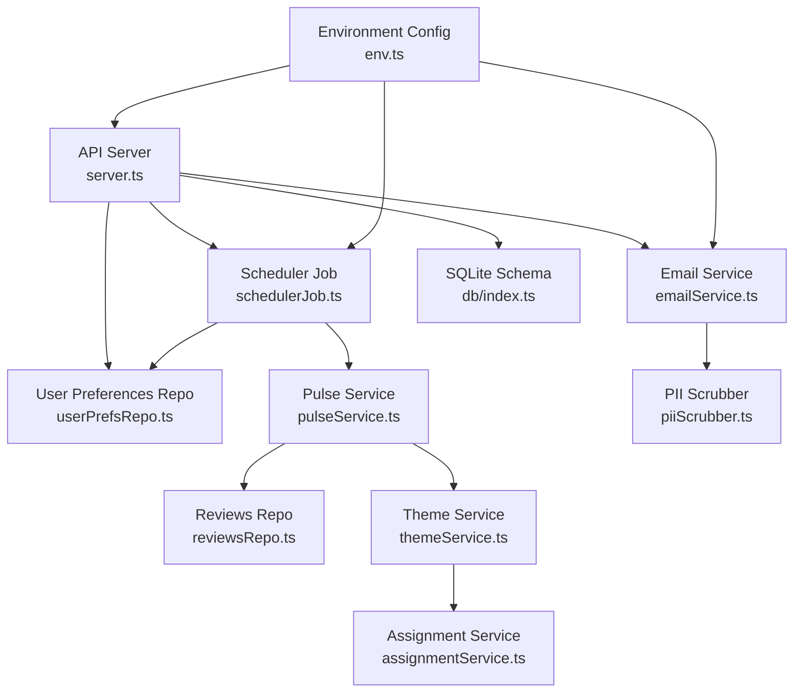
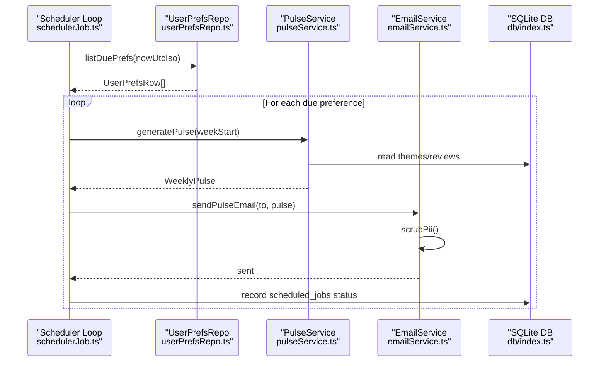
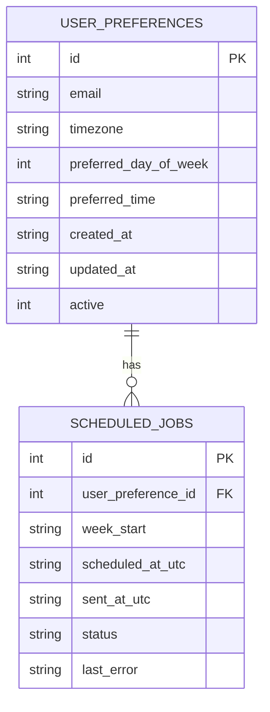
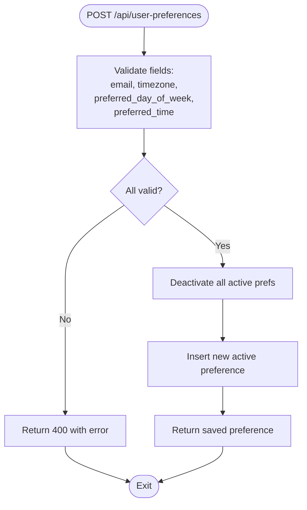
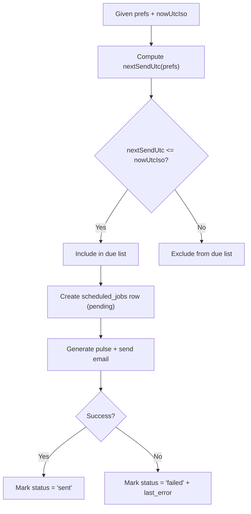
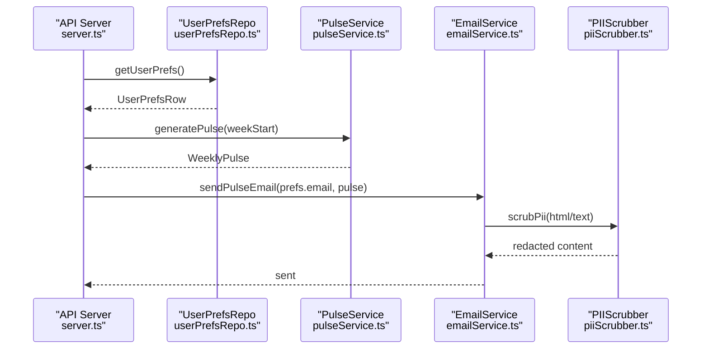
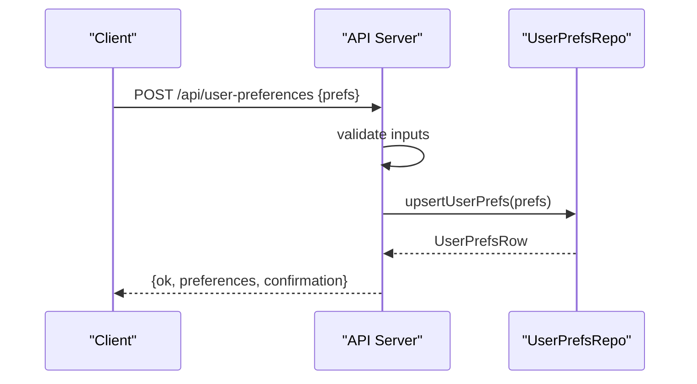
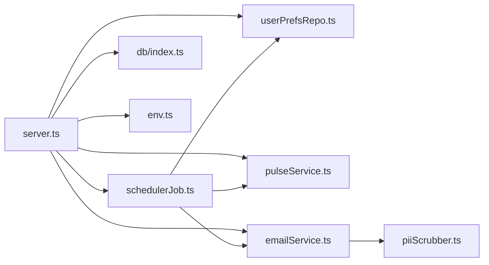

# User Preferences Management

<cite>
**Referenced Files in This Document**
- [userPrefsRepo.ts](file://phase-2/src/services/userPrefsRepo.ts)
- [emailService.ts](file://phase-2/src/services/emailService.ts)
- [schedulerJob.ts](file://phase-2/src/jobs/schedulerJob.ts)
- [server.ts](file://phase-2/src/api/server.ts)
- [index.ts](file://phase-2/src/db/index.ts)
- [env.ts](file://phase-2/src/config/env.ts)
- [userPrefs.test.ts](file://phase-2/src/tests/userPrefs.test.ts)
- [pulseService.ts](file://phase-2/src/services/pulseService.ts)
- [reviewsRepo.ts](file://phase-2/src/services/reviewsRepo.ts)
- [themeService.ts](file://phase-2/src/services/themeService.ts)
- [assignmentService.ts](file://phase-2/src/services/assignmentService.ts)
- [piiScrubber.ts](file://phase-2/src/services/piiScrubber.ts)
- [groqClient.ts](file://phase-2/src/services/groqClient.ts)
</cite>

## Table of Contents
1. [Introduction](#introduction)
2. [Project Structure](#project-structure)
3. [Core Components](#core-components)
4. [Architecture Overview](#architecture-overview)
5. [Detailed Component Analysis](#detailed-component-analysis)
6. [Dependency Analysis](#dependency-analysis)
7. [Performance Considerations](#performance-considerations)
8. [Troubleshooting Guide](#troubleshooting-guide)
9. [Privacy and Consent](#privacy-and-consent)
10. [Preference Migration and Backward Compatibility](#preference-migration-and-backward-compatibility)
11. [Conclusion](#conclusion)

## Introduction
This document describes the user preferences management system responsible for storing user delivery preferences, validating inputs, computing next delivery times, and integrating with the email service for automated, personalized weekly pulse delivery. It also documents the preference API endpoints, validation rules, change tracking, and operational safeguards.

## Project Structure
The user preferences subsystem spans several modules:
- API endpoints for CRUD operations on user preferences
- Repository for preference persistence and scheduling queries
- Scheduler job that evaluates due preferences and triggers email delivery
- Email service for building and sending personalized pulses
- Supporting services for pulse generation, theme assignment, and data access

**Diagram sources**
- [server.ts:1-266](file://phase-2/src/api/server.ts#L1-L266)
- [userPrefsRepo.ts:1-95](file://phase-2/src/services/userPrefsRepo.ts#L1-L95)
- [emailService.ts:1-142](file://phase-2/src/services/emailService.ts#L1-L142)
- [schedulerJob.ts:1-98](file://phase-2/src/jobs/schedulerJob.ts#L1-L98)
- [pulseService.ts:1-265](file://phase-2/src/services/pulseService.ts#L1-L265)
- [reviewsRepo.ts:1-26](file://phase-2/src/services/reviewsRepo.ts#L1-L26)
- [themeService.ts:1-68](file://phase-2/src/services/themeService.ts#L1-L68)
- [assignmentService.ts:1-114](file://phase-2/src/services/assignmentService.ts#L1-L114)
- [index.ts:1-93](file://phase-2/src/db/index.ts#L1-L93)
- [env.ts:1-23](file://phase-2/src/config/env.ts#L1-L23)
- [piiScrubber.ts:1-29](file://phase-2/src/services/piiScrubber.ts#L1-L29)

**Section sources**
- [server.ts:1-266](file://phase-2/src/api/server.ts#L1-L266)
- [index.ts:1-93](file://phase-2/src/db/index.ts#L1-L93)

## Core Components
- Preference storage schema: user_preferences table with id, email, timezone, preferred_day_of_week, preferred_time, timestamps, and active flag.
- Preference repository: upsert, retrieval by id, retrieval of active preferences, next send time computation, and “due” preference listing.
- API endpoints: POST and GET for user preferences, plus email test endpoint.
- Scheduler: identifies due preferences and triggers pulse generation and email delivery.
- Email service: builds HTML/text bodies, scrubs PII, and sends via SMTP.
- Validation: endpoint-level validation for required fields and formats; repository-level deactivation of previous active preferences.

**Section sources**
- [userPrefsRepo.ts:1-95](file://phase-2/src/services/userPrefsRepo.ts#L1-L95)
- [server.ts:159-212](file://phase-2/src/api/server.ts#L159-L212)
- [index.ts:60-70](file://phase-2/src/db/index.ts#L60-L70)

## Architecture Overview
The system orchestrates user preferences with weekly pulse generation and email delivery. The scheduler periodically checks due preferences, generates the pulse for the applicable week, and sends it to the user’s email.

**Diagram sources**
- [schedulerJob.ts:52-84](file://phase-2/src/jobs/schedulerJob.ts#L52-L84)
- [userPrefsRepo.ts:83-94](file://phase-2/src/services/userPrefsRepo.ts#L83-L94)
- [pulseService.ts:179-241](file://phase-2/src/services/pulseService.ts#L179-L241)
- [emailService.ts:114-129](file://phase-2/src/services/emailService.ts#L114-L129)
- [index.ts:73-88](file://phase-2/src/db/index.ts#L73-L88)

## Detailed Component Analysis

### Preference Storage Schema
- Table: user_preferences
  - Columns: id, email, timezone, preferred_day_of_week, preferred_time, created_at, updated_at, active
  - Indexes: primary key on id; active flag supports single active preference per user
- Table: scheduled_jobs
  - Columns: id, user_preference_id, week_start, scheduled_at_utc, sent_at_utc, status, last_error
  - Foreign key: references user_preferences(id)
  - Indexes: composite status/time index for efficient querying

**Diagram sources**
- [index.ts:60-88](file://phase-2/src/db/index.ts#L60-L88)

**Section sources**
- [index.ts:60-88](file://phase-2/src/db/index.ts#L60-L88)

### Preference Validation Rules and Update Mechanisms
- Endpoint validation (POST /api/user-preferences):
  - email: required, must include "@"
  - timezone: required string (e.g., "Asia/Kolkata")
  - preferred_day_of_week: integer 0–6 (Sun–Sat)
  - preferred_time: "HH:MM" 24-hour format
- Upsert behavior:
  - Deactivates all previously active preferences for the user
  - Inserts a new active preference row with current timestamps
- Retrieval:
  - Active preference: latest by updated_at
  - By id: direct lookup

**Diagram sources**
- [server.ts:164-197](file://phase-2/src/api/server.ts#L164-L197)
- [userPrefsRepo.ts:21-43](file://phase-2/src/services/userPrefsRepo.ts#L21-L43)

**Section sources**
- [server.ts:164-197](file://phase-2/src/api/server.ts#L164-L197)
- [userPrefsRepo.ts:21-56](file://phase-2/src/services/userPrefsRepo.ts#L21-L56)

### Change Tracking and Due Preference Evaluation
- Next send time calculation:
  - Uses preferred_time as a UTC-equivalent baseline
  - Advances to the next matching weekday
  - Returns an ISO string suitable for comparison
- Due preference listing:
  - Selects active preferences
  - Filters those whose computed next send time is less than or equal to the current UTC time
- Scheduled job records:
  - Tracks week_start, scheduled_at_utc, and status transitions ("pending", "sent", "failed")

**Diagram sources**
- [userPrefsRepo.ts:62-94](file://phase-2/src/services/userPrefsRepo.ts#L62-L94)
- [schedulerJob.ts:52-84](file://phase-2/src/jobs/schedulerJob.ts#L52-L84)
- [index.ts:73-88](file://phase-2/src/db/index.ts#L73-L88)

**Section sources**
- [userPrefsRepo.ts:62-94](file://phase-2/src/services/userPrefsRepo.ts#L62-L94)
- [schedulerJob.ts:52-84](file://phase-2/src/jobs/schedulerJob.ts#L52-L84)

### Integration with Email Service for Personalized Delivery
- Email building:
  - HTML and text bodies constructed from WeeklyPulse
  - PII scrubbing applied before sending
- SMTP configuration:
  - Host, port, credentials, and sender address loaded from environment
- Delivery:
  - sendPulseEmail(to, pulse) sends to the user’s email
  - sendTestEmail(to) verifies SMTP configuration

**Diagram sources**
- [server.ts:137-154](file://phase-2/src/api/server.ts#L137-L154)
- [userPrefsRepo.ts:50-56](file://phase-2/src/services/userPrefsRepo.ts#L50-L56)
- [pulseService.ts:179-241](file://phase-2/src/services/pulseService.ts#L179-L241)
- [emailService.ts:114-129](file://phase-2/src/services/emailService.ts#L114-L129)
- [piiScrubber.ts:22-28](file://phase-2/src/services/piiScrubber.ts#L22-L28)

**Section sources**
- [emailService.ts:99-141](file://phase-2/src/services/emailService.ts#L99-L141)
- [env.ts:16-21](file://phase-2/src/config/env.ts#L16-L21)

### Preference API Endpoints
- POST /api/user-preferences
  - Body: { email, timezone, preferred_day_of_week, preferred_time }
  - Validation: 400 on invalid inputs
  - Response: saved preference and confirmation message
- GET /api/user-preferences
  - Response: active preference or 404 if none configured
- POST /api/email/test
  - Body: { to }
  - Response: success or error

**Diagram sources**
- [server.ts:164-212](file://phase-2/src/api/server.ts#L164-L212)
- [userPrefsRepo.ts:21-43](file://phase-2/src/services/userPrefsRepo.ts#L21-L43)

**Section sources**
- [server.ts:164-212](file://phase-2/src/api/server.ts#L164-L212)

### Examples of Preference Configurations and Scenarios
- Example configuration:
  - email: "user@example.com"
  - timezone: "Asia/Kolkata"
  - preferred_day_of_week: 1 (Monday)
  - preferred_time: "09:00"
- Subscription scenario:
  - User saves preferences; scheduler detects due preference at the next Monday at 09:00 (converted to user’s timezone context)
  - A weekly pulse is generated for the prior full week and emailed to the user
- Preference update:
  - New preference upsert deactivates the previous active preference and activates the new one

**Section sources**
- [userPrefsRepo.ts:21-43](file://phase-2/src/services/userPrefsRepo.ts#L21-L43)
- [schedulerJob.ts:52-84](file://phase-2/src/jobs/schedulerJob.ts#L52-L84)

## Dependency Analysis
- API depends on:
  - userPrefsRepo for CRUD and due evaluation
  - pulseService for generating weekly pulses
  - emailService for sending emails
  - config/env for SMTP and database settings
- Scheduler depends on:
  - userPrefsRepo for due preferences
  - pulseService for generating pulses
  - emailService for sending emails
  - db for scheduled_jobs records
- EmailService depends on:
  - pulseService types for building content
  - piiScrubber for content sanitization
  - env for SMTP configuration

**Diagram sources**
- [server.ts:1-266](file://phase-2/src/api/server.ts#L1-L266)
- [userPrefsRepo.ts:1-95](file://phase-2/src/services/userPrefsRepo.ts#L1-L95)
- [schedulerJob.ts:1-98](file://phase-2/src/jobs/schedulerJob.ts#L1-L98)
- [emailService.ts:1-142](file://phase-2/src/services/emailService.ts#L1-L142)
- [index.ts:1-93](file://phase-2/src/db/index.ts#L1-L93)
- [env.ts:1-23](file://phase-2/src/config/env.ts#L1-L23)
- [piiScrubber.ts:1-29](file://phase-2/src/services/piiScrubber.ts#L1-L29)

**Section sources**
- [server.ts:1-266](file://phase-2/src/api/server.ts#L1-L266)
- [schedulerJob.ts:1-98](file://phase-2/src/jobs/schedulerJob.ts#L1-L98)

## Performance Considerations
- Upsert pattern:
  - Single active preference enforced via deactivation of all active rows before insertion
  - Efficient due preference filtering by selecting active rows and comparing computed next send time
- Indexing:
  - scheduled_jobs status/time index supports fast lookup of pending jobs
  - user_preferences active flag enables quick retrieval of the latest active preference
- Batch processing:
  - Theme assignment and persistence use batching to manage token usage and throughput
- I/O characteristics:
  - SQLite is embedded; ensure appropriate disk I/O and avoid concurrent heavy writes during scheduler ticks

[No sources needed since this section provides general guidance]

## Troubleshooting Guide
- SMTP errors:
  - Verify SMTP_HOST, SMTP_USER, SMTP_PASS, SMTP_FROM, SMTP_PORT are set
  - Use POST /api/email/test to validate configuration
- Missing preferences:
  - Ensure a valid active preference exists before emailing a pulse; otherwise, provide an explicit email address in the request body
- Scheduler not running:
  - Ensure GROQ_API_KEY is set so the scheduler starts automatically at startup
- Validation failures:
  - Confirm email format, timezone string, preferred_day_of_week range, and preferred_time format

**Section sources**
- [env.ts:16-21](file://phase-2/src/config/env.ts#L16-L21)
- [server.ts:218-232](file://phase-2/src/api/server.ts#L218-L232)
- [server.ts:137-154](file://phase-2/src/api/server.ts#L137-L154)
- [schedulerJob.ts:90-97](file://phase-2/src/jobs/schedulerJob.ts#L90-L97)

## Privacy and Consent
- Data minimization:
  - Only essential fields are stored: email, timezone, preferred weekday, and preferred time
- PII protection:
  - PII scrubber removes emails, phone numbers, URLs, and handles before sending or storing content
- Content safety:
  - LLM prompts explicitly instruct to avoid PII and personal identifiers
- Consent and transparency:
  - Users explicitly provide email and delivery preferences via API
  - Confirmation message reflects the upcoming delivery cadence and recipient

**Section sources**
- [piiScrubber.ts:7-28](file://phase-2/src/services/piiScrubber.ts#L7-L28)
- [pulseService.ts:113-115](file://phase-2/src/services/pulseService.ts#L113-L115)
- [emailService.ts:114-129](file://phase-2/src/services/emailService.ts#L114-L129)
- [server.ts:187-192](file://phase-2/src/api/server.ts#L187-L192)

## Preference Migration and Backward Compatibility
- Current schema:
  - user_preferences table includes id, email, timezone, preferred_day_of_week, preferred_time, timestamps, and active flag
- Migration strategy:
  - Add new columns with defaults if extending the schema
  - Maintain active flag semantics to preserve single active preference per user
  - Keep existing indexes and add new ones as needed
- Backward compatibility:
  - Existing clients rely on the active preference pattern; ensure deactivation logic remains intact
  - If adding optional fields, default them appropriately and handle parsing gracefully
  - Preserve endpoint signatures and response shapes

**Section sources**
- [index.ts:60-70](file://phase-2/src/db/index.ts#L60-L70)
- [userPrefsRepo.ts:21-43](file://phase-2/src/services/userPrefsRepo.ts#L21-L43)

## Conclusion
The user preferences management system provides a robust foundation for storing, validating, and acting upon user delivery preferences. It integrates tightly with the scheduler and email service to deliver personalized weekly pulses while enforcing privacy safeguards and maintaining operational reliability. The design balances simplicity with extensibility, enabling future enhancements such as additional preference dimensions or richer validation rules.