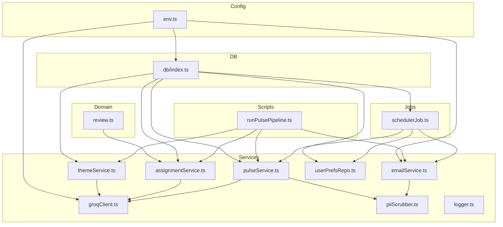
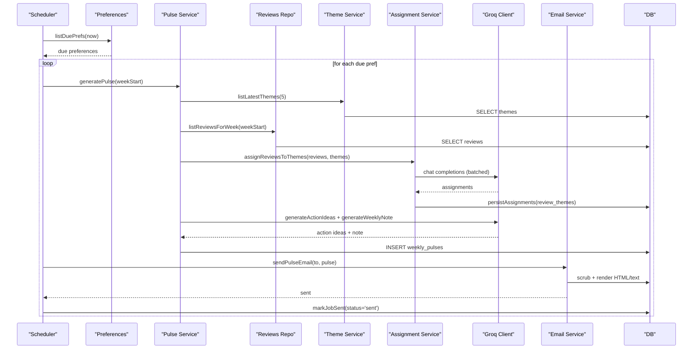
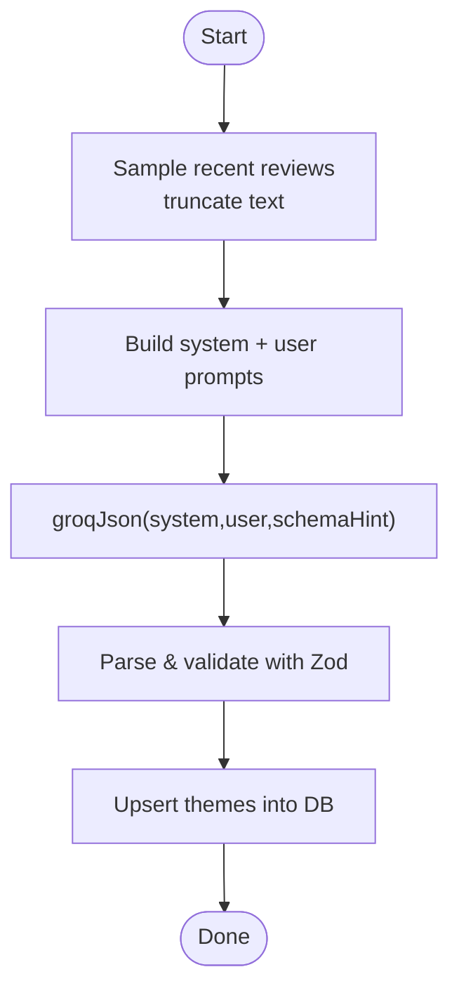
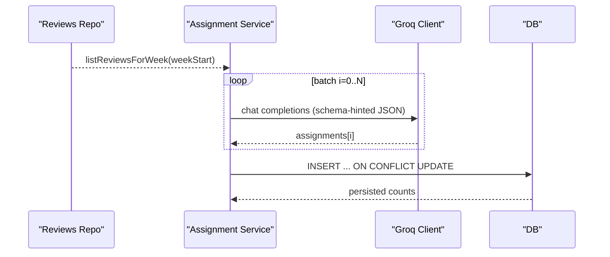
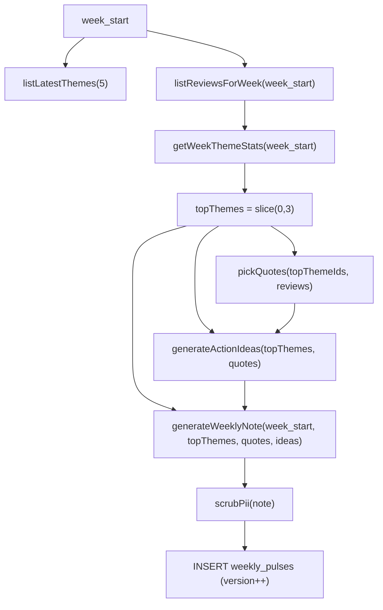
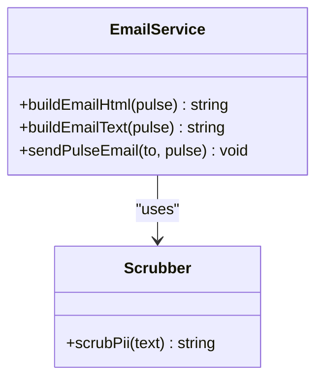
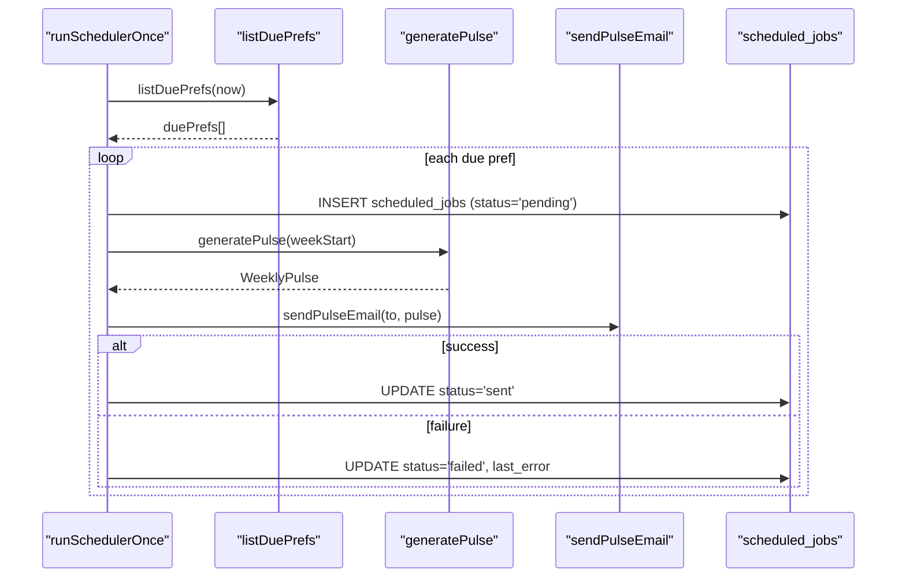
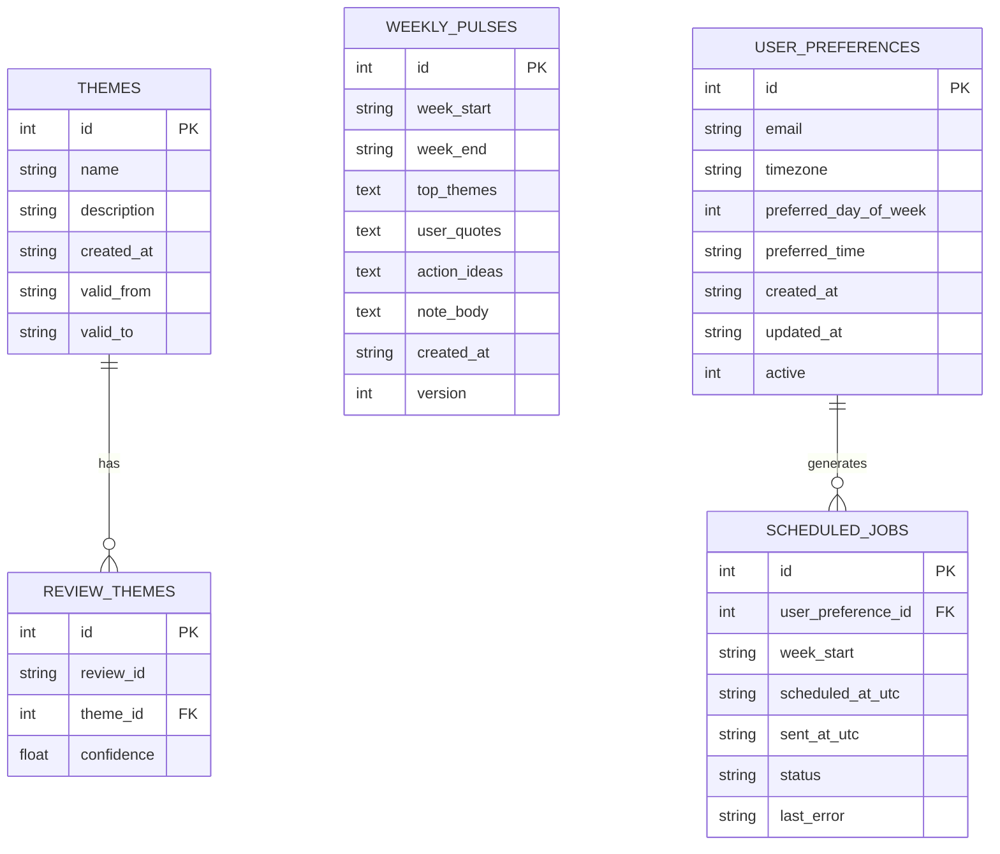
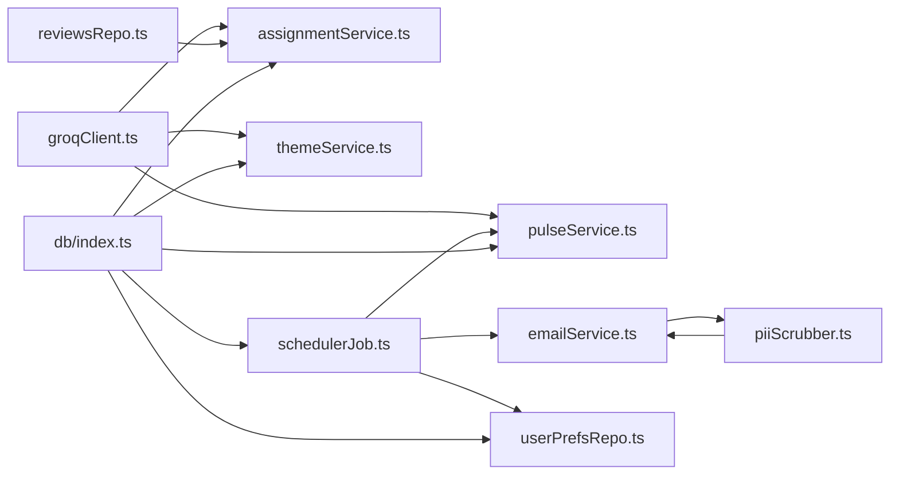

# Weekly Pulse Generation

<cite>
**Referenced Files in This Document**
- [pulseService.ts](file://phase-2/src/services/pulseService.ts)
- [themeService.ts](file://phase-2/src/services/themeService.ts)
- [assignmentService.ts](file://phase-2/src/services/assignmentService.ts)
- [schedulerJob.ts](file://phase-2/src/jobs/schedulerJob.ts)
- [emailService.ts](file://phase-2/src/services/emailService.ts)
- [userPrefsRepo.ts](file://phase-2/src/services/userPrefsRepo.ts)
- [reviewsRepo.ts](file://phase-2/src/services/reviewsRepo.ts)
- [groqClient.ts](file://phase-2/src/services/groqClient.ts)
- [db/index.ts](file://phase-2/src/db/index.ts)
- [env.ts](file://phase-2/src/config/env.ts)
- [runPulsePipeline.ts](file://phase-2/scripts/runPulsePipeline.ts)
- [review.ts](file://phase-2/src/domain/review.ts)
- [piiScrubber.ts](file://phase-2/src/services/piiScrubber.ts)
- [logger.ts](file://phase-2/src/core/logger.ts)
- [pulse.test.ts](file://phase-2/src/tests/pulse.test.ts)
- [assignment.test.ts](file://phase-2/src/tests/assignment.test.ts)
- [email.test.ts](file://phase-2/src/tests/email.test.ts)
</cite>

## Table of Contents
1. [Introduction](#introduction)
2. [Project Structure](#project-structure)
3. [Core Components](#core-components)
4. [Architecture Overview](#architecture-overview)
5. [Detailed Component Analysis](#detailed-component-analysis)
6. [Dependency Analysis](#dependency-analysis)
7. [Performance Considerations](#performance-considerations)
8. [Troubleshooting Guide](#troubleshooting-guide)
9. [Conclusion](#conclusion)
10. [Appendices](#appendices)

## Introduction
This document describes the weekly pulse generation system that transforms raw app store reviews into curated insights. It covers the full lifecycle from assigned themes to aggregated insights and action recommendations, including sentiment-aware aggregation, LLM-powered note generation, robust content formatting (HTML and plain text), validation and quality assurance, performance optimization for weekly batch processing, and delivery tracking. It also provides practical examples, customization tips, and error recovery strategies.

## Project Structure
The weekly pulse system lives in phase-2 and orchestrates several services:
- Theme generation and persistence
- Review-to-theme assignment with batching
- Weekly pulse aggregation and LLM-driven note/action generation
- Email rendering and delivery with PII scrubbing
- Scheduler for automated weekly runs and delivery tracking
- Database schema for themes, assignments, pulses, preferences, and scheduled jobs

**Diagram sources**
- [env.ts:1-23](file://phase-2/src/config/env.ts#L1-L23)
- [review.ts:1-12](file://phase-2/src/domain/review.ts#L1-L12)
- [db/index.ts:1-93](file://phase-2/src/db/index.ts#L1-L93)
- [themeService.ts:1-68](file://phase-2/src/services/themeService.ts#L1-L68)
- [assignmentService.ts:1-114](file://phase-2/src/services/assignmentService.ts#L1-L114)
- [pulseService.ts:1-265](file://phase-2/src/services/pulseService.ts#L1-L265)
- [emailService.ts:1-142](file://phase-2/src/services/emailService.ts#L1-L142)
- [userPrefsRepo.ts:1-95](file://phase-2/src/services/userPrefsRepo.ts#L1-L95)
- [groqClient.ts:1-67](file://phase-2/src/services/groqClient.ts#L1-L67)
- [piiScrubber.ts:1-29](file://phase-2/src/services/piiScrubber.ts#L1-L29)
- [logger.ts:1-21](file://phase-2/src/core/logger.ts#L1-L21)
- [schedulerJob.ts:1-98](file://phase-2/src/jobs/schedulerJob.ts#L1-L98)
- [runPulsePipeline.ts:1-52](file://phase-2/scripts/runPulsePipeline.ts#L1-L52)

**Section sources**
- [env.ts:1-23](file://phase-2/src/config/env.ts#L1-L23)
- [db/index.ts:1-93](file://phase-2/src/db/index.ts#L1-L93)

## Core Components
- Theme service: Generates themes from sampled reviews and persists them.
- Assignment service: Assigns each review to a theme (or “Other”) using LLMs with batching.
- Pulse service: Aggregates top themes, selects representative quotes, generates action ideas and a weekly note via LLMs, and persists the weekly pulse.
- Email service: Renders HTML and plain-text versions and sends via SMTP with PII scrubbing.
- Scheduler job: Computes the last full week, schedules jobs, runs generation, sends emails, and tracks outcomes.
- Preferences repository: Manages user preferences and determines due deliveries.
- Groq client: Provides robust JSON extraction and retries for LLM calls.
- PII scrubber: Final safety pass to remove sensitive data.
- Logger: Centralized logging for observability.

**Section sources**
- [themeService.ts:17-37](file://phase-2/src/services/themeService.ts#L17-L37)
- [assignmentService.ts:27-67](file://phase-2/src/services/assignmentService.ts#L27-L67)
- [pulseService.ts:179-241](file://phase-2/src/services/pulseService.ts#L179-L241)
- [emailService.ts:9-95](file://phase-2/src/services/emailService.ts#L9-L95)
- [schedulerJob.ts:52-84](file://phase-2/src/jobs/schedulerJob.ts#L52-L84)
- [userPrefsRepo.ts:21-56](file://phase-2/src/services/userPrefsRepo.ts#L21-L56)
- [groqClient.ts:30-65](file://phase-2/src/services/groqClient.ts#L30-L65)
- [piiScrubber.ts:22-28](file://phase-2/src/services/piiScrubber.ts#L22-L28)

## Architecture Overview
The system follows a pipeline: data ingestion and preparation (phase-1), theme generation, assignment, weekly pulse creation, and delivery. The scheduler coordinates weekly runs and tracks delivery.

**Diagram sources**
- [schedulerJob.ts:52-84](file://phase-2/src/jobs/schedulerJob.ts#L52-L84)
- [pulseService.ts:179-241](file://phase-2/src/services/pulseService.ts#L179-L241)
- [assignmentService.ts:27-97](file://phase-2/src/services/assignmentService.ts#L27-L97)
- [groqClient.ts:30-65](file://phase-2/src/services/groqClient.ts#L30-L65)
- [emailService.ts:114-129](file://phase-2/src/services/emailService.ts#L114-L129)
- [userPrefsRepo.ts:83-94](file://phase-2/src/services/userPrefsRepo.ts#L83-L94)
- [db/index.ts:41-88](file://phase-2/src/db/index.ts#L41-L88)

## Detailed Component Analysis

### Theme Generation and Persistence
- Sampling: Selects a subset of recent reviews and truncates text for cost control.
- Prompting: Asks the LLM to propose 3–5 themes with concise names and descriptions.
- Validation: Uses Zod schemas to enforce shape and length constraints.
- Upsert: Inserts themes into the themes table with timestamps and windows.

**Diagram sources**
- [themeService.ts:17-37](file://phase-2/src/services/themeService.ts#L17-L37)
- [groqClient.ts:30-65](file://phase-2/src/services/groqClient.ts#L30-L65)

**Section sources**
- [themeService.ts:17-37](file://phase-2/src/services/themeService.ts#L17-L37)
- [themeService.ts:39-56](file://phase-2/src/services/themeService.ts#L39-L56)

### Review-to-Theme Assignment
- Batch processing: Iterates through reviews in fixed-size batches to manage token usage.
- Prompt composition: Includes theme list and a small sample per batch.
- LLM response parsing: Enforces schema and extracts assignments.
- Persistence: Bulk upserts into review_themes with conflict resolution.

**Diagram sources**
- [assignmentService.ts:27-97](file://phase-2/src/services/assignmentService.ts#L27-L97)
- [reviewsRepo.ts:16-24](file://phase-2/src/services/reviewsRepo.ts#L16-L24)
- [groqClient.ts:30-65](file://phase-2/src/services/groqClient.ts#L30-L65)
- [db/index.ts:24-33](file://phase-2/src/db/index.ts#L24-L33)

**Section sources**
- [assignmentService.ts:27-67](file://phase-2/src/services/assignmentService.ts#L27-L67)
- [assignmentService.ts:73-97](file://phase-2/src/services/assignmentService.ts#L73-L97)

### Weekly Pulse Aggregation and Generation
- Top themes: Aggregates per-theme stats for the week and picks top 3.
- Fallback: If no assignments exist, falls back to latest themes with zero counts.
- Representative quotes: Picks up to three distinct, non-empty quotes per top theme.
- Action ideas: Prompts the LLM to produce 3 concise ideas grounded in themes and quotes.
- Weekly note: Generates a scannable note with strict word limits and enforces a retry if exceeded.
- Persistence: Stores the pulse with JSON-serialized arrays and increments version if a prior version exists.

**Diagram sources**
- [pulseService.ts:59-74](file://phase-2/src/services/pulseService.ts#L59-L74)
- [pulseService.ts:79-105](file://phase-2/src/services/pulseService.ts#L79-L105)
- [pulseService.ts:109-132](file://phase-2/src/services/pulseService.ts#L109-L132)
- [pulseService.ts:134-172](file://phase-2/src/services/pulseService.ts#L134-L172)
- [pulseService.ts:179-241](file://phase-2/src/services/pulseService.ts#L179-L241)
- [db/index.ts:41-51](file://phase-2/src/db/index.ts#L41-L51)

**Section sources**
- [pulseService.ts:59-74](file://phase-2/src/services/pulseService.ts#L59-L74)
- [pulseService.ts:79-105](file://phase-2/src/services/pulseService.ts#L79-L105)
- [pulseService.ts:109-172](file://phase-2/src/services/pulseService.ts#L109-L172)
- [pulseService.ts:179-241](file://phase-2/src/services/pulseService.ts#L179-L241)

### Content Formatting and Delivery
- HTML rendering: Builds a responsive HTML email with themed sections and a styled note block.
- Plain text rendering: Produces a structured text version with section headers.
- PII scrubbing: Applies regex-based scrubbing before sending.
- SMTP transport: Sends HTML and text variants with subject including the week start date.

**Diagram sources**
- [emailService.ts:9-95](file://phase-2/src/services/emailService.ts#L9-L95)
- [emailService.ts:114-129](file://phase-2/src/services/emailService.ts#L114-L129)
- [piiScrubber.ts:22-28](file://phase-2/src/services/piiScrubber.ts#L22-L28)

**Section sources**
- [emailService.ts:9-95](file://phase-2/src/services/emailService.ts#L9-L95)
- [emailService.ts:114-129](file://phase-2/src/services/emailService.ts#L114-L129)
- [piiScrubber.ts:22-28](file://phase-2/src/services/piiScrubber.ts#L22-L28)

### Scheduler and Delivery Tracking
- Due preferences: Determines recipients who are due to receive a pulse at or before the current time.
- Job scheduling: Records pending jobs and updates status upon success or failure.
- Execution loop: Runs periodically, generating pulses and sending emails.

**Diagram sources**
- [schedulerJob.ts:52-84](file://phase-2/src/jobs/schedulerJob.ts#L52-L84)
- [userPrefsRepo.ts:83-94](file://phase-2/src/services/userPrefsRepo.ts#L83-L94)
- [db/index.ts:73-83](file://phase-2/src/db/index.ts#L73-L83)

**Section sources**
- [schedulerJob.ts:52-84](file://phase-2/src/jobs/schedulerJob.ts#L52-L84)
- [userPrefsRepo.ts:83-94](file://phase-2/src/services/userPrefsRepo.ts#L83-L94)

### Data Models and Schema

**Diagram sources**
- [db/index.ts:9-88](file://phase-2/src/db/index.ts#L9-L88)

**Section sources**
- [db/index.ts:9-88](file://phase-2/src/db/index.ts#L9-L88)

## Dependency Analysis
- Cohesion: Services encapsulate cohesive responsibilities (theme generation, assignment, pulse creation, email, scheduler).
- Coupling: Minimal cross-service coupling; each service depends on DB and shared clients (Groq, SMTP, config).
- External integrations: Groq for LLMs, Nodemailer for SMTP, better-sqlite3 for persistence.
- Retry and resilience: Groq client retries with increasing temperature; scheduler marks job failures.

**Diagram sources**
- [groqClient.ts:1-67](file://phase-2/src/services/groqClient.ts#L1-L67)
- [pulseService.ts:1-265](file://phase-2/src/services/pulseService.ts#L1-L265)
- [assignmentService.ts:1-114](file://phase-2/src/services/assignmentService.ts#L1-L114)
- [themeService.ts:1-68](file://phase-2/src/services/themeService.ts#L1-L68)
- [emailService.ts:1-142](file://phase-2/src/services/emailService.ts#L1-L142)
- [piiScrubber.ts:1-29](file://phase-2/src/services/piiScrubber.ts#L1-L29)
- [schedulerJob.ts:1-98](file://phase-2/src/jobs/schedulerJob.ts#L1-L98)
- [userPrefsRepo.ts:1-95](file://phase-2/src/services/userPrefsRepo.ts#L1-L95)
- [reviewsRepo.ts:1-26](file://phase-2/src/services/reviewsRepo.ts#L1-L26)
- [db/index.ts:1-93](file://phase-2/src/db/index.ts#L1-L93)

**Section sources**
- [groqClient.ts:1-67](file://phase-2/src/services/groqClient.ts#L1-L67)
- [db/index.ts:1-93](file://phase-2/src/db/index.ts#L1-L93)

## Performance Considerations
- Token budgeting: Assignment batches reduce prompt size and cost.
- Database indexing: Unique indexes on themes and weekly pulses, and indices on review_themes and scheduled_jobs improve lookup performance.
- Retry strategy: Groq client retries with backoff and relaxed temperature to improve JSON extraction reliability.
- Memory management: Streaming or chunked processing could be considered for extremely large datasets; current batching is sufficient for typical weekly loads.
- Concurrency: Scheduler runs sequentially per tick; adjust intervals and consider worker pools if throughput increases.

[No sources needed since this section provides general guidance]

## Troubleshooting Guide
Common issues and resolutions:
- No themes found: Ensure theme generation has run and themes are present in the DB.
- No reviews for week: Verify theme assignment has completed and reviews are tagged with week_start.
- LLM JSON parsing errors: The Groq client retries and extracts JSON from fenced blocks; check API key and model configuration.
- SMTP misconfiguration: Missing SMTP credentials cause immediate errors; configure environment variables.
- Delivery tracking: Inspect scheduled_jobs statuses and last_error for failures.

**Section sources**
- [pulseService.ts:180-188](file://phase-2/src/services/pulseService.ts#L180-L188)
- [groqClient.ts:35-65](file://phase-2/src/services/groqClient.ts#L35-L65)
- [emailService.ts:99-102](file://phase-2/src/services/emailService.ts#L99-L102)
- [schedulerJob.ts:75-80](file://phase-2/src/jobs/schedulerJob.ts#L75-L80)

## Conclusion
The weekly pulse system integrates theme generation, review assignment, sentiment-aware aggregation, and LLM-driven insights into a robust, observable pipeline. It ensures data safety via PII scrubbing, enforces quality through schema validation and word limits, and automates delivery with delivery tracking. The modular design supports customization and future enhancements.

[No sources needed since this section summarizes without analyzing specific files]

## Appendices

### Example Scenarios
- New theme cycle: Generate themes from recent reviews, upsert, then assign and generate the pulse for the week’s reviews.
- Empty week handling: If no assignments exist, the system falls back to latest themes with zero counts.
- Template customization: Modify the HTML template in the email builder to change styles or layout while preserving sections.
- Personalization: Use user preferences to tailor send times and days; the scheduler computes next send times accordingly.

**Section sources**
- [runPulsePipeline.ts:14-49](file://phase-2/scripts/runPulsePipeline.ts#L14-L49)
- [pulseService.ts:200-211](file://phase-2/src/services/pulseService.ts#L200-L211)
- [emailService.ts:9-62](file://phase-2/src/services/emailService.ts#L9-L62)
- [userPrefsRepo.ts:62-77](file://phase-2/src/services/userPrefsRepo.ts#L62-L77)

### Validation and Quality Assurance
- Shape validation: Zod schemas enforce field presence and lengths for themes, assignments, and outputs.
- Word count enforcement: The weekly note generator validates and retries to meet strict word limits.
- PII scrubbing: Regex-based scrubbing is applied before storage and delivery.
- Testing: Unit tests cover PII redaction, word counting, email content, and assignment persistence.

**Section sources**
- [pulseService.ts:42-48](file://phase-2/src/services/pulseService.ts#L42-L48)
- [assignmentService.ts:8-17](file://phase-2/src/services/assignmentService.ts#L8-L17)
- [pulse.test.ts:17-45](file://phase-2/src/tests/pulse.test.ts#L17-L45)
- [pulse.test.ts:49-85](file://phase-2/src/tests/pulse.test.ts#L49-L85)
- [email.test.ts:38-72](file://phase-2/src/tests/email.test.ts#L38-L72)
- [assignment.test.ts:57-92](file://phase-2/src/tests/assignment.test.ts#L57-L92)

### Environment and Configuration
- Database file path defaults to the phase-1 DB by default.
- Groq API key and model are required for LLM features.
- SMTP settings are required for email delivery.

**Section sources**
- [env.ts:9-21](file://phase-2/src/config/env.ts#L9-L21)