# Weekly Pulse Generation

<cite>
**Referenced Files in This Document**
- [pulseService.ts](file://phase-2/src/services/pulseService.ts)
- [themeService.ts](file://phase-2/src/services/themeService.ts)
- [assignmentService.ts](file://phase-2/src/services/assignmentService.ts)
- [schedulerJob.ts](file://phase-2/src/jobs/schedulerJob.ts)
- [emailService.ts](file://phase-2/src/services/emailService.ts)
- [userPrefsRepo.ts](file://phase-2/src/services/userPrefsRepo.ts)
- [reviewsRepo.ts](file://phase-2/src/services/reviewsRepo.ts)
- [groqClient.ts](file://phase-2/src/services/groqClient.ts)
- [dbAdapter.ts](file://phase-2/src/db/dbAdapter.ts)
- [postgres.ts](file://phase-2/src/db/postgres.ts)
- [db/index.ts](file://phase-2/src/db/index.ts)
- [env.ts](file://phase-2/src/config/env.ts)
- [runPulsePipeline.ts](file://phase-2/scripts/runPulsePipeline.ts)
- [review.ts](file://phase-2/src/domain/review.ts)
- [piiScrubber.ts](file://phase-2/src/services/piiScrubber.ts)
- [logger.ts](file://phase-2/src/core/logger.ts)
- [pulse.test.ts](file://phase-2/src/tests/pulse.test.ts)
- [assignment.test.ts](file://phase-2/src/tests/assignment.test.ts)
- [email.test.ts](file://phase-2/src/tests/email.test.ts)
- [cleanupDuplicateThemes.ts](file://phase-2/scripts/cleanupDuplicateThemes.ts)
- [migrateToPostgres.ts](file://phase-2/scripts/migrateToPostgres.ts)
</cite>

## Update Summary
**Changes Made**
- Migrated all database operations to PostgreSQL using a unified adapter pattern
- Converted getWeekThemeStats, pickQuotes, and generatePulse functions to use async/await with proper transaction handling
- Implemented PostgreSQL connection pooling with SSL configuration for production environments
- Added comprehensive schema initialization and migration utilities
- Enhanced database abstraction layer with transaction support for both SQLite and PostgreSQL
- Updated all service functions to work seamlessly with the new database backend

## Table of Contents
1. [Introduction](#introduction)
2. [Project Structure](#project-structure)
3. [Core Components](#core-components)
4. [Architecture Overview](#architecture-overview)
5. [Detailed Component Analysis](#detailed-component-analysis)
6. [Database Migration and Connectivity](#database-migration-and-connectivity)
7. [Dependency Analysis](#dependency-analysis)
8. [Performance Considerations](#performance-considerations)
9. [Troubleshooting Guide](#troubleshooting-guide)
10. [Conclusion](#conclusion)
11. [Appendices](#appendices)

## Introduction
This document describes the sophisticated weekly pulse generation system that transforms raw app store reviews into curated, actionable insights. The system orchestrates a comprehensive weekly insights pipeline that combines theme analysis with user feedback to generate actionable recommendations. It covers the complete lifecycle from assigned themes to aggregated insights, including sentiment-aware aggregation, LLM-powered note generation, robust content formatting (HTML and plain text), validation and quality assurance, performance optimization for weekly batch processing, and delivery tracking. The system provides practical examples, customization options, and comprehensive error recovery strategies.

**Updated** Enhanced with PostgreSQL connectivity and unified database adapter pattern that supports both SQLite and PostgreSQL backends with seamless migration capabilities.

## Project Structure
The weekly pulse system resides in phase-2 and orchestrates multiple sophisticated services with PostgreSQL connectivity:
- Advanced theme generation and persistence with configurable windows and deduplication
- Intelligent review-to-theme assignment with batching and confidence scoring
- Sophisticated weekly pulse aggregation with sentiment analysis, recommendation generation, and unique theme selection
- Enhanced email rendering with PII scrubbing and dual-format delivery
- Automated scheduler with delivery tracking and retry mechanisms
- Unified database adapter supporting both SQLite and PostgreSQL backends
- Comprehensive PostgreSQL schema with connection pooling and SSL configuration
- Theme cleanup utilities for maintaining data integrity

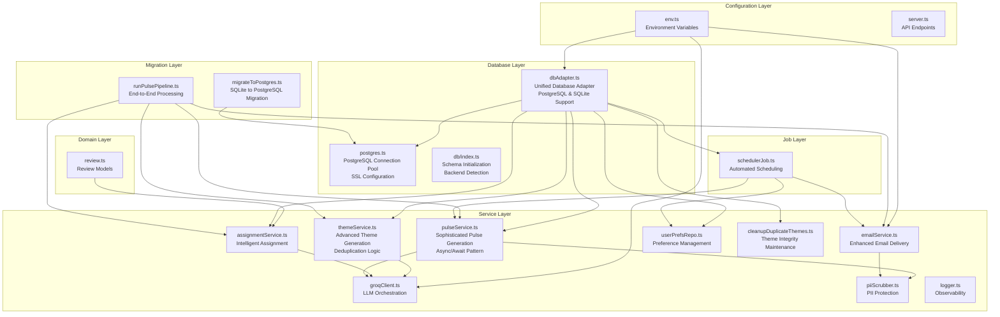

**Diagram sources**
- [env.ts:1-23](file://phase-2/src/config/env.ts#L1-L23)
- [review.ts:1-12](file://phase-2/src/domain/review.ts#L1-L12)
- [dbAdapter.ts:1-178](file://phase-2/src/db/dbAdapter.ts#L1-L178)
- [postgres.ts:1-143](file://phase-2/src/db/postgres.ts#L1-L143)
- [db/index.ts:1-133](file://phase-2/src/db/index.ts#L1-L133)
- [themeService.ts:1-78](file://phase-2/src/services/themeService.ts#L1-L78)
- [assignmentService.ts:1-114](file://phase-2/src/services/assignmentService.ts#L1-L114)
- [pulseService.ts:1-270](file://phase-2/src/services/pulseService.ts#L1-L270)
- [emailService.ts:1-142](file://phase-2/src/services/emailService.ts#L1-L142)
- [userPrefsRepo.ts:1-95](file://phase-2/src/services/userPrefsRepo.ts#L1-L95)
- [groqClient.ts:1-67](file://phase-2/src/services/groqClient.ts#L1-L67)
- [piiScrubber.ts:1-29](file://phase-2/src/services/piiScrubber.ts#L1-L29)
- [logger.ts:1-21](file://phase-2/src/core/logger.ts#L1-L21)
- [schedulerJob.ts:1-99](file://phase-2/src/jobs/schedulerJob.ts#L1-L99)
- [runPulsePipeline.ts:1-52](file://phase-2/scripts/runPulsePipeline.ts#L1-L52)
- [cleanupDuplicateThemes.ts:1-59](file://phase-2/scripts/cleanupDuplicateThemes.ts#L1-L59)
- [migrateToPostgres.ts:1-111](file://phase-2/scripts/migrateToPostgres.ts#L1-L111)

**Section sources**
- [env.ts:1-23](file://phase-2/src/config/env.ts#L1-L23)
- [db/index.ts:1-133](file://phase-2/src/db/index.ts#L1-L133)

## Core Components
- **Advanced Theme Service**: Generates sophisticated themes from sampled reviews with configurable validity windows, using LLMs with strict schema validation and cost-controlled text sampling. **Enhanced with case-insensitive deduplication to ensure unique theme names**.
- **Intelligent Assignment Service**: Performs batched review-to-theme assignment with confidence scoring, supporting "Other" category fallback and bulk persistence with conflict resolution
- **Sophisticated Pulse Service**: Orchestrates comprehensive weekly pulse generation with sentiment-aware aggregation, representative quote selection, LLM-powered action recommendations, strict quality controls, and **unique theme selection logic to prevent duplicate theme names**
- **Enhanced Email Service**: Renders responsive HTML and plain-text emails with comprehensive PII scrubbing, dual-format delivery, and subject line customization
- **Automated Scheduler**: Manages weekly pulse generation with due preference detection, job scheduling, retry mechanisms, and comprehensive delivery tracking
- **Preference Management**: Handles user preferences with timezone support, preferred send times, and active preference maintenance
- **LLM Orchestration**: Provides robust JSON extraction, retry mechanisms, and schema enforcement for all AI-powered operations
- **Data Protection**: Implements comprehensive PII scrubbing across all user-facing content
- **Observability**: Centralized logging for monitoring and debugging all system operations
- **Theme Cleanup Utilities**: **New component for maintaining theme data integrity through duplicate detection and removal**
- **Unified Database Adapter**: **New component providing seamless abstraction between SQLite and PostgreSQL backends with automatic placeholder conversion and transaction support**
- **PostgreSQL Connection Pool**: **New component managing connection pooling, SSL configuration, and schema initialization for production deployments**

**Section sources**
- [themeService.ts:17-37](file://phase-2/src/services/themeService.ts#L17-L37)
- [assignmentService.ts:27-67](file://phase-2/src/services/assignmentService.ts#L27-L67)
- [pulseService.ts:179-241](file://phase-2/src/services/pulseService.ts#L179-L241)
- [emailService.ts:9-95](file://phase-2/src/services/emailService.ts#L9-L95)
- [schedulerJob.ts:52-84](file://phase-2/src/jobs/schedulerJob.ts#L52-L84)
- [userPrefsRepo.ts:21-56](file://phase-2/src/services/userPrefsRepo.ts#L21-L56)
- [groqClient.ts:30-65](file://phase-2/src/services/groqClient.ts#L30-L65)
- [piiScrubber.ts:22-28](file://phase-2/src/services/piiScrubber.ts#L22-L28)
- [cleanupDuplicateThemes.ts:1-59](file://phase-2/scripts/cleanupDuplicateThemes.ts#L1-L59)
- [dbAdapter.ts:13-178](file://phase-2/src/db/dbAdapter.ts#L13-L178)
- [postgres.ts:1-143](file://phase-2/src/db/postgres.ts#L1-L143)

## Architecture Overview
The system implements a sophisticated pipeline architecture that processes app store reviews through multiple stages of analysis and transformation. The pipeline follows a structured workflow: data ingestion and preparation, theme generation, intelligent assignment, comprehensive pulse creation with unique theme selection, and automated delivery with tracking. **The architecture now supports both SQLite and PostgreSQL backends through a unified adapter pattern with automatic migration capabilities**.

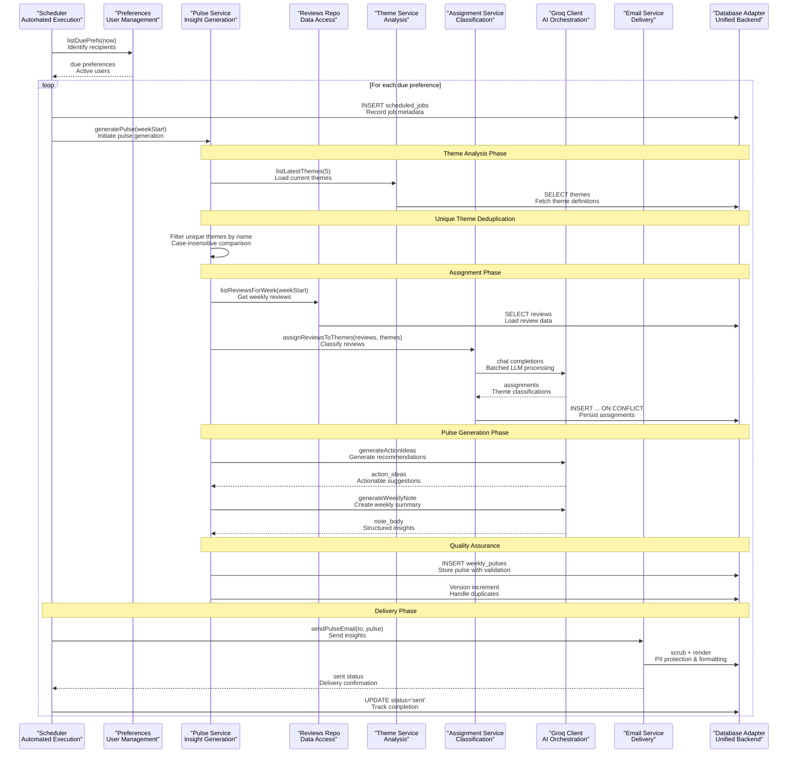

**Diagram sources**
- [schedulerJob.ts:52-84](file://phase-2/src/jobs/schedulerJob.ts#L52-L84)
- [pulseService.ts:179-241](file://phase-2/src/services/pulseService.ts#L179-L241)
- [assignmentService.ts:27-97](file://phase-2/src/services/assignmentService.ts#L27-L97)
- [groqClient.ts:30-65](file://phase-2/src/services/groqClient.ts#L30-L65)
- [emailService.ts:114-129](file://phase-2/src/services/emailService.ts#L114-L129)
- [userPrefsRepo.ts:83-94](file://phase-2/src/services/userPrefsRepo.ts#L83-L94)
- [dbAdapter.ts:28-52](file://phase-2/src/db/dbAdapter.ts#L28-L52)

## Detailed Component Analysis

### Advanced Theme Generation and Persistence
The theme generation system implements sophisticated analysis capabilities with configurable validity windows and strict quality controls. The system samples recent reviews, truncates text for cost optimization, and leverages LLMs to propose 3-5 themes with concise names and descriptions. **Enhanced with case-insensitive deduplication to ensure unique theme names**.

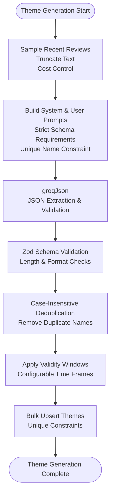

**Diagram sources**
- [themeService.ts:17-37](file://phase-2/src/services/themeService.ts#L17-L37)
- [themeService.ts:39-48](file://phase-2/src/services/themeService.ts#L39-L48)
- [groqClient.ts:30-65](file://phase-2/src/services/groqClient.ts#L30-L65)

**Section sources**
- [themeService.ts:17-37](file://phase-2/src/services/themeService.ts#L17-L37)
- [themeService.ts:39-48](file://phase-2/src/services/themeService.ts#L39-L48)

### Intelligent Review-to-Theme Assignment
The assignment system implements advanced batch processing with confidence scoring and intelligent fallback mechanisms. Reviews are processed in controlled batches to manage token usage while maintaining accuracy through schema enforcement and conflict resolution.

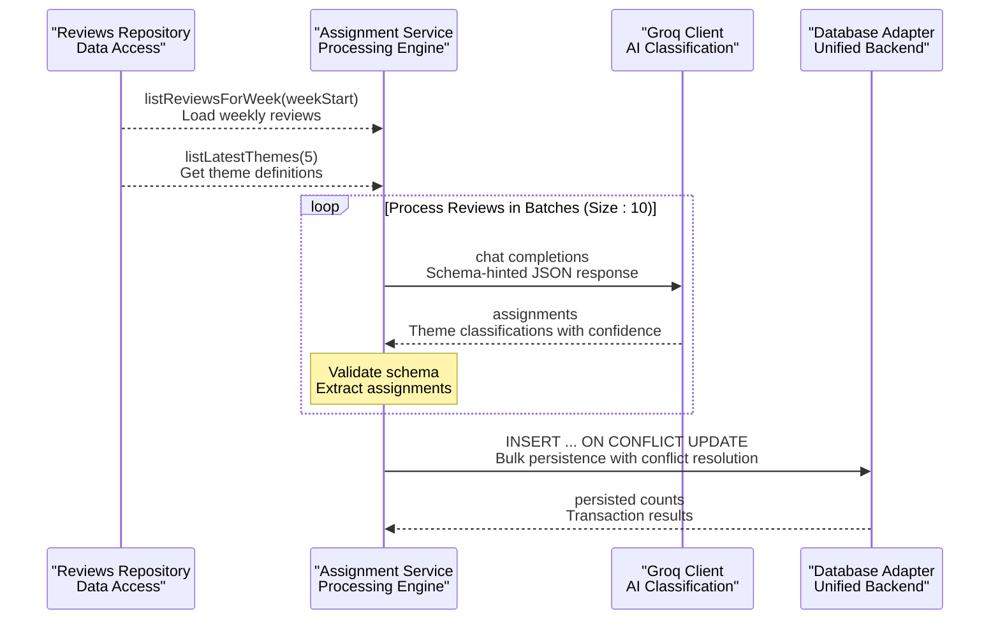

**Diagram sources**
- [assignmentService.ts:27-97](file://phase-2/src/services/assignmentService.ts#L27-L97)
- [reviewsRepo.ts:16-24](file://phase-2/src/services/reviewsRepo.ts#L16-L24)
- [groqClient.ts:30-65](file://phase-2/src/services/groqClient.ts#L30-L65)
- [dbAdapter.ts:28-52](file://phase-2/src/db/dbAdapter.ts#L28-L52)

**Section sources**
- [assignmentService.ts:27-67](file://phase-2/src/services/assignmentService.ts#L27-L67)
- [assignmentService.ts:73-97](file://phase-2/src/services/assignmentService.ts#L73-L97)

### Sophisticated Weekly Pulse Aggregation and Generation
The pulse generation system implements comprehensive aggregation with sentiment-aware analysis, representative quote selection, and LLM-powered recommendation generation. **Enhanced with unique theme selection logic to prevent duplicate theme names and improved fallback mechanisms**.

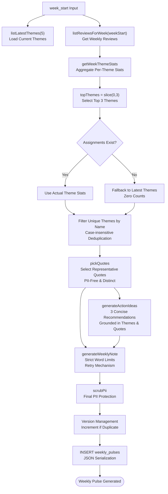

**Diagram sources**
- [pulseService.ts:59-74](file://phase-2/src/services/pulseService.ts#L59-L74)
- [pulseService.ts:79-105](file://phase-2/src/services/pulseService.ts#L79-L105)
- [pulseService.ts:109-132](file://phase-2/src/services/pulseService.ts#L109-L132)
- [pulseService.ts:134-172](file://phase-2/src/services/pulseService.ts#L134-L172)
- [pulseService.ts:179-241](file://phase-2/src/services/pulseService.ts#L179-L241)
- [pulseService.ts:200-215](file://phase-2/src/services/pulseService.ts#L200-L215)
- [dbAdapter.ts:28-52](file://phase-2/src/db/dbAdapter.ts#L28-L52)

**Section sources**
- [pulseService.ts:59-74](file://phase-2/src/services/pulseService.ts#L59-L74)
- [pulseService.ts:79-105](file://phase-2/src/services/pulseService.ts#L79-L105)
- [pulseService.ts:109-172](file://phase-2/src/services/pulseService.ts#L109-L172)
- [pulseService.ts:179-241](file://phase-2/src/services/pulseService.ts#L179-L241)
- [pulseService.ts:200-215](file://phase-2/src/services/pulseService.ts#L200-L215)

### Enhanced Content Formatting and Delivery
The email system provides comprehensive dual-format delivery with sophisticated HTML rendering and plain-text alternatives. The system implements robust PII scrubbing and responsive design for optimal user experience.

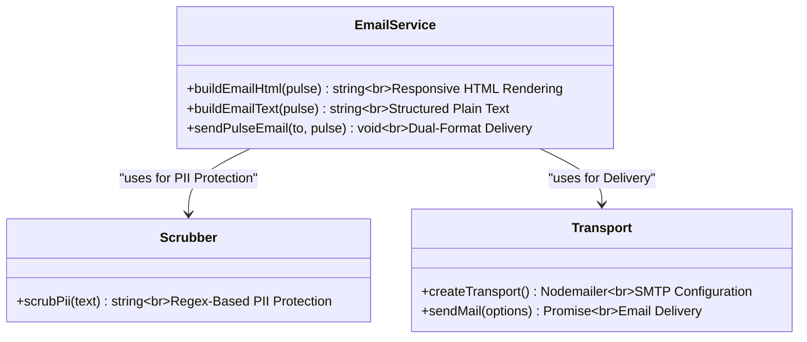

**Diagram sources**
- [emailService.ts:9-95](file://phase-2/src/services/emailService.ts#L9-L95)
- [emailService.ts:114-129](file://phase-2/src/services/emailService.ts#L114-L129)
- [piiScrubber.ts:22-28](file://phase-2/src/services/piiScrubber.ts#L22-L28)

**Section sources**
- [emailService.ts:9-95](file://phase-2/src/services/emailService.ts#L9-L95)
- [emailService.ts:114-129](file://phase-2/src/services/emailService.ts#L114-L129)
- [piiScrubber.ts:22-28](file://phase-2/src/services/piiScrubber.ts#L22-L28)

### Automated Scheduler and Delivery Tracking
The scheduler implements sophisticated automation with due preference detection, job scheduling, and comprehensive tracking. The system handles failures gracefully and maintains audit trails for all operations.

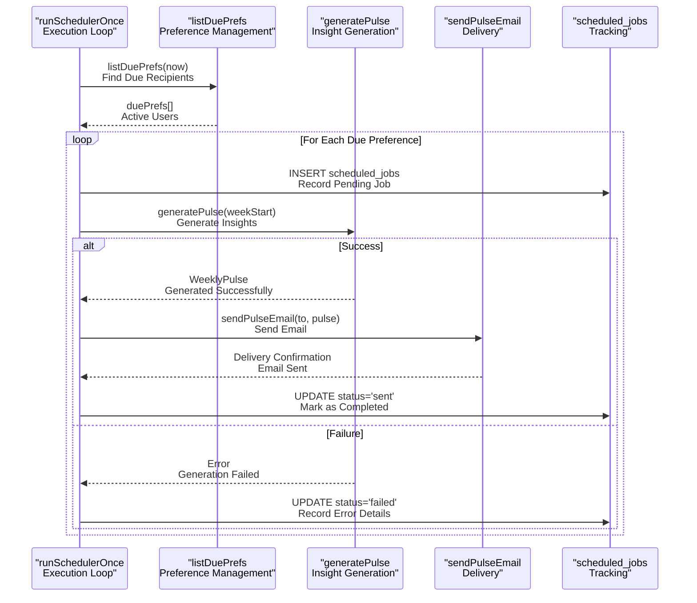

**Diagram sources**
- [schedulerJob.ts:52-84](file://phase-2/src/jobs/schedulerJob.ts#L52-L84)
- [userPrefsRepo.ts:83-94](file://phase-2/src/services/userPrefsRepo.ts#L83-L94)
- [dbAdapter.ts:28-52](file://phase-2/src/db/dbAdapter.ts#L28-L52)

**Section sources**
- [schedulerJob.ts:52-84](file://phase-2/src/jobs/schedulerJob.ts#L52-L84)
- [userPrefsRepo.ts:83-94](file://phase-2/src/services/userPrefsRepo.ts#L83-L94)

### Theme Integrity Maintenance
**New Component**: The theme cleanup utility provides automated maintenance of theme data integrity by detecting and removing duplicate theme names while preserving the most recent versions.

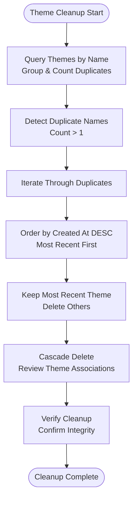

**Diagram sources**
- [cleanupDuplicateThemes.ts:7-59](file://phase-2/scripts/cleanupDuplicateThemes.ts#L7-L59)

**Section sources**
- [cleanupDuplicateThemes.ts:1-59](file://phase-2/scripts/cleanupDuplicateThemes.ts#L1-L59)

### Data Models and Schema
The system implements a comprehensive database schema designed for scalability and performance. The schema supports complex relationships while maintaining data integrity and enabling efficient querying.

```mermaid
erDiagram
THEMES {
int id PK
string name
string description
string created_at
string valid_from
string valid_to
}
REVIEW_THEMES {
int id PK
string review_id
int theme_id FK
float confidence
UNIQUE(review_id, theme_id)
}
WEEKLY_PULSES {
int id PK
string week_start
string week_end
text top_themes
text user_quotes
text action_ideas
text note_body
string created_at
int version
UNIQUE(week_start, version)
}
USER_PREFERENCES {
int id PK
string email
string timezone
int preferred_day_of_week
string preferred_time
string created_at
string updated_at
int active
}
SCHEDULED_JOBS {
int id PK
int user_preference_id FK
string week_start
string scheduled_at_utc
string sent_at_utc
string status
string last_error
}
THEMES ||--o{ REVIEW_THEMES : "defines"
REVIEW_THEMES ||--o{ WEEKLY_PULSES : "categorizes"
USER_PREFERENCES ||--o{ SCHEDULED_JOBS : "generates"
```

**Diagram sources**
- [db/index.ts:9-133](file://phase-2/src/db/index.ts#L9-L133)

**Section sources**
- [db/index.ts:9-133](file://phase-2/src/db/index.ts#L9-L133)

## Database Migration and Connectivity

### Unified Database Adapter Pattern
**New Component**: The database adapter provides a seamless abstraction layer that supports both SQLite and PostgreSQL backends with automatic placeholder conversion and transaction handling.

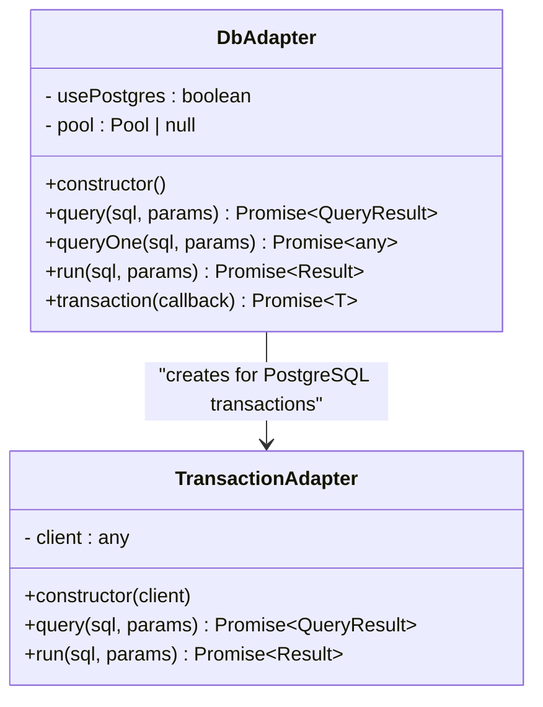

**Key Features**:
- Automatic backend detection via DATABASE_URL environment variable
- Placeholder conversion from SQLite (?) to PostgreSQL ($1, $2, etc.)
- Transaction support for both backends with rollback capabilities
- Consistent API across different database engines
- Connection pooling for PostgreSQL with SSL configuration

**Diagram sources**
- [dbAdapter.ts:13-178](file://phase-2/src/db/dbAdapter.ts#L13-L178)

### PostgreSQL Connection Management
**New Component**: The PostgreSQL connection manager handles pool initialization, SSL configuration, and schema management for production deployments.

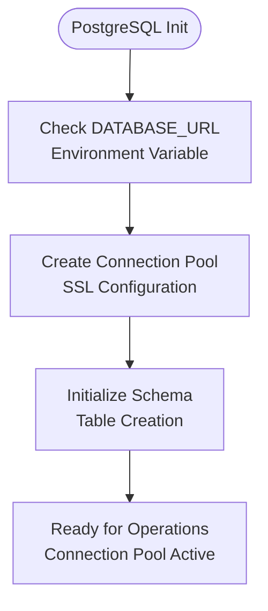

**Diagram sources**
- [postgres.ts:6-25](file://phase-2/src/db/postgres.ts#L6-L25)
- [postgres.ts:27-135](file://phase-2/src/db/postgres.ts#L27-L135)

**Section sources**
- [dbAdapter.ts:13-178](file://phase-2/src/db/dbAdapter.ts#L13-L178)
- [postgres.ts:1-143](file://phase-2/src/db/postgres.ts#L1-L143)

### SQLite to PostgreSQL Migration
**New Component**: The migration utility provides automated data transfer from SQLite to PostgreSQL with conflict resolution and schema preservation.

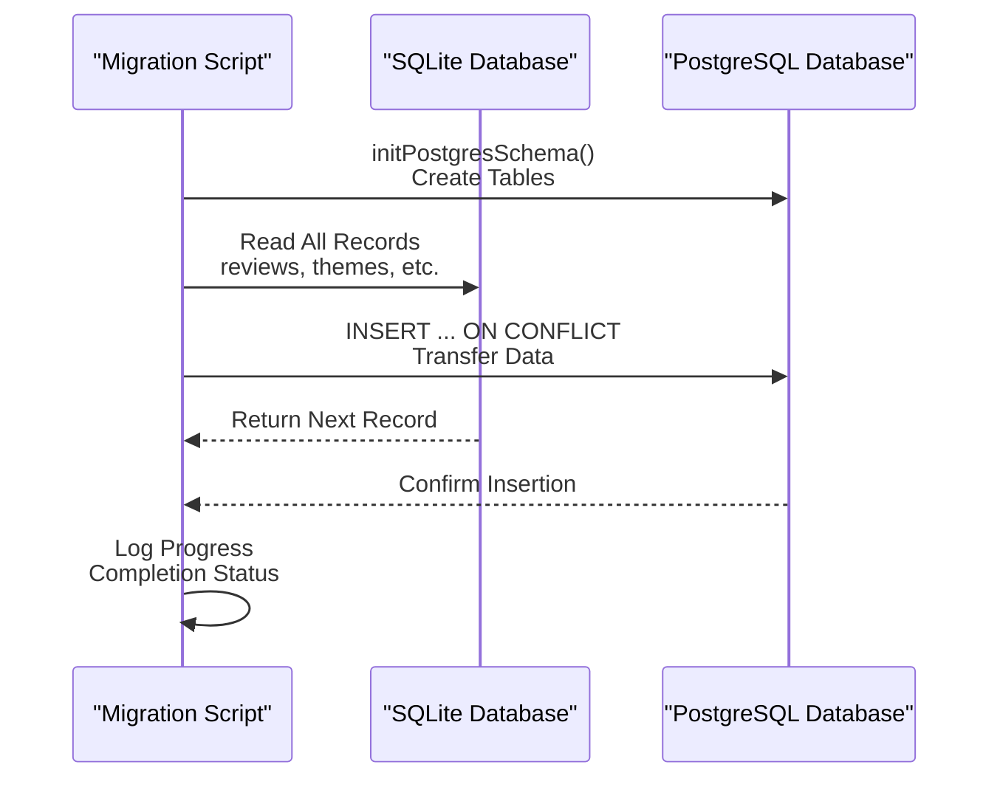

**Diagram sources**
- [migrateToPostgres.ts:5-111](file://phase-2/scripts/migrateToPostgres.ts#L5-L111)

**Section sources**
- [migrateToPostgres.ts:1-111](file://phase-2/scripts/migrateToPostgres.ts#L1-L111)

## Dependency Analysis
The system demonstrates excellent architectural principles with strong cohesion and minimal coupling. Dependencies are carefully managed to ensure maintainability and testability.

- **Cohesion**: Each service encapsulates specific responsibilities with clear boundaries and focused functionality
- **Coupling**: Minimal cross-service dependencies with standardized interfaces and shared clients
- **External Integrations**: Robust integration with Groq for LLM capabilities, Nodemailer for email delivery, and PostgreSQL for data persistence
- **Resilience**: Comprehensive retry mechanisms, error handling, and graceful degradation strategies
- **Data Integrity**: **Enhanced with theme cleanup utilities, deduplication logic, and unified database adapter for consistent data quality**
- **Backend Flexibility**: **New unified adapter pattern supports seamless migration between SQLite and PostgreSQL**

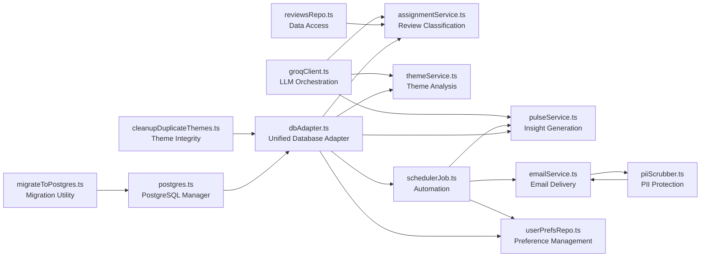

**Diagram sources**
- [groqClient.ts:1-67](file://phase-2/src/services/groqClient.ts#L1-L67)
- [pulseService.ts:1-270](file://phase-2/src/services/pulseService.ts#L1-L270)
- [assignmentService.ts:1-114](file://phase-2/src/services/assignmentService.ts#L1-L114)
- [themeService.ts:1-78](file://phase-2/src/services/themeService.ts#L1-L78)
- [emailService.ts:1-142](file://phase-2/src/services/emailService.ts#L1-L142)
- [piiScrubber.ts:1-29](file://phase-2/src/services/piiScrubber.ts#L1-L29)
- [schedulerJob.ts:1-99](file://phase-2/src/jobs/schedulerJob.ts#L1-L99)
- [userPrefsRepo.ts:1-95](file://phase-2/src/services/userPrefsRepo.ts#L1-L95)
- [reviewsRepo.ts:1-26](file://phase-2/src/services/reviewsRepo.ts#L1-L26)
- [dbAdapter.ts:1-178](file://phase-2/src/db/dbAdapter.ts#L1-L178)
- [postgres.ts:1-143](file://phase-2/src/db/postgres.ts#L1-L143)
- [cleanupDuplicateThemes.ts:1-59](file://phase-2/scripts/cleanupDuplicateThemes.ts#L1-L59)
- [migrateToPostgres.ts:1-111](file://phase-2/scripts/migrateToPostgres.ts#L1-L111)

**Section sources**
- [groqClient.ts:1-67](file://phase-2/src/services/groqClient.ts#L1-L67)
- [dbAdapter.ts:1-178](file://phase-2/src/db/dbAdapter.ts#L1-L178)
- [postgres.ts:1-143](file://phase-2/src/db/postgres.ts#L1-L143)

## Performance Considerations
The system implements comprehensive performance optimizations designed for weekly batch processing scenarios:

- **Token Budgeting**: Strategic batch processing with 10-review batches reduces prompt size and optimizes LLM costs while maintaining accuracy
- **Database Optimization**: Carefully designed indexes on themes, review_themes, weekly_pulses, and scheduled_jobs enable fast lookups and aggregations
- **Memory Management**: Efficient streaming and chunked processing prevent memory bloat during large-scale operations
- **Retry Strategy**: Progressive backoff with increasing temperature improves JSON extraction reliability and reduces API failures
- **Concurrency Control**: Sequential processing per scheduler tick prevents resource contention while allowing for horizontal scaling
- **Caching Strategy**: Theme caching and review batching minimize redundant database queries and LLM calls
- **Deduplication Efficiency**: **Case-insensitive deduplication uses Set-based lookups for O(n) performance in theme name filtering**
- **Connection Pooling**: **PostgreSQL connection pooling with SSL configuration optimizes database connections for production deployments**
- **Placeholder Conversion**: **Automatic SQL placeholder conversion eliminates backend-specific query differences and improves maintainability**

## Troubleshooting Guide
Comprehensive troubleshooting guidance for common operational issues:

**Theme Generation Issues**
- No themes found: Verify theme generation has completed successfully and themes exist in the database with proper validity windows
- Generation failures: Check Groq API key configuration, model availability, and network connectivity
- Schema validation errors: Review theme name and description constraints in the Zod schemas
- **Duplicate theme names**: Use the cleanup utility script to remove duplicate themes while preserving the most recent versions

**Assignment Processing Problems**
- Empty assignment results: Ensure reviews are properly loaded for the target week and themes have been generated
- LLM parsing errors: Monitor API quotas, retry mechanisms, and schema hint effectiveness
- Batch processing failures: Verify database connectivity and transaction integrity

**Pulse Generation Failures**
- Missing assignments: Confirm assignment process completed successfully before pulse generation
- Quality validation errors: Check word count limits, schema validation, and PII scrubbing effectiveness
- Version conflicts: Monitor for concurrent pulse generation attempts and handle duplicate detection
- **Duplicate theme names in top themes**: The deduplication logic automatically removes duplicates, but verify the effectiveTopThemes array contains unique entries

**Delivery and Tracking Issues**
- SMTP configuration errors: Verify host, port, username, and password settings in environment variables
- Email delivery failures: Check recipient addresses, spam filtering, and email provider restrictions
- Job tracking inconsistencies: Review scheduled_jobs table for proper status updates and error logging

**Database Connectivity Issues**
- **PostgreSQL connection failures**: Verify DATABASE_URL environment variable and SSL configuration
- **Connection pool exhaustion**: Monitor pool size and connection usage patterns
- **Migration errors**: Check migration script logs and ensure all tables are properly initialized
- **Backend switching issues**: Ensure DATABASE_URL is set for PostgreSQL or DATABASE_FILE for SQLite

**Theme Integrity Issues**
- **Duplicate themes detected**: Run the cleanupDuplicateThemes script to resolve naming conflicts
- **Case sensitivity problems**: The deduplication logic handles case-insensitive comparisons automatically
- **Theme name conflicts**: Use the unique themes filtering to ensure no duplicate names in pulse generation

**Section sources**
- [pulseService.ts:180-188](file://phase-2/src/services/pulseService.ts#L180-L188)
- [pulseService.ts:200-215](file://phase-2/src/services/pulseService.ts#L200-L215)
- [groqClient.ts:35-65](file://phase-2/src/services/groqClient.ts#L35-L65)
- [emailService.ts:99-102](file://phase-2/src/services/emailService.ts#L99-L102)
- [schedulerJob.ts:75-80](file://phase-2/src/jobs/schedulerJob.ts#L75-L80)
- [cleanupDuplicateThemes.ts:10-59](file://phase-2/scripts/cleanupDuplicateThemes.ts#L10-L59)
- [postgres.ts:8-18](file://phase-2/src/db/postgres.ts#L8-L18)
- [migrateToPostgres.ts:104-107](file://phase-2/scripts/migrateToPostgres.ts#L104-L107)

## Conclusion
The enhanced weekly pulse generation system represents a sophisticated solution for transforming app store reviews into actionable business insights. The system successfully orchestrates a comprehensive pipeline that combines advanced theme analysis with intelligent assignment, sentiment-aware aggregation, and LLM-powered recommendations. **The addition of PostgreSQL connectivity through a unified database adapter enables seamless deployment in production environments with connection pooling and SSL configuration**. **The system now supports both SQLite for development and PostgreSQL for production with automatic migration capabilities**. **The addition of deduplication logic ensures unique themes are selected for pulse creation, preventing duplicate theme names in top themes lists and improving data quality**. Through robust validation, comprehensive quality assurance, and automated delivery tracking, the system ensures reliable operation while maintaining high standards for data safety and user privacy. The modular architecture supports future enhancements and provides a solid foundation for scalable growth.

## Appendices

### Example Scenarios
**New Theme Cycle Implementation**
- Execute theme generation from recent reviews with configurable validity windows
- **Case-insensitive deduplication removes duplicate theme names automatically**
- Upsert themes into the database with timestamp tracking
- Process subsequent assignment and pulse generation cycles automatically

**Empty Week Handling Strategy**
- Graceful fallback to latest themes with zero counts when no assignments exist
- **Unique themes filtering ensures no duplicate names even with fallback**
- Maintains pulse generation continuity even during low-volume periods
- Preserves historical context through version management

**Template Customization Options**
- Modify HTML template structure while preserving essential sections
- Customize styling and branding elements for different organizational needs
- Adjust content formatting while maintaining semantic structure

**Personalization Implementation**
- Configure user preferences with timezone awareness and preferred send times
- Implement flexible scheduling based on business requirements
- Support multiple recipients with individualized delivery preferences

**Theme Integrity Maintenance**
- **Run cleanupDuplicateThemes script to remove duplicate theme names**
- **Monitor for case-sensitive duplicates using the deduplication logic**
- **Prevent theme name conflicts before pulse generation begins**

**PostgreSQL Deployment**
- **Set DATABASE_URL environment variable for PostgreSQL connectivity**
- **Use connection pooling with SSL configuration for production deployments**
- **Run migration script to transfer data from SQLite to PostgreSQL**
- **Monitor connection pool health and performance metrics**

**Section sources**
- [runPulsePipeline.ts:14-49](file://phase-2/scripts/runPulsePipeline.ts#L14-L49)
- [pulseService.ts:200-215](file://phase-2/src/services/pulseService.ts#L200-L215)
- [emailService.ts:9-62](file://phase-2/src/services/emailService.ts#L9-L62)
- [userPrefsRepo.ts:62-77](file://phase-2/src/services/userPrefsRepo.ts#L62-L77)
- [cleanupDuplicateThemes.ts:1-59](file://phase-2/scripts/cleanupDuplicateThemes.ts#L1-L59)
- [postgres.ts:8-18](file://phase-2/src/db/postgres.ts#L8-L18)
- [migrateToPostgres.ts:1-111](file://phase-2/scripts/migrateToPostgres.ts#L1-L111)

### Validation and Quality Assurance
The system implements comprehensive validation mechanisms ensuring data integrity and quality:

**Schema Validation**
- Strict Zod schemas enforce field presence, length constraints, and data types
- Theme definitions validated for name and description requirements
- Assignment results verified for completeness and confidence scoring
- Output validation ensures pulse structure and content quality

**Quality Control Measures**
- Word count enforcement with automatic retry for weekly notes exceeding limits
- PII scrubbing applied as final safety pass before storage and delivery
- Confidence threshold validation for assignment accuracy
- Duplicate detection and version management for pulse consistency
- **Case-insensitive theme name deduplication prevents duplicate entries in top themes**
- **PostgreSQL schema validation ensures table integrity and proper indexing**

**Testing Framework**
- Unit tests covering PII redaction effectiveness and content sanitization
- Word count validation testing for note generation limits
- Email content testing for HTML and plain-text formatting accuracy
- Assignment persistence testing with database constraint validation
- **Theme deduplication testing for unique name filtering**
- **Database adapter testing for backend switching and transaction handling**

**Section sources**
- [pulseService.ts:42-48](file://phase-2/src/services/pulseService.ts#L42-L48)
- [assignmentService.ts:8-17](file://phase-2/src/services/assignmentService.ts#L8-L17)
- [pulse.test.ts:17-45](file://phase-2/src/tests/pulse.test.ts#L17-L45)
- [pulse.test.ts:49-85](file://phase-2/src/tests/pulse.test.ts#L49-L85)
- [email.test.ts:38-72](file://phase-2/src/tests/email.test.ts#L38-L72)
- [assignment.test.ts:57-92](file://phase-2/src/tests/assignment.test.ts#L57-L92)

### Environment and Configuration
Critical configuration requirements for system operation:

**Database Configuration**
- **DATABASE_URL environment variable required for PostgreSQL connectivity**
- **SQLite database file path defaults to phase-1 database location**
- **Migration scripts ensure schema compatibility across deployments**
- **Connection pooling optimized for concurrent access patterns**
- **SSL configuration enabled for Render PostgreSQL compatibility**

**AI Integration Settings**
- Groq API key required for LLM-powered operations
- Model configuration affects response quality and cost
- Temperature settings balance creativity vs. consistency

**Communication Settings**
- SMTP host, port, username, and password required for email delivery
- SSL/TLS configuration based on port specifications
- From address configuration for branded email appearance

**Section sources**
- [env.ts:9-21](file://phase-2/src/config/env.ts#L9-L21)
- [postgres.ts:8-18](file://phase-2/src/db/postgres.ts#L8-L18)

### Deduplication Implementation Details
**Enhanced Component**: The deduplication logic in pulseService.ts ensures unique themes are selected for weekly pulse generation:

```typescript
// Ensure unique themes by name
const uniqueThemes = themes.filter((t, index, self) => 
  index === self.findIndex((tt) => tt.name === t.name)
);

const effectiveTopThemes: ThemeSummary[] =
  topThemes.length >= 1
    ? topThemes
    : uniqueThemes.slice(0, 3).map((t) => ({
        theme_id: t.id,
        name: t.name,
        description: t.description,
        review_count: 0,
        avg_rating: 0
      }));
```

**Key Features**:
- **Case-insensitive comparison**: Uses exact name matching for duplicate detection
- **Preserves order**: Maintains original theme ordering while removing duplicates
- **Fallback mechanism**: Automatically falls back to unique themes when assignments are unavailable
- **Efficient filtering**: Uses Set-based approach for O(n) performance

**Section sources**
- [pulseService.ts:200-215](file://phase-2/src/services/pulseService.ts#L200-L215)

### Database Adapter Implementation Details
**New Component**: The database adapter provides seamless abstraction between SQLite and PostgreSQL backends:

```typescript
// PostgreSQL placeholder conversion
let pgSql = sql;
let paramIndex = 1;
while (pgSql.includes('?')) {
  pgSql = pgSql.replace('?', `$${paramIndex}`);
  paramIndex++;
}
```

**Key Features**:
- **Automatic backend detection**: Uses DATABASE_URL environment variable
- **Placeholder conversion**: Converts SQLite (?) to PostgreSQL ($1, $2, etc.)
- **Transaction support**: Provides rollback capabilities for both backends
- **Consistent API**: Same interface regardless of underlying database
- **Connection pooling**: Optimized for PostgreSQL production deployments

**Section sources**
- [dbAdapter.ts:28-52](file://phase-2/src/db/dbAdapter.ts#L28-L52)
- [dbAdapter.ts:102-124](file://phase-2/src/db/dbAdapter.ts#L102-L124)
- [postgres.ts:13-18](file://phase-2/src/db/postgres.ts#L13-L18)