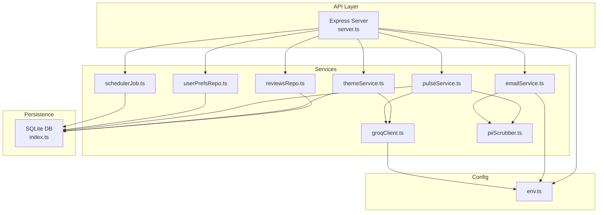
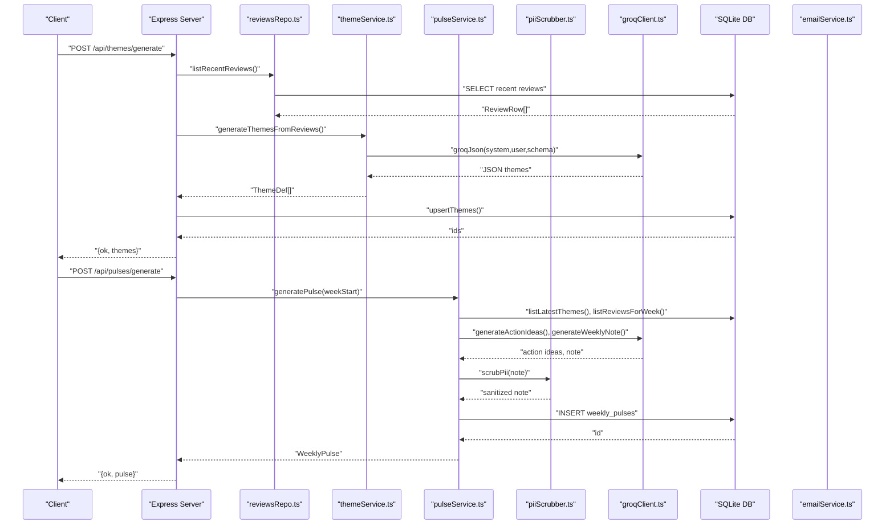
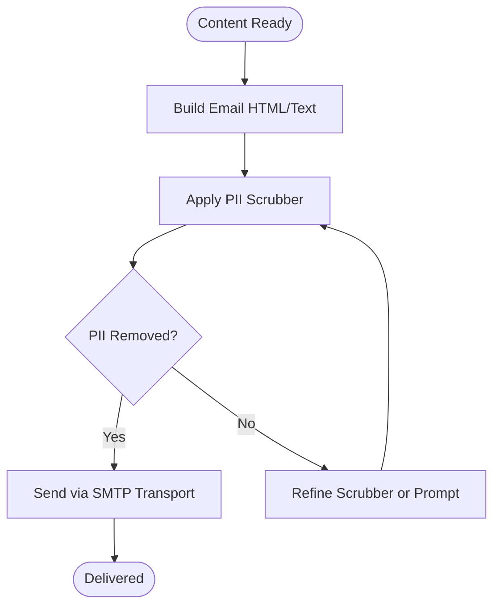
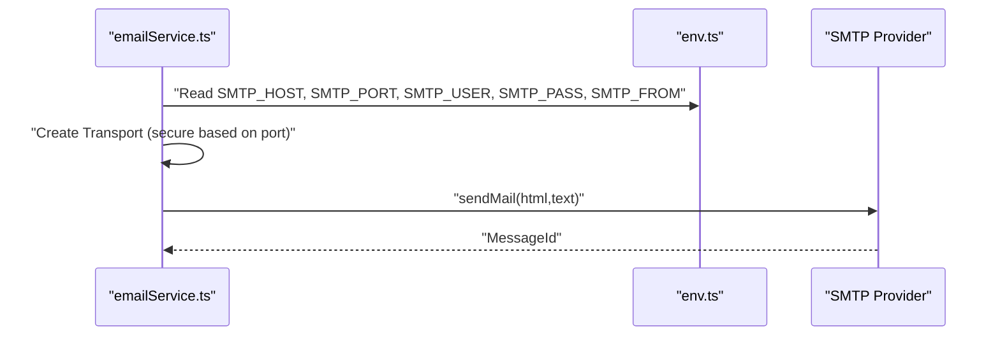
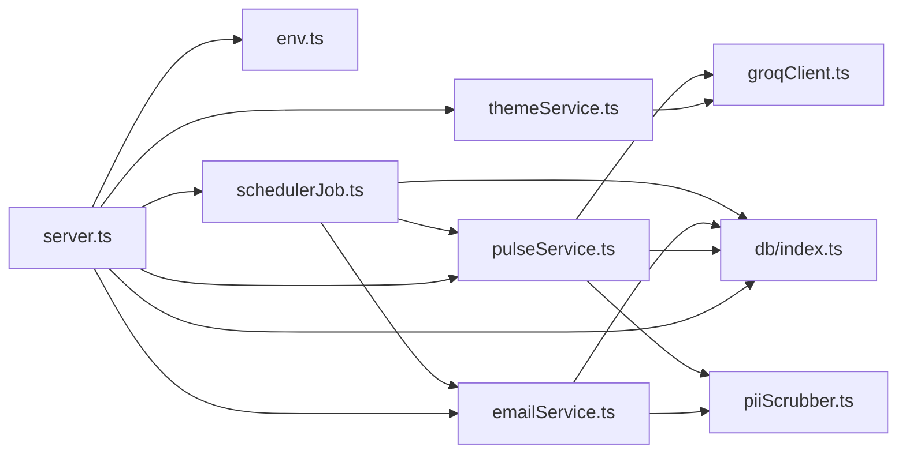
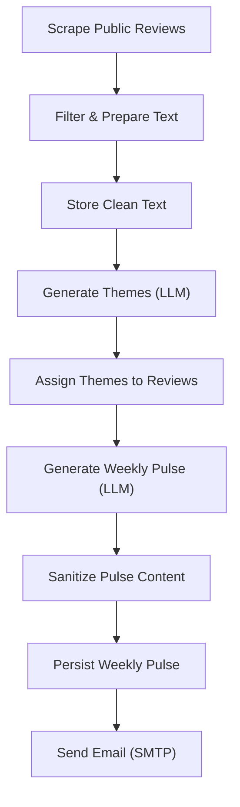

# Privacy & Security

<cite>
**Referenced Files in This Document**
- [piiScrubber.ts](file://phase-2/src/services/piiScrubber.ts)
- [env.ts](file://phase-2/src/config/env.ts)
- [index.ts](file://phase-2/src/db/index.ts)
- [server.ts](file://phase-2/src/api/server.ts)
- [emailService.ts](file://phase-2/src/services/emailService.ts)
- [groqClient.ts](file://phase-2/src/services/groqClient.ts)
- [pulseService.ts](file://phase-2/src/services/pulseService.ts)
- [themeService.ts](file://phase-2/src/services/themeService.ts)
- [userPrefsRepo.ts](file://phase-2/src/services/userPrefsRepo.ts)
- [schedulerJob.ts](file://phase-2/src/jobs/schedulerJob.ts)
- [logger.ts](file://phase-2/src/core/logger.ts)
- [review.ts](file://phase-2/src/domain/review.ts)
- [package.json](file://phase-2/package.json)
</cite>

## Table of Contents
1. [Introduction](#introduction)
2. [Project Structure](#project-structure)
3. [Core Components](#core-components)
4. [Architecture Overview](#architecture-overview)
5. [Detailed Component Analysis](#detailed-component-analysis)
6. [Dependency Analysis](#dependency-analysis)
7. [Performance Considerations](#performance-considerations)
8. [Troubleshooting Guide](#troubleshooting-guide)
9. [Conclusion](#conclusion)
10. [Appendices](#appendices)

## Introduction
This document provides comprehensive privacy and security guidance for the Groww App Review Insights Analyzer. It focuses on protecting personal data during scraping, filtering, and Large Language Model (LLM) processing; sanitizing user-facing content; securing data at rest and in transit; and establishing robust operational controls. It also outlines compliance considerations, audit procedures, vulnerability assessments, incident response, access control, authentication, authorization, secure coding practices, and secure deployment recommendations.

## Project Structure
The system is organized into layered modules:
- API layer: Express routes for theme generation, pulse creation, user preferences, and email testing.
- Services: Orchestration of data retrieval, LLM interactions, PII scrubbing, and email delivery.
- Persistence: SQLite-backed schema for themes, weekly pulses, user preferences, and scheduled jobs.
- Configuration: Environment-driven settings for ports, database location, LLM provider keys, and SMTP.
- Jobs: Scheduler for automated weekly pulse generation and email dispatch.

**Diagram sources**
- [server.ts:1-266](file://phase-2/src/api/server.ts#L1-L266)
- [reviewsRepo.ts:1-26](file://phase-2/src/services/reviewsRepo.ts#L1-L26)
- [themeService.ts:1-68](file://phase-2/src/services/themeService.ts#L1-L68)
- [pulseService.ts:1-265](file://phase-2/src/services/pulseService.ts#L1-L265)
- [emailService.ts:1-142](file://phase-2/src/services/emailService.ts#L1-L142)
- [groqClient.ts:1-67](file://phase-2/src/services/groqClient.ts#L1-L67)
- [userPrefsRepo.ts:1-95](file://phase-2/src/services/userPrefsRepo.ts#L1-L95)
- [schedulerJob.ts:1-98](file://phase-2/src/jobs/schedulerJob.ts#L1-L98)
- [index.ts:1-93](file://phase-2/src/db/index.ts#L1-L93)
- [env.ts:1-23](file://phase-2/src/config/env.ts#L1-L23)

**Section sources**
- [server.ts:1-266](file://phase-2/src/api/server.ts#L1-L266)
- [index.ts:1-93](file://phase-2/src/db/index.ts#L1-L93)
- [env.ts:1-23](file://phase-2/src/config/env.ts#L1-L23)

## Core Components
- PII Scrubber: Regex-based redaction of emails, phone numbers, URLs, and handles prior to storage or email delivery.
- LLM Client: Groq SDK wrapper with JSON extraction and retry logic; requires API key.
- Pulse Generation: Aggregates themes, selects representative quotes, generates action ideas and a concise note, and persists weekly pulses.
- Email Delivery: Builds HTML/text bodies, scrubs content, and sends via SMTP with transport-layer security.
- Scheduler: Periodically identifies due recipients, generates pulses, and emails them while recording outcomes.
- Persistence: SQLite schema for themes, weekly pulses, user preferences, and scheduled jobs.
- Configuration: Environment variables for database file, port, LLM key/model, and SMTP settings.

**Section sources**
- [piiScrubber.ts:1-29](file://phase-2/src/services/piiScrubber.ts#L1-L29)
- [groqClient.ts:1-67](file://phase-2/src/services/groqClient.ts#L1-L67)
- [pulseService.ts:1-265](file://phase-2/src/services/pulseService.ts#L1-L265)
- [emailService.ts:1-142](file://phase-2/src/services/emailService.ts#L1-L142)
- [schedulerJob.ts:1-98](file://phase-2/src/jobs/schedulerJob.ts#L1-L98)
- [index.ts:1-93](file://phase-2/src/db/index.ts#L1-L93)
- [env.ts:1-23](file://phase-2/src/config/env.ts#L1-L23)

## Architecture Overview
The system integrates external LLM APIs for insights generation and SMTP for email delivery. Data flows through validation, sanitization, and persistence layers. Automated scheduling ensures timely delivery of sanitized weekly pulses.

**Diagram sources**
- [server.ts:28-43](file://phase-2/src/api/server.ts#L28-L43)
- [reviewsRepo.ts:1-26](file://phase-2/src/services/reviewsRepo.ts#L1-L26)
- [themeService.ts:17-37](file://phase-2/src/services/themeService.ts#L17-L37)
- [pulseService.ts:176-241](file://phase-2/src/services/pulseService.ts#L176-L241)
- [groqClient.ts:30-67](file://phase-2/src/services/groqClient.ts#L30-L67)
- [emailService.ts:114-129](file://phase-2/src/services/emailService.ts#L114-L129)
- [index.ts:7-91](file://phase-2/src/db/index.ts#L7-L91)

## Detailed Component Analysis

### PII Protection and Sanitization
- Detection and Removal: A regex-based scrubber targets emails, Indian and international phone numbers, URLs, and social handles. It is applied to user-facing content before storage and email delivery.
- LLM Safety: Prompts explicitly instruct the LLM to avoid PII, and the scrubber acts as a final safety net.
- Email Content: Both HTML and text email bodies are sanitized before sending.

**Diagram sources**
- [emailService.ts:9-95](file://phase-2/src/services/emailService.ts#L9-L95)
- [emailService.ts:114-129](file://phase-2/src/services/emailService.ts#L114-L129)
- [piiScrubber.ts:22-28](file://phase-2/src/services/piiScrubber.ts#L22-L28)

**Section sources**
- [piiScrubber.ts:1-29](file://phase-2/src/services/piiScrubber.ts#L1-L29)
- [emailService.ts:1-142](file://phase-2/src/services/emailService.ts#L1-L142)
- [pulseService.ts:109-172](file://phase-2/src/services/pulseService.ts#L109-L172)

### Secure Data Transmission
- SMTP Transport: Transport is created using host, port, and credentials from environment variables. Port 465 enables TLS; otherwise, opportunistic TLS is used based on port selection.
- API Exposure: The server listens on a configurable port; ensure network-level protections (firewalls, reverse proxies) and consider enabling HTTPS termination at a gateway.

**Diagram sources**
- [emailService.ts:99-112](file://phase-2/src/services/emailService.ts#L99-L112)
- [env.ts:16-21](file://phase-2/src/config/env.ts#L16-L21)

**Section sources**
- [emailService.ts:99-112](file://phase-2/src/services/emailService.ts#L99-L112)
- [env.ts:16-21](file://phase-2/src/config/env.ts#L16-L21)

### Encryption Strategies
- At Rest: SQLite database files are stored on disk; protect filesystem access and restrict permissions. Consider encrypting the database file at rest using OS-level encryption or database encryption features.
- In Transit: Use TLS for SMTP connections (port 465) and consider HTTPS termination at a reverse proxy for API traffic.

[No sources needed since this section provides general guidance]

### API Endpoint Security
- Input Validation: Routes validate required fields and formats (e.g., UUID-like identifiers, date formats). Enhance with schema validation libraries and rate limiting.
- Authentication and Authorization: No built-in authentication or authorization is present. Add API keys, JWT, or OAuth as appropriate. Restrict sensitive endpoints and enforce least privilege.
- CORS and Headers: Configure CORS policies and security headers (e.g., Content-Security-Policy, Strict-Transport-Security) at a reverse proxy or middleware.

**Section sources**
- [server.ts:57-70](file://phase-2/src/api/server.ts#L57-L70)
- [server.ts:76-90](file://phase-2/src/api/server.ts#L76-L90)
- [server.ts:160-197](file://phase-2/src/api/server.ts#L160-L197)
- [server.ts:218-232](file://phase-2/src/api/server.ts#L218-L232)

### Database Access Security
- Schema and Indexes: The schema defines primary keys, foreign keys, and unique indexes to maintain integrity. Limit direct database access; use prepared statements and ORM-style wrappers.
- Secrets Management: Store database credentials and file paths in environment variables; avoid embedding secrets in code or logs.
- Auditing: Track schema initialization and write operations; log failures and anomalies.

**Section sources**
- [index.ts:7-91](file://phase-2/src/db/index.ts#L7-L91)
- [env.ts:9-11](file://phase-2/src/config/env.ts#L9-L11)

### External Service Integrations
- LLM Provider: Groq SDK is used with retries and JSON extraction. Keep API keys secret and rotate regularly. Enforce quotas and monitor usage.
- Email Provider: Nodemailer is used with SMTP; ensure credentials are managed securely.

**Section sources**
- [groqClient.ts:1-67](file://phase-2/src/services/groqClient.ts#L1-L67)
- [emailService.ts:1-142](file://phase-2/src/services/emailService.ts#L1-L142)
- [package.json:13-20](file://phase-2/package.json#L13-L20)

### Compliance Considerations
- Data Minimization: Only collect and process necessary data; scrub PII proactively.
- Consent and Transparency: Provide clear notices and allow opt-out for email subscriptions.
- Data Subject Rights: Implement mechanisms to locate, delete, or port data upon request.
- Regulatory Alignment: Align with applicable frameworks (e.g., GDPR, state privacy laws) by adopting privacy-by-design controls.

[No sources needed since this section provides general guidance]

### Security Audit Procedures
- Static Analysis: Scan for hardcoded secrets, weak cryptographic defaults, and unsafe deserialization.
- Dynamic Analysis: Penetration testing of endpoints, input fuzzing, and session security checks.
- Configuration Review: Verify environment variables, file permissions, and transport security.
- Logging and Monitoring: Centralize logs, mask sensitive fields, and alert on anomalies.

[No sources needed since this section provides general guidance]

### Vulnerability Assessment Strategies
- Threat Modeling: Identify assets, threats, and attack vectors; prioritize risks.
- Dependency Review: Regularly audit third-party packages for known vulnerabilities.
- Secure Coding Practices: Input validation, output encoding, least privilege, and secure defaults.

[No sources needed since this section provides general guidance]

### Incident Response Protocols
- Containment: Isolate affected systems, revoke compromised credentials, and suspend services if necessary.
- Eradication: Remove malicious artifacts, patch vulnerabilities, and reset secrets.
- Recovery: Restore from backups, validate integrity, and re-enable services gradually.
- Post-Incident: Conduct a root cause analysis, update policies, and improve monitoring.

[No sources needed since this section provides general guidance]

### Access Control, Authentication, and Authorization
- Access Control: Restrict filesystem and database access to dedicated service accounts.
- Authentication: Require API keys or tokens for protected endpoints; rotate credentials periodically.
- Authorization: Enforce role-based access to administrative endpoints; log privileged actions.

[No sources needed since this section provides general guidance]

### Secure Coding Practices
- Input Validation: Validate and sanitize all inputs; reject unexpected formats.
- Output Encoding: Escape HTML and attributes when rendering dynamic content.
- Error Handling: Avoid leaking sensitive information in error messages; log internally only.
- Dependency Hygiene: Pin versions, monitor advisories, and apply updates promptly.

[No sources needed since this section provides general guidance]

### Secure Deployment and Operational Security
- Environment Separation: Use separate environments for development, staging, and production.
- Secrets Management: Store secrets in encrypted vaults; never commit to repositories.
- Network Security: Place servers behind firewalls, enable IDS/IPS, and restrict inbound/outbound traffic.
- Backups: Encrypt backups, store offsite, and test restoration regularly.
- Patching: Maintain OS, runtime, and dependencies; automate patch deployment.

[No sources needed since this section provides general guidance]

## Dependency Analysis
The system relies on several external libraries and environment-managed secrets. Dependencies include Express for the API, better-sqlite3 for persistence, nodemailer for email, zod for schema validation, and groq-sdk for LLM interactions.

**Diagram sources**
- [server.ts:1-266](file://phase-2/src/api/server.ts#L1-L266)
- [env.ts:1-23](file://phase-2/src/config/env.ts#L1-L23)
- [index.ts:1-93](file://phase-2/src/db/index.ts#L1-L93)
- [themeService.ts:1-68](file://phase-2/src/services/themeService.ts#L1-L68)
- [pulseService.ts:1-265](file://phase-2/src/services/pulseService.ts#L1-L265)
- [emailService.ts:1-142](file://phase-2/src/services/emailService.ts#L1-L142)
- [schedulerJob.ts:1-98](file://phase-2/src/jobs/schedulerJob.ts#L1-L98)
- [groqClient.ts:1-67](file://phase-2/src/services/groqClient.ts#L1-L67)
- [piiScrubber.ts:1-29](file://phase-2/src/services/piiScrubber.ts#L1-L29)

**Section sources**
- [package.json:13-29](file://phase-2/package.json#L13-L29)

## Performance Considerations
- Database Indexes: Unique and composite indexes optimize frequent queries for themes, weekly pulses, and scheduled jobs.
- Prepared Statements: Use parameterized queries to prevent SQL injection and improve performance.
- Caching: Consider caching frequently accessed themes or user preferences to reduce load.
- Asynchronous Processing: Offload heavy LLM calls and email sending to background jobs.

[No sources needed since this section provides general guidance]

## Troubleshooting Guide
- SMTP Not Configured: Sending emails requires SMTP_HOST, SMTP_USER, and SMTP_PASS. Ensure these are set and valid.
- LLM API Key Missing: Automatic scheduling requires GROQ_API_KEY; otherwise, the scheduler does not start.
- Validation Errors: API endpoints return structured errors for invalid inputs; check request payloads and formats.
- Logging: Use INFO/ERROR logs to diagnose issues; avoid logging sensitive data.

**Section sources**
- [emailService.ts:99-102](file://phase-2/src/services/emailService.ts#L99-L102)
- [server.ts:257-262](file://phase-2/src/api/server.ts#L257-L262)
- [logger.ts:1-21](file://phase-2/src/core/logger.ts#L1-L21)

## Conclusion
The Groww App Review Insights Analyzer implements strong safeguards against PII exposure through regex-based scrubbing, explicit LLM prompts, and careful content sanitization before storage and email delivery. To further strengthen privacy and security, integrate authentication and authorization, harden transport and storage, adopt continuous auditing and vulnerability management, and establish clear incident response and compliance procedures.

[No sources needed since this section summarizes without analyzing specific files]

## Appendices

### Data Handling Lifecycle

**Diagram sources**
- [reviewsRepo.ts:4-14](file://phase-2/src/services/reviewsRepo.ts#L4-L14)
- [themeService.ts:17-37](file://phase-2/src/services/themeService.ts#L17-L37)
- [pulseService.ts:176-241](file://phase-2/src/services/pulseService.ts#L176-L241)
- [emailService.ts:114-129](file://phase-2/src/services/emailService.ts#L114-L129)