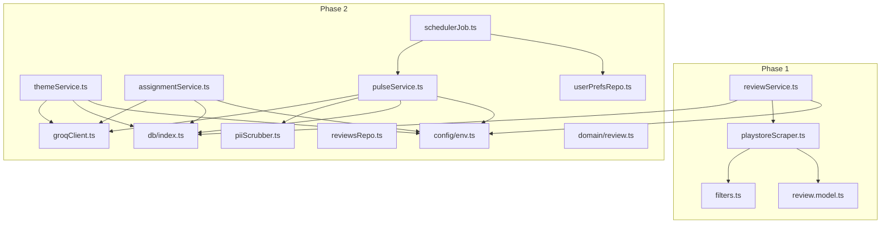
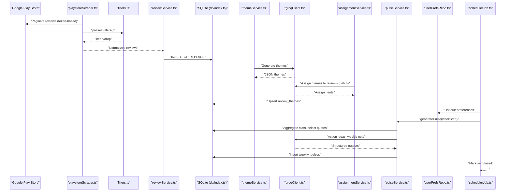
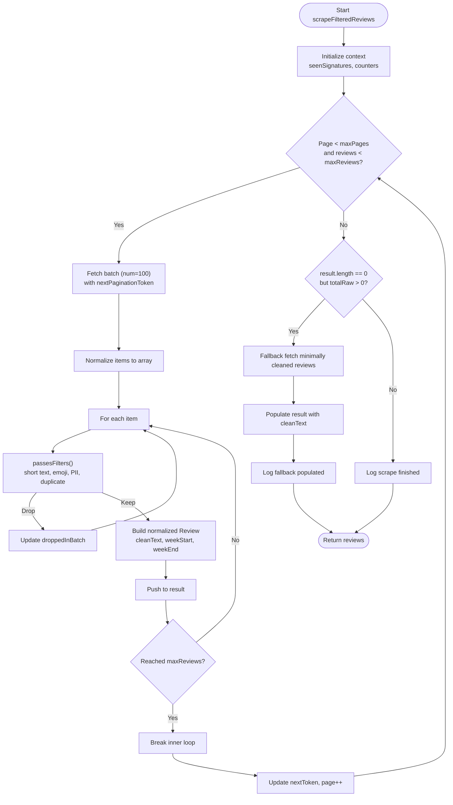
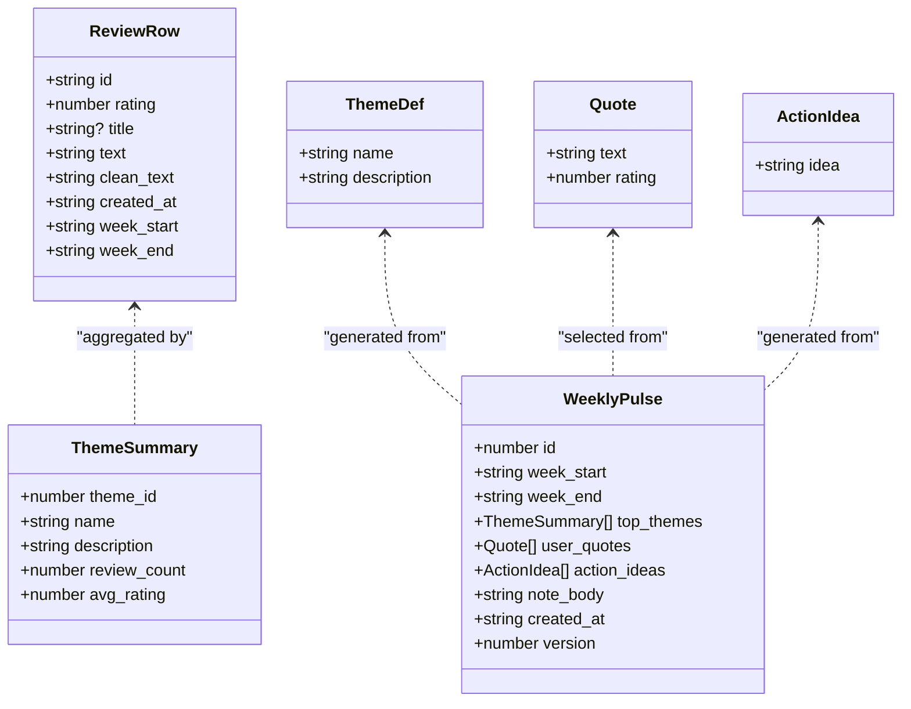
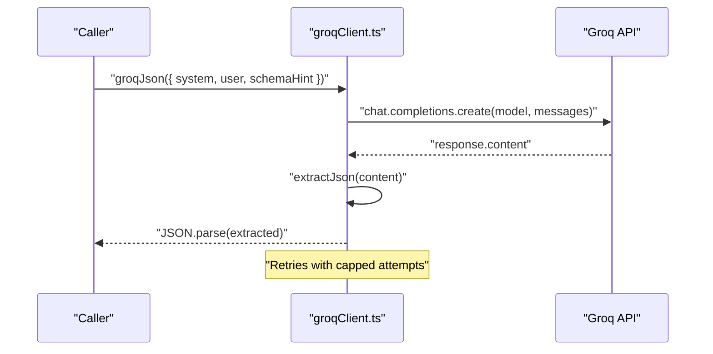
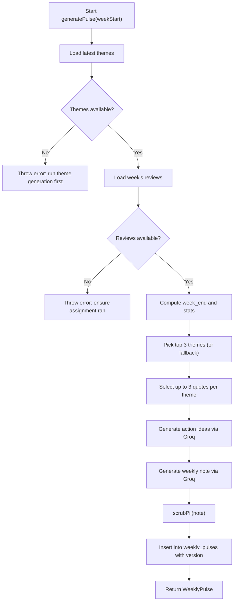
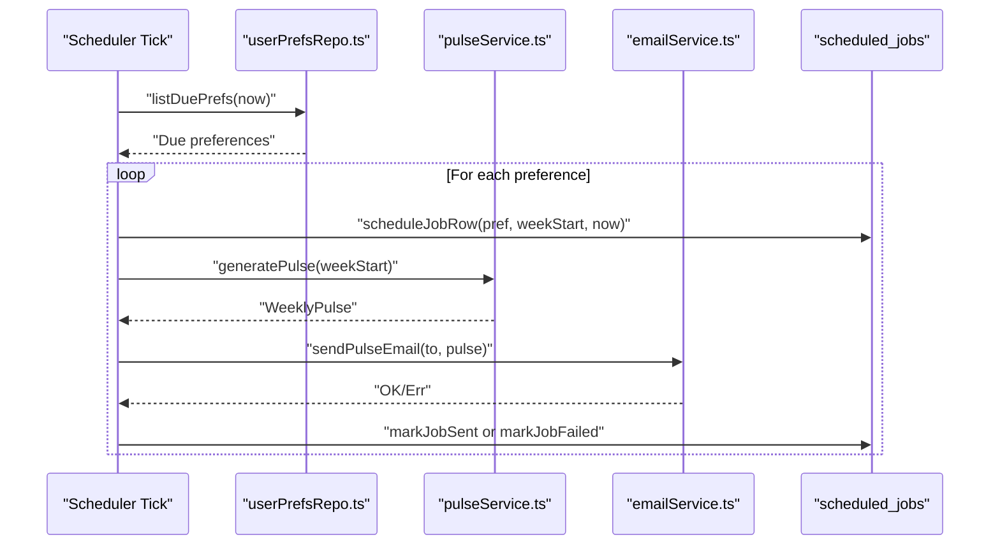
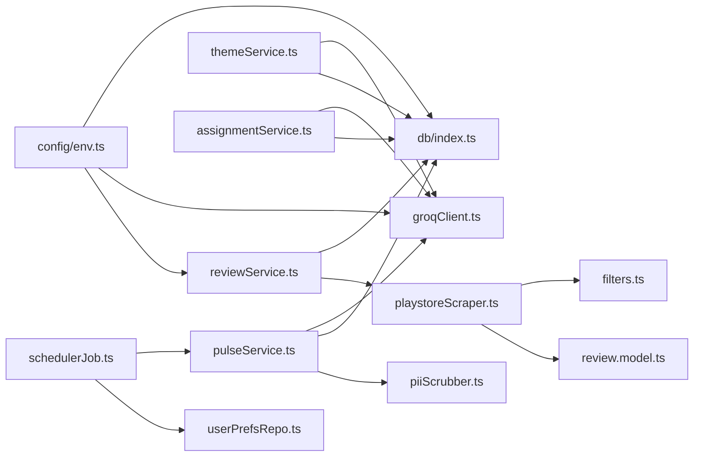

# End-to-End Data Flow

<cite>
**Referenced Files in This Document**
- [playstoreScraper.ts](file://phase-1/src/scraper/playstoreScraper.ts)
- [filters.ts](file://phase-1/src/scraper/filters.ts)
- [review.model.ts](file://phase-1/src/domain/review.model.ts)
- [reviewService.ts](file://phase-1/src/services/reviewService.ts)
- [index.ts](file://phase-2/src/db/index.ts)
- [env.ts](file://phase-2/src/config/env.ts)
- [groqClient.ts](file://phase-2/src/services/groqClient.ts)
- [themeService.ts](file://phase-2/src/services/themeService.ts)
- [assignmentService.ts](file://phase-2/src/services/assignmentService.ts)
- [reviewsRepo.ts](file://phase-2/src/services/reviewsRepo.ts)
- [pulseService.ts](file://phase-2/src/services/pulseService.ts)
- [schedulerJob.ts](file://phase-2/src/jobs/schedulerJob.ts)
- [userPrefsRepo.ts](file://phase-2/src/services/userPrefsRepo.ts)
- [piiScrubber.ts](file://phase-2/src/services/piiScrubber.ts)
- [review.ts](file://phase-2/src/domain/review.ts)
</cite>

## Table of Contents
1. [Introduction](#introduction)
2. [Project Structure](#project-structure)
3. [Core Components](#core-components)
4. [Architecture Overview](#architecture-overview)
5. [Detailed Component Analysis](#detailed-component-analysis)
6. [Dependency Analysis](#dependency-analysis)
7. [Performance Considerations](#performance-considerations)
8. [Troubleshooting Guide](#troubleshooting-guide)
9. [Conclusion](#conclusion)

## Introduction
This document explains the end-to-end data flow of the Groww App Review Insights Analyzer. It covers the complete pipeline from scraping Google Play Store reviews, applying multi-criteria filtering and PII sanitization, storing normalized data in SQLite, generating AI-powered themes via Groq, assigning themes to reviews, and producing weekly pulses with action recommendations. It also details token-based pagination with 50-page safety limits, error handling, and data validation at each stage.

## Project Structure
The system is split into two major phases:
- Phase 1: Scraping, filtering, and initial persistence of reviews into SQLite.
- Phase 2: Schema extension, AI-driven theme generation and assignment, weekly pulse creation, and scheduling.

**Diagram sources**
- [playstoreScraper.ts:1-153](file://phase-1/src/scraper/playstoreScraper.ts#L1-L153)
- [filters.ts:1-59](file://phase-1/src/scraper/filters.ts#L1-L59)
- [review.model.ts:1-14](file://phase-1/src/domain/review.model.ts#L1-L14)
- [reviewService.ts:1-101](file://phase-1/src/services/reviewService.ts#L1-L101)
- [index.ts:1-93](file://phase-2/src/db/index.ts#L1-L93)
- [env.ts:1-23](file://phase-2/src/config/env.ts#L1-L23)
- [groqClient.ts:1-67](file://phase-2/src/services/groqClient.ts#L1-L67)
- [themeService.ts:1-68](file://phase-2/src/services/themeService.ts#L1-L68)
- [assignmentService.ts:1-114](file://phase-2/src/services/assignmentService.ts#L1-L114)
- [reviewsRepo.ts:1-26](file://phase-2/src/services/reviewsRepo.ts#L1-L26)
- [pulseService.ts:1-265](file://phase-2/src/services/pulseService.ts#L1-L265)
- [schedulerJob.ts:1-98](file://phase-2/src/jobs/schedulerJob.ts#L1-L98)
- [userPrefsRepo.ts:1-95](file://phase-2/src/services/userPrefsRepo.ts#L1-L95)
- [piiScrubber.ts:1-29](file://phase-2/src/services/piiScrubber.ts#L1-L29)
- [review.ts:1-12](file://phase-2/src/domain/review.ts#L1-L12)

**Section sources**
- [playstoreScraper.ts:1-153](file://phase-1/src/scraper/playstoreScraper.ts#L1-L153)
- [reviewService.ts:1-101](file://phase-1/src/services/reviewService.ts#L1-L101)
- [index.ts:1-93](file://phase-2/src/db/index.ts#L1-L93)
- [env.ts:1-23](file://phase-2/src/config/env.ts#L1-L23)

## Core Components
- Play Store Scraper: Fetches paginated reviews, applies filters, computes week boundaries, and normalizes payloads.
- Filters and PII Scrubber: Enforces quality and privacy rules; redacts sensitive data.
- Review Persistence: Inserts normalized reviews into SQLite with transactional guarantees.
- Theme Generation: Uses Groq to propose themes from sampled review excerpts.
- Theme Assignment: Assigns themes to weekly reviews in batches and persists mappings.
- Weekly Pulse: Aggregates themes, selects quotes, generates action ideas, writes a concise note, and stores the pulse.
- Scheduler: Determines due recipients, orchestrates generation and delivery, and tracks outcomes.
- Configuration: Loads environment variables for database, Groq, and SMTP.

**Section sources**
- [playstoreScraper.ts:13-151](file://phase-1/src/scraper/playstoreScraper.ts#L13-L151)
- [filters.ts:16-57](file://phase-1/src/scraper/filters.ts#L16-L57)
- [reviewService.ts:10-75](file://phase-1/src/services/reviewService.ts#L10-L75)
- [themeService.ts:17-66](file://phase-2/src/services/themeService.ts#L17-L66)
- [assignmentService.ts:27-113](file://phase-2/src/services/assignmentService.ts#L27-L113)
- [pulseService.ts:179-241](file://phase-2/src/services/pulseService.ts#L179-L241)
- [schedulerJob.ts:52-84](file://phase-2/src/jobs/schedulerJob.ts#L52-L84)
- [env.ts:7-21](file://phase-2/src/config/env.ts#L7-L21)

## Architecture Overview
The system follows a staged pipeline:
- Data ingestion (Phase 1) produces normalized reviews.
- AI services (Phase 2) generate and assign themes.
- Weekly pulse synthesis aggregates insights and recommendations.
- Scheduler automates distribution based on user preferences.

**Diagram sources**
- [playstoreScraper.ts:33-104](file://phase-1/src/scraper/playstoreScraper.ts#L33-L104)
- [filters.ts:16-47](file://phase-1/src/scraper/filters.ts#L16-L47)
- [reviewService.ts:19-42](file://phase-1/src/services/reviewService.ts#L19-L42)
- [index.ts:7-91](file://phase-2/src/db/index.ts#L7-L91)
- [themeService.ts:34-36](file://phase-2/src/services/themeService.ts#L34-L36)
- [groqClient.ts:44-65](file://phase-2/src/services/groqClient.ts#L44-L65)
- [assignmentService.ts:61-66](file://phase-2/src/services/assignmentService.ts#L61-L66)
- [pulseService.ts:214-238](file://phase-2/src/services/pulseService.ts#L214-L238)
- [userPrefsRepo.ts:83-94](file://phase-2/src/services/userPrefsRepo.ts#L83-L94)
- [schedulerJob.ts:69-74](file://phase-2/src/jobs/schedulerJob.ts#L69-L74)

## Detailed Component Analysis

### Phase 1: Scraping, Filtering, and Storage
- Token-based Pagination: Iteratively fetches pages with a configurable page cap to avoid excessive traversal when filters are strict.
- Multi-Criteria Filtering: Drops short texts, those containing emojis, emails, or phone numbers; removes duplicates using a signature set.
- Content Sanitization: Basic cleaning replaces PII-like tokens with redacted placeholders.
- Storage: Inserts normalized reviews into SQLite with a transaction; writes a debug JSON file for inspection.

**Diagram sources**
- [playstoreScraper.ts:13-151](file://phase-1/src/scraper/playstoreScraper.ts#L13-L151)
- [filters.ts:16-47](file://phase-1/src/scraper/filters.ts#L16-L47)

**Section sources**
- [playstoreScraper.ts:13-151](file://phase-1/src/scraper/playstoreScraper.ts#L13-L151)
- [filters.ts:16-57](file://phase-1/src/scraper/filters.ts#L16-L57)
- [review.model.ts:1-14](file://phase-1/src/domain/review.model.ts#L1-L14)
- [reviewService.ts:10-75](file://phase-1/src/services/reviewService.ts#L10-L75)

### Phase 2: Schema, AI, and Weekly Pulse
- Schema: Extends Phase 1 DB with themes, review_themes, weekly_pulses, user_preferences, and scheduled_jobs.
- Theme Discovery: Samples excerpts, prompts Groq, validates structured output, and upserts themes with optional windows.
- Theme Assignment: Batches reviews, queries Groq for assignments, and persists mappings with conflict resolution.
- Weekly Pulse: Aggregates per-week stats, selects representative quotes, generates action ideas and a concise note, scrubs PII, and stores the pulse with versioning.
- Scheduler: Computes last full week, identifies due preferences, orchestrates generation and delivery, and records outcomes.

**Diagram sources**
- [review.ts:1-12](file://phase-2/src/domain/review.ts#L1-L12)
- [themeService.ts:6-13](file://phase-2/src/services/themeService.ts#L6-L13)
- [pulseService.ts:11-38](file://phase-2/src/services/pulseService.ts#L11-L38)

**Section sources**
- [index.ts:7-91](file://phase-2/src/db/index.ts#L7-L91)
- [themeService.ts:17-66](file://phase-2/src/services/themeService.ts#L17-L66)
- [assignmentService.ts:27-113](file://phase-2/src/services/assignmentService.ts#L27-L113)
- [pulseService.ts:179-241](file://phase-2/src/services/pulseService.ts#L179-L241)
- [schedulerJob.ts:52-84](file://phase-2/src/jobs/schedulerJob.ts#L52-L84)
- [userPrefsRepo.ts:83-94](file://phase-2/src/services/userPrefsRepo.ts#L83-L94)
- [piiScrubber.ts:22-28](file://phase-2/src/services/piiScrubber.ts#L22-L28)

### Groq Integration and Validation
- Structured JSON Extraction: Robust parsing handles fenced code blocks and stray text.
- Retry Logic: Gradually increasing temperature on retries improves convergence.
- Zod Validation: Strict schemas enforce output structure and length constraints.

**Diagram sources**
- [groqClient.ts:30-65](file://phase-2/src/services/groqClient.ts#L30-L65)

**Section sources**
- [groqClient.ts:30-65](file://phase-2/src/services/groqClient.ts#L30-L65)
- [themeService.ts:34-36](file://phase-2/src/services/themeService.ts#L34-L36)
- [assignmentService.ts:61-66](file://phase-2/src/services/assignmentService.ts#L61-L66)
- [pulseService.ts:130-131](file://phase-2/src/services/pulseService.ts#L130-L131)
- [pulseService.ts:159-169](file://phase-2/src/services/pulseService.ts#L159-L169)

### Weekly Pulse Generation Workflow
- Inputs: Latest themes, week’s reviews, top themes aggregation, and quote selection.
- Outputs: Top themes, user quotes, action ideas, and a concise note body.
- Versioning: Increments version per week to support updates without duplication.

**Diagram sources**
- [pulseService.ts:179-241](file://phase-2/src/services/pulseService.ts#L179-L241)
- [reviewsRepo.ts:16-24](file://phase-2/src/services/reviewsRepo.ts#L16-L24)
- [themeService.ts:58-66](file://phase-2/src/services/themeService.ts#L58-L66)
- [piiScrubber.ts:22-28](file://phase-2/src/services/piiScrubber.ts#L22-L28)

**Section sources**
- [pulseService.ts:59-74](file://phase-2/src/services/pulseService.ts#L59-L74)
- [pulseService.ts:79-105](file://phase-2/src/services/pulseService.ts#L79-L105)
- [pulseService.ts:109-132](file://phase-2/src/services/pulseService.ts#L109-L132)
- [pulseService.ts:134-172](file://phase-2/src/services/pulseService.ts#L134-L172)
- [pulseService.ts:217-241](file://phase-2/src/services/pulseService.ts#L217-L241)

### Scheduler and Distribution
- Due Preferences: Identifies active user preferences whose next send time is now or earlier.
- Job Lifecycle: Creates pending job entries, runs generation, sends email, and marks sent/failed.
- Interval Execution: Starts a recurring loop with a fixed interval.

**Diagram sources**
- [schedulerJob.ts:52-84](file://phase-2/src/jobs/schedulerJob.ts#L52-L84)
- [userPrefsRepo.ts:83-94](file://phase-2/src/services/userPrefsRepo.ts#L83-L94)
- [pulseService.ts:179-241](file://phase-2/src/services/pulseService.ts#L179-L241)

**Section sources**
- [schedulerJob.ts:52-84](file://phase-2/src/jobs/schedulerJob.ts#L52-L84)
- [userPrefsRepo.ts:83-94](file://phase-2/src/services/userPrefsRepo.ts#L83-L94)

## Dependency Analysis
- Coupling: Phase 1 depends on domain models and filters; Phase 2 depends on Phase 1’s DB schema and extends it.
- External Integrations: Google Play Scraper SDK, Groq API, better-sqlite3, environment configuration.
- Data Contracts: Reviews, themes, assignments, and pulses are persisted with explicit schemas and indexes.

**Diagram sources**
- [env.ts:7-21](file://phase-2/src/config/env.ts#L7-L21)
- [index.ts:1-93](file://phase-2/src/db/index.ts#L1-L93)
- [groqClient.ts:1-67](file://phase-2/src/services/groqClient.ts#L1-L67)
- [reviewService.ts:1-101](file://phase-1/src/services/reviewService.ts#L1-L101)
- [playstoreScraper.ts:1-153](file://phase-1/src/scraper/playstoreScraper.ts#L1-L153)
- [filters.ts:1-59](file://phase-1/src/scraper/filters.ts#L1-L59)
- [review.model.ts:1-14](file://phase-1/src/domain/review.model.ts#L1-L14)
- [themeService.ts:1-68](file://phase-2/src/services/themeService.ts#L1-L68)
- [assignmentService.ts:1-114](file://phase-2/src/services/assignmentService.ts#L1-L114)
- [pulseService.ts:1-265](file://phase-2/src/services/pulseService.ts#L1-L265)
- [schedulerJob.ts:1-98](file://phase-2/src/jobs/schedulerJob.ts#L1-L98)
- [userPrefsRepo.ts:1-95](file://phase-2/src/services/userPrefsRepo.ts#L1-L95)
- [piiScrubber.ts:1-29](file://phase-2/src/services/piiScrubber.ts#L1-L29)

**Section sources**
- [env.ts:7-21](file://phase-2/src/config/env.ts#L7-L21)
- [index.ts:7-91](file://phase-2/src/db/index.ts#L7-L91)

## Performance Considerations
- Pagination Safety: Limits traversal to 50 pages to prevent long loops when filters are aggressive.
- Batched Assignments: Processes reviews in small batches to manage token usage and improve throughput.
- Transactional Writes: Uses transactions for inserts to reduce overhead and maintain consistency.
- Indexes: Unique indexes on themes and weekly pulses, and indexes on foreign keys and job statuses optimize lookups.
- Word Count Guard: Weekly note generation enforces a strict word limit and regenerates if exceeded.

[No sources needed since this section provides general guidance]

## Troubleshooting Guide
- No Reviews Passed Filters: The scraper falls back to minimally cleaned reviews when filters drop all items.
- Missing Groq API Key: Groq client throws an error if the key is not configured.
- JSON Parsing Errors: The Groq client extracts JSON from varied outputs and retries with increasing temperature.
- No Themes Available: Weekly pulse generation requires themes to be present; run theme generation first.
- No Reviews for Week: Ensure theme assignment has been executed for the target week.
- Scheduler Failures: Errors are recorded in scheduled_jobs; inspect last_error for diagnostics.

**Section sources**
- [playstoreScraper.ts:108-145](file://phase-1/src/scraper/playstoreScraper.ts#L108-L145)
- [groqClient.ts:35-65](file://phase-2/src/services/groqClient.ts#L35-L65)
- [pulseService.ts:180-188](file://phase-2/src/services/pulseService.ts#L180-L188)
- [schedulerJob.ts:75-80](file://phase-2/src/jobs/schedulerJob.ts#L75-L80)

## Conclusion
The Groww App Review Insights Analyzer implements a robust, staged pipeline that ensures high-quality, privacy-safe review data, derives actionable themes, assigns them systematically, and synthesizes weekly insights with AI assistance. The design balances reliability with scalability, incorporating safety caps, validation, and automated scheduling for consistent delivery.