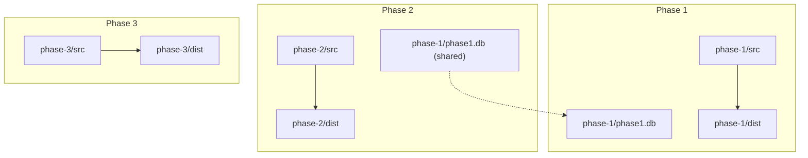
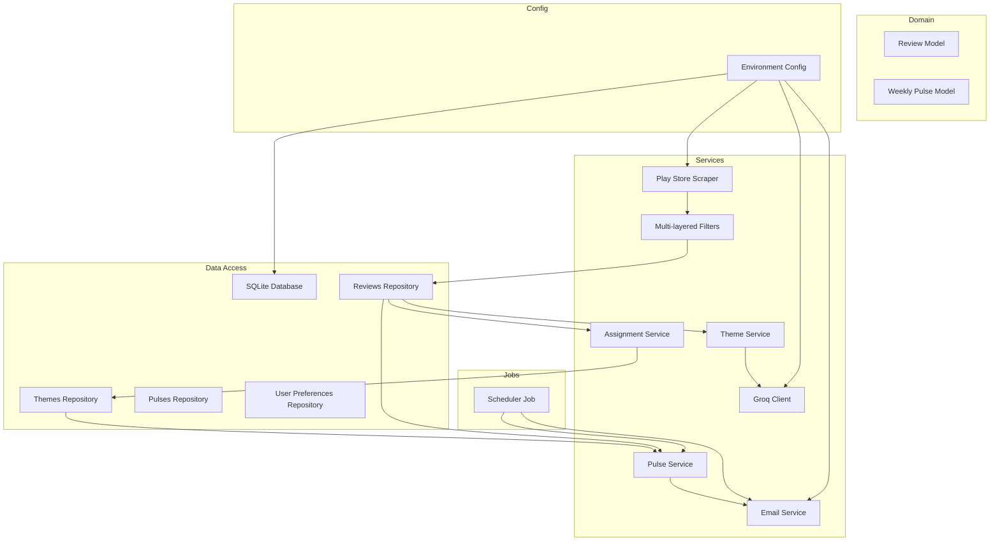
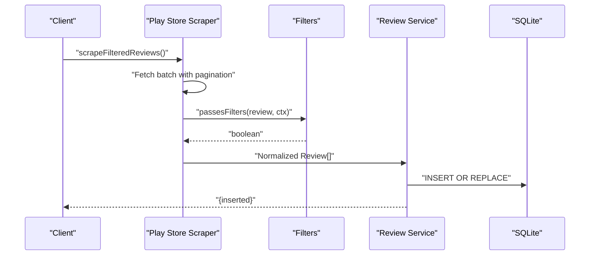
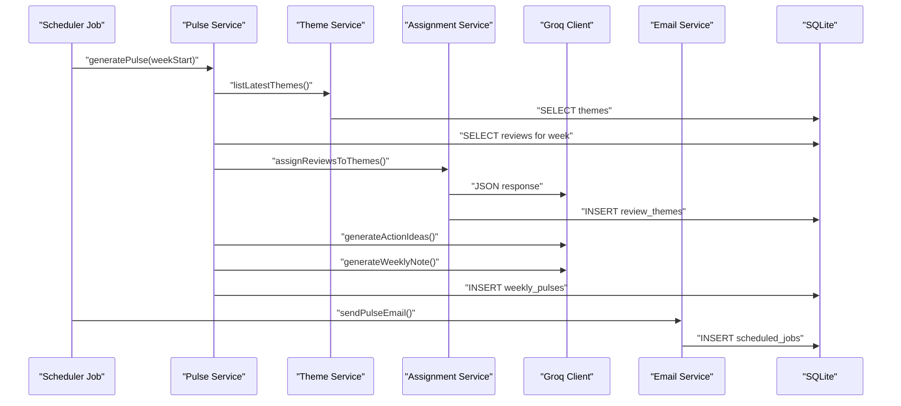
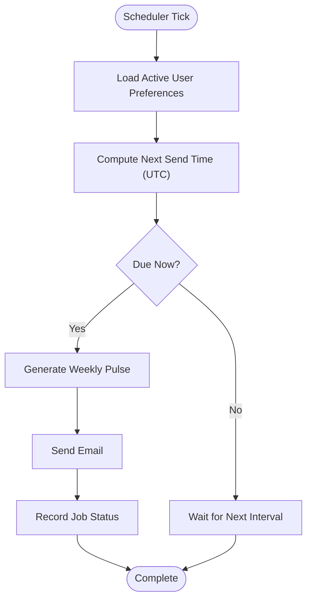
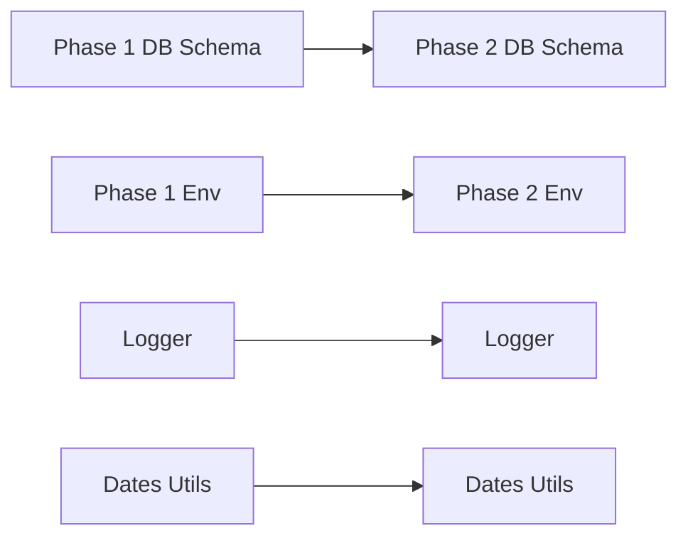

# Phase Implementation Plan

<cite>
**Referenced Files in This Document**
- [playstoreScraper.ts](file://phase-1/src/scraper/playstoreScraper.ts)
- [filters.ts](file://phase-1/src/scraper/filters.ts)
- [review.model.ts](file://phase-1/src/domain/review.model.ts)
- [reviewService.ts](file://phase-1/src/services/reviewService.ts)
- [index.ts](file://phase-1/src/db/index.ts)
- [dates.ts](file://phase-1/src/utils/dates.ts)
- [logger.ts](file://phase-1/src/core/logger.ts)
- [env.ts](file://phase-1/src/config/env.ts)
- [playstoreScraper.ts](file://phase-2/src/scraper/playstoreScraper.ts)
- [filters.ts](file://phase-2/src/scraper/filters.ts)
- [review.model.ts](file://phase-2/src/domain/review.ts)
- [reviewService.ts](file://phase-2/src/services/reviewService.ts)
- [index.ts](file://phase-2/src/db/index.ts)
- [dates.ts](file://phase-2/src/utils/dates.ts)
- [logger.ts](file://phase-2/src/core/logger.ts)
- [env.ts](file://phase-2/src/config/env.ts)
- [groqClient.ts](file://phase-2/src/services/groqClient.ts)
- [themeService.ts](file://phase-2/src/services/themeService.ts)
- [assignmentService.ts](file://phase-2/src/services/assignmentService.ts)
- [pulseService.ts](file://phase-2/src/services/pulseService.ts)
- [emailService.ts](file://phase-2/src/services/emailService.ts)
- [schedulerJob.ts](file://phase-2/src/jobs/schedulerJob.ts)
- [userPrefsRepo.ts](file://phase-2/src/services/userPrefsRepo.ts)
- [reviewsRepo.ts](file://phase-2/src/services/reviewsRepo.ts)
- [ARCHITECTURE.md](file://ARCHITECTURE.md)
</cite>

## Table of Contents
1. [Introduction](#introduction)
2. [Project Structure](#project-structure)
3. [Core Components](#core-components)
4. [Architecture Overview](#architecture-overview)
5. [Detailed Component Analysis](#detailed-component-analysis)
6. [Dependency Analysis](#dependency-analysis)
7. [Performance Considerations](#performance-considerations)
8. [Troubleshooting Guide](#troubleshooting-guide)
9. [Conclusion](#conclusion)
10. [Appendices](#appendices)

## Introduction
This document outlines the three-phase implementation plan for the Groww App Review Insights Analyzer. The phased approach enables incremental delivery of capabilities: Phase 1 establishes reliable data ingestion, filtering, and persistence; Phase 2 introduces advanced analytics powered by an LLM, theme generation, weekly pulse creation, and email automation; Phase 3 adds a web UI and user preference management with automated scheduling. Each phase builds upon the previous one, sharing architectural concepts and leveraging a unified SQLite database for persistence.

## Project Structure
The repository is organized by phase, with each phase maintaining its own source tree, compiled distribution, and configuration. Phase 1 focuses on scraping and storage; Phase 2 extends with analytics and automation; Phase 3 prepares for a web UI and user management.

**Diagram sources**
- [index.ts:1-31](file://phase-1/src/db/index.ts#L1-L31)
- [index.ts:1-93](file://phase-2/src/db/index.ts#L1-L93)

**Section sources**
- [index.ts:1-31](file://phase-1/src/db/index.ts#L1-L31)
- [index.ts:1-93](file://phase-2/src/db/index.ts#L1-L93)

## Core Components
- Phase 1: Scraping, filtering, and SQLite persistence form the foundation. The scraper integrates with the Play Store library, applies multi-layered filters, computes weekly windows, and persists normalized reviews.
- Phase 2: Adds LLM-powered theme generation, review-to-theme assignment, weekly pulse composition, email rendering, and scheduler orchestration.
- Phase 3: Prepares for a web UI and user preference management with automated scheduling.

Key shared concepts:
- Unified SQLite schema across phases for persistence.
- Environment-driven configuration via dotenv.
- Centralized logging and error handling.
- Data models standardized between phases.

**Section sources**
- [playstoreScraper.ts:1-153](file://phase-1/src/scraper/playstoreScraper.ts#L1-L153)
- [filters.ts:1-59](file://phase-1/src/scraper/filters.ts#L1-L59)
- [reviewService.ts:1-101](file://phase-1/src/services/reviewService.ts#L1-L101)
- [index.ts:1-31](file://phase-1/src/db/index.ts#L1-L31)
- [groqClient.ts:1-67](file://phase-2/src/services/groqClient.ts#L1-L67)
- [themeService.ts:1-68](file://phase-2/src/services/themeService.ts#L1-L68)
- [pulseService.ts:1-265](file://phase-2/src/services/pulseService.ts#L1-L265)
- [emailService.ts:1-142](file://phase-2/src/services/emailService.ts#L1-L142)
- [schedulerJob.ts:1-98](file://phase-2/src/jobs/schedulerJob.ts#L1-L98)

## Architecture Overview
The system follows a layered architecture:
- Data Access Layer: SQLite-backed repositories for reviews, themes, pulses, and user preferences.
- Domain Layer: Strongly typed models for reviews and weekly pulses.
- Services Layer: Orchestration of scraping, filtering, LLM interactions, assignment, pulse generation, and email sending.
- Jobs Layer: Scheduler for automated pulse generation and delivery.
- Configuration Layer: Environment-driven settings for database, LLM, and SMTP.

**Diagram sources**
- [playstoreScraper.ts:1-153](file://phase-1/src/scraper/playstoreScraper.ts#L1-L153)
- [filters.ts:1-59](file://phase-1/src/scraper/filters.ts#L1-L59)
- [reviewService.ts:1-101](file://phase-1/src/services/reviewService.ts#L1-L101)
- [index.ts:1-31](file://phase-1/src/db/index.ts#L1-L31)
- [groqClient.ts:1-67](file://phase-2/src/services/groqClient.ts#L1-L67)
- [themeService.ts:1-68](file://phase-2/src/services/themeService.ts#L1-L68)
- [assignmentService.ts:1-114](file://phase-2/src/services/assignmentService.ts#L1-L114)
- [pulseService.ts:1-265](file://phase-2/src/services/pulseService.ts#L1-L265)
- [emailService.ts:1-142](file://phase-2/src/services/emailService.ts#L1-L142)
- [schedulerJob.ts:1-98](file://phase-2/src/jobs/schedulerJob.ts#L1-L98)
- [env.ts:1-23](file://phase-2/src/config/env.ts#L1-L23)

## Detailed Component Analysis

### Phase 1: Core Scraping, Filtering, and Storage
Phase 1 delivers robust ingestion and persistence:
- Play Store scraping with token-based pagination and batch processing.
- Multi-layered filtering pipeline to remove noise and duplicates.
- SQLite schema initialization and transactional persistence.
- Debug JSON export for inspection.

**Diagram sources**
- [playstoreScraper.ts:13-151](file://phase-1/src/scraper/playstoreScraper.ts#L13-L151)
- [filters.ts:16-48](file://phase-1/src/scraper/filters.ts#L16-L48)
- [reviewService.ts:10-75](file://phase-1/src/services/reviewService.ts#L10-L75)

Key implementation highlights:
- Token-based pagination loop with safety limits to prevent excessive scraping.
- Duplicate detection using a signature cache.
- Fallback mechanism when filters drop all items.
- Transactional inserts for reliability.
- Index on week_start for efficient queries.

**Section sources**
- [playstoreScraper.ts:1-153](file://phase-1/src/scraper/playstoreScraper.ts#L1-L153)
- [filters.ts:1-59](file://phase-1/src/scraper/filters.ts#L1-L59)
- [reviewService.ts:1-101](file://phase-1/src/services/reviewService.ts#L1-L101)
- [index.ts:1-31](file://phase-1/src/db/index.ts#L1-L31)
- [review.model.ts:1-14](file://phase-1/src/domain/review.model.ts#L1-L14)

### Phase 2: Advanced Analytics and Automation
Phase 2 extends Phase 1 with LLM-powered insights and automation:
- Groq client with JSON extraction and retry logic.
- Theme generation from sampled reviews with schema validation.
- Review-to-theme assignment with batching and confidence scoring.
- Weekly pulse composition with top themes, quotes, action ideas, and a concise note.
- Email rendering and SMTP-based delivery.
- Scheduler that generates pulses for due user preferences and records outcomes.

**Diagram sources**
- [schedulerJob.ts:52-84](file://phase-2/src/jobs/schedulerJob.ts#L52-L84)
- [pulseService.ts:179-241](file://phase-2/src/services/pulseService.ts#L179-L241)
- [themeService.ts:17-37](file://phase-2/src/services/themeService.ts#L17-L37)
- [assignmentService.ts:27-67](file://phase-2/src/services/assignmentService.ts#L27-L67)
- [groqClient.ts:30-65](file://phase-2/src/services/groqClient.ts#L30-L65)
- [emailService.ts:114-129](file://phase-2/src/services/emailService.ts#L114-L129)
- [index.ts:41-83](file://phase-2/src/db/index.ts#L41-L83)

Advanced analytics and automation features:
- LLM prompts for themes, action ideas, and weekly notes with strict schema enforcement.
- PII scrubbing for safe content generation and email delivery.
- Retry logic and error handling for LLM interactions.
- Unique constraints and indexes to maintain data integrity.

**Section sources**
- [groqClient.ts:1-67](file://phase-2/src/services/groqClient.ts#L1-L67)
- [themeService.ts:1-68](file://phase-2/src/services/themeService.ts#L1-L68)
- [assignmentService.ts:1-114](file://phase-2/src/services/assignmentService.ts#L1-L114)
- [pulseService.ts:1-265](file://phase-2/src/services/pulseService.ts#L1-L265)
- [emailService.ts:1-142](file://phase-2/src/services/emailService.ts#L1-L142)
- [schedulerJob.ts:1-98](file://phase-2/src/jobs/schedulerJob.ts#L1-L98)
- [index.ts:1-93](file://phase-2/src/db/index.ts#L1-L93)

### Phase 3: Web UI and Email Triggers
Phase 3 prepares for a frontend web application and user preference management:
- User preference management with timezone-aware scheduling.
- Automated scheduling of pulse deliveries aligned to user preferences.
- Foundation for a web UI to manage preferences and view insights.

**Diagram sources**
- [schedulerJob.ts:52-84](file://phase-2/src/jobs/schedulerJob.ts#L52-L84)
- [userPrefsRepo.ts:83-94](file://phase-2/src/services/userPrefsRepo.ts#L83-L94)

User preference management:
- Upsert logic maintains a single active preference row.
- Next send time calculation considers preferred day of week and time.
- Due preference filtering ensures no duplicate sends within a week.

**Section sources**
- [userPrefsRepo.ts:1-95](file://phase-2/src/services/userPrefsRepo.ts#L1-L95)
- [schedulerJob.ts:1-98](file://phase-2/src/jobs/schedulerJob.ts#L1-L98)

## Dependency Analysis
Inter-phase dependencies and shared resources:
- Phase 2 shares the SQLite database created in Phase 1 by default, enabling seamless extension of schema and data.
- Environment configuration is centralized and loaded from dotenv files per phase.
- Core modules (logging, dates utilities) are reused across phases.

**Diagram sources**
- [index.ts:1-31](file://phase-1/src/db/index.ts#L1-L31)
- [index.ts:1-93](file://phase-2/src/db/index.ts#L1-L93)
- [env.ts:4-5](file://phase-2/src/config/env.ts#L4-L5)

**Section sources**
- [env.ts:1-23](file://phase-2/src/config/env.ts#L1-L23)
- [index.ts:1-93](file://phase-2/src/db/index.ts#L1-L93)

## Performance Considerations
- Pagination limits and batch sizes prevent excessive scraping and LLM token usage.
- Transactional writes and bulk upserts improve persistence throughput.
- Indexes on week_start and scheduled_jobs optimize query performance.
- Retry logic with increasing temperature mitigates transient LLM failures.
- Word-count guardrails ensure concise weekly notes.

## Troubleshooting Guide
Common issues and resolutions:
- Missing environment variables: Ensure DATABASE_FILE, GROQ_API_KEY, SMTP_* are set for Phase 2.
- LLM JSON parsing errors: The Groq client extracts JSON from markdown and validates against schema; check prompts and schema hints.
- SMTP configuration errors: Verify host, port, user, pass, and sender address.
- Scheduler failures: Inspect scheduled_jobs status and last_error for root cause.
- Data integrity: Confirm unique indexes on themes and weekly_pulses to avoid duplicates.

**Section sources**
- [env.ts:13-21](file://phase-2/src/config/env.ts#L13-L21)
- [groqClient.ts:30-65](file://phase-2/src/services/groqClient.ts#L30-L65)
- [emailService.ts:99-112](file://phase-2/src/services/emailService.ts#L99-L112)
- [schedulerJob.ts:30-40](file://phase-2/src/jobs/schedulerJob.ts#L30-L40)
- [index.ts:19-22](file://phase-2/src/db/index.ts#L19-L22)

## Conclusion
The phased approach enables a pragmatic rollout: Phase 1 establishes reliable data ingestion and persistence; Phase 2 introduces advanced analytics and automation; Phase 3 prepares for a web UI and user management. Shared architectural concepts, a unified database, and environment-driven configuration facilitate smooth evolution across phases.

## Appendices
- Migration strategies:
  - Phase 1 to Phase 2: Extend schema with themes, review_themes, weekly_pulses, user_preferences, and scheduled_jobs; reuse Phase 1 database file.
  - Phase 2 to Phase 3: Add web UI routes and user preference management; integrate scheduler with UI triggers.
- Best practices:
  - Keep data models consistent across phases.
  - Use schema validation for LLM outputs.
  - Maintain robust logging and error handling.
  - Apply indexes for frequently queried columns.