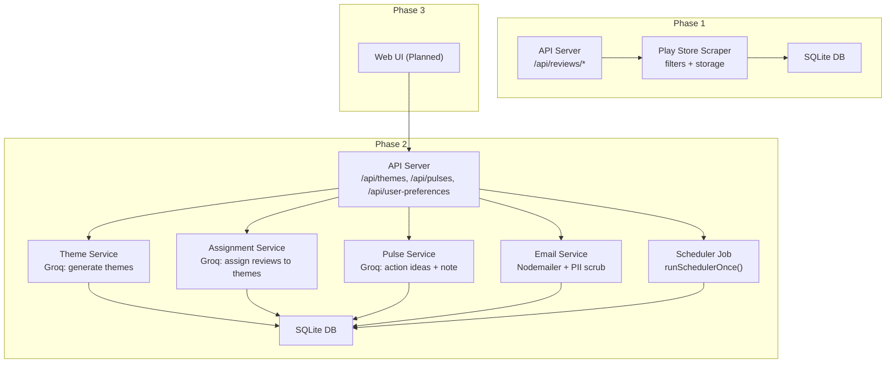
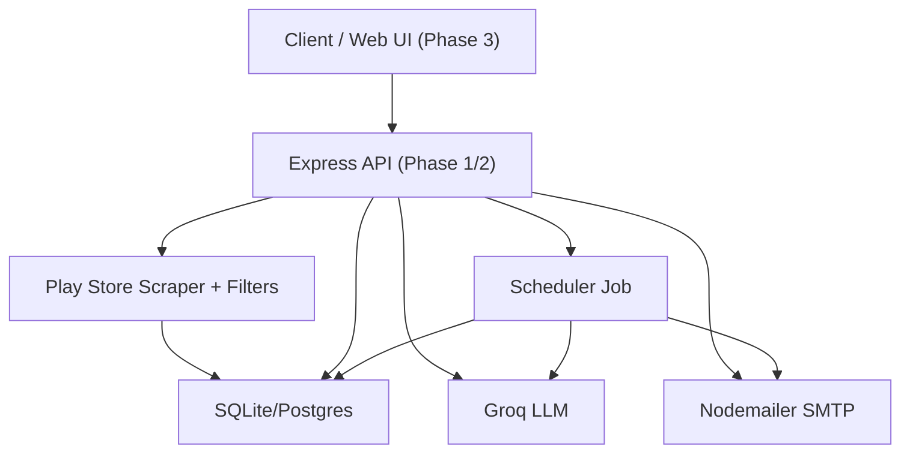
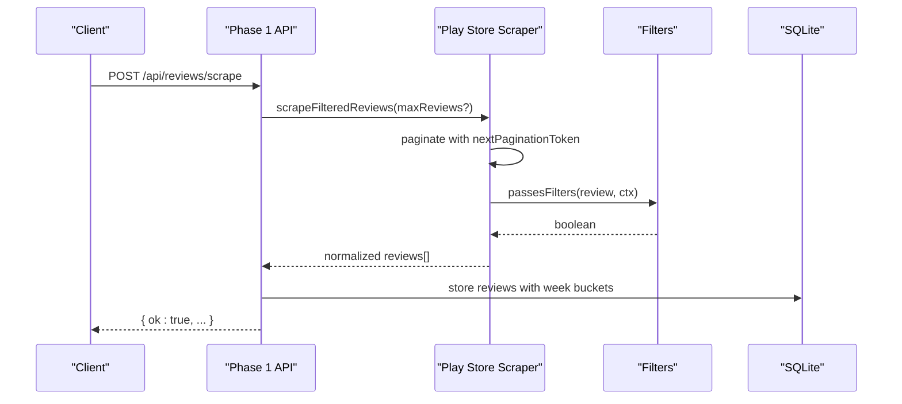
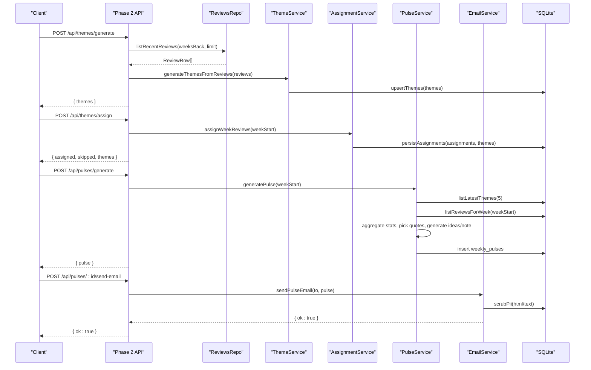
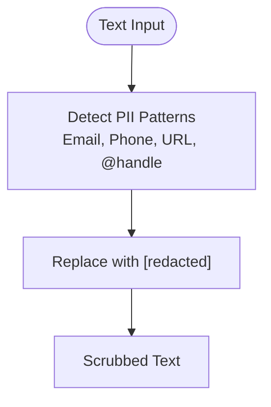
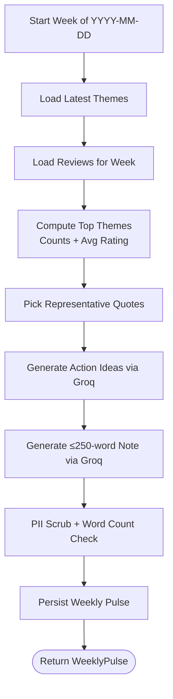
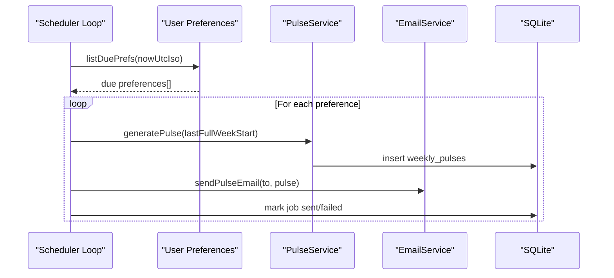
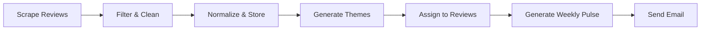
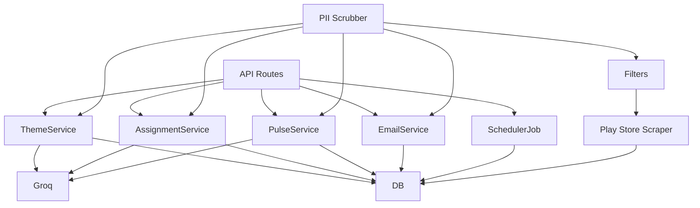

# Project Overview

<cite>
**Referenced Files in This Document**
- [phase-1/src/api/server.ts](file://phase-1/src/api/server.ts)
- [phase-1/src/scraper/playstoreScraper.ts](file://phase-1/src/scraper/playstoreScraper.ts)
- [phase-1/src/scraper/filters.ts](file://phase-1/src/scraper/filters.ts)
- [phase-1/src/domain/review.model.ts](file://phase-1/src/domain/review.model.ts)
- [phase-2/src/api/server.ts](file://phase-2/src/api/server.ts)
- [phase-2/src/services/themeService.ts](file://phase-2/src/services/themeService.ts)
- [phase-2/src/services/assignmentService.ts](file://phase-2/src/services/assignmentService.ts)
- [phase-2/src/services/pulseService.ts](file://phase-2/src/services/pulseService.ts)
- [phase-2/src/services/reviewsRepo.ts](file://phase-2/src/services/reviewsRepo.ts)
- [phase-2/src/services/emailService.ts](file://phase-2/src/services/emailService.ts)
- [phase-2/src/services/piiScrubber.ts](file://phase-2/src/services/piiScrubber.ts)
- [phase-2/src/jobs/schedulerJob.ts](file://phase-2/src/jobs/schedulerJob.ts)
- [phase-2/src/db/index.ts](file://phase-2/src/db/index.ts)
- [phase-2/scripts/runPulsePipeline.ts](file://phase-2/scripts/runPulsePipeline.ts)
- [ARCHITECTURE.md](file://ARCHITECTURE.md)
</cite>

## Table of Contents
1. [Introduction](#introduction)
2. [Project Structure](#project-structure)
3. [Core Components](#core-components)
4. [Architecture Overview](#architecture-overview)
5. [Detailed Component Analysis](#detailed-component-analysis)
6. [Dependency Analysis](#dependency-analysis)
7. [Performance Considerations](#performance-considerations)
8. [Troubleshooting Guide](#troubleshooting-guide)
9. [Conclusion](#conclusion)
10. [Appendices](#appendices)

## Introduction
The Groww App Review Insights Analyzer is an automated platform designed to collect public Google Play Store reviews for the Groww app, apply multi-layered filtering, generate AI-powered themes, and produce weekly insights reports called the “weekly pulse.” The system follows a three-phase implementation approach:
- Phase 1: Basic scraping, filtering, normalization, and storage.
- Phase 2: LLM-driven theme generation, review-to-theme assignment, weekly pulse creation, and email orchestration.
- Phase 3: Web UI and scheduled delivery (planned).

The platform emphasizes privacy by performing PII scrubbing at multiple stages and ensures reliable operation through structured APIs, transactional persistence, and a scheduler that delivers the weekly pulse according to user preferences.

## Project Structure
The repository is organized into three major phases:
- phase-1: Core scraping and filtering with a minimal API and SQLite storage.
- phase-2: LLM integration (Groq), theme management, weekly pulse generation, scheduling, and email delivery.
- phase-3: Web UI and automation (planned).

**Diagram sources**
- [phase-1/src/api/server.ts:1-50](file://phase-1/src/api/server.ts#L1-L50)
- [phase-1/src/scraper/playstoreScraper.ts:1-153](file://phase-1/src/scraper/playstoreScraper.ts#L1-L153)
- [phase-2/src/api/server.ts:1-266](file://phase-2/src/api/server.ts#L1-L266)
- [phase-2/src/services/themeService.ts:1-68](file://phase-2/src/services/themeService.ts#L1-L68)
- [phase-2/src/services/assignmentService.ts:1-114](file://phase-2/src/services/assignmentService.ts#L1-L114)
- [phase-2/src/services/pulseService.ts:1-265](file://phase-2/src/services/pulseService.ts#L1-L265)
- [phase-2/src/services/emailService.ts:1-142](file://phase-2/src/services/emailService.ts#L1-L142)
- [phase-2/src/jobs/schedulerJob.ts:1-98](file://phase-2/src/jobs/schedulerJob.ts#L1-L98)
- [phase-2/src/db/index.ts:1-93](file://phase-2/src/db/index.ts#L1-L93)

**Section sources**
- [phase-1/src/api/server.ts:1-50](file://phase-1/src/api/server.ts#L1-L50)
- [phase-2/src/api/server.ts:1-266](file://phase-2/src/api/server.ts#L1-L266)
- [ARCHITECTURE.md:44-84](file://ARCHITECTURE.md#L44-L84)

## Core Components
- API Layer (Phase 1 and Phase 2):
  - Exposes endpoints for scraping reviews, listing stored reviews, generating themes, assigning themes to weekly reviews, generating weekly pulses, managing user preferences, and sending test emails.
- Scraper and Filters (Phase 1):
  - Collects reviews from Google Play, applies strict filtering rules, and normalizes data for storage.
- Theme Service (Phase 2):
  - Uses Groq to propose 3–5 themes from recent reviews and persists them.
- Assignment Service (Phase 2):
  - Assigns each review to a theme (or “Other”) using Groq and stores mappings.
- Pulse Service (Phase 2):
  - Aggregates weekly stats, selects top themes, picks representative quotes, generates action ideas and a concise weekly note, and stores the weekly pulse.
- Email Service (Phase 2):
  - Builds HTML/text email bodies and sends them via SMTP after PII scrubbing.
- Scheduler (Phase 2):
  - Periodically checks due user preferences, generates the weekly pulse, and sends emails.
- Persistence (Phase 2):
  - SQLite schema for themes, review-themes mappings, weekly pulses, user preferences, and scheduled jobs.

**Section sources**
- [phase-1/src/api/server.ts:1-50](file://phase-1/src/api/server.ts#L1-L50)
- [phase-2/src/api/server.ts:1-266](file://phase-2/src/api/server.ts#L1-L266)
- [phase-2/src/services/themeService.ts:1-68](file://phase-2/src/services/themeService.ts#L1-L68)
- [phase-2/src/services/assignmentService.ts:1-114](file://phase-2/src/services/assignmentService.ts#L1-L114)
- [phase-2/src/services/pulseService.ts:1-265](file://phase-2/src/services/pulseService.ts#L1-L265)
- [phase-2/src/services/emailService.ts:1-142](file://phase-2/src/services/emailService.ts#L1-L142)
- [phase-2/src/jobs/schedulerJob.ts:1-98](file://phase-2/src/jobs/schedulerJob.ts#L1-L98)
- [phase-2/src/db/index.ts:1-93](file://phase-2/src/db/index.ts#L1-L93)

## Architecture Overview
The system is built with Node.js and TypeScript, using:
- Express for REST APIs
- SQLite for local development and Postgres for production
- Groq for LLM-based theme generation, assignment, and insight synthesis
- Nodemailer for SMTP-based email delivery

**Diagram sources**
- [phase-1/src/scraper/playstoreScraper.ts:1-153](file://phase-1/src/scraper/playstoreScraper.ts#L1-L153)
- [phase-2/src/services/themeService.ts:1-68](file://phase-2/src/services/themeService.ts#L1-L68)
- [phase-2/src/services/assignmentService.ts:1-114](file://phase-2/src/services/assignmentService.ts#L1-L114)
- [phase-2/src/services/pulseService.ts:1-265](file://phase-2/src/services/pulseService.ts#L1-L265)
- [phase-2/src/services/emailService.ts:1-142](file://phase-2/src/services/emailService.ts#L1-L142)
- [phase-2/src/jobs/schedulerJob.ts:1-98](file://phase-2/src/jobs/schedulerJob.ts#L1-L98)
- [phase-2/src/db/index.ts:1-93](file://phase-2/src/db/index.ts#L1-L93)

## Detailed Component Analysis

### Phase 1: Scraping, Filtering, and Storage
- Purpose: Collect public Play Store reviews, apply multi-layered filtering, and store normalized data.
- Key responsibilities:
  - Scrape reviews using google-play-scraper with pagination and sorting by newest.
  - Enforce filtering rules: word count threshold, emoji removal, email/phone number removal, duplicate detection.
  - Normalize and store reviews with week buckets and cleaned text.
- Endpoints:
  - POST /api/reviews/scrape: trigger scraping with optional maxReviews.
  - GET /api/reviews: list stored reviews with optional limit.
- Data model:
  - Review interface includes platform, rating, title, text, cleanText, timestamps, and week boundaries.

**Diagram sources**
- [phase-1/src/api/server.ts:9-32](file://phase-1/src/api/server.ts#L9-L32)
- [phase-1/src/scraper/playstoreScraper.ts:13-151](file://phase-1/src/scraper/playstoreScraper.ts#L13-L151)
- [phase-1/src/scraper/filters.ts:16-48](file://phase-1/src/scraper/filters.ts#L16-L48)
- [phase-1/src/domain/review.model.ts:1-14](file://phase-1/src/domain/review.model.ts#L1-L14)

**Section sources**
- [phase-1/src/api/server.ts:1-50](file://phase-1/src/api/server.ts#L1-L50)
- [phase-1/src/scraper/playstoreScraper.ts:1-153](file://phase-1/src/scraper/playstoreScraper.ts#L1-L153)
- [phase-1/src/scraper/filters.ts:1-59](file://phase-1/src/scraper/filters.ts#L1-L59)
- [phase-1/src/domain/review.model.ts:1-14](file://phase-1/src/domain/review.model.ts#L1-L14)

### Phase 2: LLM Integration, Theme Assignment, Weekly Pulse, and Email Delivery
- Purpose: Transform stored reviews into actionable insights using Groq, assign themes, and deliver a weekly pulse via email.
- Key responsibilities:
  - Generate themes from recent reviews and upsert into the database.
  - Assign each review to a theme for a given week using Groq.
  - Generate weekly pulse content: top themes, quotes, action ideas, and a concise note.
  - Send pulse emails and track job outcomes.
- Endpoints:
  - POST /api/themes/generate: generate and store themes.
  - POST /api/themes/assign: assign themes to a week’s reviews.
  - POST /api/pulses/generate: generate a weekly pulse.
  - GET /api/pulses, GET /api/pulses/:id, POST /api/pulses/:id/send-email: manage and send pulses.
  - POST /api/user-preferences, GET /api/user-preferences: manage user delivery preferences.
  - POST /api/email/test: verify SMTP configuration.
- Data model:
  - ReviewRow for normalized DB rows.
  - WeeklyPulse for persisted pulse objects.
  - Theme definitions and assignments.

**Diagram sources**
- [phase-2/src/api/server.ts:28-154](file://phase-2/src/api/server.ts#L28-L154)
- [phase-2/src/services/reviewsRepo.ts:1-26](file://phase-2/src/services/reviewsRepo.ts#L1-L26)
- [phase-2/src/services/themeService.ts:17-68](file://phase-2/src/services/themeService.ts#L17-L68)
- [phase-2/src/services/assignmentService.ts:27-114](file://phase-2/src/services/assignmentService.ts#L27-L114)
- [phase-2/src/services/pulseService.ts:176-265](file://phase-2/src/services/pulseService.ts#L176-L265)
- [phase-2/src/services/emailService.ts:114-142](file://phase-2/src/services/emailService.ts#L114-L142)
- [phase-2/src/db/index.ts:7-91](file://phase-2/src/db/index.ts#L7-L91)

**Section sources**
- [phase-2/src/api/server.ts:1-266](file://phase-2/src/api/server.ts#L1-L266)
- [phase-2/src/services/themeService.ts:1-68](file://phase-2/src/services/themeService.ts#L1-L68)
- [phase-2/src/services/assignmentService.ts:1-114](file://phase-2/src/services/assignmentService.ts#L1-L114)
- [phase-2/src/services/pulseService.ts:1-265](file://phase-2/src/services/pulseService.ts#L1-L265)
- [phase-2/src/services/emailService.ts:1-142](file://phase-2/src/services/emailService.ts#L1-L142)
- [phase-2/src/db/index.ts:1-93](file://phase-2/src/db/index.ts#L1-L93)

### PII Scrubbing and Privacy
- Purpose: Ensure no personally identifiable information is retained or transmitted.
- Implementation:
  - Regex-based scrubber removes emails, phone numbers (including Indian and international formats), URLs, and @handles.
  - Applied during cleaning, before LLM calls, and before storing or sending emails.
- Usage:
  - Used in filters (basicCleanText), theme/assignment prompts, and email building.

**Diagram sources**
- [phase-1/src/scraper/filters.ts:50-59](file://phase-1/src/scraper/filters.ts#L50-L59)
- [phase-2/src/services/piiScrubber.ts:1-29](file://phase-2/src/services/piiScrubber.ts#L1-L29)

**Section sources**
- [phase-1/src/scraper/filters.ts:1-59](file://phase-1/src/scraper/filters.ts#L1-L59)
- [phase-2/src/services/piiScrubber.ts:1-29](file://phase-2/src/services/piiScrubber.ts#L1-L29)

### Weekly Pulse Generation Workflow
- Steps:
  - Load latest themes and week’s reviews.
  - Aggregate per-theme stats and select top 3.
  - Pick representative quotes per theme.
  - Generate action ideas and a concise weekly note (≤250 words).
  - Store the pulse and return it.
- Validation:
  - Zod schemas enforce structure and length constraints.
  - Optional second pass to enforce word limits.

**Diagram sources**
- [phase-2/src/services/pulseService.ts:176-265](file://phase-2/src/services/pulseService.ts#L176-L265)

**Section sources**
- [phase-2/src/services/pulseService.ts:1-265](file://phase-2/src/services/pulseService.ts#L1-L265)

### Scheduler and Automated Delivery
- Responsibilities:
  - Determine the last full week (UTC), find due user preferences, generate the pulse, send email, and record job status.
  - Runs periodically (default every 5 minutes) and can be started conditionally based on Groq API key presence.
- Integration:
  - Uses user preferences, weekly pulse service, and email service.

**Diagram sources**
- [phase-2/src/jobs/schedulerJob.ts:52-98](file://phase-2/src/jobs/schedulerJob.ts#L52-L98)
- [phase-2/src/services/pulseService.ts:176-265](file://phase-2/src/services/pulseService.ts#L176-L265)
- [phase-2/src/services/emailService.ts:114-142](file://phase-2/src/services/emailService.ts#L114-L142)

**Section sources**
- [phase-2/src/jobs/schedulerJob.ts:1-98](file://phase-2/src/jobs/schedulerJob.ts#L1-L98)

### End-to-End Data Flow
- From scraping to weekly pulse delivery:
  - Scrape → Filter → Normalize → Store → Generate Themes → Assign → Weekly Pulse → Email.

**Diagram sources**
- [phase-1/src/scraper/playstoreScraper.ts:13-151](file://phase-1/src/scraper/playstoreScraper.ts#L13-L151)
- [phase-2/src/services/themeService.ts:17-68](file://phase-2/src/services/themeService.ts#L17-L68)
- [phase-2/src/services/assignmentService.ts:27-114](file://phase-2/src/services/assignmentService.ts#L27-L114)
- [phase-2/src/services/pulseService.ts:176-265](file://phase-2/src/services/pulseService.ts#L176-L265)
- [phase-2/src/services/emailService.ts:114-142](file://phase-2/src/services/emailService.ts#L114-L142)

**Section sources**
- [ARCHITECTURE.md:87-141](file://ARCHITECTURE.md#L87-L141)

## Dependency Analysis
- Internal dependencies:
  - API routes depend on services (theme, assignment, pulse, email, scheduler).
  - Services depend on repositories (reviewsRepo) and the database.
  - PII scrubbing is reused across filters, LLM prompts, and email building.
- External dependencies:
  - google-play-scraper for scraping.
  - Groq for LLM tasks.
  - Nodemailer for SMTP.
  - better-sqlite3 for local persistence.

**Diagram sources**
- [phase-2/src/api/server.ts:6-13](file://phase-2/src/api/server.ts#L6-L13)
- [phase-2/src/services/themeService.ts:1-68](file://phase-2/src/services/themeService.ts#L1-L68)
- [phase-2/src/services/assignmentService.ts:1-114](file://phase-2/src/services/assignmentService.ts#L1-L114)
- [phase-2/src/services/pulseService.ts:1-265](file://phase-2/src/services/pulseService.ts#L1-L265)
- [phase-2/src/services/emailService.ts:1-142](file://phase-2/src/services/emailService.ts#L1-L142)
- [phase-2/src/jobs/schedulerJob.ts:1-98](file://phase-2/src/jobs/schedulerJob.ts#L1-L98)
- [phase-1/src/scraper/playstoreScraper.ts:1-153](file://phase-1/src/scraper/playstoreScraper.ts#L1-L153)
- [phase-1/src/scraper/filters.ts:1-59](file://phase-1/src/scraper/filters.ts#L1-L59)
- [phase-2/src/services/piiScrubber.ts:1-29](file://phase-2/src/services/piiScrubber.ts#L1-L29)

**Section sources**
- [phase-2/src/db/index.ts:1-93](file://phase-2/src/db/index.ts#L1-L93)
- [phase-2/src/services/reviewsRepo.ts:1-26](file://phase-2/src/services/reviewsRepo.ts#L1-L26)

## Performance Considerations
- Token efficiency:
  - Batch Groq calls and limit review text lengths to reduce cost and latency.
- Idempotency:
  - Upsert themes and assignments to avoid redundant work across runs.
- Scheduling cadence:
  - Default 5-minute intervals balance freshness and cost.
- Observability:
  - Log scraping metrics, Groq latencies, and email delivery statuses.

[No sources needed since this section provides general guidance]

## Troubleshooting Guide
- Common issues and remedies:
  - Missing GROQ_API_KEY: Scheduler does not start automatically; configure the key to enable automatic pulse delivery.
  - SMTP misconfiguration: Use POST /api/email/test to validate credentials and ports.
  - No themes found: Ensure POST /api/themes/generate was executed after scraping.
  - No reviews for a week: Ensure theme assignment has run for that week.
  - PII leakage concerns: Verify PII scrubbing is applied in filters, prompts, and email builds.

**Section sources**
- [phase-2/src/api/server.ts:257-262](file://phase-2/src/api/server.ts#L257-L262)
- [phase-2/src/services/emailService.ts:132-142](file://phase-2/src/services/emailService.ts#L132-L142)
- [phase-2/src/services/pulseService.ts:179-188](file://phase-2/src/services/pulseService.ts#L179-L188)
- [phase-2/src/services/assignmentService.ts:102-113](file://phase-2/src/services/assignmentService.ts#L102-L113)

## Conclusion
The Groww App Review Insights Analyzer provides a robust, privacy-focused pipeline from scraped Play Store reviews to AI-generated weekly insights. Phase 1 establishes a reliable foundation; Phase 2 adds LLM-driven theme discovery, assignment, and pulse generation with automated delivery. The system’s modular design, strong privacy controls, and observability make it suitable for iterative enhancements in Phase 3, including a web UI and expanded automation.

[No sources needed since this section summarizes without analyzing specific files]

## Appendices

### Technology Stack
- Backend: Node.js, TypeScript
- Web Framework: Express
- Persistence: SQLite (local), Postgres (production)
- LLM: Groq
- Email: Nodemailer + SMTP
- Utilities: better-sqlite3, zod, dotenv

**Section sources**
- [phase-2/src/db/index.ts:1-93](file://phase-2/src/db/index.ts#L1-L93)
- [phase-2/src/services/themeService.ts:1-68](file://phase-2/src/services/themeService.ts#L1-L68)
- [phase-2/src/services/pulseService.ts:1-265](file://phase-2/src/services/pulseService.ts#L1-L265)
- [phase-2/src/services/emailService.ts:1-142](file://phase-2/src/services/emailService.ts#L1-L142)

### Three-Phase Implementation Approach
- Phase 1: Scraping, filtering, normalization, and storage.
- Phase 2: LLM integration, theme assignment, weekly pulse generation, and email orchestration.
- Phase 3: Web UI and scheduled delivery.

**Section sources**
- [ARCHITECTURE.md:44-84](file://ARCHITECTURE.md#L44-L84)

### End-to-End Pipeline Script
- A script demonstrates the full pipeline from theme generation to email delivery for a selected week.

**Section sources**
- [phase-2/scripts/runPulsePipeline.ts:1-52](file://phase-2/scripts/runPulsePipeline.ts#L1-L52)