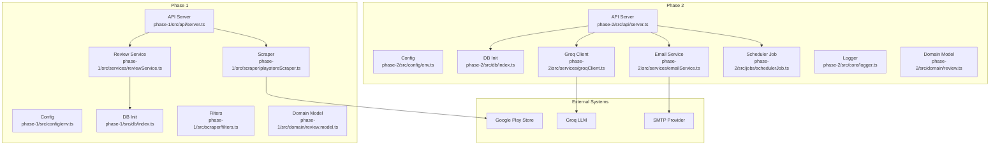
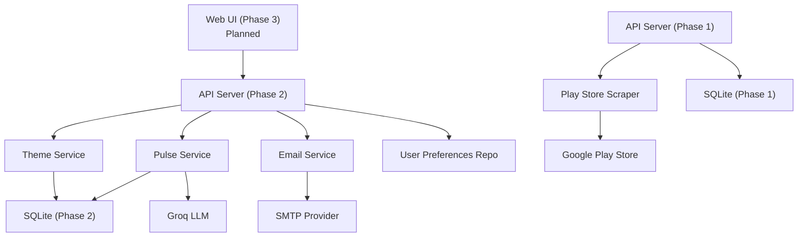
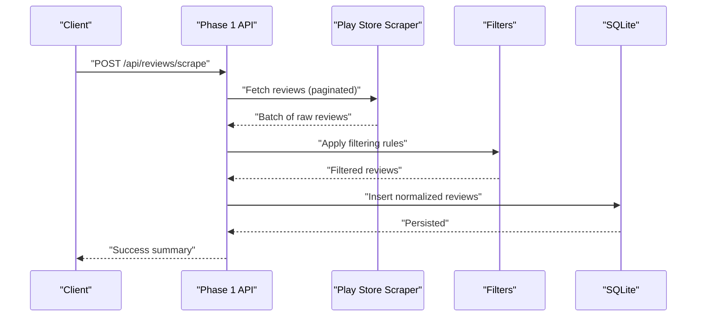
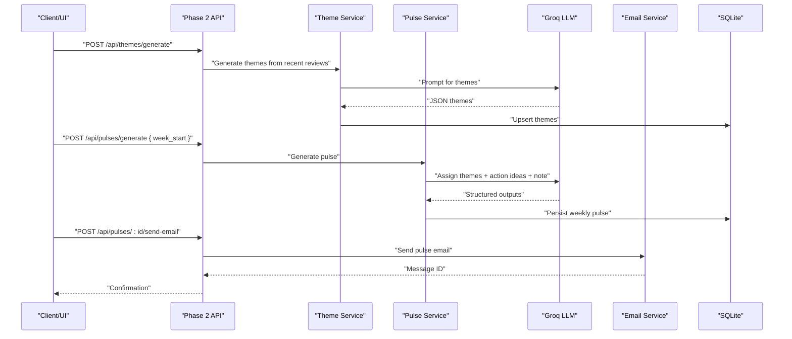
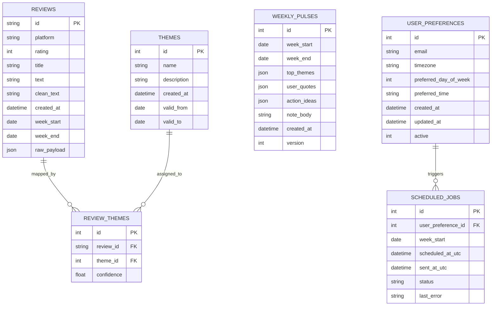
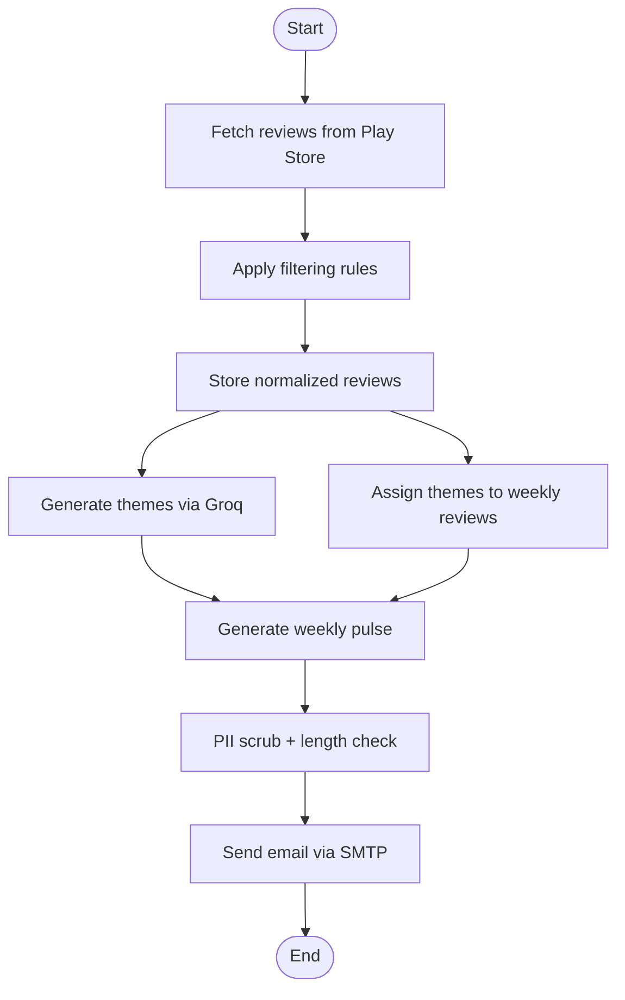
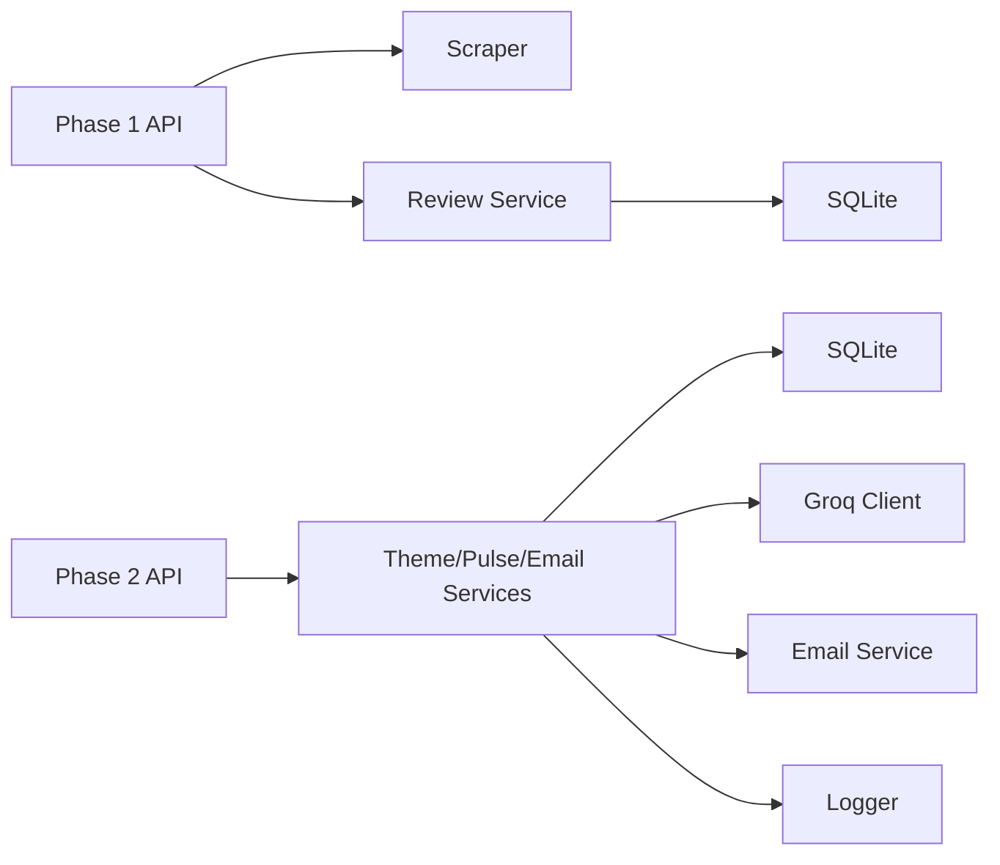

# System Architecture

<cite>
**Referenced Files in This Document**
- [ARCHITECTURE.md](file://ARCHITECTURE.md)
- [phase-1/src/api/server.ts](file://phase-1/src/api/server.ts)
- [phase-2/src/api/server.ts](file://phase-2/src/api/server.ts)
- [phase-1/src/config/env.ts](file://phase-1/src/config/env.ts)
- [phase-2/src/config/env.ts](file://phase-2/src/config/env.ts)
- [phase-1/src/db/index.ts](file://phase-1/src/db/index.ts)
- [phase-2/src/db/index.ts](file://phase-2/src/db/index.ts)
- [phase-1/src/domain/review.model.ts](file://phase-1/src/domain/review.model.ts)
- [phase-2/src/domain/review.ts](file://phase-2/src/domain/review.ts)
- [phase-1/src/services/reviewService.ts](file://phase-1/src/services/reviewService.ts)
- [phase-1/src/scraper/playstoreScraper.ts](file://phase-1/src/scraper/playstoreScraper.ts)
- [phase-1/src/scraper/filters.ts](file://phase-1/src/scraper/filters.ts)
- [phase-2/src/services/groqClient.ts](file://phase-2/src/services/groqClient.ts)
- [phase-2/src/services/emailService.ts](file://phase-2/src/services/emailService.ts)
- [phase-2/src/jobs/schedulerJob.ts](file://phase-2/src/jobs/schedulerJob.ts)
- [phase-2/src/core/logger.ts](file://phase-2/src/core/logger.ts)
</cite>

## Table of Contents
1. [Introduction](#introduction)
2. [Project Structure](#project-structure)
3. [Core Components](#core-components)
4. [Architecture Overview](#architecture-overview)
5. [Detailed Component Analysis](#detailed-component-analysis)
6. [Dependency Analysis](#dependency-analysis)
7. [Performance Considerations](#performance-considerations)
8. [Troubleshooting Guide](#troubleshooting-guide)
9. [Conclusion](#conclusion)
10. [Appendices](#appendices)

## Introduction
This document describes the end-to-end architecture of the Groww App Review Insights Analyzer. The system ingests public Google Play Store reviews for the Groww Android app, normalizes and filters them, stores them in a lightweight relational database, orchestrates Groq LLM calls to discover themes and generate weekly insights, and optionally emails a weekly pulse to configured recipients. The solution is implemented in three phases:
- Phase 1: Scraping, filtering, and storage (SQLite).
- Phase 2: LLM orchestration, weekly pulse generation, and email sending (SQLite extended with additional tables).
- Phase 3: Web UI to trigger actions and manage preferences (planned).

The system emphasizes privacy by removing PII, observability through structured logs, and reliability via retries and graceful degradation.

## Project Structure
The repository is organized into three top-level folders, each representing a phase of development. Each phase contains its own Node.js/TypeScript project with a dedicated API server, configuration, database initialization, domain models, services, and tests.

**Diagram sources**
- [phase-1/src/api/server.ts:1-50](file://phase-1/src/api/server.ts#L1-L50)
- [phase-2/src/api/server.ts:1-266](file://phase-2/src/api/server.ts#L1-L266)
- [phase-1/src/scraper/playstoreScraper.ts:1-153](file://phase-1/src/scraper/playstoreScraper.ts#L1-L153)
- [phase-1/src/services/reviewService.ts:1-101](file://phase-1/src/services/reviewService.ts#L1-L101)
- [phase-1/src/db/index.ts:1-31](file://phase-1/src/db/index.ts#L1-L31)
- [phase-2/src/db/index.ts:1-93](file://phase-2/src/db/index.ts#L1-L93)
- [phase-2/src/services/groqClient.ts:1-67](file://phase-2/src/services/groqClient.ts#L1-L67)
- [phase-2/src/services/emailService.ts:1-142](file://phase-2/src/services/emailService.ts#L1-L142)
- [phase-2/src/jobs/schedulerJob.ts:1-98](file://phase-2/src/jobs/schedulerJob.ts#L1-L98)
- [phase-2/src/core/logger.ts:1-21](file://phase-2/src/core/logger.ts#L1-L21)

**Section sources**
- [ARCHITECTURE.md:44-83](file://ARCHITECTURE.md#L44-L83)

## Core Components
- Presentation layer (Express API):
  - Phase 1 exposes endpoints to trigger scraping and list stored reviews.
  - Phase 2 exposes endpoints to generate themes, assign themes to weekly reviews, generate weekly pulses, send emails, and manage user preferences.
- Business logic layer (service classes):
  - Review ingestion and filtering pipeline.
  - Theme discovery and assignment via Groq.
  - Weekly pulse generation and PII scrubbing.
  - Email composition and dispatch.
  - Scheduler for automated pulse delivery.
- Data access layer (SQLite):
  - Phase 1: reviews table with indexes.
  - Phase 2: themes, review_themes, weekly_pulses, user_preferences, scheduled_jobs tables with appropriate constraints and indexes.
- Integration layer:
  - Google Play Store scraper for public reviews.
  - Groq chat completions for theme discovery and insights.
  - SMTP provider for email delivery.

**Section sources**
- [phase-1/src/api/server.ts:1-50](file://phase-1/src/api/server.ts#L1-L50)
- [phase-2/src/api/server.ts:1-266](file://phase-2/src/api/server.ts#L1-L266)
- [phase-1/src/db/index.ts:1-31](file://phase-1/src/db/index.ts#L1-L31)
- [phase-2/src/db/index.ts:1-93](file://phase-2/src/db/index.ts#L1-L93)
- [phase-2/src/services/groqClient.ts:1-67](file://phase-2/src/services/groqClient.ts#L1-L67)
- [phase-2/src/services/emailService.ts:1-142](file://phase-2/src/services/emailService.ts#L1-L142)
- [phase-2/src/jobs/schedulerJob.ts:1-98](file://phase-2/src/jobs/schedulerJob.ts#L1-L98)

## Architecture Overview
The system follows a layered architecture:
- Presentation: Express servers per phase.
- Application: Service classes encapsulate business logic.
- Persistence: SQLite database shared between phases (Phase 2 schema extends Phase 1).
- Integration: External APIs for Play Store, Groq, and SMTP.

**Diagram sources**
- [phase-2/src/api/server.ts:1-266](file://phase-2/src/api/server.ts#L1-L266)
- [phase-1/src/api/server.ts:1-50](file://phase-1/src/api/server.ts#L1-L50)
- [phase-1/src/scraper/playstoreScraper.ts:1-153](file://phase-1/src/scraper/playstoreScraper.ts#L1-L153)
- [phase-2/src/services/emailService.ts:1-142](file://phase-2/src/services/emailService.ts#L1-L142)
- [phase-2/src/services/groqClient.ts:1-67](file://phase-2/src/services/groqClient.ts#L1-L67)
- [phase-2/src/db/index.ts:1-93](file://phase-2/src/db/index.ts#L1-L93)
- [phase-1/src/db/index.ts:1-31](file://phase-1/src/db/index.ts#L1-L31)

## Detailed Component Analysis

### Phase 1: Scraping, Filtering, and Storage
- Responsibilities:
  - Scrape public reviews from Google Play Store for the Groww app.
  - Apply filtering rules to remove short, emoji-containing, PII-bearing, and duplicate reviews.
  - Normalize and store reviews in SQLite with week buckets.
- Key modules:
  - API server exposes scraping and listing endpoints.
  - Scraper integrates with the Play Store library and paginates until sufficient coverage.
  - Filters enforce thresholds and regex-based checks.
  - Service persists reviews and writes a debug JSON file.
  - Domain model defines the internal review shape.

**Diagram sources**
- [phase-1/src/api/server.ts:9-32](file://phase-1/src/api/server.ts#L9-L32)
- [phase-1/src/scraper/playstoreScraper.ts:13-151](file://phase-1/src/scraper/playstoreScraper.ts#L13-L151)
- [phase-1/src/scraper/filters.ts:16-48](file://phase-1/src/scraper/filters.ts#L16-L48)
- [phase-1/src/services/reviewService.ts:10-75](file://phase-1/src/services/reviewService.ts#L10-L75)
- [phase-1/src/db/index.ts:7-29](file://phase-1/src/db/index.ts#L7-L29)

**Section sources**
- [phase-1/src/api/server.ts:1-50](file://phase-1/src/api/server.ts#L1-L50)
- [phase-1/src/scraper/playstoreScraper.ts:1-153](file://phase-1/src/scraper/playstoreScraper.ts#L1-L153)
- [phase-1/src/scraper/filters.ts:1-59](file://phase-1/src/scraper/filters.ts#L1-L59)
- [phase-1/src/services/reviewService.ts:1-101](file://phase-1/src/services/reviewService.ts#L1-L101)
- [phase-1/src/db/index.ts:1-31](file://phase-1/src/db/index.ts#L1-L31)
- [phase-1/src/domain/review.model.ts:1-14](file://phase-1/src/domain/review.model.ts#L1-L14)

### Phase 2: LLM Orchestration, Pulse Generation, and Email
- Responsibilities:
  - Generate themes from recent reviews using Groq.
  - Assign themes to weekly reviews.
  - Generate weekly pulses with top themes, quotes, action ideas, and a concise note.
  - Send emails via SMTP with PII scrubbing.
  - Schedule automated pulse delivery based on user preferences.
- Key modules:
  - API server exposes endpoints for themes, pulses, email, and preferences.
  - Groq client wraps LLM calls with retries and JSON extraction.
  - Email service builds HTML/text bodies and sends via SMTP.
  - Scheduler periodically checks due preferences and triggers generation and sending.
  - Logger centralizes info and error logs.

**Diagram sources**
- [phase-2/src/api/server.ts:28-154](file://phase-2/src/api/server.ts#L28-L154)
- [phase-2/src/services/groqClient.ts:30-67](file://phase-2/src/services/groqClient.ts#L30-L67)
- [phase-2/src/services/emailService.ts:114-141](file://phase-2/src/services/emailService.ts#L114-L141)
- [phase-2/src/db/index.ts:7-91](file://phase-2/src/db/index.ts#L7-L91)

**Section sources**
- [phase-2/src/api/server.ts:1-266](file://phase-2/src/api/server.ts#L1-L266)
- [phase-2/src/services/groqClient.ts:1-67](file://phase-2/src/services/groqClient.ts#L1-L67)
- [phase-2/src/services/emailService.ts:1-142](file://phase-2/src/services/emailService.ts#L1-L142)
- [phase-2/src/jobs/schedulerJob.ts:1-98](file://phase-2/src/jobs/schedulerJob.ts#L1-L98)
- [phase-2/src/core/logger.ts:1-21](file://phase-2/src/core/logger.ts#L1-L21)
- [phase-2/src/db/index.ts:1-93](file://phase-2/src/db/index.ts#L1-L93)
- [phase-2/src/domain/review.ts:1-12](file://phase-2/src/domain/review.ts#L1-L12)

### Data Models and Persistence
- Phase 1 schema focuses on normalized reviews with week buckets.
- Phase 2 extends the schema with themes, review-to-theme mappings, weekly pulses, user preferences, and scheduled jobs.

**Diagram sources**
- [phase-1/src/db/index.ts:7-29](file://phase-1/src/db/index.ts#L7-L29)
- [phase-2/src/db/index.ts:7-91](file://phase-2/src/db/index.ts#L7-L91)

**Section sources**
- [phase-1/src/db/index.ts:1-31](file://phase-1/src/db/index.ts#L1-L31)
- [phase-2/src/db/index.ts:1-93](file://phase-2/src/db/index.ts#L1-L93)

### Integration Patterns
- Google Play Store:
  - Paginated retrieval ordered by newest; fallback to minimally cleaned reviews if filtering is too aggressive.
- Groq:
  - Structured JSON prompts with schema hints; robust parsing and retry logic.
- SMTP:
  - Nodemailer transport configured via environment variables; test endpoint validates configuration.

**Diagram sources**
- [phase-1/src/scraper/playstoreScraper.ts:13-151](file://phase-1/src/scraper/playstoreScraper.ts#L13-L151)
- [phase-1/src/scraper/filters.ts:16-48](file://phase-1/src/scraper/filters.ts#L16-L48)
- [phase-2/src/services/groqClient.ts:30-67](file://phase-2/src/services/groqClient.ts#L30-L67)
- [phase-2/src/services/emailService.ts:114-141](file://phase-2/src/services/emailService.ts#L114-L141)

**Section sources**
- [phase-1/src/scraper/playstoreScraper.ts:1-153](file://phase-1/src/scraper/playstoreScraper.ts#L1-L153)
- [phase-1/src/scraper/filters.ts:1-59](file://phase-1/src/scraper/filters.ts#L1-L59)
- [phase-2/src/services/groqClient.ts:1-67](file://phase-2/src/services/groqClient.ts#L1-L67)
- [phase-2/src/services/emailService.ts:1-142](file://phase-2/src/services/emailService.ts#L1-L142)

## Dependency Analysis
- Coupling:
  - Phase 1 depends on the scraper and filters; service layer encapsulates persistence.
  - Phase 2 depends on Groq client, email service, scheduler, and repositories; API orchestrates service calls.
- Cohesion:
  - Each service class has a single responsibility (e.g., theme generation, pulse creation, email sending).
- External dependencies:
  - Google Play Scraper, Groq SDK, Nodemailer, better-sqlite3.
- Configuration:
  - Environment variables for database path/port, Groq API key/model, and SMTP credentials.

**Diagram sources**
- [phase-1/src/api/server.ts:1-50](file://phase-1/src/api/server.ts#L1-L50)
- [phase-2/src/api/server.ts:1-266](file://phase-2/src/api/server.ts#L1-L266)
- [phase-1/src/services/reviewService.ts:1-101](file://phase-1/src/services/reviewService.ts#L1-L101)
- [phase-2/src/services/groqClient.ts:1-67](file://phase-2/src/services/groqClient.ts#L1-L67)
- [phase-2/src/services/emailService.ts:1-142](file://phase-2/src/services/emailService.ts#L1-L142)
- [phase-2/src/core/logger.ts:1-21](file://phase-2/src/core/logger.ts#L1-L21)
- [phase-1/src/db/index.ts:1-31](file://phase-1/src/db/index.ts#L1-L31)
- [phase-2/src/db/index.ts:1-93](file://phase-2/src/db/index.ts#L1-L93)

**Section sources**
- [phase-1/src/config/env.ts:1-6](file://phase-1/src/config/env.ts#L1-L6)
- [phase-2/src/config/env.ts:1-23](file://phase-2/src/config/env.ts#L1-L23)

## Performance Considerations
- Batch processing:
  - Scrape and filter in batches; persist via transactions to reduce I/O overhead.
  - Group reviews into batches for Groq calls to control token usage and cost.
- Indexing:
  - Use indexes on week_start and related foreign keys to speed up queries.
- Caching:
  - Reuse themes across the 8–12 week window to avoid redundant LLM calls.
- Observability:
  - Log metrics around scraped counts, filtered counts, Groq latency, and email send outcomes.

[No sources needed since this section provides general guidance]

## Troubleshooting Guide
- Logging:
  - Centralized logging functions capture info and error events with metadata for debugging.
- Error handling:
  - API routes wrap handlers with try/catch and return structured error responses.
  - Groq client retries with increasing temperature on subsequent attempts.
  - Scheduler records job status and last error for each user preference.
- Common issues:
  - Missing environment variables for SMTP or Groq will prevent email or LLM features.
  - Excessive filtering may yield zero reviews; the scraper falls back to minimally cleaned reviews.
  - Ensure database file path is writable and schema is initialized before use.

**Section sources**
- [phase-2/src/core/logger.ts:1-21](file://phase-2/src/core/logger.ts#L1-L21)
- [phase-2/src/api/server.ts:9-19](file://phase-2/src/api/server.ts#L9-L19)
- [phase-2/src/api/server.ts:28-43](file://phase-2/src/api/server.ts#L28-L43)
- [phase-2/src/services/groqClient.ts:35-65](file://phase-2/src/services/groqClient.ts#L35-L65)
- [phase-2/src/jobs/schedulerJob.ts:30-40](file://phase-2/src/jobs/schedulerJob.ts#L30-L40)

## Conclusion
The Groww App Review Insights Analyzer employs a phased, layered architecture that cleanly separates concerns across scraping, analytics, and delivery. By leveraging SQLite for persistence, Groq for insight generation, and SMTP for distribution, the system balances simplicity with scalability. Cross-cutting concerns like logging, error handling, and PII protection are integrated early to support maintainability and reliability.

[No sources needed since this section summarizes without analyzing specific files]

## Appendices

### Technology Stack and Decisions
- Runtime and language: Node.js with TypeScript for type safety and developer productivity.
- Web framework: Express for lightweight, straightforward API endpoints.
- Database: SQLite for prototype and local development; designed for easy migration to PostgreSQL in production.
- External integrations:
  - Google Play Scraper for public review ingestion.
  - Groq for structured theme discovery and insights.
  - Nodemailer for SMTP-based email delivery.
- Security:
  - Credentials stored in environment variables; no secrets in code.
  - PII scrubbing enforced at ingestion, LLM prompts, and email rendering stages.
- Scalability:
  - Modular services and batched processing enable horizontal scaling of workers.
  - Indexes and schema design support efficient querying over time windows.

**Section sources**
- [phase-1/src/config/env.ts:1-6](file://phase-1/src/config/env.ts#L1-L6)
- [phase-2/src/config/env.ts:1-23](file://phase-2/src/config/env.ts#L1-L23)
- [phase-2/src/services/groqClient.ts:1-67](file://phase-2/src/services/groqClient.ts#L1-L67)
- [phase-2/src/services/emailService.ts:1-142](file://phase-2/src/services/emailService.ts#L1-L142)
- [phase-2/src/db/index.ts:1-93](file://phase-2/src/db/index.ts#L1-L93)