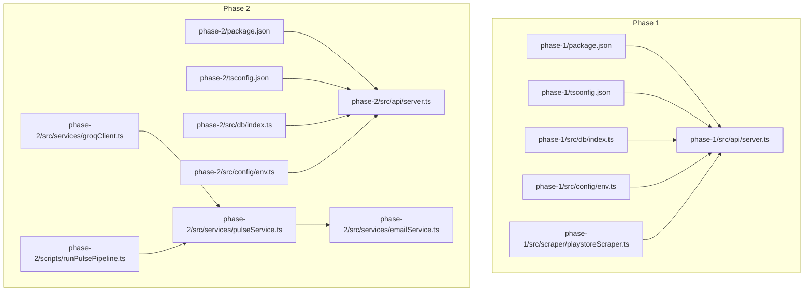
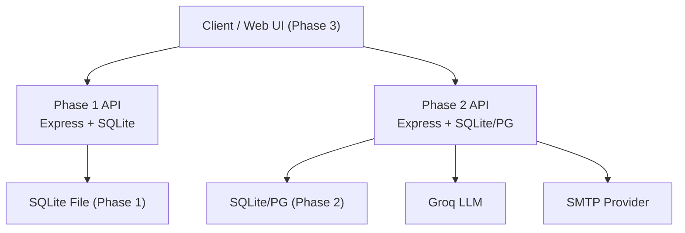
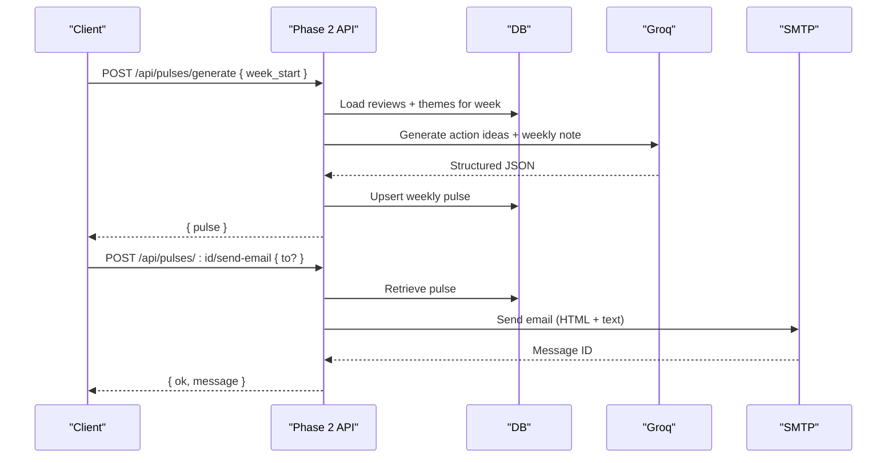
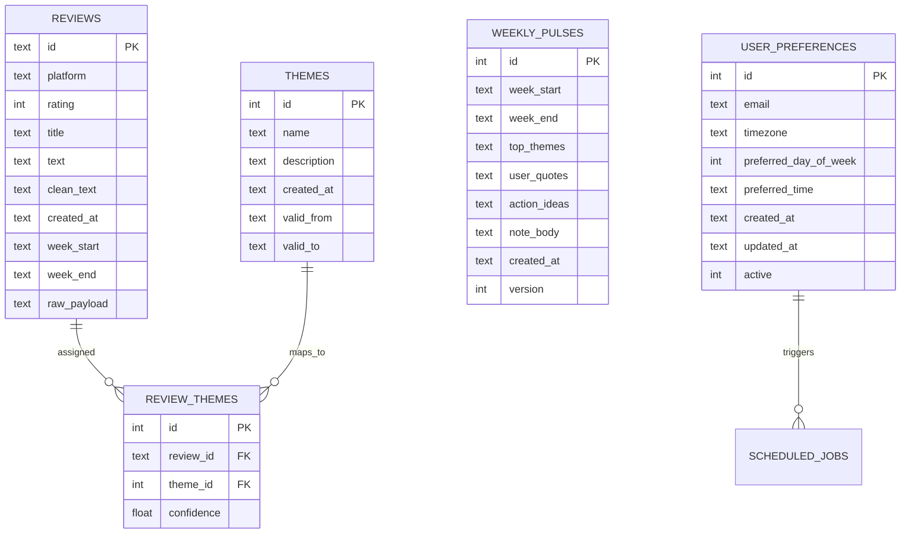
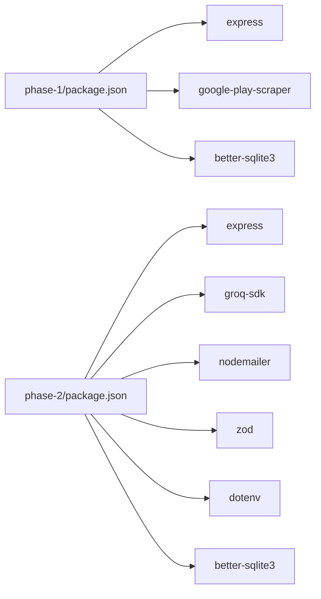

# Technology Stack

<cite>
**Referenced Files in This Document**
- [phase-1 package.json](file://phase-1/package.json)
- [phase-2 package.json](file://phase-2/package.json)
- [phase-1 tsconfig.json](file://phase-1/tsconfig.json)
- [phase-2 tsconfig.json](file://phase-2/tsconfig.json)
- [phase-1 src/api/server.ts](file://phase-1/src/api/server.ts)
- [phase-2 src/api/server.ts](file://phase-2/src/api/server.ts)
- [phase-1 src/config/env.ts](file://phase-1/src/config/env.ts)
- [phase-2 src/config/env.ts](file://phase-2/src/config/env.ts)
- [phase-1 src/db/index.ts](file://phase-1/src/db/index.ts)
- [phase-2 src/db/index.ts](file://phase-2/src/db/index.ts)
- [phase-1 src/scraper/playstoreScraper.ts](file://phase-1/src/scraper/playstoreScraper.ts)
- [phase-2 src/services/groqClient.ts](file://phase-2/src/services/groqClient.ts)
- [phase-2 src/services/pulseService.ts](file://phase-2/src/services/pulseService.ts)
- [phase-2 src/services/emailService.ts](file://phase-2/src/services/emailService.ts)
- [phase-2 scripts/runPulsePipeline.ts](file://phase-2/scripts/runPulsePipeline.ts)
- [phase-1 src/tests/filters.test.ts](file://phase-1/src/tests/filters.test.ts)
- [phase-2 src/tests/email.test.ts](file://phase-2/src/tests/email.test.ts)
- [ARCHITECTURE.md](file://ARCHITECTURE.md)
</cite>

## Table of Contents
1. [Introduction](#introduction)
2. [Project Structure](#project-structure)
3. [Core Components](#core-components)
4. [Architecture Overview](#architecture-overview)
5. [Detailed Component Analysis](#detailed-component-analysis)
6. [Dependency Analysis](#dependency-analysis)
7. [Performance Considerations](#performance-considerations)
8. [Troubleshooting Guide](#troubleshooting-guide)
9. [Conclusion](#conclusion)

## Introduction
This document details the technology stack used in the Groww App Review Insights Analyzer across phases. It covers backend languages and frameworks, database choices, external service integrations, development/build/testing tools, and deployment considerations. It also outlines version compatibility expectations, dependency management strategies, and the rationale behind each technology choice.

## Project Structure
The repository is organized into three major phases:
- Phase 1: Core scraping, filtering, and storage of Play Store reviews.
- Phase 2: Groq-powered theme generation, weekly pulse creation, and email orchestration.
- Phase 3: Web UI and automated scheduling (planned).

Both Phase 1 and Phase 2 are self-contained Node.js/TypeScript projects with separate package configurations and build setups. They share a common architecture concept described in the architecture document.

**Diagram sources**
- [phase-1 package.json:1-26](file://phase-1/package.json#L1-L26)
- [phase-2 package.json:1-30](file://phase-2/package.json#L1-L30)
- [phase-1 tsconfig.json:1-15](file://phase-1/tsconfig.json#L1-L15)
- [phase-2 tsconfig.json:1-15](file://phase-2/tsconfig.json#L1-L15)
- [phase-1 src/api/server.ts:1-50](file://phase-1/src/api/server.ts#L1-L50)
- [phase-2 src/api/server.ts:1-266](file://phase-2/src/api/server.ts#L1-L266)
- [phase-1 src/db/index.ts:1-31](file://phase-1/src/db/index.ts#L1-L31)
- [phase-2 src/db/index.ts:1-93](file://phase-2/src/db/index.ts#L1-L93)
- [phase-1 src/config/env.ts:1-6](file://phase-1/src/config/env.ts#L1-L6)
- [phase-2 src/config/env.ts:1-23](file://phase-2/src/config/env.ts#L1-L23)
- [phase-1 src/scraper/playstoreScraper.ts:1-153](file://phase-1/src/scraper/playstoreScraper.ts#L1-L153)
- [phase-2 src/services/groqClient.ts:1-67](file://phase-2/src/services/groqClient.ts#L1-L67)
- [phase-2 src/services/pulseService.ts:1-265](file://phase-2/src/services/pulseService.ts#L1-L265)
- [phase-2 src/services/emailService.ts:1-142](file://phase-2/src/services/emailService.ts#L1-L142)
- [phase-2 scripts/runPulsePipeline.ts:1-52](file://phase-2/scripts/runPulsePipeline.ts#L1-L52)

**Section sources**
- [phase-1 package.json:1-26](file://phase-1/package.json#L1-L26)
- [phase-2 package.json:1-30](file://phase-2/package.json#L1-L30)
- [phase-1 tsconfig.json:1-15](file://phase-1/tsconfig.json#L1-L15)
- [phase-2 tsconfig.json:1-15](file://phase-2/tsconfig.json#L1-L15)
- [ARCHITECTURE.md:44-84](file://ARCHITECTURE.md#L44-L84)

## Core Components
- Backend language and runtime
  - TypeScript/JavaScript for backend logic and APIs.
  - Node.js runtime environment for both phases.
- API framework
  - Express.js for building REST endpoints in both phases.
- Database
  - SQLite for local development in both phases.
  - PostgreSQL recommended for production environments.
- External services
  - google-play-scraper for Play Store review extraction.
  - Groq LLM for AI-powered theme generation and content synthesis.
  - SMTP providers for email delivery via nodemailer.
- Development, build, and testing
  - TypeScript compiler (tsc) for builds.
  - ts-node for development runs.
  - Node’s built-in test runner for unit/integration tests.
- Deployment
  - Node.js applications deployed behind containerization or platform hosting.

Version compatibility and dependency management
- Both phases use ES2020 target and CommonJS modules.
- Strict TypeScript compilation enabled.
- Dependencies pinned via package-lock files; devDependencies include type definitions for Node and Express.

Technology selection rationale
- Express: mature, lightweight, and widely adopted for Node.js APIs.
- SQLite: zero-config, file-based storage ideal for local development and prototyping.
- PostgreSQL: robust, ACID-compliant RDBMS suitable for production scaling.
- google-play-scraper: reliable NPM package for public Play Store scraping.
- Groq: fast inference for structured JSON outputs and content generation.
- Nodemailer: standard, flexible email transport abstraction supporting various SMTP providers.

**Section sources**
- [phase-1 package.json:13-24](file://phase-1/package.json#L13-L24)
- [phase-2 package.json:13-28](file://phase-2/package.json#L13-L28)
- [phase-1 src/api/server.ts:1-50](file://phase-1/src/api/server.ts#L1-L50)
- [phase-2 src/api/server.ts:1-266](file://phase-2/src/api/server.ts#L1-L266)
- [phase-1 src/db/index.ts:1-31](file://phase-1/src/db/index.ts#L1-L31)
- [phase-2 src/db/index.ts:1-93](file://phase-2/src/db/index.ts#L1-L93)
- [phase-1 src/scraper/playstoreScraper.ts:1-153](file://phase-1/src/scraper/playstoreScraper.ts#L1-L153)
- [phase-2 src/services/groqClient.ts:1-67](file://phase-2/src/services/groqClient.ts#L1-L67)
- [phase-2 src/services/emailService.ts:1-142](file://phase-2/src/services/emailService.ts#L1-L142)
- [phase-1 tsconfig.json:2-11](file://phase-1/tsconfig.json#L2-L11)
- [phase-2 tsconfig.json:2-11](file://phase-2/tsconfig.json#L2-L11)
- [ARCHITECTURE.md:35-41](file://ARCHITECTURE.md#L35-L41)

## Architecture Overview
The system is split into two backend phases:
- Phase 1: Scrapes, filters, and stores Play Store reviews locally using SQLite.
- Phase 2: Uses Groq to generate themes, assigns them to weekly reviews, generates weekly pulses, and sends emails via SMTP.

**Diagram sources**
- [phase-1 src/api/server.ts:1-50](file://phase-1/src/api/server.ts#L1-L50)
- [phase-2 src/api/server.ts:1-266](file://phase-2/src/api/server.ts#L1-L266)
- [phase-1 src/db/index.ts:1-31](file://phase-1/src/db/index.ts#L1-L31)
- [phase-2 src/db/index.ts:1-93](file://phase-2/src/db/index.ts#L1-L93)
- [phase-2 src/services/groqClient.ts:1-67](file://phase-2/src/services/groqClient.ts#L1-L67)
- [phase-2 src/services/emailService.ts:1-142](file://phase-2/src/services/emailService.ts#L1-L142)
- [ARCHITECTURE.md:17-42](file://ARCHITECTURE.md#L17-L42)

**Section sources**
- [ARCHITECTURE.md:17-42](file://ARCHITECTURE.md#L17-L42)

## Detailed Component Analysis

### Backend Runtime and Build System
- Node.js runtime
  - Both phases run on Node.js with TypeScript source and compiled JavaScript outputs.
- Build system
  - TypeScript compilation controlled via tsc with ES2020 target and CommonJS modules.
  - Development mode uses ts-node to run TypeScript files directly.
- Scripts
  - Build, start, dev, and test scripts defined in each phase’s package.json.

**Section sources**
- [phase-1 package.json:7-12](file://phase-1/package.json#L7-L12)
- [phase-2 package.json:7-12](file://phase-2/package.json#L7-L12)
- [phase-1 tsconfig.json:2-11](file://phase-1/tsconfig.json#L2-L11)
- [phase-2 tsconfig.json:2-11](file://phase-2/tsconfig.json#L2-L11)

### API Layer (Express)
- Phase 1
  - Exposes endpoints to trigger scraping and list stored reviews.
  - JSON request parsing and centralized logging.
- Phase 2
  - Comprehensive REST API for themes, pulses, user preferences, and email testing.
  - Health check endpoint and scheduler initialization guarded by Groq API key presence.

**Diagram sources**
- [phase-2 src/api/server.ts:76-154](file://phase-2/src/api/server.ts#L76-L154)
- [phase-2 src/services/pulseService.ts:179-241](file://phase-2/src/services/pulseService.ts#L179-L241)
- [phase-2 src/services/emailService.ts:114-129](file://phase-2/src/services/emailService.ts#L114-L129)

**Section sources**
- [phase-1 src/api/server.ts:1-50](file://phase-1/src/api/server.ts#L1-L50)
- [phase-2 src/api/server.ts:1-266](file://phase-2/src/api/server.ts#L1-L266)

### Database Technologies
- Phase 1
  - SQLite database file configured via environment variable.
  - Initializes a single table for normalized reviews with indexing on week buckets.
- Phase 2
  - Extends Phase 1 schema with themes, review_themes, weekly_pulses, user_preferences, and scheduled_jobs tables.
  - Maintains backward compatibility by sharing the same SQLite file path by default.

**Diagram sources**
- [phase-1 src/db/index.ts:7-29](file://phase-1/src/db/index.ts#L7-L29)
- [phase-2 src/db/index.ts:7-91](file://phase-2/src/db/index.ts#L7-L91)

**Section sources**
- [phase-1 src/config/env.ts:1-6](file://phase-1/src/config/env.ts#L1-L6)
- [phase-2 src/config/env.ts:7-11](file://phase-2/src/config/env.ts#L7-L11)
- [phase-1 src/db/index.ts:1-31](file://phase-1/src/db/index.ts#L1-L31)
- [phase-2 src/db/index.ts:1-93](file://phase-2/src/db/index.ts#L1-L93)

### External Service Integrations
- Google Play Scraper
  - Used to fetch Play Store reviews for the Groww app with pagination and token-based continuation.
  - Applies filtering and cleaning prior to storage.
- Groq LLM
  - Provides structured JSON outputs for theme generation, action ideas, and weekly notes.
  - Includes retry logic and JSON extraction helpers to handle markdown fences and malformed outputs.
- SMTP Providers
  - Nodemailer transport configured via environment variables for host, port, credentials, and sender.
  - Supports both HTML and plain-text email bodies with PII scrubbing.

**Section sources**
- [phase-1 src/scraper/playstoreScraper.ts:1-153](file://phase-1/src/scraper/playstoreScraper.ts#L1-L153)
- [phase-2 src/services/groqClient.ts:1-67](file://phase-2/src/services/groqClient.ts#L1-L67)
- [phase-2 src/services/emailService.ts:1-142](file://phase-2/src/services/emailService.ts#L1-L142)
- [phase-2 src/config/env.ts:13-21](file://phase-2/src/config/env.ts#L13-L21)

### Testing Frameworks
- Node Built-in Test Runner
  - Phase 1: Unit tests for filtering logic.
  - Phase 2: Unit tests for email body builders and content checks.
- Test Execution
  - Tests are compiled via tsc and executed using Node’s test runner against dist artifacts.

**Section sources**
- [phase-1 src/tests/filters.test.ts:1-27](file://phase-1/src/tests/filters.test.ts#L1-L27)
- [phase-2 src/tests/email.test.ts:1-100](file://phase-2/src/tests/email.test.ts#L1-L100)
- [phase-1 package.json](file://phase-1/package.json#L11)
- [phase-2 package.json](file://phase-2/package.json#L11)

### Development Tools and Utilities
- Environment Configuration
  - Phase 1: DATABASE_FILE and PORT.
  - Phase 2: DATABASE_FILE, PORT, GROQ_API_KEY, GROQ_MODEL, and SMTP credentials.
- Pipeline Script (Phase 2)
  - Orchestrates full pipeline: theme generation, assignment, pulse generation, and email sending.

**Section sources**
- [phase-1 src/config/env.ts:1-6](file://phase-1/src/config/env.ts#L1-L6)
- [phase-2 src/config/env.ts:1-23](file://phase-2/src/config/env.ts#L1-L23)
- [phase-2 scripts/runPulsePipeline.ts:1-52](file://phase-2/scripts/runPulsePipeline.ts#L1-L52)

## Dependency Analysis
- Internal dependencies
  - Phase 1 depends on Express and google-play-scraper for scraping and serving endpoints.
  - Phase 2 depends on Express, Groq SDK, Nodemailer, Zod for validation, and dotenv for environment loading.
- External libraries
  - better-sqlite3 for SQLite access.
  - TypeScript and ts-node for development and type safety.
- Version alignment
  - Both phases target ES2020 and CommonJS.
  - Strict TypeScript settings enabled for both.

**Diagram sources**
- [phase-1 package.json:13-24](file://phase-1/package.json#L13-L24)
- [phase-2 package.json:13-29](file://phase-2/package.json#L13-L29)

**Section sources**
- [phase-1 package.json:13-24](file://phase-1/package.json#L13-L24)
- [phase-2 package.json:13-29](file://phase-2/package.json#L13-L29)
- [phase-1 tsconfig.json:2-11](file://phase-1/tsconfig.json#L2-L11)
- [phase-2 tsconfig.json:2-11](file://phase-2/tsconfig.json#L2-L11)

## Performance Considerations
- Database
  - Indexes on week_start and composite indexes on themes and scheduled jobs improve query performance.
  - SQLite is efficient for local development; consider migrating to PostgreSQL for concurrent workloads and advanced features.
- API
  - JSON parsing middleware and centralized logging reduce overhead.
  - Scheduler starts only when Groq API key is present to avoid unnecessary background tasks.
- LLM
  - Retry logic and temperature ramp mitigate transient API issues.
  - Structured prompts with schema hints reduce hallucinations and parsing overhead.
- Email
  - Transport configuration supports secure ports and credentials; ensure provider rate limits are considered.

[No sources needed since this section provides general guidance]

## Troubleshooting Guide
- Environment variables
  - Ensure DATABASE_FILE, PORT, GROQ_API_KEY, GROQ_MODEL, SMTP_HOST, SMTP_PORT, SMTP_USER, SMTP_PASS, and SMTP_FROM are set appropriately.
- Database initialization
  - Verify schema initialization runs on startup; check logs for initialization messages.
- Play Store scraping
  - Confirm app ID and pagination token handling; watch for rate limits or empty batches.
- Groq integration
  - Validate API key and model; inspect retry logs for transient failures.
- Email delivery
  - Use the test endpoint to validate SMTP configuration; confirm sender address and provider settings.

**Section sources**
- [phase-2 src/config/env.ts:13-21](file://phase-2/src/config/env.ts#L13-L21)
- [phase-2 src/db/index.ts:85-91](file://phase-2/src/db/index.ts#L85-L91)
- [phase-1 src/scraper/playstoreScraper.ts:108-145](file://phase-1/src/scraper/playstoreScraper.ts#L108-L145)
- [phase-2 src/services/groqClient.ts:35-65](file://phase-2/src/services/groqClient.ts#L35-L65)
- [phase-2 src/services/emailService.ts:132-141](file://phase-2/src/services/emailService.ts#L132-L141)

## Conclusion
The Groww App Review Insights Analyzer leverages a pragmatic, layered architecture:
- Phase 1 establishes a robust scraping and storage pipeline using Express and SQLite.
- Phase 2 adds AI-driven insights via Groq and operationalizes weekly pulse delivery through SMTP.
- The stack balances simplicity (SQLite, Express) with scalability (PostgreSQL, structured prompts) and strong observability through logging and tests.

[No sources needed since this section summarizes without analyzing specific files]