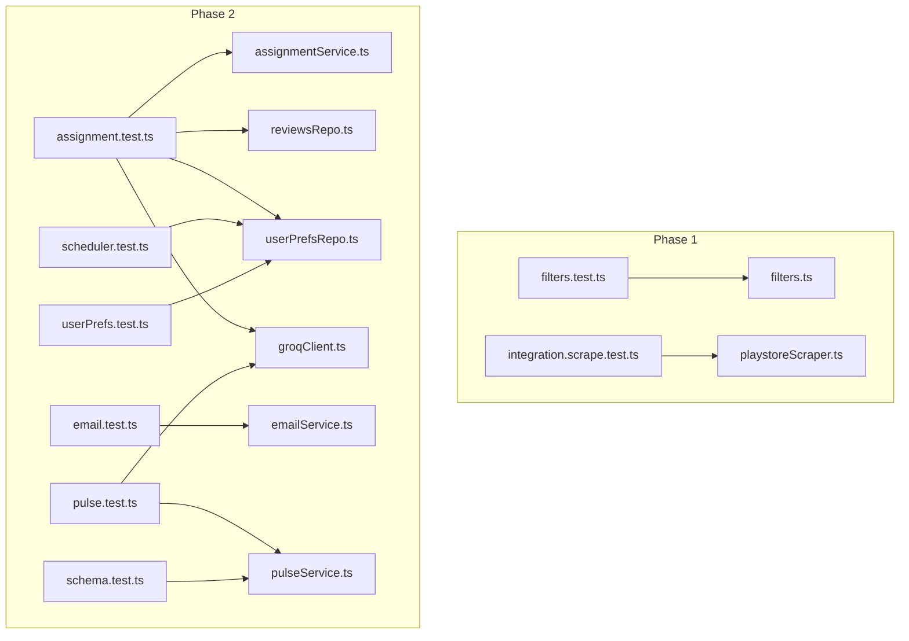
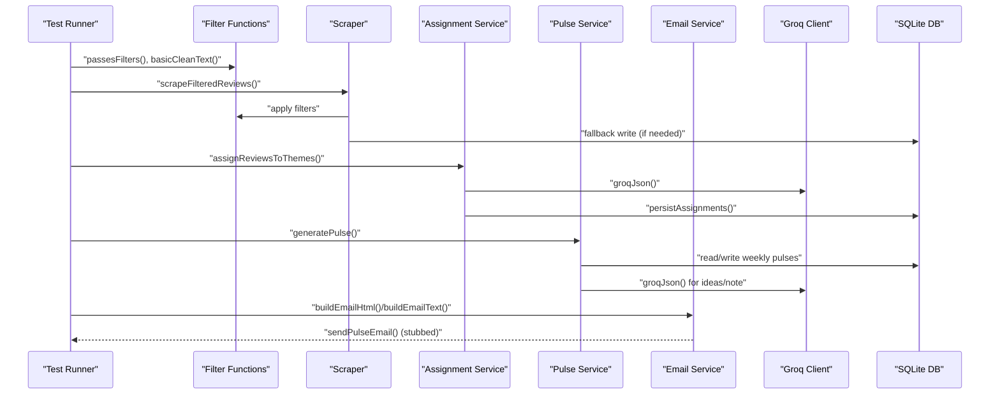
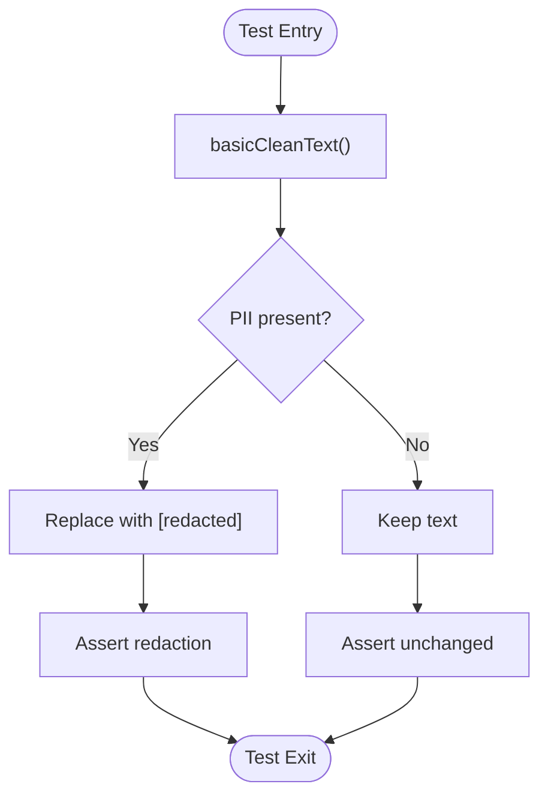
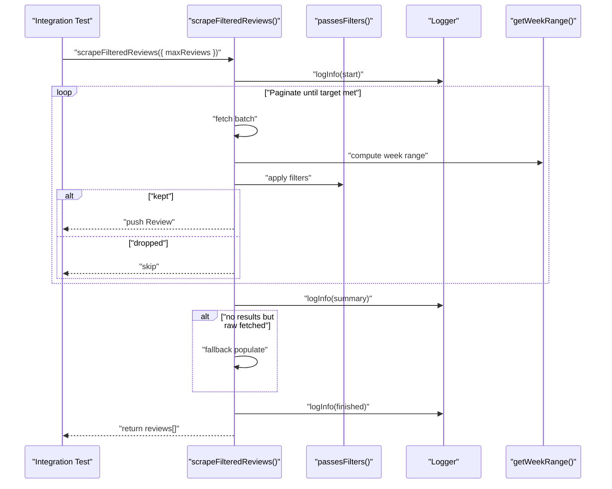
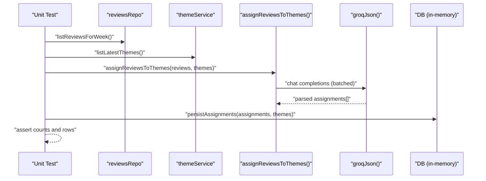
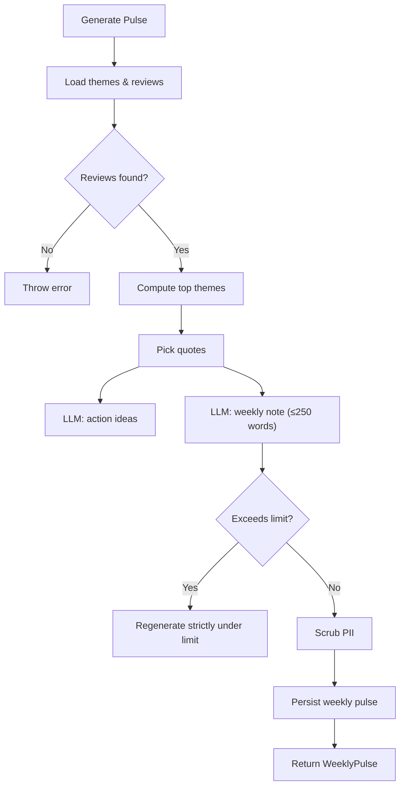
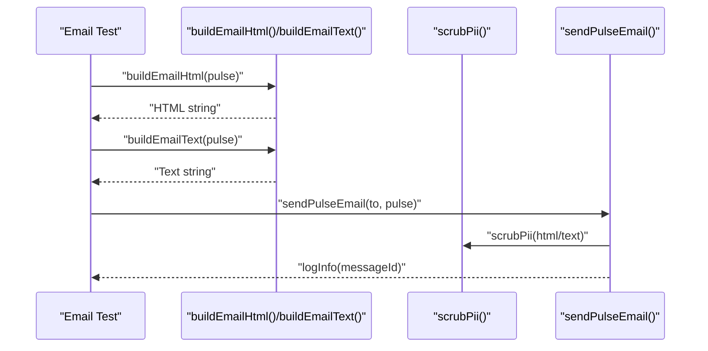
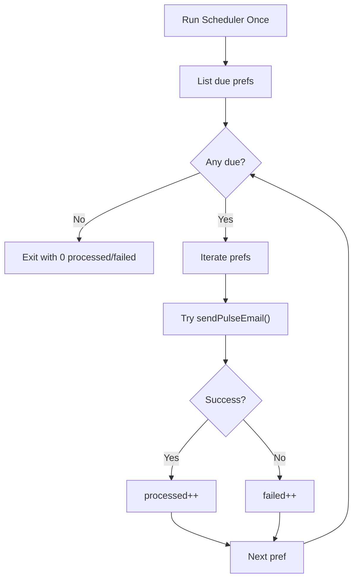
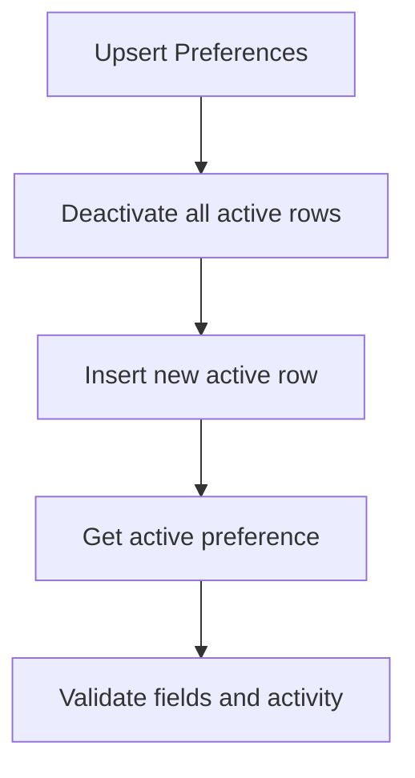
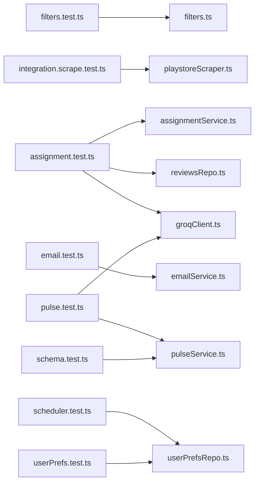

# Testing Strategy

<cite>
**Referenced Files in This Document**
- [filters.test.ts](file://phase-1/src/tests/filters.test.ts)
- [integration.scrape.test.ts](file://phase-1/src/tests/integration.scrape.test.ts)
- [filters.ts](file://phase-1/src/scraper/filters.ts)
- [playstoreScraper.ts](file://phase-1/src/scraper/playstoreScraper.ts)
- [assignment.test.ts](file://phase-2/src/tests/assignment.test.ts)
- [email.test.ts](file://phase-2/src/tests/email.test.ts)
- [pulse.test.ts](file://phase-2/src/tests/pulse.test.ts)
- [scheduler.test.ts](file://phase-2/src/tests/scheduler.test.ts)
- [schema.test.ts](file://phase-2/src/tests/schema.test.ts)
- [userPrefs.test.ts](file://phase-2/src/tests/userPrefs.test.ts)
- [assignmentService.ts](file://phase-2/src/services/assignmentService.ts)
- [emailService.ts](file://phase-2/src/services/emailService.ts)
- [pulseService.ts](file://phase-2/src/services/pulseService.ts)
- [userPrefsRepo.ts](file://phase-2/src/services/userPrefsRepo.ts)
- [reviewsRepo.ts](file://phase-2/src/services/reviewsRepo.ts)
- [groqClient.ts](file://phase-2/src/services/groqClient.ts)
</cite>

## Table of Contents
1. [Introduction](#introduction)
2. [Project Structure](#project-structure)
3. [Core Components](#core-components)
4. [Architecture Overview](#architecture-overview)
5. [Detailed Component Analysis](#detailed-component-analysis)
6. [Dependency Analysis](#dependency-analysis)
7. [Performance Considerations](#performance-considerations)
8. [Troubleshooting Guide](#troubleshooting-guide)
9. [Conclusion](#conclusion)
10. [Appendices](#appendices)

## Introduction
This document defines a comprehensive testing strategy for the Groww App Review Insights Analyzer across phases. It covers unit testing for filter functions, service layers, and utility modules; integration testing for end-to-end workflows including scraping, filtering, LLM interactions, and email delivery; test data management and mocking strategies; environment setup; best practices for asynchronous operations and edge cases; CI patterns, coverage requirements, and quality gates; performance and load testing considerations; and practical debugging strategies for test failures.

## Project Structure
The repository is split into three phases:
- Phase 1: Basic scraping and filtering pipeline with unit and integration tests.
- Phase 2: Advanced orchestration with LLM-based assignment, pulse generation, scheduling, and email delivery, plus extensive unit tests.
- Phase 3: Architectural documentation and README.

Key testing areas:
- Unit tests for filter logic and service functions.
- Integration tests for scraping and end-to-end flows.
- Mocking of external services (Play Store, LLM provider, email transport).
- In-memory database usage for persistence-related tests.
- Environment variable-driven configuration for external integrations.

**Diagram sources**
- [filters.test.ts](file://phase-1/src/tests/filters.test.ts)
- [integration.scrape.test.ts](file://phase-1/src/tests/integration.scrape.test.ts)
- [filters.ts](file://phase-1/src/scraper/filters.ts)
- [playstoreScraper.ts](file://phase-1/src/scraper/playstoreScraper.ts)
- [assignment.test.ts](file://phase-2/src/tests/assignment.test.ts)
- [email.test.ts](file://phase-2/src/tests/email.test.ts)
- [pulse.test.ts](file://phase-2/src/tests/pulse.test.ts)
- [scheduler.test.ts](file://phase-2/src/tests/scheduler.test.ts)
- [userPrefs.test.ts](file://phase-2/src/tests/userPrefs.test.ts)
- [schema.test.ts](file://phase-2/src/tests/schema.test.ts)
- [assignmentService.ts](file://phase-2/src/services/assignmentService.ts)
- [emailService.ts](file://phase-2/src/services/emailService.ts)
- [pulseService.ts](file://phase-2/src/services/pulseService.ts)
- [userPrefsRepo.ts](file://phase-2/src/services/userPrefsRepo.ts)
- [reviewsRepo.ts](file://phase-2/src/services/reviewsRepo.ts)
- [groqClient.ts](file://phase-2/src/services/groqClient.ts)

**Section sources**
- [filters.test.ts](file://phase-1/src/tests/filters.test.ts)
- [integration.scrape.test.ts](file://phase-1/src/tests/integration.scrape.test.ts)
- [assignment.test.ts](file://phase-2/src/tests/assignment.test.ts)
- [email.test.ts](file://phase-2/src/tests/email.test.ts)
- [pulse.test.ts](file://phase-2/src/tests/pulse.test.ts)
- [scheduler.test.ts](file://phase-2/src/tests/scheduler.test.ts)
- [userPrefs.test.ts](file://phase-2/src/tests/userPrefs.test.ts)
- [schema.test.ts](file://phase-2/src/tests/schema.test.ts)

## Core Components
- Filter functions: Text cleaning and review filtering logic.
- Scraper: Play Store review extraction with pagination and fallback behavior.
- Assignment service: LLM-based theme assignment with batching and persistence.
- Pulse service: Aggregation, action idea generation, weekly note generation, and persistence.
- Email service: HTML/text email building and SMTP transport.
- Scheduler and user preferences: Due-date calculation and dispatch orchestration.
- Utilities: Date helpers and environment configuration.

**Section sources**
- [filters.ts](file://phase-1/src/scraper/filters.ts)
- [playstoreScraper.ts](file://phase-1/src/scraper/playstoreScraper.ts)
- [assignmentService.ts](file://phase-2/src/services/assignmentService.ts)
- [pulseService.ts](file://phase-2/src/services/pulseService.ts)
- [emailService.ts](file://phase-2/src/services/emailService.ts)
- [userPrefsRepo.ts](file://phase-2/src/services/userPrefsRepo.ts)
- [reviewsRepo.ts](file://phase-2/src/services/reviewsRepo.ts)
- [groqClient.ts](file://phase-2/src/services/groqClient.ts)

## Architecture Overview
The testing architecture emphasizes isolation and determinism:
- Unit tests validate pure functions and service logic with minimal external dependencies.
- Integration tests exercise end-to-end flows behind environment toggles.
- Mocks replace external systems (Play Store, LLM, SMTP) during unit tests.
- In-memory databases simulate persistent stores for data-dependent logic.

**Diagram sources**
- [filters.ts](file://phase-1/src/scraper/filters.ts)
- [playstoreScraper.ts](file://phase-1/src/scraper/playstoreScraper.ts)
- [assignmentService.ts](file://phase-2/src/services/assignmentService.ts)
- [pulseService.ts](file://phase-2/src/services/pulseService.ts)
- [emailService.ts](file://phase-2/src/services/emailService.ts)
- [groqClient.ts](file://phase-2/src/services/groqClient.ts)
- [userPrefsRepo.ts](file://phase-2/src/services/userPrefsRepo.ts)
- [reviewsRepo.ts](file://phase-2/src/services/reviewsRepo.ts)

## Detailed Component Analysis

### Filter Functions Testing (Phase 1)
Approach:
- Validate text redaction for emails and phone numbers.
- Verify filtering logic for short reviews, emoji presence, duplicates, and signatures.
- Use strict assertions to confirm outcomes.

Best practices:
- Keep tests deterministic by controlling input text and context state.
- Test boundary conditions (e.g., exactly 7 words, whitespace normalization).
- Avoid external I/O; rely on pure functions.

**Diagram sources**
- [filters.ts](file://phase-1/src/scraper/filters.ts)

**Section sources**
- [filters.test.ts](file://phase-1/src/tests/filters.test.ts)
- [filters.ts](file://phase-1/src/scraper/filters.ts)

### Scraper Integration Testing (Phase 1)
Approach:
- Enable via environment toggle to avoid frequent external calls.
- Validate returned structure, IDs, and non-empty arrays.
- Confirm fallback behavior when filters drop all items.

Mocking and environment:
- External Play Store client is exercised; tests remain fast by limiting pages and using small batches.

**Diagram sources**
- [playstoreScraper.ts](file://phase-1/src/scraper/playstoreScraper.ts)
- [filters.ts](file://phase-1/src/scraper/filters.ts)

**Section sources**
- [integration.scrape.test.ts](file://phase-1/src/tests/integration.scrape.test.ts)
- [playstoreScraper.ts](file://phase-1/src/scraper/playstoreScraper.ts)

### Assignment Service Testing (Phase 2)
Approach:
- Use in-memory SQLite to simulate schema and data.
- Stub LLM calls to avoid flakiness and cost.
- Validate assignment persistence and schema compatibility.

Key validations:
- Empty inputs return empty outputs.
- Confidence field is optional in schema.
- Persistence inserts and upserts correctly; unknown themes are skipped.

**Diagram sources**
- [assignment.test.ts](file://phase-2/src/tests/assignment.test.ts)
- [assignmentService.ts](file://phase-2/src/services/assignmentService.ts)
- [reviewsRepo.ts](file://phase-2/src/services/reviewsRepo.ts)
- [groqClient.ts](file://phase-2/src/services/groqClient.ts)

**Section sources**
- [assignment.test.ts](file://phase-2/src/tests/assignment.test.ts)
- [assignmentService.ts](file://phase-2/src/services/assignmentService.ts)
- [groqClient.ts](file://phase-2/src/services/groqClient.ts)

### Pulse Generation Testing (Phase 2)
Approach:
- Validate PII scrubbing behavior in text and HTML.
- Enforce word limits for weekly notes with retries.
- Ensure shape validation for top themes and lists.

Edge cases:
- Over-limit note triggers re-generation.
- Unknown themes are ignored in persistence.
- Empty inputs handled gracefully.

**Diagram sources**
- [pulse.test.ts](file://phase-2/src/tests/pulse.test.ts)
- [pulseService.ts](file://phase-2/src/services/pulseService.ts)
- [groqClient.ts](file://phase-2/src/services/groqClient.ts)

**Section sources**
- [pulse.test.ts](file://phase-2/src/tests/pulse.test.ts)
- [pulseService.ts](file://phase-2/src/services/pulseService.ts)

### Email Service Testing (Phase 2)
Approach:
- Validate HTML and text templates include required sections and content.
- Confirm PII is not introduced by the builder; scrubbing is delegated to the sender.
- Verify subject includes the week start date.

**Diagram sources**
- [email.test.ts](file://phase-2/src/tests/email.test.ts)
- [emailService.ts](file://phase-2/src/services/emailService.ts)
- [pulseService.ts](file://phase-2/src/services/pulseService.ts)

**Section sources**
- [email.test.ts](file://phase-2/src/tests/email.test.ts)
- [emailService.ts](file://phase-2/src/services/emailService.ts)

### Scheduler and User Preferences Testing (Phase 2)
Approach:
- Validate nextSendUtc calculations across week boundaries and time zones.
- Simulate dispatch counts for success and failure paths.
- Use stubs for email sender to isolate scheduler logic.

**Diagram sources**
- [scheduler.test.ts](file://phase-2/src/tests/scheduler.test.ts)
- [userPrefsRepo.ts](file://phase-2/src/services/userPrefsRepo.ts)
- [emailService.ts](file://phase-2/src/services/emailService.ts)

**Section sources**
- [scheduler.test.ts](file://phase-2/src/tests/scheduler.test.ts)
- [userPrefsRepo.ts](file://phase-2/src/services/userPrefsRepo.ts)

### User Preferences CRUD Testing (Phase 2)
Approach:
- Build in-memory schema and mirror repository logic.
- Upsert deactivates previous active rows and activates new ones.
- Retrieve active preferences correctly.

**Diagram sources**
- [userPrefs.test.ts](file://phase-2/src/tests/userPrefs.test.ts)
- [userPrefsRepo.ts](file://phase-2/src/services/userPrefsRepo.ts)

**Section sources**
- [userPrefs.test.ts](file://phase-2/src/tests/userPrefs.test.ts)
- [userPrefsRepo.ts](file://phase-2/src/services/userPrefsRepo.ts)

### Schema Validation Testing (Phase 2)
Approach:
- Validate Zod parsing in the test environment.
- Ensure typed objects conform to schemas used across services.

**Section sources**
- [schema.test.ts](file://phase-2/src/tests/schema.test.ts)

## Dependency Analysis
Testing dependencies and coupling:
- Unit tests depend on pure functions and in-memory DBs; they avoid external I/O.
- Integration tests depend on environment flags and external APIs.
- Service tests depend on mocks for LLM and email transport.
- Coupling is minimized by injecting dependencies and using stubs.

**Diagram sources**
- [filters.test.ts](file://phase-1/src/tests/filters.test.ts)
- [integration.scrape.test.ts](file://phase-1/src/tests/integration.scrape.test.ts)
- [assignment.test.ts](file://phase-2/src/tests/assignment.test.ts)
- [email.test.ts](file://phase-2/src/tests/email.test.ts)
- [pulse.test.ts](file://phase-2/src/tests/pulse.test.ts)
- [scheduler.test.ts](file://phase-2/src/tests/scheduler.test.ts)
- [userPrefs.test.ts](file://phase-2/src/tests/userPrefs.test.ts)
- [schema.test.ts](file://phase-2/src/tests/schema.test.ts)
- [filters.ts](file://phase-1/src/scraper/filters.ts)
- [playstoreScraper.ts](file://phase-1/src/scraper/playstoreScraper.ts)
- [assignmentService.ts](file://phase-2/src/services/assignmentService.ts)
- [emailService.ts](file://phase-2/src/services/emailService.ts)
- [pulseService.ts](file://phase-2/src/services/pulseService.ts)
- [userPrefsRepo.ts](file://phase-2/src/services/userPrefsRepo.ts)
- [reviewsRepo.ts](file://phase-2/src/services/reviewsRepo.ts)
- [groqClient.ts](file://phase-2/src/services/groqClient.ts)

**Section sources**
- [filters.test.ts](file://phase-1/src/tests/filters.test.ts)
- [integration.scrape.test.ts](file://phase-1/src/tests/integration.scrape.test.ts)
- [assignment.test.ts](file://phase-2/src/tests/assignment.test.ts)
- [email.test.ts](file://phase-2/src/tests/email.test.ts)
- [pulse.test.ts](file://phase-2/src/tests/pulse.test.ts)
- [scheduler.test.ts](file://phase-2/src/tests/scheduler.test.ts)
- [userPrefs.test.ts](file://phase-2/src/tests/userPrefs.test.ts)
- [schema.test.ts](file://phase-2/src/tests/schema.test.ts)

## Performance Considerations
- Asynchronous operations:
  - Use timeouts and structured concurrency to prevent resource leaks.
  - Batch LLM calls to control token usage and rate limits.
- Filtering and scraping:
  - Limit pagination depth and batch sizes to bound runtime.
  - Apply early exits when thresholds are met.
- Database operations:
  - Use transactions for bulk inserts to reduce overhead.
  - Prefer indexed queries for frequently accessed keys.
- External services:
  - Introduce retry/backoff with jitter for LLM calls.
  - Use connection pooling for SMTP where applicable.

[No sources needed since this section provides general guidance]

## Troubleshooting Guide
Common issues and resolutions:
- Missing environment variables:
  - Ensure SMTP credentials and Groq API key are configured; tests should fail fast with descriptive errors.
- Flaky LLM responses:
  - Validate JSON extraction and retry logic; tests should assert robustness.
- Email template mismatches:
  - Verify inclusion of required sections and placeholders; assert presence of week start date.
- Scheduler edge cases:
  - Validate nextSendUtc across week boundaries and time zone approximations.
- Database inconsistencies:
  - Use in-memory DB fixtures to replicate schema and data precisely.

Debugging strategies:
- Add granular logs around critical steps (batch fetch, filter decisions, LLM prompts).
- Capture and assert intermediate structures (assignments, top themes, quotes).
- Use deterministic fixtures and controlled time references for scheduling tests.

**Section sources**
- [emailService.ts](file://phase-2/src/services/emailService.ts)
- [groqClient.ts](file://phase-2/src/services/groqClient.ts)
- [userPrefsRepo.ts](file://phase-2/src/services/userPrefsRepo.ts)

## Conclusion
The testing strategy balances unit rigor with pragmatic integration coverage. By isolating external dependencies, leveraging in-memory databases, and validating critical behaviors (PII scrubbing, schema compliance, batching, and scheduling), the suite ensures reliability across phases. Extending coverage to include performance and load tests will further strengthen confidence in production deployments.

[No sources needed since this section summarizes without analyzing specific files]

## Appendices

### Test Data Management
- Use fixtures for LLM prompts and expected outputs to maintain repeatability.
- For database-backed tests, construct schema and seed data inline to avoid shared state.
- Snapshot-like assertions for HTML/text bodies to detect unintended changes.

[No sources needed since this section provides general guidance]

### Mock Strategies for External Services
- Play Store scraper: Limit pagination and return synthetic batches in unit tests.
- Groq client: Stub chat completions to return deterministic JSON; assert prompt construction and schema hints.
- SMTP transport: Stub nodemailer to record send calls without network I/O.

[No sources needed since this section provides general guidance]

### Test Environment Setup
- Node.js built-in test runner with strict assertions.
- Environment variables for SMTP and Groq; optional integration flag for scraping tests.
- In-memory SQLite for persistence tests; ensure migrations are mirrored in tests.

[No sources needed since this section provides general guidance]

### Continuous Integration Patterns
- Quality gates:
  - Fail builds on test failures or uncaught exceptions.
  - Enforce minimum coverage thresholds for critical modules.
- Parallelization:
  - Run independent suites concurrently; serialize integration tests gated by environment flags.
- Artifacts:
  - Capture logs and test reports; retain snapshots for template validation.

[No sources needed since this section provides general guidance]